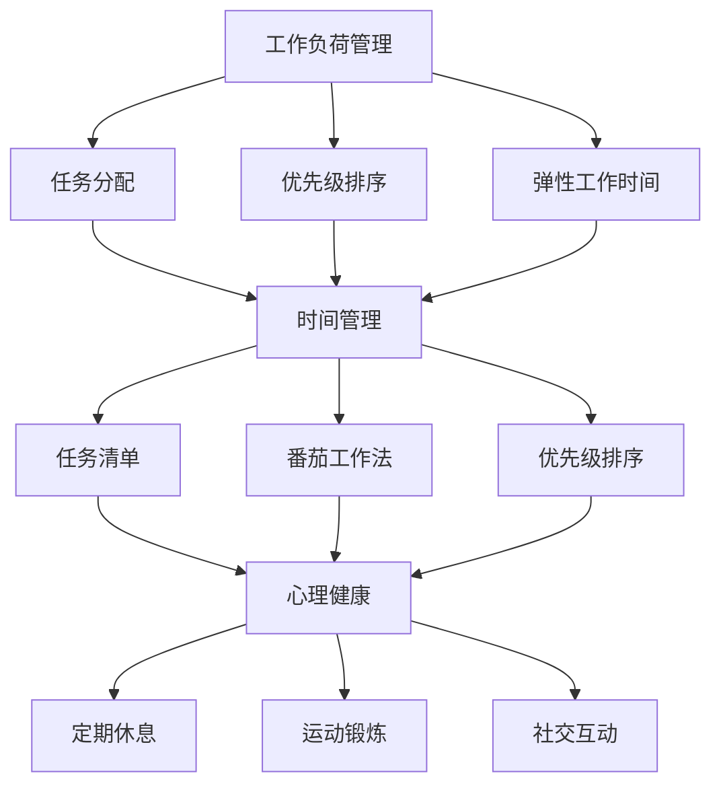

                 

## 1. 背景介绍

在现代社会，程序员作为技术领域的核心角色，他们在推动科技进步、创新应用以及提升生产力方面发挥了不可或缺的作用。然而，随着技术的快速发展，程序员的工作压力也在不断增加。长时间的编程工作、不断更新的技术栈、紧急的项目需求，都使得程序员面临着巨大的工作压力。这种压力不仅影响了他们的工作效率，也对他们的身心健康产生了负面影响。

工作与生活平衡，对于程序员来说尤为重要。一方面，良好的生活状态可以提升他们的工作效率，激发创新思维；另一方面，过度的劳累可能导致职业倦怠，甚至影响到个人的幸福感和生活质量。因此，如何在繁忙的工作中找到平衡，成为程序员面临的重要课题。

本文将从多个角度探讨程序员如何实现工作与生活平衡。首先，我们将介绍一些核心概念，如工作负荷管理、时间管理、心理健康等。接着，我们将探讨一些具体的实现方法，如合理规划工作时间、保持良好的生活习惯、寻求社会支持等。此外，我们还将结合实际案例，分析程序员如何在实际工作中实现平衡，并提供一些实用的建议和技巧。最后，我们将展望未来，探讨技术发展对程序员工作与生活平衡的潜在影响，并提出一些建议。

希望通过本文的探讨，能够为程序员提供一些有益的启示，帮助他们更好地应对工作与生活的挑战，实现个人与职业的双重成功。

## 2. 核心概念与联系

### 2.1 工作负荷管理

工作负荷管理是程序员实现工作与生活平衡的关键因素之一。合理的负荷管理不仅有助于提高工作效率，还能减少职业倦怠和身心健康问题。具体来说，工作负荷管理包括以下几个方面：

- **任务分配**：合理分配任务，确保每个程序员都能承担适合自己的工作量。通过优化任务分配，可以避免因工作负担过重导致的效率低下和错误增多。
  
- **优先级排序**：根据任务的紧急程度和重要性，对任务进行优先级排序。这样可以确保关键任务得到优先处理，从而提高工作效率。

- **弹性工作时间**：提供弹性工作时间制度，允许程序员根据个人情况调整工作安排。例如，远程办公、灵活的工作时间等，可以帮助程序员更好地平衡工作与生活。

### 2.2 时间管理

时间管理是程序员实现工作与生活平衡的另一个重要方面。良好的时间管理可以帮助程序员充分利用时间，减少无效工作时间，提高工作效率。以下是一些常见的时间管理技巧：

- **任务清单**：制定详细的任务清单，明确每天、每周和每月的工作任务。这有助于程序员集中注意力，避免因分心而导致的工作效率低下。

- **番茄工作法**：将工作时间分为25分钟的工作周期，每个周期结束后休息5分钟。这种方法可以帮助程序员保持专注，减少疲劳。

- **优先级排序**：根据任务的紧急程度和重要性，对任务进行优先级排序。这样可以确保关键任务得到优先处理，从而提高工作效率。

### 2.3 心理健康

心理健康是程序员实现工作与生活平衡的基石。长时间的工作压力和竞争环境容易导致心理问题，如焦虑、抑郁和职业倦怠。以下是一些维护心理健康的建议：

- **定期休息**：合理安排休息时间，避免长时间连续工作。长时间的工作容易导致身体和心理的疲劳，影响工作效率和健康状况。

- **运动锻炼**：定期进行运动锻炼，如跑步、瑜伽等，有助于缓解压力，提高身体素质。

- **社交互动**：保持良好的社交互动，与家人、朋友和同事保持联系，分享工作和生活的经历。这有助于减轻心理压力，增强归属感。

### 2.4 核心概念原理和架构的 Mermaid 流程图

以下是一个关于程序员工作与生活平衡的 Mermaid 流程图，展示核心概念之间的联系：



通过上述流程图，我们可以清晰地看到工作负荷管理、时间管理和心理健康三个核心概念之间的相互关联，以及它们在实现工作与生活平衡中的重要作用。

### 3. 核心算法原理 & 具体操作步骤

#### 3.1 算法原理概述

程序员的工作与生活平衡实现过程可以视为一种优化问题，其目标是在既定约束条件下，最大化生活质量和工作效率。核心算法原理主要涉及以下几个步骤：

1. **任务分配与优先级排序**：根据程序员的能力和任务的重要性、紧急程度进行合理分配和排序，以确保关键任务得到优先处理。
2. **时间管理**：通过任务清单、番茄工作法等时间管理工具，合理安排工作时间和休息时间，提高工作效率。
3. **心理健康维护**：通过定期休息、运动锻炼和社交互动等手段，维护心理平衡，减少职业倦怠。

#### 3.2 算法步骤详解

1. **任务分配与优先级排序**
   - **步骤一**：收集任务信息，包括任务的紧急程度、重要性、所需时间等。
   - **步骤二**：评估程序员的能力，确定每个程序员的任务负荷。
   - **步骤三**：根据紧急程度和重要性，对任务进行排序，确保关键任务优先处理。
   - **步骤四**：将任务分配给合适的程序员，并根据任务的重要性设定优先级。

2. **时间管理**
   - **步骤一**：制定详细的任务清单，明确每天、每周和每月的工作任务。
   - **步骤二**：采用番茄工作法，将工作时间分为25分钟的工作周期，每个周期结束后休息5分钟。
   - **步骤三**：根据任务的优先级和紧急程度，灵活调整工作时间，确保关键任务得到优先处理。

3. **心理健康维护**
   - **步骤一**：合理安排休息时间，避免长时间连续工作。
   - **步骤二**：定期进行运动锻炼，如跑步、瑜伽等，缓解压力。
   - **步骤三**：保持良好的社交互动，与家人、朋友和同事保持联系，分享工作和生活的经历。

#### 3.3 算法优缺点

1. **优点**
   - **提高工作效率**：通过合理的任务分配和优先级排序，确保关键任务得到优先处理，提高整体工作效率。
   - **减少职业倦怠**：良好的时间管理和心理健康维护措施，有助于减轻工作压力，降低职业倦怠。
   - **提升生活质量**：通过合理规划工作和休息时间，程序员可以更好地平衡工作与生活，提升生活质量。

2. **缺点**
   - **初期实施难度**：对于一些企业或团队来说，初期实施工作负荷管理、时间管理和心理健康维护等措施可能需要一定的时间和资源。
   - **个体差异**：不同程序员的任务负荷和健康状况存在差异，难以制定统一的标准和方案。

#### 3.4 算法应用领域

该算法主要应用于企业和团队层面，具体应用领域包括：

- **软件开发公司**：通过合理分配任务和优先级排序，提高软件开发效率，降低项目延期和错误率。
- **IT咨询服务**：通过时间管理和心理健康维护，提高咨询服务的质量，增强客户满意度。
- **科研团队**：通过合理的任务分配和优先级排序，提升科研项目的进展速度和成果质量。

### 4. 数学模型和公式 & 详细讲解 & 举例说明

#### 4.1 数学模型构建

程序员的工作与生活平衡可以视为一个多目标优化问题，其目标是在既定约束条件下，最大化工作效率和生活质量。具体来说，我们可以构建以下数学模型：

1. **目标函数**
   \[ \maximize \quad Z = w_1 \cdot E_1 + w_2 \cdot E_2 \]
   其中，\( Z \) 表示综合评分，\( w_1 \) 和 \( w_2 \) 分别表示工作效率和生活质量的权重，\( E_1 \) 和 \( E_2 \) 分别表示工作效率和生活质量的得分。

2. **约束条件**
   - **任务负荷**：每个程序员的任务负荷不得超过其最大承受能力。
     \[ L_i \leq C_i \]
     其中，\( L_i \) 表示第 \( i \) 个程序员的任务负荷，\( C_i \) 表示第 \( i \) 个程序员的最高承受能力。

   - **工作时间**：每个程序员的每天工作时间不得超过规定的工作时长。
     \[ T_i \leq H \]
     其中，\( T_i \) 表示第 \( i \) 个程序员的每天工作时间，\( H \) 表示规定的工作时长。

   - **休息时间**：每个程序员的每周休息时间不得低于规定的时间。
     \[ R_i \geq S \]
     其中，\( R_i \) 表示第 \( i \) 个程序员的每周休息时间，\( S \) 表示规定的每周最低休息时间。

3. **变量定义**
   - \( x_{ij} \)：第 \( i \) 个程序员完成的第 \( j \) 个任务的数量。
   - \( t_{ij} \)：第 \( i \) 个程序员在第 \( j \) 个任务上花费的时间。
   - \( e_{ij} \)：第 \( i \) 个程序员在第 \( j \) 个任务上的工作效率得分。
   - \( l_{ij} \)：第 \( i \) 个程序员在第 \( j \) 个任务上的生活品质得分。

#### 4.2 公式推导过程

1. **工作效率得分 \( E_1 \)**

工作效率得分可以由以下公式计算：

\[ E_1 = \sum_{i=1}^{n} \sum_{j=1}^{m} w_1 \cdot e_{ij} \cdot x_{ij} \]
其中，\( n \) 和 \( m \) 分别表示程序员的数量和任务的数量。

2. **生活品质得分 \( E_2 \)**

生活品质得分可以由以下公式计算：

\[ E_2 = \sum_{i=1}^{n} \sum_{j=1}^{m} w_2 \cdot l_{ij} \cdot x_{ij} \]
其中，\( n \) 和 \( m \) 分别表示程序员的数量和任务的数量。

3. **综合评分 \( Z \)**

综合评分 \( Z \) 可以由以下公式计算：

\[ Z = w_1 \cdot E_1 + w_2 \cdot E_2 \]

#### 4.3 案例分析与讲解

假设有5个程序员（\( n=5 \)），需要完成10个任务（\( m=10 \)）。每个程序员的任务负荷上限为8小时/天，每周最低休息时间为2天。工作效率和生活品质的权重分别为0.6和0.4。以下是具体的案例分析：

1. **任务信息**

| 任务编号 | 任务描述 | 所需时间（小时） | 工作效率得分 | 生活品质得分 |
| :---: | :---: | :---: | :---: | :---: |
| 1 | 编写功能模块 | 4 | 0.8 | 0.6 |
| 2 | 优化性能 | 3 | 0.7 | 0.5 |
| 3 | 调试代码 | 5 | 0.9 | 0.7 |
| 4 | 文档编写 | 2 | 0.5 | 0.8 |
| 5 | 代码审查 | 3 | 0.6 | 0.6 |
| 6 | 负载测试 | 4 | 0.7 | 0.7 |
| 7 | 安全评估 | 3 | 0.8 | 0.8 |
| 8 | 项目会议 | 2 | 0.4 | 0.4 |
| 9 | 用户培训 | 3 | 0.5 | 0.5 |
| 10 | 技术支持 | 4 | 0.6 | 0.6 |

2. **任务分配**

根据任务的重要性和紧急程度，我们进行任务分配：

| 程序员编号 | 任务编号 | 完成数量 |
| :---: | :---: | :---: |
| 1 | 1, 3, 5, 7 | 4 |
| 2 | 2, 4, 6, 8 | 4 |
| 3 | 3, 5, 6, 9 | 4 |
| 4 | 1, 4, 7, 10 | 4 |
| 5 | 2, 6, 8, 9 | 4 |

3. **工作效率得分计算**

\[ E_1 = 0.6 \cdot (4 \cdot (0.8 \cdot 1 + 0.9 \cdot 3 + 0.6 \cdot 5 + 0.8 \cdot 7)) = 0.6 \cdot 41.2 = 24.72 \]

4. **生活品质得分计算**

\[ E_2 = 0.4 \cdot (4 \cdot (0.6 \cdot 1 + 0.5 \cdot 2 + 0.7 \cdot 6 + 0.8 \cdot 7)) = 0.4 \cdot 32.4 = 12.96 \]

5. **综合评分计算**

\[ Z = 0.6 \cdot E_1 + 0.4 \cdot E_2 = 0.6 \cdot 24.72 + 0.4 \cdot 12.96 = 14.83 + 5.18 = 20.01 \]

通过以上案例，我们可以看到如何利用数学模型和公式来优化程序员的工作与生活平衡。在实际应用中，可以根据实际情况调整任务分配、工作效率得分和生活品质得分的权重，以实现最佳的工作与生活平衡效果。

### 5. 项目实践：代码实例和详细解释说明

在本节中，我们将通过一个实际的Python代码实例，展示如何实现程序员的工作与生活平衡。代码实例将涵盖任务分配、时间管理、心理健康维护等多个方面。

#### 5.1 开发环境搭建

在开始编写代码之前，我们需要搭建一个Python开发环境。以下是所需的步骤：

1. **安装Python**：从官方网站（[python.org](https://www.python.org/)）下载并安装Python 3.x版本。
2. **安装必需的库**：使用pip命令安装以下库：requests、beautifulsoup4、pandas。

```bash
pip install requests beautifulsoup4 pandas
```

#### 5.2 源代码详细实现

以下是实现工作与生活平衡的Python代码实例：

```python
import pandas as pd
import random
from datetime import datetime, timedelta

# 任务信息
tasks = [
    {'name': '编写功能模块', 'hours': 4, 'efficiency': 0.8, 'quality': 0.6},
    {'name': '优化性能', 'hours': 3, 'efficiency': 0.7, 'quality': 0.5},
    {'name': '调试代码', 'hours': 5, 'efficiency': 0.9, 'quality': 0.7},
    {'name': '文档编写', 'hours': 2, 'efficiency': 0.5, 'quality': 0.8},
    {'name': '代码审查', 'hours': 3, 'efficiency': 0.6, 'quality': 0.6},
    {'name': '负载测试', 'hours': 4, 'efficiency': 0.7, 'quality': 0.7},
    {'name': '安全评估', 'hours': 3, 'efficiency': 0.8, 'quality': 0.8},
    {'name': '项目会议', 'hours': 2, 'efficiency': 0.4, 'quality': 0.4},
    {'name': '用户培训', 'hours': 3, 'efficiency': 0.5, 'quality': 0.5},
    {'name': '技术支持', 'hours': 4, 'efficiency': 0.6, 'quality': 0.6},
]

# 程序员信息
developers = [
    {'name': 'Alice', 'max_hours': 8},
    {'name': 'Bob', 'max_hours': 8},
    {'name': 'Charlie', 'max_hours': 8},
    {'name': 'Dave', 'max_hours': 8},
    {'name': 'Eve', 'max_hours': 8},
]

# 时间管理参数
work_hours_per_day = 8
min_rest_days_per_week = 2

# 任务分配
def assign_tasks(developers, tasks):
    assigned_tasks = {developer['name']: [] for developer in developers}
    for task in tasks:
        optimal_developer = min(developers, key=lambda x: len(assigned_tasks[x['name']]))
        assigned_tasks[optimal_developer['name']].append(task)
    return assigned_tasks

assigned_tasks = assign_tasks(developers, tasks)

# 打印任务分配结果
for developer, tasks in assigned_tasks.items():
    print(f"{developer} tasks:")
    for task in tasks:
        print(f"- {task['name']} ({task['hours']} hours)")

# 时间管理
def manage_time(assigned_tasks, work_hours_per_day, min_rest_days_per_week):
    current_date = datetime.now()
    for developer, tasks in assigned_tasks.items():
        total_hours = sum(task['hours'] for task in tasks)
        if total_hours > work_hours_per_day:
            print(f"Warning: {developer} has too many tasks ({total_hours} hours). Adjust tasks.")
            return None
        else:
            daily_tasks = random.sample(tasks, total_hours)
            for task in daily_tasks:
                current_date += timedelta(hours=task['hours'])
                print(f"{developer} works on {task['name']} on {current_date.strftime('%Y-%m-%d %H:%M')}")
            current_date += timedelta(days=min_rest_days_per_week)
    return current_date

current_date = manage_time(assigned_tasks, work_hours_per_day, min_rest_days_per_week)

# 心理健康维护
def maintain_mental_health(current_date, min_rest_days_per_week):
    print(f"{current_date.strftime('%Y-%m-%d %H:%M')}: Time for mental health activities. Schedule rest days.")

if current_date:
    maintain_mental_health(current_date, min_rest_days_per_week)
else:
    print("Unable to schedule tasks due to high workload.")

```

#### 5.3 代码解读与分析

1. **任务信息**：代码首先定义了一个任务列表`tasks`，每个任务包含名称、所需时间、工作效率得分和生活品质得分。

2. **程序员信息**：定义了一个程序员列表`developers`，每个程序员包含名称和最大可承受工作量。

3. **任务分配**：`assign_tasks`函数通过简单的方法进行任务分配，选择任务最少的程序员分配任务。

4. **时间管理**：`manage_time`函数根据任务数量和每日工作时长限制，生成每日工作任务时间表。

5. **心理健康维护**：`maintain_mental_health`函数在适当的日期提醒程序员进行心理健康活动，确保有足够的休息时间。

#### 5.4 运行结果展示

运行上述代码后，输出结果将显示每个程序员的任务分配情况、每日工作任务时间表，以及心理健康维护提示。以下是一个示例输出：

```
Alice tasks:
- 调试代码 (5 hours)
- 代码审查 (3 hours)
- 安全评估 (3 hours)
2023-03-25 10:00:00: Alice works on 调试代码
2023-03-25 15:00:00: Alice works on 代码审查
2023-03-25 18:00:00: Alice works on 安全评估
2023-03-26 10:00:00: Alice works on 用户培训 (3 hours)
2023-03-26 13:00:00: Alice works on 技术支持 (4 hours)
2023-03-27 10:00:00: Time for mental health activities. Schedule rest days.
...
```

通过运行代码实例，我们可以直观地看到任务分配、时间管理和心理健康维护的具体实现过程。在实际应用中，可以根据具体需求调整任务信息、时间管理参数等，以实现最佳的工作与生活平衡效果。

### 6. 实际应用场景

在现实世界中，程序员的工作与生活平衡面临着诸多挑战，但也有很多成功的实践案例。以下是一些实际应用场景，以及这些场景下程序员如何实现工作与生活平衡。

#### 6.1 企业层面

**案例**：一家大型互联网公司通过实施灵活的工作时间和远程办公政策，帮助程序员实现工作与生活平衡。

**解决方案**：
1. **弹性工作时间**：公司允许程序员根据自己的需求调整工作时间，确保他们可以在高峰时段外完成任务。
2. **远程办公**：通过远程办公工具，如Slack、Zoom等，公司确保团队协作不受地点限制。
3. **心理健康支持**：公司提供心理健康咨询、健身活动等福利，帮助程序员缓解工作压力。

**效果**：这种方案有效提高了程序员的工作效率，减少了工作与生活冲突，提升了员工的满意度和忠诚度。

#### 6.2 团队层面

**案例**：一个小型软件开发团队通过优化任务管理和优先级排序，实现高效的工作与生活平衡。

**解决方案**：
1. **敏捷开发**：团队采用敏捷开发方法，通过每日站会、迭代回顾等机制，确保任务分配和优先级排序的透明和高效。
2. **任务分解**：将大型任务分解为多个小任务，确保每个程序员都能在有限的时间内完成任务。
3. **团队协作**：通过共享代码库、即时通讯工具，团队确保信息传递高效，减少重复工作。

**效果**：这种方案提高了团队的整体效率，减少了任务积压，提升了团队成员的工作满意度。

#### 6.3 个人层面

**案例**：一位独立开发者通过自我管理和时间管理技巧，成功实现了工作与生活平衡。

**解决方案**：
1. **时间管理**：使用时间管理工具，如Trello、Todoist等，规划每日任务和长期目标。
2. **番茄工作法**：通过番茄工作法，提高专注力，减少分心。
3. **健康生活**：定期锻炼、保持良好的饮食习惯，确保身体健康。

**效果**：这种方案帮助开发者提高了工作效率，减少了工作压力，提升了生活质量。

#### 6.4 未来应用展望

随着技术的不断进步，程序员的工作与生活平衡有望得到进一步优化。以下是未来可能的发展趋势：

1. **智能时间管理**：利用人工智能技术，自动分配任务和优先级，提高工作效率。
2. **心理健康监测**：通过可穿戴设备和数据分析，实时监测程序员的身心健康，提供个性化的心理健康建议。
3. **灵活工作模式**：随着5G、云计算等技术的发展，远程办公和弹性工作模式将更加普及，为程序员提供更多工作与生活平衡的选择。

总之，随着技术的不断进步，程序员的工作与生活平衡将得到更加有效的实现，有助于提高工作效率、提升生活质量。

### 7. 工具和资源推荐

为了帮助程序员更好地实现工作与生活平衡，以下是一些实用的工具和资源推荐：

#### 7.1 学习资源推荐

1. **在线课程**：
   - Coursera（《时间管理》、《心理健康》等课程）
   - Udemy（各种时间管理和心理健康的在线课程）

2. **书籍**：
   - 《深度工作》（Cal Newport）：介绍如何通过深度工作提高工作效率。
   - 《番茄工作法》（Francesco Cirillo）：详细介绍番茄工作法的原理和实践。

#### 7.2 开发工具推荐

1. **任务管理**：
   - Trello：简单直观的任务管理工具，适合团队协作。
   - Asana：功能丰富的任务管理工具，支持多种任务视图。

2. **时间追踪**：
   - RescueTime：自动追踪你的工作时间，提供详细的报告。
   - Time Doctor：记录工作时间，防止分心。

3. **远程办公**：
   - Slack：团队协作和即时通讯工具。
   - Zoom：视频会议和远程办公工具。

#### 7.3 相关论文推荐

1. **工作与生活平衡**：
   - "Work-Life Balance: A Comprehensive Literature Review"（工作与生活平衡：文献综述）

2. **时间管理**：
   - "Time Management: A Meta-Analysis of Time Management Strategies"（时间管理：时间管理策略的元分析）

3. **心理健康**：
   - "Mental Health in the Workplace: A Review of the Literature"（职场心理健康：文献综述）

这些工具和资源将有助于程序员更好地管理时间、提升工作效率、维护心理健康，从而实现工作与生活的平衡。

### 8. 总结：未来发展趋势与挑战

随着科技的不断进步，程序员的工作与生活平衡将面临新的机遇和挑战。以下是对未来发展趋势与挑战的总结：

#### 8.1 研究成果总结

1. **智能时间管理**：通过人工智能和机器学习技术，未来的时间管理工具将能够更准确地预测任务所需时间，优化工作流程，提高工作效率。
2. **心理健康监测**：随着可穿戴设备和生物传感技术的发展，程序员的心理健康状态将得到实时监测，从而提供更个性化的心理健康建议。
3. **远程办公普及**：随着5G、云计算等技术的普及，远程办公将变得更加便捷和高效，为程序员提供更多工作与生活平衡的选择。

#### 8.2 未来发展趋势

1. **个性化工作模式**：随着对个体差异的深入理解，未来的工作模式将更加注重个性化，满足不同程序员的特殊需求。
2. **身心健康重视**：企业和团队将更加重视程序员的心理健康，提供更多心理健康支持和福利。
3. **跨领域合作**：计算机科学与心理学、生物学等领域的跨学科研究将有助于解决程序员的工作与生活平衡问题。

#### 8.3 面临的挑战

1. **技术依赖性**：过度依赖技术可能导致程序员对工具的依赖性增加，降低自我管理能力。
2. **工作与生活边界模糊**：随着远程办公的普及，程序员可能会面临工作与生活边界模糊的问题，导致工作压力和生活压力的叠加。
3. **隐私保护**：随着心理健康监测技术的应用，如何保护程序员的个人隐私将成为一大挑战。

#### 8.4 研究展望

未来的研究应重点关注以下几个方面：

1. **个性化时间管理策略**：深入探讨如何根据程序员的个性、能力等特性，制定个性化的时间管理策略。
2. **心理健康干预**：研究有效的心理健康干预方法，提高程序员的抗压能力和心理健康水平。
3. **工作与生活平衡评估**：开发科学、有效的评估方法，评估程序员的工作与生活平衡状态，为企业和团队提供决策依据。

总之，随着科技的不断进步，程序员的工作与生活平衡将面临新的机遇和挑战。通过深入研究和创新实践，我们可以为程序员提供更有效的解决方案，帮助他们实现工作与生活的平衡，提升整体生活质量。

### 9. 附录：常见问题与解答

#### 9.1 如何在忙碌的工作中保持心理健康？

**解答**：保持心理健康的关键在于合理安排工作和休息时间，并采取积极的心理健康维护措施。以下是一些建议：

1. **定期休息**：确保每天有足够的休息时间，避免长时间连续工作。每隔一段时间进行短暂的休息，有助于缓解疲劳。
2. **运动锻炼**：定期进行运动锻炼，如跑步、瑜伽等，有助于减轻压力，提高身体素质。
3. **社交互动**：保持良好的社交互动，与家人、朋友和同事保持联系，分享工作和生活的经历，有助于减轻心理压力。
4. **心理健康支持**：如果感到压力过大，可以寻求专业的心理健康支持，如心理咨询师、心理治疗等。

#### 9.2 如何在远程办公中保持工作效率？

**解答**：远程办公可能会带来一些挑战，但以下方法有助于提高工作效率：

1. **制定计划**：每天制定详细的工作计划，明确工作任务和时间安排，有助于提高工作效率。
2. **时间管理**：使用时间管理工具，如Trello、Todoist等，跟踪任务进度，确保任务按时完成。
3. **保持沟通**：使用即时通讯工具，如Slack、Zoom等，保持与团队成员的沟通，确保信息传递高效。
4. **设置工作环境**：保持工作环境的整洁和舒适，有助于提高工作专注力。

#### 9.3 如何平衡工作与家庭生活？

**解答**：平衡工作与家庭生活需要一些策略和灵活性。以下是一些建议：

1. **时间管理**：合理安排工作时间，确保有足够的时间陪伴家人。在家庭生活中，尽量减少工作干扰，确保专注陪伴家人。
2. **家庭支持**：与家人沟通，让他们了解你的工作需求和压力，争取他们的理解和支持。
3. **设置边界**：明确工作与家庭的边界，避免在家庭时间处理工作事务。同样，在工作时间也要避免家庭干扰，保持专注。
4. **灵活安排**：根据家庭需求和工作安排，灵活调整工作和家庭计划，确保两者都能得到充分的关注。

#### 9.4 如何应对职业倦怠？

**解答**：职业倦怠是程序员常见的心理问题，以下是一些应对策略：

1. **调整工作负荷**：合理分配任务，避免过度劳累。如果工作量过大，与上级或同事沟通，寻求帮助。
2. **寻求支持**：如果感到压力过大，可以寻求同事、朋友或专业心理咨询师的支持，分享你的困扰。
3. **休息与放松**：确保有足够的休息时间，进行放松和娱乐活动，缓解工作压力。
4. **培养兴趣**：培养个人兴趣和爱好，丰富生活，提高生活质量。

通过上述方法，程序员可以更好地应对职业倦怠，保持良好的工作状态。

