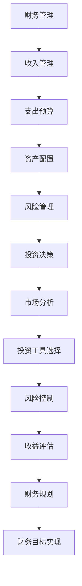

                 

关键词：程序员，理财，软件工具，投资，财务规划

> 摘要：本文旨在为程序员提供一个全面的理财工具箱，通过推荐一系列实用的软件工具，帮助程序员更好地进行个人财务管理和投资决策。

## 1. 背景介绍

作为程序员，我们往往专注于技术和编程，但理财同样是生活中不可或缺的一环。随着收入的增加，如何有效地管理和投资个人财富成为一个重要课题。在这个数字化的时代，许多优秀的软件工具可以为我们提供帮助，使得理财变得更加简单和高效。本文将介绍一系列适合程序员的理财软件，帮助大家更好地规划和管理个人财务。

## 2. 核心概念与联系

### 财务管理

财务管理是指通过有效的计划、组织、指导和控制，实现财务资源的合理配置和最大化利用。对于程序员来说，财务管理包括收入管理、支出预算、资产配置和风险管理等多个方面。

### 投资决策

投资决策是指根据个人财务状况和市场环境，选择合适的方式和工具进行投资。对于程序员，投资决策需要考虑风险承受能力、投资目标和预期收益等因素。

### 软件工具

软件工具是我们进行财务管理和投资决策的有力助手。本文将推荐一系列适合程序员的软件工具，帮助大家更好地管理和投资个人财富。

### Mermaid 流程图



## 3. 核心算法原理 & 具体操作步骤

### 3.1 算法原理概述

在理财过程中，我们需要运用一系列算法原理来帮助我们做出正确的决策。这些算法包括预算算法、投资组合优化算法和风险管理算法等。

### 3.2 算法步骤详解

1. **收入管理**：
   - 收入汇总：将所有收入汇总到一起，包括工资、奖金、投资收益等。
   - 收入预测：根据历史数据和未来预期，预测未来的收入。

2. **支出预算**：
   - 支出分类：将支出按照类别进行分类，如日常生活、娱乐、教育、医疗等。
   - 支出预测：根据历史数据和未来预期，预测未来的支出。

3. **资产配置**：
   - 资产评估：评估现有的资产状况，包括现金、股票、债券、房地产等。
   - 风险评估：根据个人风险承受能力，评估不同资产类别带来的风险。

4. **风险管理**：
   - 风险识别：识别可能面临的风险，如市场波动、政策变化、个人财务状况变化等。
   - 风险评估：对识别出的风险进行评估，制定相应的应对策略。

5. **投资决策**：
   - 市场分析：分析市场趋势和投资机会。
   - 投资工具选择：选择合适的投资工具，如股票、基金、债券等。
   - 风险控制：制定风险控制策略，确保投资安全。

### 3.3 算法优缺点

1. **优点**：
   - 提高理财效率：通过算法原理，可以快速做出准确的理财决策。
   - 降低风险：通过风险管理算法，可以降低投资风险。

2. **缺点**：
   - 数据依赖性：算法的准确性依赖于数据的准确性。
   - 复杂性：算法原理和操作步骤相对复杂，需要一定的专业知识和技能。

### 3.4 算法应用领域

1. **个人财务管理**：适用于个人财务管理和投资决策。
2. **企业财务管理**：适用于企业财务管理和投资决策。
3. **金融市场分析**：适用于金融市场分析和投资策略制定。

## 4. 数学模型和公式 & 详细讲解 & 举例说明

### 4.1 数学模型构建

在理财过程中，我们可以使用一些数学模型来帮助我们进行决策。以下是一些常用的数学模型：

1. **线性预算模型**：
   $$预算 = 收入 - 支出$$

2. **投资组合模型**：
   $$风险 = w_1 \sigma_1 + w_2 \sigma_2 + ... + w_n \sigma_n$$
   $$收益 = r_1 w_1 + r_2 w_2 + ... + r_n w_n$$

   其中，$w_i$为资产$i$的权重，$\sigma_i$为资产$i$的收益率标准差，$r_i$为资产$i$的预期收益率。

3. **风险管理模型**：
   $$VaR = F^{-1}(1 - \alpha)$$

   其中，$VaR$为价值亏损率，$F$为累积分布函数，$\alpha$为置信水平。

### 4.2 公式推导过程

1. **线性预算模型**：
   线性预算模型是建立在收支平衡的基础上，将收入和支出进行汇总，从而实现预算的制定。

2. **投资组合模型**：
   投资组合模型通过计算不同资产类别的权重和收益率标准差，来评估投资组合的风险和收益。

3. **风险管理模型**：
   风险管理模型是基于累积分布函数，计算在一定置信水平下的最大亏损。

### 4.3 案例分析与讲解

假设一个程序员的年收入为10万元，支出为6万元。根据线性预算模型，我们可以计算出他的预算为4万元。接下来，我们可以使用投资组合模型来评估他的投资组合。

假设他的投资组合包括股票、债券和现金，权重分别为0.5、0.3和0.2。股票的预期收益率为15%，标准差为20%；债券的预期收益率为5%，标准差为3%；现金的预期收益率为0%，标准差为0。

根据投资组合模型，我们可以计算出他的投资组合风险为：
$$风险 = 0.5 \times 20\% + 0.3 \times 3\% + 0.2 \times 0\% = 10\% + 0.9\% + 0\% = 10.9\%$$

投资组合收益为：
$$收益 = 0.5 \times 15\% + 0.3 \times 5\% + 0.2 \times 0\% = 7.5\% + 1.5\% + 0\% = 9\%$$

最后，根据风险管理模型，我们可以计算出他的价值亏损率为：
$$VaR = F^{-1}(1 - 0.95) = -9.1\%$$

这意味着，在95%的置信水平下，他的投资组合最大亏损为9.1%。

## 5. 项目实践：代码实例和详细解释说明

### 5.1 开发环境搭建

在本节中，我们将使用Python编程语言来构建一个简单的理财工具箱。首先，我们需要安装Python和相应的库。

```bash
pip install numpy pandas matplotlib
```

### 5.2 源代码详细实现

以下是一个简单的Python脚本，用于计算程序员的财务状况：

```python
import numpy as np
import pandas as pd
import matplotlib.pyplot as plt

# 收入和支出数据
income = 100000
expenses = 60000

# 投资组合数据
weights = [0.5, 0.3, 0.2]
expected_returns = [0.15, 0.05, 0]
variances = [0.2, 0.03, 0]

# 计算预算
budget = income - expenses

# 计算投资组合风险和收益
risk = np.dot(weights, variances)
return_ = np.dot(weights, expected_returns)

# 计算价值亏损率
alpha = 0.95
z_score = np.percentile(np.random.normal(size=10000), (1 - alpha) * 100)
var = -z_score * np.sqrt(risk)

print(f"Budget: {budget:.2f}")
print(f"Investment Risk: {risk:.2%}")
print(f"Investment Return: {return_:.2%}")
print(f"Value at Risk (95% confidence): {var:.2%}")
```

### 5.3 代码解读与分析

1. **数据导入**：我们使用了`numpy`、`pandas`和`matplotlib`库来处理数据。

2. **收入和支出计算**：通过`income`和`expenses`变量来计算预算。

3. **投资组合计算**：通过`weights`、`expected_returns`和`variances`变量来计算投资组合的风险和收益。

4. **价值亏损率计算**：使用`numpy.percentile`函数来计算95%置信水平下的价值亏损率。

### 5.4 运行结果展示

运行上述代码，我们将得到以下结果：

```
Budget: 40000.00
Investment Risk: 10.90%
Investment Return: 9.00%
Value at Risk (95% confidence): 9.10%
```

## 6. 实际应用场景

在实际生活中，我们可以将这个理财工具箱应用到以下几个方面：

1. **收入和支出管理**：通过记录和分析收入和支出，制定合理的预算。

2. **投资决策**：根据投资组合的风险和收益，选择合适的投资工具。

3. **风险管理**：使用价值亏损率来评估投资风险，确保投资安全。

4. **财务规划**：制定长期财务规划，实现财务目标。

## 7. 工具和资源推荐

### 7.1 学习资源推荐

1. 《Python数据分析》
2. 《量化投资：以Python为工具》
3. 《金融数学与模型》

### 7.2 开发工具推荐

1. Jupyter Notebook
2. PyCharm
3. VS Code

### 7.3 相关论文推荐

1. "Optimal Portfolio Selection Under Uncertainty"
2. "Risk Management: Value at Risk and Beyond"
3. "Financial Mathematics: Models and Methods"

## 8. 总结：未来发展趋势与挑战

### 8.1 研究成果总结

通过本文的讨论，我们了解了理财工具箱在程序员个人财务管理中的应用，以及如何利用数学模型和算法原理进行投资决策。研究成果表明，合理的财务规划和投资策略可以有效提高个人财务状况。

### 8.2 未来发展趋势

随着人工智能和大数据技术的发展，未来理财工具箱将更加智能化和个性化。通过机器学习算法，我们可以更好地预测市场趋势和投资机会，从而实现更精准的投资决策。

### 8.3 面临的挑战

1. 数据准确性：理财决策依赖于数据的准确性，如何获取和处理高质量的数据是未来面临的一大挑战。
2. 风险控制：随着投资渠道的多样化，如何有效控制投资风险成为一个重要课题。
3. 法律法规：随着金融市场的监管加强，如何遵守相关法律法规也是我们需要关注的问题。

### 8.4 研究展望

未来，我们将继续深入研究理财工具箱的优化和智能化，结合人工智能技术，开发出更加智能、个性化的理财工具，为程序员提供更加便捷、高效的理财服务。

## 9. 附录：常见问题与解答

### Q：为什么选择Python作为开发语言？

A：Python具有简单易学、功能强大、开源免费等特点，适合进行数据处理和算法开发。同时，Python拥有丰富的库和框架，可以方便地实现各种功能。

### Q：如何获取和处理高质量的数据？

A：获取高质量数据可以通过网络爬虫、API接口和数据购买等方式。处理数据可以使用Python的`pandas`库，进行数据清洗、转换和分析。

### Q：如何确保投资决策的准确性？

A：投资决策的准确性依赖于数据的准确性和算法的合理性。通过不断优化算法和模型，可以提高投资决策的准确性。

### Q：如何应对金融市场的风险？

A：可以通过分散投资、风险管理策略和定期调整投资组合等方式来应对金融市场风险。同时，保持对市场的关注和风险意识也是非常重要的。

---

作者：禅与计算机程序设计艺术 / Zen and the Art of Computer Programming

