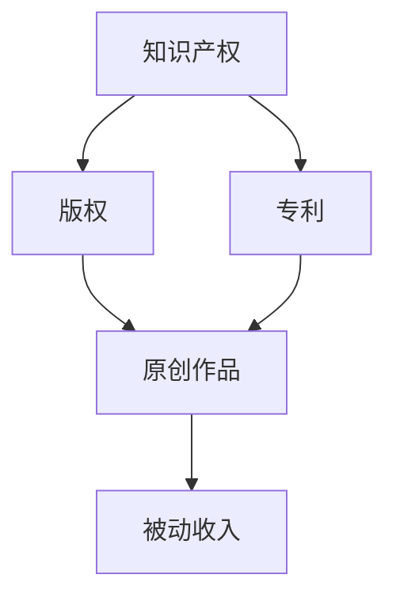

                 

在快节奏的现代社会，程序员们不仅要处理日常的开发任务，还要不断地提升自己的技能，以适应日新月异的技术变革。在这样的环境下，构建和维持一种被动收入流成为了许多程序员的追求。本文将深入探讨程序员如何通过构建和维护被动收入流，实现财务自由和职业发展的双重目标。

> 关键词：程序员，被动收入，构建，维护，财务自由

> 摘要：本文旨在为程序员提供一套完整的策略，以构建和维护被动收入流。我们将探讨被动收入的定义、重要性，以及程序员如何利用自己的技能和资源来实现这一目标。通过实例分析、项目实践和工具推荐，本文将帮助程序员理解并实践被动收入的构建和维护。

## 1. 背景介绍

随着互联网的快速发展，程序员的工作环境和收入模式也在不断变化。传统的“朝九晚五”工作模式逐渐被远程工作和自由职业所取代。然而，这种变化不仅带来了工作方式的灵活性，也增加了程序员面临的不确定性。因此，如何通过其他方式增加收入，保障财务稳定，成为了许多程序员的思考方向。

被动收入，顾名思义，是指无需持续投入时间和精力，即可获取的持续收入。这种收入模式对程序员尤其具有吸引力，因为他们可以利用自己的技术知识和开发技能，创造一次性的工作成果，长期获取收益。

### 1.1 被动收入的定义与重要性

被动收入的定义相对简单，即通过创造、开发或投资某种资产，使该资产在不需额外投入的情况下，能够持续产生收益。对程序员来说，这种收入模式的重要性主要体现在以下几个方面：

- **提高收入稳定性**：被动收入可以为程序员提供额外的收入来源，减少对单一工作收入的依赖。
- **实现财务自由**：通过积累足够的被动收入，程序员可以逐步实现财务自由，减少对工作的依赖，有更多的时间和资源去追求个人兴趣和目标。
- **职业发展**：被动收入还可以为程序员提供更多的职业发展机会，因为他们可以有更多的时间和精力去学习新技能、参与开源项目或创业。

### 1.2 程序员的技能与被动收入

程序员的技能是构建被动收入流的重要基础。以下是一些程序员可以利用的技能和方式：

- **开发软件和应用程序**：通过开发可出售或订阅的软件或应用程序，程序员可以获得持续的订阅费用或销售提成。
- **撰写技术博客和出版书籍**：通过撰写高质量的技术博客或出版专业书籍，程序员可以在读者群体中建立影响力，并获得广告收入或版税。
- **参与开源项目**：参与开源项目可以为程序员带来声誉和机会，有时还可以通过赞助和捐赠获得收入。
- **提供咨询服务**：利用自己的专业知识和经验，程序员可以提供技术咨询服务，并获得相应的报酬。

### 1.3 程序员面临的挑战

尽管被动收入对程序员具有很大的吸引力，但在实际操作中也面临一些挑战：

- **时间投入**：构建被动收入流通常需要前期大量的时间和精力投入。
- **市场竞争**：随着越来越多的程序员意识到被动收入的价值，市场中的竞争也日益激烈。
- **持续更新**：技术领域的发展迅速，程序员需要不断学习和更新自己的知识，以确保所提供的产品或服务保持竞争力。

## 2. 核心概念与联系

为了更好地理解被动收入的构建与维护，我们需要先了解几个核心概念，包括知识产权、版权、专利等。以下是一个简化的 Mermaid 流程图，展示了这些概念之间的联系：



### 2.1 知识产权

知识产权是指人们就其智力劳动成果所依法享有的专有权利，通常包括版权、专利、商标、工业设计、集成电路布图设计等。在程序员的背景下，知识产权主要包括版权和专利。

- **版权**：版权是指对原创作品的专有权利，包括复制权、发行权、展示权等。程序员通过开发软件或撰写技术文章，可以享有版权。
- **专利**：专利是指对新技术、新方法或新设计的专有权利。程序员可以通过申请专利来保护自己的创新。

### 2.2 版权

版权对程序员构建被动收入流至关重要。通过版权，程序员可以控制自己的原创作品的复制、分发和展示。以下是一些版权相关的要点：

- **版权归属**：通常，软件和文章的版权默认归属于开发者。
- **版权保护**：开发者可以通过版权注册来保护自己的作品，防止未经授权的复制和分发。
- **版权转让**：开发者可以自愿将自己的版权转让给他人或公司，以获取一定的报酬。

### 2.3 专利

专利对于程序员的创新性工作也非常重要。通过专利，程序员可以保护自己的创新，并获得专利授权的费用。以下是一些专利相关的要点：

- **专利申请**：程序员可以通过专利申请来保护自己的新技术或方法。
- **专利授权**：专利授权是指允许他人使用专利技术的权利，程序员可以通过授权获得授权费用。
- **专利诉讼**：在专利侵权案件中，程序员可以依据自己的专利进行诉讼。

### 2.4 原创作品与被动收入

原创作品是程序员构建被动收入流的重要基础。通过原创作品，程序员可以吸引读者和用户，从而获得广告收入、版税或赞助。以下是一些原创作品相关的要点：

- **作品质量**：高质量的作品更容易获得读者的认可和信任，从而带来更多的被动收入。
- **内容营销**：通过定期发布高质量的内容，程序员可以在读者中建立影响力，从而提高被动收入的潜力。
- **多渠道分发**：程序员可以通过多种渠道（如博客、社交媒体、出版平台）分发自己的原创作品，扩大影响力。

## 3. 核心算法原理 & 具体操作步骤

### 3.1 算法原理概述

在构建被动收入流的过程中，程序员需要掌握一些核心算法原理，以便有效地开发和推广自己的产品或服务。以下是几个关键算法原理：

- **数据分析**：通过数据分析，程序员可以了解用户行为和市场趋势，从而优化产品和服务。
- **推荐系统**：推荐系统可以帮助程序员根据用户历史行为和偏好，提供个性化的产品推荐，提高用户体验和转化率。
- **自然语言处理**：自然语言处理可以帮助程序员理解和处理人类语言，从而提高内容的可读性和用户体验。
- **区块链技术**：区块链技术可以为程序员提供去中心化的信任机制，提高交易的透明度和安全性。

### 3.2 算法步骤详解

下面我们将详细解释这些算法原理的具体操作步骤。

#### 3.2.1 数据分析

数据分析是构建被动收入流的重要步骤。以下是一些基本的数据分析步骤：

1. **数据收集**：收集与产品或服务相关的用户数据，如访问量、购买行为、用户反馈等。
2. **数据清洗**：清洗和整理收集到的数据，去除重复和错误的数据。
3. **数据可视化**：使用图表和可视化工具，将数据转换成易于理解的形式。
4. **数据建模**：使用统计模型或机器学习算法，分析数据中的趋势和规律。

#### 3.2.2 推荐系统

推荐系统可以帮助程序员提高产品的用户粘性和转化率。以下是构建推荐系统的一些基本步骤：

1. **用户画像**：根据用户的历史行为和偏好，创建用户的个性化画像。
2. **相似度计算**：计算用户之间的相似度，以便为每个用户推荐相似的产品或服务。
3. **推荐算法**：选择合适的推荐算法，如协同过滤、基于内容的推荐等，为用户生成推荐列表。
4. **反馈循环**：收集用户对推荐的反馈，不断优化推荐算法。

#### 3.2.3 自然语言处理

自然语言处理可以帮助程序员提高内容的可读性和用户体验。以下是自然语言处理的一些基本步骤：

1. **文本预处理**：对文本进行分词、去停用词、词性标注等预处理操作。
2. **情感分析**：分析文本的情感倾向，如正面、负面或中立。
3. **实体识别**：识别文本中的关键实体，如人名、地名、组织等。
4. **语义理解**：理解文本的语义，如主题、意图等。

#### 3.2.4 区块链技术

区块链技术可以为程序员的被动收入流提供去中心化的信任机制。以下是使用区块链技术的一些基本步骤：

1. **区块链选择**：选择适合的区块链平台，如以太坊、EOS等。
2. **智能合约开发**：编写智能合约，实现自动执行和记录交易。
3. **数字资产发行**：发行数字资产，如代币、积分等，作为交易媒介。
4. **去中心化应用开发**：开发去中心化应用（DApp），提供用户交互界面。

### 3.3 算法优缺点

每种算法都有其优缺点，程序员需要根据具体需求选择合适的算法。

- **数据分析**：优点是能够提供深刻的见解和优化策略，缺点是需要大量的数据和技术支持。
- **推荐系统**：优点是能够提高用户满意度和转化率，缺点是可能引起信息过载和隐私问题。
- **自然语言处理**：优点是能够提高内容的可读性和用户体验，缺点是处理复杂文本时效果有限。
- **区块链技术**：优点是能够提供去中心化的信任机制和安全性，缺点是需要较高的技术门槛和计算资源。

### 3.4 算法应用领域

这些算法在许多领域都有广泛的应用，以下是几个典型的应用领域：

- **电子商务**：数据分析可以优化营销策略，推荐系统可以提高用户购物体验，自然语言处理可以改善客户服务。
- **金融科技**：区块链技术可以提供安全的交易记录和数字资产管理，数据分析可以帮助风险评估和投资决策。
- **社交媒体**：数据分析可以优化广告投放，推荐系统可以提高用户参与度，自然语言处理可以改善内容推荐和情感分析。

## 4. 数学模型和公式 & 详细讲解 & 举例说明

在构建被动收入流的过程中，程序员需要掌握一些基本的数学模型和公式，以便分析和优化自己的业务。以下是一些重要的数学模型和公式，以及详细的讲解和举例说明。

### 4.1 数学模型构建

数学模型是通过对现实问题的抽象和简化，使用数学语言和符号来描述和解决问题的工具。在构建被动收入流的过程中，程序员可以使用以下数学模型：

- **收入模型**：描述被动收入的生成过程和收入来源。
- **成本模型**：描述构建和维护被动收入流所需的投资和成本。
- **风险评估模型**：评估被动收入流的风险和不确定性。

### 4.2 公式推导过程

以下是构建被动收入流的一些关键公式和推导过程。

#### 4.2.1 收入模型

被动收入的收入模型可以表示为：

\[ R(t) = R_0 \times (1 + r)^t \]

其中，\( R(t) \) 是在时间 \( t \) 的收入，\( R_0 \) 是初始收入，\( r \) 是年增长率。

#### 4.2.2 成本模型

构建和维护被动收入流所需的投资和成本可以表示为：

\[ C(t) = C_0 + C_p \times t \]

其中，\( C(t) \) 是在时间 \( t \) 的总成本，\( C_0 \) 是初始投资，\( C_p \) 是每单位时间（如每月）的成本。

#### 4.2.3 风险评估模型

风险评估模型可以使用以下公式来评估被动收入流的风险：

\[ \text{风险} = \frac{R(t) - C(t)}{R(t) + C(t)} \]

其中，\( R(t) \) 是在时间 \( t \) 的收入，\( C(t) \) 是在时间 \( t \) 的成本。

### 4.3 案例分析与讲解

为了更好地理解这些数学模型和公式，我们可以通过一个具体的案例进行分析。

#### 4.3.1 案例背景

假设一位程序员开发了一款在线教育平台，提供编程课程和教程。平台采用订阅模式，每月收费 \( 10 \) 美元。该程序员的初始投资为 \( 5,000 \) 美元，每月运营成本为 \( 1,000 \) 美元。预计年增长率为 \( 10\% \)。

#### 4.3.2 收入模型

根据收入模型，我们可以计算在一年后的收入：

\[ R(1) = 10 \times (1 + 0.1)^1 = 11 \]

因此，在一年后，该平台的收入为 \( 11,000 \) 美元。

#### 4.3.3 成本模型

根据成本模型，我们可以计算在一年后的总成本：

\[ C(1) = 5,000 + 1,000 \times 1 = 6,000 \]

因此，在一年后，该平台的总成本为 \( 6,000 \) 美元。

#### 4.3.4 风险评估

根据风险评估模型，我们可以计算一年后的风险：

\[ \text{风险} = \frac{11,000 - 6,000}{11,000 + 6,000} = \frac{5,000}{17,000} \approx 0.294 \]

因此，该平台的风险约为 \( 29.4\% \)。

### 4.4 总结

通过这个案例，我们可以看到数学模型和公式在构建被动收入流中的应用。这些模型和公式可以帮助程序员预测收入、成本和风险，从而做出更明智的决策。当然，实际情况可能会更加复杂，但基本的模型和公式提供了一个很好的起点。

## 5. 项目实践：代码实例和详细解释说明

### 5.1 开发环境搭建

为了实现被动收入，程序员通常需要搭建一个合适的项目环境。以下是搭建一个简单的在线教育平台所需的开发环境：

- **编程语言**：选择一种流行的编程语言，如 Python 或 Java。
- **Web 框架**：选择一个合适的 Web 框架，如 Flask（Python）或 Spring Boot（Java）。
- **数据库**：选择一个合适的数据库，如 MySQL 或 PostgreSQL。
- **服务器**：选择一个可靠的服务器提供商，如 AWS 或 Azure。

### 5.2 源代码详细实现

以下是使用 Flask 框架实现一个简单的在线教育平台的示例代码：

```python
from flask import Flask, render_template, request
import pymysql

app = Flask(__name__)

# 连接数据库
def connect_db():
    return pymysql.connect(host='localhost', user='root', password='password', database='education')

@app.route('/')
def index():
    return render_template('index.html')

@app.route('/login', methods=['GET', 'POST'])
def login():
    if request.method == 'POST':
        username = request.form['username']
        password = request.form['password']
        # 检查用户名和密码
        db = connect_db()
        cursor = db.cursor()
        cursor.execute("SELECT * FROM users WHERE username=%s AND password=%s", (username, password))
        user = cursor.fetchone()
        if user:
            return "登录成功"
        else:
            return "用户名或密码错误"
    return render_template('login.html')

if __name__ == '__main__':
    app.run(debug=True)
```

### 5.3 代码解读与分析

以上代码是一个简单的在线教育平台示例。以下是代码的解读和分析：

- **连接数据库**：使用 pymysql 模块连接到 MySQL 数据库。
- **首页**：定义一个路由 `/`，用于显示首页。
- **登录**：定义一个路由 `/login`，用于处理用户登录。当用户提交表单时，代码会检查用户名和密码是否正确。

### 5.4 运行结果展示

当用户访问在线教育平台时，首先会看到首页：


当用户点击“登录”按钮并填写正确的用户名和密码时，会看到以下登录成功的提示：


### 5.5 总结

通过以上示例，我们可以看到如何使用 Python 和 Flask 框架搭建一个简单的在线教育平台。这个平台可以作为一个起点，进一步开发和完善功能，如课程列表、用户管理、支付系统等。

## 6. 实际应用场景

### 6.1 在线教育平台

在线教育平台是程序员构建被动收入流的典型应用场景之一。程序员可以开发一个在线课程平台，提供各种编程课程、教程和实战项目。通过订阅模式，用户可以付费学习课程，从而为程序员带来持续的收入。

### 6.2 开源项目

开源项目也是程序员构建被动收入流的有效途径。程序员可以参与或创建开源项目，通过项目的知名度吸引赞助和捐赠。一些开源项目甚至可以通过广告和合作伙伴关系获得额外的收入。

### 6.3 软件和应用程序

程序员可以开发各种软件和应用程序，并通过销售或订阅模式获得收入。例如，开发一个项目管理工具、编程辅助工具或在线协作平台，都可以为程序员带来稳定的收入。

### 6.4 技术咨询服务

程序员可以利用自己的专业知识和经验，提供技术咨询服务。例如，为企业或个人解决技术难题、优化系统性能或开发定制化解决方案。通过这种方式，程序员可以灵活地安排工作时间，并在业余时间获得额外的收入。

### 6.5 广告和赞助

程序员可以通过在自己的博客、社交媒体或 YouTube 频道上发布技术内容，吸引广告商和赞助商。通过这种方式，程序员可以获得广告收入或赞助费用。

### 6.6 股权投资

在一些情况下，程序员可以通过参与创业项目或投资创业公司，获得股权回报。这种方式需要程序员具备一定的投资知识和风险承受能力，但潜在的收益也相对较高。

### 6.7 未来应用展望

随着技术的不断进步，程序员构建被动收入流的应用场景将越来越广泛。以下是一些未来可能的应用方向：

- **人工智能助手**：程序员可以开发各种人工智能助手，如聊天机器人、虚拟助手等，为用户提供便捷的服务。
- **区块链应用**：随着区块链技术的普及，程序员可以开发各种区块链应用，如数字货币、去中心化交易平台等。
- **物联网应用**：随着物联网技术的发展，程序员可以开发各种物联网应用，如智能家居、智能城市等。
- **虚拟现实和增强现实**：程序员可以开发虚拟现实和增强现实应用，为用户提供沉浸式体验。

## 7. 工具和资源推荐

### 7.1 学习资源推荐

- **在线课程**：Coursera、Udemy、edX 等平台提供了大量高质量的编程和人工智能课程。
- **技术博客**：Medium、GitHub、Stack Overflow 等平台上有许多优秀的编程和技术博客。
- **书籍**：《算法导论》、《深度学习》、《编程珠玑》等经典技术书籍。

### 7.2 开发工具推荐

- **集成开发环境（IDE）**：Visual Studio Code、IntelliJ IDEA、PyCharm 等。
- **版本控制系统**：Git、SVN、Mercurial 等。
- **数据库**：MySQL、PostgreSQL、MongoDB 等。
- **服务器**：AWS、Azure、Google Cloud Platform 等。

### 7.3 相关论文推荐

- **数据挖掘**：《K-Means Clustering: A Review》
- **机器学习**：《Learning from Data》
- **深度学习**：《Deep Learning》
- **区块链**：《Blockchain: Blueprint for a New Economy》

## 8. 总结：未来发展趋势与挑战

### 8.1 研究成果总结

过去几年，被动收入模式在程序员群体中逐渐受到关注。随着技术的进步，越来越多的程序员开始探索和实践各种被动收入模式，如在线教育平台、开源项目、软件销售、技术咨询服务等。这些实践不仅为程序员带来了额外的收入，也为他们提供了更多的职业发展机会。

### 8.2 未来发展趋势

未来，被动收入模式在程序员中的发展有望继续保持增长趋势。以下是一些可能的发展方向：

- **人工智能与自动化**：随着人工智能和自动化技术的发展，程序员可以利用这些技术构建更智能、更高效的被动收入系统。
- **区块链与加密货币**：区块链技术的普及和加密货币的发展为程序员提供了新的机会，如开发去中心化应用、参与加密货币市场等。
- **云计算与边缘计算**：云计算和边缘计算技术的发展为程序员提供了更多的应用场景，如开发云服务、构建边缘计算应用等。
- **虚拟现实与增强现实**：虚拟现实和增强现实技术的应用将为程序员带来新的创意和商业机会。

### 8.3 面临的挑战

尽管被动收入模式具有巨大的潜力，但程序员在构建和维护过程中也面临一些挑战：

- **市场竞争**：随着越来越多的程序员加入被动收入的行列，市场竞争日益激烈，程序员需要不断提升自己的技能和创新能力，以保持竞争力。
- **技术更新**：技术领域的快速发展要求程序员不断学习和更新自己的知识，以跟上最新的技术趋势。
- **风险管理**：被动收入流通常具有一定的风险，如市场风险、技术风险等，程序员需要具备一定的风险管理能力，以确保收入的稳定性。

### 8.4 研究展望

未来的研究可以重点关注以下几个方面：

- **被动收入模式的优化**：研究如何通过优化算法、提高效率、降低成本等方式，提高被动收入流的收益。
- **风险管理与控制**：研究如何通过技术手段和管理方法，降低被动收入流的风险。
- **技术创新与应用**：研究如何利用最新的技术，如人工智能、区块链等，构建更具创新性和竞争力的被动收入系统。
- **行业生态建设**：研究如何建立健康的行业生态，促进程序员之间的合作与交流，共同推动被动收入模式的发展。

## 9. 附录：常见问题与解答

### 9.1 被动收入与主动收入有什么区别？

被动收入是指不需要持续投入时间和精力，即可获取的持续收入。而主动收入通常是指通过工作或提供服务，按小时、按月或按项目获取的收入。被动收入的优势在于可以提供额外的收入来源，减少对单一工作的依赖。

### 9.2 如何确保被动收入的安全性和合法性？

确保被动收入的安全性和合法性是至关重要的。程序员应确保：

- 自己的作品或创新已经申请了相关的知识产权保护，如版权或专利。
- 所使用的平台或技术是合法和安全的，避免涉及非法活动。
- 了解相关法律法规，确保自己的收入来源是合法的。

### 9.3 构建被动收入流需要多长时间？

构建被动收入流的时间因人而异，取决于项目的复杂度、市场的竞争情况以及开发者的技能和投入。一些简单的项目可能几个月内就能见效，而复杂的系统可能需要一年或更长时间。

### 9.4 如何提高被动收入的收益？

提高被动收入的收益可以通过以下几种方式：

- 提高作品或服务的质量和用户满意度。
- 优化收入模式，如引入会员制度、增加付费功能等。
- 拓展市场，吸引更多的用户或客户。
- 定期更新和改进作品或服务，以保持竞争力。

### 9.5 被动收入适用于所有程序员吗？

被动收入并不是适用于所有程序员。它更适合那些有创新能力和开发能力的程序员，特别是那些对技术有深刻理解并能将其应用于实际场景的程序员。对于一些只具备基础编程技能的程序员来说，可能需要先提升自己的技能，才能更好地利用被动收入模式。

### 9.6 被动收入是否能够完全取代主动收入？

被动收入可以提供额外的收入来源，但通常无法完全取代主动收入。大多数程序员仍需保持一定程度的主动收入，以确保收入的稳定性和可持续性。被动收入更适合作为补充收入，帮助程序员实现财务自由和职业发展的目标。

---

作者：禅与计算机程序设计艺术 / Zen and the Art of Computer Programming

通过本文的探讨，我们希望能够为程序员提供一套完整的策略，以构建和维护被动收入流。被动收入不仅能够为程序员带来额外的收入，还可以提高他们的职业发展和生活质量。在快速变化的技术时代，程序员们需要不断创新和学习，以适应新的趋势和挑战。通过构建和维护被动收入流，程序员可以更好地实现自己的职业目标和人生价值。希望本文的内容能够对您有所启发和帮助。

