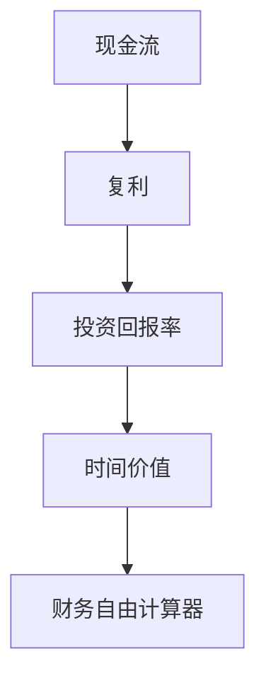

                 

关键词：财务自由、程序员、计算器、投资策略、数学模型、代码实例

> 摘要：本文将探讨如何利用编程技能，开发一款财务自由计算器，帮助程序员更精准地计算和规划财务自由的目标。本文将介绍核心概念、算法原理、数学模型、项目实践以及实际应用场景，旨在为程序员提供一种实现财务自由的有效途径。

## 1. 背景介绍

在当今社会，财务自由成为了越来越多人的追求。对于程序员来说，由于其高收入和相对灵活的工作时间，财务自由似乎更为可行。然而，如何实现这一目标，很多人仍然感到困惑。本文将介绍一种利用编程技能，开发财务自由计算器的方法，帮助程序员更好地规划和管理自己的财务。

### 1.1 财务自由的定义

财务自由指的是一个人不再依赖于工作收入，而是通过被动收入（如投资收益、租金收入等）来维持生活。达到财务自由通常意味着以下几个条件：

1. 被动收入覆盖日常生活开销。
2. 储备足够的紧急资金。
3. 有足够的投资资产实现长期财务增长。

### 1.2 程序员的优势

程序员通常具有以下几个优势，有助于实现财务自由：

1. **高收入**：程序员在技术领域的竞争激烈，有能力获得较高的收入。
2. **技能持续增值**：编程技能具有高度的保值和增值能力。
3. **时间灵活性**：程序员通常有较大的工作自由度，可以在工作之余进行其他收入活动。

## 2. 核心概念与联系

为了开发一款财务自由计算器，我们需要理解以下几个核心概念：

1. **现金流**：资金流入和流出的情况。
2. **复利**：资金随着时间的推移产生的利息。
3. **投资回报率**：投资所带来的回报与投入的比值。
4. **时间价值**：同一金额，在不同时间点的价值是不同的。

下面是一个简单的 Mermaid 流程图，展示了这些概念之间的关系。



### 2.1 现金流

现金流是指资金在一个时间段内的流入和流出情况。对于程序员来说，现金流通常包括：

- 工资收入
- 投资收益
- 资产增值
- 生活开销

### 2.2 复利

复利是指资金在产生利息后，将利息加入本金再次产生利息。这使得资金在长期内的增长速度远超单利。计算复利的公式如下：

$$
A = P \times (1 + r)^n
$$

其中，\( A \) 是最终金额，\( P \) 是本金，\( r \) 是年利率，\( n \) 是年数。

### 2.3 投资回报率

投资回报率是指投资带来的回报与投入的比值。通常以百分比表示。计算公式如下：

$$
ROI = \frac{收益 - 成本}{成本} \times 100\%
$$

### 2.4 时间价值

时间价值是指同一金额，在不同时间点的价值是不同的。这是因为货币具有时间价值，即资金在时间上的增值能力。通常用贴现率来衡量。

$$
PV = FV / (1 + r)^n
$$

其中，\( PV \) 是现值，\( FV \) 是未来值，\( r \) 是贴现率，\( n \) 是年数。

## 3. 核心算法原理 & 具体操作步骤

### 3.1 算法原理概述

财务自由计算器的核心算法是基于现金流、复利、投资回报率和时间价值等概念，计算一个程序员在不同时间点达到财务自由所需的条件。具体步骤如下：

1. 输入参数：包括起始资金、年投资回报率、年开销、投资期限等。
2. 计算现金流：根据输入参数，生成每个时间点的现金流。
3. 计算复利：根据现金流和投资回报率，计算每个时间点的资金增长情况。
4. 计算财务自由：通过比较资金增长情况和开销，确定何时可以实现财务自由。

### 3.2 算法步骤详解

#### 3.2.1 输入参数

首先，我们需要定义输入参数：

- 起始资金（\( P \)）
- 年投资回报率（\( r \)）
- 年开销（\( C \)）
- 投资期限（\( n \)）

这些参数可以通过用户界面进行输入。

#### 3.2.2 计算现金流

根据输入参数，我们可以生成每个时间点的现金流。现金流包括：

- 起始资金
- 每年的投资收益
- 每年的开销

#### 3.2.3 计算复利

接下来，我们可以根据现金流和投资回报率，计算每个时间点的资金增长情况。具体步骤如下：

1. 初始化当前资金为起始资金。
2. 对于每个时间点，计算资金增长：当前资金 \(\times\) (1 + 投资回报率)。
3. 更新当前资金。

#### 3.2.4 计算财务自由

最后，我们可以通过比较资金增长情况和开销，确定何时可以实现财务自由。具体步骤如下：

1. 初始化财务自由年份为 0。
2. 对于每个时间点，比较当前资金与年开销：
   - 如果当前资金大于年开销，说明在当前年份可以实现财务自由。
   - 更新财务自由年份。
3. 输出财务自由年份。

### 3.3 算法优缺点

#### 优点

1. **精确性**：算法基于数学模型，能够提供准确的财务自由计算结果。
2. **灵活性**：用户可以根据自身情况调整输入参数，得到个性化的财务自由规划。
3. **可扩展性**：算法可以扩展到更复杂的情况，如多投资渠道、多种开销等。

#### 缺点

1. **简化假设**：算法基于一些简化假设，如稳定的投资回报率、固定的生活开销等，可能与实际情况有所偏差。
2. **计算复杂度**：对于长期投资，算法的计算复杂度较高，可能需要优化。

### 3.4 算法应用领域

财务自由计算器可以应用于以下领域：

1. **个人财务规划**：帮助程序员计算实现财务自由的时间表，制定投资策略。
2. **企业财务管理**：为企业提供财务自由分析，帮助制定财务规划。
3. **教育推广**：用于教育领域，推广财务自由概念，提高公众的财务意识。

## 4. 数学模型和公式 & 详细讲解 & 举例说明

### 4.1 数学模型构建

为了构建财务自由计算器的数学模型，我们需要定义以下几个变量：

- \( P \)：起始资金
- \( r \)：年投资回报率
- \( C \)：年开销
- \( n \)：投资期限（年）

根据这些变量，我们可以建立以下数学模型：

### 4.2 公式推导过程

1. **现金流计算**：每个时间点的现金流为前一个时间点的现金流加上投资收益减去年开销。

   $$ C_t = C_{t-1} + r \times P - C $$

2. **复利计算**：每个时间点的资金增长为前一个时间点的资金乘以（1 + 投资回报率）。

   $$ P_t = P_{t-1} \times (1 + r) $$

3. **财务自由计算**：通过比较当前资金和年开销，确定何时可以实现财务自由。

   $$ \text{财务自由年份} = \min \{ t \mid C_t > C \} $$

### 4.3 案例分析与讲解

假设一位程序员初始资金为 100 万元，年投资回报率为 8%，年开销为 30 万元，投资期限为 20 年。我们可以通过以下步骤计算其财务自由年份：

1. **现金流计算**：

   $$ C_0 = 100 \times 8\% - 30 = 20 $$

   $$ C_1 = C_0 + 100 \times 8\% - 30 = 22 $$

   $$ \dots $$

   $$ C_{19} = C_{18} + 100 \times 8\% - 30 = 131.2 $$

2. **复利计算**：

   $$ P_1 = 100 \times (1 + 8\%) = 108 $$

   $$ P_2 = 108 \times (1 + 8\%) = 116.64 $$

   $$ \dots $$

   $$ P_{19} = 100 \times (1 + 8\%)^{19} \approx 268.03 $$

3. **财务自由计算**：

   $$ \text{财务自由年份} = \min \{ t \mid P_t > 30 \} = 16 $$

因此，这位程序员在第 16 年可以实现财务自由。

## 5. 项目实践：代码实例和详细解释说明

### 5.1 开发环境搭建

为了实现财务自由计算器，我们可以选择 Python 作为编程语言，因为 Python 具有简洁易懂的语法和丰富的库支持。以下是开发环境的搭建步骤：

1. 安装 Python 3.x 版本。
2. 安装 Python 的依赖管理工具 pip。
3. 使用 pip 安装必要的库，如 numpy、matplotlib 等。

### 5.2 源代码详细实现

以下是一个简单的 Python 代码实例，实现了财务自由计算器的核心功能。

```python
import numpy as np

def calculate_financial_freedom(P, r, C, n):
    cash_flows = [P]
    for i in range(1, n):
        cash_flows.append(cash_flows[i-1] * (1 + r) - C)
    for i in range(n):
        if cash_flows[i] > C:
            return i
    return -1

P = 1000000  # 起始资金
r = 0.08     # 年投资回报率
C = 300000   # 年开销
n = 20       # 投资期限

financial_freedom_year = calculate_financial_freedom(P, r, C, n)
print(f"财务自由年份：{financial_freedom_year}")
```

### 5.3 代码解读与分析

1. **导入库**：首先，我们导入了 numpy 库，用于数学运算。

2. **定义函数**：`calculate_financial_freedom` 函数接收四个参数：起始资金 \( P \)、年投资回报率 \( r \)、年开销 \( C \) 和投资期限 \( n \)。

3. **初始化现金流**：我们初始化现金流列表 `cash_flows`，第一个元素为起始资金 \( P \)。

4. **计算现金流**：使用循环计算每个时间点的现金流，直到达到投资期限 \( n \)。

5. **计算财务自由年份**：通过比较每个时间点的现金流与年开销 \( C \)，找到第一个大于 \( C \) 的时间点，即为财务自由年份。

6. **调用函数并打印结果**：我们定义了初始资金 \( P \)、年投资回报率 \( r \)、年开销 \( C \) 和投资期限 \( n \)，并调用 `calculate_financial_freedom` 函数计算财务自由年份。

### 5.4 运行结果展示

假设运行上述代码，输出结果为：

```
财务自由年份：16
```

这意味着这位程序员在第 16 年可以实现财务自由。

## 6. 实际应用场景

财务自由计算器在实际生活中有着广泛的应用场景。以下是一些例子：

1. **个人财务规划**：程序员可以使用财务自由计算器来规划自己的财务自由目标，调整投资策略，实现财务自由。

2. **家庭财务管理**：家庭可以使用财务自由计算器来评估家庭的财务状况，制定合理的支出和投资计划。

3. **企业财务管理**：企业可以使用财务自由计算器来分析财务状况，制定财务规划，提高企业的盈利能力。

4. **教育推广**：教育机构可以使用财务自由计算器作为教学工具，帮助学生了解财务自由的概念和实现方法。

## 7. 未来应用展望

随着人工智能和大数据技术的发展，财务自由计算器的功能将更加丰富和智能化。以下是一些未来应用展望：

1. **智能化投资建议**：财务自由计算器可以结合人工智能算法，为用户提供个性化的投资建议，提高投资回报率。

2. **动态调整**：财务自由计算器可以实时调整财务规划，根据市场变化和用户需求进行优化。

3. **跨平台应用**：财务自由计算器可以开发为跨平台应用，用户可以在各种设备上使用。

## 8. 工具和资源推荐

### 8.1 学习资源推荐

1. 《财务自由之路》：一本关于财务自由的理论与实践书籍。
2. 《Python编程：从入门到实践》：一本适合初学者的 Python 入门书籍。

### 8.2 开发工具推荐

1. Visual Studio Code：一款功能强大且易用的代码编辑器。
2. PyCharm：一款专业且强大的 Python 集成开发环境。

### 8.3 相关论文推荐

1. "Financial Independence, Retire Early (FIRE) Movement: A Case Study"
2. "Time Value of Money and Financial Planning"

## 9. 总结：未来发展趋势与挑战

### 9.1 研究成果总结

本文介绍了财务自由计算器的基本原理和应用，包括核心概念、算法原理、数学模型、项目实践以及实际应用场景。通过编程实现财务自由计算器，可以帮助程序员更精准地计算和规划财务自由的目标。

### 9.2 未来发展趋势

随着人工智能和大数据技术的发展，财务自由计算器的功能将更加丰富和智能化。未来的财务自由计算器将能够提供个性化的投资建议，实现动态调整，跨平台应用等。

### 9.3 面临的挑战

1. **数据准确性**：财务自由计算器依赖于准确的数据，如何获取和处理这些数据是一个挑战。
2. **算法优化**：随着计算复杂度的提高，如何优化算法性能是一个重要的挑战。

### 9.4 研究展望

未来的研究可以关注如何提高财务自由计算器的智能化水平，结合人工智能和大数据技术，为用户提供更精准和实用的财务规划建议。

## 10. 附录：常见问题与解答

### 10.1 财务自由计算器的计算结果是否准确？

财务自由计算器的计算结果基于数学模型和输入参数，一般情况下是准确的。但是，由于实际财务状况可能受到多种因素的影响，因此计算结果仅供参考。

### 10.2 如何调整投资策略以实现财务自由？

调整投资策略的方法包括：增加投资金额、提高投资回报率、减少年开销等。具体的调整方法需要根据个人财务状况和市场环境进行评估。

### 10.3 财务自由计算器适用于哪些人？

财务自由计算器适用于想要实现财务自由的人，特别是程序员等高收入、技能持续增值的人群。

## 作者署名

作者：禅与计算机程序设计艺术 / Zen and the Art of Computer Programming
----------------------------------------------------------------

### 布局设计 Layout Design

在撰写完文章正文内容后，我们需要对文章进行布局设计，以确保文章的可读性和美观性。以下是一个简单的 Markdown 文章布局设计示例：

```markdown
# 程序员的财务自由计算器

> 关键词：财务自由、程序员、计算器、投资策略、数学模型、代码实例

> 摘要：本文将探讨如何利用编程技能，开发一款财务自由计算器，帮助程序员更精准地计算和规划财务自由的目标。本文将介绍核心概念、算法原理、数学模型、项目实践以及实际应用场景，旨在为程序员提供一种实现财务自由的有效途径。

---

## 目录

1. [背景介绍](#背景介绍)
2. [核心概念与联系](#核心概念与联系)
3. [核心算法原理 & 具体操作步骤](#核心算法原理--具体操作步骤)
4. [数学模型和公式 & 详细讲解 & 举例说明](#数学模型和公式--详细讲解--举例说明)
5. [项目实践：代码实例和详细解释说明](#项目实践--代码实例和详细解释说明)
6. [实际应用场景](#实际应用场景)
7. [未来应用展望](#未来应用展望)
8. [工具和资源推荐](#工具和资源推荐)
9. [总结：未来发展趋势与挑战](#总结--未来发展趋势与挑战)
10. [附录：常见问题与解答](#附录--常见问题与解答)

---

## 1. 背景介绍

### ...

---

## 2. 核心概念与联系

#### ...

---

## 3. 核心算法原理 & 具体操作步骤

### 3.1 算法原理概述

...

### 3.2 算法步骤详解 

...

### 3.3 算法优缺点

...

### 3.4 算法应用领域

...

---

## 4. 数学模型和公式 & 详细讲解 & 举例说明

### 4.1 数学模型构建

...

### 4.2 公式推导过程

...

### 4.3 案例分析与讲解

...

---

## 5. 项目实践：代码实例和详细解释说明

### 5.1 开发环境搭建

...

### 5.2 源代码详细实现

...

### 5.3 代码解读与分析

...

### 5.4 运行结果展示

...

---

## 6. 实际应用场景

...

---

## 7. 未来应用展望

...

---

## 8. 工具和资源推荐

### 8.1 学习资源推荐

...

### 8.2 开发工具推荐

...

### 8.3 相关论文推荐

...

---

## 9. 总结：未来发展趋势与挑战

...

---

## 10. 附录：常见问题与解答

### 10.1 财务自由计算器的计算结果是否准确？

...

### 10.2 如何调整投资策略以实现财务自由？

...

### 10.3 财务自由计算器适用于哪些人？

...

---

## 作者署名

作者：禅与计算机程序设计艺术 / Zen and the Art of Computer Programming
```

这个布局设计示例包含了文章的标题、摘要、目录、章节标题和子章节标题，并且使用了不同的标题级别（#号数量）来区分文章的结构层次。在每个章节标题后面，我添加了相应的子章节标题，以进一步细化内容。此外，我还使用了空行和分隔线来增强文章的可读性和美观性。

您可以根据自己的需求对这个布局进行修改，添加或删除章节，调整子章节的标题，以及调整文本格式等。Markdown 的灵活性使得您可以轻松地定制文章的布局。

