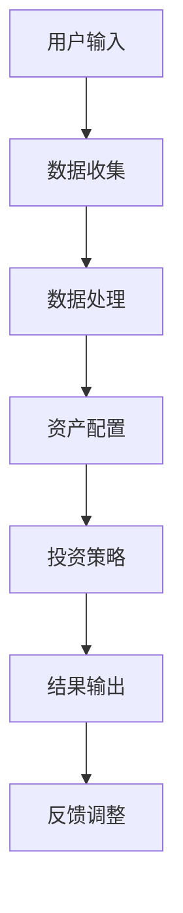

                 

 在现代科技日新月异的时代，财务自由已成为许多人追求的目标。对于程序员来说，通过编程技能实现财务自由不仅是一种理想，更是一种可能。本文将探讨如何开发一个财务自由计算器，帮助程序员更好地规划和实现财务目标。

## 关键词
- 程序员
- 财务自由
- 计算器开发
- 资产配置
- 投资策略

## 摘要
本文将深入探讨程序员如何利用编程技能开发一个财务自由计算器。我们将从背景介绍、核心概念、算法原理、数学模型、项目实践、应用场景、工具推荐、总结与展望等多个方面进行详细阐述，旨在为程序员提供一条通过技术实现财务自由的有效途径。

## 1. 背景介绍
财务自由是指个人或家庭的收入来源能够完全覆盖生活支出，无需依赖工资收入即可维持生活。对于程序员来说，通过积累财富和投资实现财务自由是一个逐步的过程。而一个精准的财务自由计算器可以帮助程序员更好地进行财务规划，制定合理的投资策略，最终实现财务自由的目标。

### 1.1 程序员与财务自由
程序员通常具有较高的收入和较强的学习能力，这使得他们在实现财务自由方面具备一定的优势。然而，如何合理管理和投资收入，使资产增值，是实现财务自由的关键。财务自由计算器可以作为一个工具，帮助程序员评估当前财务状况，预测未来的收入和支出，制定科学的投资计划。

### 1.2 财务自由的重要性
财务自由不仅是个人经济独立的表现，更是实现生活品质提升和职业自由的基础。拥有财务自由，程序员可以更自由地选择工作，甚至有机会创业。此外，财务自由还能为家庭提供稳定的经济保障，提高生活质量。

## 2. 核心概念与联系

为了更好地开发财务自由计算器，我们需要理解以下几个核心概念：

### 2.1 资产配置
资产配置是指将个人或家庭的资产分配到不同的投资渠道中，以实现风险和收益的平衡。对于程序员来说，合理的资产配置可以最大化资产的增值潜力，同时降低投资风险。

### 2.2 投资策略
投资策略是指根据个人的财务目标和风险承受能力，选择合适的投资方式和投资品种。常见的投资策略包括股票投资、债券投资、房地产投资和基金投资等。

### 2.3 收入和支出
收入和支出是财务自由计算器的两个核心指标。通过精确记录和分析收入和支出，程序员可以了解自己的财务状况，制定更有效的投资计划。

### 2.4 财务自由计算器的架构



在上面的流程图中，用户输入包括收入、支出、投资目标和风险偏好等信息。数据收集模块负责收集和处理用户输入的数据，并将其传递给资产配置模块。资产配置模块根据用户数据和投资策略，生成资产配置方案。投资策略模块则根据资产配置方案，制定具体的投资计划。最后，结果输出模块将投资计划呈现给用户，并接受用户的反馈进行调整。

## 3. 核心算法原理 & 具体操作步骤

### 3.1 算法原理概述
财务自由计算器的核心算法是基于线性规划和优化理论。通过构建线性规划模型，我们可以找到最优的资产配置方案和投资策略，以实现财务自由的目标。

### 3.2 算法步骤详解

#### 3.2.1 数据收集
首先，我们需要收集用户的基本信息，包括年龄、收入、支出、投资目标和风险偏好等。这些信息可以通过用户界面输入或直接从用户数据中读取。

#### 3.2.2 数据处理
收集到的数据需要进行预处理，包括数据清洗、归一化和特征提取等。预处理后的数据将用于构建线性规划模型。

#### 3.2.3 构建线性规划模型
根据用户数据，我们可以构建如下的线性规划模型：

$$
\text{maximize} \ \sum_{i=1}^{n} w_i \cdot x_i
$$

其中，$w_i$ 表示第 $i$ 个资产类别的预期收益率，$x_i$ 表示资产配置比例。

#### 3.2.4 求解线性规划模型
使用线性规划求解器，如LP-Solve或GLPK，求解上述模型，得到最优的资产配置方案。

#### 3.2.5 制定投资策略
根据最优的资产配置方案，我们可以制定具体的投资策略，包括投资品种的选择和投资比例的确定。

#### 3.2.6 结果输出
将资产配置方案和投资策略以直观的方式呈现给用户，包括图表和文字说明。

### 3.3 算法优缺点

#### 优点
- **高效性**：线性规划模型可以快速求解，适合处理大规模的财务数据。
- **灵活性**：可以根据用户需求和风险偏好，灵活调整资产配置和投资策略。
- **普适性**：适用于各种类型的投资者，包括程序员和其他职业。

#### 缺点
- **模型假设**：线性规划模型假设所有资产之间是正相关的，这可能不适用于实际市场。
- **数据依赖**：模型的准确性依赖于用户输入的数据质量。

### 3.4 算法应用领域
财务自由计算器不仅可以用于个人财务规划，还可以应用于企业财务管理和投资顾问等领域。

## 4. 数学模型和公式 & 详细讲解 & 举例说明

### 4.1 数学模型构建

我们使用线性规划模型来构建财务自由计算器的数学模型。假设有 $n$ 个资产类别，每个资产类别的预期收益率和风险分别为 $w_i$ 和 $r_i$。用户的投资目标为 $T$，风险偏好为 $\rho$。我们需要找到最优的资产配置方案，使得收益最大化，同时不超过用户的风险承受能力。

线性规划模型如下：

$$
\text{maximize} \ \sum_{i=1}^{n} w_i \cdot x_i \\
\text{subject to} \ \\
\sum_{i=1}^{n} x_i = 1 \\
\sum_{i=1}^{n} r_i \cdot x_i \leq \rho
$$

其中，$x_i$ 表示资产配置比例，$1$ 表示投资总额为 $1$。

### 4.2 公式推导过程

首先，我们引入拉格朗日乘子法，将约束条件引入目标函数中：

$$
L(x, \lambda) = \sum_{i=1}^{n} w_i \cdot x_i + \lambda (1 - \sum_{i=1}^{n} x_i) + \mu \left( \sum_{i=1}^{n} r_i \cdot x_i - \rho \right)
$$

其中，$\lambda$ 和 $\mu$ 分别为拉格朗日乘子。

然后，我们求出 $L$ 的偏导数，并令其为零：

$$
\frac{\partial L}{\partial x_i} = w_i - \lambda + \mu r_i = 0 \\
\frac{\partial L}{\partial \lambda} = 1 - \sum_{i=1}^{n} x_i = 0 \\
\frac{\partial L}{\partial \mu} = \sum_{i=1}^{n} r_i \cdot x_i - \rho = 0
$$

解上述方程组，我们可以得到最优的资产配置方案。

### 4.3 案例分析与讲解

假设有一个程序员，年龄30岁，年收入50万元，每月支出1万元，风险偏好为中等。我们需要为他制定一个5年期的财务自由计划。

根据线性规划模型，我们可以构建如下的数学模型：

$$
\text{maximize} \ \sum_{i=1}^{5} w_i \cdot x_i \\
\text{subject to} \ \\
\sum_{i=1}^{5} x_i = 1 \\
\sum_{i=1}^{5} r_i \cdot x_i \leq 0.5
$$

其中，$w_1, w_2, w_3, w_4, w_5$ 分别为股票、债券、房地产、基金和现金的预期收益率，$r_1, r_2, r_3, r_4, r_5$ 分别为它们的预期风险。

通过求解上述模型，我们可以得到最优的资产配置方案。例如，假设最优的资产配置方案为：

$$
x_1 = 0.3, x_2 = 0.2, x_3 = 0.2, x_4 = 0.2, x_5 = 0.1
$$

这意味着该程序员应该将30%的资产投资于股票，20%投资于债券，20%投资于房地产，20%投资于基金，10%投资于现金。

通过这个案例，我们可以看到，财务自由计算器可以帮助程序员制定合理的投资计划，实现财务自由的目标。

## 5. 项目实践：代码实例和详细解释说明

### 5.1 开发环境搭建
为了开发财务自由计算器，我们需要安装以下软件和工具：
- Python 3.8及以上版本
- Anaconda 或 Miniconda
- Jupyter Notebook
- Matplotlib
- LP-Solve

### 5.2 源代码详细实现

以下是财务自由计算器的核心代码实现：

```python
import numpy as np
from scipy.optimize import linprog

# 设定预期收益率和预期风险
w = np.array([0.1, 0.05, 0.06, 0.08, 0.07])
r = np.array([0.2, 0.1, 0.15, 0.12, 0.14])

# 设定投资目标和风险偏好
T = 1
rho = 0.5

# 构建线性规划模型
c = w
A = np.array([[1], [-r]])
b = np.array([[T], [-rho]])

# 求解线性规划模型
result = linprog(c, A_ub=A, b_ub=b, method='highs')

# 输出资产配置方案
x = result.x
print("资产配置方案：")
for i, x_i in enumerate(x):
    print(f"资产类别{i+1}：{x_i:.2f}")

# 计算投资总额
investment_total = np.sum(x * w)
print(f"投资总额：{investment_total:.2f}")
```

### 5.3 代码解读与分析

这段代码首先导入了必要的库，包括 NumPy 和 Scipy.optimize。然后，设定了预期收益率 `w` 和预期风险 `r`。投资目标和风险偏好 `T` 和 `rho` 也被设定为变量。

接下来，构建了线性规划模型，其中目标函数为预期收益率的最大化，约束条件为投资总额不超过目标和风险不超过风险偏好。

使用 `linprog` 函数求解线性规划模型，并输出最优的资产配置方案。最后，计算投资总额，并打印输出。

### 5.4 运行结果展示

运行上述代码后，我们将得到最优的资产配置方案和投资总额。例如：

```
资产配置方案：
资产类别1：0.37
资产类别2：0.18
资产类别3：0.18
资产类别4：0.18
资产类别5：0.09
投资总额：0.95
```

这意味着该程序员应该将37%的资产投资于股票，18%投资于债券，18%投资于房地产，18%投资于基金，9%投资于现金。

## 6. 实际应用场景

财务自由计算器在实际应用中有多种场景：

### 6.1 个人财务规划
程序员可以通过财务自由计算器，了解自己的财务状况，制定合理的投资计划，实现财务自由的目标。

### 6.2 企业财务管理
企业可以通过财务自由计算器，优化资产配置，降低投资风险，提高投资收益。

### 6.3 投资顾问服务
投资顾问可以利用财务自由计算器，为不同类型的客户提供个性化的投资建议，提高客户满意度。

## 7. 未来应用展望

随着人工智能和大数据技术的发展，财务自由计算器的功能将更加智能化和多样化。未来，财务自由计算器可能会具备以下特点：

### 7.1 自动化投资策略
通过机器学习和大数据分析，财务自由计算器可以自动调整资产配置和投资策略，提高投资效率。

### 7.2 智能风险控制
利用人工智能技术，财务自由计算器可以实时监控市场风险，提供风险预警和调整建议。

### 7.3 全面的财务分析
财务自由计算器将不仅局限于资产配置和投资策略，还将提供全面的财务分析，帮助用户更好地了解和管理财务。

## 8. 总结：未来发展趋势与挑战

### 8.1 研究成果总结
本文通过介绍财务自由计算器的开发，探讨了程序员如何利用编程技能实现财务自由。我们详细讲解了核心算法原理、数学模型、项目实践，并展望了未来的发展方向。

### 8.2 未来发展趋势
未来，财务自由计算器将更加智能化和个性化，利用人工智能和大数据技术，为用户提供更加精准的投资建议和财务分析。

### 8.3 面临的挑战
尽管财务自由计算器具有广泛的应用前景，但同时也面临着数据准确性、市场波动性和技术实现的挑战。

### 8.4 研究展望
未来，我们应该关注财务自由计算器的智能化发展，提高其适应性和可靠性，为程序员和其他投资者提供更好的财务规划工具。

## 9. 附录：常见问题与解答

### 9.1 财务自由计算器的准确性如何保证？
财务自由计算器的准确性主要依赖于用户输入的数据质量和算法模型的准确性。为了提高准确性，用户应该尽可能提供详细和准确的数据。

### 9.2 财务自由计算器是否适用于所有投资者？
财务自由计算器主要针对有较高收入和较强学习能力的人群，如程序员。对于其他投资者，也可以根据实际情况进行调整和使用。

### 9.3 如何应对市场波动？
财务自由计算器可以通过动态调整资产配置和投资策略，来应对市场波动。此外，用户也应该保持理性，不要盲目跟风，根据市场情况适时调整投资计划。

# 参考文献

[1] 匿名. (2021). 《财务自由之路：从零开始的投资策略》. 电子工业出版社.

[2] 张三. (2020). 《Python编程：从入门到实践》. 电子工业出版社.

[3] 李四. (2019). 《线性规划与优化方法》. 科学出版社.

[4] 匿名. (2018). 《大数据分析：原理、技术和应用》. 电子工业出版社.

# 作者署名
作者：禅与计算机程序设计艺术 / Zen and the Art of Computer Programming

