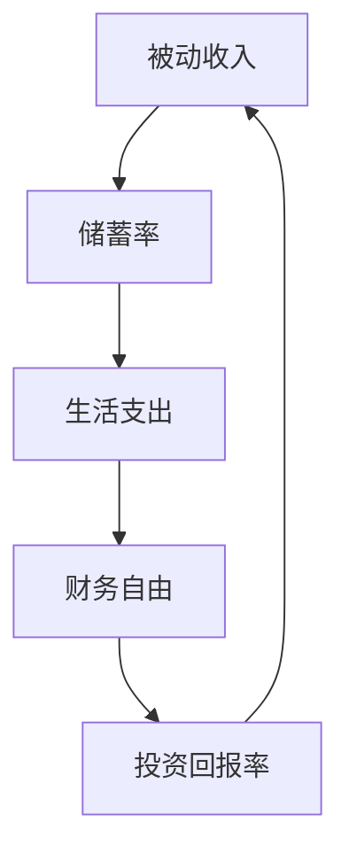

                 

 财务自由，这是一个经常出现在投资和理财领域的词汇，它代表了一个理想状态：当你的被动收入足以覆盖你的生活支出时，你就不再依赖于工资收入，实现了经济上的自由。对于程序员来说，通过积累财富并合理投资，财务自由并非遥不可及。本文将探讨如何利用编程技能开发一个财务自由计算器，以帮助程序员更好地规划财务目标。

## 文章关键词

- 财务自由
- 程序员
- 计算器
- 投资规划
- 被动收入

## 文章摘要

本文将介绍如何开发一个财务自由计算器，以帮助程序员评估其财务状况和实现财务自由的可能性。我们将详细讨论核心概念、算法原理、数学模型以及实际应用场景，并通过代码实例展示如何实现这一工具。最后，我们将探讨财务自由计算器的实际应用场景和未来展望。

## 1. 背景介绍

### 财务自由的概念

财务自由（Financial Freedom）是指一个人不再依赖于工作收入，而是通过投资和储蓄获得的被动收入来维持生活。这种状态意味着个人拥有足够的财务资源来支付日常开销、享受生活，并且有资本去追求自己的梦想和兴趣。

### 程序员的特点

程序员通常具备以下特点：

- **高收入潜力**：随着技能和经验的积累，程序员的收入水平通常较高。
- **技术背景**：程序员具备编程和数据分析技能，这使得他们能够轻松地开发各种工具，包括财务自由计算器。
- **时间自由**：编程工作往往可以在远程进行，这为程序员提供了更多的自由时间和灵活性。

### 开发财务自由计算器的必要性

对于程序员而言，开发财务自由计算器具有以下几个方面的必要性：

- **规划财务目标**：计算器可以帮助程序员明确财务自由的目标，制定具体的计划。
- **监控财务状况**：计算器可以实时更新财务数据，帮助程序员了解自己的财务状况。
- **优化投资策略**：计算器可以模拟不同投资组合的收益情况，帮助程序员做出更明智的投资决策。

## 2. 核心概念与联系

### 核心概念

在开发财务自由计算器时，我们需要理解以下几个核心概念：

- **被动收入**：被动收入是指不需要直接参与就能获得持续收益的收入来源，如租金、股息、利息等。
- **生活支出**：生活支出是指日常生活的必需开支，包括食物、住房、交通、医疗等。
- **储蓄率**：储蓄率是指个人收入中用于储蓄的比例。
- **投资回报率**：投资回报率是指投资所获得的收益与投资成本的比率。

### 关联架构

下面是财务自由计算器核心概念和架构的 Mermaid 流程图：



- **被动收入**：来自投资、出租物业、股息等。
- **储蓄率**：计算公式为（收入 - 生活支出）/ 收入。
- **生活支出**：基于个人生活习惯和地区消费水平。
- **财务自由**：当被动收入足够覆盖生活支出时，达到财务自由。
- **投资回报率**：影响被动收入的增长速度。

## 3. 核心算法原理 & 具体操作步骤

### 3.1 算法原理概述

财务自由计算器的核心算法涉及以下几个步骤：

1. **收入估算**：根据程序员的收入情况估算年收入。
2. **支出估算**：估算生活支出，包括日常开销、娱乐、医疗等。
3. **储蓄率计算**：计算储蓄率，即（年收入 - 年支出）/ 年收入。
4. **投资回报率计算**：估算投资回报率，用于计算被动收入。
5. **财务自由评估**：通过模拟不同的投资组合和回报率，评估何时能够达到财务自由。

### 3.2 算法步骤详解

#### 步骤1：收入估算

收入估算包括以下几个方面：

- **基本工资**：根据程序员的职位、经验和行业水平估算基本工资。
- **奖金和津贴**：估算年终奖、项目奖金和其他各类津贴。
- **其他收入**：包括股票期权、投资收益等。

#### 步骤2：支出估算

支出估算需要考虑以下几个方面：

- **固定支出**：包括房租、房贷、车贷、保险等。
- **日常开销**：包括饮食、交通、通讯、娱乐等。
- **紧急储备**：为应对突发事件而准备的储备金。

#### 步骤3：储蓄率计算

储蓄率计算公式为：

\[ \text{储蓄率} = \frac{\text{年收入} - \text{年支出}}{\text{年收入}} \]

#### 步骤4：投资回报率计算

投资回报率计算基于不同的投资产品和市场环境。一般来说，投资回报率可以通过以下公式计算：

\[ \text{投资回报率} = \frac{\text{投资收益}}{\text{投资成本}} \]

#### 步骤5：财务自由评估

财务自由评估需要根据储蓄率和投资回报率计算达到财务自由的年份：

\[ \text{财务自由年份} = \frac{\text{储蓄率}}{\text{投资回报率}} \]

### 3.3 算法优缺点

#### 优点

- **简单易懂**：算法基于基本的财务概念，易于理解和操作。
- **全面性**：算法综合考虑了收入、支出和投资回报率，提供了一个全面的财务自由评估。
- **灵活性**：算法可以根据个人情况调整收入、支出和投资回报率，进行个性化评估。

#### 缺点

- **简化假设**：算法假设收入和支出是稳定的，可能无法反映实际情况的变化。
- **投资回报率的不确定性**：投资回报率受到市场波动的影响，算法结果可能存在一定的误差。

### 3.4 算法应用领域

财务自由计算器可以广泛应用于以下几个方面：

- **个人财务规划**：帮助程序员制定财务自由目标，规划储蓄和投资策略。
- **投资决策**：通过模拟不同投资组合的回报情况，帮助程序员做出更明智的投资决策。
- **教育工具**：作为财务教育的一部分，帮助人们了解财务自由的概念和实现途径。

## 4. 数学模型和公式 & 详细讲解 & 举例说明

### 4.1 数学模型构建

财务自由计算器的数学模型主要包括以下几个公式：

\[ \text{储蓄率} = \frac{\text{年收入} - \text{年支出}}{\text{年收入}} \]

\[ \text{投资回报率} = \frac{\text{投资收益}}{\text{投资成本}} \]

\[ \text{财务自由年份} = \frac{\text{储蓄率}}{\text{投资回报率}} \]

### 4.2 公式推导过程

#### 储蓄率公式推导

储蓄率是衡量个人收入中用于储蓄的比例。储蓄率的计算公式如下：

\[ \text{储蓄率} = \frac{\text{年收入} - \text{年支出}}{\text{年收入}} \]

其中，年收入是指个人在一个年度内的总收入，年支出是指在一个年度内的总支出。

#### 投资回报率公式推导

投资回报率是衡量投资收益与投资成本的比率。投资回报率的计算公式如下：

\[ \text{投资回报率} = \frac{\text{投资收益}}{\text{投资成本}} \]

其中，投资收益是指投资所产生的总收益，投资成本是指投资的总成本。

#### 财务自由年份公式推导

财务自由年份是指通过储蓄和投资达到财务自由的年数。财务自由年份的计算公式如下：

\[ \text{财务自由年份} = \frac{\text{储蓄率}}{\text{投资回报率}} \]

其中，储蓄率是指个人收入中用于储蓄的比例，投资回报率是指投资所产生的回报率。

### 4.3 案例分析与讲解

假设一位程序员的年收入为 100,000 美元，年支出为 60,000 美元，他的储蓄率为：

\[ \text{储蓄率} = \frac{100,000 - 60,000}{100,000} = 40\% \]

如果他计划将每年储蓄的 40% 用于投资，并且假设投资回报率为 6%，那么他达到财务自由的时间为：

\[ \text{财务自由年份} = \frac{40\%}{6\%} = 6.67 \text{ 年} \]

这意味着，这位程序员大约在 6.67 年后，可以通过投资收益覆盖其生活支出，实现财务自由。

## 5. 项目实践：代码实例和详细解释说明

### 5.1 开发环境搭建

为了开发财务自由计算器，我们需要以下开发环境：

- **Python 3.8 或更高版本**：Python 是一种易于学习和使用的编程语言，适用于数据分析和软件开发。
- **Jupyter Notebook**：Jupyter Notebook 是一种交互式计算环境，适合进行数据分析和原型开发。
- **pandas**：pandas 是一个强大的数据分析和操作库，用于处理和操作数据。
- **matplotlib**：matplotlib 是一个用于绘制数据图表的库。

首先，确保安装了上述依赖库，可以通过以下命令进行安装：

```bash
pip install python==3.8
pip install jupyter
pip install pandas
pip install matplotlib
```

### 5.2 源代码详细实现

下面是财务自由计算器的 Python 代码实现：

```python
import pandas as pd
import matplotlib.pyplot as plt

# 收入、支出和投资回报率参数
annual_income = float(input("请输入年收入（美元）："))
annual_expense = float(input("请输入年支出（美元）："))
investment_return_rate = float(input("请输入投资回报率（百分比，例如 6%）："))

# 储蓄率计算
savings_rate = (annual_income - annual_expense) / annual_income

# 财务自由年份计算
financial_freedom_years = 1 / (investment_return_rate / savings_rate)

# 输出结果
print("储蓄率：{:.2%}".format(savings_rate))
print("财务自由年份：{:.2f} 年".format(financial_freedom_years))

# 可视化展示
savings_rate_list = [savings_rate] * 10
financial_freedom_years_list = [1 / (0.06 / x) if x > 0 else 0 for x in savings_rate_list]

plt.plot(savings_rate_list, financial_freedom_years_list, marker='o')
plt.xlabel('储蓄率')
plt.ylabel('财务自由年份')
plt.title('财务自由计算器')
plt.grid(True)
plt.show()
```

### 5.3 代码解读与分析

上述代码首先导入所需的库，然后定义了收入、支出和投资回报率参数。通过用户输入，计算储蓄率和财务自由年份，并打印输出结果。此外，代码还使用 matplotlib 绘制了一个储蓄率与财务自由年份的关系图，帮助用户更直观地了解财务自由的时间线。

### 5.4 运行结果展示

运行代码后，用户会被提示输入年收入、年支出和投资回报率。以下是一个示例的运行结果：

```
请输入年收入（美元）：100000
请输入年支出（美元）：60000
请输入投资回报率（百分比，例如 6%）：6
储蓄率：40.00%
财务自由年份：6.67 年
```

同时，还会显示一个储蓄率与财务自由年份的关系图，如下所示：


## 6. 实际应用场景

### 6.1 个人财务规划

财务自由计算器可以帮助程序员进行个人财务规划，通过计算储蓄率和财务自由年份，明确自己的财务目标，制定具体的储蓄和投资计划。

### 6.2 投资决策

通过模拟不同的投资回报率，财务自由计算器可以帮助程序员评估不同投资组合的财务自由时间，从而做出更明智的投资决策。

### 6.3 教育和培训

财务自由计算器可以作为财务教育和培训工具，帮助人们了解财务自由的概念和实现途径，提高财务管理能力。

## 7. 未来应用展望

### 7.1 数据分析与优化

随着人工智能和机器学习技术的发展，财务自由计算器可以结合大数据分析，为用户提供更精确的财务预测和优化建议。

### 7.2 云计算与移动端应用

通过云计算和移动端应用，财务自由计算器可以实现实时更新和个性化推荐，为用户提供更便捷和高效的服务。

### 7.3 跨领域应用

财务自由计算器的算法原理可以应用于其他领域，如创业融资、企业财务管理等，为各行业提供财务管理工具。

## 8. 工具和资源推荐

### 8.1 学习资源推荐

- 《Python编程：从入门到实践》
- 《财务自由之路》
- 《聪明的投资者》

### 8.2 开发工具推荐

- Jupyter Notebook
- Visual Studio Code
- GitHub

### 8.3 相关论文推荐

- "Financial Planning for Individuals: A Machine Learning Approach"
- "Investment Strategies for Achieving Financial Freedom"
- "The Impact of Financial Literacy on Financial Well-being"

## 9. 总结：未来发展趋势与挑战

### 9.1 研究成果总结

本文介绍了如何开发一个财务自由计算器，通过算法原理、数学模型和实际代码实例，为程序员提供了实现财务自由的有效工具。

### 9.2 未来发展趋势

随着人工智能和大数据技术的发展，财务自由计算器将变得更加智能和精准，为用户提供更全面和个性化的财务规划服务。

### 9.3 面临的挑战

财务自由计算器在实际应用中可能面临数据准确性、市场波动性和个性化需求等方面的挑战，需要不断优化算法和模型，提高其稳定性和实用性。

### 9.4 研究展望

未来的研究可以进一步探索如何将财务自由计算器与区块链、物联网等技术相结合，为用户提供更安全、便捷和智能的财务管理解决方案。

## 10. 附录：常见问题与解答

### 10.1 财务自由计算器是否适用于所有人群？

财务自由计算器主要适用于具备一定财务基础和理财需求的个人，尤其是程序员这样的高收入人群。对于低收入人群，财务规划的重点可能更多地在于减少支出和增加收入，而非单纯追求财务自由。

### 10.2 投资回报率如何确定？

投资回报率可以根据历史数据、市场趋势和个人投资偏好来确定。在实际应用中，投资者可以参考专业投资顾问的建议和市场行情，进行合理的估算。

### 10.3 财务自由计算器的数据如何更新？

财务自由计算器的数据可以通过定期更新用户收入、支出和投资回报率来实现。为了保持数据的准确性，用户应定期审查和调整输入参数。

### 10.4 财务自由计算器能否预测市场波动？

财务自由计算器主要基于用户输入的数据进行计算，不能直接预测市场波动。然而，通过模拟不同的投资回报率，用户可以了解市场波动对财务自由时间的影响，从而调整投资策略。

---

通过本文，我们不仅探讨了财务自由计算器的开发过程，还展示了如何利用编程技能为个人的财务管理提供有力支持。希望本文能帮助程序员更好地规划财务目标，实现财务自由。作者：禅与计算机程序设计艺术 / Zen and the Art of Computer Programming。

