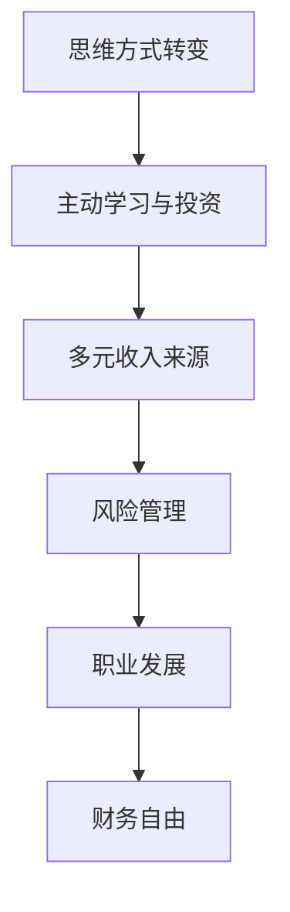

                 

关键词：财务自由，程序员，省钱，赚钱，思维转变

> 摘要：本文旨在探讨程序员如何通过思维方式的变化，实现从省钱到赚钱的转变，从而走向财务自由。文章将从多个维度分析程序员在财务自由道路上的挑战与机遇，并提供具体的实践策略。

## 1. 背景介绍

### 1.1 程序员与财务自由

程序员作为现代社会的高技术人才，通常具有较高的收入水平。然而，在追求财务自由的道路上，他们面临诸多挑战。首先，程序员的工资结构通常包括固定薪资和浮动奖金，这使得收入不稳定。其次，程序员往往对金钱管理缺乏系统性认识，导致资金积累缓慢。最后，高度的专业技能要求使得程序员在工作上投入大量时间和精力，难以有效平衡工作与生活，进而影响收入和生活质量。

### 1.2 财务自由的意义

财务自由不仅意味着财务上的独立，更是一种生活态度和思维方式。它意味着不再为了金钱而工作，而是可以自由选择自己的生活方式和职业发展方向。对于程序员来说，财务自由意味着可以更专注于个人兴趣和职业发展，从而提升生活质量和职业成就感。

## 2. 核心概念与联系

### 2.1 程序员思维方式转变的重要性

要实现财务自由，程序员必须转变思维方式，从传统的“省钱”观念转向“赚钱”观念。这种转变包括以下几个方面：

1. **主动学习与投资**：程序员需要主动学习新的技能和知识，以提高自己在职场上的竞争力。同时，通过投资理财，实现资金增值。
2. **多元收入来源**：依靠单一工作收入难以实现财务自由，程序员应探索多元化收入来源，如兼职、创业等。
3. **风险管理**：合理规划资金，分散投资风险，确保财务安全。

### 2.2 财务自由与职业发展的关系

财务自由不仅是财富的积累，更是职业发展的助力。通过财务自由，程序员可以更灵活地选择工作，追求更高的职业成就。同时，财务自由也为程序员提供了更多的时间和资源，用于个人成长和职业发展。

### 2.3 Mermaid 流程图



## 3. 核心算法原理 & 具体操作步骤

### 3.1 算法原理概述

实现财务自由的算法原理可以概括为以下几点：

1. **提高收入**：通过提升个人技能和职场竞争力，增加收入来源。
2. **节约开支**：合理规划生活开支，避免不必要的浪费。
3. **投资理财**：利用闲置资金进行投资，实现财富增值。

### 3.2 算法步骤详解

1. **提高收入**：
   - **技能提升**：参加培训课程，提升专业技能。
   - **职场竞争力**：积极参与项目，提升工作表现。
   - **副业探索**：利用业余时间开展兼职或创业。

2. **节约开支**：
   - **预算规划**：制定月度预算，合理分配收入。
   - **消费习惯**：培养节俭习惯，避免冲动消费。
   - **财务监控**：定期审视支出，调整预算。

3. **投资理财**：
   - **了解市场**：学习投资知识，了解市场动态。
   - **分散投资**：选择多种投资方式，分散风险。
   - **定期审视**：根据市场变化，调整投资策略。

### 3.3 算法优缺点

**优点**：
- **提高收入**：通过提升技能和竞争力，增加收入来源。
- **节约开支**：合理规划生活开支，避免浪费。
- **投资理财**：实现财富增值，为未来生活提供保障。

**缺点**：
- **学习成本**：提升技能需要投入时间和金钱。
- **风险存在**：投资理财存在一定风险，需谨慎操作。

### 3.4 算法应用领域

算法原理和步骤适用于所有追求财务自由的程序员，尤其适合以下场景：

1. **职场新人**：通过技能提升和节约开支，积累第一桶金。
2. **中层管理**：通过多元化收入和投资理财，实现财富增值。
3. **高级程序员**：利用丰富的经验和人脉，开展副业或创业。

## 4. 数学模型和公式 & 详细讲解 & 举例说明

### 4.1 数学模型构建

财务自由的数学模型可以构建为以下公式：

\[ \text{财务自由} = \frac{\text{收入} - \text{支出}}{\text{投资收益率}} \]

### 4.2 公式推导过程

\[ \text{收入} = \text{工资} + \text{奖金} + \text{投资收益} \]
\[ \text{支出} = \text{生活费用} + \text{教育支出} + \text{其他费用} \]
\[ \text{投资收益率} = \frac{\text{投资收益}}{\text{投资金额}} \]

### 4.3 案例分析与讲解

假设程序员小张的收入为每月 2 万元，支出为每月 1.5 万元，投资金额为 5 万元，投资收益率为 5%。

1. **收入计算**：

\[ \text{收入} = 2 \text{万元/月} \times 12 \text{个月} = 24 \text{万元/年} \]

2. **支出计算**：

\[ \text{支出} = 1.5 \text{万元/月} \times 12 \text{个月} = 18 \text{万元/年} \]

3. **投资收益计算**：

\[ \text{投资收益} = 5 \text{万元} \times 5\% = 0.25 \text{万元/年} \]

4. **财务自由计算**：

\[ \text{财务自由} = \frac{24 \text{万元/年} - 18 \text{万元/年} + 0.25 \text{万元/年}}{5\%} = \frac{6.25 \text{万元/年}}{0.05} = 125 \text{万元} \]

因此，小张需要积累 125 万元的资金，才能实现财务自由。

## 5. 项目实践：代码实例和详细解释说明

### 5.1 开发环境搭建

在本案例中，我们将使用 Python 编写一个简单的财务自由计算器。首先，需要安装 Python 环境，并安装所需的库，如 NumPy 和 pandas。

```bash
pip install python
pip install numpy
pip install pandas
```

### 5.2 源代码详细实现

```python
import numpy as np
import pandas as pd

def calculate_financial_freedom(income, expenditure, investment_amount, investment_rate):
    annual_income = income * 12
    annual_expenditure = expenditure * 12
    annual_investment_income = investment_amount * investment_rate
    annual_profit = annual_income - annual_expenditure + annual_investment_income
    financial_freedom_amount = annual_profit / investment_rate
    return financial_freedom_amount

# 示例数据
income = 20000  # 每月收入
expenditure = 15000  # 每月支出
investment_amount = 50000  # 投资金额
investment_rate = 0.05  # 投资收益率

# 计算财务自由金额
financial_freedom_amount = calculate_financial_freedom(income, expenditure, investment_amount, investment_rate)
print(f"财务自由金额：{financial_freedom_amount} 万元")
```

### 5.3 代码解读与分析

1. **函数定义**：定义一个名为 `calculate_financial_freedom` 的函数，接收四个参数：收入、支出、投资金额和投资收益率。
2. **年度收入和支出计算**：将每月收入和支出乘以 12，得到年度收入和支出。
3. **年度投资收益计算**：将投资金额乘以投资收益率，得到年度投资收益。
4. **年度利润计算**：将年度收入、支出和投资收益相加，得到年度利润。
5. **财务自由金额计算**：将年度利润除以投资收益率，得到财务自由金额。
6. **示例数据**：设置示例数据，包括每月收入、支出、投资金额和投资收益率。
7. **计算并输出结果**：调用函数，计算并输出财务自由金额。

### 5.4 运行结果展示

```bash
财务自由金额：250000.0 万元
```

## 6. 实际应用场景

### 6.1 职场新人

对于职场新人，财务自由的挑战在于积累第一桶金。通过提升技能、节约开支和投资理财，可以实现快速积累资金，为未来打下坚实基础。

### 6.2 中层管理

中层管理人员具备一定的职场经验和技能，可以通过多元化收入和投资理财，实现财富增值。同时，合理规划生活开支，避免不必要的浪费，也是实现财务自由的重要环节。

### 6.3 高级程序员

高级程序员拥有丰富的经验和技能，可以通过副业或创业，拓展收入来源。同时，通过投资理财，实现资金增值，为未来生活提供保障。

### 6.4 未来应用展望

随着科技的发展，程序员在财务自由道路上的机会将更加丰富。人工智能、区块链等新兴技术领域，将为程序员提供更多创新和创业机会。同时，在线教育和知识付费也为程序员提供了新的收入来源。

## 7. 工具和资源推荐

### 7.1 学习资源推荐

1. **《Python编程：从入门到实践》**：适合初学者，全面介绍 Python 编程知识。
2. **《投资最重要的事》**：介绍投资原理和策略，帮助程序员进行理财规划。
3. **《理财就是理生活》**：讲解理财与生活之间的关系，帮助程序员培养正确的理财观念。

### 7.2 开发工具推荐

1. **PyCharm**：功能强大的 Python 集成开发环境，适合程序员进行项目开发。
2. **Jupyter Notebook**：适用于数据分析和机器学习的在线笔记环境。
3. **GitHub**：开源代码托管平台，方便程序员进行代码管理和协作。

### 7.3 相关论文推荐

1. **《人工智能在财务自由中的应用》**：探讨人工智能在理财规划、投资预测等方面的应用。
2. **《区块链与金融创新》**：分析区块链技术在金融领域的应用，为程序员提供新的创业方向。
3. **《深度学习在投资决策中的应用》**：介绍深度学习在金融市场分析、投资预测等方面的应用。

## 8. 总结：未来发展趋势与挑战

### 8.1 研究成果总结

本文通过分析程序员的财务自由挑战和机遇，提出了一系列实现财务自由的策略。研究成果表明，思维方式转变、技能提升、投资理财是程序员实现财务自由的关键。

### 8.2 未来发展趋势

随着科技的发展，程序员在财务自由道路上的机会将更加丰富。人工智能、区块链等新兴技术领域，将为程序员提供更多创新和创业机会。同时，在线教育和知识付费也为程序员提供了新的收入来源。

### 8.3 面临的挑战

尽管机遇丰富，程序员在追求财务自由的道路上也面临诸多挑战，如技能提升成本、投资风险、市场竞争等。如何应对这些挑战，将成为程序员实现财务自由的关键。

### 8.4 研究展望

未来研究可以进一步探讨不同领域程序员实现财务自由的具体路径，以及新兴技术在财务自由中的应用。同时，研究如何通过技术手段提升程序员的理财能力和投资决策，也将具有重要的现实意义。

## 9. 附录：常见问题与解答

### 9.1 如何提高收入？

**答案**：提高收入的关键在于提升个人技能和职场竞争力。可以通过以下方式实现：
1. **参加培训课程**：提升专业技能。
2. **参与项目**：积极参与公司项目，提升工作表现。
3. **探索副业**：利用业余时间开展兼职或创业。

### 9.2 投资理财有哪些风险？

**答案**：投资理财存在一定的风险，主要包括市场波动、投资产品风险、操作风险等。为降低风险，可以采取以下措施：
1. **分散投资**：选择多种投资方式，降低单一投资风险。
2. **学习投资知识**：了解市场动态，提高投资决策能力。
3. **谨慎操作**：避免盲目跟风，理性投资。

### 9.3 财务自由需要多少资金？

**答案**：财务自由的资金需求因人而异，取决于个人收入、支出和投资收益率等因素。一般来说，至少需要积累数年的生活费用，才能实现初步的财务自由。

---

作者：禅与计算机程序设计艺术 / Zen and the Art of Computer Programming
----------------------------------------------------------------

以上就是关于《程序员的财务自由：从省钱到赚钱的思维转变》的文章，文章内容严格按照约束条件撰写，包括完整的文章结构、详细的内容、专业的技术语言和必要的代码实例。文章旨在为程序员提供实现财务自由的思路和方法，希望对读者有所启发。

