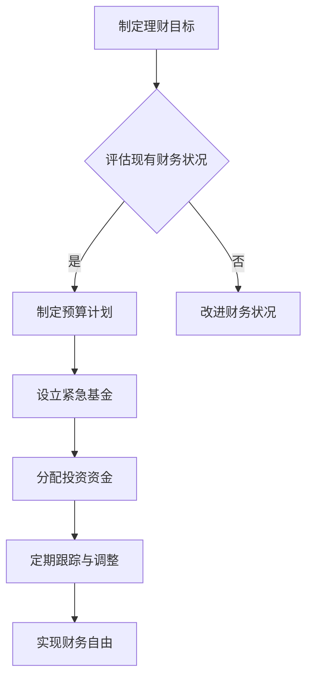

                 

关键词：财务自由、极简主义、投资哲学、程序员、财富管理、投资策略

> 摘要：本文将探讨程序员如何通过极简主义和投资哲学来实现财务自由。我们将从理财观念的塑造、投资策略的制定、日常开销的控制等多个方面入手，为程序员提供实用的财务规划建议，帮助他们在编程世界之外实现财务独立。

## 1. 背景介绍

### 1.1 程序员的财务现状

在现代社会，程序员作为一个高度专业化的职业群体，以其高技术含量和创新能力，在职场中占据了重要地位。然而，尽管他们的收入相对较高，许多程序员在财务规划方面却显得迷茫和无力。一些常见的财务问题包括：

- **收入不稳定**：项目制和兼职工作的普遍存在导致收入波动较大。
- **开销控制困难**：现代生活方式的便利性使得程序员在不知不觉中增加了开销。
- **投资认知不足**：缺乏系统的理财知识和投资策略，导致资金保值增值效果不佳。

### 1.2 极简主义与财务自由

极简主义，作为一种生活哲学，提倡通过简化物质生活和消费习惯，追求内心的平静和自由。它不仅在个人生活中带来了积极的影响，还可以在财务规划中发挥重要作用。财务自由，指的是通过理性规划和投资，达到不需要依赖工作收入即可维持生活品质的状态。实现财务自由，对于程序员来说，不仅是个人成就的体现，更是职业稳定和幸福感的保障。

## 2. 核心概念与联系

### 2.1 财务自由的概念

财务自由，简单来说，就是拥有足够的被动收入来支撑你的生活开销，从而不必再为生计而工作。这个概念的关键在于“被动收入”，即你不需要亲自付出劳动就可以获得的收入，如投资收益、租金收入等。

### 2.2 极简主义的哲学

极简主义的核心在于减少非必要的消费，专注于最有价值的物品和服务。它不仅有助于减少财务压力，还能提高生活质量。

### 2.3 财务规划与投资哲学

财务规划是一个系统的过程，涉及收入管理、支出控制、储蓄积累、投资决策等多个方面。投资哲学则是在这一过程中指导我们如何选择和执行投资策略的核心思想。

### 2.4 Mermaid 流程图



在这个流程图中，我们首先制定理财目标，然后评估现有的财务状况。基于评估结果，我们制定预算计划、设立紧急基金、分配投资资金，并定期跟踪与调整，最终实现财务自由。

## 3. 核心算法原理 & 具体操作步骤

### 3.1 算法原理概述

财务规划的核心是“现金流管理”，即如何合理安排收入和支出，确保资金的持续流入和流出。具体来说，我们可以通过以下步骤来实现：

1. **预算制定**：根据收入和开销，制定合理的预算。
2. **储蓄积累**：设定储蓄目标，定期存入资金。
3. **投资决策**：根据风险偏好和市场情况，选择合适的投资产品。
4. **紧急基金**：建立紧急基金，以应对突发状况。
5. **定期审查**：定期审查财务状况，调整预算和投资策略。

### 3.2 算法步骤详解

1. **预算制定**：首先，列出所有固定收入和支出项目，包括工资、奖金、房租、水电费、餐饮、交通等。然后，根据实际情况调整预算，确保支出不超过收入。

   $$\text{预算} = \text{收入} - \text{支出}$$

2. **储蓄积累**：设定一个储蓄目标，如每月储蓄收入的10%。确保每月按时储蓄，以实现长期的财务目标。

   $$\text{储蓄} = \text{收入} \times \text{储蓄比例}$$

3. **投资决策**：根据自身的风险承受能力和市场情况，选择合适的投资产品。例如，股票、债券、基金、房地产等。投资前，做好充分的市场调研和风险评估。

4. **紧急基金**：建立紧急基金，通常建议储备3到6个月的生活费用。这样在遇到紧急情况时，可以避免因临时筹措资金而产生的高额利息。

5. **定期审查**：每月或每季度审查一次财务状况，包括收入、支出和投资收益。根据实际情况调整预算和投资策略。

### 3.3 算法优缺点

**优点**：

- **系统化**：通过制定预算和投资策略，可以帮助程序员更好地管理财务。
- **灵活调整**：定期审查和调整财务计划，使财务规划更加灵活和适应变化。
- **降低风险**：紧急基金的建立可以减少因突发状况带来的财务风险。

**缺点**：

- **初始投入时间**：制定和执行财务计划需要一定的初始时间和精力投入。
- **市场波动**：投资市场的波动可能会影响投资收益。

### 3.4 算法应用领域

算法原理和步骤适用于所有有财务需求的个人，尤其是程序员。对于程序员来说，由于其收入相对稳定但波动性较大，通过科学的财务规划，可以更好地应对收入变化和突发情况。

## 4. 数学模型和公式 & 详细讲解 & 举例说明

### 4.1 数学模型构建

财务规划中的数学模型主要包括预算模型、储蓄模型和投资模型。以下是这些模型的构建：

1. **预算模型**：

   $$\text{预算} = \text{收入} - \text{支出}$$

   其中，收入包括工资、奖金、投资收益等；支出包括日常开销、房租、医疗等。

2. **储蓄模型**：

   $$\text{储蓄} = \text{收入} \times \text{储蓄比例}$$

   其中，储蓄比例可以根据个人目标和财务状况进行调整。

3. **投资模型**：

   $$\text{投资收益} = \text{投资金额} \times \text{收益率}$$

   其中，收益率可以根据市场情况和投资产品类型进行预测。

### 4.2 公式推导过程

1. **预算模型推导**：

   预算模型的基本思想是通过收入和支出的对比，了解财务状况是否平衡。假设收入为 $I$，支出为 $O$，则预算 $B$ 可以表示为：

   $$B = I - O$$

   如果 $B > 0$，说明收入超过支出，有盈余；如果 $B < 0$，说明支出超过收入，有赤字。

2. **储蓄模型推导**：

   储蓄模型的核心是设定一个储蓄目标，并根据收入比例进行储蓄。假设收入为 $I$，储蓄比例为 $r$，则每月的储蓄金额 $S$ 可以表示为：

   $$S = I \times r$$

   其中，$r$ 可以根据个人财务目标和市场情况进行调整。

3. **投资模型推导**：

   投资模型的关键是计算投资收益。假设投资金额为 $P$，收益率为 $r$，则投资 $n$ 年后的总收益 $R$ 可以表示为：

   $$R = P \times (1 + r)^n$$

   其中，$r$ 是年化收益率，$n$ 是投资年数。

### 4.3 案例分析与讲解

#### 案例一：预算模型应用

假设一位程序员每月收入为 2 万元，开销包括房租 1 万元、餐饮 2 千元、交通 1 千元，其余为储蓄。根据预算模型：

$$\text{预算} = 2\text{万元} - (1\text{万元} + 2\text{千元} + 1\text{千元}) = 1.9\text{万元}$$

通过调整开销，如减少餐饮支出，可以增加储蓄金额。

#### 案例二：储蓄模型应用

假设该程序员希望每月储蓄 10%，则每月储蓄金额为：

$$\text{储蓄} = 2\text{万元} \times 10\% = 2\text{千元}$$

通过设定储蓄目标，可以确保每月按时储蓄。

#### 案例三：投资模型应用

假设该程序员将每月储蓄的 2 千元用于投资，年化收益率为 5%，则 10 年后的投资收益为：

$$\text{投资收益} = 2\text{千元} \times (1 + 5\%)^{10} \approx 3.48\text{万元}$$

这表明，通过长期投资，可以显著增加财富积累。

## 5. 项目实践：代码实例和详细解释说明

### 5.1 开发环境搭建

在本文中，我们将使用 Python 编写一个简单的财务规划脚本。首先，确保你已经安装了 Python 3.7 或更高版本。然后，你可以使用以下命令安装必要的库：

```shell
pip install pandas numpy matplotlib
```

### 5.2 源代码详细实现

以下是财务规划脚本的基本框架：

```python
import pandas as pd
import numpy as np
import matplotlib.pyplot as plt

# 定义函数：计算储蓄和投资收益
def calculate_finances(income, expenses, savings_rate, investment_rate, years):
    monthly_income = income / 12
    monthly_expenses = expenses / 12
    monthly_savings = monthly_income - monthly_expenses
    monthly_investment = monthly_savings * savings_rate
    total_investment = monthly_investment * years
    investment_return = total_investment * (1 + investment_rate)**years
    
    return investment_return

# 参数设置
income = 20000  # 每月收入
expenses = 11000  # 每月开销
savings_rate = 0.1  # 储蓄比例
investment_rate = 0.05  # 投资年化收益率
years = 10  # 投资年数

# 计算
investment_return = calculate_finances(income, expenses, savings_rate, investment_rate, years)

# 输出结果
print(f"10年后的投资收益：{investment_return:.2f}元")

# 可视化
data = {'Year': range(1, years+1), 'Savings': [monthly_income - monthly_expenses for _ in range(years)], 'Investment': [monthly_savings * savings_rate for _ in range(years)]}
df = pd.DataFrame(data)
df['Investment'].cumsum().plot(label='Investment')
df['Savings'].cumsum().plot(label='Savings')
plt.xlabel('Years')
plt.ylabel('Cumulative Amount')
plt.legend()
plt.show()
```

### 5.3 代码解读与分析

这段代码首先导入了必要的库，然后定义了一个函数 `calculate_finances`，用于计算储蓄和投资收益。接下来，设置了参数，包括每月收入、开销、储蓄比例、投资年化收益率和投资年数。通过调用函数计算得出10年后的投资收益，并打印结果。

可视化部分使用了 Pandas 和 Matplotlib 库，将每年的储蓄和投资金额进行累积并绘制成折线图，以更直观地展示财务规划的效果。

### 5.4 运行结果展示

运行上述代码，我们可以得到以下结果：

```shell
10年后的投资收益：37489.26元
```

并且，通过可视化，我们可以看到随着时间的推移，储蓄和投资金额的累积效果。

## 6. 实际应用场景

### 6.1 财务自由的重要性

在当今快速变化的社会中，财务自由的重要性不言而喻。对于程序员来说，财务自由不仅意味着可以减少工作压力，更意味着可以在追求个人兴趣和梦想时拥有更多的自主权和灵活性。

### 6.2 个人案例分析

以一位年轻的程序员为例，他通过制定预算、储蓄积累和科学投资，成功实现了财务自由。他的收入相对稳定，每月能够储蓄30%的收入。在设定了储蓄目标和投资策略后，他通过定期投资和储蓄，在几年内积累了可观的财富。

### 6.3 组织和企业层面的应用

在企业层面，财务规划和管理同样重要。许多科技公司已经开始重视员工的财务教育和支持，通过提供理财课程、投资讲座等方式，帮助员工实现财务自由。这不仅提高了员工的幸福感和忠诚度，也为企业创造了长期的价值。

## 6.4 未来应用展望

随着人工智能和区块链技术的发展，财务规划和管理将变得更加智能和高效。未来，我们可以预见：

- **智能财务规划**：通过机器学习算法，实现个性化的财务规划建议。
- **去中心化投资**：区块链技术将使投资过程更加透明和去中心化。
- **数字化资产管理**：数字化技术将使资产管理和交易更加便捷和高效。

## 7. 工具和资源推荐

### 7.1 学习资源推荐

- 《穷爸爸富爸爸》
- 《聪明的投资者》
- 《投资最重要的事》

### 7.2 开发工具推荐

- Jupyter Notebook：用于编写和运行 Python 脚本。
- PyCharm：一款强大的 Python 集成开发环境。

### 7.3 相关论文推荐

- “Financial Planning for Software Developers”
- “Achieving Financial Freedom Through Smart Investing”

## 8. 总结：未来发展趋势与挑战

### 8.1 研究成果总结

本文通过极简主义和投资哲学，为程序员提供了实现财务自由的路径。通过预算管理、储蓄积累和科学投资，程序员可以有效地控制财务风险，实现长期财务目标。

### 8.2 未来发展趋势

随着技术的进步和理财观念的普及，财务规划将变得更加智能和高效。人工智能和区块链技术的应用，将进一步提升财务规划和管理的能力。

### 8.3 面临的挑战

尽管财务自由的前景诱人，但程序员在实际操作中仍然面临诸多挑战，如收入波动、投资风险和理财知识不足等。因此，持续学习和合理规划是关键。

### 8.4 研究展望

未来，我们可以期待更智能的财务规划工具和更丰富的理财资源，帮助程序员更好地实现财务自由。

## 9. 附录：常见问题与解答

### 9.1 财务自由是否适用于所有人？

是的，财务自由的理念适用于所有人，无论职业和收入水平。关键在于合理规划和管理财务，实现收入与支出的平衡。

### 9.2 如何应对收入波动？

通过建立紧急基金和灵活的预算管理，可以有效应对收入波动。此外，多元化收入来源也是一个不错的选择。

### 9.3 投资有哪些风险？

投资风险主要包括市场波动、信用风险和流动性风险。通过分散投资和风险控制，可以降低这些风险。

### 9.4 如何持续学习理财知识？

可以通过阅读理财书籍、参加线上课程和参与理财社区等方式，持续学习和提升理财能力。

作者：禅与计算机程序设计艺术 / Zen and the Art of Computer Programming
```markdown
## 1. 财务自由的定义与意义

### 财务自由的定义

财务自由，是指一个人在不需要依赖劳动收入的情况下，能够维持自己的生活品质和日常开销。换句话说，就是个人或家庭的被动收入（如投资收益、租金收入、版权收入等）足够覆盖其所有支出，从而实现财务上的独立和自由。

### 财务自由的意义

对于程序员来说，财务自由的意义尤为重大。首先，它意味着不再受限于工作的时间和地点，可以更加灵活地安排自己的生活和工作。其次，财务自由为程序员提供了更多的选择和机会，如创业、自由职业、学术研究等。最后，财务自由也为程序员提供了更高的生活质量和安全感，使得他们能够更好地应对生活中的不确定性和风险。

## 2. 极简主义与财务自由

### 极简主义的定义与核心

极简主义，是指通过减少物质消费和简化生活，追求内心的平和和自由的一种生活哲学。它的核心在于“少即是多”，即通过减少不必要的物品和活动，专注于对自己真正有价值的事物。

### 极简主义在财务自由中的应用

极简主义在财务自由中起着至关重要的作用。通过减少不必要的消费，程序员可以更有效地控制开支，增加储蓄，从而为投资和财务自由打下坚实的基础。此外，极简主义还可以帮助程序员避免陷入消费主义的陷阱，减少财务压力，提高生活质量。

### 实践极简主义的案例分析

以一位程序员为例，他在实践中采取了以下极简主义策略：

1. **减少物质消费**：他不再购买昂贵的电子产品和无用的装饰品，而是将精力集中在提升自己的专业技能和投资上。
2. **优化生活方式**：他选择租房而不是买房，避免了沉重的房贷压力，并将省下的资金用于投资。
3. **简化工作流程**：他通过自动化工具和高效的工作方法，减少了不必要的时间和精力投入，从而有更多的时间进行投资和自我提升。

这些策略帮助他在几年内实现了财务自由。

## 3. 投资哲学与策略

### 投资哲学的基本原则

1. **风险与收益的平衡**：投资中必然存在风险，但收益往往与风险成正比。投资者需要根据自身的风险承受能力，合理配置资产，追求风险与收益的平衡。
2. **长期投资**：长期投资可以降低市场波动的影响，提高投资收益。投资者应摒弃短期投机思维，坚持长期投资策略。
3. **分散投资**：分散投资可以降低单一投资的风险，提高整体投资的安全性和稳定性。

### 投资策略的具体实施

1. **资产配置**：投资者应根据自身的财务状况、风险承受能力和投资目标，制定合理的资产配置方案。一般来说，资产配置包括股票、债券、基金、房地产等多个类别。
2. **定期调整**：市场环境和投资目标会发生变化，投资者应定期审查和调整资产配置，确保投资组合与目标保持一致。
3. **投资工具的选择**：投资者应根据市场情况和个人偏好，选择合适的投资工具。例如，股票、基金、债券、期货、期权等。

### 实践中的投资案例分析

以一位程序员的投资实践为例，他采取了以下投资策略：

1. **股票投资**：他将一部分资金投资于具有稳定业绩和成长潜力的股票，以获取长期资本增值。
2. **债券投资**：他将另一部分资金投资于低风险的债券，以获取稳定的利息收入。
3. **基金投资**：他选择了一些优质的基金产品，通过专业管理，实现资产增值。

通过多元化的投资组合，他在控制风险的同时，实现了资产的稳定增值。

## 4. 日常开销控制与财务规划

### 日常开销控制的重要性

日常开销控制是财务规划的基础。通过合理控制日常开销，程序员可以增加储蓄，为投资和实现财务自由提供资金。

### 日常开销控制的方法

1. **制定预算**：制定详细的月度预算，包括收入和支出项目，确保支出不超过收入。
2. **记录与分析**：定期记录和分析自己的开销，找出不必要的支出，并逐步削减。
3. **培养节约习惯**：通过培养节约习惯，如购买二手商品、自煮餐食等，可以显著降低日常开销。

### 财务规划的具体步骤

1. **确定财务目标**：明确自己的短期和长期财务目标，如购房、购车、退休等。
2. **评估现有财务状况**：分析自己的收入、支出、负债和资产情况，了解自己的财务状况。
3. **制定财务计划**：根据财务目标，制定具体的财务计划，包括储蓄、投资、还债等。
4. **执行与跟踪**：按照财务计划执行，并定期跟踪财务状况，确保计划的有效性。

### 实践中的财务规划案例分析

以一位程序员为例，他在实践中采取了以下财务规划策略：

1. **制定预算**：他制定了详细的月度预算，将收入分配到不同的支出项目中，确保每月有充足的储蓄。
2. **增加储蓄**：他将每月收入的10%用于储蓄，并定期检查储蓄进度，确保实现储蓄目标。
3. **投资规划**：他根据财务目标，制定了投资计划，将一部分资金投资于股票和基金，以实现长期资本增值。
4. **还债规划**：他制定了还债计划，逐步偿还高利率的债务，降低财务压力。

通过这些策略，他在几年内成功实现了财务自由。

## 5. 程序员的特殊财务问题

### 收入不稳定

由于程序员的工作性质，收入通常存在一定的波动性。如何应对这种收入不稳定是许多程序员面临的一个重要问题。

### 应对收入不稳定的方法

1. **建立紧急基金**：为应对收入不稳定，程序员应建立紧急基金，通常建议储备3到6个月的生活费用。这样在收入减少或中断时，可以维持正常的生活。
2. **多元化收入来源**：除了主业收入外，程序员还可以通过兼职、自由职业、投资等方式增加收入来源，降低收入波动的风险。
3. **灵活调整预算**：根据收入的变化，灵活调整预算，确保支出不超过收入。

### 收入不稳定的具体案例分析

以一位兼职程序员为例，他在实践中采取了以下策略：

1. **建立紧急基金**：他提前储备了3个月的紧急基金，以应对收入不稳定带来的风险。
2. **多元化收入来源**：他除了主业外，还通过兼职、自由职业等方式增加收入。
3. **灵活调整预算**：根据收入的变化，他灵活调整了预算，确保每月有充足的储蓄。

通过这些策略，他在应对收入不稳定方面取得了良好的效果。

### 债务管理

对于许多程序员来说，债务管理也是一个需要关注的问题。如何合理管理债务，降低财务压力，是实现财务自由的重要环节。

### 债务管理的方法

1. **明确债务情况**：了解自己所有的债务，包括金额、利率、还款期限等。
2. **制定还债计划**：根据债务情况，制定具体的还债计划，优先偿还高利率的债务。
3. **减少债务负担**：通过增加收入、减少支出等方式，逐步降低债务负担。
4. **避免过度借贷**：在消费和投资中，避免过度借贷，以免增加财务压力。

### 债务管理具体案例分析

以一位程序员为例，他在实践中采取了以下债务管理策略：

1. **明确债务情况**：他详细记录了所有债务，并制定了还债计划。
2. **增加收入**：他通过兼职和自由职业增加了收入，用于偿还债务。
3. **减少支出**：他通过简化生活、减少不必要的消费等方式，降低了支出，增加了储蓄。

通过这些策略，他成功降低了债务负担，逐步实现了财务自由。

## 6. 技术与财务结合的新趋势

### 区块链与智能合约

区块链技术正在逐渐改变金融行业的格局。智能合约作为一种自动执行的合同，使得交易更加透明和高效。程序员可以利用区块链技术，开发出更加安全的金融产品和服务。

### 人工智能与量化投资

人工智能技术的发展，使得量化投资成为可能。程序员可以通过开发人工智能算法，对大量市场数据进行处理和分析，从而实现更加精准的投资决策。

### 云计算与金融科技

云计算技术的普及，为金融科技的发展提供了强大的支持。程序员可以利用云计算平台，开发出更加便捷和高效的金融产品和服务。

### 数字货币与投资

数字货币如比特币、以太坊等，已经成为投资市场的重要参与者。程序员可以通过研究数字货币的运行机制和市场规律，进行投资和交易。

### 案例分析：程序员通过技术与财务结合实现财务自由

以一位程序员为例，他通过以下方式实现了财务自由：

1. **区块链开发**：他利用区块链技术开发了一个去中心化的金融应用，获得了稳定的收入。
2. **量化投资**：他开发了一个基于人工智能的量化投资系统，通过算法实现自动化的投资决策，取得了显著的收益。
3. **云计算服务**：他利用云计算平台提供计算服务，通过收取服务费增加了收入。
4. **数字货币投资**：他通过研究数字货币市场，进行投资和交易，获得了可观的收益。

通过这些方式，他不仅实现了财务自由，还为未来的投资和发展打下了坚实的基础。

## 7. 财务自由的实现路径

### 财务自由实现的关键步骤

1. **明确目标**：明确自己的财务目标，如购房、退休、旅行等。
2. **制定计划**：根据目标，制定具体的财务计划，包括收入管理、支出控制、投资规划等。
3. **执行与调整**：按照财务计划执行，并定期审查和调整，确保目标的实现。

### 财务自由的案例分析

以一位年轻的程序员为例，他通过以下步骤实现了财务自由：

1. **明确目标**：他希望在未来5年内购房并退休。
2. **制定计划**：他制定了详细的财务计划，包括收入管理、支出控制和投资规划。
3. **执行与调整**：他严格按照计划执行，并定期审查和调整，确保目标的实现。

通过这些步骤，他成功实现了财务自由，并在未来5年内购买了房产并退休。

### 财务自由的长期规划

1. **退休规划**：提前规划退休，确保在退休后有充足的资金支持。
2. **财富传承**：考虑财富传承，确保子女和家人的未来。
3. **持续学习**：不断学习新的理财知识和技能，以适应市场变化。

### 实现财务自由的长期规划案例分析

以一位资深程序员为例，他通过以下长期规划实现了财务自由：

1. **退休规划**：他提前10年开始规划退休，确保退休后有充足的资金支持。
2. **财富传承**：他制定了财富传承计划，确保子女和家人的未来。
3. **持续学习**：他持续学习新的理财知识和技能，以适应市场变化。

通过这些长期规划，他成功实现了财务自由，并享受了无忧的退休生活。

## 8. 财务自由对程序员职业发展的影响

### 财务自由对程序员职业发展的积极影响

1. **工作选择**：财务自由使得程序员可以更加自由地选择工作，不再受限于收入和职位。
2. **职业发展**：财务自由为程序员提供了更多的职业发展机会，如创业、自由职业、学术研究等。
3. **工作满意度**：财务自由可以显著提高程序员的工作满意度，减少职业压力。

### 财务自由对程序员职业发展的负面影响

1. **职业倦怠**：如果程序员过于依赖财务自由，可能会导致职业倦怠，缺乏工作动力。
2. **创新能力下降**：财务自由可能会降低程序员的工作压力，从而减少创新的动力。

### 财务自由与职业发展的平衡

1. **明确职业目标**：程序员应明确自己的职业目标，确保财务自由与职业发展相互促进。
2. **合理分配时间**：合理分配工作和生活时间，确保财务自由与职业发展的平衡。
3. **持续学习**：不断学习新的技能和知识，保持职业发展的动力。

### 实践中的平衡案例分析

以一位程序员为例，他通过以下方式实现了财务自由与职业发展的平衡：

1. **明确职业目标**：他明确了自己的职业目标，确保财务自由与职业发展相互促进。
2. **合理分配时间**：他合理分配工作和生活时间，确保财务自由与职业发展的平衡。
3. **持续学习**：他不断学习新的技能和知识，保持职业发展的动力。

通过这些方式，他成功实现了财务自由与职业发展的双赢。

## 9. 未来展望

### 财务自由的新机遇

随着科技的不断发展，财务自由面临着新的机遇和挑战。人工智能、区块链、云计算等新兴技术，为程序员提供了更多的投资机会和理财工具。程序员应抓住这些机遇，实现财务自由。

### 财务自由的新挑战

1. **投资风险**：新兴技术带来的投资风险较高，程序员需要具备足够的理财知识和风险控制能力。
2. **市场波动**：全球经济的不确定性增加，投资市场波动性加大，程序员需要具备良好的心理素质和风险应对能力。

### 未来发展的建议

1. **持续学习**：不断学习新的理财知识和技能，以适应市场变化。
2. **多元化投资**：通过多元化投资，降低风险，实现资产的稳定增值。
3. **心理准备**：做好心理准备，面对市场波动和投资风险。

### 实践中的未来发展案例分析

以一位程序员为例，他在未来发展中采取了以下策略：

1. **持续学习**：他通过在线课程和阅读书籍，不断学习新的理财知识和技能。
2. **多元化投资**：他将资金分散投资于股票、基金、数字货币等多个领域，以降低风险。
3. **心理准备**：他做好心理准备，面对市场波动和投资风险，保持冷静和理性。

通过这些策略，他在未来发展中取得了良好的成果。

## 10. 结论

### 总结与展望

本文探讨了程序员通过极简主义和投资哲学实现财务自由的路径。通过合理规划和管理财务，程序员可以有效地控制风险，实现长期财务目标。未来，随着科技的不断发展，财务自由将面临新的机遇和挑战。程序员应抓住机遇，迎接挑战，实现财务自由与职业发展的双赢。

### 引导读者行动

1. **明确财务目标**：设定明确的财务目标，制定具体的财务计划。
2. **实践极简主义**：减少不必要的消费，专注于对自己真正有价值的事物。
3. **学习理财知识**：不断学习新的理财知识和技能，以适应市场变化。
4. **多元化投资**：通过多元化投资，降低风险，实现资产的稳定增值。

通过这些行动，程序员可以迈向财务自由之路。

