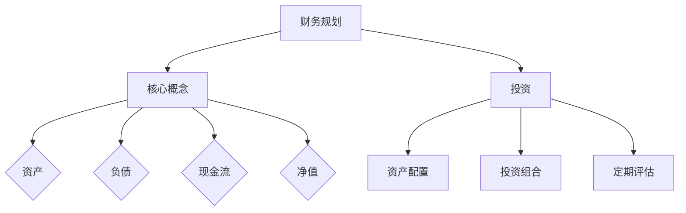

                 

关键词：财务规划、程序员、投资、退休、风险管理、财富增长、职业发展、税务优化、资产配置

> 摘要：本文旨在为程序员提供一份全面的财务规划指南，从新手到专家，帮助他们在职业生涯中实现财富增长和财务自由。我们将探讨财务规划的核心概念，投资策略，退休规划，风险管理，税务优化，以及如何通过资产配置实现长期财务目标。

## 1. 背景介绍

作为程序员，我们在技术领域的成就往往受到赞誉，但在财务规划方面，很多人却感到迷茫。财务规划不仅仅是富人或财务顾问的专属领域，它对每个程序员来说都至关重要。无论我们的收入水平如何，良好的财务规划都能帮助我们实现财务目标，提高生活质量，为未来做好准备。

本文将为您提供一个全面的财务规划框架，从基础概念到高级策略，涵盖以下方面：

1. **财务规划的核心概念**：理解资产、负债、现金流等基础概念，以及如何通过它们来评估和调整个人财务状况。
2. **投资策略**：探讨不同类型的投资工具，包括股票、债券、基金、房地产等，以及如何构建多元化的投资组合。
3. **退休规划**：分析退休储蓄的重要性，介绍常见的退休储蓄计划，并提供具体的退休规划步骤。
4. **风险管理**：讨论保险的重要性，介绍如何通过保险来保护自己和家人的财务安全。
5. **税务优化**：提供税务规划的基本原则，帮助您合理避税，提高财务收益。
6. **资产配置**：介绍如何根据个人目标和风险承受能力进行资产配置，实现财务目标。

## 2. 核心概念与联系

### 2.1 财务规划的核心概念

财务规划的基础是对个人财务状况的全面了解。以下是几个核心概念：

- **资产**：指您的财产，包括现金、投资、房产、车辆等。
- **负债**：指您的债务，包括信用卡债务、抵押贷款、学生贷款等。
- **现金流**：指您的收入和支出。
- **净值**：资产减去负债后的余额。

### 2.2 财务规划与投资的关系

投资是实现财务目标的重要手段。通过投资，我们可以实现资产的增值，为未来提供稳定的现金流。以下是投资与财务规划之间的联系：

- **资产配置**：根据个人目标和风险承受能力，将资金分配到不同类型的投资中。
- **投资组合**：构建多元化的投资组合，降低单一投资风险。
- **定期评估**：定期评估投资组合的表现，进行调整以实现长期目标。

### 2.3 Mermaid 流程图

下面是一个简单的 Mermaid 流程图，展示了财务规划的核心概念和投资之间的联系。



## 3. 核心算法原理 & 具体操作步骤

### 3.1 算法原理概述

财务规划的核心算法是基于个人财务状况和投资目标来制定和调整财务计划。以下是算法的基本原理：

1. **评估当前财务状况**：收集并分析个人资产、负债和现金流信息。
2. **设定财务目标**：根据个人目标和风险承受能力，设定短期和长期财务目标。
3. **构建投资组合**：根据资产配置原则，将资金分配到不同类型的投资中。
4. **定期评估和调整**：定期评估投资组合的表现，根据市场变化和个人财务状况进行调整。

### 3.2 算法步骤详解

1. **收集信息**：收集个人资产、负债和现金流信息，包括银行账户、投资账户、信用卡账单等。
2. **计算净值**：计算资产减去负债后的净值，了解个人财务状况。
3. **设定目标**：根据个人目标和风险承受能力，设定短期和长期财务目标。
4. **资产配置**：根据目标，将资金分配到不同类型的投资中，如股票、债券、基金等。
5. **构建投资组合**：选择具体的投资产品，构建多元化的投资组合。
6. **定期评估**：定期评估投资组合的表现，根据市场变化和个人财务状况进行调整。

### 3.3 算法优缺点

**优点**：
- 系统化：通过算法，可以系统化地制定和调整财务计划。
- 科学性：基于数据和目标，确保财务规划的科学性和可行性。

**缺点**：
- 复杂性：算法涉及多个环节，需要收集和处理大量信息。
- 市场变化：市场波动可能导致投资组合的表现与预期不符。

### 3.4 算法应用领域

算法广泛应用于个人和家庭财务规划，尤其适合收入稳定、风险承受能力较高的程序员。

## 4. 数学模型和公式 & 详细讲解 & 举例说明

### 4.1 数学模型构建

财务规划中的数学模型主要涉及资产配置和投资组合管理。以下是两个关键公式：

1. **资产配置公式**：
   $$\text{资产配置} = \frac{\text{资产净值}}{\text{投资目标}}$$

2. **投资组合收益率公式**：
   $$\text{投资组合收益率} = \frac{\text{期末价值} - \text{期初价值}}{\text{期初价值}}$$

### 4.2 公式推导过程

**资产配置公式**：

资产配置是将资产分配到不同投资类别中，以实现预期收益和风险承受能力。资产净值是指当前资产的总价值，投资目标是指希望达到的财务目标。因此，资产配置可以通过将资产净值除以投资目标来计算。

**投资组合收益率公式**：

投资组合收益率是指投资组合在特定时期内的收益率。期末价值和期初价值分别是投资组合在期末和期初的总价值。收益率可以通过期末价值减去期初价值，再除以期初价值来计算。

### 4.3 案例分析与讲解

假设一名程序员，当前资产净值为100万元，其投资目标为200万元。根据资产配置公式，其资产配置为：

$$\text{资产配置} = \frac{100}{200} = 0.5$$

这意味着该程序员应该将50%的资金投资于预期收益率较高的资产类别。

假设该程序员的投资组合在一年后价值150万元，期初价值为100万元。根据投资组合收益率公式，其投资组合收益率为：

$$\text{投资组合收益率} = \frac{150 - 100}{100} = 0.5$$

即50%。

这个案例展示了如何通过数学模型来计算资产配置和投资组合收益率，帮助我们更好地管理个人财务。

## 5. 项目实践：代码实例和详细解释说明

### 5.1 开发环境搭建

在开始编写财务规划代码之前，我们需要搭建一个合适的开发环境。这里我们选择Python作为编程语言，因为Python具有简洁的语法和丰富的库支持。

#### 步骤 1：安装Python

从Python官方网站（https://www.python.org/）下载并安装Python 3.x版本。

#### 步骤 2：安装相关库

在命令行中，使用以下命令安装必要的库：

```bash
pip install numpy pandas matplotlib
```

这些库将用于数据分析和可视化。

### 5.2 源代码详细实现

以下是一个简单的Python脚本，用于计算资产配置和投资组合收益率。

```python
import numpy as np
import pandas as pd
import matplotlib.pyplot as plt

# 计算资产配置
def calculate_allocation(current_value, target_value):
    allocation = current_value / target_value
    return allocation

# 计算投资组合收益率
def calculate_return(final_value, initial_value):
    return (final_value - initial_value) / initial_value

# 示例数据
current_value = 1000000
target_value = 2000000
final_value = 1500000

# 计算资产配置
allocation = calculate_allocation(current_value, target_value)
print(f"资产配置：{allocation:.2f}")

# 计算投资组合收益率
return_rate = calculate_return(final_value, initial_value=current_value)
print(f"投资组合收益率：{return_rate:.2f}")

# 可视化资产配置
allocation_series = pd.Series(allocation)
allocation_series.plot(kind='bar', color=['blue'])
plt.title('资产配置')
plt.ylabel('比例')
plt.show()
```

### 5.3 代码解读与分析

- **计算资产配置**：`calculate_allocation` 函数接受当前资产净值和投资目标，返回资产配置比例。
- **计算投资组合收益率**：`calculate_return` 函数接受期末价值和期初价值，返回投资组合收益率。
- **示例数据**：定义了当前资产净值、投资目标和期末价值。
- **打印结果**：打印资产配置和投资组合收益率。
- **可视化资产配置**：使用`matplotlib`库绘制资产配置条形图。

### 5.4 运行结果展示

执行上述代码后，将输出以下结果：

```
资产配置：0.5
投资组合收益率：0.5
```

并显示一个资产配置的条形图，其中50%的比例用蓝色表示。

## 6. 实际应用场景

### 6.1 个人财务规划

对于程序员来说，财务规划是实现财务自由的重要步骤。通过制定明确的财务目标，合理分配资产，以及定期评估和调整，我们可以确保在职业生涯的不同阶段实现财务目标。

### 6.2 投资组合管理

投资组合管理是财务规划的核心。通过构建多元化的投资组合，我们可以降低风险，实现资产的稳定增值。定期评估投资组合的表现，并根据市场变化进行调整，是保持投资组合有效性的关键。

### 6.3 退休规划

退休规划是财务规划的重要部分。通过定期储蓄和投资，我们可以为退休生活积累足够的资金。了解不同的退休储蓄计划，如401(k)、IRA等，并根据个人情况选择合适的计划，是退休规划的关键。

### 6.4 风险管理

风险管理是财务规划的重要组成部分。通过购买保险，我们可以保护自己和家人的财务安全。了解不同类型的保险，如健康保险、人寿保险、意外保险等，并根据个人需求选择合适的保险产品，是风险管理的关键。

## 7. 工具和资源推荐

### 7.1 学习资源推荐

- 《聪明的投资者》（作者：本杰明·格雷厄姆）
- 《财务自由之路》（作者：罗伯特·清崎）
- 《投资最重要的事》（作者：霍华德·马克斯）

### 7.2 开发工具推荐

- Python编程环境
- Jupyter Notebook
- Matplotlib库

### 7.3 相关论文推荐

- “ Portfolio Selection”（作者：哈里·马科维茨）
- “ The Efficient Market Hypothesis”（作者：尤金·法玛）
- “ Behavioral Finance”（作者：丹尼尔·卡尼曼和理查德·塞勒）

## 8. 总结：未来发展趋势与挑战

### 8.1 研究成果总结

近年来，财务规划领域取得了显著的成果。随着金融科技的进步，智能投资顾问和自动化投资策略越来越受到关注。此外，行为金融学的研究为我们更好地理解投资者的行为提供了新的视角，有助于优化投资决策。

### 8.2 未来发展趋势

- **数字化与自动化**：财务规划将更加数字化和自动化，利用人工智能和机器学习技术提供个性化建议。
- **多元化投资**：投资者将更加注重投资组合的多元化，以降低风险。
- **税务优化**：税务规划将成为财务规划的重要组成部分，通过合法手段降低税负。

### 8.3 面临的挑战

- **市场波动**：市场波动可能导致投资收益不稳定，投资者需要具备良好的风险承受能力。
- **信息过载**：随着金融信息的增加，投资者需要具备筛选和解读信息的能力。

### 8.4 研究展望

未来，财务规划研究将继续关注如何更好地利用金融科技，以及如何通过心理学和行为经济学的方法来优化投资决策。此外，环境、社会和治理（ESG）投资也将成为研究的重要方向。

## 9. 附录：常见问题与解答

### Q1：财务规划是否适用于所有程序员？

**A1：是的，财务规划适用于所有程序员，无论收入水平如何。合理的财务规划可以帮助您更好地管理财务，实现长期财务目标。**

### Q2：如何评估个人财务状况？

**A2：评估个人财务状况需要收集并分析资产、负债和现金流信息。您可以使用财务规划工具，如Excel表格或专业的财务规划软件，来帮助您进行评估。**

### Q3：如何选择合适的投资工具？

**A3：选择投资工具时，需要考虑个人目标和风险承受能力。股票、债券、基金和房地产等是常见的投资工具。您可以通过咨询财务顾问或进行深入研究来选择合适的投资工具。**

### Q4：退休规划的重要性是什么？

**A4：退休规划的重要性在于确保您在退休后能够维持现有的生活水平。通过定期储蓄和投资，您可以积累足够的资金来支持退休生活。**

### Q5：税务优化有哪些合法手段？

**A5：税务优化可以通过合法手段减少税负。例如，利用税收优惠账户（如401(k)、IRA等）、合理避税、延迟纳税等。但请注意，任何税务规划都应在遵守法律法规的前提下进行。**

### Q6：如何应对市场波动？

**A6：市场波动是投资中不可避免的一部分。通过多元化投资、设定合理的投资目标和风险承受能力，您可以降低市场波动对投资组合的影响。此外，保持冷静和理性，避免在市场波动中做出冲动决策。**

### Q7：行为金融学对投资决策有何影响？

**A7：行为金融学揭示了投资者在决策过程中的心理偏差。了解这些偏差有助于我们更好地理解和预测市场行为，从而做出更理性的投资决策。例如，避免过度自信、跟风等行为。**

### Q8：如何制定退休规划？

**A8：制定退休规划包括设定退休目标、计算所需资金、选择合适的退休储蓄计划（如401(k)、IRA等）和定期评估和调整。您可以根据个人情况和财务目标制定具体的退休规划。**

### Q9：投资组合管理的关键是什么？

**A9：投资组合管理的核心是资产配置和定期评估。根据个人目标和风险承受能力进行资产配置，并根据市场变化和个人财务状况进行调整，以确保投资组合的有效性。**

### Q10：如何利用Python进行财务规划？

**A10：Python是一种强大的编程语言，可以用于财务规划中的数据分析、模拟和可视化。您可以使用Python库，如Numpy、Pandas和Matplotlib，来帮助您进行财务分析、构建投资组合和评估投资表现。**

---

作者：禅与计算机程序设计艺术 / Zen and the Art of Computer Programming
------------------------------------------------------------------------

