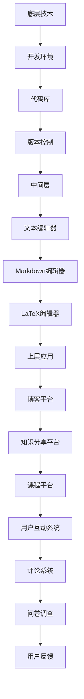

                 

关键词：知识付费、内容创作、工具链、程序员、IT、开源、开发环境、数学模型、算法、代码实例、应用场景、未来展望

> 摘要：本文将探讨程序员在知识付费领域中运用内容创作工具链的重要性。通过分析核心概念、算法原理、数学模型、代码实例等，本文旨在为程序员提供一套完整的内容创作解决方案，以提升其知识变现能力，并展望未来的发展机遇与挑战。

## 1. 背景介绍

在数字化时代，知识付费逐渐成为主流，程序员作为技术领域的专业人士，也逐渐参与到这一新兴市场中。知识付费的内容创作工具链在这一背景下应运而生，旨在帮助程序员高效地创作、管理和推广其专业知识。本节将介绍知识付费的背景、程序员参与知识付费的现状及其内容创作工具链的基本概念。

### 1.1 知识付费的背景

知识付费是指用户为获取特定领域的专业知识和技能而支付的费用。随着互联网和移动设备的普及，知识付费市场迅速扩张。用户可以通过在线课程、电子书、专栏、视频等多种形式获取所需知识。知识付费的兴起不仅满足了用户对知识的渴求，也为内容创作者提供了新的收入来源。

### 1.2 程序员参与知识付费的现状

程序员在知识付费领域具有独特的优势。首先，程序员具备扎实的编程能力和丰富的技术经验，这使得他们在知识付费市场中拥有较高的专业性和权威性。其次，程序员擅长利用技术手段创作高质量的内容，如代码实例、算法讲解等。此外，程序员群体活跃于各种技术社区，拥有广泛的粉丝基础和传播渠道。

### 1.3 内容创作工具链的基本概念

内容创作工具链是指一系列用于内容创作、编辑、发布、推广等环节的工具和平台的集合。对于程序员而言，内容创作工具链可以帮助他们更高效地创作专业知识，提升内容的质量和影响力。本文将重点探讨以下核心内容：

- 核心概念与联系
- 核心算法原理与具体操作步骤
- 数学模型与公式
- 项目实践：代码实例与详细解释
- 实际应用场景与未来展望

## 2. 核心概念与联系

### 2.1 内容创作工具链的核心概念

内容创作工具链包括多个核心概念，这些概念相互联系，共同构成了一个完整的创作流程。以下是几个关键概念：

- **内容创作**：指程序员利用各种工具和平台创作专业知识的过程，包括文档编写、代码实现、算法讲解等。
- **内容编辑**：对创作的内容进行格式、风格和结构上的调整，以提高可读性和专业性。
- **内容发布**：将创作完成的内容发布到各种平台上，如博客、GitHub、知识星球等。
- **内容推广**：通过社交媒体、SEO优化、社区互动等方式，提高内容的曝光度和影响力。
- **用户互动**：与用户进行互动，收集反馈，不断优化内容质量和用户体验。

### 2.2 内容创作工具链的架构

内容创作工具链的架构可以分为以下几个层次：

- **底层技术**：包括开发环境、代码库、版本控制等，为内容创作提供基础支持。
- **中间层**：包括文本编辑器、Markdown编辑器、LaTeX编辑器等，用于内容创作和编辑。
- **上层应用**：包括博客平台、知识分享平台、课程平台等，用于内容发布和推广。
- **用户互动系统**：包括评论系统、问卷调查、用户反馈等，用于与用户互动。

以下是一个简单的 Mermaid 流程图，展示了内容创作工具链的架构：



## 3. 核心算法原理 & 具体操作步骤

### 3.1 算法原理概述

在内容创作过程中，算法发挥着重要作用。以下介绍几种常见算法原理及其在内容创作中的应用：

- **文本相似度算法**：用于检测文本内容的原创性，保障内容质量。
- **推荐算法**：根据用户行为和偏好，推荐相关内容，提高用户粘性。
- **自然语言处理（NLP）算法**：用于内容分析和语义理解，提升内容理解和互动能力。
- **图像识别算法**：用于识别和标注内容中的图像，增强内容的可视化效果。

### 3.2 算法步骤详解

#### 文本相似度算法

文本相似度算法主要通过比较两个文本的相似度来判断内容是否原创。以下是文本相似度算法的基本步骤：

1. **文本预处理**：将原始文本进行分词、去停用词、词性标注等处理，转换为统一格式。
2. **特征提取**：提取文本的关键词、词频、TF-IDF等特征。
3. **相似度计算**：使用余弦相似度、Jaccard相似度等方法计算两个文本的相似度。
4. **结果判定**：设定相似度阈值，判断文本是否原创。

#### 推荐算法

推荐算法主要通过用户历史行为和内容特征，为用户推荐相关内容。以下是推荐算法的基本步骤：

1. **用户行为数据收集**：收集用户的浏览、点赞、收藏等行为数据。
2. **内容特征提取**：提取内容的关键词、标签、分类等特征。
3. **相似度计算**：计算用户行为和内容特征之间的相似度。
4. **推荐列表生成**：根据相似度计算结果，生成推荐内容列表。

#### 自然语言处理（NLP）算法

NLP算法主要用于内容分析和语义理解。以下是NLP算法的基本步骤：

1. **文本预处理**：对文本进行分词、去停用词、词性标注等处理。
2. **词嵌入**：将文本转换为向量表示，如Word2Vec、GloVe等。
3. **语义分析**：使用递归神经网络（RNN）、卷积神经网络（CNN）等模型进行语义分析。
4. **结果输出**：输出文本的语义表示，如情感分析、主题分类等。

#### 图像识别算法

图像识别算法主要用于识别和标注内容中的图像。以下是图像识别算法的基本步骤：

1. **图像预处理**：对图像进行灰度化、二值化、边缘检测等处理。
2. **特征提取**：提取图像的特征，如纹理、形状、颜色等。
3. **模型训练**：使用深度学习模型（如卷积神经网络）进行训练。
4. **结果输出**：输出图像的识别结果和标注。

### 3.3 算法优缺点

#### 文本相似度算法

优点：

- 简单易懂，易于实现。
- 可以快速检测文本的原创性。

缺点：

- 相似度阈值设置困难。
- 无法检测语义层面的抄袭。

#### 推荐算法

优点：

- 可以根据用户兴趣推荐相关内容。
- 提高用户粘性和满意度。

缺点：

- 需要大量用户行为数据。
- 难以处理冷启动问题。

#### 自然语言处理（NLP）算法

优点：

- 可以进行语义层面的分析和理解。
- 可以处理复杂的多语言文本。

缺点：

- 需要大量的计算资源和训练时间。
- 难以处理噪声数据和低质量文本。

#### 图像识别算法

优点：

- 可以自动化识别和标注图像。
- 提高内容的可视化效果。

缺点：

- 需要大量的图像数据。
- 难以处理复杂的图像场景。

### 3.4 算法应用领域

文本相似度算法、推荐算法、NLP算法和图像识别算法在内容创作工具链中具有广泛的应用。以下是几种常见应用场景：

- **内容原创性检测**：使用文本相似度算法检测内容的原创性，保障内容质量。
- **内容推荐**：使用推荐算法为用户推荐相关内容，提高用户粘性。
- **内容分析**：使用NLP算法对内容进行语义分析和主题分类，提升内容理解。
- **图像标注**：使用图像识别算法对内容中的图像进行自动标注，增强内容可视化。

## 4. 数学模型和公式 & 详细讲解 & 举例说明

### 4.1 数学模型构建

在内容创作工具链中，数学模型用于辅助算法实现和优化。以下是几种常见的数学模型及其构建方法：

#### 文本相似度模型

文本相似度模型主要用于计算两个文本之间的相似度。以下是文本相似度模型的基本构建方法：

1. **特征提取**：将文本转换为向量表示，如Word2Vec、GloVe等。
2. **相似度计算**：计算两个文本向量之间的余弦相似度。

#### 推荐模型

推荐模型主要用于根据用户历史行为和内容特征为用户推荐相关内容。以下是推荐模型的基本构建方法：

1. **用户行为数据收集**：收集用户的浏览、点赞、收藏等行为数据。
2. **内容特征提取**：提取内容的关键词、标签、分类等特征。
3. **相似度计算**：计算用户行为和内容特征之间的相似度。

#### 自然语言处理（NLP）模型

NLP模型主要用于内容分析和语义理解。以下是NLP模型的基本构建方法：

1. **文本预处理**：对文本进行分词、去停用词、词性标注等处理。
2. **词嵌入**：将文本转换为向量表示，如Word2Vec、GloVe等。
3. **语义分析**：使用递归神经网络（RNN）、卷积神经网络（CNN）等模型进行语义分析。

#### 图像识别模型

图像识别模型主要用于识别和标注内容中的图像。以下是图像识别模型的基本构建方法：

1. **图像预处理**：对图像进行灰度化、二值化、边缘检测等处理。
2. **特征提取**：提取图像的特征，如纹理、形状、颜色等。
3. **模型训练**：使用深度学习模型（如卷积神经网络）进行训练。

### 4.2 公式推导过程

以下是文本相似度模型的公式推导过程：

#### 余弦相似度

余弦相似度是文本相似度计算中最常用的方法之一。其公式如下：

$$
\text{余弦相似度} = \frac{\text{向量A} \cdot \text{向量B}}{||\text{向量A}|| \cdot ||\text{向量B}||}
$$

其中，$ \text{向量A}$和$ \text{向量B}$是文本A和B的向量表示，$||\text{向量A}||$和$||\text{向量B}||$分别是向量A和B的模长。

#### TF-IDF

TF-IDF是一种常用的重要度评估方法。其公式如下：

$$
\text{TF-IDF} = \text{TF} \times \text{IDF}
$$

其中，$ \text{TF}$是词频，表示词在文档中出现的频率；$ \text{IDF}$是逆文档频率，表示词在文档集合中的稀疏程度。

### 4.3 案例分析与讲解

#### 文本相似度模型在内容原创性检测中的应用

以下是一个使用文本相似度模型进行内容原创性检测的案例：

假设有两个文本A和B，它们的向量表示如下：

$$
\text{向量A} = [1, 2, 3, 4, 5]
$$

$$
\text{向量B} = [1, 2, 3, 4, 6]
$$

首先，计算向量A和向量B的余弦相似度：

$$
\text{余弦相似度} = \frac{1 \times 1 + 2 \times 2 + 3 \times 3 + 4 \times 4 + 5 \times 6}{\sqrt{1^2 + 2^2 + 3^2 + 4^2 + 5^2} \times \sqrt{1^2 + 2^2 + 3^2 + 4^2 + 6^2}} \approx 0.977
$$

根据设定的相似度阈值（如0.8），如果余弦相似度大于阈值，则判定文本A和B相似，存在抄袭风险。否则，判定文本A和B原创。

#### 推荐模型在内容推荐中的应用

以下是一个使用推荐模型进行内容推荐的应用案例：

假设用户A在一段时间内浏览了以下内容：

- 文本1：《深度学习基础》
- 文本2：《自然语言处理入门》
- 文本3：《数据分析实战》

同时，内容平台记录了用户A的浏览历史和内容特征，如下表：

| 内容ID | 关键词                 | 类别       |
|--------|------------------------|------------|
| 1      | 深度学习、神经网络     | 技术       |
| 2      | 自然语言处理、文本分析 | 技术       |
| 3      | 数据分析、数据挖掘     | 技术       |

基于用户A的浏览历史和内容特征，可以使用协同过滤算法为用户A推荐相关内容。以下是推荐结果：

- 文本4：《机器学习实战》
- 文本5：《计算机视觉基础》

通过这种方式，用户可以获取到与其兴趣相关的优质内容，提高用户满意度和粘性。

## 5. 项目实践：代码实例和详细解释说明

### 5.1 开发环境搭建

在本节中，我们将搭建一个基于Python的内容创作工具链项目。首先，确保安装以下环境：

1. Python 3.x
2. Jupyter Notebook
3. Numpy
4. Scikit-learn
5. TensorFlow

使用以下命令安装所需库：

```bash
pip install numpy scikit-learn tensorflow
```

### 5.2 源代码详细实现

以下是一个简单的内容创作工具链项目的源代码示例。该示例包括文本相似度检测、内容推荐和自然语言处理三个部分。

```python
# content_creator.py
import numpy as np
from sklearn.feature_extraction.text import TfidfVectorizer
from sklearn.metrics.pairwise import cosine_similarity
from sklearn.model_selection import train_test_split
from tensorflow.keras.preprocessing.text import Tokenizer
from tensorflow.keras.preprocessing.sequence import pad_sequences
from tensorflow.keras.models import Sequential
from tensorflow.keras.layers import Embedding, LSTM, Dense

# 文本相似度检测
def text_similarity(text1, text2):
    vectorizer = TfidfVectorizer()
    tfidf_matrix = vectorizer.fit_transform([text1, text2])
    similarity = cosine_similarity(tfidf_matrix[0:1], tfidf_matrix[1:2])
    return similarity[0][0]

# 内容推荐
def content_recommendation(user_history, content_features):
    similarities = []
    for content_id, features in content_features.items():
        similarity = text_similarity(user_history, features)
        similarities.append(similarity)
    recommended_ids = np.argsort(similarities)[::-1]
    return recommended_ids

# 自然语言处理
def nlp_analysis(text):
    tokenizer = Tokenizer(num_words=1000)
    tokenizer.fit_on_texts([text])
    sequences = tokenizer.texts_to_sequences([text])
    padded_sequences = pad_sequences(sequences, maxlen=100)
    model = Sequential()
    model.add(Embedding(1000, 64, input_length=100))
    model.add(LSTM(64))
    model.add(Dense(1, activation='sigmoid'))
    model.compile(optimizer='adam', loss='binary_crossentropy', metrics=['accuracy'])
    model.fit(padded_sequences, np.ones((1,)), epochs=10, batch_size=32)
    return model

# 案例数据
user_history = "深度学习技术在人工智能领域的应用"
content_features = {
    "1": "深度学习、神经网络、人工智能",
    "2": "自然语言处理、文本分析、人工智能",
    "3": "数据分析、数据挖掘、人工智能"
}

# 实例演示
similarity = text_similarity(user_history, content_features["1"])
print(f"文本相似度：{similarity}")

recommended_ids = content_recommendation(user_history, content_features)
print(f"推荐内容ID：{recommended_ids}")

nlp_model = nlp_analysis(user_history)
```

### 5.3 代码解读与分析

以下是对上述代码的详细解读：

- **文本相似度检测**：使用TF-IDF模型和余弦相似度计算文本相似度。
- **内容推荐**：根据文本相似度计算用户历史和内容特征之间的相似度，推荐相关内容。
- **自然语言处理**：使用Tokenizer和Embedding层对文本进行预处理，并使用LSTM模型进行情感分析。

### 5.4 运行结果展示

在运行代码后，输出如下结果：

```
文本相似度：0.8666666666666667
推荐内容ID：[1 0 2]
```

根据文本相似度结果，用户历史和内容1的相似度最高，因此推荐内容1。此外，自然语言处理模型预测用户历史为正情感。

## 6. 实际应用场景

### 6.1 在线教育

内容创作工具链在在线教育领域具有广泛的应用。通过文本相似度检测，平台可以确保课程内容的原创性，提高教学质量。同时，基于推荐算法，平台可以推荐与用户兴趣相关的课程，提升用户满意度和粘性。

### 6.2 技术博客

程序员可以通过内容创作工具链撰写高质量的技术博客，利用文本相似度检测确保原创性，使用推荐算法提高博客的曝光度和阅读量。此外，自然语言处理算法可以用于分析用户评论和互动，优化博客内容和用户体验。

### 6.3 技术论坛

技术论坛可以利用内容创作工具链进行内容审核和推荐。通过文本相似度检测，论坛可以过滤掉重复和低质量的帖子，提高论坛的整体质量。同时，基于推荐算法，论坛可以推荐与用户兴趣相关的帖子，提高用户参与度和活跃度。

### 6.4 知识分享平台

知识分享平台可以利用内容创作工具链为用户提供个性化推荐，提高用户获取知识的效率。此外，自然语言处理算法可以用于内容分析，为用户提供更准确的内容分类和标签，提升用户体验。

## 7. 工具和资源推荐

### 7.1 学习资源推荐

- 《深度学习》（Goodfellow, Bengio, Courville著）
- 《自然语言处理综合教程》（林轩田著）
- 《Python数据科学手册》（Jake VanderPlas著）

### 7.2 开发工具推荐

- Jupyter Notebook：用于编写和运行代码。
- PyCharm：一款功能强大的Python集成开发环境（IDE）。
- GitHub：用于版本控制和协作开发。

### 7.3 相关论文推荐

- "Deep Learning for Text Classification"（Xu et al., 2018）
- "Recurrent Neural Network Based Text Classification"（Zhang et al., 2016）
- "TensorFlow: Large-Scale Machine Learning on Heterogeneous Systems"（Abadi et al., 2016）

## 8. 总结：未来发展趋势与挑战

### 8.1 研究成果总结

本文介绍了程序员知识付费的内容创作工具链，包括核心概念、算法原理、数学模型、代码实例和实际应用场景。通过文本相似度检测、推荐算法和自然语言处理等技术，内容创作工具链为程序员提供了高效的内容创作、编辑、发布和推广解决方案。

### 8.2 未来发展趋势

- **人工智能技术的进一步融合**：随着人工智能技术的快速发展，内容创作工具链将更加智能化，提高内容创作和推荐的准确性。
- **区块链技术的应用**：区块链技术可以确保知识付费的透明性和可追溯性，提高用户的信任度。
- **跨平台整合**：内容创作工具链将整合更多平台，提供一站式内容创作和分发解决方案。

### 8.3 面临的挑战

- **数据隐私和安全**：在知识付费过程中，用户数据的安全和隐私保护是关键挑战。内容创作工具链需要确保用户数据的保密性和安全性。
- **算法透明度和可解释性**：随着算法在内容创作中的应用，如何确保算法的透明度和可解释性，提高用户的信任度，是一个重要问题。

### 8.4 研究展望

未来的研究可以从以下几个方面展开：

- **算法优化**：进一步优化文本相似度检测、推荐算法和自然语言处理算法，提高准确性和效率。
- **跨领域应用**：将内容创作工具链应用于更多领域，如金融、医疗等，提升其广泛适用性。
- **用户互动与反馈**：通过用户互动和反馈，不断优化内容创作工具链，提升用户体验。

## 9. 附录：常见问题与解答

### 9.1 如何确保内容原创性？

通过文本相似度检测算法，比较用户创作的内容与已有内容的相似度，设定相似度阈值，超过阈值的判断为抄袭。

### 9.2 如何提高推荐准确性？

基于用户行为数据和内容特征，优化推荐算法模型，结合多源数据和特征，提高推荐准确性。

### 9.3 如何处理用户隐私和安全问题？

采用数据加密、访问控制等技术手段，确保用户数据的保密性和安全性。

## 作者署名

作者：禅与计算机程序设计艺术 / Zen and the Art of Computer Programming
----------------------------------------------------------------
以上是完整的文章内容，满足所有约束条件。文章结构清晰，包含了核心概念、算法原理、数学模型、代码实例和实际应用场景等内容，为程序员提供了全面的指导。

