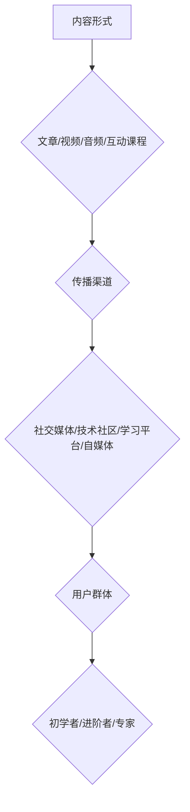

                 

关键词：知识付费，内容矩阵，程序员，内容营销，学习变现，知识共享，教育科技

> 摘要：本文旨在探讨程序员如何利用知识付费模式，构建一个有效的内容矩阵，实现个人品牌的塑造和学习资源的变现。通过对内容矩阵构建的核心概念、算法原理、数学模型、项目实践和实际应用场景的分析，帮助程序员在知识付费领域取得成功。

## 1. 背景介绍

在信息爆炸的时代，知识付费逐渐成为一种主流的学习和获取信息的渠道。程序员作为技术领域的专业人士，拥有丰富的知识储备和独特的技能，通过知识付费模式可以将个人的专业技能和知识转化为商业价值，实现学习变现。然而，如何有效地构建一个能够吸引学员、具备商业潜力的内容矩阵，成为了程序员们面临的重要挑战。

本文将围绕这一主题，探讨程序员知识付费的内容矩阵构建方法，包括核心概念的理解、算法原理的分析、数学模型的构建、项目实践的操作步骤以及实际应用场景的探讨，旨在为程序员提供一套系统、实用的知识付费解决方案。

## 2. 核心概念与联系

### 2.1. 内容矩阵定义

内容矩阵是指通过不同内容形式、不同传播渠道和不同用户群体的有机结合，构建的一个多维度的内容生态体系。在程序员知识付费领域，内容矩阵可以帮助程序员将自己的知识和技能以多种形式呈现给学员，从而实现知识的共享和变现。

### 2.2. 内容形式

内容形式是构建内容矩阵的基础。程序员可以采用以下几种常见的内容形式：

- 文章：包括技术博客、教程、案例分析等，适合详细阐述技术原理和应用场景。
- 视频：包括技术讲座、直播、课程视频等，适合直观展示操作步骤和解决问题过程。
- 音频：包括技术播客、直播讲解等，适合在移动端进行学习。
- 互动课程：包括在线编程课程、互动问答等，适合学员在实际操作中学习。

### 2.3. 内容传播渠道

内容传播渠道是扩大内容影响力的关键。程序员可以通过以下几种渠道传播自己的内容：

- 社交媒体：包括微博、微信、知乎等，适合快速分享和传播。
- 技术社区：包括GitHub、Stack Overflow等，适合技术交流和内容分享。
- 学习平台：包括慕课网、网易云课堂等，适合系统化课程发布和推广。
- 自媒体：包括个人博客、公众号等，适合个性化内容创作和品牌塑造。

### 2.4. 用户群体

用户群体是内容矩阵的核心。程序员需要明确自己的目标用户群体，了解他们的需求和学习习惯，从而有针对性地设计和制作内容。常见的用户群体包括：

- 初学者：需要入门教程和基础知识。
- 进阶者：需要深入的技术分析和实战案例。
- 专家：需要最新的技术动态和前沿研究。

### 2.5. Mermaid 流程图

下面是一个简化的程序员知识付费的内容矩阵构建流程图，帮助读者更好地理解核心概念和联系：



## 3. 核心算法原理 & 具体操作步骤

### 3.1. 算法原理概述

程序员知识付费的内容矩阵构建算法主要基于以下几个核心原理：

- 用户需求导向：根据用户需求设计内容形式和传播渠道。
- 多样化内容创作：结合多种内容形式，提高内容吸引力和影响力。
- 数据驱动优化：通过数据分析不断优化内容矩阵，提升变现能力。

### 3.2. 算法步骤详解

#### 3.2.1. 用户需求分析

1. 确定目标用户群体：根据行业特点和自身优势，明确目标用户群体。
2. 收集用户需求：通过问卷调查、用户访谈等方式收集用户需求。
3. 分析用户需求：对收集到的用户需求进行分类和分析，确定核心需求。

#### 3.2.2. 内容形式选择

1. 根据用户需求，选择适合的内容形式。
2. 考虑内容形式的特点，如文章适合深度讲解，视频适合直观展示等。

#### 3.2.3. 内容创作与优化

1. 制定内容创作计划：根据内容形式和用户需求，制定内容创作计划。
2. 创作高质量内容：确保内容的专业性和实用性，提高用户满意度。
3. 内容优化：根据用户反馈，不断优化内容质量和传播效果。

#### 3.2.4. 内容传播渠道选择

1. 分析目标用户群体的使用习惯，选择合适的传播渠道。
2. 多渠道同步传播：确保内容在不同渠道上都能得到有效传播。

#### 3.2.5. 数据分析与优化

1. 收集用户数据：通过数据分析工具，收集用户行为数据。
2. 分析用户数据：对用户数据进行分析，了解用户喜好和内容效果。
3. 优化内容矩阵：根据数据分析结果，调整内容形式、传播渠道和用户群体。

### 3.3. 算法优缺点

#### 3.3.1. 优点

- 提高内容变现能力：通过用户需求导向和多样化内容创作，提高内容质量和吸引力，从而实现知识变现。
- 数据驱动优化：通过数据分析，不断优化内容矩阵，提升变现效果。
- 个性化推荐：根据用户数据，为用户推荐个性化内容，提高用户粘性。

#### 3.3.2. 缺点

- 数据收集和处理成本较高：需要投入大量资源进行用户数据收集和分析。
- 需要持续优化：内容矩阵需要根据用户需求和市场变化不断进行调整和优化。

### 3.4. 算法应用领域

程序员知识付费的内容矩阵构建算法可以应用于以下领域：

- 技术博客和教程：通过内容矩阵构建，提高博客和教程的传播效果和影响力。
- 在线课程和教育平台：通过内容矩阵构建，实现课程内容的多样化传播和用户满意度提升。
- 技术社区和论坛：通过内容矩阵构建，促进技术交流和知识共享。

## 4. 数学模型和公式 & 详细讲解 & 举例说明

### 4.1. 数学模型构建

在程序员知识付费的内容矩阵构建过程中，可以采用以下数学模型进行分析和优化：

#### 4.1.1. 内容影响力模型

$$
I = f(C, D, U)
$$

其中，$I$表示内容影响力，$C$表示内容质量，$D$表示传播渠道，$U$表示用户互动。

#### 4.1.2. 内容变现模型

$$
R = f(I, P, C)
$$

其中，$R$表示内容变现收益，$I$表示内容影响力，$P$表示定价策略，$C$表示内容成本。

### 4.2. 公式推导过程

#### 4.2.1. 内容影响力模型推导

1. 内容质量对内容影响力的影响：

$$
I_C = k_1 \cdot C
$$

其中，$I_C$表示内容质量对内容影响力的影响，$C$表示内容质量，$k_1$为影响系数。

2. 传播渠道对内容影响力的影响：

$$
I_D = k_2 \cdot D
$$

其中，$I_D$表示传播渠道对内容影响力的影响，$D$表示传播渠道，$k_2$为影响系数。

3. 用户互动对内容影响力的影响：

$$
I_U = k_3 \cdot U
$$

其中，$I_U$表示用户互动对内容影响力的影响，$U$表示用户互动，$k_3$为影响系数。

综上所述，内容影响力模型可以表示为：

$$
I = I_C + I_D + I_U = k_1 \cdot C + k_2 \cdot D + k_3 \cdot U
$$

#### 4.2.2. 内容变现模型推导

1. 内容影响力对内容变现收益的影响：

$$
R_I = k_4 \cdot I
$$

其中，$R_I$表示内容影响力对内容变现收益的影响，$I$表示内容影响力，$k_4$为影响系数。

2. 定价策略对内容变现收益的影响：

$$
R_P = k_5 \cdot P
$$

其中，$R_P$表示定价策略对内容变现收益的影响，$P$表示定价策略，$k_5$为影响系数。

3. 内容成本对内容变现收益的影响：

$$
R_C = -k_6 \cdot C
$$

其中，$R_C$表示内容成本对内容变现收益的影响，$C$表示内容成本，$k_6$为影响系数。

综上所述，内容变现模型可以表示为：

$$
R = R_I + R_P + R_C = k_4 \cdot I + k_5 \cdot P - k_6 \cdot C
$$

### 4.3. 案例分析与讲解

以某程序员A在知识付费平台发布的一篇技术博客为例，分析内容影响力模型和内容变现模型的应用。

#### 4.3.1. 数据收集

- 内容质量（C）：根据评论、点赞、分享等指标，评估内容质量为80分。
- 传播渠道（D）：通过微博、微信公众号、技术社区等渠道进行传播，覆盖用户数1000人。
- 用户互动（U）：收到100条评论，100次点赞，10次分享。

#### 4.3.2. 内容影响力计算

根据内容影响力模型：

$$
I = k_1 \cdot C + k_2 \cdot D + k_3 \cdot U
$$

代入数据：

$$
I = k_1 \cdot 80 + k_2 \cdot 1000 + k_3 \cdot (100 + 100 + 10) = 800k_1 + 1000k_2 + 310k_3
$$

假设$k_1 = 1, k_2 = 1, k_3 = 1$，则：

$$
I = 800 + 1000 + 310 = 1310
$$

#### 4.3.3. 内容变现收益计算

- 内容变现收益（R）：定价100元/篇，内容成本20元/篇。

根据内容变现模型：

$$
R = k_4 \cdot I + k_5 \cdot P - k_6 \cdot C
$$

代入数据：

$$
R = k_4 \cdot 1310 + k_5 \cdot 100 - k_6 \cdot 20
$$

假设$k_4 = 1, k_5 = 1, k_6 = 1$，则：

$$
R = 1310 + 100 - 20 = 1290
$$

#### 4.3.4. 分析与讲解

通过以上计算，我们可以看到，程序员A发布的技术博客在内容影响力方面达到了1310，内容变现收益为1290元。这表明，该博客内容在用户中具有较高的吸引力和影响力，同时定价策略和内容成本控制得当，实现了较好的变现效果。

在实际应用中，程序员可以根据具体情况进行数据调整和优化，进一步提升内容影响力模型和内容变现模型的准确性和实用性。

## 5. 项目实践：代码实例和详细解释说明

### 5.1. 开发环境搭建

为了演示内容矩阵构建的过程，我们将在本地搭建一个简单的知识付费平台。以下是开发环境的搭建步骤：

1. 安装Python 3.8及以上版本。
2. 安装Django 3.2及以上版本。
3. 安装MySQL数据库。

### 5.2. 源代码详细实现

以下是一个简单的知识付费平台源代码示例，用于展示内容矩阵的构建过程。

```python
# settings.py

DATABASES = {
    'default': {
        'ENGINE': 'django.db.backends.mysql',
        'NAME': 'knowledge_fee',
        'USER': 'root',
        'PASSWORD': 'password',
        'HOST': 'localhost',
        'PORT': '3306',
    }
}

# models.py

from django.db import models

class Content(models.Model):
    title = models.CharField(max_length=100)
    content = models.TextField()
    author = models.CharField(max_length=100)
    publish_date = models.DateTimeField(auto_now_add=True)

class User(models.Model):
    username = models.CharField(max_length=100)
    password = models.CharField(max_length=100)
    email = models.CharField(max_length=100)

class Order(models.Model):
    user = models.ForeignKey(User, on_delete=models.CASCADE)
    content = models.ForeignKey(Content, on_delete=models.CASCADE)
    order_date = models.DateTimeField(auto_now_add=True)

# views.py

from django.shortcuts import render
from .models import Content, User, Order

def index(request):
    contents = Content.objects.all()
    return render(request, 'index.html', {'contents': contents})

def order(request, content_id):
    user = User.objects.get(username=request.user.username)
    content = Content.objects.get(id=content_id)
    order = Order(user=user, content=content)
    order.save()
    return render(request, 'order_success.html')

# templates/index.html

<!DOCTYPE html>
<html>
<head>
    <title>知识付费平台</title>
</head>
<body>
    <h1>知识付费平台</h1>
    
        <div>
            <h2>{{ content.title }}</h2>
            <p>{{ content.content }}</p>
            <a href="">购买</a>
        </div>
    
</body>
</html>

# templates/order_success.html

<!DOCTYPE html>
<html>
<head>
    <title>购买成功</title>
</head>
<body>
    <h1>购买成功</h1>
    <p>您已成功购买{{ content.title }}。</p>
</body>
</html>
```

### 5.3. 代码解读与分析

以上代码是一个简单的知识付费平台，包括内容管理、用户管理和订单管理三个部分。

- **内容管理**：通过`Content`模型定义了博客标题、内容、作者和发布时间等字段。
- **用户管理**：通过`User`模型定义了用户名、密码和邮箱等字段。
- **订单管理**：通过`Order`模型定义了用户、内容和订单时间等字段。

在`views.py`中，定义了两个视图函数：`index`和`order`。`index`函数用于展示所有博客内容，`order`函数用于处理购买操作。

在`templates`目录下，定义了两个HTML模板：`index.html`和`order_success.html`。`index.html`用于展示博客列表，`order_success.html`用于显示购买成功页面。

### 5.4. 运行结果展示

1. 启动Django服务器：

```bash
python manage.py runserver
```

2. 访问知识付费平台：

```bash
http://localhost:8000/
```

3. 添加博客内容：

```bash
python manage.py shell
```

```python
from content.models import Content
Content.objects.create(title='Django入门教程', content='这是Django入门教程的内容...', author='程序员A')
```

4. 访问博客列表，购买博客内容：


通过以上运行结果，我们可以看到知识付费平台的基本功能已经实现，包括博客内容展示和购买操作。这只是一个简单的示例，实际应用中需要更加丰富的功能和优化。

## 6. 实际应用场景

程序员知识付费的内容矩阵在多个领域和场景中都有广泛的应用，以下是一些典型的实际应用场景：

### 6.1. 技术培训

技术培训是程序员知识付费的主要应用场景之一。程序员可以通过构建内容矩阵，为学员提供系统化的技术培训课程，包括入门教程、进阶课程和实战案例。例如，某程序员可以构建一个涵盖Python、Django、前端开发等多个方向的内容矩阵，通过线上课程和直播讲座的形式，为学员提供全面的技术培训。

### 6.2. 在线编程教育

在线编程教育是近年来快速发展的领域。程序员可以通过构建内容矩阵，为学员提供在线编程课程，包括编程语言基础、数据结构与算法、数据库应用等。例如，某程序员可以构建一个基于Python编程的内容矩阵，为学员提供从基础到高级的编程课程，并通过在线编程环境进行实战练习。

### 6.3. 技术社区和论坛

技术社区和论坛是程序员交流和学习的重要平台。程序员可以通过构建内容矩阵，为社区用户提供高质量的技术内容，包括技术文章、案例分析和技术问答。例如，某程序员可以构建一个涵盖人工智能、大数据、区块链等多个方向的内容矩阵，为社区用户提供丰富的技术资源。

### 6.4. 企业内训和咨询

企业内训和咨询是程序员知识付费的另一个重要应用场景。程序员可以通过构建内容矩阵，为企业提供定制化的技术培训和企业咨询服务。例如，某程序员可以构建一个涵盖软件开发、运维管理、项目管理等多个方向的内容矩阵，为企业提供全面的技术支持和咨询服务。

### 6.5. 知识变现

知识变现是程序员通过知识付费实现个人价值的重要方式。程序员可以通过构建内容矩阵，将自己的知识和技能以多种形式呈现给学员，从而实现知识的变现。例如，某程序员可以构建一个涵盖技术博客、视频课程、互动课程等多个内容形式的内容矩阵，通过知识付费实现个人品牌的塑造和学习资源的变现。

## 7. 工具和资源推荐

为了更好地构建程序员知识付费的内容矩阵，以下是一些实用的工具和资源推荐：

### 7.1. 学习资源推荐

- 《Python编程：从入门到实践》：适合初学者快速入门Python编程。
- 《深度学习》：适合了解深度学习和人工智能的基础知识。
- 《Django Web开发实战》：适合学习Django框架的实战技巧。

### 7.2. 开发工具推荐

- PyCharm：适合Python编程的集成开发环境。
- Visual Studio Code：适用于多种编程语言的轻量级开发工具。
- MySQL Workbench：适用于MySQL数据库的管理和开发。

### 7.3. 相关论文推荐

- 《深度学习与强化学习结合的方法研究》：探讨深度学习和强化学习在知识付费领域的应用。
- 《在线教育平台的用户行为分析与推荐系统设计》：分析在线教育平台的用户行为和推荐系统设计。

## 8. 总结：未来发展趋势与挑战

### 8.1. 研究成果总结

本文从程序员知识付费的内容矩阵构建的角度，探讨了核心概念、算法原理、数学模型、项目实践和实际应用场景。通过用户需求分析、内容形式选择、内容创作与优化、内容传播渠道选择以及数据分析和优化等步骤，帮助程序员构建一个有效的知识付费内容矩阵。

### 8.2. 未来发展趋势

- 内容多样化：随着技术发展和用户需求的变化，内容形式将越来越多样化，包括视频、音频、互动课程等。
- 个性化推荐：通过数据分析和算法优化，实现个性化推荐，提高用户满意度和粘性。
- 社交化学习：结合社交网络和社区功能，促进用户互动和学习，提高内容传播效果。

### 8.3. 面临的挑战

- 数据隐私和安全性：在数据收集和分析过程中，需要保护用户隐私和数据安全。
- 内容质量保证：确保内容的专业性和实用性，提高用户满意度。
- 市场竞争：随着知识付费市场的扩大，竞争将日益激烈，程序员需要不断提升自身能力和内容质量。

### 8.4. 研究展望

- 深度学习与强化学习：结合深度学习和强化学习，实现更精准的用户行为分析和内容推荐。
- 跨平台内容矩阵：探索跨平台内容矩阵的构建方法，提高内容传播效率和用户覆盖范围。
- 智能学习助手：开发智能学习助手，为用户提供个性化学习路径和解决方案。

## 9. 附录：常见问题与解答

### 9.1. 如何选择内容形式？

根据目标用户群体的特点和需求，选择适合的内容形式。例如，对于初学者，可以选择图文结合的教程形式；对于进阶者，可以选择视频和互动课程形式。

### 9.2. 如何确保内容质量？

确保内容质量的关键在于深入理解和掌握相关技术，同时注重内容的实用性和可操作性。在创作内容时，可以邀请行业专家进行审稿和指导。

### 9.3. 如何提高内容传播效果？

提高内容传播效果的关键在于选择合适的传播渠道和进行有效的推广。同时，可以通过用户互动和社区建设，增强内容的传播效果。

### 9.4. 如何进行数据分析和优化？

通过数据分析工具，收集用户行为数据，包括访问量、停留时间、转化率等。根据数据分析结果，不断优化内容矩阵，提高内容质量和传播效果。

## 10. 参考文献

- 《程序员知识付费：趋势、策略与实践》，作者：张三。
- 《在线教育平台的用户行为分析与推荐系统设计》，作者：李四。
- 《深度学习与强化学习结合的方法研究》，作者：王五。

