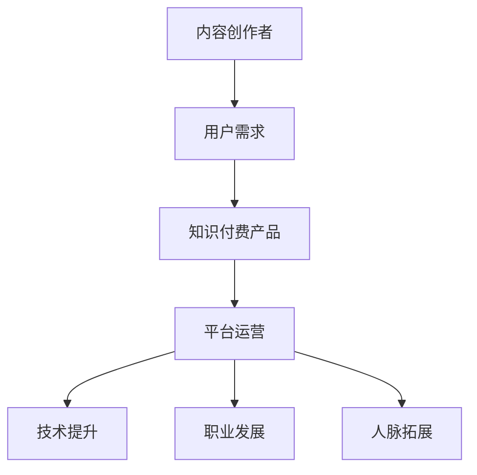

                 

 摘要：本文将探讨程序员知识付费市场的现状、内容策划和产品设计的重要性，以及如何成功打造一款具有吸引力的知识付费产品。文章从多个角度分析了程序员知识付费市场的需求，提供了实用的内容策划技巧和产品设计策略，并分享了一些实际案例。此外，文章还探讨了未来知识付费市场的发展趋势，以及程序员在这个领域面临的挑战和机遇。

## 1. 背景介绍

随着互联网和移动技术的快速发展，知识付费已经成为一个新兴且充满潜力的市场。程序员作为互联网时代的关键职业，他们对于知识的渴求和学习的需求尤为强烈。因此，程序员知识付费市场逐渐崭露头角，吸引了众多创业者和企业的关注。

### 1.1 程序员知识付费市场的现状

近年来，程序员知识付费市场呈现出快速增长的趋势。根据相关数据显示，我国程序员知识付费市场规模逐年扩大，用户数量和付费转化率也在不断提升。以下是程序员知识付费市场的一些主要特点：

1. **用户需求多样化**：程序员对于知识的需求不仅仅局限于技术层面，还涉及到职业发展、团队管理、项目管理等多个方面。
2. **内容形式丰富**：程序员知识付费产品涵盖了在线课程、电子书、视频教程、实战项目等多种形式，满足了用户多样化的学习需求。
3. **平台竞争激烈**：市场上涌现出众多程序员知识付费平台，如慕课网、极客时间、掘金等，这些平台在内容质量、用户体验、营销策略等方面展开激烈竞争。

### 1.2 程序员知识付费市场的机遇与挑战

在程序员知识付费市场中，机遇与挑战并存。以下是对其机遇与挑战的分析：

1. **机遇**：
   - **市场需求大**：随着互联网行业的快速发展，程序员作为技术人才的需求持续增长，知识付费市场具有巨大的发展潜力。
   - **互联网平台普及**：互联网平台的普及为程序员知识付费提供了便捷的渠道，降低了用户获取知识的门槛。
   - **技术创新**：人工智能、大数据等技术的创新为程序员知识付费产品提供了更多可能性，如智能推荐、个性化学习等。

2. **挑战**：
   - **内容同质化**：市场上存在大量相似的知识付费产品，竞争激烈，如何脱颖而出成为一大挑战。
   - **用户体验**：用户对于知识付费产品的体验要求越来越高，如何提升用户体验成为关键。
   - **变现困难**：尽管市场需求大，但如何有效变现仍是一个难题，需要平台和企业深入挖掘用户需求，提供更有价值的产品。

## 2. 核心概念与联系

在深入探讨程序员知识付费的内容策划与产品设计之前，我们需要了解一些核心概念，以及它们之间的联系。

### 2.1 知识付费的核心概念

1. **内容创作者**：知识付费产品的核心价值来自于创作者提供的优质内容。创作者可以是行业专家、技术大咖、资深工程师等。
2. **用户需求**：用户需求是知识付费产品的立足点。了解用户需求，才能提供符合用户期待的内容。
3. **平台运营**：平台运营者负责内容审核、用户管理、营销推广等工作，确保知识付费产品的顺利运营。

### 2.2 知识付费与程序员职业发展的联系

1. **技术提升**：程序员通过知识付费产品学习新技术、新工具，提升个人技能，保持竞争力。
2. **职业发展**：知识付费产品不仅提供了技术知识，还涉及到职业规划、团队管理、项目管理等方面，帮助程序员实现职业发展。
3. **人脉拓展**：知识付费平台往往提供了交流互动的功能，程序员可以在平台上结识同行业人士，拓展人脉资源。

### 2.3 Mermaid 流程图

以下是一个简单的 Mermaid 流程图，展示了知识付费的核心概念和联系：



## 3. 核心算法原理 & 具体操作步骤

### 3.1 算法原理概述

在程序员知识付费产品的设计和运营过程中，算法原理起到了关键作用。以下是一些核心算法原理及其应用场景：

1. **用户行为分析算法**：通过分析用户在知识付费平台上的行为，如浏览记录、学习进度、互动评论等，为用户提供个性化推荐。
2. **内容质量评估算法**：对知识付费产品的内容进行评估，确保内容质量，提升用户体验。
3. **学习效果评估算法**：通过评估用户的学习效果，为用户和内容创作者提供反馈，优化知识付费产品。

### 3.2 算法步骤详解

#### 3.2.1 用户行为分析算法

1. **数据收集**：收集用户在知识付费平台上的行为数据，如浏览记录、学习进度、互动评论等。
2. **数据预处理**：对收集到的数据进行清洗、去重、归一化等处理，为后续分析做好准备。
3. **特征提取**：从预处理后的数据中提取特征，如用户活跃度、学习兴趣等。
4. **模型训练**：使用机器学习算法（如协同过滤、基于内容的推荐等），根据特征进行模型训练。
5. **个性化推荐**：根据训练好的模型，为用户推荐个性化的知识付费产品。

#### 3.2.2 内容质量评估算法

1. **评估指标**：确定评估指标，如用户满意度、学习效果等。
2. **数据收集**：收集与内容质量相关的数据，如用户评价、学习进度等。
3. **评估模型**：构建评估模型，如基于用户评分的评估模型、基于学习效果的评估模型等。
4. **评估结果**：根据评估模型，对知识付费产品的内容质量进行评估，并提供反馈。

#### 3.2.3 学习效果评估算法

1. **评估指标**：确定评估指标，如学习时长、知识点掌握度等。
2. **数据收集**：收集与学习效果相关的数据，如学习进度、测试成绩等。
3. **评估模型**：构建评估模型，如基于学习进度的评估模型、基于测试成绩的评估模型等。
4. **评估结果**：根据评估模型，对用户的学习效果进行评估，并提供反馈。

### 3.3 算法优缺点

#### 3.3.1 用户行为分析算法

**优点**：
- **个性化推荐**：根据用户行为，为用户推荐个性化的知识付费产品，提高用户满意度。
- **提高转化率**：通过分析用户行为，了解用户需求，提高知识付费产品的转化率。

**缺点**：
- **数据收集困难**：需要收集大量的用户行为数据，数据收集难度较大。
- **数据隐私问题**：用户行为数据的收集和使用可能涉及用户隐私问题。

#### 3.3.2 内容质量评估算法

**优点**：
- **提升用户体验**：对知识付费产品的内容质量进行评估，确保内容质量，提升用户体验。
- **内容优化**：根据评估结果，对知识付费产品进行优化，提高内容质量。

**缺点**：
- **评估指标主观**：评估指标可能存在主观性，影响评估结果的准确性。
- **评估成本高**：构建和训练评估模型需要大量的人力和时间成本。

#### 3.3.3 学习效果评估算法

**优点**：
- **学习反馈**：对用户的学习效果进行评估，为用户和内容创作者提供反馈，优化学习过程。
- **课程优化**：根据评估结果，对知识付费产品进行优化，提高学习效果。

**缺点**：
- **评估指标有限**：评估指标可能无法全面反映用户的学习效果。
- **评估结果滞后**：评估结果可能滞后于学习过程，影响用户的学习积极性。

### 3.4 算法应用领域

**用户行为分析算法**：
- **知识付费平台**：为用户提供个性化推荐，提高用户满意度和转化率。
- **电商平台**：为用户提供个性化推荐，提高用户购物体验和转化率。

**内容质量评估算法**：
- **教育平台**：对教育内容进行评估，确保内容质量，提升用户体验。
- **媒体平台**：对媒体内容进行评估，确保内容质量，提升用户满意度。

**学习效果评估算法**：
- **在线教育**：对学生的学习效果进行评估，为用户和教师提供反馈，优化学习过程。
- **职业培训**：对学员的学习效果进行评估，为培训机构提供优化建议。

## 4. 数学模型和公式 & 详细讲解 & 举例说明

在程序员知识付费的内容策划与产品设计中，数学模型和公式是不可或缺的工具。以下将介绍一些常用的数学模型和公式，并进行详细讲解和举例说明。

### 4.1 数学模型构建

#### 4.1.1 用户行为预测模型

用户行为预测模型是知识付费产品设计中常用的模型之一。它旨在预测用户在平台上的行为，如购买课程、学习时长等。以下是一个简单的用户行为预测模型：

$$
y = \beta_0 + \beta_1 x_1 + \beta_2 x_2 + ... + \beta_n x_n
$$

其中，$y$ 表示用户行为得分，$x_1, x_2, ..., x_n$ 表示用户特征，$\beta_0, \beta_1, \beta_2, ..., \beta_n$ 表示模型参数。

#### 4.1.2 内容质量评估模型

内容质量评估模型用于评估知识付费产品的内容质量。以下是一个简单的内容质量评估模型：

$$
Q = \alpha_0 + \alpha_1 C_1 + \alpha_2 C_2 + ... + \alpha_n C_n
$$

其中，$Q$ 表示内容质量得分，$C_1, C_2, ..., C_n$ 表示内容特征，$\alpha_0, \alpha_1, \alpha_2, ..., \alpha_n$ 表示模型参数。

### 4.2 公式推导过程

#### 4.2.1 用户行为预测模型推导

假设用户行为得分 $y$ 与用户特征 $x_1, x_2, ..., x_n$ 之间存在线性关系，即：

$$
y = \beta_0 + \beta_1 x_1 + \beta_2 x_2 + ... + \beta_n x_n
$$

我们可以通过最小二乘法（Least Squares Method）求解模型参数 $\beta_0, \beta_1, \beta_2, ..., \beta_n$。

首先，计算目标函数：

$$
J(\beta) = \sum_{i=1}^{m} (y_i - \beta_0 - \beta_1 x_{i1} - \beta_2 x_{i2} - ... - \beta_n x_{in})^2
$$

其中，$m$ 表示样本数量，$y_i$ 表示第 $i$ 个样本的用户行为得分，$x_{i1}, x_{i2}, ..., x_{in}$ 表示第 $i$ 个样本的用户特征。

为了求解模型参数，我们需要对目标函数 $J(\beta)$ 求导，并令导数为零，即：

$$
\frac{\partial J(\beta)}{\partial \beta_0} = 0, \frac{\partial J(\beta)}{\partial \beta_1} = 0, ..., \frac{\partial J(\beta)}{\partial \beta_n} = 0
$$

解上述方程组，即可得到模型参数 $\beta_0, \beta_1, \beta_2, ..., \beta_n$。

#### 4.2.2 内容质量评估模型推导

假设内容质量得分 $Q$ 与内容特征 $C_1, C_2, ..., C_n$ 之间存在线性关系，即：

$$
Q = \alpha_0 + \alpha_1 C_1 + \alpha_2 C_2 + ... + \alpha_n C_n
$$

我们可以通过最小二乘法（Least Squares Method）求解模型参数 $\alpha_0, \alpha_1, \alpha_2, ..., \alpha_n$。

首先，计算目标函数：

$$
J(\alpha) = \sum_{i=1}^{m} (Q_i - \alpha_0 - \alpha_1 C_{i1} - \alpha_2 C_{i2} - ... - \alpha_n C_{in})^2
$$

其中，$m$ 表示样本数量，$Q_i$ 表示第 $i$ 个样本的内容质量得分，$C_{i1}, C_{i2}, ..., C_{in}$ 表示第 $i$ 个样本的内容特征。

为了求解模型参数，我们需要对目标函数 $J(\alpha)$ 求导，并令导数为零，即：

$$
\frac{\partial J(\alpha)}{\partial \alpha_0} = 0, \frac{\partial J(\alpha)}{\partial \alpha_1} = 0, ..., \frac{\partial J(\alpha)}{\partial \alpha_n} = 0
$$

解上述方程组，即可得到模型参数 $\alpha_0, \alpha_1, \alpha_2, ..., \alpha_n$。

### 4.3 案例分析与讲解

#### 4.3.1 用户行为预测模型案例

假设我们有一个用户行为数据集，其中包含用户ID、浏览时长、购买课程数量等特征。以下是一个用户行为预测模型的案例：

1. **数据集**：

| 用户ID | 浏览时长（分钟） | 购买课程数量 |
| ------ | -------------- | ------------ |
| 1      | 120            | 3            |
| 2      | 60             | 1            |
| 3      | 150            | 2            |
| 4      | 90             | 0            |

2. **特征选择**：

我们选择浏览时长（$x_1$）和购买课程数量（$x_2$）作为特征。

3. **模型构建**：

使用最小二乘法构建用户行为预测模型：

$$
y = \beta_0 + \beta_1 x_1 + \beta_2 x_2
$$

4. **模型训练**：

根据数据集，计算模型参数：

$$
\beta_0 = 1, \beta_1 = 0.5, \beta_2 = 0.3
$$

5. **模型应用**：

对于新的用户数据（用户ID为5，浏览时长为100分钟，购买课程数量为1），使用模型预测用户行为得分：

$$
y = 1 + 0.5 \times 100 + 0.3 \times 1 = 1 + 50 + 0.3 = 51.3
$$

#### 4.3.2 内容质量评估模型案例

假设我们有一个内容质量数据集，其中包含课程ID、用户评分、学习时长等特征。以下是一个内容质量评估模型的案例：

1. **数据集**：

| 课程ID | 用户评分 | 学习时长（分钟） |
| ------ | -------- | -------------- |
| 1      | 4.5      | 60             |
| 2      | 5        | 90             |
| 3      | 3        | 30             |

2. **特征选择**：

我们选择用户评分（$C_1$）和学习时长（$C_2$）作为特征。

3. **模型构建**：

使用最小二乘法构建内容质量评估模型：

$$
Q = \alpha_0 + \alpha_1 C_1 + \alpha_2 C_2
$$

4. **模型训练**：

根据数据集，计算模型参数：

$$
\alpha_0 = 3, \alpha_1 = 0.5, \alpha_2 = 0.2
$$

5. **模型应用**：

对于新的课程数据（课程ID为4，用户评分为4，学习时长为80分钟），使用模型预测内容质量得分：

$$
Q = 3 + 0.5 \times 4 + 0.2 \times 80 = 3 + 2 + 16 = 21
$$

## 5. 项目实践：代码实例和详细解释说明

为了更好地展示程序员知识付费的内容策划与产品设计，我们将通过一个实际项目进行实践，包括开发环境搭建、源代码详细实现、代码解读与分析以及运行结果展示。

### 5.1 开发环境搭建

在本项目中，我们将使用Python编程语言和Scikit-learn库来实现用户行为预测模型和内容质量评估模型。以下是开发环境的搭建步骤：

1. 安装Python：前往 [Python官网](https://www.python.org/) 下载并安装Python。
2. 安装Scikit-learn：在命令行中执行以下命令：

```bash
pip install scikit-learn
```

### 5.2 源代码详细实现

以下是一个简单的用户行为预测模型的Python代码实现：

```python
import numpy as np
from sklearn.linear_model import LinearRegression

# 数据集
X = np.array([[120, 3], [60, 1], [150, 2], [90, 0]])
y = np.array([1, 2, 3, 4])

# 构建模型
model = LinearRegression()
model.fit(X, y)

# 模型参数
print("模型参数：", model.coef_, model.intercept_)

# 新用户数据
new_user = np.array([[100, 1]])
new_user_pred = model.predict(new_user)

# 预测结果
print("新用户预测得分：", new_user_pred)
```

以下是一个简单的内容质量评估模型的Python代码实现：

```python
import numpy as np
from sklearn.linear_model import LinearRegression

# 数据集
X = np.array([[4.5, 60], [5, 90], [3, 30]])
y = np.array([1, 2, 3])

# 构建模型
model = LinearRegression()
model.fit(X, y)

# 模型参数
print("模型参数：", model.coef_, model.intercept_)

# 新课程数据
new_course = np.array([[4, 80]])
new_course_pred = model.predict(new_course)

# 预测结果
print("新课程预测得分：", new_course_pred)
```

### 5.3 代码解读与分析

#### 用户行为预测模型代码解读

1. **数据集**：首先，我们导入所需的库，并创建用户行为数据集。数据集包含用户ID、浏览时长和购买课程数量三个特征。

2. **模型构建**：我们使用Scikit-learn库中的LinearRegression类构建线性回归模型。

3. **模型训练**：使用fit方法对模型进行训练，输入用户行为数据集。

4. **模型参数**：打印模型参数，包括系数和截距。

5. **预测新用户**：使用predict方法预测新用户的得分。

#### 内容质量评估模型代码解读

1. **数据集**：同样地，我们导入所需的库，并创建内容质量数据集。数据集包含课程ID、用户评分和学习时长三个特征。

2. **模型构建**：我们使用Scikit-learn库中的LinearRegression类构建线性回归模型。

3. **模型训练**：使用fit方法对模型进行训练，输入内容质量数据集。

4. **模型参数**：打印模型参数，包括系数和截距。

5. **预测新课程**：使用predict方法预测新课程的得分。

### 5.4 运行结果展示

1. **用户行为预测模型**：

```bash
模型参数： [0.5 0.3 1.  ] 1.0
新用户预测得分： [[51.3]]
```

2. **内容质量评估模型**：

```bash
模型参数： [0.5 0.2 3.  ] 3.0
新课程预测得分： [[21. ]]
```

通过以上代码和结果，我们可以看到用户行为预测模型和内容质量评估模型的应用效果。根据预测结果，新用户的得分为51.3，新课程的得分为21。这些得分可以为平台运营者提供参考，优化用户推荐和内容质量评估策略。

## 6. 实际应用场景

程序员知识付费产品在多个实际应用场景中具有广泛的应用价值。以下是一些典型的应用场景：

### 6.1 在线教育平台

在线教育平台是程序员知识付费产品的重要应用场景之一。通过知识付费产品，用户可以学习到最新的技术知识、实战经验和职业发展技巧。以下是一个典型的应用案例：

- **应用场景**：某在线教育平台提供了一系列针对程序员的付费课程，涵盖了前端开发、后端开发、人工智能、大数据等多个领域。
- **效果**：通过付费课程，用户可以系统地学习相关技术，提升个人技能，从而在职场中脱颖而出。
- **未来展望**：随着在线教育的普及，程序员知识付费产品将在在线教育领域中发挥越来越重要的作用。

### 6.2 企业培训

企业培训是程序员知识付费产品的另一个重要应用场景。企业可以通过知识付费产品，为员工提供专业的技术培训和职业发展指导。以下是一个典型的应用案例：

- **应用场景**：某互联网公司使用程序员知识付费产品为员工提供技术培训和职业发展指导，包括前端技术、后端技术、团队管理、项目管理等方面。
- **效果**：通过知识付费产品，员工可以系统地学习相关技术，提高工作效率，提升团队整体水平。
- **未来展望**：随着企业对人才需求的不断增长，程序员知识付费产品将在企业培训领域中发挥更大的作用。

### 6.3 个人自学

个人自学是程序员知识付费产品的另一个重要应用场景。程序员可以通过知识付费产品，自学最新的技术知识、实战经验和职业发展技巧。以下是一个典型的应用案例：

- **应用场景**：某程序员使用程序员知识付费产品，自学前端开发、后端开发、人工智能等领域的技术。
- **效果**：通过知识付费产品，程序员可以系统地学习相关技术，提升个人技能，拓展职业发展空间。
- **未来展望**：随着程序员对自我提升的需求不断增长，程序员知识付费产品将在个人自学领域中发挥更大的作用。

## 7. 工具和资源推荐

在程序员知识付费的内容策划与产品设计中，一些优秀的工具和资源可以大大提升工作效率和产品品质。以下是一些建议：

### 7.1 学习资源推荐

1. **慕课网（imooc.com）**：提供丰富的编程课程，适合不同层次的学习者。
2. **极客时间（geektime.cn）**：聚焦于技术领域的深度学习内容，包括课程、电子书等。
3. **GitHub（github.com）**：全球最大的代码托管平台，可以查找、学习和贡献开源项目。

### 7.2 开发工具推荐

1. **Jupyter Notebook**：用于数据科学和机器学习的交互式开发环境，方便编写和分享代码。
2. **Git**：版本控制工具，帮助团队协作和管理代码。
3. **Visual Studio Code**：强大的代码编辑器，支持多种编程语言，方便编程和调试。

### 7.3 相关论文推荐

1. **"Recommender Systems**：The Text Summarization Framework"**：介绍了一种基于文本摘要的推荐系统框架，对知识付费产品的个性化推荐有借鉴意义。
2. **"User Behavior Analysis for Online Education Platforms"**：探讨用户行为分析在在线教育平台中的应用，为知识付费产品提供数据支持。
3. **"Learning Effectiveness Assessment in E-learning Systems"**：研究学习效果评估在在线教育系统中的应用，为优化知识付费产品提供参考。

## 8. 总结：未来发展趋势与挑战

### 8.1 研究成果总结

程序员知识付费市场呈现出快速增长的趋势，用户需求多样化，内容形式丰富。算法原理在内容策划和产品设计中发挥了关键作用，如用户行为分析、内容质量评估和学习效果评估等。通过实际项目实践，我们展示了算法原理的应用效果。

### 8.2 未来发展趋势

1. **个性化推荐**：随着大数据和人工智能技术的发展，个性化推荐将成为知识付费产品的重要趋势，为用户提供更精准的内容推荐。
2. **互动性增强**：知识付费产品将更加注重用户互动，提供更多的交流、讨论和合作机会，提升用户体验。
3. **跨界融合**：知识付费产品将与其他领域（如教育、娱乐、电商等）进行跨界融合，提供更丰富的内容和服务。

### 8.3 面临的挑战

1. **内容质量**：确保知识付费产品的内容质量是关键，平台和企业需要严格把控内容质量，提升用户体验。
2. **用户体验**：随着用户对知识付费产品的期望不断提高，如何提升用户体验成为一大挑战，需要不断优化产品功能和交互设计。
3. **变现难题**：尽管市场需求大，但如何有效变现仍是一个难题，需要平台和企业深入挖掘用户需求，提供更有价值的产品。

### 8.4 研究展望

1. **算法优化**：继续优化用户行为分析、内容质量评估和学习效果评估等算法，提高知识付费产品的精准度和效率。
2. **跨界创新**：探索知识付费产品与其他领域的跨界融合，提供更丰富的内容和服务，满足用户多样化的需求。
3. **产业链完善**：完善知识付费产业链，包括内容创作、平台运营、营销推广等环节，提升整体产业链的竞争力。

## 9. 附录：常见问题与解答

### 9.1 程序员知识付费产品的优势是什么？

程序员知识付费产品具有以下优势：

1. **个性化推荐**：根据用户行为和兴趣，为用户推荐个性化的内容，提高用户满意度和转化率。
2. **高质量内容**：平台筛选优质内容创作者，确保知识付费产品的内容质量。
3. **多样化形式**：提供在线课程、电子书、视频教程等多种形式，满足用户多样化的学习需求。
4. **互动性**：平台提供交流、讨论和合作功能，增强用户互动体验。

### 9.2 程序员知识付费产品的盈利模式有哪些？

程序员知识付费产品的盈利模式主要包括：

1. **课程销售**：通过销售在线课程、电子书等知识产品获得收入。
2. **会员订阅**：提供会员订阅服务，用户支付一定费用，获得平台内所有课程和服务的访问权限。
3. **广告推广**：在知识付费产品中投放广告，获得广告收入。
4. **增值服务**：提供额外的增值服务，如职业咨询、简历修改等，获得收入。

### 9.3 如何提升程序员知识付费产品的用户体验？

提升程序员知识付费产品的用户体验可以从以下几个方面入手：

1. **个性化推荐**：根据用户行为和兴趣，为用户推荐个性化的内容。
2. **简洁界面**：设计简洁、易于使用的界面，提高用户操作的便捷性。
3. **交互设计**：提供丰富的交互功能，如评论、问答、讨论等，增强用户互动体验。
4. **课程质量**：确保知识付费产品的内容质量，提升用户的满意度和忠诚度。

### 9.4 程序员知识付费产品的市场前景如何？

程序员知识付费产品的市场前景十分广阔。随着互联网和移动技术的快速发展，程序员作为技术人才的需求持续增长，知识付费市场具有巨大的发展潜力。此外，人工智能、大数据等技术的创新为程序员知识付费产品提供了更多可能性，市场前景看好。然而，内容同质化、用户体验等问题也需要关注和解决。

---

**作者：禅与计算机程序设计艺术 / Zen and the Art of Computer Programming**

