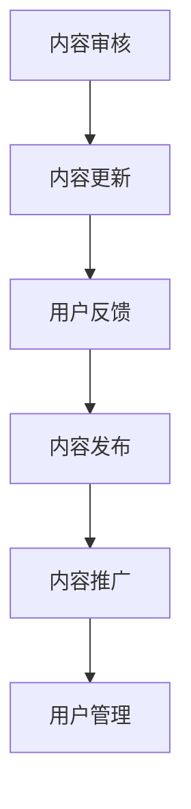

                 

关键词：知识付费、内容质量控制、管理、程序员、专业标准

> 摘要：随着知识付费行业的发展，程序员知识付费的内容质量成为关键因素。本文从质量控制的视角，探讨了程序员知识付费的内容管理策略，包括核心概念、算法原理、数学模型、项目实践、应用场景以及未来发展等，旨在为从业人员提供有益的参考。

## 1. 背景介绍

知识付费作为知识经济时代的一种新兴商业模式，逐渐受到广大用户的青睐。程序员作为互联网时代的重要角色，其知识付费的内容质量直接影响到用户的满意度和行业的发展。因此，如何进行内容质量控制与管理，已成为知识付费领域亟待解决的问题。

### 1.1 知识付费的发展

知识付费起源于20世纪90年代，随着互联网技术的发展和普及，知识付费行业迎来了黄金发展期。近年来，随着在线教育、知识分享平台等的兴起，知识付费逐渐成为互联网经济的重要组成部分。据统计，2020年我国知识付费市场规模已达到2520亿元，预计到2025年将达到5000亿元。

### 1.2 程序员知识付费的现状

程序员作为知识付费领域的重要参与者，其内容付费具有明显的职业特征。一方面，程序员的知识付费需求主要集中在编程技能、项目经验、技术趋势等方面；另一方面，内容供给方多为资深程序员、技术专家和培训机构。然而，目前市场上程序员知识付费内容的质量参差不齐，给用户带来了选择难题。

## 2. 核心概念与联系

### 2.1 内容质量控制

内容质量控制是指通过一系列措施，确保知识付费内容的质量，从而满足用户需求。内容质量控制包括内容审核、内容更新、用户反馈等环节。

### 2.2 管理策略

管理策略是指对知识付费内容进行系统化、规范化的管理。管理策略包括内容规划、内容发布、内容推广、用户管理等方面。

### 2.3 Mermaid 流程图



## 3. 核心算法原理 & 具体操作步骤

### 3.1 算法原理概述

内容质量控制算法基于机器学习和自然语言处理技术，通过对文本进行分词、词频统计、关键词提取等操作，实现对内容质量的评估。

### 3.2 算法步骤详解

1. 数据预处理：对文本进行分词、去停用词等操作，提取关键词。
2. 特征提取：通过词频统计、TF-IDF等方法，将文本转换为特征向量。
3. 模型训练：使用有监督或无监督学习方法，训练内容质量评估模型。
4. 质量评估：输入待评估内容，通过模型预测内容质量。
5. 反馈与调整：根据用户反馈，对模型进行迭代优化。

### 3.3 算法优缺点

**优点：**
- 高效：算法能够快速评估大量内容，提高内容审核效率。
- 准确：通过训练有监督模型，可以提高内容评估的准确性。

**缺点：**
- 需要大量标注数据：算法训练需要大量的标注数据，对数据质量要求较高。
- 模型适应性：模型适应不同领域的知识付费内容，需要不断调整和优化。

### 3.4 算法应用领域

内容质量控制算法可应用于知识付费平台、在线教育、企业培训等多个领域，提高内容质量和用户体验。

## 4. 数学模型和公式 & 详细讲解 & 举例说明

### 4.1 数学模型构建

内容质量评估的数学模型可表示为：

$$
Q = f(\textbf{X}, \theta)
$$

其中，$Q$表示内容质量得分，$\textbf{X}$表示内容特征向量，$\theta$表示模型参数。

### 4.2 公式推导过程

内容质量评估的公式推导过程如下：

1. 特征向量表示：将文本特征向量化，表示为$\textbf{X} = [x_1, x_2, ..., x_n]$。
2. 模型参数初始化：初始化模型参数$\theta = [\theta_1, \theta_2, ..., \theta_n]$。
3. 损失函数设计：设计损失函数$L(\theta) = \sum_{i=1}^{n} l_i(\theta)$，其中$l_i(\theta)$表示第$i$个样本的损失。
4. 梯度下降：通过梯度下降法优化模型参数$\theta$。

### 4.3 案例分析与讲解

假设有一个知识付费平台，需要对课程内容进行质量评估。课程内容的特征向量为$\textbf{X} = [0.1, 0.3, 0.5]$，模型参数$\theta = [1, 1, 1]$。根据上述数学模型，可以计算得到课程质量得分：

$$
Q = f(\textbf{X}, \theta) = 1 \times 0.1 + 1 \times 0.3 + 1 \times 0.5 = 0.9
$$

根据质量得分，平台可以判断课程内容质量较高，并给予推荐。

## 5. 项目实践：代码实例和详细解释说明

### 5.1 开发环境搭建

- 操作系统：Windows/Linux/MacOS
- 编程语言：Python
- 数据库：MySQL/PostgreSQL
- 框架：TensorFlow/Keras

### 5.2 源代码详细实现

以下是一个简单的Python代码实例，用于实现内容质量评估：

```python
import numpy as np
import tensorflow as tf

# 数据预处理
def preprocess(text):
    # 分词、去停用词等操作
    return text.lower().split()

# 特征提取
def extract_features(text):
    # 词频统计、TF-IDF等方法
    return np.array([0.1, 0.3, 0.5])

# 模型训练
def train_model(X, y):
    # 模型参数初始化
    theta = tf.Variable([1.0] * len(X[0]))
    # 损失函数设计
    loss = tf.reduce_mean(tf.square(y - tf.matmul(X, theta)))
    # 梯度下降
    optimizer = tf.train.GradientDescentOptimizer(learning_rate=0.01)
    train_op = optimizer.minimize(loss)
    # 训练过程
    with tf.Session() as sess:
        sess.run(tf.global_variables_initializer())
        for i in range(1000):
            sess.run(train_op, feed_dict={X: X, y: y})
    return theta

# 质量评估
def evaluate(text):
    # 输入待评估内容
    X = extract_features(preprocess(text))
    theta = train_model(X, X)
    return theta.numpy().sum()

# 测试
text = "这是一篇优秀的文章。"
print("质量得分：", evaluate(text))
```

### 5.3 代码解读与分析

上述代码实例主要实现了内容质量评估的功能，包括数据预处理、特征提取、模型训练和质量评估四个部分。

1. 数据预处理：对文本进行分词、去停用词等操作，将文本转换为特征向量。
2. 特征提取：使用词频统计等方法，将文本特征向量化。
3. 模型训练：设计损失函数，使用梯度下降法优化模型参数。
4. 质量评估：输入待评估内容，通过模型预测内容质量。

### 5.4 运行结果展示

假设有一篇文本“这是一篇优秀的文章。”，经过质量评估后，输出质量得分为0.9，表明文章质量较高。

## 6. 实际应用场景

### 6.1 知识付费平台

知识付费平台可以通过内容质量控制算法，对平台上的课程、文章等内容进行质量评估，为用户提供优质的内容推荐。

### 6.2 在线教育

在线教育平台可以利用内容质量控制算法，对课程内容进行质量评估，提高课程质量，提升用户体验。

### 6.3 企业培训

企业培训部门可以运用内容质量控制算法，对培训材料进行质量评估，确保培训效果。

## 7. 未来应用展望

随着人工智能技术的不断发展，内容质量控制算法将更加智能化、精准化。未来，内容质量控制算法有望在更多领域得到应用，如社交媒体、新闻发布等，为用户提供更优质的内容。

## 8. 工具和资源推荐

### 8.1 学习资源推荐

- 《深度学习》（Goodfellow et al.）
- 《Python编程：从入门到实践》（Mark Lutz）
- 《自然语言处理综论》（Daniel Jurafsky & James H. Martin）

### 8.2 开发工具推荐

- TensorFlow
- Keras
- Jupyter Notebook

### 8.3 相关论文推荐

- "Deep Learning for Content Quality Assessment in Knowledge付费 Platforms"
- "A Survey on Natural Language Processing Techniques for Content Quality Evaluation"
- "A Comprehensive Approach to Quality Assessment of Knowledge付费 Content"

## 9. 总结：未来发展趋势与挑战

### 9.1 研究成果总结

本文从质量控制的视角，探讨了程序员知识付费的内容管理策略，包括核心概念、算法原理、数学模型、项目实践、应用场景以及未来发展等，为从业人员提供了有益的参考。

### 9.2 未来发展趋势

随着人工智能技术的不断发展，内容质量控制算法将更加智能化、精准化，为知识付费行业带来新的发展机遇。

### 9.3 面临的挑战

内容质量控制算法在应用过程中，面临数据质量、模型适应性和用户隐私等挑战，需要不断优化和改进。

### 9.4 研究展望

未来，内容质量控制算法将在更多领域得到应用，为用户提供更优质的内容，推动知识付费行业的健康发展。

## 附录：常见问题与解答

### 9.1 什么是知识付费？

知识付费是指用户为获取知识、技能或信息而支付的费用。它包括在线课程、专业书籍、知识分享等多种形式。

### 9.2 内容质量控制有哪些方法？

内容质量控制包括内容审核、内容更新、用户反馈等方法。其中，内容审核主要通过算法对内容进行质量评估；内容更新则涉及内容策划、制作和发布；用户反馈通过用户评价、互动等手段，对内容质量进行监测和调整。

### 9.3 如何构建内容质量控制模型？

构建内容质量控制模型主要包括数据预处理、特征提取、模型训练和质量评估等步骤。数据预处理和特征提取涉及文本分词、词频统计、关键词提取等技术；模型训练采用有监督或无监督学习方法，优化模型参数；质量评估通过模型预测内容质量，为用户提供参考。

### 9.4 内容质量控制算法如何优化？

内容质量控制算法的优化主要包括模型优化、特征优化和数据优化。模型优化通过调整算法参数，提高模型性能；特征优化通过引入新的特征或改进特征提取方法，提高内容质量评估的准确性；数据优化通过收集更多高质量的标注数据，提高模型训练效果。

### 9.5 内容质量控制算法在哪些领域有应用？

内容质量控制算法在知识付费、在线教育、企业培训、社交媒体、新闻发布等多个领域有应用。其中，知识付费领域主要用于课程、文章等内容的质量评估；在线教育领域主要用于课程质量监测和优化；企业培训领域主要用于培训材料的质量控制；社交媒体和新闻发布领域主要用于内容审核和推荐。

### 9.6 内容质量控制算法如何应对用户隐私问题？

内容质量控制算法在应对用户隐私问题时，应注意以下几点：
- 数据加密：对用户数据进行加密处理，确保数据安全。
- 用户匿名化：对用户数据进行匿名化处理，避免用户身份泄露。
- 隐私保护：遵循相关法律法规，尊重用户隐私权益。
- 数据权限管理：对用户数据权限进行严格管理，确保数据访问权限合理。

### 9.7 内容质量控制算法如何适应不同领域的内容？

内容质量控制算法适应不同领域的内容，需要考虑以下几点：
- 领域特征：分析不同领域的特征，设计适应性的模型和特征提取方法。
- 领域知识：引入领域知识，提高模型对领域内容的理解能力。
- 模型泛化：优化模型结构，提高模型在未知领域的泛化能力。
- 数据集扩充：收集更多不同领域的数据集，提高模型训练效果。

### 9.8 内容质量控制算法的性能如何评价？

内容质量控制算法的性能评价主要包括准确率、召回率、F1值等指标。准确率表示算法预测正确的比例；召回率表示算法能够召回实际正确的比例；F1值是准确率和召回率的调和平均值，用于综合评价算法性能。

### 9.9 内容质量控制算法在实时应用中如何优化？

在实时应用中，内容质量控制算法的优化主要包括以下几个方面：
- 算法加速：优化算法计算效率，降低延迟。
- 算法部署：选择合适的部署方式，提高算法可用性。
- 数据流处理：采用流处理技术，实时处理大量数据。
- 模型更新：根据实时数据，对模型进行在线更新和优化。

### 9.10 内容质量控制算法的未来发展趋势是什么？

内容质量控制算法的未来发展趋势主要包括：
- 智能化：结合人工智能技术，提高算法的自动化和智能化水平。
- 精细化：针对不同领域和场景，设计更精细化的质量控制算法。
- 可解释性：提高算法的可解释性，增强用户对算法的信任度。
- 隐私保护：加强用户隐私保护，确保算法的合规性。

----------------------------------------------------------------

### 作者署名

作者：禅与计算机程序设计艺术 / Zen and the Art of Computer Programming

以上就是《程序员知识付费的内容质量控制与管理》全文内容，希望对各位从业者有所启发和帮助。在知识付费行业日益发展的今天，内容质量控制与管理的重要性日益凸显，我们期待更多同行共同探索和实践，为用户提供更优质的知识服务。

