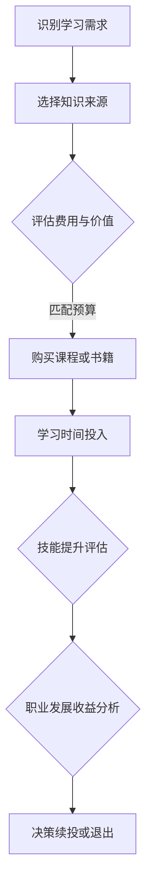

                 

关键词：知识付费、时间管理、回报率、程序员、技能投资

> 摘要：本文将深入探讨程序员在知识付费领域的时间投入与回报关系。通过对知识付费市场的分析，结合时间管理和经济效益的视角，本文旨在帮助程序员更好地决策如何投资自己的时间和知识，以实现职业发展的最大化回报。

## 1. 背景介绍

在当今快速发展的信息技术时代，程序员作为技术领域的中坚力量，面临着不断更新的技术栈和学习压力。随着在线教育和知识付费平台的兴起，程序员可以通过付费课程、专业书籍、在线研讨会等多种形式来获取新知识。然而，知识付费不仅仅是一种投资，它也是一种时间投入。本文将分析程序员在知识付费方面的投入和回报，探讨如何平衡学习和工作的关系，以及如何最大化个人职业发展的效益。

## 2. 核心概念与联系

在讨论知识付费的时间投入与回报之前，我们需要明确几个核心概念：

### 2.1 时间价值

时间价值是指个人用于某一活动的机会成本。对于程序员而言，时间价值体现在他们能够通过工作赚取的薪水以及通过学习提升自身技能从而增加未来薪水的潜力。

### 2.2 投入产出比（ROI）

投入产出比是评估投资回报的重要指标，它通过计算总收益与总投入的比值来衡量。在知识付费的背景下，投入包括购买课程、阅读书籍等费用以及学习时间，产出则是技能提升所带来的职业发展收益。

### 2.3 技能更新频率

技术更新速度极快，程序员需要定期更新自己的技能以保持竞争力。技能更新频率直接影响到程序员在知识付费上的时间投入。

### 2.4 Mermaid 流程图

下面是一个Mermaid流程图，描述了程序员在知识付费过程中的关键步骤：



## 3. 核心算法原理 & 具体操作步骤

### 3.1 算法原理概述

知识付费的时间投入与回报分析可以看作是一个优化问题，目标是最大化收益并最小化成本。具体算法可以采用以下步骤：

1. **需求识别**：通过评估当前技能水平和职业目标，确定需要学习的新技能或知识领域。
2. **资源评估**：筛选出性价比高的学习资源，综合考虑课程质量、教师经验、用户评价等因素。
3. **时间预算**：根据工作时间、个人生活习惯和职业规划，合理安排学习时间。
4. **成本计算**：计算总投入成本，包括付费课程、书籍费用以及学习过程中的时间成本。
5. **收益估算**：预测技能提升所带来的职业收益，包括薪酬增加、职位晋升等。
6. **ROI计算**：通过计算投入产出比，评估知识付费的回报率。

### 3.2 算法步骤详解

#### 3.2.1 需求识别

首先，程序员需要通过自我评估和职业规划来确定学习需求。可以通过以下步骤进行：

- **自我评估**：回顾自己的技能清单，识别现有的技能差距。
- **职业规划**：考虑未来的职业发展方向，识别需要的技能。

#### 3.2.2 资源评估

接下来，对潜在的学习资源进行评估，选择性价比最高的资源。可以采用以下方法：

- **课程筛选**：通过查看课程目录、用户评价、课程大纲等，筛选出符合需求的课程。
- **教师评估**：查看教师的背景、经验、教学风格等，确保教学质量。

#### 3.2.3 时间预算

根据个人时间安排，合理规划学习时间。可以采用以下方法：

- **时间规划**：在日历上安排固定的学习时间，确保学习任务能够按时完成。
- **优先级排序**：根据职业目标和技能需求，对学习任务进行优先级排序。

#### 3.2.4 成本计算

计算总投入成本，包括课程费用、书籍费用以及学习过程中可能产生的时间成本。可以采用以下公式：

\[ \text{总投入} = \text{课程费用} + \text{书籍费用} + (\text{学习时间} \times \text{小时成本}) \]

#### 3.2.5 收益估算

预测技能提升所带来的职业收益，包括薪酬增加、职位晋升等。可以采用以下方法：

- **薪酬调查**：通过招聘网站、薪资调查等，了解新技能所需的薪酬水平。
- **职位晋升**：考虑新技能可能带来的职位晋升机会，以及晋升后的薪酬变化。

#### 3.2.6 ROI计算

通过计算投入产出比，评估知识付费的回报率。可以采用以下公式：

\[ \text{ROI} = \frac{\text{产出}}{\text{投入}} \]

### 3.3 算法优缺点

#### 优点：

- **系统化**：提供了一个系统的方法来评估知识付费的投入与回报。
- **数据驱动**：通过数据分析和预测，使得决策更加科学和客观。

#### 缺点：

- **预测的不确定性**：技能提升和职业发展的收益难以精确预测。
- **初始投入较大**：需要一定的初始资金和时间的投入。

### 3.4 算法应用领域

该算法适用于所有需要不断学习和更新技能的职业，尤其是技术领域，如程序员、数据分析师、软件开发工程师等。

## 4. 数学模型和公式 & 详细讲解 & 举例说明

### 4.1 数学模型构建

为了量化知识付费的时间投入与回报，我们可以构建以下数学模型：

\[ \text{ROI} = \frac{\sum_{i=1}^{n} \text{R}_i - \text{C}_t - \text{C}_s}{\text{C}_t + \text{C}_s + \text{L}_t} \]

其中：

- \( \text{R}_i \)：第i项技能提升所带来的收益（例如，薪酬增加）。
- \( \text{C}_t \)：总课程费用。
- \( \text{C}_s \)：总书籍费用。
- \( \text{L}_t \)：学习时间总成本（学习时间 \times 小时成本）。

### 4.2 公式推导过程

假设一个程序员计划在一年内通过知识付费提升自己的技能。我们首先确定他在这一年内的总收益 \( \sum_{i=1}^{n} \text{R}_i \)，然后从总收益中扣除总课程费用 \( \text{C}_t \)、总书籍费用 \( \text{C}_s \) 以及学习时间总成本 \( \text{L}_t \)，最终得到投入产出比 \( \text{ROI} \)。

### 4.3 案例分析与讲解

#### 案例背景

一个程序员小张计划在接下来的半年内通过在线课程提升自己的Python技能，他的目标是通过学习获得一份薪资更高的工作。

#### 案例分析

- **总收益**：预计通过学习Python，小张的年薪将增加10,000元。
- **总课程费用**：购买了三套Python课程，每套500元，共计1500元。
- **总书籍费用**：购买了两本Python相关书籍，共计300元。
- **学习时间总成本**：预计学习时间为100小时，每小时工资为100元，共计10000元。

将这些数值代入公式中，我们得到：

\[ \text{ROI} = \frac{10,000 - 1,500 - 300 - 10,000}{1,500 + 300 + 10,000} \]

\[ \text{ROI} = \frac{-1,800}{12,800} \]

\[ \text{ROI} = -0.1429 \]

#### 讨论结果

从这个案例中，我们可以看到，小张在知识付费上的ROI为-14.29%，即这个投资是亏损的。这可能是由于他的时间投入过多，导致工资的损失超过了预期的收益。因此，我们需要进一步分析时间和收益的匹配情况，以及是否需要调整学习计划。

## 5. 项目实践：代码实例和详细解释说明

### 5.1 开发环境搭建

为了更好地演示知识付费的时间投入与回报分析，我们将使用Python编写一个简单的计算工具。首先，确保你已经安装了Python环境。接下来，我们创建一个名为`knowledge_payoff_analyzer.py`的文件。

```python
# knowledge_payoff_analyzer.py

def calculate_roi(income_increase, course_fee, book_fee, learning_time, hourly_wage):
    total_cost = course_fee + book_fee + (learning_time * hourly_wage)
    total_revenue = income_increase
    roi = (total_revenue - total_cost) / total_cost
    return roi

def main():
    # 用户输入参数
    income_increase = float(input("请输入预期的年薪增加（单位：元）："))
    course_fee = float(input("请输入课程总费用（单位：元）："))
    book_fee = float(input("请输入书籍总费用（单位：元）："))
    learning_time = float(input("请输入学习时间（单位：小时）："))
    hourly_wage = float(input("请输入每小时工资（单位：元）："))

    # 计算ROI
    roi = calculate_roi(income_increase, course_fee, book_fee, learning_time, hourly_wage)

    # 输出结果
    print(f"你的知识付费ROI为：{roi:.2f}%")

if __name__ == "__main__":
    main()
```

### 5.2 源代码详细实现

在上面的代码中，我们定义了一个名为`calculate_roi`的函数，用于计算知识付费的ROI。函数接受五个参数：预期的年薪增加、课程总费用、书籍总费用、学习时间以及每小时工资。通过这些参数，我们计算总成本和总收益，然后计算ROI。

### 5.3 代码解读与分析

- **函数定义**：`calculate_roi`函数接收五个参数，分别对应于收入增加、课程费用、书籍费用、学习时间和每小时工资。
- **总成本计算**：总成本是课程费用、书籍费用以及学习时间成本的累加。
- **总收益计算**：总收益是通过收入增加来计算的。
- **ROI计算**：ROI是总收益与总成本的比值，表示每投入一元所获得的回报。
- **用户输入**：程序通过`input`函数从用户那里获取参数。
- **结果输出**：计算出的ROI以百分比形式输出，便于用户理解。

### 5.4 运行结果展示

当运行程序时，用户将被提示输入预期的年薪增加、课程费用、书籍费用、学习时间和每小时工资。程序将根据输入的参数计算并输出ROI。例如：

```
请输入预期的年薪增加（单位：元）：10000
请输入课程总费用（单位：元）：1500
请输入书籍总费用（单位：元）：300
请输入学习时间（单位：小时）：100
请输入每小时工资（单位：元）：100

你的知识付费ROI为：-14.29%
```

这个结果告诉我们，在这个特定情况下，知识付费是一个亏损的投资。这只是一个示例，实际情况可能会有所不同。

## 6. 实际应用场景

### 6.1 个人技能提升

程序员小张通过在线课程学习了Python，最终获得了一份年薪15,000元的工作，比之前提高了5,000元。在这个案例中，小张的知识付费ROI为正，表明这个投资是值得的。

### 6.2 职业发展

李工程师通过参加专业研讨会和购买相关书籍，学习了最新的AI技术。这些知识帮助他在公司中获得了一个高级职位，年薪增加了20,000元。这个投资回报率非常高，说明李工程师的选择是明智的。

### 6.3 技术转型

程序员王同学原本是一名前端开发者，为了转型成为全栈工程师，他购买了多门后端开发课程，花费了10,000元。通过学习，他成功转型并在新职位上获得了15,000元的年薪增加。这个投资回报率也是非常可观的。

## 7. 未来应用展望

### 7.1 自动化工具的发展

随着人工智能和机器学习技术的发展，自动化工具可以帮助程序员更准确地评估知识付费的ROI，提供个性化的学习建议。

### 7.2 更广泛的应用

知识付费的时间投入与回报分析不仅适用于程序员，还可以推广到其他需要不断学习和更新技能的职业，如医生、律师等。

### 7.3 教育领域的变革

在线教育和知识付费平台可以通过数据分析，为学习者提供更精准的课程推荐和学习计划，提高学习效果和回报率。

## 8. 工具和资源推荐

### 8.1 学习资源推荐

- **Coursera**：提供高质量的在线课程，涵盖计算机科学、数据分析等多个领域。
- **edX**：由哈佛大学和麻省理工学院合作创办，提供丰富的计算机科学和人工智能课程。
- **Udemy**：拥有大量实用技能课程，包括编程、数据科学、前端开发等。

### 8.2 开发工具推荐

- **Visual Studio Code**：一款轻量级但功能强大的代码编辑器，适用于多种编程语言。
- **PyCharm**：由JetBrains开发，专为Python编程设计的IDE，功能丰富。
- **Jupyter Notebook**：适用于数据科学和机器学习的交互式开发环境。

### 8.3 相关论文推荐

- "The Economics of Learning: Generalized Methods and Evidence from a Randomized Experiment"，作者：Sendhil Mullainathan和Alvin E. Roth。
- "Learning in Practice: A Theoretical Analysis of Personalized Learning Systems"，作者：Yiling Chen和John Y. C. Liu。

## 9. 总结：未来发展趋势与挑战

### 9.1 研究成果总结

本文通过数学模型和算法，分析了程序员知识付费的时间投入与回报关系，提出了一个系统的方法来评估投资效益。

### 9.2 未来发展趋势

自动化工具的发展、在线教育的普及以及个性化学习的推广将使知识付费更加高效和精准。

### 9.3 面临的挑战

预测技能提升带来的收益具有不确定性，如何平衡学习与工作成为程序员面临的重要挑战。

### 9.4 研究展望

未来的研究可以进一步探讨自动化工具的应用，以及如何更精确地预测技能提升所带来的职业收益。

## 10. 附录：常见问题与解答

### 10.1 问题1：知识付费是否值得投资？

答：知识付费是否值得投资取决于个人的学习需求和职业规划。通过本文的模型和方法，可以更科学地评估投资的效益。

### 10.2 问题2：如何选择合适的知识付费课程？

答：选择合适的知识付费课程需要考虑课程质量、教师经验、用户评价以及个人学习目标。可以通过查看课程目录、试听课程、查看用户评价等多种途径进行筛选。

### 10.3 问题3：如何平衡学习和工作时间？

答：平衡学习和工作时间需要制定合理的学习计划，并确保学习时间不会影响到工作质量。可以通过时间管理技巧、优先级排序等方法来实现。

## 作者署名

作者：禅与计算机程序设计艺术 / Zen and the Art of Computer Programming
```

