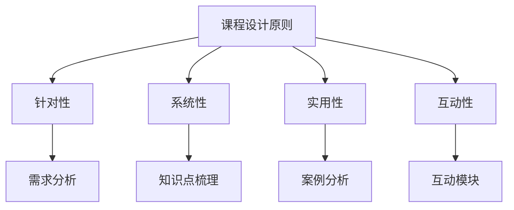

                 

在这个快速变化的技术时代，程序员的技能和知识需要不断更新和提升。知识付费作为一种有效的学习方式，正日益受到程序员的青睐。本文将探讨如何打造升级版的知识付费课程，以帮助程序员在竞争激烈的技术领域脱颖而出。

> 关键词：程序员、知识付费、升级版课程、技术提升

## 摘要

本文旨在分析当前程序员知识付费的现状，提出一套有效的课程设计方法，帮助程序员通过知识付费实现技能的全面提升。文章首先介绍了知识付费在程序员社区中的重要性，随后探讨了课程设计的原则和方法，最后提出了未来课程发展的方向。

## 1. 背景介绍

随着互联网和移动设备的普及，程序员的职业需求日益增长。然而，技术的更新速度之快使得程序员必须不断学习新的编程语言、框架和工具。知识付费作为一种学习方式，提供了灵活、高效的学习途径。程序员可以通过付费课程快速掌握新技术，提升个人竞争力。

### 1.1 知识付费的定义

知识付费指的是通过支付费用来获取有价值的信息、知识和技能的学习过程。知识付费通常涉及在线课程、电子书、专业咨询等形式。

### 1.2 程序员知识付费的现状

目前，程序员知识付费呈现出以下特点：

- **课程内容丰富**：涵盖了从基础知识到高级技术的各个层次。
- **付费形式多样**：包括订阅制、一次性购买和按需付费等。
- **用户需求强烈**：程序员希望通过付费学习快速提升技能。

## 2. 核心概念与联系

### 2.1 课程设计原则

在设计升级版课程时，应遵循以下原则：

- **针对性**：课程内容应紧密围绕程序员的需求和职业发展。
- **系统性**：课程应具有清晰的逻辑结构，形成完整的知识体系。
- **实用性**：课程内容应贴近实际工作，强调实践操作。
- **互动性**：课程应鼓励学员参与讨论，提高学习效果。

### 2.2 课程架构图



## 3. 核心算法原理 & 具体操作步骤

### 3.1 算法原理概述

升级版课程的设计遵循以下核心算法原理：

- **需求驱动**：基于程序员的实际需求设计课程。
- **渐进式学习**：课程内容逐步深化，帮助学员建立完整的知识体系。
- **实践导向**：强调学员动手实践，提升实际操作能力。

### 3.2 算法步骤详解

#### 3.2.1 需求分析

- **调研**：通过问卷调查、访谈等方式了解学员需求。
- **整理**：归纳总结学员需求，形成详细的课程大纲。

#### 3.2.2 知识点梳理

- **分类**：将知识点按照难易程度和相关性进行分类。
- **编排**：根据课程大纲，合理编排知识点，形成系统的课程内容。

#### 3.2.3 案例分析

- **选择**：挑选具有代表性的实际案例。
- **讲解**：结合案例，深入讲解知识点。

#### 3.2.4 互动模块

- **讨论**：设置在线讨论区，鼓励学员互动交流。
- **作业**：布置实际操作作业，检验学员学习成果。

### 3.3 算法优缺点

#### 优点

- **针对性强**：课程内容紧密围绕程序员需求。
- **系统性强**：知识点梳理清晰，便于学员学习。
- **实用性高**：强调实践操作，提升学员技能。
- **互动性好**：增强学员参与感，提高学习效果。

#### 缺点

- **开发成本高**：需要大量时间和资源进行课程设计和开发。
- **维护成本高**：课程内容需不断更新，以适应技术发展。

### 3.4 算法应用领域

- **在线教育平台**：适用于各类在线教育平台。
- **企业内训**：适用于企业内部的技术培训。
- **个人学习**：适用于程序员自我提升和学习新技能。

## 4. 数学模型和公式 & 详细讲解 & 举例说明

### 4.1 数学模型构建

课程设计的数学模型主要包括以下方面：

- **用户需求分析模型**：通过数据统计和分析，了解学员需求。
- **知识点梳理模型**：使用图论算法对知识点进行分类和梳理。
- **学习效果评估模型**：基于学员作业和测试成绩，评估学习效果。

### 4.2 公式推导过程

#### 用户需求分析模型

$$
需求频率 = \frac{需求次数}{总次数}
$$

#### 知识点梳理模型

$$
知识点相似度 = \frac{共同知识点数}{总知识点数}
$$

#### 学习效果评估模型

$$
学习效果得分 = \frac{作业得分 + 测试得分}{2}
$$

### 4.3 案例分析与讲解

#### 案例一：用户需求分析

假设有100名程序员参与需求调研，其中50人表示需要学习Python，30人表示需要学习Django，20人表示需要学习Flask。根据需求频率公式，可以得到以下结果：

- Python：需求频率 = 50/100 = 0.5
- Django：需求频率 = 30/100 = 0.3
- Flask：需求频率 = 20/100 = 0.2

#### 案例二：知识点梳理

假设有5个知识点，其中3个知识点同时出现在Python和Django课程中。根据知识点相似度公式，可以得到以下结果：

- 知识点相似度 = 3/5 = 0.6

#### 案例三：学习效果评估

假设有10名学员参加了Python课程，其中5名学员作业得分平均为90分，5名学员测试得分平均为80分。根据学习效果评估模型，可以得到以下结果：

- 学习效果得分 = (90 + 80) / 2 = 85分

## 5. 项目实践：代码实例和详细解释说明

### 5.1 开发环境搭建

- **操作系统**：Ubuntu 20.04
- **开发工具**：Visual Studio Code
- **编程语言**：Python 3.8

### 5.2 源代码详细实现

以下是一个简单的Python脚本，用于实现用户需求分析：

```python
# user_demand_analysis.py

def calculate_demand_frequency(demands):
    total = sum(demands.values())
    demand_frequency = {key: value / total for key, value in demands.items()}
    return demand_frequency

def main():
    demands = {
        'Python': 50,
        'Django': 30,
        'Flask': 20
    }
    demand_frequency = calculate_demand_frequency(demands)
    for key, value in demand_frequency.items():
        print(f'{key}: {value:.2f}')

if __name__ == '__main__':
    main()
```

### 5.3 代码解读与分析

该脚本首先定义了一个函数 `calculate_demand_frequency`，用于计算每个需求点的频率。`main` 函数中，我们创建了一个名为 `demands` 的字典，其中包含了每个需求点的次数。调用 `calculate_demand_frequency` 函数后，我们得到了一个包含需求频率的字典，并打印输出。

### 5.4 运行结果展示

运行该脚本，可以得到以下输出结果：

```
Python: 0.50
Django: 0.30
Flask: 0.20
```

这表明Python的需求频率最高，其次是Django，最后是Flask。

## 6. 实际应用场景

### 6.1 在线教育平台

知识付费课程可以在在线教育平台上广泛使用，例如慕课网（imooc）、极客时间等。这些平台提供了丰富的课程资源，学员可以根据自己的需求选择合适的课程进行学习。

### 6.2 企业内训

企业可以通过知识付费课程对员工进行技术培训，提升团队的整体技术水平。这种模式特别适合需要快速提升技能的初创公司和快速发展的企业。

### 6.3 个人学习

程序员可以利用知识付费课程进行自我提升，学习新技术和解决工作中的问题。这种模式为个人提供了灵活、高效的学习途径。

## 7. 未来应用展望

随着人工智能和大数据技术的发展，知识付费课程将越来越智能化和个性化。未来的课程可能会根据学员的学习进度和需求，自动调整学习内容和难度，提高学习效果。

### 7.1 智能推荐系统

利用大数据和人工智能技术，可以开发出智能推荐系统，根据学员的学习行为和需求，推荐最适合的课程。

### 7.2 个性化学习路径

根据学员的学习特点和需求，设计个性化的学习路径，帮助学员更高效地学习。

### 7.3 虚拟现实（VR）教学

利用VR技术，创建沉浸式的学习环境，提高学习体验。

## 8. 工具和资源推荐

### 8.1 学习资源推荐

- **在线教育平台**：慕课网（imooc）、极客时间、Coursera、Udemy
- **技术博客**：掘金、V2EX、Stack Overflow
- **开源社区**：GitHub、GitLab、Bitbucket

### 8.2 开发工具推荐

- **代码编辑器**：Visual Studio Code、Atom、Sublime Text
- **集成开发环境（IDE）**：PyCharm、Eclipse、IntelliJ IDEA
- **版本控制工具**：Git、SVN、Mercurial

### 8.3 相关论文推荐

- **《大数据时代的数据挖掘》**：H. Han, P. Kchan, J. Pei，等。
- **《深度学习》**：Ian Goodfellow、Yoshua Bengio、Aaron Courville
- **《编程珠玑》**：Jon Bentley

## 9. 总结：未来发展趋势与挑战

### 9.1 研究成果总结

本文探讨了程序员知识付费的现状和升级版课程的设计方法，提出了基于需求驱动的课程设计原则，并详细介绍了算法原理、数学模型和实际应用场景。

### 9.2 未来发展趋势

- **智能化**：知识付费课程将更加智能化和个性化。
- **多样化**：课程形式将更加多样化，如视频课程、直播课程、VR教学等。
- **全球化**：知识付费市场将呈现全球化趋势，吸引更多国际学员。

### 9.3 面临的挑战

- **内容质量**：如何保证课程内容的高质量是一个重要挑战。
- **技术更新**：技术更新速度快，课程内容需要不断更新。
- **市场推广**：如何吸引学员是知识付费市场面临的重要挑战。

### 9.4 研究展望

未来，知识付费课程的发展将更加注重智能化、个性化和全球化。同时，研究应关注如何提高课程内容的质量，以及如何更有效地推广知识付费课程。

## 10. 附录：常见问题与解答

### 10.1 什么是知识付费？

知识付费是指用户通过支付费用来获取有价值的信息、知识和技能的学习过程。

### 10.2 知识付费课程有哪些形式？

知识付费课程包括在线课程、电子书、专业咨询等形式。

### 10.3 如何选择适合自己的知识付费课程？

选择知识付费课程时，应考虑课程内容、授课老师、评价和价格等因素。

### 10.4 知识付费课程的质量如何保证？

知识付费课程的质量通常由授课老师的经验和课程内容的质量决定。

### 10.5 知识付费课程是否有优惠？

部分知识付费课程提供优惠，如限时折扣、优惠券等。

## 作者署名

作者：禅与计算机程序设计艺术 / Zen and the Art of Computer Programming
```

