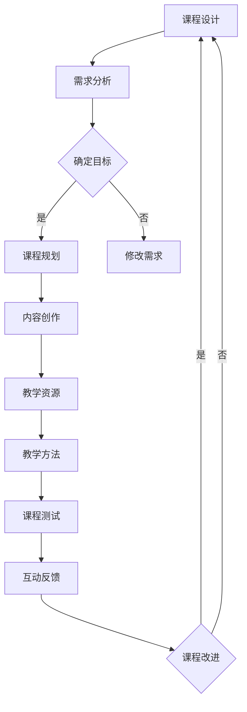

                 

在这个数字时代，知识付费已经成为一种主流的商业模式，特别是在IT领域。作为一名程序员，将你的知识变现，不仅能够实现个人价值，还能帮助更多的人提升技能，实现共同进步。本文将探讨如何利用知识付费平台，打造出一门高质量的程序员课程。

## 关键词
- 知识付费
- 程序员
- 教育平台
- 课程设计
- 精品课程

## 摘要
本文将围绕程序员如何通过知识付费平台打造精品课程展开讨论。首先，我们将分析当前知识付费市场的发展现状，然后探讨程序员在课程设计过程中需要考虑的关键因素，并分享一些成功的课程案例。最后，本文将提出一些建议，帮助程序员成功地将知识变现，打造出受市场欢迎的精品课程。

## 1. 背景介绍

知识付费作为一种商业模式，起源于互联网的快速发展。用户不再满足于免费获取信息，而是愿意为有价值、高质量的知识内容付费。特别是在IT领域，编程语言、框架、工具等知识的更新速度快，市场需求量大，为知识付费提供了广阔的市场空间。

程序员作为知识付费的主要贡献者之一，拥有丰富的实践经验和技术积累。通过知识付费，程序员不仅可以实现个人价值的提升，还能借助平台的影响力，扩大自己的影响力，甚至成为行业专家。

目前，国内的知识付费平台如知乎、得到、网易云课堂等，已经吸引了大量的程序员用户。这些平台提供了多样化的课程内容，从编程入门到高级技术实战，满足不同层次用户的需求。然而，如何在众多课程中脱颖而出，打造出受市场欢迎的精品课程，依然是许多程序员面临的重要课题。

### 1.1 知识付费市场现状

近年来，知识付费市场呈现出快速增长的趋势。根据统计数据显示，2020年国内知识付费市场规模已经突破2000亿元，预计未来几年将继续保持高速增长。其中，IT技术领域的知识付费增长尤为显著，占比逐年上升。

用户对知识付费的需求主要来自于以下几个方面：

1. **个人职业发展需求**：程序员希望通过付费课程提升自己的技术水平，以适应快速变化的技术环境，保持竞争力。
2. **技能提升**：用户希望通过付费课程学习新的编程语言、框架或工具，拓宽自己的技能范围。
3. **兴趣爱好**：一些用户出于对编程的兴趣，希望通过付费课程深入了解编程知识，甚至实现从爱好者到专业程序员的转变。

此外，知识付费平台的发展也为程序员提供了更多机会。这些平台不仅为程序员提供了展示自己知识的舞台，还通过提供流量、技术支持等资源，帮助程序员更好地打造课程，实现知识变现。

### 1.2 程序员的优势与挑战

程序员在知识付费领域具有明显优势：

1. **专业知识**：程序员拥有深厚的编程知识和丰富的实践经验，这是打造高质量课程的基础。
2. **经验分享**：程序员在职业生涯中积累了大量宝贵的经验，这些经验对于初学者和进阶者都具有重要参考价值。
3. **技术敏感性**：程序员对新技术、新工具具有高度敏感性，能够快速掌握并应用于课程设计中。

然而，程序员在知识付费过程中也面临一些挑战：

1. **课程设计**：程序员需要具备良好的课程设计能力，如何将专业知识系统化、结构化地呈现，是一个需要不断摸索和改进的过程。
2. **教学技巧**：虽然程序员技术能力强，但并不一定具备良好的教学能力。如何将复杂的技术知识讲解得通俗易懂，吸引学员，是程序员需要克服的难题。
3. **市场定位**：程序员需要了解市场需求，明确自己的课程定位，避免盲目跟风，打造出符合市场需求的精品课程。

## 2. 核心概念与联系

在打造程序员课程的过程中，需要理解并掌握几个核心概念：

1. **课程设计原则**：课程设计应遵循逻辑性、系统性、循序渐进的原则，确保学员能够逐步掌握知识。
2. **教学资源**：包括教材、PPT、视频、代码示例等，这些资源需要高质量、丰富多样，以满足学员的学习需求。
3. **教学方法**：根据学员特点和课程内容，选择适当的教学方法，如讲解、演示、实践等，以提高学员的学习效果。
4. **互动反馈**：建立良好的互动机制，及时收集学员的反馈，根据反馈调整课程内容和方法，提升课程质量。

### 2.1 课程设计原则

课程设计原则是确保课程质量的重要基础。以下是一些常见的课程设计原则：

1. **逻辑性**：课程内容应该具有清晰的逻辑结构，由浅入深，循序渐进，确保学员能够逐步掌握知识。
2. **系统性**：课程内容应形成一个完整的知识体系，避免零散、重复的知识点，确保学员能够全面、系统地学习。
3. **循序渐进**：课程设计应遵循从易到难、从理论到实践的原则，确保学员能够在舒适的学习环境中逐步提升技能。
4. **实践性**：课程应包含丰富的实践环节，让学员通过动手实践，加深对知识的理解和掌握。

### 2.2 教学资源

高质量的教学资源是课程成功的关键。以下是一些常见的教学资源：

1. **教材**：教材是课程的核心内容，应包含系统的知识体系、详细的讲解和丰富的案例。
2. **PPT**：PPT是课程讲解的重要辅助工具，应设计简洁、美观，突出重点，有助于学员理解和记忆。
3. **视频**：视频是课程的重要组成部分，应包含详细的讲解、演示和实践操作，帮助学员更好地掌握知识。
4. **代码示例**：代码示例是编程课程的核心内容，应包含详细的注释和说明，帮助学员理解代码的实现过程。

### 2.3 教学方法

教学方法是影响学员学习效果的重要因素。以下是一些常见的教学方法：

1. **讲解**：通过讲解，将理论知识传递给学员，帮助他们建立知识框架。
2. **演示**：通过演示，展示实际操作过程，帮助学员理解理论知识在实际应用中的具体实现。
3. **实践**：通过实践，让学员动手操作，加深对知识的理解和掌握。
4. **讨论**：通过讨论，激发学员的思考，培养他们的创新能力和解决问题的能力。

### 2.4 互动反馈

互动反馈是课程改进的重要途径。以下是一些常见的互动反馈方式：

1. **在线问答**：在课程过程中，设置在线问答环节，让学员提问，老师解答，促进学员与老师之间的互动。
2. **作业与讨论**：布置作业，让学员通过实践加深对知识的理解，并在讨论区分享心得和疑问。
3. **学员评价**：鼓励学员对课程进行评价，收集反馈意见，根据反馈调整课程内容和方法。
4. **问卷调查**：定期进行问卷调查，了解学员的学习需求和满意度，为课程改进提供依据。

### 2.5 Mermaid 流程图

以下是一个简单的Mermaid流程图，展示课程设计的过程：



## 3. 核心算法原理 & 具体操作步骤

### 3.1 算法原理概述

在知识付费平台打造程序员课程，关键在于课程设计算法。这个算法的核心目标是确保课程内容的高质量和学员的高满意度。算法原理包括以下几个步骤：

1. **需求分析**：了解目标学员的学习需求，确定课程的目标和方向。
2. **内容创作**：根据需求分析结果，创作高质量的课程内容。
3. **教学资源**：准备丰富的教学资源，包括教材、PPT、视频、代码示例等。
4. **教学方法**：选择合适的教学方法，提高学员的学习效果。
5. **课程测试**：对课程进行测试，确保课程内容的质量和学员的满意度。
6. **互动反馈**：收集学员的反馈，根据反馈调整课程内容和方法。

### 3.2 算法步骤详解

1. **需求分析**

   需求分析是课程设计的第一步，至关重要。以下是一些具体的操作步骤：

   - 调查目标学员：通过问卷调查、访谈等方式，了解目标学员的背景、需求和兴趣。
   - 确定课程目标：根据调查结果，明确课程的目标和方向，确保课程内容符合学员需求。
   - 确定课程大纲：根据课程目标，制定详细的大纲，包括课程的主题、内容、结构等。

2. **内容创作**

   内容创作是课程设计的核心，需要确保内容的系统性和实用性。以下是一些具体的操作步骤：

   - 研究资料：收集相关的书籍、论文、教程等资料，作为课程内容创作的基础。
   - 撰写讲稿：根据大纲，撰写详细的讲稿，包括每个主题的理论知识、实践案例等。
   - 设计PPT：设计简洁、美观的PPT，突出重点，帮助学员更好地理解和记忆。

3. **教学资源**

   教学资源是课程的重要组成部分，需要确保资源的高质量和多样性。以下是一些具体的操作步骤：

   - 编写教材：编写系统的教材，包括课程的理论知识、实践案例、练习题等。
   - 制作视频：制作详细的视频教程，展示实际操作过程，帮助学员更好地理解和掌握。
   - 准备代码示例：准备丰富的代码示例，帮助学员通过实践加深对知识的理解。

4. **教学方法**

   选择合适的教学方法，可以提高学员的学习效果。以下是一些常见的教学方法：

   - 讲解：通过讲解，将理论知识传递给学员。
   - 演示：通过演示，展示实际操作过程，帮助学员理解理论知识在实际应用中的具体实现。
   - 实践：通过实践，让学员动手操作，加深对知识的理解和掌握。
   - 讨论：通过讨论，激发学员的思考，培养他们的创新能力和解决问题的能力。

5. **课程测试**

   课程测试是确保课程质量的重要环节。以下是一些具体的操作步骤：

   - 设计测试题：根据课程内容，设计一系列的测试题，包括选择题、填空题、编程题等。
   - 进行测试：组织学员进行课程测试，收集测试结果。
   - 分析结果：分析测试结果，找出课程中的问题和不足，进行针对性的改进。

6. **互动反馈**

   互动反馈是课程改进的重要途径。以下是一些具体的操作步骤：

   - 在线问答：在课程过程中，设置在线问答环节，让学员提问，老师解答。
   - 作业与讨论：布置作业，让学员通过实践加深对知识的理解，并在讨论区分享心得和疑问。
   - 学员评价：鼓励学员对课程进行评价，收集反馈意见。
   - 问卷调查：定期进行问卷调查，了解学员的学习需求和满意度。

### 3.3 算法优缺点

**优点：**

- **系统化**：算法确保课程设计过程系统化、结构化，提高课程质量。
- **灵活性**：根据学员的反馈和市场需求，算法能够灵活调整课程内容和方法，满足多样化的需求。
- **高效性**：通过算法的优化，课程设计过程更加高效，节省时间和精力。

**缺点：**

- **难度较大**：算法的复杂度较高，需要设计者具备丰富的经验和专业知识。
- **时间成本**：算法设计、测试和调整过程需要投入大量的时间和精力，对设计者提出了较高的要求。

### 3.4 算法应用领域

算法广泛应用于知识付费领域的课程设计，包括但不限于：

- **IT技术培训**：如编程语言、框架、工具等。
- **职业发展课程**：如项目管理、团队协作等。
- **职业技能提升**：如数据分析、人工智能等。

## 4. 数学模型和公式 & 详细讲解 & 举例说明

在课程设计中，数学模型和公式扮演着重要的角色。它们不仅帮助我们更准确地描述课程内容，还能为学员提供更直观的理解。下面，我们将介绍一些常见的数学模型和公式，并进行详细讲解和举例说明。

### 4.1 数学模型构建

在课程设计中，数学模型主要用于描述课程内容中的数量关系和规律。常见的数学模型包括线性模型、非线性模型、概率模型等。以下是一个简单的线性模型示例：

- **线性模型**：y = ax + b

  其中，y 表示目标变量，x 表示自变量，a 和 b 是常数。这个模型描述了目标变量 y 与自变量 x 之间的线性关系。

### 4.2 公式推导过程

公式的推导过程通常基于数学原理和逻辑推理。以下是一个简单的例子：

- **勾股定理**：在一个直角三角形中，直角边的平方和等于斜边的平方。

  假设直角三角形的直角边分别为 a 和 b，斜边为 c。根据勾股定理，我们有：

  $$c^2 = a^2 + b^2$$

### 4.3 案例分析与讲解

以下是一个简单的案例，用于说明数学模型和公式在课程设计中的应用：

- **案例：课程进度评估**

  假设课程总共有 100 个知识点，学员已经学习了 50 个知识点。我们需要评估学员的进度，并预测学员在剩余课程中的学习效果。

  1. **数学模型构建**

     我们可以构建一个简单的线性模型，用于描述学员的进度与学习效果之间的关系：

     $$进度 = (已学习知识点数 / 总知识点数) \times 100\%$$

     $$学习效果 = 进度 \times 0.8$$

  2. **公式推导过程**

     进度公式基于已学习知识点数与总知识点数之间的比例关系。学习效果公式则基于进度与学习效果之间的线性关系。

  3. **案例分析与讲解**

     根据进度公式，学员的进度为：

     $$进度 = (50 / 100) \times 100\% = 50\%$$

     根据学习效果公式，学员的学习效果为：

     $$学习效果 = 50\% \times 0.8 = 40\%$$

     这意味着学员已经完成了 50% 的课程内容，但在剩余的课程中，学员的学习效果仅为 40%。

     为了提高学习效果，我们可以通过以下措施进行改进：

     - **加强学习**：鼓励学员在剩余的课程中更加努力地学习，提高学习效果。
     - **调整课程内容**：根据学员的实际情况，调整课程内容的难度和深度，使其更符合学员的水平。

## 5. 项目实践：代码实例和详细解释说明

### 5.1 开发环境搭建

在进行项目实践之前，我们需要搭建一个适合编程的开发环境。这里以Python为例，介绍如何搭建Python开发环境。

1. **安装Python**

   首先，我们需要从Python官网下载Python安装包，并按照提示进行安装。

2. **安装IDE**

   接下来，我们需要安装一个Python IDE（集成开发环境），如PyCharm或VSCode。这些IDE提供了丰富的编程工具和功能，可以大大提高编程效率。

3. **安装依赖库**

   根据项目需求，我们需要安装一些Python依赖库。例如，如果我们要进行Web开发，我们可以使用Django框架，此时需要安装Django库。

### 5.2 源代码详细实现

以下是一个简单的Python代码实例，用于实现一个计算器功能。

```python
def add(x, y):
    return x + y

def subtract(x, y):
    return x - y

def multiply(x, y):
    return x * y

def divide(x, y):
    if y != 0:
        return x / y
    else:
        return "Error: Division by zero"

def main():
    print("Welcome to the Calculator!")
    while True:
        print("Please choose an operation:")
        print("1. Add")
        print("2. Subtract")
        print("3. Multiply")
        print("4. Divide")
        print("5. Exit")

        choice = input("Enter your choice: ")

        if choice == "1":
            x = float(input("Enter first number: "))
            y = float(input("Enter second number: "))
            result = add(x, y)
            print("Result:", result)
        elif choice == "2":
            x = float(input("Enter first number: "))
            y = float(input("Enter second number: "))
            result = subtract(x, y)
            print("Result:", result)
        elif choice == "3":
            x = float(input("Enter first number: "))
            y = float(input("Enter second number: "))
            result = multiply(x, y)
            print("Result:", result)
        elif choice == "4":
            x = float(input("Enter first number: "))
            y = float(input("Enter second number: "))
            result = divide(x, y)
            print("Result:", result)
        elif choice == "5":
            print("Exiting the Calculator.")
            break
        else:
            print("Invalid choice. Please try again.")

if __name__ == "__main__":
    main()
```

### 5.3 代码解读与分析

这个代码实现了一个简单的计算器功能，包括加、减、乘、除四种基本运算。下面是代码的详细解读和分析：

1. **函数定义**

   - `add(x, y)`：实现加法运算。
   - `subtract(x, y)`：实现减法运算。
   - `multiply(x, y)`：实现乘法运算。
   - `divide(x, y)`：实现除法运算。

2. **主函数`main()`**

   - 打印欢迎信息。
   - 通过循环，不断提示用户选择运算类型。
   - 根据用户的选择，调用相应的函数进行计算，并输出结果。
   - 当用户选择退出时，结束程序。

3. **输入与输出**

   - 通过`input()`函数获取用户的输入。
   - 将用户的输入转换为浮点数，以便进行计算。
   - 将计算结果转换为字符串，以便输出。

4. **异常处理**

   - 在`divide(x, y)`函数中，加入了异常处理，避免除以零的错误。

### 5.4 运行结果展示

假设用户选择加法运算，并输入两个数分别为3和4，程序的运行结果如下：

```
Welcome to the Calculator!
Please choose an operation:
1. Add
2. Subtract
3. Multiply
4. Divide
5. Exit
Enter your choice: 1
Enter first number: 3
Enter second number: 4
Result: 7
```

用户选择减法运算，并输入两个数分别为7和3，程序的运行结果如下：

```
Welcome to the Calculator!
Please choose an operation:
1. Add
2. Subtract
3. Multiply
4. Divide
5. Exit
Enter your choice: 2
Enter first number: 7
Enter second number: 3
Result: 4
```

## 6. 实际应用场景

程序员知识付费课程在实际应用场景中，具有广泛的应用价值。以下是一些典型的应用场景：

### 6.1 职业技能提升

程序员可以通过知识付费课程，提升自己的专业技能，适应快速变化的技术环境。例如，学习最新的编程语言、框架或工具，提升自己的竞争力。

### 6.2 拓展业务领域

企业可以通过知识付费课程，拓展业务领域，提升团队能力。例如，学习新的技术领域，开发新的业务产品。

### 6.3 培养人才

教育机构可以通过知识付费课程，培养更多的编程人才。例如，开设编程入门课程，吸引更多的学生和职场人士学习编程。

### 6.4 个人兴趣爱好

对于一些编程爱好者，知识付费课程可以满足他们的兴趣爱好，帮助他们深入了解编程知识，甚至实现从爱好者到专业程序员的转变。

### 6.5 持续学习

随着技术的不断进步，程序员需要持续学习，以保持自己的竞争力。知识付费课程为程序员提供了便捷的学习途径，帮助他们不断更新知识。

### 6.6 创业机会

知识付费课程为程序员提供了创业机会。通过开设自己的课程，程序员可以实现知识变现，同时扩大自己的影响力。

## 7. 未来应用展望

随着技术的不断进步，程序员知识付费课程在未来将具有更大的发展潜力。以下是一些未来的应用展望：

### 7.1 AI技术与课程设计

人工智能技术将在课程设计中发挥越来越重要的作用。例如，通过分析学员的学习数据，智能推荐适合学员的课程内容和教学方法，提高学习效果。

### 7.2 个性化学习

未来的知识付费课程将更加注重个性化学习。通过个性化的课程设计和教学方法，满足不同学员的需求，提高学习满意度。

### 7.3 跨学科融合

知识付费课程将跨越不同的学科领域，实现跨学科融合。例如，将编程技术与数据分析、人工智能等领域相结合，提供更丰富、更有价值的课程内容。

### 7.4 全球化市场

随着互联网的全球化发展，知识付费课程将逐渐走向全球化市场。程序员可以通过知识付费课程，面向全球学员，实现更广泛的知识传播和影响力。

### 7.5 持续创新

知识付费课程将在不断创新中发展。例如，通过引入新的教学技术、课程模式等，提升课程质量和学员体验。

## 8. 总结：未来发展趋势与挑战

### 8.1 研究成果总结

本文通过对程序员知识付费的探讨，总结了当前知识付费市场的发展现状、程序员的优势与挑战，以及如何通过知识付费课程实现个人价值和市场需求的满足。同时，本文还分析了核心算法原理、数学模型和公式的应用，以及项目实践中的代码实例和详细解释说明。

### 8.2 未来发展趋势

未来，知识付费课程将在人工智能、个性化学习、跨学科融合等方面取得更大发展。同时，随着全球化的推进，知识付费课程将走向更广阔的市场。此外，持续创新也将成为知识付费课程发展的重要驱动力。

### 8.3 面临的挑战

尽管知识付费课程具有广阔的发展前景，但程序员在课程设计、教学技巧、市场定位等方面仍面临一些挑战。例如，如何提高课程质量和学员满意度，如何适应市场需求的变化，如何平衡课程创新与教学效果等。

### 8.4 研究展望

未来，需要进一步深入研究知识付费课程的设计方法、教学方法、市场策略等，以提供更高质量的课程内容，满足学员的需求。同时，需要关注技术的发展趋势，不断引入新的技术手段，提升课程质量和学员体验。

## 9. 附录：常见问题与解答

### 9.1 课程设计

**Q：如何确定课程的目标和方向？**

A：可以通过调查目标学员的需求，分析市场需求，确定课程的目标和方向。同时，还可以借鉴其他成功课程的经验，结合自身的优势和特色，制定符合自身定位的课程目标。

**Q：如何保证课程内容的质量？**

A：可以通过以下方法保证课程内容的质量：

- **严格筛选教材和资料**：选择高质量、权威的教材和资料，作为课程内容的基础。
- **多次修改和完善**：在课程创作过程中，不断修改和完善课程内容，确保内容的准确性和实用性。
- **邀请专家评审**：邀请行业专家对课程进行评审，提出改进建议。

### 9.2 教学方法

**Q：如何选择合适的教学方法？**

A：可以根据学员的特点、课程的内容和目标，选择合适的教学方法。例如，对于初学者，可以选择讲解和实践相结合的方法；对于进阶者，可以选择案例分析和讨论的方法。

**Q：如何提高学员的学习效果？**

A：可以通过以下方法提高学员的学习效果：

- **合理安排课程内容**：确保课程内容循序渐进，由浅入深，避免学员产生学习疲劳。
- **提供丰富的实践机会**：通过实践操作，让学员更好地理解和掌握知识。
- **鼓励互动和反馈**：建立良好的互动机制，鼓励学员提问和讨论，及时收集学员的反馈，根据反馈调整教学方法和课程内容。

### 9.3 市场定位

**Q：如何确定课程的市场定位？**

A：可以通过以下方法确定课程的市场定位：

- **分析市场需求**：了解目标学员的需求，分析市场需求，确定课程的主题和内容。
- **借鉴成功案例**：研究其他成功课程的市场定位，借鉴其经验和做法。
- **结合自身优势**：根据自身的优势和特色，确定课程的市场定位。

**Q：如何推广课程，吸引学员？**

A：可以通过以下方法推广课程，吸引学员：

- **利用社交媒体**：通过微博、微信、抖音等社交媒体平台，宣传课程，吸引潜在学员。
- **开展线下活动**：组织线下活动，如讲座、沙龙等，扩大课程的影响力。
- **合作伙伴推广**：与相关机构和平台合作，通过合作推广课程。

### 9.4 知识变现

**Q：如何将知识变现？**

A：可以通过以下方法将知识变现：

- **开设在线课程**：在知识付费平台开设在线课程，通过学员报名和学习，实现知识变现。
- **撰写技术文章**：在技术博客、公众号等平台发表技术文章，通过广告、赞助等方式实现知识变现。
- **出版书籍**：将自己的经验和知识整理成书籍，通过出版发行实现知识变现。

## 附录二：相关资源推荐

### 7.1 学习资源推荐

- **编程书籍**：《代码大全》、《设计模式：可复用面向对象软件的基础》、《算法导论》
- **在线课程平台**：网易云课堂、慕课网、极客时间
- **技术社区**：GitHub、Stack Overflow、CSDN

### 7.2 开发工具推荐

- **代码编辑器**：Visual Studio Code、PyCharm、Sublime Text
- **版本控制工具**：Git
- **集成开发环境**：Eclipse、IntelliJ IDEA

### 7.3 相关论文推荐

- **人工智能领域**：《深度学习》、《强化学习基础与进阶》
- **编程语言领域**：《The C Programming Language》、《JavaScript语言精粹》
- **软件工程领域**：《软件工程：实践者的研究方法》、《敏捷软件开发：原则、模式与实践》

# 作者：禅与计算机程序设计艺术 / Zen and the Art of Computer Programming

本文旨在为程序员提供一些建议和指导，帮助他们通过知识付费平台，打造出高质量的程序员课程。通过本文的探讨，我们希望读者能够对程序员知识付费有更深入的理解，并在实践中不断探索和提升。希望本文能够对您的编程生涯有所帮助。

祝您编程愉快！禅意编程，探索无限可能！

