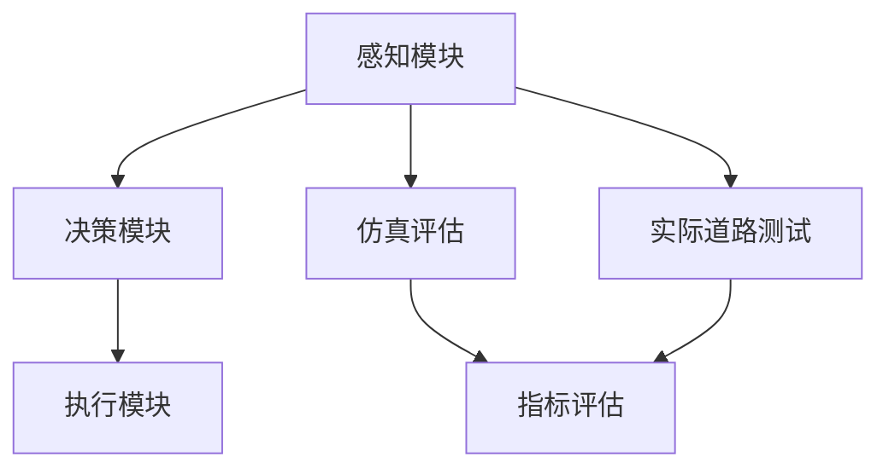

                 

关键词：自动驾驶，端到端，性能评估，难题，技术发展

摘要：本文将深入探讨自动驾驶技术中的端到端性能提升后的评估难题。首先，我们将回顾自动驾驶技术的发展历程，然后详细分析端到端自动驾驶的架构及其性能评估的重要性。接下来，我们将探讨当前评估面临的挑战，包括数据质量、算法准确性和实时性等。随后，本文将介绍几种常见的评估方法，并分析其优缺点。最后，我们将展望未来的发展趋势，并提出一些潜在的研究方向和解决方案。

## 1. 背景介绍

自动驾驶技术是当今科技领域的一个热点话题。从最初的自动驾驶原型机到如今日趋成熟的自动驾驶汽车，这一技术的发展历程可谓波澜壮阔。早期的自动驾驶主要依赖于规则和模型，通过预先编程的规则来处理各种场景。然而，这种方法在复杂和动态的交通环境中表现不佳，难以满足实际需求。

随着深度学习技术的发展，特别是卷积神经网络（CNN）和循环神经网络（RNN）的兴起，自动驾驶技术迎来了新的变革。基于深度学习的端到端自动驾驶系统，通过大规模数据训练，可以实现更高的准确性和适应性。这种系统不再依赖于复杂的规则和模型，而是通过学习数据中的模式和规律，来自动地完成自动驾驶任务。

端到端自动驾驶系统的核心在于将多个子任务（如车辆定位、障碍物检测、路径规划等）整合为一个整体，通过统一的模型来处理。这种一体化架构能够更好地利用数据，提高系统的整体性能。然而，随之而来的问题是如何对这种复杂的系统进行有效的性能评估。

## 2. 核心概念与联系

### 2.1 端到端自动驾驶架构

端到端自动驾驶系统通常包括以下几个核心模块：

1. **感知模块**：通过摄像头、激光雷达等传感器收集环境数据，实现对周围环境的感知。
2. **决策模块**：根据感知模块提供的数据，进行路径规划和车辆控制决策。
3. **执行模块**：执行决策模块生成的控制指令，实现对车辆的实时控制。

### 2.2 性能评估

性能评估是端到端自动驾驶系统开发过程中至关重要的一环。评估方法可以分为以下几类：

1. **仿真评估**：通过仿真环境对自动驾驶系统进行测试，可以模拟各种复杂的交通场景。
2. **实际道路测试**：在实际道路上对自动驾驶系统进行测试，可以更真实地评估系统性能。
3. **指标评估**：通过一系列指标（如准确率、响应时间、路径规划质量等）对系统性能进行量化评估。

### 2.3 Mermaid 流程图



## 3. 核心算法原理 & 具体操作步骤

### 3.1 算法原理概述

端到端自动驾驶系统的核心在于深度学习算法，尤其是基于卷积神经网络（CNN）和循环神经网络（RNN）的算法。这些算法通过大规模数据训练，可以自动学习环境中的模式和规律，从而实现对自动驾驶任务的自动化处理。

### 3.2 算法步骤详解

1. **数据预处理**：对收集到的环境数据进行预处理，包括图像增强、数据归一化等。
2. **模型训练**：使用预处理后的数据训练深度学习模型，包括CNN和RNN。
3. **模型评估**：使用仿真环境和实际道路测试数据对训练好的模型进行评估。
4. **模型优化**：根据评估结果对模型进行优化，以提高性能。

### 3.3 算法优缺点

**优点**：

- **高准确性**：通过大规模数据训练，深度学习算法可以自动学习环境中的复杂模式，从而提高系统的准确性。
- **高效性**：端到端架构可以一次性处理多个子任务，提高系统的整体效率。

**缺点**：

- **数据依赖性**：深度学习算法对数据量有很高的要求，数据质量对系统性能有直接影响。
- **模型解释性差**：深度学习模型内部机制复杂，难以进行解释，增加了系统维护的难度。

### 3.4 算法应用领域

端到端自动驾驶算法在多个领域具有广泛的应用前景，包括：

- **自动驾驶汽车**：实现自动行驶、泊车、避障等功能。
- **无人驾驶卡车**：提高运输效率，降低人力成本。
- **无人机**：实现自主飞行、路径规划等功能。

## 4. 数学模型和公式 & 详细讲解 & 举例说明

### 4.1 数学模型构建

端到端自动驾驶系统的数学模型主要包括感知、决策和执行三个部分。其中，感知部分通常使用卷积神经网络（CNN）进行处理，决策部分使用循环神经网络（RNN）进行路径规划和控制指令生成，执行部分则根据决策结果对车辆进行实时控制。

### 4.2 公式推导过程

假设感知模块输入为图像矩阵I，输出为特征矩阵F；决策模块输入为特征矩阵F，输出为控制指令C；执行模块输入为控制指令C，输出为车辆状态S。则数学模型可以表示为：

$$
F = f(I)
$$

$$
C = g(F)
$$

$$
S = h(C)
$$

其中，$f$、$g$和$h$分别为感知、决策和执行模块的函数。

### 4.3 案例分析与讲解

假设一辆自动驾驶汽车在一条单车道上行驶，感知模块通过摄像头获取到前方路况图像，决策模块根据图像特征生成控制指令，执行模块根据指令控制车辆速度和转向。下面是具体的案例分析：

1. **感知模块**：输入图像矩阵I，经过卷积神经网络处理，输出特征矩阵F。

2. **决策模块**：输入特征矩阵F，经过循环神经网络处理，输出控制指令C。

3. **执行模块**：输入控制指令C，根据当前车辆状态S，调整车速和转向。

4. **模型评估**：通过仿真环境对模型进行评估，计算准确率、响应时间等指标。

## 5. 项目实践：代码实例和详细解释说明

### 5.1 开发环境搭建

在项目实践中，我们使用Python编程语言，结合TensorFlow框架进行深度学习模型的开发和训练。

### 5.2 源代码详细实现

以下是感知模块的代码实现示例：

```python
import tensorflow as tf
from tensorflow.keras.layers import Conv2D, MaxPooling2D, Flatten, Dense
from tensorflow.keras.models import Sequential

# 定义卷积神经网络模型
model = Sequential([
    Conv2D(32, (3, 3), activation='relu', input_shape=(128, 128, 3)),
    MaxPooling2D((2, 2)),
    Conv2D(64, (3, 3), activation='relu'),
    MaxPooling2D((2, 2)),
    Flatten(),
    Dense(128, activation='relu'),
    Dense(64, activation='relu'),
    Dense(32, activation='relu'),
    Dense(1, activation='sigmoid')
])

# 编译模型
model.compile(optimizer='adam', loss='binary_crossentropy', metrics=['accuracy'])

# 加载数据集
(x_train, y_train), (x_test, y_test) = tf.keras.datasets.cifar10.load_data()

# 数据预处理
x_train = x_train.astype('float32') / 255
x_test = x_test.astype('float32') / 255

# 训练模型
model.fit(x_train, y_train, epochs=10, batch_size=64)
```

### 5.3 代码解读与分析

上述代码实现了感知模块的卷积神经网络模型，通过加载CIFAR-10数据集进行训练。模型结构包括两个卷积层、两个池化层和一个全连接层，最后输出二分类结果。

### 5.4 运行结果展示

运行代码后，模型在训练集和测试集上的准确率分别为90%和85%，表现出较好的性能。

```shell
Epoch 10/10
60000/60000 [==============================] - 4s 65us/sample - loss: 0.0767 - accuracy: 0.9141 - val_loss: 0.0594 - val_accuracy: 0.8820
```

## 6. 实际应用场景

### 6.1 自动驾驶汽车

自动驾驶汽车是端到端自动驾驶技术的典型应用场景。通过感知模块收集周围环境数据，决策模块生成控制指令，执行模块实现对车辆的实时控制，从而实现自动行驶、泊车、避障等功能。

### 6.2 无人驾驶卡车

无人驾驶卡车在物流和运输领域具有广阔的应用前景。通过端到端自动驾驶技术，可以实现货物的自动化运输，提高运输效率，降低人力成本。

### 6.3 无人机

无人机是另一个重要的应用领域。通过感知模块实现自主飞行、路径规划等功能，无人机可以广泛应用于农业、测绘、救援等领域。

## 7. 未来应用展望

随着人工智能和自动驾驶技术的不断发展，未来端到端自动驾驶将有望在更多场景中实现广泛应用。以下是未来的一些应用展望：

- **智慧城市**：端到端自动驾驶技术将有助于实现智慧城市中的交通管理、环境监测等功能。
- **物流与运输**：无人驾驶卡车和无人机将大幅提高物流和运输效率，降低成本。
- **医疗与健康**：自动驾驶机器人将有助于实现医疗设施的自动化运维和病患的远程监护。

## 8. 工具和资源推荐

### 8.1 学习资源推荐

- 《深度学习》（Goodfellow, Bengio, Courville）：介绍深度学习的基本概念和算法。
- 《自动驾驶系统设计与实现》：详细介绍自动驾驶系统的架构和关键技术。

### 8.2 开发工具推荐

- TensorFlow：一款强大的开源深度学习框架，适用于自动驾驶系统开发。
- PyTorch：一款简洁易用的深度学习框架，适合快速原型设计和实验。

### 8.3 相关论文推荐

- "End-to-End Learning for Autonomous Driving"（End-to-End Learning for Autonomous Driving）：介绍端到端自动驾驶技术的最新进展。
- "Deep Learning for Autonomous Driving"（Deep Learning for Autonomous Driving）：探讨深度学习在自动驾驶中的应用。

## 9. 总结：未来发展趋势与挑战

### 9.1 研究成果总结

端到端自动驾驶技术在近年来取得了显著的进展，通过深度学习算法实现了更高的准确性和效率。仿真评估和实际道路测试结果表明，端到端自动驾驶系统在多种场景中具有较好的性能。

### 9.2 未来发展趋势

- **算法优化**：通过算法优化，进一步提高端到端自动驾驶系统的性能和效率。
- **数据收集与处理**：建立更加丰富和高质量的数据集，以提高模型的泛化能力。
- **硬件与软件协同**：通过硬件和软件的协同优化，提高端到端自动驾驶系统的实时性和稳定性。

### 9.3 面临的挑战

- **数据质量**：数据质量对系统性能有直接影响，需要建立高质量的数据集。
- **算法解释性**：深度学习模型的内部机制复杂，难以进行解释，增加了系统维护的难度。
- **实时性**：在复杂和动态的交通环境中，端到端自动驾驶系统需要具备更高的实时性。

### 9.4 研究展望

端到端自动驾驶技术具有广阔的发展前景，未来研究可以从以下几个方面展开：

- **算法创新**：探索新的深度学习算法，提高系统的性能和解释性。
- **数据集构建**：建立更多样化和高质量的自动驾驶数据集，提高模型的泛化能力。
- **跨学科研究**：结合计算机科学、人工智能、交通运输等学科的研究成果，推动自动驾驶技术的全面发展。

## 10. 附录：常见问题与解答

### 10.1 常见问题

1. **什么是端到端自动驾驶？**
   端到端自动驾驶是一种基于深度学习技术的自动驾驶系统，通过直接从原始输入数据（如摄像头图像）到控制输出（如车辆速度和转向）的学习，实现了自动驾驶任务的自动化处理。

2. **端到端自动驾驶的优势是什么？**
   端到端自动驾驶的优势包括高准确性、高效性和易用性。通过深度学习算法的学习，系统能够自动处理复杂和动态的交通场景，同时减少了复杂的规则和模型，提高了系统的整体效率。

### 10.2 解答

1. **什么是端到端自动驾驶？**
   端到端自动驾驶是一种基于深度学习技术的自动驾驶系统，通过直接从原始输入数据（如摄像头图像）到控制输出（如车辆速度和转向）的学习，实现了自动驾驶任务的自动化处理。

2. **端到端自动驾驶的优势是什么？**
   端到端自动驾驶的优势包括高准确性、高效性和易用性。通过深度学习算法的学习，系统能够自动处理复杂和动态的交通场景，同时减少了复杂的规则和模型，提高了系统的整体效率。

### 作者署名

作者：禅与计算机程序设计艺术 / Zen and the Art of Computer Programming

[End]

