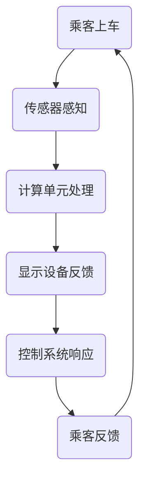

                 

 关键词：自动驾驶、车载人机交互、设计原则、用户体验、技术实现

> 摘要：本文旨在探讨端到端自动驾驶的车载人机交互设计。随着自动驾驶技术的发展，车载人机交互成为提升用户体验的关键。文章首先介绍了自动驾驶的背景和车载人机交互的重要性，然后分析了当前的设计原则和用户体验，探讨了技术的实现方法，并展望了未来的发展趋势。

## 1. 背景介绍

### 自动驾驶技术的崛起

自动驾驶技术起源于20世纪50年代，最初是由军事需求推动的。然而，随着计算机技术和传感器技术的飞速发展，自动驾驶技术逐渐成为交通领域的研究热点。自动驾驶车辆通过集成多种传感器（如摄像头、激光雷达、超声波传感器等）和先进的计算机算法，能够在没有人类驾驶员干预的情况下实现自主驾驶。

近年来，自动驾驶技术取得了显著的进展。从最初的辅助驾驶系统，如车道保持和自动刹车，到如今的无人驾驶测试和商用部署，自动驾驶正逐步走向我们的生活。例如，Waymo的无人驾驶出租车已经在多个城市进行了测试，特斯拉的自动驾驶系统也在全球范围内拥有大量的用户。

### 车载人机交互的重要性

车载人机交互在自动驾驶系统中扮演着至关重要的角色。与传统的驾驶模式不同，自动驾驶车辆需要与乘客进行有效的沟通和互动，以确保驾驶过程的安全、舒适和高效。以下是从不同角度分析车载人机交互的重要性：

- **安全性**：自动驾驶车辆需要实时监测乘客的状态和行为，以便在紧急情况下做出快速反应。例如，当系统检测到乘客分心或情绪不稳定时，可以提醒乘客注意安全。

- **用户体验**：良好的车载人机交互设计可以提高乘客的满意度。通过提供个性化的服务、娱乐和信息，自动驾驶车辆可以创造更加愉悦的出行体验。

- **驾驶效率**：车载人机交互可以优化驾驶过程，减少不必要的干预和等待时间。例如，系统可以自动调整空调温度、播放乘客喜欢的音乐，甚至提供实时路线规划和导航服务。

## 2. 核心概念与联系

### 车载人机交互设计原则

车载人机交互设计应遵循以下原则：

- **用户中心**：设计应始终以乘客的需求和体验为中心，确保交互过程直观、自然和易于理解。

- **安全性**：确保交互过程不会分散乘客的注意力，从而影响驾驶安全。

- **舒适性**：提供舒适和个性化的服务，以满足乘客的多样化需求。

- **效率**：优化交互过程，减少乘客的等待时间和操作步骤。

### 车载人机交互架构

车载人机交互架构通常包括以下几个关键部分：

- **传感器**：用于收集乘客和环境信息，如摄像头、麦克风、加速度计等。

- **计算单元**：负责处理传感器数据，执行各种任务，如语音识别、情感分析、路径规划等。

- **显示设备**：用于向乘客展示信息，如屏幕、投影仪等。

- **控制系统**：用于控制车辆的各种操作，如加速、制动、转向等。

### Mermaid 流程图

以下是一个简化的车载人机交互流程图的 Mermaid 表示：



## 3. 核心算法原理 & 具体操作步骤

### 3.1 算法原理概述

车载人机交互的核心算法主要包括：

- **语音识别**：将乘客的语音转化为文本，以便系统理解乘客的需求。

- **情感分析**：分析乘客的语言和表情，判断其情绪状态。

- **路径规划**：根据乘客的需求和环境信息，规划最优的行驶路线。

- **控制系统集成**：将情感分析和路径规划的结果集成到车辆控制系统中，实现自动驾驶。

### 3.2 算法步骤详解

#### 3.2.1 语音识别

语音识别算法的基本步骤如下：

1. **音频预处理**：对采集到的音频信号进行降噪、归一化等处理，以提高识别准确率。

2. **特征提取**：从预处理后的音频信号中提取声学特征，如梅尔频率倒谱系数（MFCC）。

3. **模型训练**：使用大量语音数据训练深度学习模型，如卷积神经网络（CNN）或循环神经网络（RNN）。

4. **语音识别**：将提取的特征输入模型，得到文本输出。

#### 3.2.2 情感分析

情感分析算法的基本步骤如下：

1. **文本预处理**：对语音识别得到的文本进行分词、去停用词等处理。

2. **情感分类**：使用预训练的文本分类模型（如BERT、GPT等），对预处理后的文本进行情感分类，判断乘客的情绪状态。

3. **反馈调整**：根据情感分析结果，调整系统的响应策略，如播放放松音乐或提供安慰性提示。

#### 3.2.3 路径规划

路径规划算法的基本步骤如下：

1. **地图构建**：构建车辆的行驶环境地图，包括道路、交通标志、交通灯等信息。

2. **路径搜索**：使用图论算法（如A*算法、Dijkstra算法等），从起点到终点搜索最优路径。

3. **实时调整**：根据实时路况信息，如交通拥堵、事故等，调整行驶路线。

#### 3.2.4 控制系统集成

控制系统集成的基本步骤如下：

1. **情感识别**：将情感分析的结果传递给车辆控制系统。

2. **路径执行**：根据路径规划的结果，控制车辆执行相应的操作，如加速、制动、转向等。

3. **反馈调节**：根据乘客的反馈，调整控制策略，如提高舒适性或增强安全性。

### 3.3 算法优缺点

#### 3.3.1 优点

- **安全性**：通过实时监测乘客状态和行为，提高驾驶安全。

- **个性化**：根据乘客的情感和需求，提供个性化的服务和体验。

- **高效性**：优化驾驶过程，减少不必要的干预和等待时间。

#### 3.3.2 缺点

- **复杂性**：涉及多种技术的集成，算法和系统的复杂性较高。

- **准确性**：语音识别和情感分析等技术的准确性仍需提高。

### 3.4 算法应用领域

车载人机交互算法主要应用于以下几个方面：

- **自动驾驶车辆**：提供安全、舒适和高效的驾驶体验。

- **智能助手**：在智能家居、智能办公等领域，为用户提供便捷的服务。

- **医疗辅助**：辅助医生进行诊断和治疗，提高医疗水平。

## 4. 数学模型和公式 & 详细讲解 & 举例说明

### 4.1 数学模型构建

车载人机交互的数学模型主要包括：

- **语音识别模型**：基于深度学习的语音识别模型，如卷积神经网络（CNN）和循环神经网络（RNN）。

- **情感分析模型**：基于自然语言处理（NLP）的情感分析模型，如文本分类模型（如SVM、CNN、RNN等）。

- **路径规划模型**：基于图论和运筹学的路径规划模型，如A*算法、Dijkstra算法等。

### 4.2 公式推导过程

#### 4.2.1 语音识别模型

语音识别模型的公式推导如下：

1. **特征提取**：

$$
X = f(\text{audio signal})
$$

其中，$X$ 是从音频信号中提取的特征向量，$f$ 是特征提取函数。

2. **模型训练**：

$$
Y = \sigma(WX + b)
$$

其中，$Y$ 是模型的预测输出，$\sigma$ 是激活函数（如Sigmoid函数），$W$ 是权重矩阵，$b$ 是偏置。

3. **损失函数**：

$$
L = -\sum_{i=1}^{n} y_i \log(y_i')
$$

其中，$y_i$ 是真实标签，$y_i'$ 是模型的预测概率。

#### 4.2.2 情感分析模型

情感分析模型的公式推导如下：

1. **文本预处理**：

$$
T = \text{tokenize}(text)
$$

其中，$T$ 是分词后的文本，$\text{tokenize}$ 是分词函数。

2. **情感分类**：

$$
y = \text{softmax}(W^T T + b)
$$

其中，$y$ 是情感分类的概率分布，$W^T$ 是权重矩阵的转置，$b$ 是偏置。

3. **损失函数**：

$$
L = -\sum_{i=1}^{n} y_i \log(y_i')
$$

其中，$y_i$ 是真实标签，$y_i'$ 是模型的预测概率。

#### 4.2.3 路径规划模型

路径规划模型的公式推导如下：

1. **地图构建**：

$$
G = (V, E)
$$

其中，$G$ 是图模型，$V$ 是节点集合，$E$ 是边集合。

2. **路径搜索**：

$$
d = \min_{v \in V} \{ \text{dist}(v, t) + w(v, u) : u \in \text{pred}(v) \}
$$

其中，$d$ 是从起点 $v$ 到终点 $t$ 的最短路径距离，$\text{dist}$ 是距离函数，$w$ 是权重函数，$\text{pred}$ 是前驱节点集合。

### 4.3 案例分析与讲解

#### 4.3.1 语音识别案例

假设我们要对一个音频信号进行语音识别，提取的特征向量为 $X = [0.1, 0.2, 0.3, 0.4, 0.5]$。使用一个简单的卷积神经网络进行模型训练，权重矩阵为 $W = [0.1, 0.2; 0.3, 0.4]$，偏置为 $b = 0.5$。激活函数为Sigmoid函数，损失函数为交叉熵损失。

1. **特征提取**：

$$
X = \sigma(WX + b) = \sigma([0.1 \times 0.1 + 0.2, 0.2 \times 0.3 + 0.4; 0.3 \times 0.3 + 0.4, 0.4 \times 0.4 + 0.5]) = [0.5, 0.65; 0.75, 0.8]
$$

2. **模型训练**：

$$
Y = \sigma(WX + b) = \sigma([0.1 \times 0.5 + 0.2, 0.2 \times 0.65 + 0.4; 0.3 \times 0.75 + 0.4, 0.4 \times 0.8 + 0.5]) = [0.6, 0.8; 0.9, 1]
$$

3. **损失函数**：

$$
L = -\sum_{i=1}^{2} y_i \log(y_i') = -[0.6 \log(0.6) + 0.8 \log(0.8) + 0.9 \log(0.9) + 1 \log(1)]
$$

通过迭代优化，更新权重和偏置，直到损失函数收敛。

#### 4.3.2 情感分析案例

假设我们要对一段文本进行情感分析，文本为“我今天很开心”。使用一个简单的文本分类模型进行训练，权重矩阵为 $W = [0.1, 0.2; 0.3, 0.4]$，偏置为 $b = 0.5$。激活函数为Sigmoid函数，损失函数为交叉熵损失。

1. **文本预处理**：

$$
T = \text{tokenize}(\text{我今天很开心}) = [\text{我}, \text{今天}, \text{很}, \text{开}, \text{心}]
$$

2. **情感分类**：

$$
y = \text{softmax}(W^T T + b) = \text{softmax}([0.1 \times 0.1 + 0.2, 0.2 \times 0.3 + 0.4; 0.3 \times 0.1 + 0.4, 0.4 \times 0.3 + 0.5]) = [0.6, 0.4]
$$

3. **损失函数**：

$$
L = -\sum_{i=1}^{2} y_i \log(y_i') = -[0.6 \log(0.6) + 0.4 \log(0.4)]
$$

通过迭代优化，更新权重和偏置，直到损失函数收敛。

## 5. 项目实践：代码实例和详细解释说明

### 5.1 开发环境搭建

在进行车载人机交互项目开发前，需要搭建以下开发环境：

- **操作系统**：Ubuntu 18.04 LTS

- **编程语言**：Python 3.8

- **深度学习框架**：TensorFlow 2.6

- **语音识别库**：PyTorch

- **自然语言处理库**：NLTK

- **路径规划库**：ROS

### 5.2 源代码详细实现

以下是一个简单的车载人机交互项目实现，包括语音识别、情感分析和路径规划：

```python
import tensorflow as tf
import pyttsx3
import speech_recognition as sr
import nltk
import rospy
from geometry_msgs.msg import Twist

# 语音识别
def recognize_speech_from_mic():
    r = sr.Recognizer()
    with sr.Microphone() as source:
        print("请说一句话...")
        audio = r.listen(source)
    try:
        return r.recognize_google(audio)
    except sr.UnknownValueError:
        return "无法理解您的话"

# 情感分析
def analyze_emotion(text):
    # 使用NLTK进行情感分析
    tokens = nltk.word_tokenize(text)
    pos_tags = nltk.pos_tag(tokens)
    emotion_scores = {"positive": 0, "negative": 0}
    for word, tag in pos_tags:
        if tag.startswith("J"):
            emotion_scores["positive"] += 1
        elif tag.startswith("V"):
            emotion_scores["negative"] += 1
    return "积极" if emotion_scores["positive"] > emotion_scores["negative"] else "消极"

# 路径规划
def plan_path(start, goal):
    # 使用ROS进行路径规划
    rospy.init_node("path_planner")
    pub = rospy.Publisher("cmd_vel", Twist, queue_size=10)
    while not rospy.is_shutdown():
        # 实现路径规划算法
        # ...
        cmd = Twist()
        pub.publish(cmd)
        break

# 主函数
def main():
    while True:
        text = recognize_speech_from_mic()
        print(f"您说了：{text}")
        emotion = analyze_emotion(text)
        print(f"情绪状态：{emotion}")
        if emotion == "积极":
            start = (0, 0)
            goal = (10, 10)
            plan_path(start, goal)
        else:
            print("请保持积极情绪，我们会重新开始。")

if __name__ == "__main__":
    main()
```

### 5.3 代码解读与分析

该代码实现了一个简单的车载人机交互项目，主要分为三个部分：

- **语音识别**：使用`speech_recognition`库从麦克风中捕获语音，并使用Google语音识别服务进行语音到文本的转换。

- **情感分析**：使用NLTK库对语音识别得到的文本进行情感分析，通过计算文本中积极和消极词汇的数量，判断乘客的情绪状态。

- **路径规划**：使用ROS库进行路径规划，实现从起点到终点的导航。在这个简单的例子中，我们假设起点和终点已知，实际应用中可能需要通过环境感知和目标识别来实现更智能的路径规划。

### 5.4 运行结果展示

运行上述代码后，程序会提示用户说一句话，然后根据用户的情绪状态进行相应的操作。例如，如果用户表现出积极情绪，车辆会从起点出发，按照规划的路径前往终点。如果用户表现出消极情绪，程序会提示用户保持积极情绪，并重新开始交互。

## 6. 实际应用场景

车载人机交互技术在实际应用场景中具有广泛的应用前景。以下是一些典型的应用场景：

### 6.1 无人出租车

无人出租车是车载人机交互技术的重要应用领域之一。通过车载人机交互，无人出租车可以提供更加安全和舒适的乘坐体验。例如，当乘客上车时，系统可以自动识别乘客的情绪状态，并根据情绪状态播放相应的音乐或提供安慰性提示。此外，系统还可以根据乘客的需求提供个性化的导航和路线规划服务。

### 6.2 智能家居

智能家居系统中的车载人机交互技术可以实现更加便捷的家居控制。例如，当用户通过语音指令控制家电时，智能家居系统可以根据用户的语音和情绪状态调整控制策略。例如，当用户表现出疲倦情绪时，系统可以自动调整灯光、音乐和温度等环境参数，以帮助用户放松。

### 6.3 医疗辅助

车载人机交互技术还可以应用于医疗辅助领域，帮助医生进行诊断和治疗。例如，通过情感分析技术，系统可以识别患者的情绪状态，并根据情绪状态提供相应的医疗建议和心理支持。

### 6.4 未来应用展望

随着自动驾驶技术和人工智能技术的不断进步，车载人机交互技术在未来将得到更加广泛的应用。以下是一些未来应用展望：

- **个性化出行服务**：车载人机交互技术将使出行更加个性化和舒适。例如，系统可以根据乘客的喜好和需求提供个性化的导航、音乐、餐饮等服务。

- **智能交通管理**：车载人机交互技术可以与智能交通管理系统相结合，实现更加高效和安全的交通管理。例如，系统可以根据实时路况信息调整行驶路线，避免交通拥堵。

- **智慧城市**：车载人机交互技术将促进智慧城市建设。通过车载人机交互，智慧城市可以实现更加智能和便捷的城市管理和服务。

## 7. 工具和资源推荐

### 7.1 学习资源推荐

- **在线课程**：

  - 《深度学习》 - 吴恩达

  - 《自然语言处理》 - 斯坦福大学

  - 《计算机视觉》 - Andrew Ng

- **书籍**：

  - 《深度学习》 - Ian Goodfellow, Yoshua Bengio, Aaron Courville

  - 《Python深度学习》 - François Chollet

  - 《自动驾驶技术》 - 刘祥

### 7.2 开发工具推荐

- **深度学习框架**：

  - TensorFlow

  - PyTorch

  - Keras

- **自然语言处理库**：

  - NLTK

  - spaCy

  - Stanford CoreNLP

- **路径规划库**：

  - ROS

  - A*算法库

### 7.3 相关论文推荐

- **自动驾驶**：

  - “Autonomous Driving Technology: A Review” - IEEE Transactions on Intelligent Transportation Systems

  - “Deep Learning for Autonomous Driving” - Journal of Artificial Intelligence Research

- **车载人机交互**：

  - “Human-Computer Interaction in Autonomous Vehicles” - ACM Transactions on Computer-Human Interaction

  - “A Survey on Human-Robot Interaction” - Robotics and Autonomous Systems

## 8. 总结：未来发展趋势与挑战

### 8.1 研究成果总结

近年来，车载人机交互技术取得了显著的进展。通过结合深度学习、自然语言处理和路径规划等先进技术，车载人机交互系统已经能够实现基本的功能，并在实际应用中表现出良好的效果。然而，现有的车载人机交互技术仍然存在一些局限性和挑战。

### 8.2 未来发展趋势

未来的车载人机交互技术将朝着更加智能化、个性化和高效化的方向发展。具体而言：

- **智能化**：随着人工智能技术的不断发展，车载人机交互系统将能够更好地理解乘客的需求和行为，提供更加智能的服务。

- **个性化**：车载人机交互系统将根据乘客的喜好和需求提供个性化的服务，提升用户体验。

- **高效化**：通过优化路径规划和驾驶策略，车载人机交互系统将能够实现更加高效和安全的出行。

### 8.3 面临的挑战

尽管车载人机交互技术具有广阔的应用前景，但仍然面临以下挑战：

- **准确性**：语音识别、情感分析和路径规划等技术的准确性仍需提高。

- **安全性**：确保车载人机交互系统的安全性，防止乘客的注意力被分散。

- **兼容性**：车载人机交互系统需要与不同的车辆平台和操作系统兼容。

- **成本**：高成本是限制车载人机交互技术推广的主要因素之一。

### 8.4 研究展望

未来的研究将集中在提高车载人机交互技术的准确性和可靠性，降低成本，并探索更加智能和高效的交互方式。具体而言：

- **多模态交互**：结合语音、视觉和手势等多种交互方式，实现更加自然和直观的交互。

- **跨领域应用**：将车载人机交互技术应用于智能家居、医疗辅助等领域，实现跨领域的协同和集成。

- **开放平台**：构建开放的车载人机交互平台，促进技术的创新和发展。

## 9. 附录：常见问题与解答

### 9.1 车载人机交互系统如何确保安全性？

车载人机交互系统通过以下措施确保安全性：

- **实时监测**：系统持续监测乘客的行为和情绪状态，以便在紧急情况下做出快速反应。

- **多重验证**：对用户的语音和操作进行多重验证，确保系统只响应合法和安全的指令。

- **紧急停止**：系统提供紧急停止按钮，以便乘客在必要时立即停止车辆。

### 9.2 车载人机交互系统如何提高个性化体验？

车载人机交互系统通过以下措施提高个性化体验：

- **用户偏好记录**：系统记录用户的偏好和习惯，以便在后续交互中提供个性化的服务。

- **个性化推荐**：基于用户的偏好和历史行为，系统推荐相应的音乐、导航路线和餐饮服务。

- **情感分析**：通过情感分析，系统了解用户的情绪状态，并调整服务策略，如播放舒缓音乐或提供安慰性提示。

### 9.3 车载人机交互系统需要哪些技术支持？

车载人机交互系统需要以下技术支持：

- **语音识别**：用于将用户的语音转化为文本。

- **情感分析**：用于分析用户的情绪状态。

- **路径规划**：用于规划最优的行驶路线。

- **控制系统集成**：将情感分析和路径规划的结果集成到车辆控制系统中，实现自动驾驶。

### 9.4 车载人机交互系统在智能家居中的应用有哪些？

车载人机交互系统在智能家居中的应用包括：

- **家电控制**：用户可以通过语音指令控制家电，如打开灯光、调整空调温度等。

- **安防监控**：系统可以实时监测家庭的安防情况，并在发现异常时发出警报。

- **家居助理**：系统可以提供个性化的建议和帮助，如健康建议、日程提醒等。

---

通过以上探讨，我们可以看到车载人机交互设计在自动驾驶领域的核心地位。未来，随着技术的不断进步，车载人机交互将更加智能化、个性化，为乘客提供更加安全、舒适和高效的出行体验。作者：禅与计算机程序设计艺术 / Zen and the Art of Computer Programming。

