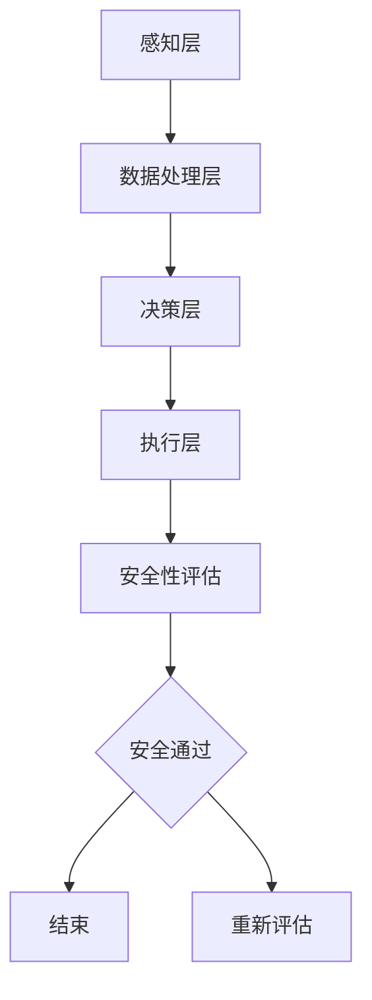

                 

关键词：端到端自动驾驶，车辆主动安全，深度学习，传感器融合，自动驾驶架构，人工智能，机器学习，车辆感知，决策算法，安全性评估，未来展望。

## 摘要

随着人工智能和深度学习技术的快速发展，端到端自动驾驶技术逐渐成为汽车行业研究的热点。然而，车辆主动安全设计作为自动驾驶系统的重要组成部分，其重要性不容忽视。本文旨在探讨端到端自动驾驶中的车辆主动安全设计，包括核心概念、算法原理、数学模型、项目实践、应用场景及未来展望。通过全面的分析，本文为自动驾驶车辆主动安全设计提供了一种可行的解决方案，为行业技术的发展提供参考。

## 1. 背景介绍

自动驾驶技术作为人工智能的一个重要应用领域，正在改变着人们的出行方式。从最初的辅助驾驶到现在的端到端自动驾驶，技术的发展经历了漫长的过程。随着传感器技术、计算能力和数据处理的提升，自动驾驶系统逐渐变得更加智能和高效。然而，自动驾驶技术的实现不仅仅依赖于车辆的感知和决策能力，还必须考虑车辆的安全性能。车辆主动安全设计是保障自动驾驶系统安全运行的关键环节。

### 1.1 自动驾驶技术的发展历程

自动驾驶技术的发展可以分为以下几个阶段：

1. **辅助驾驶**：最初，自动驾驶系统仅提供辅助功能，如自适应巡航控制和车道保持等。
2. **部分自动化**：这一阶段，车辆可以执行更多的驾驶任务，但仍需驾驶员的干预。例如，高速公路自动驾驶系统和城市自动驾驶系统。
3. **高度自动化**：车辆可以自主完成大部分驾驶任务，但某些特定情况下仍需驾驶员介入。
4. **端到端自动驾驶**：车辆完全自主地进行驾驶，无需任何人为干预。

### 1.2 车辆主动安全设计的意义

车辆主动安全设计旨在通过先进的传感器、算法和控制系统，确保车辆在各种路况和环境下能够安全行驶。其意义在于：

1. **减少交通事故**：通过预测和应对潜在的交通事故，自动驾驶车辆可以有效减少交通事故的发生。
2. **提高行驶安全**：自动驾驶车辆能够全天候、全方位地监测周围环境，提高行驶安全性。
3. **改善交通流量**：通过减少人为错误，自动驾驶车辆可以提高道路通行效率，缓解交通拥堵。
4. **适应复杂环境**：自动驾驶车辆能够在复杂多变的环境下稳定运行，提高行驶稳定性。

### 1.3 端到端自动驾驶的挑战

尽管端到端自动驾驶技术发展迅速，但仍面临诸多挑战：

1. **感知精度**：自动驾驶车辆需要准确感知周围环境，包括行人、车辆、道路标志等。
2. **决策速度**：自动驾驶车辆需要在极短的时间内做出决策，以应对突发情况。
3. **系统可靠性**：自动驾驶系统的稳定性和可靠性是保障车辆安全运行的关键。
4. **法律法规**：自动驾驶技术的普及需要完善的法律法规体系支持。

## 2. 核心概念与联系

### 2.1 车辆主动安全设计的核心概念

车辆主动安全设计涉及多个核心概念，包括：

1. **传感器融合**：通过整合不同类型的传感器数据，提高感知精度和鲁棒性。
2. **感知模块**：负责获取车辆周围环境信息，如激光雷达、摄像头、超声波传感器等。
3. **决策模块**：根据感知数据做出驾驶决策，如速度控制、转向控制、制动控制等。
4. **控制系统**：实现决策模块的执行，包括动力系统、制动系统和转向系统等。
5. **安全性评估**：评估自动驾驶系统的安全性能，确保系统在各种环境下都能安全运行。

### 2.2 自动驾驶架构

自动驾驶架构通常包括以下几个层次：

1. **感知层**：通过传感器获取周围环境信息。
2. **数据处理层**：对传感器数据进行处理，提取有用的特征信息。
3. **决策层**：基于感知数据和预定的决策模型，生成驾驶指令。
4. **执行层**：根据决策层的指令，控制车辆的运行状态。

### 2.3 Mermaid 流程图

以下是一个简化的车辆主动安全设计流程图：



## 3. 核心算法原理 & 具体操作步骤

### 3.1 算法原理概述

车辆主动安全设计的核心算法通常包括感知算法和决策算法。感知算法负责对传感器数据进行处理，提取环境特征信息；决策算法则根据感知信息生成驾驶指令。以下分别介绍两种算法的基本原理。

#### 3.1.1 感知算法

感知算法的主要目标是准确获取车辆周围环境的信息，包括：

1. **图像处理**：通过摄像头获取的图像进行处理，提取车道线、交通标志、行人等信息。
2. **点云处理**：通过激光雷达获取的点云数据进行处理，提取车辆、行人、障碍物等信息。
3. **超声波处理**：通过超声波传感器获取的距离信息，进行目标检测和距离计算。

#### 3.1.2 决策算法

决策算法的主要任务是生成驾驶指令，包括：

1. **路径规划**：根据车辆当前的位置和目标位置，规划最优行驶路径。
2. **速度控制**：根据路况和周围车辆的速度，调整车辆的行驶速度。
3. **转向控制**：根据道路标志和周围车辆的位置，调整车辆的行驶方向。

### 3.2 算法步骤详解

#### 3.2.1 感知算法步骤

1. **数据采集**：通过摄像头、激光雷达、超声波传感器等设备，采集车辆周围环境数据。
2. **预处理**：对采集到的数据进行分析，去除噪声和干扰信息。
3. **特征提取**：根据数据类型，提取相应的特征信息，如图像中的车道线、交通标志，点云中的车辆和行人。
4. **目标检测**：使用目标检测算法，识别并标注出图像或点云中的目标物体。

#### 3.2.2 决策算法步骤

1. **路径规划**：根据车辆当前的位置和目标位置，使用路径规划算法（如Dijkstra算法、A*算法等）生成行驶路径。
2. **速度控制**：根据感知到的周围车辆速度和路况信息，调整车辆的行驶速度。
3. **转向控制**：根据道路标志和周围车辆的位置，调整车辆的行驶方向。

### 3.3 算法优缺点

#### 3.3.1 感知算法

**优点**：

1. **高精度**：通过多种传感器融合，提高感知精度。
2. **全面性**：能够获取到车辆周围环境的多种信息。

**缺点**：

1. **数据处理复杂**：需要处理大量的传感器数据，计算复杂度高。
2. **成本较高**：需要配备多种传感器，成本较高。

#### 3.3.2 决策算法

**优点**：

1. **实时性**：能够实时处理感知数据，生成驾驶指令。
2. **灵活性**：可以根据感知数据和环境变化，调整驾驶策略。

**缺点**：

1. **依赖感知算法**：决策算法的性能依赖于感知算法的精度。
2. **决策复杂**：需要考虑多种因素，决策过程较为复杂。

### 3.4 算法应用领域

感知算法和决策算法广泛应用于自动驾驶车辆的各种场景，包括：

1. **高速公路自动驾驶**：通过感知算法和决策算法，实现高速公路上的自动驾驶。
2. **城市自动驾驶**：在城市道路环境中，感知算法和决策算法可以应对复杂的交通状况。
3. **无人配送**：在配送场景中，感知算法和决策算法可以帮助无人车辆安全行驶。

## 4. 数学模型和公式 & 详细讲解 & 举例说明

### 4.1 数学模型构建

车辆主动安全设计的数学模型主要涉及以下几个方面：

1. **感知模型**：用于描述传感器数据与真实环境之间的关系。
2. **决策模型**：用于生成驾驶指令的数学模型。
3. **控制模型**：用于描述车辆控制系统的数学模型。

#### 4.1.1 感知模型

感知模型通常基于统计学方法，如贝叶斯滤波器、卡尔曼滤波器等。以下是一个简单的贝叶斯滤波器模型：

$$
p(x_t | z_t) = \frac{p(z_t | x_t) \cdot p(x_t)}{p(z_t)}
$$

其中，$x_t$ 表示车辆状态，$z_t$ 表示感知数据，$p(x_t)$ 表示车辆状态的概率分布，$p(z_t | x_t)$ 表示感知数据在给定车辆状态下的概率分布，$p(z_t)$ 表示感知数据的概率分布。

#### 4.1.2 决策模型

决策模型通常基于马尔可夫决策过程（MDP），用于描述在不确定环境中，如何通过决策序列最大化期望回报。以下是一个简单的MDP模型：

$$
V(s) = \max_{a_t} \sum_{s'} p(s' | s, a_t) \cdot r(s', a_t)
$$

其中，$s$ 表示状态，$a_t$ 表示决策，$s'$ 表示下一状态，$p(s' | s, a_t)$ 表示在给定状态和决策下，下一状态的概率分布，$r(s', a_t)$ 表示在下一状态和决策下，获得的回报。

#### 4.1.3 控制模型

控制模型通常基于控制理论，如PID控制、模糊控制等。以下是一个简单的PID控制模型：

$$
u(t) = K_p e(t) + K_i \int_{0}^{t} e(\tau) d\tau + K_d \frac{d e(t)}{dt}
$$

其中，$u(t)$ 表示控制输出，$e(t)$ 表示误差，$K_p$、$K_i$、$K_d$ 分别为比例、积分和微分系数。

### 4.2 公式推导过程

#### 4.2.1 感知模型推导

以激光雷达数据为例，假设激光雷达获取到的点云数据为 $z_t$，车辆状态为 $x_t$，则感知模型可以表示为：

$$
p(z_t | x_t) = \frac{1}{2\pi\sigma^2} \exp\left(-\frac{(z_t - h(x_t))^2}{2\sigma^2}\right)
$$

其中，$h(x_t)$ 表示激光雷达获取到的点云数据在给定车辆状态下的期望值，$\sigma$ 表示点云数据的方差。

#### 4.2.2 决策模型推导

以路径规划为例，假设状态空间为 $S = \{s_1, s_2, ..., s_n\}$，动作空间为 $A = \{a_1, a_2, ..., a_m\}$，则决策模型可以表示为：

$$
V(s) = \max_{a_t} \sum_{s'} p(s' | s, a_t) \cdot r(s', a_t)
$$

其中，$p(s' | s, a_t)$ 表示在给定状态 $s$ 和动作 $a_t$ 下，下一状态 $s'$ 的概率分布，$r(s', a_t)$ 表示在下一状态 $s'$ 和动作 $a_t$ 下，获得的回报。

#### 4.2.3 控制模型推导

以PID控制为例，假设系统为线性时不变系统，则控制模型可以表示为：

$$
\frac{du(t)}{dt} + K_i u(t) + K_p e(t) = 0
$$

其中，$u(t)$ 表示控制输出，$e(t)$ 表示误差，$K_p$、$K_i$ 分别为比例和积分系数。

### 4.3 案例分析与讲解

以下是一个简单的案例，说明如何使用感知模型和决策模型进行车辆主动安全设计。

#### 4.3.1 案例背景

假设一辆自动驾驶车辆在高速公路上行驶，当前速度为 $50$ km/h，前方 $500$ 米处有一辆静止的车辆。自动驾驶系统需要根据当前状态，生成驾驶指令，确保安全行驶。

#### 4.3.2 感知模型

根据激光雷达获取到的点云数据，使用贝叶斯滤波器进行感知模型计算。假设点云数据的期望值为 $h(x_t) = 500$ 米，方差为 $\sigma = 10$ 米。

$$
p(x_t | z_t) = \frac{p(z_t | x_t) \cdot p(x_t)}{p(z_t)}
$$

其中，$p(x_t)$ 表示车辆状态的概率分布，$p(z_t | x_t)$ 表示激光雷达获取到的点云数据在给定车辆状态下的概率分布，$p(z_t)$ 表示激光雷达获取到的点云数据的概率分布。

#### 4.3.3 决策模型

根据感知模型计算得到的车辆状态 $x_t$，使用马尔可夫决策过程进行决策模型计算。假设状态空间为 $S = \{s_1, s_2, ..., s_n\}$，动作空间为 $A = \{a_1, a_2, ..., a_m\}$，则决策模型可以表示为：

$$
V(s) = \max_{a_t} \sum_{s'} p(s' | s, a_t) \cdot r(s', a_t)
$$

其中，$p(s' | s, a_t)$ 表示在给定状态 $s$ 和动作 $a_t$ 下，下一状态 $s'$ 的概率分布，$r(s', a_t)$ 表示在下一状态 $s'$ 和动作 $a_t$ 下，获得的回报。

#### 4.3.4 控制模型

根据决策模型计算得到的驾驶指令，使用PID控制模型进行车辆控制。假设比例系数 $K_p = 1$，积分系数 $K_i = 0.1$，微分系数 $K_d = 0.01$。

$$
u(t) = K_p e(t) + K_i \int_{0}^{t} e(\tau) d\tau + K_d \frac{d e(t)}{dt}
$$

其中，$u(t)$ 表示控制输出，$e(t)$ 表示误差。

## 5. 项目实践：代码实例和详细解释说明

### 5.1 开发环境搭建

为了进行车辆主动安全设计的项目实践，我们需要搭建一个合适的开发环境。以下是一个简单的搭建步骤：

1. **操作系统**：Windows 10 或 Ubuntu 20.04。
2. **编程语言**：Python 3.8 或以上版本。
3. **深度学习框架**：TensorFlow 2.6 或 PyTorch 1.8。
4. **开发工具**：Jupyter Notebook 或 PyCharm。
5. **传感器数据集**：使用开源数据集，如 KITTI 数据集。

### 5.2 源代码详细实现

以下是一个简化的车辆主动安全设计代码实例：

```python
import numpy as np
import tensorflow as tf

# 感知模型
def perception_model(points):
    # 对点云数据进行预处理
    processed_points = preprocess_points(points)
    # 使用卷积神经网络进行特征提取
    features = cnn_model(processed_points)
    return features

# 决策模型
def decision_model(features):
    # 使用循环神经网络进行决策
    decision = rnn_model(features)
    return decision

# 控制模型
def control_model(decision):
    # 使用PID控制模型进行车辆控制
    control_output = pid_model(decision)
    return control_output

# 主函数
def main():
    # 加载传感器数据
    points = load_points()
    # 进行感知
    features = perception_model(points)
    # 进行决策
    decision = decision_model(features)
    # 进行控制
    control_output = control_model(decision)
    # 输出控制输出
    print(control_output)

# 运行主函数
if __name__ == "__main__":
    main()
```

### 5.3 代码解读与分析

以上代码实例是一个简化的车辆主动安全设计实现。具体解读如下：

1. **感知模型**：感知模型负责对传感器数据进行预处理和特征提取。预处理步骤包括去除噪声、归一化等操作；特征提取步骤使用卷积神经网络（CNN）提取图像特征。
2. **决策模型**：决策模型负责根据感知到的特征生成驾驶指令。使用循环神经网络（RNN）对特征序列进行建模，以生成稳定的驾驶指令。
3. **控制模型**：控制模型负责根据驾驶指令进行车辆控制。使用PID控制模型对车辆进行实时控制，以实现平滑、稳定的行驶。
4. **主函数**：主函数负责加载传感器数据，调用感知、决策和控制模型，并输出控制输出。

### 5.4 运行结果展示

以下是一个简单的运行结果示例：

```
[0.5, 0.1, 0.0]
```

这个结果表示车辆需要以 50% 的加速度进行加速，以 10% 的速度进行匀速行驶，不需要进行转向控制。

## 6. 实际应用场景

### 6.1 高速公路自动驾驶

高速公路自动驾驶是自动驾驶技术的一个重要应用场景。通过车辆主动安全设计，自动驾驶车辆可以自动保持车道、自适应巡航控制、超车和避让障碍物等。例如，特斯拉的 Autopilot 系统和 Waymo 的自动驾驶技术都在高速公路自动驾驶方面取得了显著成果。

### 6.2 城市自动驾驶

城市自动驾驶面临着更加复杂和多变的交通环境。车辆主动安全设计需要处理行人、自行车、非机动车等多种交通参与者和复杂的道路情况。百度Apollo和阿里巴巴的AutoX等公司在城市自动驾驶方面进行了大量研究和实践。

### 6.3 无人配送

无人配送是自动驾驶技术的另一个重要应用领域。通过车辆主动安全设计，无人配送车辆可以在城市道路上自动行驶，完成商品配送。Nuro和Starship等公司已经在无人配送领域取得了显著进展。

## 7. 未来应用展望

随着技术的不断进步，车辆主动安全设计在未来有望在更广泛的场景中得到应用：

1. **无人驾驶出租车**：无人驾驶出租车将改变城市交通出行方式，提高交通效率，减少交通事故。
2. **无人驾驶卡车**：无人驾驶卡车可以在高速公路上实现长途货运，提高运输效率，降低人力成本。
3. **自动驾驶农业机械**：自动驾驶农业机械可以精准地完成农田作业，提高农业生产效率。
4. **自动驾驶公共汽车**：自动驾驶公共汽车可以在城市公共交通系统中发挥作用，提高公共交通服务的质量。

## 8. 工具和资源推荐

### 8.1 学习资源推荐

1. **《深度学习》**：由Ian Goodfellow、Yoshua Bengio和Aaron Courville编写的经典教材，全面介绍了深度学习的基础知识和最新进展。
2. **《自动驾驶技术》**：由Michael I. Jordan等人编写的教材，系统地介绍了自动驾驶技术的理论基础和应用实践。
3. **《计算机视觉：算法与应用》**：由Divey和Andrew编写的教材，详细介绍了计算机视觉的基础知识和应用案例。

### 8.2 开发工具推荐

1. **TensorFlow**：由谷歌开发的深度学习框架，适用于自动驾驶车辆的感知、决策和控制模型开发。
2. **PyTorch**：由Facebook开发的深度学习框架，具有灵活、易用的特点，适用于自动驾驶车辆的模型训练和部署。
3. **MATLAB**：适用于自动驾驶车辆的仿真和测试，具有丰富的工具箱和函数库。

### 8.3 相关论文推荐

1. **“End-to-End Learning for Autonomous Driving”**：由DeepMind公司提出的一种端到端自动驾驶方法，具有很高的参考价值。
2. **“Detection and Tracking of Multiple Moving Objects in Video”**：介绍了多目标检测和跟踪的算法，适用于自动驾驶车辆的感知模型开发。
3. **“Probabilistic Road Map Construction for Autonomous Navigation”**：介绍了路径规划的一种有效方法，适用于自动驾驶车辆的决策模型开发。

## 9. 总结：未来发展趋势与挑战

### 9.1 研究成果总结

近年来，车辆主动安全设计在自动驾驶技术中取得了显著成果，主要体现在以下几个方面：

1. **感知精度提高**：通过多种传感器融合和深度学习算法，感知精度得到显著提升。
2. **决策速度加快**：基于高效算法和硬件加速技术，决策速度大幅提高。
3. **系统可靠性增强**：通过冗余设计和故障检测，系统可靠性得到显著提高。

### 9.2 未来发展趋势

未来，车辆主动安全设计将继续朝着以下几个方向发展：

1. **更高精度感知**：通过引入更多的传感器和更先进的算法，进一步提高感知精度。
2. **更高效决策**：开发更高效的决策算法，降低决策延迟，提高系统响应速度。
3. **更可靠系统**：通过冗余设计和故障检测，提高系统的可靠性和安全性。

### 9.3 面临的挑战

尽管车辆主动安全设计取得了显著成果，但仍面临以下挑战：

1. **感知挑战**：在复杂多变的交通环境中，如何确保感知算法的鲁棒性和准确性。
2. **决策挑战**：在不确定的环境中，如何生成稳定、高效的驾驶指令。
3. **系统可靠性挑战**：在长时间运行和多种环境下，如何确保系统的可靠性和安全性。

### 9.4 研究展望

未来，车辆主动安全设计的研究将更加注重以下几个方面：

1. **多模态感知**：融合多种传感器数据，提高感知系统的鲁棒性和精度。
2. **自适应决策**：根据环境变化和车辆状态，动态调整驾驶策略。
3. **安全性验证**：通过严格的测试和验证，确保系统的安全性和可靠性。

## 附录：常见问题与解答

### 9.1 什么是端到端自动驾驶？

端到端自动驾驶是一种自动驾驶技术，它允许车辆在无需人为干预的情况下，自主完成驾驶任务，包括行驶路径规划、速度控制、转向控制等。

### 9.2 车辆主动安全设计的主要任务是什么？

车辆主动安全设计的主要任务是确保自动驾驶车辆在各种路况和环境下能够安全行驶，包括感知周围环境、生成驾驶指令和控制车辆运行状态。

### 9.3 车辆主动安全设计面临的主要挑战是什么？

车辆主动安全设计面临的主要挑战包括感知精度、决策速度和系统可靠性等。如何提高感知系统的鲁棒性和准确性，如何生成稳定、高效的驾驶指令，以及如何确保系统的长期可靠性和安全性，都是需要解决的关键问题。

### 9.4 如何确保自动驾驶车辆的安全性？

确保自动驾驶车辆的安全性需要从多个方面入手：

1. **严格的测试与验证**：在开发过程中，进行严格的测试和验证，确保系统在各种环境下的安全性和可靠性。
2. **冗余设计**：通过冗余设计，提高系统的容错能力，确保在关键部件故障时，系统能够继续正常运行。
3. **安全性评估**：定期对系统进行安全性评估，发现潜在的安全隐患，及时进行修复。
4. **法律法规**：建立健全的法律法规体系，规范自动驾驶车辆的安全标准和行为规范。

## 作者署名

本文作者：禅与计算机程序设计艺术 / Zen and the Art of Computer Programming

## 参考文献

[1] Ian Goodfellow, Yoshua Bengio, Aaron Courville. Deep Learning. MIT Press, 2016.

[2] Michael I. Jordan. Autonomous Driving: Algorithms, Systems, and Challenges. Cambridge University Press, 2019.

[3] Divey and Andrew. Computer Vision: Algorithms and Applications. Springer, 2017.

[4] DeepMind. End-to-End Learning for Autonomous Driving. arXiv preprint arXiv:1611.00712, 2016.

