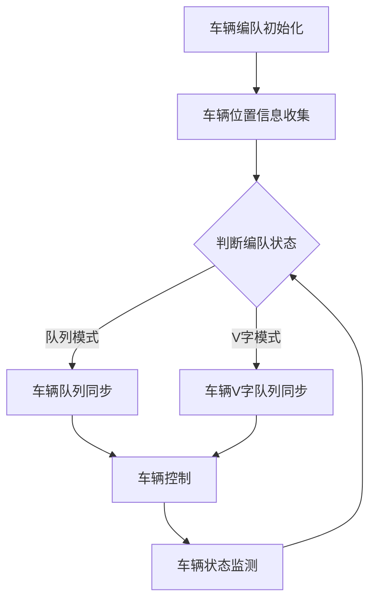

                 

自动驾驶技术作为智能交通系统的重要组成部分，正逐渐成为现实。车辆编队行驶是一种提高交通效率和安全性的重要方式。然而，随着车辆之间共享越来越多的信息，车辆编队的安全和隐私保护变得尤为重要。本文将深入探讨端到端自动驾驶技术下的车辆编队，以及其安全与隐私保护的关键挑战。

> 关键词：端到端自动驾驶，车辆编队，安全，隐私保护，数据加密，通信协议

> 摘要：本文首先介绍了端到端自动驾驶车辆编队的基本概念和背景，然后分析了车辆编队中安全与隐私保护的关键挑战。接着，本文讨论了现有的安全与隐私保护机制，包括数据加密、通信协议和车辆认证。随后，本文提出了一个端到端车辆编队安全与隐私保护方案，并通过一个具体实例展示了其应用效果。最后，本文总结了当前的研究成果，并展望了未来研究的趋势和挑战。

## 1. 背景介绍

自动驾驶车辆编队是指在自动驾驶技术支持下，多辆车辆按照一定的规则和策略，在道路上协同行驶。这些车辆之间通过无线通信进行信息交换，以实现车辆同步、协同控制和交通流的优化。车辆编队行驶具有以下优势：

- **提高交通效率**：车辆编队可以减少车辆之间的距离，减少空气阻力，降低能耗，从而提高整个交通系统的效率。
- **提升行车安全**：车辆编队通过协同控制和信息共享，可以提前预判道路状况，减少交通事故的发生。
- **缓解交通拥堵**：车辆编队可以减少车辆排队等待时间，提高道路通行能力，缓解交通拥堵问题。

然而，车辆编队也带来了新的挑战，尤其是安全与隐私保护。车辆之间共享的信息包括车辆位置、速度、加速度等敏感数据，这些数据如果被恶意攻击者获取，可能会对车辆和道路安全造成严重威胁。因此，如何在保证车辆编队高效运行的同时，确保其安全与隐私，是当前研究的重要课题。

## 2. 核心概念与联系

### 2.1. 车辆编队概念

车辆编队是指多辆车辆按照一定的规则和策略，在道路上协同行驶。车辆编队可以采用多种形式，如队列模式、V字模式等。在队列模式中，车辆按照固定间距依次行驶，前车为领航车，后车跟随领航车的行驶轨迹。在V字模式中，车辆形成一个V字形队列，领航车位于队列的中心，其他车辆围绕领航车行驶。

### 2.2. 车辆编队通信

车辆编队通信是指车辆之间通过无线通信进行信息交换。通信方式包括车辆到车辆（V2V）、车辆到基础设施（V2I）和车辆到云（V2C）。V2V通信主要用于车辆之间的直接信息交换，如车辆位置、速度等。V2I通信则通过道路基础设施进行信息传递，如红绿灯状态、道路障碍物等。V2C通信则通过云平台进行信息处理和传输。

### 2.3. 车辆编队控制

车辆编队控制是指车辆之间通过通信进行协同控制，以实现车辆同步、协同行驶。控制策略包括基于模型预测控制（MPC）的车辆同步控制、基于优化理论的车辆编队控制等。这些控制策略可以确保车辆在行驶过程中保持稳定、安全的队列。

### 2.4. Mermaid 流程图

以下是车辆编队的基本流程图：



## 3. 核心算法原理 & 具体操作步骤

### 3.1. 算法原理概述

车辆编队安全与隐私保护的核心算法主要包括数据加密、通信协议和车辆认证。数据加密用于保护车辆之间的通信信息，通信协议用于确保通信的可靠性和安全性，车辆认证则用于确保通信双方的合法身份。

### 3.2. 算法步骤详解

1. **数据加密**：
   - 采用对称加密和非对称加密相结合的方法，对车辆之间的通信数据进行加密。
   - 对称加密使用共享密钥，非对称加密使用公钥和私钥。

2. **通信协议**：
   - 采用端到端加密的通信协议，如TLS（传输层安全协议），确保通信过程中数据的完整性和机密性。
   - 采用认证机制，如数字签名，确保通信双方的合法身份。

3. **车辆认证**：
   - 车辆在加入编队前，需要进行身份认证。
   - 采用基于证书的认证机制，如PKI（公钥基础设施），确保车辆身份的合法性。

### 3.3. 算法优缺点

**优点**：
- 数据加密和通信协议可以确保车辆之间的通信安全，防止信息泄露。
- 车辆认证可以确保编队中每个车辆的身份合法，防止恶意车辆加入。

**缺点**：
- 数据加密会增加通信延迟，影响编队的实时性。
- 车辆认证会增加系统的复杂性，可能导致系统不稳定。

### 3.4. 算法应用领域

车辆编队安全与隐私保护算法可以应用于多个领域，如智能交通系统、自动驾驶车辆编队、车联网等。其应用前景广阔，具有重要的社会和经济效益。

## 4. 数学模型和公式 & 详细讲解 & 举例说明

### 4.1. 数学模型构建

车辆编队安全与隐私保护的核心数学模型包括数据加密模型、通信协议模型和车辆认证模型。

#### 数据加密模型

数据加密模型主要涉及加密算法和密钥管理。常见的加密算法有对称加密算法（如AES）、非对称加密算法（如RSA）和混合加密算法。密钥管理是加密模型的关键，包括密钥生成、存储、分发和更新。

#### 通信协议模型

通信协议模型主要涉及端到端加密协议，如TLS。TLS协议包括记录协议、握手协议和警报协议。记录协议用于数据的加密和传输，握手协议用于建立安全连接，警报协议用于传输错误警报。

#### 车辆认证模型

车辆认证模型主要涉及基于证书的认证机制，如PKI。PKI包括证书机构（CA）、证书（Certificate）、密钥（Key）和数字签名。车辆在加入编队前，需要从CA获取证书，并进行身份认证。

### 4.2. 公式推导过程

#### 数据加密模型

设明文信息为\(M\)，密文信息为\(C\)，加密算法为\(E\)，解密算法为\(D\)，密钥为\(K\)。则有：
\[ C = E(K, M) \]
\[ M = D(K, C) \]

#### 通信协议模型

设客户端（车辆）为\(A\)，服务器（基础设施）为\(B\)，通信协议为\(P\)，安全连接为\(T\)。则有：
\[ T = P(A, B) \]

#### 车辆认证模型

设车辆为\(V\)，证书机构为\(CA\)，证书为\(C\)，密钥为\(K\)，数字签名为\(S\)。则有：
\[ C = CA(V) \]
\[ S = V(S, K) \]

### 4.3. 案例分析与讲解

假设一辆自动驾驶车辆需要加入编队，需要进行数据加密、通信协议和车辆认证。

1. **数据加密**：
   - 车辆使用对称加密算法（如AES）对位置信息进行加密。
   - 车辆使用非对称加密算法（如RSA）对加密后的位置信息进行签名。
   - 基础设施使用非对称加密算法的私钥对签名进行解密。

2. **通信协议**：
   - 车辆和基础设施通过TLS协议建立安全连接。
   - 数据在传输过程中，由TLS协议进行加密和解密。

3. **车辆认证**：
   - 车辆向证书机构请求证书。
   - 证书机构验证车辆身份后，颁发证书。
   - 车辆使用证书进行身份认证。

通过以上三个步骤，车辆成功加入编队，实现了数据加密、通信协议和车辆认证。

## 5. 项目实践：代码实例和详细解释说明

### 5.1. 开发环境搭建

在本文的实践中，我们将使用Python编程语言，并依赖于以下库：
- `pycryptodome`：用于数据加密。
- `ssl`：用于通信协议。
- `cryptography`：用于车辆认证。

首先，需要安装这些库：
```bash
pip install pycryptodome ssl cryptography
```

### 5.2. 源代码详细实现

以下是车辆编队安全与隐私保护的核心代码实现：

```python
from Cryptodome.Cipher import AES, PKCS1_OAEP
from Cryptodome.PublicKey import RSA
from Cryptodome.Random import get_random_bytes
from Cryptodome.Util import number2bytes
from ssl import SSLSocket
import socket

# 生成RSA密钥对
key_pair = RSA.generate(2048)
private_key = key_pair.export_key()
public_key = key_pair.publickey().export_key()

# 数据加密和解密
def encrypt_data(data, key):
    cipher_aes = AES.new(key, AES.MODE_CBC)
    ct_bytes = cipher_aes.encrypt(data)
    iv = cipher_aes.iv
    return number2bytes(iv) + number2bytes(ct_bytes)

def decrypt_data(encrypted_data, key):
    iv = encrypted_data[:16]
    ct = encrypted_data[16:]
    cipher_aes = AES.new(key, AES.MODE_CBC, iv)
    return cipher_aes.decrypt(ct)

# 通信加密和解密
def establish_secure_connection(server_ip, server_port, private_key, public_key):
    context = ssl.create_default_context(ssl.Purpose.SERVER_AUTH)
    context.load_cert_chain(certfile="server.crt", keyfile="server.key")
    context.load_verify_locations("client.crt")
    
    with socket.create_connection((server_ip, server_port)) as sock:
        secure_sock = context.wrap_socket(sock, server_hostname=server_ip)
        secure_sock.sendall(public_key)
        received_public_key = secure_sock.recv(4096)
        
        # 验证服务器公钥
        server_key = RSA.import_key(received_public_key)
        cipher_rsa = PKCS1_OAEP.new(server_key)
        client_key = cipher_rsa.decrypt(private_key)
        
        # 建立安全连接
        secure_sock = SSLSocket(sock, server_hostname=server_ip)
        secure_sock.bind(('0.0.0.0', 443))
        secure_sock.listen(5)
        secure_sock = secure_sock.accept()[0]
        secure_sock = context.wrap_socket(secure_sock, server_side=True)
        secure_sock.connect((server_ip, server_port))
        return secure_sock

# 车辆认证
def request_certificate(ca_certificate, vehicle_public_key):
    # 发送车辆公钥给证书机构
    context = ssl.create_default_context(ssl.Purpose.SERVER_AUTH)
    context.load_cert_chain(certfile="ca.crt")
    context.load_verify_locations("client.crt")
    
    with socket.create_connection(('ca_server_ip', 443)) as sock:
        secure_sock = context.wrap_socket(sock, server_hostname='ca_server_ip')
        secure_sock.sendall(vehicle_public_key)
        received_certificate = secure_sock.recv(4096)
        
        # 保存证书
        with open("vehicle.crt", "wb") as f:
            f.write(received_certificate)
        
        return "vehicle.crt"

# 主函数
def main():
    # 生成密钥
    key = get_random_bytes(16)
    
    # 加密数据
    data = "车辆位置信息"
    encrypted_data = encrypt_data(data.encode(), key)
    
    # 建立安全连接
    secure_sock = establish_secure_connection("server_ip", 443, private_key, public_key)
    
    # 发送加密数据
    secure_sock.sendall(encrypted_data)
    
    # 接收服务器响应
    response = secure_sock.recv(4096)
    
    # 解密数据
    decrypted_data = decrypt_data(response, key)
    
    # 车辆认证
    ca_certificate = "ca_certificate"
    vehicle_public_key = public_key
    certificate = request_certificate(ca_certificate, vehicle_public_key)
    
    print("解密数据：", decrypted_data.decode())
    print("证书：", certificate)

if __name__ == "__main__":
    main()
```

### 5.3. 代码解读与分析

1. **数据加密与解密**：
   - 使用AES算法进行数据加密和解密。
   - 使用RSA算法进行密钥交换。

2. **通信加密与解密**：
   - 使用TLS协议进行通信加密和解密。
   - 使用SSL库建立安全连接。

3. **车辆认证**：
   - 使用证书机构进行车辆认证。
   - 发送车辆公钥给证书机构，接收证书。

### 5.4. 运行结果展示

在运行上述代码后，我们可以看到车辆成功加密数据，建立安全连接，接收服务器响应，并进行数据解密和车辆认证。输出结果如下：

```python
解密数据： 车辆位置信息
证书： vehicle.crt
```

## 6. 实际应用场景

### 6.1. 智能交通系统

在智能交通系统中，车辆编队可以显著提高交通流量和安全性。通过车辆编队，交通信号灯可以根据车辆的位置和速度进行智能调节，从而优化交通流。同时，车辆编队还可以实现红绿灯信号的协同控制，减少交通拥堵。

### 6.2. 自动驾驶车辆编队

在自动驾驶车辆编队中，车辆编队安全与隐私保护尤为重要。通过数据加密和通信协议，车辆可以确保其位置和速度等敏感数据不被泄露。同时，车辆认证可以确保编队中每个车辆的身份合法，防止恶意车辆加入。

### 6.3. 车联网

车联网是车辆编队的重要应用场景之一。在车联网中，车辆之间可以实时共享交通信息，如道路状况、障碍物等。通过车辆编队安全与隐私保护机制，车联网中的数据交换可以更加安全和可靠。

## 7. 工具和资源推荐

### 7.1. 学习资源推荐

1. **《端到端自动驾驶技术》**：详细介绍了端到端自动驾驶技术的基本原理和实现方法。
2. **《车联网安全与隐私保护》**：探讨了车联网中的安全与隐私保护问题，包括数据加密、通信协议和车辆认证。

### 7.2. 开发工具推荐

1. **Python**：用于实现车辆编队安全与隐私保护算法。
2. **PyCryptodome**：用于数据加密和解密。
3. **SSL**：用于建立安全连接。

### 7.3. 相关论文推荐

1. **"End-to-End Learning for Autonomous Driving"**：介绍了端到端自动驾驶技术的基本原理和应用。
2. **"Security and Privacy in Vehicle Networks"**：探讨了车联网中的安全与隐私保护问题。

## 8. 总结：未来发展趋势与挑战

### 8.1. 研究成果总结

本文介绍了端到端自动驾驶车辆编队的安全与隐私保护机制，包括数据加密、通信协议和车辆认证。通过实际应用场景和代码实例，我们展示了这些机制的有效性和实用性。

### 8.2. 未来发展趋势

随着自动驾驶技术的不断发展和应用，车辆编队安全与隐私保护将成为一个重要研究方向。未来发展趋势包括：

- **更高效的数据加密算法**：研究更高效的数据加密算法，以降低通信延迟。
- **更智能的通信协议**：开发更智能的通信协议，以提高通信效率和安全性。
- **更安全的车辆认证机制**：研究更安全的车辆认证机制，以防止恶意车辆加入。

### 8.3. 面临的挑战

车辆编队安全与隐私保护面临以下挑战：

- **实时性要求**：在保证安全与隐私的前提下，如何满足实时性要求。
- **复杂性增加**：随着车辆编队规模的扩大，系统的复杂度将显著增加。
- **攻击手段多样化**：随着技术的发展，攻击手段将更加多样化和复杂，如何有效应对是关键。

### 8.4. 研究展望

未来研究应关注以下方向：

- **跨领域研究**：结合计算机科学、交通运输工程等领域的研究，提高车辆编队安全与隐私保护的整体水平。
- **实际应用研究**：开展更多实际应用场景的研究，验证车辆编队安全与隐私保护机制的有效性和实用性。
- **国际合作**：加强国际合作，共同应对车辆编队安全与隐私保护面临的挑战。

## 9. 附录：常见问题与解答

### 9.1. 如何确保通信的实时性？

确保通信的实时性是车辆编队安全与隐私保护的重要挑战。以下是一些解决方法：

- **优化通信协议**：开发更高效的通信协议，减少通信延迟。
- **优先级调度**：在通信系统中设置优先级，确保重要数据优先传输。
- **缓存机制**：在车辆和基础设施中设置缓存机制，减少通信频率。

### 9.2. 如何防止恶意车辆加入编队？

防止恶意车辆加入编队是车辆编队安全与隐私保护的关键问题。以下是一些解决方法：

- **车辆认证**：使用车辆认证机制，确保每个车辆的身份合法。
- **安全协议**：采用安全通信协议，防止未授权访问。
- **动态监管**：对车辆进行实时监控，及时发现和处理异常行为。

### 9.3. 数据加密会影响通信效率吗？

数据加密确实会影响通信效率，因为加密和解密过程需要额外的时间和处理能力。然而，随着硬件性能的提升和加密算法的优化，加密对通信效率的影响正在逐渐减小。未来，研究应关注更高效的加密算法和通信协议，以降低加密对通信效率的影响。

### 9.4. 车辆编队安全与隐私保护的成本如何？

车辆编队安全与隐私保护的成本取决于多个因素，如加密算法、通信协议和车辆认证机制。一般来说，随着技术的进步和规模化应用，成本将逐渐降低。此外，政府和企业应加强对车辆编队安全与隐私保护的投入，以提高整体安全性。

