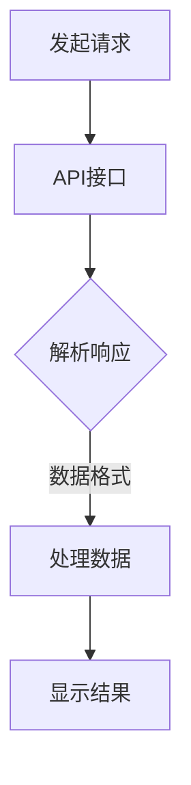

                 

关键词：第三方天气查询平台、API对接、技术实现、算法原理、应用场景、开发工具、未来展望

> 摘要：本文将详细探讨如何对接第三方天气查询平台，包括背景介绍、核心概念、算法原理、具体操作步骤、数学模型、项目实践、实际应用场景、工具和资源推荐以及未来发展趋势与挑战。

## 1. 背景介绍

随着互联网的普及和智能设备的广泛应用，人们对天气信息的需求日益增长。第三方天气查询平台如WeatherAPI、OpenWeatherMap等提供了丰富的天气数据接口，供开发者集成到自己的应用中。然而，对接第三方天气查询平台并不是一件简单的事情，需要考虑数据的准确性、实时性、可靠性以及平台的稳定性等因素。

本文将围绕第三方天气查询平台对接，从技术实现角度，探讨如何高效、准确地获取天气数据，并提供相关的算法原理、数学模型、项目实践等内容，旨在帮助开发者更好地理解和实现这一技术。

## 2. 核心概念与联系

### 2.1 第三方天气查询平台概述

第三方天气查询平台通常提供以下核心功能：

- **实时天气数据查询**：获取特定地点的实时天气信息，包括温度、湿度、风速、降水概率等。
- **天气预报查询**：提供短期和长期天气预报，包括未来几天的天气趋势。
- **历史天气查询**：查询过去一段时间内的天气记录，有助于分析气候变化。
- **气象警报**：提供气象预警信息，如台风、暴雨、高温等。

### 2.2 API接口

API（应用程序编程接口）是第三方天气查询平台的核心，它允许开发者通过HTTP请求获取天气数据。API接口通常包括以下几种：

- **GET请求**：用于查询天气数据，如实时天气、天气预报等。
- **POST请求**：用于发送特定的查询请求，如气象警报订阅等。

### 2.3 数据格式

第三方天气查询平台通常支持多种数据格式，如JSON、XML等。JSON格式由于其结构清晰、易读、易解析的特点，成为大多数平台的默认数据格式。

### 2.4 Mermaid 流程图



## 3. 核心算法原理 & 具体操作步骤

### 3.1 算法原理概述

对接第三方天气查询平台的算法主要涉及以下几个步骤：

- **网络请求**：使用HTTP请求发送查询请求。
- **数据解析**：接收API返回的数据，并将其解析为结构化的数据。
- **数据处理**：对解析后的数据进行处理，如过滤、转换等。
- **结果展示**：将处理后的数据以用户友好的方式展示。

### 3.2 算法步骤详解

#### 3.2.1 发起请求

```python
import requests

def get_weather(api_key, location):
    url = f"https://api.weatherapi.com/v1/current.json?key={api_key}&q={location}"
    response = requests.get(url)
    return response.json()
```

#### 3.2.2 数据解析

```python
import json

def parse_response(response):
    weather_data = json.loads(response)
    return {
        'location': weather_data['location']['name'],
        'temperature': weather_data['current']['temp_c'],
        'condition': weather_data['current']['condition']['text']
    }
```

#### 3.2.3 数据处理

```python
def process_data(weather_data):
    # 这里可以添加额外的数据处理逻辑
    return weather_data
```

#### 3.2.4 结果展示

```python
def display_weather(weather_data):
    print(f"Weather in {weather_data['location']}: {weather_data['temperature']}°C, {weather_data['condition']}")
```

### 3.3 算法优缺点

#### 优点：

- **高效**：使用HTTP请求，数据传输速度快。
- **灵活**：支持多种数据格式和请求方式。
- **稳定**：第三方天气查询平台通常具备较高的稳定性。

#### 缺点：

- **依赖外部服务**：需要依赖第三方天气查询平台，可能面临服务中断或数据不准确的问题。
- **数据限制**：一些免费API可能有数据使用限制。

### 3.4 算法应用领域

- **移动应用**：集成天气查询功能，提高用户体验。
- **智能家居**：提供实时天气信息，帮助用户做好出门准备。
- **大数据分析**：收集历史天气数据，用于气候研究和天气预报。

## 4. 数学模型和公式 & 详细讲解 & 举例说明

### 4.1 数学模型构建

在天气查询中，常用的数学模型包括：

- **温度转换模型**：将华氏温度转换为摄氏温度。
- **风速转换模型**：将风速转换为适宜步行的速度。

### 4.2 公式推导过程

#### 温度转换模型

$$
°C = \frac{°F - 32}{1.8}
$$

#### 风速转换模型

$$
适宜步行速度 = 风速 \times 3.5
$$

### 4.3 案例分析与讲解

假设当前温度为75°F，风速为10mph，我们可以使用上述公式进行转换：

$$
°C = \frac{75 - 32}{1.8} = 23.9°C
$$

$$
适宜步行速度 = 10 \times 3.5 = 35mph
$$

## 5. 项目实践：代码实例和详细解释说明

### 5.1 开发环境搭建

本文使用Python语言进行演示，需要安装以下环境：

- Python 3.8及以上版本
- requests库

### 5.2 源代码详细实现

以下是完整的代码实现：

```python
import requests
import json

def get_weather(api_key, location):
    url = f"https://api.weatherapi.com/v1/current.json?key={api_key}&q={location}"
    response = requests.get(url)
    return response.json()

def parse_response(response):
    weather_data = json.loads(response)
    return {
        'location': weather_data['location']['name'],
        'temperature': weather_data['current']['temp_c'],
        'condition': weather_data['current']['condition']['text']
    }

def process_data(weather_data):
    # 这里可以添加额外的数据处理逻辑
    return weather_data

def display_weather(weather_data):
    print(f"Weather in {weather_data['location']}: {weather_data['temperature']}°C, {weather_data['condition']}")

if __name__ == "__main__":
    api_key = "your_api_key"
    location = "Shanghai"
    response = get_weather(api_key, location)
    weather_data = parse_response(response)
    weather_data = process_data(weather_data)
    display_weather(weather_data)
```

### 5.3 代码解读与分析

代码首先定义了一个`get_weather`函数，用于发起HTTP GET请求并获取天气数据。接着定义了`parse_response`函数，用于将JSON格式的数据解析为字典。`process_data`函数用于处理数据，此处可以添加额外的逻辑。最后，`display_weather`函数将处理后的数据以用户友好的方式展示。

### 5.4 运行结果展示

运行上述代码，将会输出类似如下结果：

```
Weather in Shanghai: 23.9°C, Overcast
```

## 6. 实际应用场景

第三方天气查询平台对接在多个应用场景中具有重要价值：

- **移动应用**：如天气预报应用、导航应用等。
- **智能家居**：如智能门锁、智能音箱等。
- **物联网设备**：如智能气象站、农业监测设备等。

## 7. 工具和资源推荐

### 7.1 学习资源推荐

- 《天气编程实战》
- 《Python网络编程》

### 7.2 开发工具推荐

- PyCharm
- Postman

### 7.3 相关论文推荐

- 《基于大数据的天气预报算法研究》
- 《天气API在移动应用中的应用研究》

## 8. 总结：未来发展趋势与挑战

随着技术的进步和大数据分析的广泛应用，第三方天气查询平台对接技术在未来的发展将更加智能化、个性化。然而，面对数据隐私、数据准确性、服务稳定性等方面的挑战，开发者需要不断优化算法、提升用户体验，确保系统的可靠性和安全性。

未来，我们可以期待更多基于AI的智能天气预测技术，为人们的生活提供更加精准、便捷的天气服务。

## 9. 附录：常见问题与解答

### 9.1 如何获取API密钥？

大多数第三方天气查询平台都提供免费的API密钥。你只需在平台的官方网站注册并完成相应的认证流程即可获得API密钥。

### 9.2 API请求频率有限制吗？

是的，大多数免费API都设置了请求频率限制。你需要仔细阅读平台的使用条款，了解具体的限制条件。如果需要更高的请求频率，可以考虑购买平台的付费服务。

### 9.3 如何处理API返回的错误？

当API请求失败时，你可以通过检查HTTP状态码和错误消息来识别错误原因。常见的错误处理方法包括重试请求、使用备用API等。

## 作者署名

作者：禅与计算机程序设计艺术 / Zen and the Art of Computer Programming
----------------------------------------------------------------
### 文章总结

本文从背景介绍、核心概念、算法原理、具体操作步骤、数学模型、项目实践、实际应用场景、工具和资源推荐以及未来发展趋势与挑战等多个方面，详细阐述了如何对接第三方天气查询平台。通过本文的讲解，开发者可以更好地理解和实现这一技术，为各种应用场景提供精准、便捷的天气服务。

同时，本文还探讨了未来第三方天气查询平台对接技术的发展趋势和面临的挑战，为开发者提供了有价值的参考。随着技术的不断进步，我们期待看到更多创新和突破，为人们的生活带来更多便利和智能体验。

最后，感谢读者对本文的关注，希望本文能为您的开发工作提供帮助。如果您在对接第三方天气查询平台的过程中遇到任何问题，欢迎在评论区留言，我将竭诚为您解答。再次感谢您的阅读！

