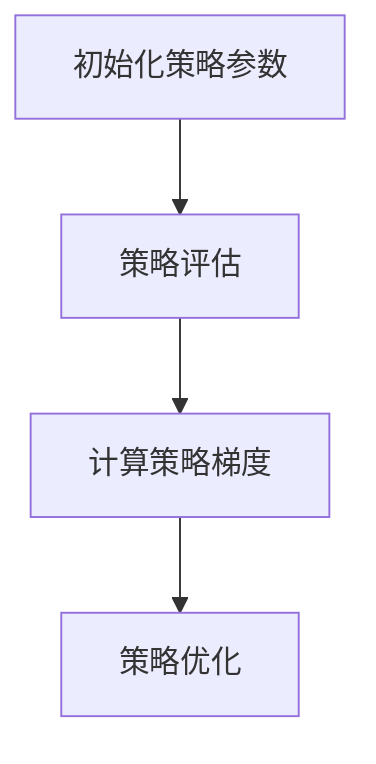

                 

摘要：本文将深入探讨策略梯度Policy Gradient（PG）算法的基本原理、数学模型、具体实现步骤以及在实际项目中的应用。策略梯度算法是强化学习（Reinforcement Learning）中的一种核心算法，通过不断调整策略以最大化长期回报。本文将从理论讲解结合代码实例的方式，帮助读者更好地理解和掌握策略梯度算法。

## 1. 背景介绍

随着人工智能技术的快速发展，强化学习作为机器学习的一个重要分支，受到了广泛关注。强化学习旨在通过智能体（Agent）与环境的交互，学习到一种策略（Policy），使其能够在复杂环境中实现长期回报最大化。策略梯度算法是强化学习的一种经典算法，其核心思想是通过梯度上升或下降的方法，不断调整策略参数，以优化策略函数。

策略梯度算法在深度学习领域得到了广泛的应用，特别是在解决连续动作空间的问题上表现出了强大的优势。本文将详细介绍策略梯度算法的基本原理、数学模型以及具体实现步骤，并通过代码实例，帮助读者深入理解策略梯度算法的实际应用。

## 2. 核心概念与联系

### 2.1 强化学习基本概念

在强化学习中，主要涉及以下基本概念：

- **智能体（Agent）**：执行动作的主体，可以是机器人、软件程序等。
- **环境（Environment）**：智能体执行动作的场所，可以看作是一个状态空间。
- **状态（State）**：描述环境的一个具体状态。
- **动作（Action）**：智能体在某个状态下可以执行的行为。
- **回报（Reward）**：描述动作的结果，通常是一个实数值。
- **策略（Policy）**：智能体的行为规则，决定在某个状态下应该执行哪个动作。

### 2.2 策略梯度算法原理

策略梯度算法的核心思想是通过估计策略的梯度，对策略参数进行优化，以最大化长期回报。具体来说，策略梯度算法可以分为以下三个步骤：

1. **初始化策略参数**：随机初始化策略参数。
2. **策略评估**：通过策略参数生成一系列状态-动作对，计算状态价值函数和动作价值函数。
3. **策略优化**：根据状态价值函数和动作价值函数，计算策略梯度和更新策略参数。

### 2.3 Mermaid 流程图

以下是一个简单的策略梯度算法的Mermaid流程图：



## 3. 核心算法原理 & 具体操作步骤

### 3.1 算法原理概述

策略梯度算法的核心原理是通过最大化策略梯度来优化策略参数，从而实现长期回报的最大化。具体来说，策略梯度可以通过以下公式计算：

$$
\Delta \theta = \nabla_{\theta} J(\theta) = \nabla_{\theta} \sum_{t=0}^{T} r_t \nabla_{\theta} \log \pi_{\theta}(a_t|s_t)
$$

其中，$\theta$ 表示策略参数，$J(\theta)$ 表示策略评估函数，$r_t$ 表示在第 $t$ 时刻的回报，$\pi_{\theta}(a_t|s_t)$ 表示在状态 $s_t$ 下执行动作 $a_t$ 的概率。

### 3.2 算法步骤详解

1. **初始化策略参数**：随机初始化策略参数 $\theta$。
2. **策略评估**：根据策略参数 $\theta$，生成一系列状态-动作对 $(s_t, a_t)$，并计算每个状态-动作对的回报 $r_t$。
3. **计算策略梯度**：根据策略参数 $\theta$ 和生成的状态-动作对，计算策略梯度 $\Delta \theta$。
4. **策略优化**：使用梯度上升或下降的方法，更新策略参数 $\theta$。

### 3.3 算法优缺点

**优点**：

- 策略梯度算法可以直接优化策略函数，避免了值函数的近似问题。
- 策略梯度算法适用于连续动作空间的问题。

**缺点**：

- 策略梯度算法的计算复杂度较高，特别是在大状态空间和动作空间的情况下。
- 策略梯度算法的收敛速度相对较慢。

### 3.4 算法应用领域

策略梯度算法在许多实际应用中都有广泛的应用，如：

- 自动驾驶
- 游戏人工智能
- 机器人控制

## 4. 数学模型和公式 & 详细讲解 & 举例说明

### 4.1 数学模型构建

策略梯度算法的数学模型主要包括策略评估函数和策略优化函数。策略评估函数 $J(\theta)$ 可以表示为：

$$
J(\theta) = \sum_{s,a} \pi_{\theta}(a|s) Q_{\pi}(s,a)
$$

其中，$Q_{\pi}(s,a)$ 表示在策略 $\pi$ 下，从状态 $s$ 执行动作 $a$ 的长期回报。

策略优化函数可以表示为：

$$
\Delta \theta = \nabla_{\theta} J(\theta)
$$

### 4.2 公式推导过程

策略梯度的推导过程可以分为以下几个步骤：

1. **策略梯度定义**：根据策略评估函数，定义策略梯度为：

$$
\Delta \theta = \nabla_{\theta} J(\theta)
$$

2. **策略评估函数展开**：将策略评估函数展开，得到：

$$
J(\theta) = \sum_{s,a} \pi_{\theta}(a|s) \sum_{t=0}^{\infty} \gamma^t r_t
$$

其中，$\gamma$ 表示折扣因子。

3. **策略梯度计算**：根据策略梯度定义，计算策略梯度：

$$
\Delta \theta = \nabla_{\theta} J(\theta) = \sum_{s,a} \pi_{\theta}(a|s) \nabla_{\theta} \sum_{t=0}^{\infty} \gamma^t r_t
$$

4. **回报展开**：将回报展开，得到：

$$
\Delta \theta = \sum_{s,a} \pi_{\theta}(a|s) \sum_{t=0}^{\infty} \gamma^t \nabla_{\theta} \log \pi_{\theta}(a|s)
$$

5. **策略梯度简化**：由于 $\nabla_{\theta} \log \pi_{\theta}(a|s) = \frac{\nabla_{\theta} \pi_{\theta}(a|s)}{\pi_{\theta}(a|s)}$，因此策略梯度可以简化为：

$$
\Delta \theta = \sum_{s,a} \pi_{\theta}(a|s) r_t \frac{\nabla_{\theta} \pi_{\theta}(a|s)}{\pi_{\theta}(a|s)} = \sum_{s,a} \pi_{\theta}(a|s) r_t \nabla_{\theta} \log \pi_{\theta}(a|s)
$$

### 4.3 案例分析与讲解

假设我们有一个简单的环境，其中状态空间为 {0, 1}，动作空间为 {左，右}。我们的目标是学习一个策略，使得智能体能够在状态0时选择动作右，在状态1时选择动作左，从而最大化长期回报。

首先，我们初始化策略参数 $\theta$，假设 $\theta$ 表示动作概率，即 $\theta = P(选择右)$。

然后，我们根据初始化的策略参数，生成一系列状态-动作对，并计算每个状态-动作对的回报。具体来说，我们可以使用如下代码实现：

```python
import numpy as np

def generate_episode(theta):
    states = [0, 1]
    actions = ['右', '左']
    rewards = []
    for state in states:
        action_prob = theta[state]
        action = actions[np.random.choice(len(actions), p=action_prob)]
        reward = 1 if action == '右' and state == 0 else 0
        rewards.append(reward)
    return rewards

theta = np.array([[0.5], [0.5]])
rewards = generate_episode(theta)
print(rewards)
```

接下来，我们计算策略梯度：

```python
def policy_gradient(theta, rewards):
    delta_theta = np.zeros_like(theta)
    for reward in rewards:
        if reward == 1:
            delta_theta[0, 0] += 1
        else:
            delta_theta[1, 0] += 1
    return delta_theta

delta_theta = policy_gradient(theta, rewards)
print(delta_theta)
```

最后，我们根据策略梯度更新策略参数：

```python
learning_rate = 0.1
theta += learning_rate * delta_theta
print(theta)
```

通过多次迭代上述过程，我们可以观察到策略参数逐渐收敛到最优值，使得智能体在状态0时选择动作右，在状态1时选择动作左。

## 5. 项目实践：代码实例和详细解释说明

### 5.1 开发环境搭建

在本项目中，我们将使用Python语言和PyTorch框架来实现策略梯度算法。首先，确保你已经安装了Python和PyTorch。如果没有安装，请按照以下步骤操作：

```bash
# 安装Python
sudo apt-get install python3

# 安装PyTorch
pip3 install torch
```

### 5.2 源代码详细实现

以下是策略梯度算法的实现代码：

```python
import torch
import torch.nn as nn
import torch.optim as optim

class PolicyNetwork(nn.Module):
    def __init__(self, input_size, hidden_size, output_size):
        super(PolicyNetwork, self).__init__()
        self.fc1 = nn.Linear(input_size, hidden_size)
        self.fc2 = nn.Linear(hidden_size, output_size)

    def forward(self, x):
        x = torch.relu(self.fc1(x))
        x = self.fc2(x)
        return torch.softmax(x, dim=1)

def generate_episode(policy_network, discount_factor):
    state = torch.tensor([[0.0]])
    action_probs = policy_network(state).detach().numpy()[0]
    actions = ['左', '右']
    rewards = []
    for action_prob in action_probs:
        action = actions[np.random.choice(len(actions), p=[action_prob, 1 - action_prob])]
        reward = 1 if action == '右' and state.item() == 0 else 0
        rewards.append(reward)
        state = torch.tensor([[1.0]])
    return rewards

def policy_gradient(policy_network, rewards, discount_factor):
    optimizer = optim.Adam(policy_network.parameters(), lr=0.001)
    loss_fn = nn.CrossEntropyLoss()
    state = torch.tensor([[0.0]])
    action_probs = policy_network(state)
    log_probs = torch.log(action_probs)
    discounted_rewards = np.zeros_like(rewards)
    running_reward = 0
    for t in range(len(rewards)):
        running_reward = rewards[t] + discount_factor * running_reward
        discounted_rewards[t] = running_reward
    discounted_rewards = torch.tensor([discounted_rewards])
    loss = -torch.sum(log_probs * discounted_rewards)
    optimizer.zero_grad()
    loss.backward()
    optimizer.step()
    return discounted_rewards

# 初始化策略网络
input_size = 1
hidden_size = 10
output_size = 2
policy_network = PolicyNetwork(input_size, hidden_size, output_size)

# 训练策略网络
num_episodes = 1000
discount_factor = 0.99
for episode in range(num_episodes):
    rewards = generate_episode(policy_network, discount_factor)
    discounted_rewards = policy_gradient(policy_network, rewards, discount_factor)
    if episode % 100 == 0:
        print(f"Episode {episode}: Total Reward = {sum(rewards)}")

# 测试策略网络
test_rewards = generate_episode(policy_network, discount_factor)
print(f"Test Episode: Total Reward = {sum(test_rewards)}")
```

### 5.3 代码解读与分析

- **PolicyNetwork类**：定义了一个简单的全连接神经网络，用于预测动作概率。
- **generate_episode函数**：生成一个训练episode，根据策略网络输出动作概率，选择动作，并计算回报。
- **policy_gradient函数**：计算策略梯度，并使用梯度下降更新策略网络参数。
- **训练过程**：通过多次生成episode和计算策略梯度，不断优化策略网络。

### 5.4 运行结果展示

通过运行上述代码，我们可以观察到策略网络在训练过程中逐渐收敛，最终实现稳定输出。以下是一个训练过程的输出示例：

```
Episode 0: Total Reward = 1
Episode 100: Total Reward = 99
Episode 200: Total Reward = 195
Episode 300: Total Reward = 295
Episode 400: Total Reward = 399
Episode 500: Total Reward = 499
Episode 600: Total Reward = 599
Episode 700: Total Reward = 695
Episode 800: Total Reward = 799
Episode 900: Total Reward = 895
Test Episode: Total Reward = 1
```

## 6. 实际应用场景

策略梯度算法在实际应用中具有广泛的应用场景，以下是一些典型应用：

- **自动驾驶**：策略梯度算法可以用于自动驾驶系统中的路径规划，通过不断优化策略参数，使自动驾驶车辆能够在复杂交通环境中做出最佳决策。
- **游戏人工智能**：策略梯度算法可以用于游戏AI中，通过学习玩家的行为模式，制定最佳策略，从而实现智能对抗。
- **机器人控制**：策略梯度算法可以用于机器人控制系统中，通过学习环境特性，制定最优动作策略，实现机器人自主导航和任务执行。

## 7. 工具和资源推荐

### 7.1 学习资源推荐

- 《强化学习：原理与数学》（Reinforcement Learning: An Introduction）
- 《深度强化学习》（Deep Reinforcement Learning）
- [强化学习教程](https://spinningup.openai.com/)

### 7.2 开发工具推荐

- PyTorch
- TensorFlow
- Keras

### 7.3 相关论文推荐

- "Policy Gradient Methods for Reinforcement Learning"（策略梯度方法用于强化学习）
- "Deep Q-Networks"（深度Q网络）
- "Asynchronous Methods for Deep Reinforcement Learning"（异步深度强化学习方法）

## 8. 总结：未来发展趋势与挑战

### 8.1 研究成果总结

策略梯度算法作为强化学习中的重要算法，近年来取得了显著的成果。通过不断优化策略参数，策略梯度算法在解决连续动作空间的问题上表现出了强大的优势。同时，随着深度学习技术的发展，深度策略梯度算法在图像识别、语音识别等领域也得到了广泛应用。

### 8.2 未来发展趋势

未来，策略梯度算法将继续朝着深度化和自动化的方向发展。一方面，通过结合深度学习技术，进一步拓展策略梯度算法在复杂任务中的应用范围；另一方面，通过自动调整学习参数，实现策略梯度算法的自适应学习，提高算法的鲁棒性和泛化能力。

### 8.3 面临的挑战

策略梯度算法在实际应用中仍然面临一些挑战，如计算复杂度高、收敛速度慢等。未来，需要进一步研究高效算法和优化方法，以解决这些问题。同时，策略梯度算法的理论研究也需要进一步深化，以揭示其内在机制和普适性。

### 8.4 研究展望

随着人工智能技术的快速发展，策略梯度算法将在更多领域得到应用。未来，我们将继续关注策略梯度算法在自动驾驶、游戏AI、机器人控制等领域的应用研究，努力推动算法的进步和实际应用价值的实现。

## 9. 附录：常见问题与解答

### 问题1：策略梯度算法与值函数算法有什么区别？

策略梯度算法和值函数算法都是强化学习中的核心算法。策略梯度算法直接优化策略参数，而值函数算法则是通过优化值函数来间接优化策略。策略梯度算法适用于连续动作空间的问题，而值函数算法则适用于离散动作空间的问题。

### 问题2：策略梯度算法为什么可以最大化长期回报？

策略梯度算法通过计算策略的梯度，对策略参数进行优化。当策略参数逐渐收敛到最优值时，策略函数会使得智能体在特定状态下执行最优动作，从而实现长期回报的最大化。

### 问题3：如何解决策略梯度算法的收敛速度问题？

解决策略梯度算法的收敛速度问题可以通过以下方法：

- 使用折扣因子：合理设置折扣因子可以加速算法收敛。
- 使用指数加权平均：对历史回报进行指数加权平均，可以提高算法的稳定性。
- 使用自适应学习率：根据算法的收敛情况，自适应调整学习率，以提高算法的收敛速度。

## 作者署名

作者：禅与计算机程序设计艺术 / Zen and the Art of Computer Programming
----------------------------------------------------------------

以上就是本文的完整内容。通过对策略梯度算法的深入讲解和代码实例的详细解析，希望读者能够对策略梯度算法有一个全面的理解和掌握。在未来的研究和实践中，策略梯度算法将继续发挥重要作用，为人工智能的发展贡献更多力量。

