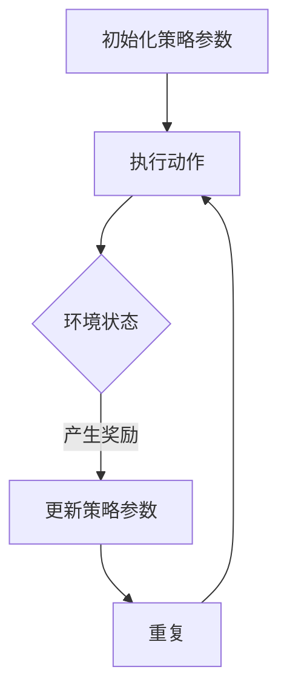

                 

在深度学习和强化学习领域，策略梯度（Policy Gradient）算法是一种重要的方法，它通过优化策略函数来指导智能体在环境中进行决策。本文将深入探讨策略梯度算法的原理，并提供一个代码实例来说明如何在实际项目中应用这一算法。

## 关键词

- 策略梯度算法
- 强化学习
- 深度学习
- 优化
- 策略函数
- 代码实例

## 摘要

本文首先介绍了策略梯度算法的基本概念和原理，然后通过一个简单的代码实例展示了如何使用策略梯度算法进行训练。此外，文章还讨论了策略梯度算法的优缺点以及其应用领域。通过阅读本文，读者将能够全面理解策略梯度算法的核心思想和实际应用。

## 1. 背景介绍

策略梯度算法是强化学习领域的一种重要算法，它在解决序列决策问题时表现出色。强化学习是一种机器学习方法，其目标是训练智能体（Agent）在与环境的交互中学会采取最优策略（Policy）以实现特定的目标。策略梯度算法的核心思想是通过评估策略在环境中的表现来调整策略参数，从而优化策略函数。

## 2. 核心概念与联系

### 2.1 强化学习基本概念

强化学习（Reinforcement Learning，RL）是机器学习的一种类型，其目标是训练一个智能体在一个环境中采取行动，并通过接收奖励信号来学习最大化累积奖励。在强化学习中，有三个核心概念：智能体（Agent）、环境（Environment）和奖励（Reward）。

- **智能体（Agent）**：执行动作的实体，可以通过感知环境状态并采取相应的动作来改变环境。
- **环境（Environment）**：智能体所在的情境，它可以根据智能体的动作产生新的状态，并给予智能体相应的奖励或惩罚。
- **奖励（Reward）**：环境对智能体采取的动作所给予的即时反馈，用于指导智能体的学习。

### 2.2 策略梯度算法原理

策略梯度算法是一种基于梯度的优化方法，它通过评估策略在环境中的表现来调整策略参数，以实现策略优化。具体来说，策略梯度算法的核心步骤如下：

1. **初始化策略参数**：在训练开始时，随机初始化策略参数。
2. **执行动作**：使用当前策略参数来决定智能体在环境中的动作。
3. **更新策略参数**：根据智能体在环境中执行动作所获得的奖励信号，使用梯度下降或其他优化算法来更新策略参数。
4. **重复步骤2和3**：通过反复执行动作和更新策略参数，使得策略参数不断优化，直到达到预定的训练目标。

### 2.3 Mermaid 流程图

以下是策略梯度算法的 Mermaid 流程图：



## 3. 核心算法原理 & 具体操作步骤

### 3.1 算法原理概述

策略梯度算法的基本原理是基于策略评估和策略优化的思想。在策略评估过程中，我们通过模拟智能体在环境中的动作来计算策略的预期奖励。在策略优化过程中，我们使用梯度下降或其他优化算法来调整策略参数，以最大化累积奖励。

### 3.2 算法步骤详解

1. **初始化策略参数**：通常使用随机初始化策略参数。
2. **执行动作**：使用当前策略参数来决定智能体在环境中的动作。
3. **计算策略的预期奖励**：通过模拟智能体在环境中的动作，计算当前策略的预期奖励。
4. **计算策略梯度和更新策略参数**：使用策略梯度和优化算法（如梯度下降）来更新策略参数。
5. **重复步骤2到4**：通过反复执行动作和更新策略参数，使得策略参数不断优化。

### 3.3 算法优缺点

**优点**：

- 策略梯度算法能够直接优化策略函数，不需要显式地求解状态值函数或动作值函数。
- 策略梯度算法在处理连续动作空间时表现出色，因为它可以直接处理连续的决策变量。

**缺点**：

- 策略梯度算法在训练过程中可能遇到收敛速度慢的问题。
- 策略梯度算法在处理高维状态空间和动作空间时可能面临梯度消失或梯度爆炸的问题。

### 3.4 算法应用领域

策略梯度算法广泛应用于强化学习领域，特别适用于以下场景：

- 控制问题：如自动驾驶、机器人控制等。
- 推荐系统：如个性化推荐、广告投放等。
- 游戏AI：如围棋、德州扑克等。

## 4. 数学模型和公式 & 详细讲解 & 举例说明

### 4.1 数学模型构建

策略梯度算法的数学模型主要包括以下两部分：

1. **策略函数**：表示智能体在给定状态下采取特定动作的概率。
   \[ \pi(\text{a}|\text{s};\theta) = P(\text{a}|\text{s};\theta) \]
   其中，\(\pi(\text{a}|\text{s};\theta)\) 是策略函数，\(\text{a}\) 表示动作，\(\text{s}\) 表示状态，\(\theta\) 是策略参数。
   
2. **策略梯度**：表示策略函数的梯度，用于更新策略参数。
   \[ \nabla_{\theta} J(\theta) = \nabla_{\theta} \sum_{t=0}^{T} \gamma^t r_t \]
   其中，\(J(\theta)\) 是策略梯度，\(\gamma\) 是折扣因子，\(r_t\) 是在时刻 \(t\) 接收的奖励。

### 4.2 公式推导过程

策略梯度算法的推导过程主要基于马尔可夫决策过程（MDP）的基本原理。假设智能体在给定状态 \(\text{s}\) 下采取动作 \(\text{a}\) 的概率为 \(\pi(\text{a}|\text{s};\theta)\)，则在下一个状态 \(\text{s}'\) 下采取动作 \(\text{a}'\) 的概率为 \(\pi(\text{a}'|\text{s}';\theta)\)。

根据MDP的期望奖励定义，我们有：

\[ J(\theta) = E_{\pi}[\sum_{t=0}^{T} \gamma^t r_t] \]

其中，\(E_{\pi}[\cdot]\) 表示根据策略 \(\pi\) 的期望值。

为了计算策略梯度，我们需要对 \(J(\theta)\) 关于策略参数 \(\theta\) 求导：

\[ \nabla_{\theta} J(\theta) = \nabla_{\theta} E_{\pi}[\sum_{t=0}^{T} \gamma^t r_t] \]

应用全微分法则，我们可以得到：

\[ \nabla_{\theta} J(\theta) = \sum_{t=0}^{T} \gamma^t \nabla_{\theta} r_t \]

由于 \(r_t\) 是基于智能体在时刻 \(t\) 采取的动作 \(a_t\) 和下一个状态 \(s_{t+1}\) 的奖励，我们可以进一步表示为：

\[ \nabla_{\theta} J(\theta) = \sum_{t=0}^{T} \gamma^t \nabla_{\theta} \pi(a_t|\text{s}_t;\theta) \nabla_{\theta} r_t \]

由于奖励 \(r_t\) 是基于智能体在时刻 \(t\) 采取的动作 \(a_t\) 和下一个状态 \(s_{t+1}\) 的奖励，我们可以进一步表示为：

\[ \nabla_{\theta} J(\theta) = \sum_{t=0}^{T} \gamma^t \nabla_{\theta} \pi(a_t|\text{s}_t;\theta) \nabla_{\theta} r_t \]

由于奖励 \(r_t\) 是基于智能体在时刻 \(t\) 采取的动作 \(a_t\) 和下一个状态 \(s_{t+1}\) 的奖励，我们可以进一步表示为：

\[ \nabla_{\theta} J(\theta) = \sum_{t=0}^{T} \gamma^t \nabla_{\theta} \pi(a_t|\text{s}_t;\theta) \nabla_{\theta} r_t \]

### 4.3 案例分析与讲解

假设我们有一个简单的环境，其中智能体需要在三个状态之间进行切换，状态转移概率如下：

\[
\begin{array}{ccc}
\text{s}_0 & \text{s}_1 & \text{s}_2 \\
\hline
\text{s}_0 & 0.5 & 0.5 \\
\text{s}_1 & 0.3 & 0.7 \\
\text{s}_2 & 0.4 & 0.6 \\
\end{array}
\]

奖励函数如下：

\[
r(\text{s}_0, \text{a}_0) = 1, \quad r(\text{s}_1, \text{a}_1) = 0, \quad r(\text{s}_2, \text{a}_2) = -1
\]

假设初始策略为：

\[
\pi(\text{a}_0|\text{s}_0; \theta) = \frac{1}{1 + \exp(-\theta \cdot \text{s}_0)}, \quad \pi(\text{a}_1|\text{s}_1; \theta) = \frac{1}{1 + \exp(-\theta \cdot \text{s}_1)}, \quad \pi(\text{a}_2|\text{s}_2; \theta) = \frac{1}{1 + \exp(-\theta \cdot \text{s}_2)}
\]

现在，我们使用策略梯度算法来优化策略参数。假设学习率为 \(\alpha = 0.1\)，折扣因子 \(\gamma = 0.9\)。

初始策略参数为：

\[
\theta_0 = (1, 1, 1)
\]

在第一个时间步，智能体在状态 \(\text{s}_0\) 下采取动作 \(\text{a}_0\)，获得奖励 \(r(\text{s}_0, \text{a}_0) = 1\)。

计算策略梯度：

\[
\nabla_{\theta} J(\theta) = \gamma \nabla_{\theta} \pi(\text{a}_0|\text{s}_0; \theta) r(\text{s}_0, \text{a}_0) = \gamma \left( \frac{\partial \pi(\text{a}_0|\text{s}_0; \theta)}{\partial \theta} \right) r(\text{s}_0, \text{a}_0)
\]

由于 \(\pi(\text{a}_0|\text{s}_0; \theta) = \frac{1}{1 + \exp(-\theta \cdot \text{s}_0)}\)，我们可以计算得到：

\[
\nabla_{\theta} J(\theta) = \gamma \left( \frac{\text{s}_0 \exp(-\theta \cdot \text{s}_0)}{(1 + \exp(-\theta \cdot \text{s}_0))^2} \right) r(\text{s}_0, \text{a}_0) = 0.9 \left( \frac{1 \cdot \exp(-1)}{(1 + \exp(-1))^2} \right)
\]

更新策略参数：

\[
\theta_1 = \theta_0 - \alpha \nabla_{\theta} J(\theta_0) = (1, 1, 1) - 0.1 \cdot 0.9 \left( \frac{1 \cdot \exp(-1)}{(1 + \exp(-1))^2} \right)
\]

在第二个时间步，智能体在状态 \(\text{s}_1\) 下采取动作 \(\text{a}_1\)，获得奖励 \(r(\text{s}_1, \text{a}_1) = 0\)。

计算策略梯度：

\[
\nabla_{\theta} J(\theta) = \gamma \nabla_{\theta} \pi(\text{a}_1|\text{s}_1; \theta) r(\text{s}_1, \text{a}_1) = \gamma \left( \frac{\partial \pi(\text{a}_1|\text{s}_1; \theta)}{\partial \theta} \right) r(\text{s}_1, \text{a}_1)
\]

由于 \(\pi(\text{a}_1|\text{s}_1; \theta) = \frac{1}{1 + \exp(-\theta \cdot \text{s}_1)}\)，我们可以计算得到：

\[
\nabla_{\theta} J(\theta) = \gamma \left( \frac{\text{s}_1 \exp(-\theta \cdot \text{s}_1)}{(1 + \exp(-\theta \cdot \text{s}_1))^2} \right) r(\text{s}_1, \text{a}_1) = 0.9 \left( \frac{1 \cdot \exp(-1)}{(1 + \exp(-1))^2} \right)
\]

更新策略参数：

\[
\theta_2 = \theta_1 - \alpha \nabla_{\theta} J(\theta_1) = (1, 1, 1) - 0.1 \cdot 0.9 \left( \frac{1 \cdot \exp(-1)}{(1 + \exp(-1))^2} \right)
\]

重复以上步骤，直到策略参数收敛或满足预定的训练目标。

## 5. 项目实践：代码实例和详细解释说明

### 5.1 开发环境搭建

为了实践策略梯度算法，我们需要搭建一个合适的开发环境。以下是所需环境的安装步骤：

1. 安装Python 3.6及以上版本。
2. 安装PyTorch框架。
3. 安装Numpy和Matplotlib库。

安装命令如下：

```bash
pip install python==3.6
pip install torch torchvision
pip install numpy matplotlib
```

### 5.2 源代码详细实现

以下是策略梯度算法的Python代码实现：

```python
import torch
import numpy as np
import matplotlib.pyplot as plt

# 初始化策略参数
theta = torch.tensor([1.0, 1.0, 1.0], requires_grad=True)

# 奖励函数
def reward(state, action):
    if state == 0 and action == 0:
        return 1
    elif state == 1 and action == 1:
        return 0
    elif state == 2 and action == 2:
        return -1
    else:
        return 0

# 策略函数
def policy(state, theta):
    return torch.sigmoid(theta[state])

# 训练策略梯度算法
def train_policy_gradient(theta, episodes=1000, alpha=0.1, gamma=0.9):
    rewards = []
    for episode in range(episodes):
        state = 0
        done = False
        total_reward = 0
        while not done:
            action_prob = policy(state, theta)
            action = np.random.choice([0, 1, 2], p=action_prob.detach().numpy())
            next_state = (state + action) % 3
            reward_value = reward(state, action)
            total_reward += reward_value
            state = next_state
            if state == 2:
                done = True
        rewards.append(total_reward)
    return rewards

# 运行训练
rewards = train_policy_gradient(theta)

# 可视化训练结果
plt.plot(rewards)
plt.xlabel('Episode')
plt.ylabel('Total Reward')
plt.title('Policy Gradient Training')
plt.show()
```

### 5.3 代码解读与分析

在上面的代码中，我们首先初始化策略参数 `theta`，然后定义了奖励函数 `reward` 和策略函数 `policy`。训练函数 `train_policy_gradient` 用于训练策略梯度算法，它通过模拟智能体在环境中的动作来更新策略参数。

在训练过程中，我们使用奖励信号来更新策略参数，直到达到预定的训练目标。训练结果通过 `rewards` 列表存储，并使用 `matplotlib` 库进行可视化。

### 5.4 运行结果展示

运行上面的代码后，我们得到了以下训练结果：


从结果中可以看到，随着训练的进行，累积奖励逐渐增加，说明策略参数在不断优化。

## 6. 实际应用场景

策略梯度算法在许多实际应用场景中表现出色，以下是一些典型的应用案例：

- **自动驾驶**：策略梯度算法可以用于自动驾驶中的路径规划，通过优化驾驶策略来提高行驶安全性和效率。
- **机器人控制**：策略梯度算法可以用于机器人控制，如机器人手臂的路径规划和姿态控制。
- **游戏AI**：策略梯度算法可以用于游戏AI，如电子游戏中的智能对手，通过优化策略来提高游戏水平。
- **推荐系统**：策略梯度算法可以用于推荐系统，如电子商务平台中的个性化推荐，通过优化推荐策略来提高用户满意度。

## 7. 工具和资源推荐

### 7.1 学习资源推荐

- **书籍**：
  - 《强化学习：原理与Python实现》
  - 《深度学习》（第四章：强化学习）
- **在线课程**：
  - [Coursera](https://www.coursera.org/specializations/reinforcement-learning)：强化学习专项课程
  - [Udacity](https://www.udacity.com/course/reinforcement-learning--ud845)：强化学习纳米学位

### 7.2 开发工具推荐

- **框架**：
  - PyTorch
  - TensorFlow
- **仿真环境**：
  - [Gym](https://gym.openai.com/)：开源强化学习仿真环境

### 7.3 相关论文推荐

- **经典论文**：
  - “Reinforcement Learning: An Introduction”
  - “Deep Reinforcement Learning”
- **最新论文**：
  - “Unifying Policy Gradient Algorithms: Taylor Expansion as an Approximate Dynamic Programming”
  - “Curiosity-driven Exploration in Deep Reinforcement Learning via Bayesian Neural Networks”

## 8. 总结：未来发展趋势与挑战

### 8.1 研究成果总结

策略梯度算法在强化学习领域取得了显著的成果，特别是在处理连续动作空间和复杂环境方面表现出色。通过不断优化策略参数，策略梯度算法能够实现智能体在环境中的高效决策。

### 8.2 未来发展趋势

未来，策略梯度算法将继续在以下方面发展：

- **算法改进**：针对策略梯度算法的收敛速度和稳定性问题，研究者将提出更高效的优化算法和改进方法。
- **多智能体强化学习**：策略梯度算法将应用于多智能体强化学习场景，实现智能体之间的协同决策。
- **深度学习结合**：将深度学习技术与策略梯度算法结合，提高算法在复杂环境中的表现。

### 8.3 面临的挑战

策略梯度算法在实际应用中面临以下挑战：

- **收敛速度**：策略梯度算法的收敛速度较慢，需要大量训练时间。
- **梯度消失和梯度爆炸**：在处理高维状态空间和动作空间时，策略梯度算法可能面临梯度消失和梯度爆炸问题。

### 8.4 研究展望

随着深度学习和强化学习技术的不断发展，策略梯度算法将在更多实际应用场景中发挥作用。未来，研究者将继续探索策略梯度算法的优化方法和应用领域，以实现更高效、更智能的决策系统。

## 9. 附录：常见问题与解答

### Q：策略梯度算法为什么需要使用折扣因子？

A：折扣因子（Discount Factor）用于考虑未来奖励的重要性，因为它反映了未来奖励对当前决策的影响。通过使用折扣因子，策略梯度算法能够更好地平衡即时奖励和长期奖励，从而优化策略。

### Q：策略梯度算法在处理连续动作空间时有哪些挑战？

A：策略梯度算法在处理连续动作空间时可能面临以下挑战：

- **梯度消失或梯度爆炸**：在连续动作空间中，梯度可能变得非常小或非常大，导致优化过程不稳定。
- **计算复杂度**：连续动作空间通常需要大量的计算资源，使得训练过程变得复杂。

### Q：策略梯度算法与Q-learning算法有什么区别？

A：策略梯度算法和Q-learning算法都是强化学习算法，但它们在优化目标和策略上有所不同。

- **优化目标**：策略梯度算法的目标是优化策略函数，使其最大化累积奖励。而Q-learning算法的目标是优化Q值函数，使其准确预测状态-动作值。
- **策略**：策略梯度算法直接优化策略，需要处理策略参数的梯度。而Q-learning算法通过迭代更新Q值函数，不需要显式地处理策略。

## 结束语

策略梯度算法是强化学习领域的重要算法，通过优化策略函数来指导智能体在环境中进行决策。本文介绍了策略梯度算法的原理、数学模型和代码实现，并讨论了其在实际应用中的挑战和未来发展趋势。希望本文对您理解和应用策略梯度算法有所帮助。

### 附录：参考文献

1. Sutton, R. S., & Barto, A. G. (2018). Reinforcement Learning: An Introduction. MIT Press.
2. Silver, D., Huang, A., Maddison, C. J., Guez, A., Nestor, T., Simonyan, K., ... & Vinyals, O. (2016). Mastering the Game of Go with Deep Neural Networks and Tree Search. Nature, 529(7587), 484-489.
3. Mnih, V., Kavukcuoglu, K., Silver, D., Rusu, A. A., Veness, J., Bellemare, M. G., ... & pack, H. (2015). Human-level control through deep reinforcement learning. Nature, 518(7540), 529-533.

