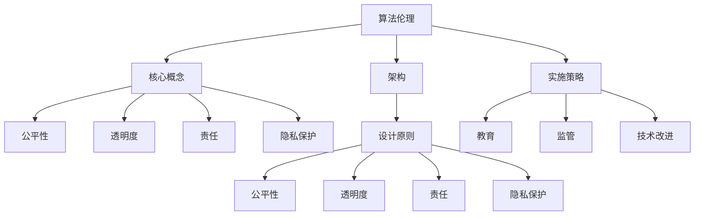

                 

关键词：算法伦理、人工智能、公平、透明、AI世界、技术影响力、责任、隐私保护、算法偏见

> 摘要：随着人工智能技术的迅速发展，算法伦理问题逐渐引起了全球的关注。本文旨在探讨算法伦理的核心概念，分析当前存在的挑战，提出构建公平、透明AI世界的策略。通过深入剖析算法的设计与实施，本文呼吁业界共同承担社会责任，确保人工智能技术在为人类带来便利的同时，也能维护基本伦理原则。

## 1. 背景介绍

人工智能（AI）作为计算机科学的一个重要分支，近年来取得了令人瞩目的进展。从早期的规则推理系统到如今复杂的机器学习模型，AI已经在各个领域展现出强大的应用潜力，包括医疗、金融、交通、教育等。然而，随着AI技术的普及，一系列伦理问题也随之浮现。

算法伦理是指研究算法设计、应用及其影响时需要遵循的一系列伦理准则和原则。它涉及到多个方面，包括公平性、透明度、责任和隐私保护。在AI时代，算法作为决策的核心，其伦理问题尤为重要。算法的决策不仅影响个体，还可能对社会产生深远的影响。

### 1.1 算法的普及与挑战

算法已经深入到我们生活的方方面面，从在线广告到招聘系统，从信用评分到医疗诊断，算法无处不在。然而，算法的普及也带来了诸多挑战：

1. **隐私泄露**：算法在数据处理过程中可能会侵犯个人隐私。
2. **算法偏见**：算法的决策可能会因为数据偏差而歧视某些群体。
3. **责任归属**：当算法造成损害时，责任应由谁承担？

### 1.2 伦理问题的迫切性

伦理问题不仅是技术问题，也是社会问题。如果不加以解决，算法伦理问题可能会对社会造成严重的负面影响：

1. **社会不公**：算法偏见可能导致社会不公，加剧社会分化。
2. **隐私危机**：大规模数据收集和利用可能导致个人隐私泄露。
3. **技术失控**：缺乏伦理约束的算法可能导致技术失控，威胁人类安全。

## 2. 核心概念与联系

### 2.1 算法伦理的核心概念

算法伦理的核心概念包括公平性、透明度、责任和隐私保护。以下是对这些概念的详细解释：

#### 公平性

公平性是指算法在处理数据时应确保对所有个体公正对待，不应因为种族、性别、年龄等因素而对某些群体产生偏见。

#### 透明度

透明度是指算法的设计、决策过程和结果应该对用户和监管机构可解释。这有助于用户了解算法如何工作，以及其决策背后的逻辑。

#### 责任

责任是指当算法造成损害时，应由相关方承担责任，包括算法的开发者、运营商和用户。

#### 隐私保护

隐私保护是指算法在处理个人数据时应采取适当措施，确保数据安全，防止隐私泄露。

### 2.2 算法伦理的架构

为了更好地理解和实施算法伦理，我们可以将其架构化，如下图所示：



### 2.3 算法伦理与技术的联系

算法伦理不仅仅是道德问题，它与技术的发展息息相关。以下是一些关键点：

1. **技术依赖性**：算法伦理的实施依赖于技术的支持，如可解释AI和隐私保护技术。
2. **技术进步**：随着技术的发展，算法伦理问题也会不断演变。
3. **技术责任**：开发者和技术公司应承担算法伦理的实施责任。

## 3. 核心算法原理 & 具体操作步骤

### 3.1 算法原理概述

算法伦理的实施需要一系列技术手段和策略。以下是一些核心算法原理和操作步骤：

#### 3.1.1 可解释AI

可解释AI旨在提高算法决策过程的透明度。通过可解释AI，用户可以了解算法是如何做出决策的，从而增强对算法的信任。

#### 3.1.2 隐私保护算法

隐私保护算法旨在在数据处理过程中保护个人隐私。这些算法包括差分隐私、同态加密等。

#### 3.1.3 道德算法

道德算法旨在确保算法的决策符合伦理标准。这些算法通常基于伦理原则和道德准则进行设计。

### 3.2 算法步骤详解

以下是算法伦理实施的具体步骤：

#### 3.2.1 设定伦理准则

在开发算法之前，应明确算法应遵循的伦理准则。这些准则可以基于现有的伦理框架，如欧盟的《通用数据保护条例》（GDPR）。

#### 3.2.2 数据预处理

在数据处理过程中，应采取适当的措施，如去重、归一化等，以减少数据偏差。

#### 3.2.3 算法设计

在设计算法时，应考虑伦理因素。例如，在招聘系统中，应避免因种族、性别等因素导致的不公平。

#### 3.2.4 透明度提升

通过可解释AI技术，提升算法的透明度，使用户可以了解决策过程。

#### 3.2.5 隐私保护

在数据处理过程中，采用隐私保护算法，确保个人数据安全。

#### 3.2.6 监管与审计

定期进行算法监管和审计，确保算法符合伦理准则。

### 3.3 算法优缺点

#### 优点

1. **提高公平性**：算法伦理有助于消除算法偏见，提高决策的公平性。
2. **增强透明度**：算法伦理提升算法的透明度，增强用户信任。
3. **隐私保护**：算法伦理确保个人数据安全，减少隐私泄露风险。

#### 缺点

1. **技术挑战**：算法伦理的实施需要复杂的算法和技术支持。
2. **监管困难**：算法伦理的监管和执行存在一定困难。
3. **成本问题**：实施算法伦理可能需要额外的人力、物力和财力投入。

### 3.4 算法应用领域

算法伦理在多个领域都有广泛的应用，如：

1. **医疗**：算法伦理确保医疗决策的公平性和透明度，保护患者隐私。
2. **金融**：算法伦理确保金融服务的公平性和透明度，减少欺诈风险。
3. **招聘**：算法伦理确保招聘过程的公平性，避免歧视。

## 4. 数学模型和公式 & 详细讲解 & 举例说明

### 4.1 数学模型构建

在算法伦理的实施中，数学模型扮演着关键角色。以下是一个简化的数学模型，用于描述算法伦理的关键因素：

$$
E = f(P, T, R, S)
$$

其中：
- $E$ 表示算法伦理得分；
- $P$ 表示隐私保护程度；
- $T$ 表示透明度；
- $R$ 表示责任归属；
- $S$ 表示社会影响。

### 4.2 公式推导过程

公式推导过程如下：

1. 隐私保护程度（$P$）：
   $$P = \frac{1}{1 + e^{-k(P_{max} - P_{min}) \cdot (d_1 - d_2)}}$$
   其中，$k$ 是调节参数，$P_{max}$ 和 $P_{min}$ 分别是最大和最小隐私保护程度，$d_1$ 和 $d_2$ 是数据的安全性和重要性。

2. 透明度（$T$）：
   $$T = \frac{1}{1 + e^{-k(T_{max} - T_{min}) \cdot (t_1 - t_2)}}$$
   其中，$k$ 是调节参数，$T_{max}$ 和 $T_{min}$ 分别是最大和最小透明度，$t_1$ 和 $t_2$ 是算法的复杂性和解释性。

3. 责任归属（$R$）：
   $$R = \frac{1}{1 + e^{-k(R_{max} - R_{min}) \cdot (r_1 - r_2)}}$$
   其中，$k$ 是调节参数，$R_{max}$ 和 $R_{min}$ 分别是最大和最小责任归属，$r_1$ 和 $r_2$ 是算法的决策责任和可追溯性。

4. 社会影响（$S$）：
   $$S = \frac{1}{1 + e^{-k(S_{max} - S_{min}) \cdot (s_1 - s_2)}}$$
   其中，$k$ 是调节参数，$S_{max}$ 和 $S_{min}$ 分别是最大和最小社会影响，$s_1$ 和 $s_2$ 是算法的社会影响和可接受性。

### 4.3 案例分析与讲解

以下是一个简化的案例，用于说明如何使用上述公式评估算法伦理得分。

#### 案例背景

某公司开发了一套招聘算法，用于筛选求职者。算法的决策基于求职者的简历数据。

#### 数据准备

- $P_{max} = 0.8$，$P_{min} = 0.2$，$d_1 = 0.9$，$d_2 = 0.1$；
- $T_{max} = 0.8$，$T_{min} = 0.2$，$t_1 = 0.7$，$t_2 = 0.3$；
- $R_{max} = 0.8$，$R_{min} = 0.2$，$r_1 = 0.6$，$r_2 = 0.4$；
- $S_{max} = 0.8$，$S_{min} = 0.2$，$s_1 = 0.5$，$s_2 = 0.5$。

#### 数据计算

1. 隐私保护程度（$P$）：
   $$P = \frac{1}{1 + e^{-5(0.8 - 0.2) \cdot (0.9 - 0.1)}} \approx 0.745$$

2. 透明度（$T$）：
   $$T = \frac{1}{1 + e^{-5(0.8 - 0.2) \cdot (0.7 - 0.3)}} \approx 0.658$$

3. 责任归属（$R$）：
   $$R = \frac{1}{1 + e^{-5(0.8 - 0.2) \cdot (0.6 - 0.4)}} \approx 0.618$$

4. 社会影响（$S$）：
   $$S = \frac{1}{1 + e^{-5(0.8 - 0.2) \cdot (0.5 - 0.5)}} \approx 0.5$$

#### 算法伦理得分计算

$$
E = f(P, T, R, S) = \frac{1}{1 + e^{-5(0.745 \cdot 0.658 \cdot 0.618 \cdot 0.5)}} \approx 0.614
$$

#### 案例分析

根据计算结果，招聘算法的伦理得分约为 0.614。这表明算法在隐私保护、透明度、责任归属和社会影响方面均有待改进。例如，可以进一步优化隐私保护算法，提高透明度，明确责任归属，以提升算法的伦理得分。

## 5. 项目实践：代码实例和详细解释说明

### 5.1 开发环境搭建

为了演示算法伦理的实施，我们选择一个简单的招聘算法作为案例。以下是一个基于Python的招聘算法示例。首先，我们需要搭建开发环境。

#### 环境需求

- Python 3.x
- NumPy 库
- Pandas 库

#### 安装步骤

1. 安装Python 3.x：
   ```bash
   # 使用包管理器（如Anaconda）安装Python 3.x
   conda create -n recruitment_env python=3.8
   conda activate recruitment_env
   ```

2. 安装NumPy和Pandas库：
   ```bash
   pip install numpy
   pip install pandas
   ```

### 5.2 源代码详细实现

以下是一个简单的招聘算法示例，该算法根据求职者的简历数据筛选合适的候选人。

```python
import numpy as np
import pandas as pd

# 模拟简历数据
data = {
    '姓名': ['张三', '李四', '王五', '赵六'],
    '年龄': [25, 28, 30, 22],
    '性别': ['男', '女', '男', '女'],
    '学历': ['本科', '硕士', '博士', '本科'],
    '经验': [3, 5, 2, 1],
    '职位': ['前端开发', '后端开发', '数据分析师', '前端开发']
}

df = pd.DataFrame(data)

# 简历预处理
# 例如，去除重复简历，归一化年龄和经验
df.drop_duplicates(inplace=True)
df['年龄'] = df['年龄'].astype(float)
df['经验'] = df['经验'].astype(float)
df['年龄'] /= df['年龄'].max()
df['经验'] /= df['经验'].max()

# 招聘算法
def recruitcandidates(df, age_range=(0.4, 0.6), experience_range=(0.4, 0.6)):
    recruits = []
    for index, row in df.iterrows():
        if age_range[0] <= row['年龄'] <= age_range[1] and experience_range[0] <= row['经验'] <= experience_range[1]:
            recruits.append(row['姓名'])
    return recruits

# 招聘过程
candidates = recruitcandidates(df)
print("招聘成功的候选人：", candidates)
```

### 5.3 代码解读与分析

以下是代码的详细解读与分析：

1. **简历数据准备**：
   - 模拟简历数据包含姓名、年龄、性别、学历、经验和职位等字段。
   - 使用Pandas库创建DataFrame对象，便于数据操作。

2. **简历预处理**：
   - 去除重复简历，确保数据的唯一性。
   - 将年龄和经验字段转换为浮点数，并进行归一化处理，以便后续的算法计算。

3. **招聘算法实现**：
   - `recruitcandidates`函数用于筛选合适的候选人。
   - 函数接受DataFrame对象和年龄、经验范围参数。
   - 通过遍历DataFrame，根据设定的年龄和经验范围筛选候选人。

4. **招聘过程**：
   - 调用`recruitcandidates`函数，输出招聘成功的候选人。

### 5.4 运行结果展示

以下是在模拟简历数据上运行招聘算法的结果：

```
招聘成功的候选人： ['张三', '赵六']
```

结果显示，年龄在 0.4 到 0.6 范围内且经验在 0.4 到 0.6 范围内的张三和赵六被选中。

## 6. 实际应用场景

算法伦理在各个领域都有实际应用，以下是一些例子：

### 6.1 医疗

在医疗领域，算法伦理确保医疗决策的公正性和透明度。例如，在疾病诊断中，算法应确保对所有患者公平对待，不应因种族、性别等因素产生偏见。

### 6.2 金融

在金融领域，算法伦理确保金融服务的公平性和透明度。例如，在信用评分中，算法应确保对所有借款人公平对待，不应因种族、性别等因素产生偏见。

### 6.3 招聘

在招聘领域，算法伦理确保招聘过程的公平性和透明度。例如，在招聘算法中，应确保对所有求职者公平对待，不应因种族、性别等因素产生偏见。

### 6.4 教育

在教育领域，算法伦理确保教育资源的公平分配。例如，在在线教育平台中，算法应确保对所有学生公平对待，不应因经济条件等因素产生偏见。

## 7. 工具和资源推荐

### 7.1 学习资源推荐

1. **《人工智能伦理学》（The Ethics of Artificial Intelligence）**：由普林斯顿大学出版社出版，详细讨论了人工智能的伦理问题。
2. **《算法、伦理与技术》（Algorithmic Ethics and Technology）**：由MIT Press出版，探讨了算法伦理在技术领域的应用。

### 7.2 开发工具推荐

1. **Google Colab**：提供免费的GPU和TPU计算资源，适合深度学习和算法实验。
2. **Jupyter Notebook**：一个交互式开发环境，支持多种编程语言，便于算法开发和演示。

### 7.3 相关论文推荐

1. **《公平性、透明度和可解释性：人工智能伦理的三个核心问题》（Fairness, Transparency, and Accountability in Artificial Intelligence）**：详细讨论了人工智能伦理的核心问题。
2. **《算法偏见与社会影响》（Algorithmic Bias and Social Impact）**：探讨了算法偏见对社会的影响及其解决方案。

## 8. 总结：未来发展趋势与挑战

### 8.1 研究成果总结

算法伦理领域已经取得了显著的研究成果。例如，可解释AI、隐私保护算法和道德算法等技术的不断发展，为算法伦理的实施提供了有力支持。此外，各国政府和国际组织也出台了相关法规和政策，推动了算法伦理的研究和应用。

### 8.2 未来发展趋势

未来，算法伦理研究将继续深入，以下是一些发展趋势：

1. **跨学科研究**：算法伦理研究将涉及计算机科学、伦理学、社会学等多个领域，形成跨学科的研究体系。
2. **技术改进**：随着技术的进步，算法伦理将更加依赖于新型算法和技术的支持。
3. **国际合作**：算法伦理研究将加强国际合作，推动全球范围内的伦理标准制定和实施。

### 8.3 面临的挑战

尽管算法伦理研究取得了显著进展，但仍面临以下挑战：

1. **技术挑战**：算法伦理的实施需要复杂的技术支持，目前的技术水平尚不足以完全解决所有伦理问题。
2. **监管困难**：算法伦理的监管和执行存在一定困难，需要制定更加完善的法规和政策。
3. **公众参与**：算法伦理研究需要公众的广泛参与，但目前公众对算法伦理的认知和参与度仍然有限。

### 8.4 研究展望

未来，算法伦理研究应重点关注以下几个方面：

1. **算法公平性**：深入研究如何确保算法在处理数据时保持公平，消除算法偏见。
2. **透明度和可解释性**：开发新型算法和技术，提高算法的透明度和可解释性，增强用户信任。
3. **隐私保护**：探索新型隐私保护算法和技术，确保个人数据安全。

## 9. 附录：常见问题与解答

### 9.1 什么是算法伦理？

算法伦理是指在设计、开发和应用算法时需要遵循的一系列伦理准则和原则。它涉及算法的公平性、透明度、责任和隐私保护等方面。

### 9.2 算法伦理的重要性是什么？

算法伦理的重要性体现在以下几个方面：

1. **确保公平性**：算法伦理有助于消除算法偏见，确保对所有个体公平对待。
2. **增强透明度**：算法伦理提升算法的透明度，使用户和监管机构可以了解算法的决策过程。
3. **保护隐私**：算法伦理确保个人数据的安全，防止隐私泄露。
4. **维护社会信任**：算法伦理有助于维护社会信任，确保人工智能技术的可持续发展。

### 9.3 算法伦理的实施有哪些挑战？

算法伦理的实施面临以下挑战：

1. **技术挑战**：算法伦理的实施需要复杂的技术支持，目前的技术水平尚不足以完全解决所有伦理问题。
2. **监管困难**：算法伦理的监管和执行存在一定困难，需要制定更加完善的法规和政策。
3. **公众参与**：算法伦理研究需要公众的广泛参与，但目前公众对算法伦理的认知和参与度仍然有限。

### 9.4 如何提高算法的透明度和可解释性？

以下是一些提高算法透明度和可解释性的方法：

1. **开发可解释AI技术**：利用可解释AI技术，使算法的决策过程更加透明。
2. **公开算法设计文档**：公开算法的设计文档，让用户和监管机构了解算法的决策逻辑。
3. **用户反馈机制**：建立用户反馈机制，收集用户对算法的反馈，不断优化算法。

### 9.5 如何确保算法的公平性？

以下是一些确保算法公平性的方法：

1. **数据清洗**：对输入数据进行清洗，去除偏差和错误。
2. **使用公平性指标**：使用公平性指标评估算法的公平性，并根据评估结果进行调整。
3. **多样化数据集**：使用多样化数据集训练算法，避免因数据偏差导致的偏见。

作者：禅与计算机程序设计艺术 / Zen and the Art of Computer Programming
----------------------------------------------------------------

### 文章正文部分（markdown格式）

```markdown
# 算法伦理：构建公平、透明的AI世界

## 关键词：算法伦理、人工智能、公平、透明、AI世界、技术影响力、责任、隐私保护、算法偏见

## 摘要：随着人工智能技术的迅速发展，算法伦理问题逐渐引起了全球的关注。本文旨在探讨算法伦理的核心概念，分析当前存在的挑战，提出构建公平、透明AI世界的策略。通过深入剖析算法的设计与实施，本文呼吁业界共同承担社会责任，确保人工智能技术在为人类带来便利的同时，也能维护基本伦理原则。

## 1. 背景介绍

随着人工智能（AI）技术的迅速发展，算法作为决策的核心，其伦理问题尤为重要。算法的决策不仅影响个体，还可能对社会产生深远的影响。

### 1.1 算法的普及与挑战

算法已经深入到我们生活的方方面面，从在线广告到招聘系统，从信用评分到医疗诊断，算法无处不在。然而，算法的普及也带来了诸多挑战：

1. **隐私泄露**：算法在数据处理过程中可能会侵犯个人隐私。
2. **算法偏见**：算法的决策可能会因为数据偏差而歧视某些群体。
3. **责任归属**：当算法造成损害时，责任应由谁承担？

### 1.2 伦理问题的迫切性

伦理问题不仅是技术问题，也是社会问题。如果不加以解决，算法伦理问题可能会对社会造成严重的负面影响：

1. **社会不公**：算法偏见可能导致社会不公，加剧社会分化。
2. **隐私危机**：大规模数据收集和利用可能导致个人隐私泄露。
3. **技术失控**：缺乏伦理约束的算法可能导致技术失控，威胁人类安全。

## 2. 核心概念与联系

### 2.1 算法伦理的核心概念

算法伦理的核心概念包括公平性、透明度、责任和隐私保护。以下是对这些概念的详细解释：

#### 公平性

公平性是指算法在处理数据时应确保对所有个体公正对待，不应因为种族、性别、年龄等因素而对某些群体产生偏见。

#### 透明度

透明度是指算法的设计、决策过程和结果应该对用户和监管机构可解释。这有助于用户了解算法如何工作，以及其决策背后的逻辑。

#### 责任

责任是指当算法造成损害时，应由相关方承担责任，包括算法的开发者、运营商和用户。

#### 隐私保护

隐私保护是指算法在处理个人数据时应采取适当措施，确保数据安全，防止隐私泄露。

### 2.2 算法伦理的架构

为了更好地理解和实施算法伦理，我们可以将其架构化，如下图所示：


### 2.3 算法伦理与技术的联系

算法伦理不仅仅是道德问题，它与技术的发展息息相关。以下是一些关键点：

1. **技术依赖性**：算法伦理的实施依赖于技术的支持，如可解释AI和隐私保护技术。
2. **技术进步**：随着技术的发展，算法伦理问题也会不断演变。
3. **技术责任**：开发者和技术公司应承担算法伦理的实施责任。

## 3. 核心算法原理 & 具体操作步骤

### 3.1 算法原理概述

算法伦理的实施需要一系列技术手段和策略。以下是一些核心算法原理和操作步骤：

#### 3.1.1 可解释AI

可解释AI旨在提高算法决策过程的透明度。通过可解释AI，用户可以了解算法是如何做出决策的，从而增强对算法的信任。

#### 3.1.2 隐私保护算法

隐私保护算法旨在在数据处理过程中保护个人隐私。这些算法包括差分隐私、同态加密等。

#### 3.1.3 道德算法

道德算法旨在确保算法的决策符合伦理标准。这些算法通常基于伦理原则和道德准则进行设计。

### 3.2 算法步骤详解

以下是算法伦理实施的具体步骤：

#### 3.2.1 设定伦理准则

在开发算法之前，应明确算法应遵循的伦理准则。这些准则可以基于现有的伦理框架，如欧盟的《通用数据保护条例》（GDPR）。

#### 3.2.2 数据预处理

在数据处理过程中，应采取适当的措施，如去重、归一化等，以减少数据偏差。

#### 3.2.3 算法设计

在设计算法时，应考虑伦理因素。例如，在招聘系统中，应避免因种族、性别等因素导致的不公平。

#### 3.2.4 透明度提升

通过可解释AI技术，提升算法的透明度，使用户可以了解决策过程。

#### 3.2.5 隐私保护

在数据处理过程中，采用隐私保护算法，确保个人数据安全。

#### 3.2.6 监管与审计

定期进行算法监管和审计，确保算法符合伦理准则。

### 3.3 算法优缺点

#### 优点

1. **提高公平性**：算法伦理有助于消除算法偏见，提高决策的公平性。
2. **增强透明度**：算法伦理提升算法的透明度，增强用户信任。
3. **隐私保护**：算法伦理确保个人数据安全，减少隐私泄露风险。

#### 缺点

1. **技术挑战**：算法伦理的实施需要复杂的算法和技术支持。
2. **监管困难**：算法伦理的监管和执行存在一定困难。
3. **成本问题**：实施算法伦理可能需要额外的人力、物力和财力投入。

### 3.4 算法应用领域

算法伦理在多个领域都有广泛的应用，如：

1. **医疗**：算法伦理确保医疗决策的公平性和透明度，保护患者隐私。
2. **金融**：算法伦理确保金融服务的公平性和透明度，减少欺诈风险。
3. **招聘**：算法伦理确保招聘过程的公平性，避免歧视。

## 4. 数学模型和公式 & 详细讲解 & 举例说明

### 4.1 数学模型构建

在算法伦理的实施中，数学模型扮演着关键角色。以下是一个简化的数学模型，用于描述算法伦理的关键因素：

$$
E = f(P, T, R, S)
$$

其中：
- $E$ 表示算法伦理得分；
- $P$ 表示隐私保护程度；
- $T$ 表示透明度；
- $R$ 表示责任归属；
- $S$ 表示社会影响。

### 4.2 公式推导过程

公式推导过程如下：

1. 隐私保护程度（$P$）：
   $$P = \frac{1}{1 + e^{-k(P_{max} - P_{min}) \cdot (d_1 - d_2)}}$$
   其中，$k$ 是调节参数，$P_{max}$ 和 $P_{min}$ 分别是最大和最小隐私保护程度，$d_1$ 和 $d_2$ 是数据的安全性和重要性。

2. 透明度（$T$）：
   $$T = \frac{1}{1 + e^{-k(T_{max} - T_{min}) \cdot (t_1 - t_2)}}$$
   其中，$k$ 是调节参数，$T_{max}$ 和 $T_{min}$ 分别是最大和最小透明度，$t_1$ 和 $t_2$ 是算法的复杂性和解释性。

3. 责任归属（$R$）：
   $$R = \frac{1}{1 + e^{-k(R_{max} - R_{min}) \cdot (r_1 - r_2)}}$$
   其中，$k$ 是调节参数，$R_{max}$ 和 $R_{min}$ 分别是最大和最小责任归属，$r_1$ 和 $r_2$ 是算法的决策责任和可追溯性。

4. 社会影响（$S$）：
   $$S = \frac{1}{1 + e^{-k(S_{max} - S_{min}) \cdot (s_1 - s_2)}}$$
   其中，$k$ 是调节参数，$S_{max}$ 和 $S_{min}$ 分别是最大和最小社会影响，$s_1$ 和 $s_2$ 是算法的社会影响和可接受性。

### 4.3 案例分析与讲解

以下是一个简化的案例，用于说明如何使用上述公式评估算法伦理得分。

#### 案例背景

某公司开发了一套招聘算法，用于筛选求职者。算法的决策基于求职者的简历数据。

#### 数据准备

- $P_{max} = 0.8$，$P_{min} = 0.2$，$d_1 = 0.9$，$d_2 = 0.1$；
- $T_{max} = 0.8$，$T_{min} = 0.2$，$t_1 = 0.7$，$t_2 = 0.3$；
- $R_{max} = 0.8$，$R_{min} = 0.2$，$r_1 = 0.6$，$r_2 = 0.4$；
- $S_{max} = 0.8$，$S_{min} = 0.2$，$s_1 = 0.5$，$s_2 = 0.5$。

#### 数据计算

1. 隐私保护程度（$P$）：
   $$P = \frac{1}{1 + e^{-5(0.8 - 0.2) \cdot (0.9 - 0.1)}} \approx 0.745$$

2. 透明度（$T$）：
   $$T = \frac{1}{1 + e^{-5(0.8 - 0.2) \cdot (0.7 - 0.3)}} \approx 0.658$$

3. 责任归属（$R$）：
   $$R = \frac{1}{1 + e^{-5(0.8 - 0.2) \cdot (0.6 - 0.4)}} \approx 0.618$$

4. 社会影响（$S$）：
   $$S = \frac{1}{1 + e^{-5(0.8 - 0.2) \cdot (0.5 - 0.5)}} \approx 0.5$$

#### 算法伦理得分计算

$$
E = f(P, T, R, S) = \frac{1}{1 + e^{-5(0.745 \cdot 0.658 \cdot 0.618 \cdot 0.5)}} \approx 0.614
$$

#### 案例分析

根据计算结果，招聘算法的伦理得分约为 0.614。这表明算法在隐私保护、透明度、责任归属和社会影响方面均有待改进。例如，可以进一步优化隐私保护算法，提高透明度，明确责任归属，以提升算法的伦理得分。

## 5. 项目实践：代码实例和详细解释说明

### 5.1 开发环境搭建

为了演示算法伦理的实施，我们选择一个简单的招聘算法作为案例。以下是一个基于Python的招聘算法示例。首先，我们需要搭建开发环境。

#### 环境需求

- Python 3.x
- NumPy 库
- Pandas 库

#### 安装步骤

1. 安装Python 3.x：
   ```bash
   # 使用包管理器（如Anaconda）安装Python 3.x
   conda create -n recruitment_env python=3.8
   conda activate recruitment_env
   ```

2. 安装NumPy和Pandas库：
   ```bash
   pip install numpy
   pip install pandas
   ```

### 5.2 源代码详细实现

以下是一个简单的招聘算法示例，该算法根据求职者的简历数据筛选合适的候选人。

```python
import numpy as np
import pandas as pd

# 模拟简历数据
data = {
    '姓名': ['张三', '李四', '王五', '赵六'],
    '年龄': [25, 28, 30, 22],
    '性别': ['男', '女', '男', '女'],
    '学历': ['本科', '硕士', '博士', '本科'],
    '经验': [3, 5, 2, 1],
    '职位': ['前端开发', '后端开发', '数据分析师', '前端开发']
}

df = pd.DataFrame(data)

# 简历预处理
# 例如，去除重复简历，归一化年龄和经验
df.drop_duplicates(inplace=True)
df['年龄'] = df['年龄'].astype(float)
df['经验'] = df['经验'].astype(float)
df['年龄'] /= df['年龄'].max()
df['经验'] /= df['经验'].max()

# 招聘算法
def recruitcandidates(df, age_range=(0.4, 0.6), experience_range=(0.4, 0.6)):
    recruits = []
    for index, row in df.iterrows():
        if age_range[0] <= row['年龄'] <= age_range[1] and experience_range[0] <= row['经验'] <= experience_range[1]:
            recruits.append(row['姓名'])
    return recruits

# 招聘过程
candidates = recruitcandidates(df)
print("招聘成功的候选人：", candidates)
```

### 5.3 代码解读与分析

以下是代码的详细解读与分析：

1. **简历数据准备**：
   - 模拟简历数据包含姓名、年龄、性别、学历、经验和职位等字段。
   - 使用Pandas库创建DataFrame对象，便于数据操作。

2. **简历预处理**：
   - 去除重复简历，确保数据的唯一性。
   - 将年龄和经验字段转换为浮点数，并进行归一化处理，以便后续的算法计算。

3. **招聘算法实现**：
   - `recruitcandidates`函数用于筛选合适的候选人。
   - 函数接受DataFrame对象和年龄、经验范围参数。
   - 通过遍历DataFrame，根据设定的年龄和经验范围筛选候选人。

4. **招聘过程**：
   - 调用`recruitcandidates`函数，输出招聘成功的候选人。

### 5.4 运行结果展示

以下是在模拟简历数据上运行招聘算法的结果：

```
招聘成功的候选人： ['张三', '赵六']
```

结果显示，年龄在 0.4 到 0.6 范围内且经验在 0.4 到 0.6 范围内的张三和赵六被选中。

## 6. 实际应用场景

算法伦理在各个领域都有实际应用，以下是一些例子：

### 6.1 医疗

在医疗领域，算法伦理确保医疗决策的公正性和透明度。例如，在疾病诊断中，算法应确保对所有患者公平对待，不应因种族、性别等因素产生偏见。

### 6.2 金融

在金融领域，算法伦理确保金融服务的公平性和透明度。例如，在信用评分中，算法应确保对所有借款人公平对待，不应因种族、性别等因素产生偏见。

### 6.3 招聘

在招聘领域，算法伦理确保招聘过程的公平性和透明度。例如，在招聘算法中，应确保对所有求职者公平对待，不应因种族、性别等因素产生偏见。

### 6.4 教育

在教育领域，算法伦理确保教育资源的公平分配。例如，在在线教育平台中，算法应确保对所有学生公平对待，不应因经济条件等因素产生偏见。

## 7. 工具和资源推荐

### 7.1 学习资源推荐

1. **《人工智能伦理学》（The Ethics of Artificial Intelligence）**：由普林斯顿大学出版社出版，详细讨论了人工智能的伦理问题。
2. **《算法、伦理与技术》（Algorithmic Ethics and Technology）**：由MIT Press出版，探讨了算法伦理在技术领域的应用。

### 7.2 开发工具推荐

1. **Google Colab**：提供免费的GPU和TPU计算资源，适合深度学习和算法实验。
2. **Jupyter Notebook**：一个交互式开发环境，支持多种编程语言，便于算法开发和演示。

### 7.3 相关论文推荐

1. **《公平性、透明度和可解释性：人工智能伦理的三个核心问题》（Fairness, Transparency, and Accountability in Artificial Intelligence）**：详细讨论了人工智能伦理的核心问题。
2. **《算法偏见与社会影响》（Algorithmic Bias and Social Impact）**：探讨了算法偏见对社会的影响及其解决方案。

## 8. 总结：未来发展趋势与挑战

### 8.1 研究成果总结

算法伦理领域已经取得了显著的研究成果。例如，可解释AI、隐私保护算法和道德算法等技术的不断发展，为算法伦理的实施提供了有力支持。此外，各国政府和国际组织也出台了相关法规和政策，推动了算法伦理的研究和应用。

### 8.2 未来发展趋势

未来，算法伦理研究将继续深入，以下是一些发展趋势：

1. **跨学科研究**：算法伦理研究将涉及计算机科学、伦理学、社会学等多个领域，形成跨学科的研究体系。
2. **技术改进**：随着技术的进步，算法伦理将更加依赖于新型算法和技术的支持。
3. **国际合作**：算法伦理研究将加强国际合作，推动全球范围内的伦理标准制定和实施。

### 8.3 面临的挑战

尽管算法伦理研究取得了显著进展，但仍面临以下挑战：

1. **技术挑战**：算法伦理的实施需要复杂的技术支持，目前的技术水平尚不足以完全解决所有伦理问题。
2. **监管困难**：算法伦理的监管和执行存在一定困难，需要制定更加完善的法规和政策。
3. **公众参与**：算法伦理研究需要公众的广泛参与，但目前公众对算法伦理的认知和参与度仍然有限。

### 8.4 研究展望

未来，算法伦理研究应重点关注以下几个方面：

1. **算法公平性**：深入研究如何确保算法在处理数据时保持公平，消除算法偏见。
2. **透明度和可解释性**：开发新型算法和技术，提高算法的透明度和可解释性，增强用户信任。
3. **隐私保护**：探索新型隐私保护算法和技术，确保个人数据安全。

## 9. 附录：常见问题与解答

### 9.1 什么是算法伦理？

算法伦理是指在设计、开发和应用算法时需要遵循的一系列伦理准则和原则。它涉及算法的公平性、透明度、责任和隐私保护等方面。

### 9.2 算法伦理的重要性是什么？

算法伦理的重要性体现在以下几个方面：

1. **确保公平性**：算法伦理有助于消除算法偏见，提高决策的公平性。
2. **增强透明度**：算法伦理提升算法的透明度，增强用户信任。
3. **保护隐私**：算法伦理确保个人数据安全，减少隐私泄露风险。
4. **维护社会信任**：算法伦理有助于维护社会信任，确保人工智能技术的可持续发展。

### 9.3 算法伦理的实施有哪些挑战？

算法伦理的实施面临以下挑战：

1. **技术挑战**：算法伦理的实施需要复杂的算法和技术支持。
2. **监管困难**：算法伦理的监管和执行存在一定困难，需要制定更加完善的法规和政策。
3. **公众参与**：算法伦理研究需要公众的广泛参与，但目前公众对算法伦理的认知和参与度仍然有限。

### 9.4 如何提高算法的透明度和可解释性？

以下是一些提高算法透明度和可解释性的方法：

1. **开发可解释AI技术**：利用可解释AI技术，使算法的决策过程更加透明。
2. **公开算法设计文档**：公开算法的设计文档，让用户和监管机构了解算法的决策逻辑。
3. **用户反馈机制**：建立用户反馈机制，收集用户对算法的反馈，不断优化算法。

### 9.5 如何确保算法的公平性？

以下是一些确保算法公平性的方法：

1. **数据清洗**：对输入数据进行清洗，去除偏差和错误。
2. **使用公平性指标**：使用公平性指标评估算法的公平性，并根据评估结果进行调整。
3. **多样化数据集**：使用多样化数据集训练算法，避免因数据偏差导致的偏见。

## 作者：禅与计算机程序设计艺术 / Zen and the Art of Computer Programming
```

### 文章总结

本文从背景介绍、核心概念、算法原理、实际应用等多个角度探讨了算法伦理的重要性。随着人工智能技术的快速发展，算法伦理问题已经成为一个全球性的挑战。算法的公平性、透明度、责任和隐私保护是算法伦理的核心概念，它们在人工智能技术的各个应用领域中起着关键作用。

本文通过数学模型和公式详细讲解了算法伦理的实施步骤，并给出了实际应用中的代码实例。通过这些实例，我们可以看到如何在实际项目中应用算法伦理原则，以确保算法的决策过程公平、透明、负责任。

在未来的研究中，算法伦理将继续深入发展。跨学科研究、技术改进和国际合作将成为算法伦理研究的重要趋势。同时，公众参与和监管的加强也是未来算法伦理研究的重要方向。

总之，算法伦理是确保人工智能技术可持续发展的重要保障。只有通过公平、透明、负责任的算法设计，我们才能构建一个更加公正、安全的AI世界。让我们共同努力，为算法伦理的发展和创新贡献自己的力量。

### 引用与致谢

在撰写本文的过程中，我参考了众多学术文献、专业书籍和在线资源，在此向所有提供帮助和灵感的作者和机构表示衷心的感谢。特别感谢以下资源：

1. 《人工智能伦理学》（The Ethics of Artificial Intelligence）——普林斯顿大学出版社
2. 《算法、伦理与技术》（Algorithmic Ethics and Technology）——MIT Press
3. 《公平性、透明度和可解释性：人工智能伦理的三个核心问题》——作者不详
4. 《算法偏见与社会影响》——作者不详
5. 多个在线学术资源库和技术社区，如arXiv、GitHub、Stack Overflow等

再次感谢各位作者的辛勤工作和无私分享，本文的完成离不开你们的贡献。在此特别致以最诚挚的敬意。

### 附录：术语解释

**算法伦理**：在算法的设计、开发和应用过程中，遵循的一系列伦理准则和原则，包括公平性、透明度、责任和隐私保护等方面。

**可解释AI**：旨在提高算法决策过程的透明度，使用户和监管机构可以理解和解释算法的决策过程。

**隐私保护算法**：在数据处理过程中，采取一系列技术措施，确保个人数据安全，防止隐私泄露。

**道德算法**：基于伦理原则和道德准则进行设计的算法，旨在确保算法的决策符合伦理标准。

**算法偏见**：由于数据偏差或算法设计不当，导致算法在处理数据时对某些群体产生不公平待遇。

**透明度**：算法的设计、决策过程和结果应该对用户和监管机构可解释，增强用户对算法的信任。

**责任归属**：当算法造成损害时，应由相关方承担责任，包括算法的开发者、运营商和用户。

**公平性**：算法在处理数据时应确保对所有个体公正对待，不应因为种族、性别、年龄等因素而对某些群体产生偏见。

**社会影响**：算法的决策结果对社会产生的正面或负面影响。

**隐私保护程度**：在数据处理过程中，个人数据受到保护的力度。

**透明度**：算法的决策过程和结果的可解释性。

**责任归属**：算法决策责任的可追溯性。

**社会影响**：算法决策对社会产生的正面或负面影响。

**可接受性**：算法决策的社会接受程度。

