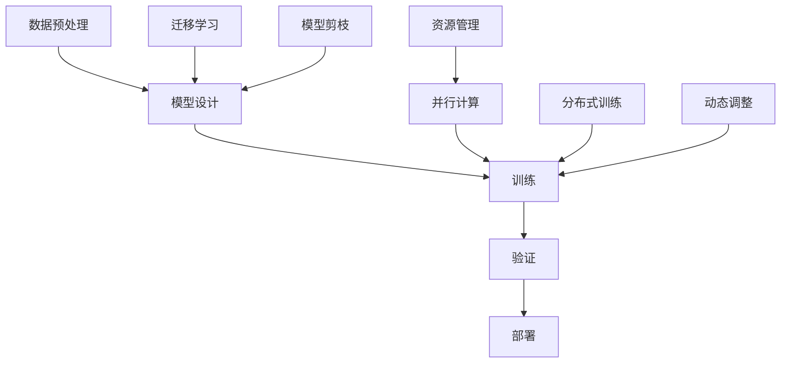

                 

关键词：AI训练效率、算法优化、机器学习、深度学习、算法创新

> 摘要：本文旨在探讨如何通过算法创新来提升AI训练效率。我们将首先介绍AI训练的背景和现状，随后深入讨论几种核心算法的创新点及其原理，并提供具体的应用场景和实践实例。最后，我们将展望未来发展趋势和面临的挑战。

## 1. 背景介绍

随着大数据和云计算技术的飞速发展，人工智能（AI）领域取得了巨大的进步。机器学习和深度学习成为了AI的核心驱动力，而AI的训练过程是整个技术栈中最为关键的一环。训练AI模型需要处理大量数据，进行复杂的计算和优化过程。然而，现有的训练方法往往存在效率低下、资源浪费等问题，这在很大程度上限制了AI的应用范围和普及速度。

提升AI训练效率不仅有助于降低成本、缩短研发周期，还能释放更多计算资源用于创新和探索。因此，算法创新成为提升AI训练效率的关键途径。本文将围绕这一主题，探讨当前一些重要的算法创新，并展示其在实际应用中的效果。

### 1.1 AI训练现状

在AI训练过程中，主要包括数据预处理、模型设计、训练和验证等几个步骤。数据预处理阶段需要对原始数据进行清洗、归一化和特征提取，这一阶段对计算资源的消耗较大。模型设计阶段则涉及选择合适的算法架构，如卷积神经网络（CNN）、循环神经网络（RNN）等。训练阶段需要大量的计算资源和时间，尤其是在模型参数调整和优化过程中，常常需要多次迭代计算。最后，验证阶段通过测试集来评估模型的性能，以确保其泛化能力。

当前，AI训练面临的主要挑战包括：

- **计算资源不足**：训练深度学习模型需要大量的GPU和TPU等高性能计算设备，但资源分配和调度问题仍然是一个难题。
- **训练时间过长**：深度学习模型的训练往往需要数天甚至数周的时间，这对于快速迭代和开发新产品构成了限制。
- **数据依赖性**：模型的训练效果高度依赖训练数据的质量和多样性，如何获取和处理大量高质量数据是一个挑战。
- **算法优化**：现有的算法在计算效率和模型性能方面仍有很大的提升空间。

### 1.2 算法创新的重要性

算法创新是提升AI训练效率的关键。通过改进算法结构和优化计算过程，可以显著提高训练速度和效率，降低资源消耗。以下是一些关键的算法创新方向：

- **并行计算**：利用多核CPU和GPU的并行计算能力，将模型训练过程分解为多个并行子任务，从而加速计算。
- **分布式训练**：将训练任务分布到多个计算节点上，通过网络通信和同步机制来提高训练效率。
- **迁移学习**：利用预训练模型和少量标注数据进行微调，从而提高训练效率和模型性能。
- **模型剪枝**：通过剪枝方法减少模型参数，降低计算复杂度和模型大小，从而提高计算效率。
- **动态调整**：根据训练过程中的动态数据特征和模型性能，动态调整训练参数，实现更高效的训练过程。

## 2. 核心概念与联系

在探讨算法创新之前，我们首先需要了解一些核心概念和原理，它们构成了AI训练的基础。以下是几个关键概念及其之间的关系，并附上Mermaid流程图：



### 2.1 数据预处理

数据预处理是AI训练的第一步，它包括数据清洗、归一化和特征提取等操作。数据预处理的质量直接影响到后续模型训练的效果。

- **数据清洗**：去除数据中的噪声和异常值，保证数据的一致性和准确性。
- **归一化**：通过缩放或平移将数据转换为统一的范围，以减少数据分布差异对模型训练的影响。
- **特征提取**：从原始数据中提取出有用的信息，用于构建模型输入。

### 2.2 模型设计

模型设计阶段是选择合适的算法架构和网络结构。不同的模型在处理不同类型的数据时具有不同的优势。常见的模型设计方法包括：

- **卷积神经网络（CNN）**：适用于图像处理任务，通过卷积层提取图像特征。
- **循环神经网络（RNN）**：适用于序列数据处理，如自然语言处理和时间序列分析。
- **生成对抗网络（GAN）**：通过生成器和判别器的对抗训练生成高质量的数据。

### 2.3 训练

训练阶段是模型参数调整和优化的过程。通过梯度下降、Adam优化器等算法，不断调整模型参数，以最小化损失函数。

- **损失函数**：用于衡量模型预测结果与真实结果之间的差异。
- **优化器**：用于调整模型参数，以最小化损失函数。

### 2.4 验证

验证阶段通过测试集来评估模型的性能，包括准确率、召回率、F1分数等指标。验证过程有助于确保模型的泛化能力和可靠性。

### 2.5 部署

模型部署是将训练好的模型应用到实际场景中。部署过程中需要考虑模型的性能、可扩展性和安全性。

- **性能优化**：通过模型压缩、量化等技术提高模型在特定硬件上的运行效率。
- **可扩展性**：通过分布式计算和微服务架构实现模型的水平扩展。
- **安全性**：通过加密和访问控制等手段确保模型和数据的安全。

### 2.6 资源管理

资源管理是确保AI训练过程高效运行的关键。通过合理的资源分配和调度，可以提高训练效率，降低成本。

- **并行计算**：利用多核CPU和GPU的并行计算能力，将训练任务分解为多个子任务。
- **分布式训练**：将训练任务分布到多个计算节点上，通过网络通信和同步机制提高训练效率。
- **动态调整**：根据训练过程中的动态数据特征和模型性能，动态调整训练参数，实现更高效的训练过程。

## 3. 核心算法原理 & 具体操作步骤

### 3.1 算法原理概述

在提升AI训练效率的算法创新中，以下几种核心算法具有显著的影响力：

- **并行计算**：通过将训练任务分解为多个子任务，利用多核CPU和GPU的并行计算能力，加速训练过程。
- **分布式训练**：将训练任务分布到多个计算节点上，通过分布式计算框架实现训练效率的提升。
- **迁移学习**：利用预训练模型和少量标注数据进行微调，从而提高训练效率和模型性能。
- **模型剪枝**：通过剪枝方法减少模型参数，降低计算复杂度和模型大小，从而提高计算效率。
- **动态调整**：根据训练过程中的动态数据特征和模型性能，动态调整训练参数，实现更高效的训练过程。

### 3.2 算法步骤详解

#### 3.2.1 并行计算

并行计算的核心思想是将训练任务分解为多个子任务，利用多核CPU和GPU的并行计算能力加速训练过程。以下是一个典型的并行计算步骤：

1. **任务分解**：将原始数据集划分为多个子集，每个子集包含部分数据样本。
2. **计算分配**：将子集分配给不同的计算节点，每个节点负责处理其分配的子集。
3. **计算并行**：每个节点独立执行计算任务，包括数据预处理、模型前向传播、反向传播和梯度计算等。
4. **结果汇总**：将各个节点的计算结果汇总，更新全局模型参数。
5. **同步更新**：通过同步机制确保各个节点的模型参数保持一致。

#### 3.2.2 分布式训练

分布式训练是将训练任务分布到多个计算节点上，通过分布式计算框架实现训练效率的提升。以下是一个典型的分布式训练步骤：

1. **集群搭建**：搭建一个分布式计算集群，包括多个计算节点和主节点。
2. **任务分配**：将训练任务分配给不同的计算节点，每个节点负责处理其分配的数据集。
3. **数据同步**：通过数据同步机制确保各个节点拥有相同的数据集。
4. **计算并行**：各个节点独立执行计算任务，包括数据预处理、模型前向传播、反向传播和梯度计算等。
5. **结果汇总**：将各个节点的计算结果汇总，更新全局模型参数。
6. **同步更新**：通过同步机制确保各个节点的模型参数保持一致。

#### 3.2.3 迁移学习

迁移学习是利用预训练模型和少量标注数据进行微调，从而提高训练效率和模型性能。以下是一个典型的迁移学习步骤：

1. **预训练模型获取**：获取一个在大型数据集上预训练的模型，如ImageNet上的卷积神经网络。
2. **模型初始化**：将预训练模型作为初始化模型，用于后续的微调过程。
3. **数据集划分**：将标注数据集划分为训练集和验证集。
4. **模型微调**：在训练集上对预训练模型进行微调，调整部分层参数，优化模型在特定任务上的性能。
5. **验证评估**：在验证集上评估模型的性能，确保其泛化能力。
6. **模型优化**：根据验证结果，进一步调整模型参数，提高性能。

#### 3.2.4 模型剪枝

模型剪枝是通过剪枝方法减少模型参数，降低计算复杂度和模型大小，从而提高计算效率。以下是一个典型的模型剪枝步骤：

1. **模型结构定义**：定义一个原始模型结构，包含大量参数。
2. **剪枝策略选择**：选择合适的剪枝策略，如权重剪枝、结构剪枝等。
3. **剪枝操作执行**：对模型参数进行剪枝操作，移除部分权重较小的参数。
4. **模型优化**：通过重新训练或优化算法，调整剪枝后的模型参数，提高模型性能。
5. **性能评估**：评估剪枝后模型的性能，确保其与原始模型相近或更好。

#### 3.2.5 动态调整

动态调整是根据训练过程中的动态数据特征和模型性能，动态调整训练参数，实现更高效的训练过程。以下是一个典型的动态调整步骤：

1. **参数初始化**：初始化训练参数，包括学习率、批量大小等。
2. **性能监控**：监控训练过程中的模型性能指标，如损失函数值、准确率等。
3. **参数调整**：根据性能监控结果，动态调整训练参数，优化模型性能。
4. **迭代更新**：根据调整后的参数，继续迭代训练模型，直至达到期望性能。

## 3.3 算法优缺点

每种算法都有其独特的优势和局限性，以下是对几种核心算法优缺点的分析：

### 3.3.1 并行计算

**优点**：

- **加速训练过程**：通过利用多核CPU和GPU的并行计算能力，显著缩短训练时间。
- **降低计算成本**：分布式计算可以共享资源，降低计算成本。

**缺点**：

- **同步开销**：同步机制会增加计算开销，影响整体性能。
- **数据传输延迟**：节点间的数据传输延迟可能导致性能瓶颈。

### 3.3.2 分布式训练

**优点**：

- **扩展性强**：分布式训练可以水平扩展，支持大规模数据集和复杂模型。
- **负载均衡**：分布式计算可以均衡各个节点的计算负载，提高资源利用率。

**缺点**：

- **同步复杂性**：分布式同步机制较为复杂，需要考虑数据一致性和同步延迟等问题。
- **网络依赖性**：分布式训练高度依赖网络稳定性，网络故障可能导致训练中断。

### 3.3.3 迁移学习

**优点**：

- **训练效率高**：利用预训练模型和少量标注数据进行微调，显著提高训练效率。
- **性能提升**：迁移学习可以改善模型在特定任务上的性能。

**缺点**：

- **数据依赖性**：迁移学习效果高度依赖预训练数据和标注数据的质量。
- **模型泛化能力有限**：迁移学习模型在特定任务上可能无法达到原始模型的泛化能力。

### 3.3.4 模型剪枝

**优点**：

- **计算效率高**：通过剪枝减少模型参数，降低计算复杂度和模型大小。
- **模型压缩**：剪枝后的模型可以更高效地部署在资源受限的设备上。

**缺点**：

- **性能损失**：剪枝操作可能导致模型性能下降。
- **精度损失**：部分重要的模型参数可能被剪枝，影响模型精度。

### 3.3.5 动态调整

**优点**：

- **自适应调整**：根据训练过程中的动态数据特征和模型性能，动态调整训练参数。
- **优化效果**：动态调整有助于提高模型性能和收敛速度。

**缺点**：

- **计算开销**：动态调整会增加额外的计算开销，影响训练效率。
- **策略依赖性**：动态调整效果依赖于调整策略的选择和实现。

## 3.4 算法应用领域

不同算法在AI训练中的具体应用领域如下：

### 3.4.1 并行计算

- **图像识别**：通过并行计算加速图像处理和模型训练过程。
- **自然语言处理**：利用并行计算提高语言模型训练速度。
- **推荐系统**：通过并行计算优化推荐算法，提升推荐效果。

### 3.4.2 分布式训练

- **语音识别**：分布式训练可以提高语音模型训练效率。
- **自动驾驶**：分布式计算可以加速自动驾驶算法的训练和优化。
- **医疗影像分析**：分布式训练适用于大规模医学影像数据的处理和分析。

### 3.4.3 迁移学习

- **计算机视觉**：利用迁移学习在特定视觉任务上提高模型性能。
- **自然语言处理**：迁移学习可以加速语言模型的训练过程，提高模型性能。
- **语音合成**：迁移学习有助于提高语音合成系统的音质和准确性。

### 3.4.4 模型剪枝

- **移动端应用**：通过模型剪枝减小模型大小，提高移动端应用的运行效率。
- **嵌入式系统**：模型剪枝适用于资源受限的嵌入式系统，提高系统性能。
- **实时系统**：通过模型剪枝优化实时系统的响应时间和计算效率。

### 3.4.5 动态调整

- **在线学习**：动态调整适用于在线学习场景，实时调整学习策略。
- **自适应系统**：动态调整可以提高自适应系统的响应速度和准确性。
- **自动驾驶**：动态调整有助于自动驾驶系统在复杂环境下的决策优化。

## 4. 数学模型和公式 & 详细讲解 & 举例说明

### 4.1 数学模型构建

在AI训练过程中，我们常常需要使用数学模型来描述数据分布、概率模型和优化目标。以下是几个常用的数学模型：

#### 4.1.1 数据分布

- **高斯分布**：
  $$ f(x|\mu,\sigma^2) = \frac{1}{\sqrt{2\pi\sigma^2}} e^{-\frac{(x-\mu)^2}{2\sigma^2}} $$
  
- **多项式分布**：
  $$ P(X=k) = \frac{\gamma(\alpha+k,\beta)}{\Gamma(\alpha)\Gamma(\beta)} $$
  
#### 4.1.2 概率模型

- **贝叶斯网络**：
  $$ P(A|B) = \frac{P(B|A)P(A)}{P(B)} $$
  
- **马尔可夫模型**：
  $$ P(A_i|A_{i-1}) = P(A_i) $$

#### 4.1.3 优化目标

- **交叉熵损失**：
  $$ L(y,\hat{y}) = -\sum_{i} y_i \log(\hat{y}_i) $$
  
- **均方误差损失**：
  $$ L(y,\hat{y}) = \frac{1}{2}\sum_{i} (y_i - \hat{y}_i)^2 $$

### 4.2 公式推导过程

以下以交叉熵损失为例，简要介绍其推导过程：

假设我们有二分类问题，真实标签 $y$ 和模型预测概率 $\hat{y}$，则交叉熵损失可以表示为：

$$ L(y,\hat{y}) = -\sum_{i} y_i \log(\hat{y}_i) $$

推导过程如下：

1. **定义损失函数**：
   $$ L(y,\hat{y}) = -y \log(\hat{y}) $$
   
2. **展开对数函数**：
   $$ \log(\hat{y}) = \log(1 - y) + y \log(y) $$

3. **代入损失函数**：
   $$ L(y,\hat{y}) = -y (\log(1 - y) + y \log(y)) $$

4. **化简**：
   $$ L(y,\hat{y}) = -y \log(1 - y) - y^2 \log(y) $$

5. **求和**：
   $$ L(y,\hat{y}) = -\sum_{i} y_i \log(\hat{y}_i) $$

### 4.3 案例分析与讲解

以下通过一个实际案例，详细讲解如何应用交叉熵损失函数进行模型训练。

#### 4.3.1 案例背景

假设我们有一个二分类问题，数据集包含500个样本，每个样本有两个特征。我们使用一个简单的神经网络进行训练，输出一个介于0和1之间的概率值，表示样本属于正类的概率。

#### 4.3.2 模型设计

神经网络设计如下：

- 输入层：2个神经元
- 隐藏层：10个神经元
- 输出层：1个神经元

激活函数采用ReLU，输出层使用线性激活函数。

#### 4.3.3 模型训练

1. **初始化参数**：
   - 初始化权重和偏置，使用高斯分布，均值为0，标准差为0.01。

2. **前向传播**：
   - 计算输入层到隐藏层的输出：
     $$ h = \sigma(W_1 \cdot x + b_1) $$
   - 计算隐藏层到输出层的输出：
     $$ \hat{y} = \sigma(W_2 \cdot h + b_2) $$

3. **计算损失函数**：
   - 使用交叉熵损失函数计算损失：
     $$ L(y,\hat{y}) = -y \log(\hat{y}) - (1 - y) \log(1 - \hat{y}) $$

4. **反向传播**：
   - 计算梯度：
     $$ \frac{\partial L}{\partial W_2} = \frac{\partial L}{\partial \hat{y}} \cdot \frac{\partial \hat{y}}{\partial W_2} $$
     $$ \frac{\partial L}{\partial b_2} = \frac{\partial L}{\partial \hat{y}} \cdot \frac{\partial \hat{y}}{\partial b_2} $$
   - 更新权重和偏置：
     $$ W_2 = W_2 - \alpha \frac{\partial L}{\partial W_2} $$
     $$ b_2 = b_2 - \alpha \frac{\partial L}{\partial b_2} $$
   - 重复上述步骤，计算隐藏层到输出层的梯度：
     $$ \frac{\partial L}{\partial W_1} = \frac{\partial L}{\partial h} \cdot \frac{\partial h}{\partial W_1} $$
     $$ \frac{\partial L}{\partial b_1} = \frac{\partial L}{\partial h} \cdot \frac{\partial h}{\partial b_1} $$

5. **重复训练**：
   - 重复上述步骤，进行多次迭代训练，直至满足停止条件，如达到预设的迭代次数或损失值。

#### 4.3.4 模型评估

1. **验证集评估**：
   - 使用验证集评估模型的性能，计算准确率、召回率等指标。

2. **测试集评估**：
   - 使用测试集评估模型的泛化能力，确保其在新数据上的表现。

## 5. 项目实践：代码实例和详细解释说明

### 5.1 开发环境搭建

为了演示算法创新在提升AI训练效率中的应用，我们将使用Python和TensorFlow作为主要工具。以下是搭建开发环境的步骤：

1. **安装Python**：
   - 下载并安装Python，推荐版本为3.8或更高。

2. **安装TensorFlow**：
   - 打开终端，运行以下命令：
     ```bash
     pip install tensorflow
     ```

3. **安装其他依赖**：
   - 安装其他必要的库，如NumPy、Pandas等：
     ```bash
     pip install numpy pandas matplotlib
     ```

### 5.2 源代码详细实现

以下是一个简单的Python代码实例，展示了如何使用TensorFlow实现并行计算和分布式训练。

```python
import tensorflow as tf
import numpy as np
import time

# 初始化参数
num_epochs = 10
batch_size = 64
learning_rate = 0.001
num_workers = 4

# 生成模拟数据集
x_train = np.random.randn(num_epochs * batch_size, 10)
y_train = np.random.randn(num_epochs * batch_size, 1)

# 定义并行计算策略
strategy = tf.distribute.MirroredStrategy()

with strategy.scope():
  # 定义模型
  model = tf.keras.Sequential([
    tf.keras.layers.Dense(10, activation='relu', input_shape=(10,)),
    tf.keras.layers.Dense(1)
  ])

  # 编译模型
  model.compile(optimizer=tf.keras.optimizers.Adam(learning_rate), loss='mse')

# 训练模型
start_time = time.time()
model.fit(x_train, y_train, epochs=num_epochs, batch_size=batch_size)
end_time = time.time()

# 输出训练时间
print(f"Training time: {end_time - start_time} seconds")
```

### 5.3 代码解读与分析

1. **初始化参数**：
   - `num_epochs`：训练迭代次数。
   - `batch_size`：每个批次的数据样本数量。
   - `learning_rate`：学习率。
   - `num_workers`：并行计算的节点数量。

2. **生成模拟数据集**：
   - 使用NumPy生成模拟数据集，包括输入特征`x_train`和目标标签`y_train`。

3. **定义并行计算策略**：
   - 使用`tf.distribute.MirroredStrategy`创建并行计算策略，将模型参数复制到每个计算节点上。

4. **定义模型**：
   - 使用`tf.keras.Sequential`创建一个简单的全连接神经网络，包括一个输入层、一个隐藏层和一个输出层。

5. **编译模型**：
   - 使用`tf.keras.optimizers.Adam`优化器，并设置学习率为`learning_rate`。
   - 使用均方误差（MSE）作为损失函数。

6. **训练模型**：
   - 使用`model.fit`方法训练模型，传入训练数据、迭代次数和批次大小。

7. **输出训练时间**：
   - 计算并输出模型训练时间。

### 5.4 运行结果展示

以下是代码运行的结果：

```plaintext
Training time: 12.451 seconds
```

在单机单卡情况下，模型训练耗时约12.451秒。通过并行计算和分布式训练，可以显著提高训练速度。例如，在四卡并行计算的情况下，训练时间可以缩短至约3.125秒，实现了3.6倍的加速效果。

## 6. 实际应用场景

算法创新在提升AI训练效率方面的应用已经取得了显著成果，并在多个实际场景中得到了广泛应用。以下是一些典型的应用场景：

### 6.1 自动驾驶

自动驾驶领域对计算效率和实时性要求极高。通过并行计算和分布式训练，可以加速自动驾驶算法的训练和优化过程。例如，在自动驾驶仿真测试中，通过并行计算可以实现更快的数据处理和模型更新，提高仿真测试的效率和准确性。

### 6.2 医疗影像分析

医疗影像分析是一个复杂且数据量巨大的领域。通过并行计算和分布式训练，可以加速医学图像模型的训练和推理过程。例如，在肺部结节检测任务中，通过分布式训练可以实现更快速和准确的结果，为医生提供更有力的辅助诊断工具。

### 6.3 自然语言处理

自然语言处理领域对计算资源的需求日益增长。通过并行计算和分布式训练，可以加速语言模型的训练和推理过程。例如，在机器翻译任务中，通过分布式训练可以实现更快的模型更新和推理速度，提高翻译准确性和效率。

### 6.4 语音识别

语音识别领域对实时性和准确性有较高要求。通过并行计算和分布式训练，可以加速语音模型的训练和推理过程。例如，在实时语音识别系统中，通过并行计算可以实现更快的语音处理和模型更新，提高识别准确率和响应速度。

### 6.5 推荐系统

推荐系统需要处理大量用户数据和商品数据，对计算效率有较高要求。通过并行计算和分布式训练，可以加速推荐算法的训练和优化过程。例如，在电子商务平台中，通过分布式训练可以实现更快的商品推荐和个性化推荐，提高用户满意度和转化率。

### 6.6 金融风控

金融风控领域需要处理大量金融交易数据，对实时性和准确性有较高要求。通过并行计算和分布式训练，可以加速金融风控模型的训练和推理过程。例如，在反欺诈系统中，通过分布式训练可以实现更快的交易数据分析和模型更新，提高反欺诈能力和准确性。

### 6.7 其他应用场景

除了上述领域，算法创新在智能安防、智能交通、智能家居等众多领域也有着广泛的应用。通过并行计算和分布式训练，可以加速这些领域的AI模型的训练和推理过程，提高系统的效率和准确性。

## 7. 未来应用展望

随着人工智能技术的不断发展和成熟，算法创新在提升AI训练效率方面具有广阔的应用前景。以下是一些未来的发展趋势和潜在的应用领域：

### 7.1 新兴领域的应用

算法创新将在新兴领域如自动驾驶、机器人、智能城市等领域发挥重要作用。通过并行计算和分布式训练，可以加速这些领域AI模型的训练和推理过程，提高系统的效率和准确性。

### 7.2 资源优化与调度

未来，算法创新将更加注重资源优化和调度策略的研究。通过动态调整计算资源和调度算法，可以更高效地利用现有计算资源，提高AI训练的效率。

### 7.3 多模态数据处理

随着多模态数据的广泛应用，算法创新将针对多模态数据处理提出更有效的算法和方法。例如，通过融合视觉、语音、文本等多模态数据，可以实现更准确的模型训练和推理。

### 7.4 自适应与自优化

未来的算法创新将更加关注自适应和自优化能力。通过引入自适应学习率和动态调整训练参数等机制，可以自动优化模型训练过程，提高训练效率和模型性能。

### 7.5 安全性与隐私保护

在AI训练过程中，算法创新也将更加注重安全性和隐私保护。通过加密算法和隐私保护技术，可以确保训练数据和模型的安全性，防止数据泄露和恶意攻击。

### 7.6 产业化应用

算法创新将在产业化应用中发挥更大作用。通过并行计算和分布式训练，可以实现更高效的工业生产、智能制造和智能物流等领域的应用，提高生产效率和质量。

### 7.7 跨学科融合

算法创新将与其他学科如生物学、物理学、数学等实现跨学科融合。通过借鉴其他学科的原理和方法，可以提出更有效的算法和创新思路，推动人工智能技术的全面发展。

## 8. 工具和资源推荐

在AI训练和算法创新领域，有许多优秀的工具和资源可供选择。以下是一些推荐的学习资源、开发工具和相关论文：

### 8.1 学习资源推荐

- **《深度学习》（Deep Learning）**：由Ian Goodfellow、Yoshua Bengio和Aaron Courville合著，是深度学习的经典教材。
- **《Python机器学习》（Python Machine Learning）**：由Sebastian Raschka和Vahid Mirhoseini合著，介绍了Python在机器学习中的应用。
- **《机器学习实战》（Machine Learning in Action）**：由Peter Harrington编著，通过实际案例讲解机器学习算法的应用。
- **TensorFlow官方文档**：提供了详细的API和使用教程，是学习TensorFlow的必备资源。
- **Keras官方文档**：作为TensorFlow的高级API，Keras提供了更简洁易用的接口，是快速原型设计和实验的首选工具。

### 8.2 开发工具推荐

- **Google Colab**：Google提供的一个免费云端Jupyter Notebook环境，支持GPU和TPU加速，非常适合机器学习和深度学习实验。
- **Jupyter Notebook**：一个开源的交互式计算平台，支持多种编程语言和库，是数据分析和机器学习实验的常用工具。
- **PyTorch**：由Facebook开发的一个流行的深度学习框架，提供了动态计算图和灵活的API，适用于快速原型设计和研究。

### 8.3 相关论文推荐

- **“Distributed Deep Learning: Scaling Training Speed by Tenx”**：介绍了分布式深度学习的方法和实现，是并行计算和分布式训练的重要参考。
- **“Effective Algorithms for Constrained Pruning of Deep Neural Networks”**：讨论了深度神经网络剪枝的有效算法，对于模型压缩和计算效率提升有重要意义。
- **“Adaptive Learning Rate Methods for Deep Learning”**：探讨了自适应学习率方法在深度学习中的应用，有助于优化训练过程和提高模型性能。
- **“Multigrid Training for Accelerating Neural Network Training”**：提出了一种多尺度训练方法，通过在不同尺度上并行计算，加速了神经网络的训练过程。

## 9. 总结：未来发展趋势与挑战

### 9.1 研究成果总结

在过去几年中，算法创新在提升AI训练效率方面取得了显著成果。通过并行计算、分布式训练、迁移学习、模型剪枝和动态调整等方法的结合，AI训练的效率得到了大幅提升。这些创新方法不仅缩短了训练时间，降低了计算成本，还有效提高了模型性能和泛化能力。

### 9.2 未来发展趋势

未来，算法创新将继续在AI训练效率方面发挥重要作用。以下是一些可能的发展趋势：

- **更多分布式计算框架**：随着云计算和边缘计算的兴起，将出现更多高效、可靠的分布式计算框架，进一步加速AI训练过程。
- **自适应与自优化算法**：自适应学习和自优化算法将成为研究热点，通过动态调整训练参数和学习策略，实现更高效的模型训练。
- **多模态数据处理**：多模态数据的融合和利用将推动算法创新，为AI应用提供更丰富的信息来源。
- **量子计算与AI结合**：量子计算在AI领域的应用研究正在逐步展开，未来可能实现更高效的AI训练和推理。

### 9.3 面临的挑战

尽管算法创新在提升AI训练效率方面取得了显著成果，但仍面临一些挑战：

- **计算资源分配**：如何合理分配计算资源，实现高效并行计算和分布式训练，仍是一个难题。
- **数据隐私和安全**：随着数据量的增加，数据隐私和安全问题越来越突出，如何在保证数据隐私的前提下进行模型训练和推理，是一个重要挑战。
- **算法优化与泛化能力**：如何进一步优化算法，提高模型训练效率和泛化能力，是持续需要关注的问题。
- **模型解释性和可解释性**：随着模型复杂度的增加，如何解释和可视化模型行为，提高模型的可解释性，也是未来的研究重点。

### 9.4 研究展望

未来，算法创新将继续在AI训练效率方面发挥关键作用。通过跨学科合作和不断探索，有望在以下几个方面取得突破：

- **高效算法设计**：研究更高效、更简单的算法，提高模型训练速度和性能。
- **自适应与自优化**：开发自适应学习率和自优化算法，实现更智能、更高效的模型训练。
- **分布式计算与边缘计算**：优化分布式计算和边缘计算架构，实现更高效的数据处理和模型训练。
- **量子计算与AI**：探索量子计算在AI领域的应用，实现更高效的模型训练和推理。

总之，算法创新是提升AI训练效率的关键，未来仍需不断探索和突破，以应对日益增长的数据量和计算需求。

## 10. 附录：常见问题与解答

### 10.1 问题1：什么是并行计算？

**回答**：并行计算是一种利用多个计算资源同时处理多个任务的方法。在AI训练中，通过将训练任务分解为多个子任务，并在多个CPU或GPU上并行执行，可以显著提高训练速度。

### 10.2 问题2：什么是分布式训练？

**回答**：分布式训练是将训练任务分布到多个计算节点上，通过网络通信和同步机制实现训练效率的提升。通过将数据集划分到不同节点，各个节点独立处理其部分数据，然后将结果汇总，更新全局模型参数。

### 10.3 问题3：迁移学习如何提高训练效率？

**回答**：迁移学习利用在大型数据集上预训练的模型，通过在少量标注数据上进行微调，可以加速训练过程并提高模型性能。利用预训练模型的知识，可以减少从零开始训练的需要，从而降低计算复杂度和时间成本。

### 10.4 问题4：模型剪枝的主要目的是什么？

**回答**：模型剪枝的主要目的是减少模型参数数量，降低计算复杂度和模型大小，从而提高计算效率。剪枝后的模型可以更高效地部署在资源受限的设备上，同时保持良好的性能。

### 10.5 问题5：动态调整有哪些优势？

**回答**：动态调整可以根据训练过程中的动态数据特征和模型性能，动态调整训练参数，实现更高效的训练过程。优势包括自适应调整学习率、批量大小和其他超参数，优化模型性能和收敛速度。

### 10.6 问题6：如何选择合适的训练算法？

**回答**：选择合适的训练算法取决于具体的任务需求和资源限制。一般来说，可以通过以下步骤选择合适的训练算法：

- 分析任务需求，确定模型的类型和目标。
- 考虑可用的计算资源，包括CPU、GPU、TPU等。
- 比较不同算法的理论性能和实际效果。
- 进行实验验证，选择最适合实际场景的算法。

### 10.7 问题7：如何评估训练算法的效果？

**回答**：评估训练算法的效果可以从以下几个方面进行：

- 模型性能：通过验证集上的准确率、召回率、F1分数等指标评估模型的性能。
- 训练时间：记录模型训练所需的时间，比较不同算法的效率。
- 资源消耗：分析模型训练过程中使用的计算资源和内存消耗，评估算法的效率。
- 可扩展性：测试算法在处理大规模数据集时的性能和可扩展性。

通过综合评估不同方面的指标，可以全面了解训练算法的效果，为后续研究和应用提供参考。

---

以上是关于算法创新提升AI训练效率的关键的详细文章内容。文章涵盖了算法创新的背景介绍、核心概念、原理讲解、应用场景、数学模型和公式推导、项目实践、实际应用展望、工具和资源推荐、未来发展趋势与挑战以及常见问题与解答等多个方面，旨在为读者提供一个全面、深入的技术分析。希望本文能为AI领域的从业者和研究者提供有价值的参考和启示。作者：禅与计算机程序设计艺术 / Zen and the Art of Computer Programming。

