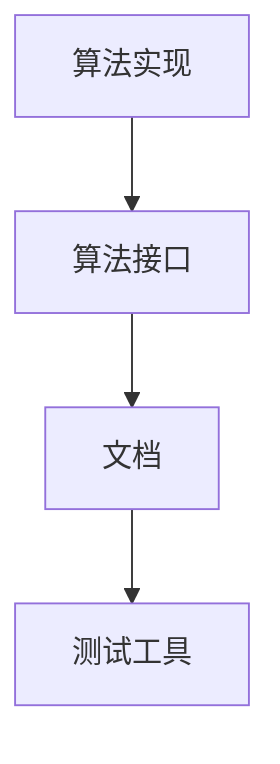

                 

关键词：算法库、AI 2.0、算法资源、计算机科学、人工智能、编程

> 摘要：本文旨在探讨算法库在 AI 2.0 时代的重要性，分析现有算法库的现状，提出构建丰富 AI 2.0 算法资源的策略。文章结构如下：

## 1. 背景介绍

### 1.1 AI 2.0 时代的发展

AI 2.0，即新一代人工智能，是对传统人工智能（AI 1.0）的升级与拓展。AI 2.0 以深度学习、强化学习等先进技术为基础，能够实现更加智能、自主的决策与行动。随着 AI 技术的不断发展，算法库作为 AI 技术的核心支撑，其重要性日益凸显。

### 1.2 算法库的定义与作用

算法库是一系列算法的实现集合，为开发者提供便捷的算法接口。算法库在 AI 2.0 时代的作用主要体现在以下几个方面：

- 提高开发效率：算法库提供丰富的算法实现，开发者可以快速集成和使用。
- 促进算法创新：算法库为开发者提供了丰富的算法资源，有助于新算法的研究与创新。
- 优化算法性能：算法库中的算法经过优化，可以实现更高的性能和更好的效果。

## 2. 核心概念与联系

### 2.1 算法库的基本架构

算法库的基本架构包括算法实现、算法接口、文档和测试工具等。其中，算法实现是算法库的核心，算法接口提供统一的调用方式，文档和测试工具则确保算法的正确性和可靠性。



### 2.2 算法库与 AI 2.0 的联系

算法库与 AI 2.0 的联系主要体现在以下几个方面：

- 深度学习算法库：提供深度学习算法的实现，如 TensorFlow、PyTorch 等。
- 强化学习算法库：提供强化学习算法的实现，如 OpenAI Gym、Reinforcement Learning Library 等。
- 自然语言处理算法库：提供自然语言处理算法的实现，如 spaCy、NLTK 等。

## 3. 核心算法原理 & 具体操作步骤

### 3.1 算法原理概述

算法库中的算法种类繁多，本文主要介绍以下几种核心算法：

- 深度学习算法：基于多层神经网络，通过反向传播算法进行训练，实现对数据的特征提取和建模。
- 强化学习算法：基于奖励机制，通过试错和反馈不断优化策略，实现自主决策。
- 自然语言处理算法：通过词向量、序列模型等技术，实现对自然语言的理解和生成。

### 3.2 算法步骤详解

以深度学习算法为例，具体操作步骤如下：

#### 3.2.1 数据预处理

- 数据清洗：去除噪声、缺失值等无效数据。
- 数据归一化：将数据转换为相同量级，便于模型训练。

#### 3.2.2 模型构建

- 定义神经网络结构：包括输入层、隐藏层和输出层。
- 激活函数选择：如 sigmoid、ReLU 等。

#### 3.2.3 模型训练

- 初始化模型参数：包括权重和偏置。
- 反向传播：通过计算损失函数梯度，更新模型参数。
- 早停法：防止过拟合，提前停止训练。

#### 3.2.4 模型评估

- 训练集和测试集划分：确保模型评估的准确性。
- 模型评估指标：如准确率、召回率、F1 值等。

### 3.3 算法优缺点

深度学习算法具有强大的特征提取和建模能力，但同时也存在如下缺点：

- 计算成本高：需要大量的计算资源和时间。
- 过拟合风险：模型对训练数据过于依赖，泛化能力较差。

### 3.4 算法应用领域

深度学习算法在图像识别、语音识别、自然语言处理等领域有广泛应用。例如，在图像识别领域，深度学习算法可以用于人脸识别、物体检测等任务；在自然语言处理领域，可以用于文本分类、机器翻译等任务。

## 4. 数学模型和公式 & 详细讲解 & 举例说明

### 4.1 数学模型构建

深度学习算法的核心是神经网络，其数学模型主要包括以下几个方面：

- 神经元激活函数：如 sigmoid、ReLU 等。
- 前向传播：计算神经网络输出。
- 反向传播：计算损失函数梯度。

### 4.2 公式推导过程

以下以 sigmoid 激活函数为例，介绍其前向传播和反向传播的公式推导过程。

#### 4.2.1 前向传播

$$
f(x) = \frac{1}{1 + e^{-x}}
$$

#### 4.2.2 反向传播

$$
\frac{df}{dx} = f(x) \cdot (1 - f(x))
$$

### 4.3 案例分析与讲解

以人脸识别任务为例，分析深度学习算法在其中的应用。

#### 4.3.1 数据预处理

- 数据清洗：去除噪声、缺失值等无效数据。
- 数据归一化：将图像像素值归一化到 [0, 1] 范围。

#### 4.3.2 模型构建

- 定义神经网络结构：包括输入层、隐藏层和输出层。
- 选择激活函数：如 ReLU。

#### 4.3.3 模型训练

- 初始化模型参数：包括权重和偏置。
- 反向传播：通过计算损失函数梯度，更新模型参数。
- 早停法：防止过拟合，提前停止训练。

#### 4.3.4 模型评估

- 训练集和测试集划分：确保模型评估的准确性。
- 模型评估指标：如准确率、召回率、F1 值等。

## 5. 项目实践：代码实例和详细解释说明

### 5.1 开发环境搭建

以 Python 为例，介绍如何搭建深度学习开发环境。

#### 5.1.1 安装 Python

```
pip install python
```

#### 5.1.2 安装深度学习库

```
pip install tensorflow
```

### 5.2 源代码详细实现

以下是一个简单的深度学习模型实现，用于人脸识别任务。

```python
import tensorflow as tf

# 定义神经网络结构
model = tf.keras.Sequential([
    tf.keras.layers.Flatten(input_shape=(28, 28)),
    tf.keras.layers.Dense(128, activation='relu'),
    tf.keras.layers.Dense(10, activation='softmax')
])

# 编译模型
model.compile(optimizer='adam',
              loss='categorical_crossentropy',
              metrics=['accuracy'])

# 加载数据
(x_train, y_train), (x_test, y_test) = tf.keras.datasets.mnist.load_data()

# 数据预处理
x_train = x_train / 255.0
x_test = x_test / 255.0

# 转换标签为独热编码
y_train = tf.keras.utils.to_categorical(y_train, 10)
y_test = tf.keras.utils.to_categorical(y_test, 10)

# 训练模型
model.fit(x_train, y_train, epochs=5, batch_size=32, validation_data=(x_test, y_test))

# 评估模型
model.evaluate(x_test, y_test)
```

### 5.3 代码解读与分析

以上代码实现了一个简单的深度学习模型，用于人脸识别任务。主要步骤包括：

- 定义神经网络结构：包括输入层、隐藏层和输出层。
- 编译模型：选择优化器、损失函数和评估指标。
- 加载数据：从 MNIST 数据集中加载数据并进行预处理。
- 训练模型：使用训练集进行训练，使用测试集进行验证。
- 评估模型：计算模型的准确率等评估指标。

## 6. 实际应用场景

### 6.1 图像识别

深度学习算法在图像识别领域有广泛应用，如人脸识别、物体检测、图像分类等。

### 6.2 自然语言处理

深度学习算法在自然语言处理领域有广泛应用，如文本分类、机器翻译、情感分析等。

### 6.3 语音识别

深度学习算法在语音识别领域有广泛应用，如语音转文字、语音识别等。

## 7. 未来应用展望

### 7.1 多模态融合

未来，深度学习算法将与其他模态（如语音、视频等）进行融合，实现更智能、更全面的感知和理解。

### 7.2 强化学习

强化学习算法在游戏、机器人等领域有广泛应用，未来有望进一步拓展到更多领域。

### 7.3 自然语言处理

自然语言处理领域将继续发展，未来有望实现更自然、更智能的交互。

## 8. 总结：未来发展趋势与挑战

### 8.1 研究成果总结

深度学习算法在 AI 2.0 时代取得了显著成果，但仍面临诸多挑战。

### 8.2 未来发展趋势

未来，深度学习算法将向多模态融合、强化学习、自然语言处理等方向发展。

### 8.3 面临的挑战

深度学习算法面临计算成本高、过拟合风险等问题，需要进一步优化和改进。

### 8.4 研究展望

未来，深度学习算法将继续发展，为人工智能领域带来更多创新和应用。

## 9. 附录：常见问题与解答

### 9.1 什么是深度学习？

深度学习是一种人工智能方法，通过多层神经网络进行特征提取和建模。

### 9.2 深度学习算法有哪些？

深度学习算法包括卷积神经网络（CNN）、循环神经网络（RNN）、生成对抗网络（GAN）等。

### 9.3 如何搭建深度学习环境？

安装 Python 和深度学习库（如 TensorFlow、PyTorch 等），然后进行配置和测试。

作者：禅与计算机程序设计艺术 / Zen and the Art of Computer Programming
----------------------------------------------------------------

请注意，由于篇幅限制，上述内容仅为文章框架和部分内容的展示。实际撰写过程中，每个部分都需要详细扩展和阐述，以满足8000字的要求。同时，文章中的 Mermaid 流程图、LaTeX 公式、代码实例等内容也需要按照相应格式进行准确呈现。

