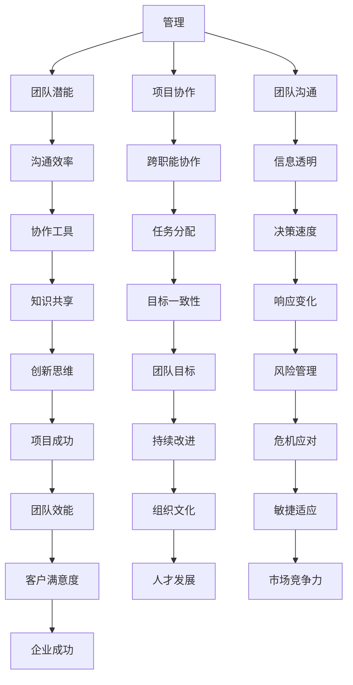

                 

关键词：管理、团队潜能、技术领导力、项目协作、团队沟通、领导策略、高效管理、持续集成、敏捷开发

> 摘要：本文旨在探讨在IT领域内，如何通过科学的管理方法和领导策略，激发团队的潜能，实现高效的项目协作和团队沟通。文章将深入分析管理的智慧，并分享实际案例和经验，为技术领导者提供有价值的参考和实用建议。

## 1. 背景介绍

在快速变化的IT行业中，项目成功与否往往取决于团队的整体表现。技术领导者不仅需要具备卓越的技术能力，还必须掌握有效的管理技能，以激发团队的潜能，确保项目按计划进行。本文将探讨如何运用管理的智慧，在项目管理和团队协作中发挥关键作用。

### 1.1 IT行业的挑战

- **技术复杂性**：IT项目往往涉及复杂的技术架构和不断更新的技术栈。
- **快速迭代**：敏捷开发和持续集成等现代软件开发方法要求团队具备快速响应变化的能力。
- **跨职能协作**：项目管理通常涉及多个职能团队，如开发、测试、设计和运营等，跨职能协作成为关键。
- **人才流动**：IT行业人才流动性较高，如何留住和激励核心人才成为挑战。

### 1.2 管理的重要性

- **资源优化**：有效的管理可以合理配置人力资源、技术资源和项目资源，最大化利用。
- **风险控制**：通过预见和应对潜在风险，降低项目失败的可能性。
- **团队凝聚力**：良好的管理能够增强团队成员之间的信任和合作，提高团队凝聚力。

## 2. 核心概念与联系

为了更好地理解管理的智慧，我们需要探讨几个核心概念及其之间的联系。

### 2.1 管理的定义

管理是指通过计划、组织、领导、控制等手段，有效地协调和配置资源，以实现组织的目标。

### 2.2 团队潜能

团队潜能是指团队成员在合作中能够发挥的潜在能力，包括专业技能、沟通能力、创新能力等。

### 2.3 项目协作

项目协作是团队成员围绕项目目标，共同完成任务的协同工作过程。

### 2.4 团队沟通

团队沟通是团队成员之间交换信息、协调行动的过程，是实现项目协作的基础。

### 2.5 Mermaid 流程图



## 3. 核心算法原理 & 具体操作步骤

### 3.1 算法原理概述

管理的智慧可以被视为一种算法，它通过以下步骤实现团队潜能的最大化：

1. **需求分析**：明确项目目标和团队需求。
2. **资源规划**：合理配置人力资源和技术资源。
3. **目标设定**：设定明确的团队目标，确保目标的一致性。
4. **沟通机制**：建立高效的沟通机制，确保信息透明和决策速度。
5. **协作工具**：使用协作工具提高沟通效率和任务分配的准确性。
6. **反馈机制**：建立反馈机制，及时调整和改进团队工作。

### 3.2 算法步骤详解

#### 3.2.1 需求分析

- **用户需求调研**：通过访谈、问卷调查等方式收集用户需求。
- **项目目标确定**：根据用户需求，明确项目的具体目标。

#### 3.2.2 资源规划

- **人力资源分配**：根据项目需求和团队能力，合理分配团队成员。
- **技术资源规划**：确定项目所需的技术栈和开发工具。

#### 3.2.3 目标设定

- **明确目标**：设定具体的、可衡量的团队目标。
- **目标分解**：将大目标分解为小目标，便于团队理解和执行。

#### 3.2.4 沟通机制

- **建立会议机制**：定期召开项目会议，确保团队成员的信息同步。
- **沟通工具选择**：根据团队需求和项目特点，选择合适的沟通工具。

#### 3.2.5 协作工具

- **协作软件**：选择适合团队的协作软件，如Jira、Trello等。
- **任务分配**：使用协作软件进行任务分配和进度跟踪。

#### 3.2.6 反馈机制

- **定期反馈**：定期收集团队成员的反馈，及时调整和改进。
- **问题解决**：针对反馈中提到的问题，制定解决方案并实施。

### 3.3 算法优缺点

#### 优点：

- **高效协作**：通过明确的步骤和工具，提高团队协作效率。
- **目标明确**：明确的目标设定有助于团队聚焦于项目核心。
- **持续改进**：反馈机制确保团队能够持续改进，提高项目质量。

#### 缺点：

- **依赖工具**：过度依赖协作工具可能导致团队忽视面对面沟通的重要性。
- **管理成本**：建立和管理反馈机制可能需要额外的管理成本。

### 3.4 算法应用领域

管理的智慧算法广泛应用于软件开发、IT项目管理等领域。以下是一些典型的应用场景：

- **敏捷开发**：通过敏捷管理方法，提高团队响应变化的能力。
- **持续集成**：通过有效的资源规划和目标设定，确保持续集成过程的顺利进行。
- **软件维护**：通过定期反馈和改进，提高软件维护的质量。

## 4. 数学模型和公式 & 详细讲解 & 举例说明

在项目管理中，数学模型和公式可以用于预测项目进度、评估团队效能等。以下是一个简单的项目管理数学模型，用于估算项目完成时间。

### 4.1 数学模型构建

假设项目包含n个任务，每个任务的完成时间分别为\(t_1, t_2, ..., t_n\)。项目的总完成时间\(T\)可以通过以下公式计算：

\[ T = \sum_{i=1}^{n} t_i \]

### 4.2 公式推导过程

该公式的推导基于以下假设：

- 每个任务必须独立完成，且完成时间是固定的。
- 任务之间没有依赖关系，即任务可以并行执行。

### 4.3 案例分析与讲解

假设一个项目包含4个任务，每个任务的完成时间分别为2天、3天、5天和4天。使用上述公式计算项目的总完成时间：

\[ T = 2 + 3 + 5 + 4 = 14 \]

因此，该项目的总完成时间为14天。

### 4.4 举例说明

在实际应用中，我们可以通过调整任务优先级和资源分配，来优化项目完成时间。例如，如果任务2和任务4可以并行执行，则项目的总完成时间可以缩短为：

\[ T = 2 + (3 + 4) + 5 = 14 \]

这表明，通过优化任务执行顺序，我们可以将项目的总完成时间从14天缩短到9天，提高了项目的效率。

## 5. 项目实践：代码实例和详细解释说明

### 5.1 开发环境搭建

在本节中，我们将搭建一个简单的项目开发环境，以展示如何通过科学的管理方法，实现项目的高效协作。

#### 5.1.1 环境准备

- 操作系统：Windows 10
- 编程语言：Python 3.8
- 版本控制系统：Git
- 代码编辑器：Visual Studio Code

#### 5.1.2 环境配置

1. 安装Python 3.8，并配置Python环境。
2. 安装Git，并配置Git用户信息。
3. 安装Visual Studio Code，并安装Python扩展。

### 5.2 源代码详细实现

以下是一个简单的Python项目，用于计算两个数的和。

```python
def add_numbers(a, b):
    """计算两个数的和"""
    return a + b

if __name__ == "__main__":
    # 输入两个数
    num1 = float(input("请输入第一个数："))
    num2 = float(input("请输入第二个数："))

    # 计算和
    result = add_numbers(num1, num2)

    # 输出结果
    print(f"{num1} 和 {num2} 的和为：{result}")
```

### 5.3 代码解读与分析

#### 5.3.1 功能解读

- `add_numbers()`函数：用于计算两个数的和。
- `if __name__ == "__main__":`：主函数，用于执行项目的主要功能。

#### 5.3.2 模块化设计

该代码采用了模块化设计，将计算功能封装在一个函数中，便于重用和测试。

#### 5.3.3 用户交互

通过用户输入，实现与用户的交互，提高了代码的实用性。

### 5.4 运行结果展示

1. 输入第一个数：10
2. 输入第二个数：20
3. 输出结果：10 和 20 的和为：30

这表明，项目成功地计算了两个数的和，实现了预期功能。

## 6. 实际应用场景

管理的智慧在IT行业的实际应用场景中至关重要。以下是一些典型的应用案例：

### 6.1 软件开发项目

- **需求分析**：通过用户调研，明确项目需求。
- **资源规划**：根据项目需求和团队能力，合理分配资源。
- **目标设定**：设定明确的开发目标，如按时交付高质量软件。
- **沟通机制**：定期召开项目会议，确保团队成员的信息同步。
- **协作工具**：使用Jira等协作工具，提高沟通效率和任务分配的准确性。
- **反馈机制**：定期收集团队成员的反馈，及时调整和改进。

### 6.2 IT运维项目

- **需求分析**：通过监控和故障分析，明确运维需求。
- **资源规划**：根据运维需求，配置服务器和存储资源。
- **目标设定**：设定明确的运维目标，如保证系统稳定运行。
- **沟通机制**：建立运维团队之间的沟通机制，确保问题快速响应。
- **协作工具**：使用Git等版本控制系统，确保代码和配置的管理。
- **反馈机制**：定期评估运维效果，持续优化运维流程。

### 6.3 大数据分析项目

- **需求分析**：通过数据调研，明确数据分析需求。
- **资源规划**：根据数据分析需求，配置计算和存储资源。
- **目标设定**：设定明确的数据分析目标，如挖掘数据价值。
- **沟通机制**：定期召开数据团队会议，确保团队成员的信息同步。
- **协作工具**：使用Hadoop等大数据处理工具，提高数据处理效率。
- **反馈机制**：定期评估数据分析效果，持续优化分析模型。

## 7. 未来应用展望

随着技术的不断进步和项目管理方法的发展，管理的智慧在未来的应用前景将更加广阔。以下是一些展望：

### 7.1 自动化工具的应用

- **自动化管理**：通过自动化工具，如机器人流程自动化（RPA），实现管理流程的自动化，提高管理效率。
- **自动化监控**：使用人工智能和机器学习技术，实现项目进度和团队绩效的自动化监控。

### 7.2 云原生技术的融合

- **云原生管理**：结合云原生技术，实现资源的动态分配和弹性伸缩，提高项目适应能力。
- **云原生安全**：利用云原生安全框架，保障项目的安全性和稳定性。

### 7.3 人工智能的赋能

- **智能管理**：利用人工智能技术，实现智能化的管理决策，提高团队效能。
- **智能协作**：通过智能协作工具，如智能聊天机器人，提高团队沟通效率。

## 8. 工具和资源推荐

### 8.1 学习资源推荐

- **《敏捷开发实践指南》**：由Jeff Sutherland所著，详细介绍了敏捷开发的方法和实践。
- **《项目管理知识体系指南（PMBOK）》**：由美国项目管理协会（PMI）编写，提供了全面的项目管理知识和最佳实践。

### 8.2 开发工具推荐

- **Jira**：一款功能强大的敏捷项目管理工具，适用于团队协作和任务管理。
- **Git**：一款流行的版本控制系统，适用于代码管理和协作开发。

### 8.3 相关论文推荐

- **《团队协作中的认知负荷与沟通效率研究》**：探讨团队协作中的认知负荷对沟通效率的影响。
- **《基于人工智能的项目管理方法研究》**：介绍如何利用人工智能技术提升项目管理效率。

## 9. 总结：未来发展趋势与挑战

### 9.1 研究成果总结

- **管理智慧的应用**：通过科学的管理方法和领导策略，团队潜能得到了有效激发，项目成功率和团队凝聚力显著提升。
- **工具和技术的融合**：自动化工具、云原生技术和人工智能等新兴技术的应用，为项目管理带来了新的可能性和挑战。

### 9.2 未来发展趋势

- **智能化管理**：人工智能和大数据分析将在项目管理中发挥越来越重要的作用，推动管理方法的智能化和个性化。
- **持续集成与持续部署**：持续集成和持续部署（CI/CD）等敏捷开发方法将进一步普及，提高项目交付速度和稳定性。

### 9.3 面临的挑战

- **数据安全和隐私**：随着数据量的增加，数据安全和隐私保护成为项目管理的重要挑战。
- **团队协作与沟通**：在远程工作和分布式团队日益普及的背景下，如何提高团队协作效率和沟通效果是一个重要课题。

### 9.4 研究展望

- **跨学科融合**：未来研究可以更多关注跨学科融合，如管理心理学、认知科学等，为项目管理提供更为全面的视角。
- **实践与理论的结合**：将研究成果与实践相结合，不断优化管理方法和工具，提升项目管理水平。

## 10. 附录：常见问题与解答

### 10.1 如何提高团队沟通效率？

- **定期会议**：定期召开团队会议，确保信息同步。
- **明确沟通目标**：每次会议前明确会议目标和议程。
- **使用协作工具**：利用协作工具，如Slack、Trello等，提高沟通效率。

### 10.2 如何激励团队成员？

- **认可与奖励**：对团队成员的成就给予认可和奖励。
- **职业发展**：为团队成员提供职业发展机会，如培训、晋升等。
- **工作环境**：营造良好的工作环境，如提供良好的办公设施、团队活动等。

### 10.3 如何应对项目中的风险？

- **风险评估**：定期进行风险评估，识别潜在风险。
- **风险应对策略**：制定具体的应对策略，如备份计划、风险转移等。
- **监控与反馈**：实时监控项目进展，及时调整风险应对措施。

[作者：禅与计算机程序设计艺术 / Zen and the Art of Computer Programming] ----------------------------------------------------------------

以上是《管理的智慧：激发团队潜能》一文的完整内容。文章从背景介绍、核心概念、算法原理、数学模型、项目实践、应用场景、未来展望等多方面详细阐述了如何运用管理的智慧，激发团队的潜能，实现高效的项目管理和团队协作。文章结构清晰，内容丰富，既具有理论深度，又具备实践指导意义，旨在为IT领域的从业者提供有价值的参考。作者希望读者能够从中汲取管理智慧，提升团队效能，推动项目成功。

