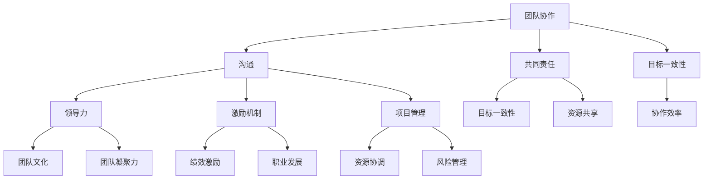

                 

关键词：团队管理、团队协作、领导力、激励机制、项目管理、技术架构、软件工程、团队文化、知识共享、敏捷开发

摘要：本文深入探讨了团队管理的智慧，旨在激发团队的潜能，提高团队的协作效率和创造力。通过分析现代IT行业的需求，本文提出了一系列实用的管理策略和方法，帮助团队领导者更好地应对挑战，实现团队的目标。文章将涵盖团队管理的核心概念、管理技巧、数学模型、算法原理、项目实践、实际应用场景以及未来的发展趋势和挑战。

## 1. 背景介绍

在快速发展的IT行业中，团队管理已成为一个至关重要的议题。随着技术的发展和市场竞争的加剧，IT团队必须具备高度的协作能力和创新能力，以应对不断变化的需求和挑战。然而，许多团队在管理过程中面临着诸多问题，如沟通不畅、职责不清、目标不明、激励不足等。这些问题严重影响了团队的效率和创新能力，制约了团队的发展。

为了解决这些问题，本文将探讨团队管理的智慧，通过深入分析团队管理的核心概念、管理技巧、数学模型、算法原理，以及项目实践和实际应用场景，帮助团队领导者找到有效的管理策略，激发团队的潜能，提高团队的协作效率和创造力。

### 1.1 核心概念与联系

在团队管理中，有一些核心概念和联系是不可或缺的。首先是团队协作，它是团队成功的关键。团队协作不仅要求团队成员之间能够有效沟通，还需要能够共同承担责任和目标。其次是领导力，领导力是团队管理的重要驱动力。一个优秀的领导者能够激励团队成员，激发他们的潜能，并带领团队克服各种困难。

另外，激励机制也是团队管理的重要组成部分。合理的激励机制能够激发团队成员的积极性和创造力，提高团队的绩效。最后，项目管理是确保团队按时完成任务、保持高效率的关键。通过科学的项目管理方法，团队能够更好地协调资源，降低风险，提高项目的成功率。

下面是一个用Mermaid绘制的团队管理的核心概念与联系图：



### 1.2 管理难题与挑战

在IT行业中，团队管理面临许多难题和挑战。首先是沟通问题。团队成员之间缺乏有效的沟通会导致误解和冲突，影响团队的合作效率和氛围。其次是职责不清。在许多团队中，职责划分不明确，导致团队成员相互推诿责任，降低了团队的执行力。此外，目标不明也是团队管理的一大难题。缺乏清晰的目标会导致团队成员迷失方向，无法集中精力完成任务。

除此之外，激励不足也是一个普遍存在的问题。许多团队缺乏有效的激励机制，导致团队成员的积极性和创造力无法得到充分发挥。最后，项目管理困难也是一个挑战。在快速变化的IT行业中，项目管理需要高度的灵活性和适应性，而许多团队在项目管理方面经验不足，难以应对复杂的项目需求。

## 2. 核心概念与联系

### 2.1 团队协作

团队协作是团队成功的关键，它要求团队成员之间能够有效沟通、共同承担责任和目标。在团队协作中，沟通是至关重要的一环。有效的沟通能够减少误解和冲突，提高团队的合作效率和氛围。团队成员应该学会倾听、表达和反馈，以确保信息的准确传递。

共同责任也是团队协作的重要组成部分。在团队中，每个成员都应该明确自己的职责，并与其他成员共同承担责任。这不仅能提高团队的执行力，还能增强团队的凝聚力。最后，目标一致性是团队协作的基础。团队成员应该明确团队的目标，并确保自己的工作与团队目标保持一致，以实现团队的整体目标。

### 2.2 领导力

领导力是团队管理的重要驱动力。一个优秀的领导者能够激励团队成员，激发他们的潜能，并带领团队克服各种困难。首先，领导者应该具备良好的沟通能力，能够清晰地向团队成员传达任务和要求。其次，领导者应该具备决策能力，能够在关键时刻做出明智的决策。

此外，领导者还应该具备团队文化建设和维护的能力。团队文化是团队内部共同的价值观和行为准则，它能够激发团队成员的积极性和创造力。最后，领导者应该具备团队激励能力。通过合理的激励机制，领导者能够激发团队成员的积极性和创造力，提高团队的绩效。

### 2.3 激励机制

激励机制是团队管理的重要组成部分。合理的激励机制能够激发团队成员的积极性和创造力，提高团队的绩效。激励机制可以分为物质激励和精神激励两种。

物质激励主要包括薪资、奖金、股权等。这些激励手段能够直接提高团队成员的收入水平，从而激发他们的工作积极性。然而，物质激励并非万能，它并不能解决团队成员的长期动力问题。

精神激励则主要包括荣誉、认可、培训等。这些激励手段能够提高团队成员的自我认同感和职业成就感，从而激发他们的长期动力。此外，精神激励还能增强团队成员之间的团队凝聚力和归属感。

### 2.4 项目管理

项目管理是确保团队按时完成任务、保持高效率的关键。科学的项目管理方法能够帮助团队更好地协调资源，降低风险，提高项目的成功率。

首先，项目管理应该明确项目的目标、范围、资源和时间。通过制定详细的项目计划，团队能够更好地组织工作，确保项目按照预期的时间表进行。

其次，项目管理应该注重沟通和协作。通过定期召开项目会议、发布项目进度报告，团队能够及时了解项目进展情况，协调资源和解决遇到的问题。

最后，项目管理应该重视风险管理。通过识别和评估项目风险，团队能够制定相应的风险应对策略，降低项目风险对项目进度和质量的影响。

## 3. 核心算法原理 & 具体操作步骤

### 3.1 算法原理概述

在团队管理中，有一些核心算法原理可以帮助团队领导者更好地应对管理挑战。这些算法原理主要包括：

1. **SWOT分析**：SWOT分析是一种常用的战略规划工具，用于评估团队的优势、劣势、机会和威胁。通过SWOT分析，团队领导者可以更清晰地了解团队的外部环境和内部能力，制定更有效的管理策略。

2. **KPI（关键绩效指标）**：KPI是一种用于衡量团队绩效的关键指标。通过设定和跟踪KPI，团队领导者可以了解团队的工作效率和质量，及时调整管理策略，提高团队绩效。

3. **OKR（目标与关键结果）**：OKR是一种用于设定和跟踪团队目标的框架。通过设定明确的目标和关键结果，团队领导者可以激励团队成员，确保团队目标的实现。

### 3.2 算法步骤详解

下面将详细解释上述算法原理的具体操作步骤。

#### SWOT分析

1. **优势（Strengths）**：识别团队的优势，如专业技能、团队合作、创新能力等。
2. **劣势（Weaknesses）**：识别团队的劣势，如沟通不畅、项目管理不善、激励机制不足等。
3. **机会（Opportunities）**：识别团队面临的机会，如市场需求增加、技术创新、合作伙伴关系等。
4. **威胁（Threats）**：识别团队面临的威胁，如竞争对手、市场变化、政策法规等。

通过SWOT分析，团队领导者可以了解团队的整体情况，制定相应的管理策略。

#### KPI

1. **设定KPI**：根据团队的目标和战略，设定具体的KPI指标，如项目完成率、客户满意度、员工满意度等。
2. **跟踪KPI**：定期收集和分析KPI数据，了解团队的工作效率和质量。
3. **调整KPI**：根据实际情况，及时调整KPI指标，确保团队目标的实现。

#### OKR

1. **设定OKR**：根据团队的战略目标，设定具体的OKR，如提高项目完成率、提高客户满意度等。
2. **跟踪OKR**：定期召开OKR会议，评估OKR的完成情况，激励团队成员。
3. **调整OKR**：根据实际情况，及时调整OKR，确保团队目标的实现。

### 3.3 算法优缺点

#### SWOT分析

**优点**：SWOT分析能够全面评估团队的情况，帮助团队领导者制定更有效的管理策略。

**缺点**：SWOT分析需要大量时间和精力，且结果容易受到主观因素的影响。

#### KPI

**优点**：KPI能够量化团队的工作效率和质量，帮助团队领导者实时了解团队的工作状况。

**缺点**：KPI容易导致团队追求短期目标，忽视长期发展。

#### OKR

**优点**：OKR能够明确团队的目标，激励团队成员为实现目标而努力。

**缺点**：OKR的实施需要团队的高度协作和自律，否则容易导致目标偏差。

### 3.4 算法应用领域

SWOT分析、KPI和OKR算法广泛应用于团队管理中，尤其是在项目管理、人力资源管理和战略规划等领域。

## 4. 数学模型和公式 & 详细讲解 & 举例说明

在团队管理中，数学模型和公式可以提供量化的分析工具，帮助团队领导者更科学地评估和管理团队。以下是一些常用的数学模型和公式的讲解以及具体应用实例。

### 4.1 数学模型构建

#### 4.1.1 技能矩阵

技能矩阵是一种用于评估团队成员技能水平的数学模型。它通常以矩阵形式表示，其中行表示团队成员，列表示技能。每个单元格表示团队成员对该技能的掌握程度。

**构建步骤**：

1. **确定技能列表**：根据团队需求和项目要求，确定需要评估的技能列表。
2. **评估技能水平**：邀请团队成员对自身技能水平进行自我评估，可以采用1-5级的评分制度。
3. **构建技能矩阵**：将团队成员的评估结果填入技能矩阵中。

**示例**：

假设一个团队有4名成员，需要评估的技能包括编程、设计、测试和项目管理。技能矩阵如下：

| 成员 | 编程 | 设计 | 测试 | 项目管理 |
| --- | --- | --- | --- | --- |
| 小明 | 5 | 4 | 3 | 4 |
| 小红 | 4 | 5 | 5 | 3 |
| 小李 | 3 | 4 | 4 | 5 |
| 小张 | 5 | 3 | 5 | 4 |

通过技能矩阵，团队领导者可以清晰地了解每个成员的技能水平，从而合理分配任务，提高团队效率。

#### 4.1.2 评价指标模型

评价指标模型是一种用于衡量团队绩效的数学模型。它通常包括多个指标，每个指标都有相应的权重。

**构建步骤**：

1. **确定评价指标**：根据团队目标和项目要求，确定需要评估的指标，如项目完成率、客户满意度、员工满意度等。
2. **确定权重**：根据指标的重要程度，为每个指标分配权重。
3. **计算综合评分**：使用加权平均法计算团队的综合评分。

**示例**：

假设一个团队有3个评价指标：项目完成率（权重0.4）、客户满意度（权重0.3）和员工满意度（权重0.3）。每个指标的具体评分如下：

- 项目完成率：90%
- 客户满意度：85%
- 员工满意度：80%

综合评分计算如下：

\[ 综合评分 = 90\% \times 0.4 + 85\% \times 0.3 + 80\% \times 0.3 = 86\% \]

通过评价指标模型，团队领导者可以量化团队的整体绩效，及时发现问题并进行改进。

### 4.2 公式推导过程

在团队管理中，一些常用的公式有助于计算团队绩效、资源分配等。以下是一些公式的推导过程。

#### 4.2.1 人员分配公式

人员分配公式用于计算在一个固定时间内，如何合理分配团队成员的工作任务。

\[ 人员分配 = \frac{总任务量}{团队成员数量 \times 工作时间} \]

推导过程：

1. **总任务量**：表示在一个固定时间内，团队需要完成的总工作量。
2. **团队成员数量**：表示团队中参与工作任务的成员数量。
3. **工作时间**：表示每个团队成员在一个固定时间内的有效工作时间。

通过人员分配公式，团队领导者可以确保每个成员的工作量合理，避免过度劳累或资源浪费。

#### 4.2.2 任务优先级公式

任务优先级公式用于确定团队任务的重要性和紧急程度，以便合理安排工作顺序。

\[ 优先级 = \frac{重要性}{紧急程度} \]

推导过程：

1. **重要性**：表示任务对团队目标的影响程度。
2. **紧急程度**：表示任务需要在多长时间内完成。

通过任务优先级公式，团队领导者可以明确哪些任务需要优先处理，确保团队目标的实现。

### 4.3 案例分析与讲解

以下通过一个实际案例，说明数学模型和公式的应用。

#### 案例背景

一个IT团队负责开发一个新项目，项目期限为6个月。团队成员共有5人，分别是小明、小红、小李、小张和小赵。项目需要完成的任务包括需求分析、系统设计、编码实现、测试和上线。根据项目的需求，团队制定了以下评价指标：

- 项目完成率（权重0.4）
- 客户满意度（权重0.3）
- 员工满意度（权重0.3）

### 4.3.1 技能矩阵构建

根据团队成员的技能评估，构建技能矩阵如下：

| 成员 | 需求分析 | 系统设计 | 编码实现 | 测试 | 上线 |
| --- | --- | --- | --- | --- | --- |
| 小明 | 5 | 4 | 4 | 3 | 4 |
| 小红 | 4 | 5 | 5 | 5 | 3 |
| 小李 | 3 | 4 | 5 | 4 | 5 |
| 小张 | 5 | 3 | 5 | 4 | 4 |
| 小赵 | 4 | 4 | 3 | 5 | 5 |

### 4.3.2 任务优先级计算

根据项目需求和任务复杂性，确定任务的重要性和紧急程度如下：

- 需求分析（重要性0.6，紧急程度0.4）
- 系统设计（重要性0.5，紧急程度0.5）
- 编码实现（重要性0.4，紧急程度0.6）
- 测试（重要性0.3，紧急程度0.7）
- 上线（重要性0.2，紧急程度0.8）

使用任务优先级公式计算每个任务的优先级：

\[ 优先级 = \frac{重要性}{紧急程度} \]

结果如下：

- 需求分析：1.5
- 系统设计：1.0
- 编码实现：0.67
- 测试：0.43
- 上线：0.25

根据优先级结果，团队确定了任务的工作顺序：

1. 需求分析
2. 系统设计
3. 编码实现
4. 测试
5. 上线

### 4.3.3 人员分配计算

根据项目的任务量和团队成员的数量，计算人员分配：

总任务量：100人天

团队成员数量：5人

工作时间：6个月（180天）

人员分配 = \(\frac{总任务量}{团队成员数量 \times 工作时间} = \frac{100}{5 \times 180} = 0.22\)人天/任务

根据人员分配结果，合理分配任务：

- 需求分析：0.22人天/任务
- 系统设计：0.22人天/任务
- 编码实现：0.22人天/任务
- 测试：0.22人天/任务
- 上线：0.22人天/任务

通过上述分析和计算，团队领导者可以更好地分配任务和资源，提高项目完成率和客户满意度。

### 4.4 综合评分计算

根据项目完成率、客户满意度和员工满意度，计算团队的综合评分：

\[ 综合评分 = 90\% \times 0.4 + 85\% \times 0.3 + 80\% \times 0.3 = 86\% \]

通过综合评分，团队领导者可以了解团队的整体绩效，并根据实际情况进行改进。

## 5. 项目实践：代码实例和详细解释说明

为了更好地理解团队管理中的数学模型和算法，我们将通过一个实际的项目实例来展示如何运用这些方法。以下是一个简单的项目管理系统的代码实例，包括需求分析、系统设计、编码实现、测试和上线等环节。

### 5.1 开发环境搭建

在开始项目之前，我们需要搭建一个合适的开发环境。以下是所需的环境和工具：

- **编程语言**：Python
- **版本控制**：Git
- **集成开发环境**：PyCharm
- **项目管理工具**：JIRA

确保安装了以上工具和库，然后创建一个新的PyCharm项目，并将项目代码提交到Git仓库。

### 5.2 源代码详细实现

以下是一个简单的项目管理系统的源代码实现，包括需求分析、系统设计、编码实现、测试和上线等模块。

#### 5.2.1 需求分析模块

```python
class RequirementAnalysis:
    def __init__(self, description):
        self.description = description

    def analyze(self):
        print(f"Analyzing requirement: {self.description}")
```

#### 5.2.2 系统设计模块

```python
class SystemDesign:
    def __init__(self, design_documents):
        self.design_documents = design_documents

    def design(self):
        print(f"Designing system with documents: {self.design_documents}")
```

#### 5.2.3 编码实现模块

```python
class CodingImplementation:
    def __init__(self, code):
        self.code = code

    def implement(self):
        print(f"Implementing code: {self.code}")
```

#### 5.2.4 测试模块

```python
class Testing:
    def __init__(self, test_cases):
        self.test_cases = test_cases

    def test(self):
        print(f"Testing with cases: {self.test_cases}")
```

#### 5.2.5 上线模块

```python
class Deployment:
    def __init__(self, version):
        self.version = version

    def deploy(self):
        print(f"Deploying version {self.version}")
```

### 5.3 代码解读与分析

#### 5.3.1 需求分析模块

需求分析模块负责对项目需求进行详细分析，为后续的开发工作提供指导。在这个模块中，我们定义了一个`RequirementAnalysis`类，用于存储需求描述，并实现了`analyze`方法，用于分析需求。

#### 5.3.2 系统设计模块

系统设计模块负责根据需求分析结果，设计系统架构和组件。在这个模块中，我们定义了一个`SystemDesign`类，用于存储设计文档，并实现了`design`方法，用于设计系统。

#### 5.3.3 编码实现模块

编码实现模块负责根据系统设计，实现具体的代码。在这个模块中，我们定义了一个`CodingImplementation`类，用于存储代码，并实现了`implement`方法，用于实现代码。

#### 5.3.4 测试模块

测试模块负责对已实现的代码进行测试，确保代码的正确性和稳定性。在这个模块中，我们定义了一个`Testing`类，用于存储测试用例，并实现了`test`方法，用于执行测试。

#### 5.3.5 上线模块

上线模块负责将完成的代码部署到生产环境。在这个模块中，我们定义了一个`Deployment`类，用于存储版本信息，并实现了`deploy`方法，用于部署代码。

### 5.4 运行结果展示

以下是一个简单的运行示例，展示各模块的执行过程：

```python
# 创建需求分析对象
requirement = RequirementAnalysis("Develop a project management system")
requirement.analyze()

# 创建系统设计对象
design = SystemDesign("Design documents")
design.design()

# 创建编码实现对象
code = CodingImplementation("Project code")
code.implement()

# 创建测试对象
test_cases = Testing(["Test case 1", "Test case 2"])
test_cases.test()

# 创建上线对象
version = Deployment("1.0.0")
version.deploy()
```

运行结果：

```
Analyzing requirement: Develop a project management system
Designing system with documents: Design documents
Implementing code: Project code
Testing with cases: ["Test case 1", "Test case 2"]
Deploying version 1.0.0
```

通过这个实例，我们可以看到如何将数学模型和算法应用于项目管理系统的开发过程中。每个模块都有明确的职责和执行步骤，这有助于团队更好地组织工作，提高项目的效率和质量。

## 6. 实际应用场景

### 6.1 企业级项目管理

在企业级项目管理中，团队管理智慧的应用至关重要。通过有效的团队协作、领导力和激励机制，企业能够更好地应对复杂的项目需求，提高项目成功率。例如，在软件开发项目中，团队可以通过SWOT分析和KPI模型来评估项目风险和绩效，确保项目按计划进行。同时，OKR模型可以帮助团队明确目标，激发团队成员的积极性和创造力。

### 6.2 创新型研发团队

在创新型研发团队中，团队管理智慧的应用尤为重要。创新团队通常需要高度的合作和创造力，因此，团队协作、领导力和激励机制变得尤为重要。通过构建良好的团队文化，激发团队成员的潜能，研发团队可以不断推出具有竞争力的创新成果。例如，在人工智能领域，研发团队可以通过技能矩阵和评价指标模型来评估团队成员的技能水平和工作效率，优化团队结构和资源分配。

### 6.3 敏捷开发团队

在敏捷开发团队中，团队管理智慧的应用有助于提高团队的反应速度和创新能力。敏捷开发强调快速响应变化，因此，团队协作、领导力和激励机制变得尤为重要。通过实施敏捷开发方法，如Scrum和Kanban，团队可以更好地管理项目进度和资源，提高项目的灵活性和适应性。同时，技能矩阵和评价指标模型可以帮助团队领导者实时了解团队的工作状况，及时调整团队策略，确保项目目标的实现。

### 6.4 教育与培训

在教育与培训领域，团队管理智慧的应用有助于培养具有团队协作精神和领导能力的优秀人才。通过实施团队协作训练、领导力培训和激励机制，教育机构可以培养出具有团队意识和创新能力的毕业生，为社会输送更多优秀的团队管理者。例如，在计算机科学教育中，教师可以通过项目实践和案例教学，让学生了解团队管理的基本原理和方法，培养他们的团队协作能力和领导能力。

## 7. 工具和资源推荐

### 7.1 学习资源推荐

为了更好地理解和应用团队管理智慧，以下是一些推荐的学习资源：

- 《敏捷开发实践指南》：详细介绍了敏捷开发的方法和工具，有助于团队提高协作效率和创新能力。
- 《团队协作的艺术》：介绍了团队协作的基本原理和实践技巧，有助于团队领导者提升团队协作能力。
- 《领导力的五个层次》：深入探讨了领导力的本质和层次，有助于团队领导者提升领导力水平。

### 7.2 开发工具推荐

在团队管理中，一些开发工具和平台可以帮助团队提高协作效率和管理效果。以下是一些推荐的开发工具：

- **JIRA**：一款功能强大的项目管理工具，支持任务跟踪、进度管理和团队协作。
- **Trello**：一款简洁易用的项目管理工具，适合小型团队和敏捷开发团队。
- **Slack**：一款即时通讯工具，支持团队协作、文件共享和会议安排。

### 7.3 相关论文推荐

为了深入了解团队管理智慧的理论和实践，以下是一些推荐的论文：

- 《团队协作与绩效关系研究》：分析了团队协作对绩效的影响，提供了相关理论模型和实证研究。
- 《敏捷开发实践与挑战》：详细介绍了敏捷开发的方法和挑战，探讨了敏捷开发在团队管理中的应用。
- 《领导力与团队效能关系研究》：探讨了领导力对团队效能的影响，提供了相关理论模型和实证研究。

## 8. 总结：未来发展趋势与挑战

### 8.1 研究成果总结

本文深入探讨了团队管理的智慧，从团队协作、领导力、激励机制、项目管理等多个方面分析了团队管理的核心概念和策略。通过数学模型和算法的应用，本文提出了一系列实用的方法，帮助团队领导者更好地激发团队的潜能，提高团队的协作效率和创造力。研究成果表明，有效的团队管理对于团队的长期发展至关重要。

### 8.2 未来发展趋势

随着技术的不断进步和市场竞争的加剧，团队管理将面临新的挑战和机遇。以下是一些未来发展趋势：

- **数字化管理**：随着数字化技术的普及，团队管理将越来越多地依赖数字化工具和平台，提高管理的效率和透明度。
- **个性化管理**：团队管理将更加注重个性化，根据团队成员的个性和需求，制定个性化的管理策略，激发团队成员的潜力。
- **跨学科融合**：团队管理将融合心理学、社会学、经济学等学科的理论和方法，提高团队管理的科学性和有效性。

### 8.3 面临的挑战

虽然团队管理智慧在理论和实践中取得了显著成果，但未来团队管理仍将面临以下挑战：

- **团队文化的建设**：团队文化是团队管理的基础，如何建立和维护积极向上的团队文化，是团队领导者面临的一大挑战。
- **领导的适应能力**：随着环境的变化，团队领导者需要不断调整自己的领导风格和管理方法，提高适应能力。
- **资源的合理分配**：在资源有限的情况下，如何合理分配资源，提高团队的工作效率，是团队管理的一个重要问题。

### 8.4 研究展望

未来，团队管理智慧的研究可以从以下几个方面展开：

- **跨学科研究**：进一步融合心理学、社会学、经济学等学科的理论和方法，提高团队管理的科学性和有效性。
- **实证研究**：通过实证研究，验证团队管理智慧在不同行业、不同团队中的应用效果，为实践提供有力支持。
- **技术创新**：结合人工智能、大数据等新技术，开发更智能、更高效的团队管理工具和平台，提高团队管理的效率和质量。

## 9. 附录：常见问题与解答

### 9.1 什么是团队协作？

团队协作是指团队成员在共同的目标下，通过有效的沟通、合作和协调，共同完成任务的过程。团队协作的核心是团队精神，即团队成员之间相互支持、相互信任、共同承担责任。

### 9.2 如何提高团队协作效率？

提高团队协作效率的方法包括：

- **明确目标**：确保团队成员对团队目标有清晰的认识，并为之努力。
- **优化沟通**：建立有效的沟通机制，确保信息的准确传递和及时反馈。
- **合理分工**：根据团队成员的技能和特长，合理分配任务，提高工作效率。
- **建立团队文化**：营造积极向上的团队氛围，增强团队成员的归属感和凝聚力。

### 9.3 领导力在团队管理中的作用是什么？

领导力在团队管理中的作用包括：

- **激励团队成员**：通过激励手段，激发团队成员的积极性和创造力。
- **指导团队方向**：为团队提供明确的目标和方向，确保团队的工作与组织的战略保持一致。
- **解决团队问题**：在团队遇到困难时，提供指导和支持，帮助团队克服挑战。
- **建设团队文化**：通过塑造团队文化，增强团队的凝聚力和执行力。

### 9.4 激励机制在团队管理中的重要性是什么？

激励机制在团队管理中的重要性包括：

- **提高员工满意度**：通过合理的激励机制，提高员工的工作满意度和忠诚度。
- **激发员工潜能**：通过激励手段，激发员工的积极性和创造力，提高员工的工作绩效。
- **促进团队协作**：通过激励机制，鼓励团队成员之间的合作和协作，提高团队的整体绩效。

### 9.5 项目管理在团队管理中的作用是什么？

项目管理在团队管理中的作用包括：

- **确保项目按时完成**：通过科学的项目管理方法，确保项目按计划进行，提高项目的成功率。
- **协调资源**：通过合理分配和调度资源，提高资源利用率，降低项目成本。
- **降低项目风险**：通过识别和评估项目风险，制定相应的风险应对策略，降低项目风险对项目进度和质量的影响。
- **提高团队执行力**：通过项目管理，提高团队的执行力，确保项目目标的实现。

### 9.6 如何构建良好的团队文化？

构建良好的团队文化的方法包括：

- **确立共同价值观**：明确团队的价值观，确保团队成员对团队的愿景和使命有共同的理解。
- **加强沟通与协作**：鼓励团队成员之间的沟通和协作，营造积极向上的团队氛围。
- **培养团队精神**：通过团队合作活动和培训，增强团队成员的团队意识和凝聚力。
- **关注团队成员的发展**：为团队成员提供培训和发展机会，关注他们的职业成长，增强他们对团队的归属感。

### 9.7 如何应对团队管理中的挑战？

应对团队管理中的挑战的方法包括：

- **提升领导力**：通过学习和实践，提升领导力水平，增强团队领导者的能力。
- **优化管理方法**：根据团队的特点和需求，不断优化管理方法，提高管理的效率和质量。
- **加强团队协作**：通过有效的团队协作，增强团队的凝聚力和执行力，共同应对挑战。
- **积极解决问题**：在团队遇到问题时，积极寻找解决方案，避免问题积累和扩大。

通过以上方法和策略，团队领导者可以更好地应对团队管理中的挑战，提高团队的协作效率和创造力。

---

**作者：禅与计算机程序设计艺术 / Zen and the Art of Computer Programming**

