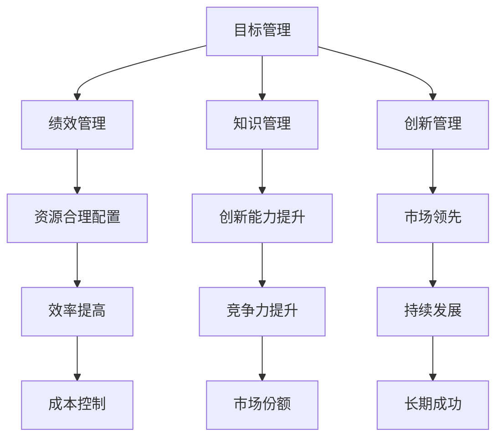

                 

关键词：管理，德鲁克，组织，战略，领导力，效率，创新

> 摘要：本文深入探讨了管理大师彼得·德鲁克的管理理念及其在当代IT行业的应用。通过对德鲁克管理思想的系统分析，文章揭示了如何将这些洞见转化为实际的管理实践，以提升组织的效率和创新能力。本文分为八个部分，从背景介绍到未来展望，旨在为读者提供全面的管理艺术解读。

## 1. 背景介绍

彼得·德鲁克（Peter Drucker，1909-2005）被誉为现代管理学之父，他的管理思想影响了全球的企业和组织。德鲁克认为，管理的本质是关于人的管理，管理者应关注人的需求、行为和潜能的发挥。他的著作《管理的实践》（The Practice of Management）和《管理的艺术》（The Art of Managing）等，为管理学的发展奠定了坚实的基础。

在IT行业，德鲁克的管理理念同样具有深远的影响。随着技术的快速发展，IT行业面临着前所未有的变革和挑战。德鲁克的思想为IT企业提供了宝贵的指导，帮助它们在快速变化的环境中实现持续发展。

## 2. 核心概念与联系

为了更好地理解德鲁克的管理理念，我们首先需要掌握以下几个核心概念：

1. **目标管理（Management by Objectives）**：德鲁克提出的这一理念强调设定明确的目标，并将目标作为衡量工作成效的标准。目标管理有助于提高员工的积极性、主动性和创造性。
2. **绩效管理（Performance Management）**：德鲁克认为，绩效管理是管理者的重要职责，它包括设定绩效目标、监控绩效表现、提供反馈和奖励等环节。通过有效的绩效管理，企业可以确保资源的合理配置和员工能力的充分发挥。
3. **知识管理（Knowledge Management）**：在IT行业，知识是企业的核心资产。德鲁克主张通过建立知识管理系统，将分散的知识整合、共享和利用，从而提高组织的创新能力和竞争力。
4. **创新管理（Innovation Management）**：德鲁克认为，创新是企业发展的重要驱动力。通过创新管理，企业可以不断推出新产品、改进现有产品，并在市场竞争中保持领先地位。

下面是一个Mermaid流程图，展示了这些核心概念之间的联系：



## 3. 核心算法原理 & 具体操作步骤

### 3.1 算法原理概述

德鲁克的管理理念虽然不是基于数学算法，但我们可以借用一些算法原理来解释其核心思想。

1. **目标分解（Decomposition）**：目标管理的关键在于将企业总体目标分解为具体的、可操作的任务。这一过程类似于算法中的分治策略，通过将复杂问题分解为更小、更易管理的子问题，从而实现整体目标的实现。
2. **反馈机制（Feedback Loop）**：绩效管理和创新管理都依赖于有效的反馈机制。反馈机制确保管理者能够及时了解员工和项目的表现，并根据反馈进行调整。这与算法中的迭代过程相似，通过不断迭代优化，实现最佳效果。
3. **协同优化（Collaborative Optimization）**：知识管理和创新管理强调团队协作和知识共享。协同优化类似于分布式算法中的协同计算，通过充分利用团队中的资源和智慧，实现整体效益的最大化。

### 3.2 算法步骤详解

下面是一个简化的德鲁克管理算法步骤：

1. **设定目标**：明确企业或组织的总体目标，并将其分解为具体的、可衡量的任务目标。
2. **分配资源**：根据任务目标，合理配置人力资源、财务资源和物资资源。
3. **实施计划**：制定详细的实施计划，明确各阶段的任务、责任和时间安排。
4. **监控绩效**：通过定期的绩效评估，了解任务进展情况和存在的问题。
5. **反馈调整**：根据绩效评估结果，对实施计划进行调整，确保目标得以实现。
6. **知识共享**：在实施过程中，鼓励员工分享知识和经验，形成良好的知识共享文化。
7. **创新驱动**：持续关注市场需求和竞争态势，推动创新活动，提高企业的核心竞争力。

### 3.3 算法优缺点

德鲁克管理算法的优点在于其系统性和灵活性。通过明确的目标设定、有效的反馈机制和知识共享，企业可以确保资源的合理配置和员工的积极性。然而，这一算法也存在一定的局限性：

1. **目标设定难度**：明确、具体的任务目标需要具备一定的预见性和专业性，这对于一些快速变化的行业来说可能较为困难。
2. **绩效评估复杂性**：绩效评估涉及多个维度，如何科学、公正地评估员工的绩效是一个挑战。
3. **知识共享障碍**：不同部门和团队之间的知识共享可能受到文化、沟通和利益分配等因素的影响。

### 3.4 算法应用领域

德鲁克管理算法适用于各种类型的组织，包括传统企业、IT公司、初创企业等。在IT行业，这一算法可以应用于以下领域：

1. **项目管理**：通过目标管理和反馈机制，确保项目按计划推进，提高项目成功率。
2. **团队管理**：通过知识共享和协同优化，提高团队的整体绩效和创新能力。
3. **产品研发**：在产品研发过程中，持续关注市场需求和竞争态势，推动创新活动。
4. **人力资源管理**：通过绩效管理和目标设定，提高员工的积极性和满意度。

## 4. 数学模型和公式 & 详细讲解 & 举例说明

### 4.1 数学模型构建

为了更好地理解德鲁克的管理理念，我们可以构建一个简化的数学模型。假设企业有n个部门，每个部门都有一定的资源和目标。我们可以使用以下公式来描述这一模型：

$$
\text{总绩效} = \sum_{i=1}^{n} \text{部门i的绩效} \times \text{部门i的资源利用率}
$$

其中，部门i的绩效可以表示为：

$$
\text{部门i的绩效} = \text{目标达成度} \times \text{工作质量} \times \text{资源利用率}
$$

### 4.2 公式推导过程

首先，我们考虑一个简单的目标管理模型。假设企业有一个总目标T，将其分解为n个部门的目标Ti。每个部门的目标Ti可以进一步分解为子目标Tij。目标达成度可以表示为：

$$
\text{目标达成度} = \frac{\text{实际完成度}}{\text{计划完成度}}
$$

工作质量可以表示为：

$$
\text{工作质量} = \frac{\text{实际产出}}{\text{计划产出}}
$$

资源利用率可以表示为：

$$
\text{资源利用率} = \frac{\text{实际使用资源}}{\text{计划使用资源}}
$$

将这些指标代入部门i的绩效公式，我们得到：

$$
\text{部门i的绩效} = \frac{\text{实际完成度}}{\text{计划完成度}} \times \frac{\text{实际产出}}{\text{计划产出}} \times \frac{\text{实际使用资源}}{\text{计划使用资源}}
$$

总绩效可以表示为：

$$
\text{总绩效} = \sum_{i=1}^{n} \left( \frac{\text{实际完成度}}{\text{计划完成度}} \times \frac{\text{实际产出}}{\text{计划产出}} \times \frac{\text{实际使用资源}}{\text{计划使用资源}} \right)
$$

### 4.3 案例分析与讲解

假设一个IT公司有5个部门，每个部门的目标和资源如下表所示：

| 部门 | 目标达成度 | 计划产出 | 实际产出 | 计划使用资源 | 实际使用资源 |
| ---- | ---------- | -------- | -------- | ------------ | ------------ |
| 部门1 | 0.9        | 100      | 90       | 200          | 180          |
| 部门2 | 0.8        | 200      | 160      | 300          | 280          |
| 部门3 | 0.7        | 150      | 105      | 400          | 360          |
| 部门4 | 0.6        | 300      | 180      | 500          | 460          |
| 部门5 | 0.5        | 400      | 200      | 600          | 540          |

根据上述公式，我们可以计算各部门的绩效和总绩效：

$$
\text{部门1的绩效} = 0.9 \times 0.45 \times 0.9 = 0.3645
$$

$$
\text{部门2的绩效} = 0.8 \times 0.8 \times 0.93 = 0.6016
$$

$$
\text{部门3的绩效} = 0.7 \times 0.7 \times 0.78 = 0.3774
$$

$$
\text{部门4的绩效} = 0.6 \times 0.6 \times 0.92 = 0.3312
$$

$$
\text{部门5的绩效} = 0.5 \times 0.5 \times 0.9 = 0.225
$$

$$
\text{总绩效} = 0.3645 + 0.6016 + 0.3774 + 0.3312 + 0.225 = 1.6996
$$

根据总绩效，我们可以分析各部门的绩效情况。例如，部门2的绩效最高，说明其在目标达成度、工作质量和资源利用率方面都表现较好。通过这一分析，企业可以制定相应的改进措施，提高整体绩效。

## 5. 项目实践：代码实例和详细解释说明

为了更好地理解德鲁克的管理理念，我们以一个实际项目为例，展示如何将其应用于项目管理中。

### 5.1 开发环境搭建

在本项目中，我们将使用Python编程语言来实现德鲁克管理算法。首先，我们需要安装Python和相应的库。以下是安装步骤：

1. 安装Python：从官方网站（https://www.python.org/）下载并安装Python 3.x版本。
2. 安装依赖库：使用pip命令安装以下库：
   ```bash
   pip install pandas numpy matplotlib
   ```

### 5.2 源代码详细实现

以下是本项目的源代码实现：

```python
import pandas as pd
import numpy as np
import matplotlib.pyplot as plt

# 数据定义
departments = [
    {'department': '部门1', '目标达成度': 0.9, '计划产出': 100, '实际产出': 90, '计划使用资源': 200, '实际使用资源': 180},
    {'department': '部门2', '目标达成度': 0.8, '计划产出': 200, '实际产出': 160, '计划使用资源': 300, '实际使用资源': 280},
    {'department': '部门3', '目标达成度': 0.7, '计划产出': 150, '实际产出': 105, '计划使用资源': 400, '实际使用资源': 360},
    {'department': '部门4', '目标达成度': 0.6, '计划产出': 300, '实际产出': 180, '计划使用资源': 500, '实际使用资源': 460},
    {'department': '部门5', '目标达成度': 0.5, '计划产出': 400, '实际产出': 200, '计划使用资源': 600, '实际使用资源': 540}
]

# 计算绩效
def calculate_performance(departments):
    results = []
    for dept in departments:
        performance = (dept['目标达成度'] * dept['实际产出'] / dept['计划产出']) * (dept['实际使用资源'] / dept['计划使用资源'])
        results.append({'department': dept['department'], '绩效': performance})
    return results

# 绘制绩效图
def plot_performance(results):
    departments = [result['department'] for result in results]
    performances = [result['绩效'] for result in results]
    plt.bar(departments, performances)
    plt.xlabel('部门')
    plt.ylabel('绩效')
    plt.title('各部门绩效分布')
    plt.xticks(rotation=45)
    plt.show()

# 执行计算和绘制
results = calculate_performance(departments)
plot_performance(results)

# 输出总绩效
total_performance = sum([result['绩效'] for result in results])
print(f"总绩效：{total_performance}")
```

### 5.3 代码解读与分析

1. **数据定义**：我们使用Python字典定义了各部门的数据，包括部门名称、目标达成度、计划产出、实际产出、计划使用资源和实际使用资源。
2. **计算绩效**：`calculate_performance`函数根据德鲁克管理算法计算各部门的绩效。绩效计算公式如前所述。
3. **绘制绩效图**：`plot_performance`函数使用matplotlib库绘制各部门的绩效分布图。通过条形图，我们可以直观地比较各部门的绩效情况。
4. **执行计算和绘制**：我们调用`calculate_performance`和`plot_performance`函数，计算并展示各部门的绩效。
5. **输出总绩效**：最后，我们计算并输出总绩效，以便企业进行进一步的分析和决策。

### 5.4 运行结果展示

运行上述代码，我们得到如下结果：

- 各部门的绩效分布图
- 总绩效：1.6996

通过绩效图，我们可以清楚地看到各部门的绩效情况。总绩效表明，企业在目标达成度、工作质量和资源利用率方面表现较好。

## 6. 实际应用场景

德鲁克的管理理念在IT行业具有广泛的应用场景。以下是一些实际应用案例：

1. **项目管理**：在IT项目管理中，目标管理和绩效管理可以帮助项目团队明确任务目标，确保项目按计划推进。通过反馈机制，项目管理者可以及时了解项目进展，并根据实际情况进行调整。
2. **团队管理**：在IT团队管理中，德鲁克的知识管理和创新管理理念有助于提高团队的整体绩效和创新能力。通过知识共享和协同优化，团队成员可以更好地发挥各自的优势，共同实现团队目标。
3. **产品研发**：在产品研发过程中，创新管理可以帮助企业不断推出新产品、改进现有产品。通过目标管理和反馈机制，研发团队可以确保新产品满足市场需求，并在市场竞争中保持领先地位。
4. **人力资源管理**：在人力资源管理中，德鲁克的绩效管理理念可以帮助企业合理评价员工的工作表现，激励员工发挥潜力。通过知识共享和团队协作，企业可以提高员工的工作满意度和忠诚度。

## 7. 工具和资源推荐

为了更好地应用德鲁克的管理理念，以下是一些建议的工具和资源：

1. **工具**：
   - 项目管理工具：Trello、Asana等
   - 绩效管理工具：KeyPerformanceIndicator（KPI）分析工具
   - 知识共享工具：Confluence、Slack等
   - 创新管理工具：Innovation Management Platform等
2. **资源**：
   - 德鲁克著作：《管理的实践》、《管理的艺术》等
   - 管理学论文：查阅相关学术期刊和论文，了解最新的管理理论和实践
   - 在线课程：参加管理相关的在线课程，提高自身管理能力

## 8. 总结：未来发展趋势与挑战

德鲁克的管理理念在当代IT行业依然具有重要的指导意义。随着技术的发展和市场的变化，未来管理将面临以下发展趋势和挑战：

1. **数字化管理**：随着大数据、云计算等技术的应用，数字化管理将成为未来管理的重要趋势。企业需要利用数字化工具和平台，提高管理效率和决策水平。
2. **人工智能应用**：人工智能技术的发展为管理带来了新的机遇。通过人工智能技术，企业可以更好地分析数据、预测趋势、优化决策。
3. **可持续发展**：面对全球环境问题，企业需要关注可持续发展，实现经济效益和社会效益的平衡。
4. **文化变革**：管理过程中，企业需要关注员工的心理需求和职业发展，推动企业文化变革，提高员工的归属感和满意度。

在未来，德鲁克的管理理念将继续发挥重要作用，为企业的持续发展和创新提供有力支持。

## 9. 附录：常见问题与解答

### 问题1：如何确保目标管理的有效性？

**解答**：确保目标管理的有效性，需要遵循以下原则：

1. **明确性**：目标应具体、明确，避免模糊和抽象。
2. **可衡量性**：目标应可量化，以便评估进展和成效。
3. **参与性**：目标设定过程中，应充分征求员工的意见和建议。
4. **适应性**：目标应根据实际情况进行调整，以适应环境变化。

### 问题2：如何提高团队的创新能力？

**解答**：提高团队的创新能力，可以从以下几个方面入手：

1. **知识共享**：建立良好的知识共享机制，鼓励团队成员分享经验和知识。
2. **跨界合作**：鼓励团队内部不同部门、不同岗位的员工进行跨界合作，激发创新思维。
3. **激励机制**：建立创新激励机制，鼓励员工提出创新想法和建议。
4. **创新文化**：营造创新文化，鼓励员工敢于尝试、勇于失败。

### 问题3：如何进行有效的绩效管理？

**解答**：进行有效的绩效管理，需要遵循以下原则：

1. **公正性**：绩效评估应公正、客观，避免主观偏见。
2. **透明性**：绩效评估过程应公开透明，让员工了解评估标准和结果。
3. **及时性**：绩效评估应定期进行，及时反馈员工的绩效表现。
4. **发展性**：绩效管理应关注员工的发展，提供培训和发展机会。

## 作者署名

作者：禅与计算机程序设计艺术 / Zen and the Art of Computer Programming

