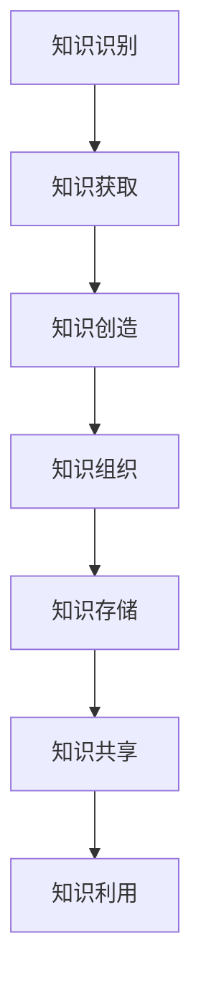

                 

关键词：个人知识管理系统、管理者、知识管理、信息组织、学习与成长、技术工具、实践应用

> 摘要：本文旨在探讨管理者如何建立个人知识管理系统。我们将深入分析知识管理的核心概念、构建个人知识管理系统的关键步骤，以及相关的数学模型、公式和实践应用。同时，我们将推荐一些实用的工具和资源，并总结未来的发展趋势与挑战，为管理者提供全面的知识管理策略。

## 1. 背景介绍

在当今快速变化和竞争激烈的市场环境中，管理者面临着前所未有的挑战。知识已成为企业最重要的资产之一，如何有效地管理和利用知识，成为了管理者必须面对的问题。个人知识管理系统（PKMS）作为知识管理的重要组成部分，可以帮助管理者更好地收集、组织、存储和应用知识，从而提高决策效率、促进团队协作和实现持续学习。

### 1.1 个人知识管理系统的重要性

个人知识管理系统对管理者的重要性体现在以下几个方面：

1. **提高决策效率**：通过系统化的知识管理，管理者可以迅速获取所需信息，减少信息检索时间，从而提高决策效率。
2. **促进团队协作**：个人知识管理系统可以作为一个信息共享的平台，促进团队成员之间的知识交流和协作。
3. **支持持续学习**：通过不断积累和更新知识，管理者可以保持专业领域的竞争力，适应不断变化的市场需求。

### 1.2 个人知识管理系统的发展趋势

随着信息技术的不断发展，个人知识管理系统也在不断演进。以下是当前个人知识管理系统的发展趋势：

1. **智能化**：利用人工智能技术，个人知识管理系统可以实现自动化的知识分类、索引和推荐。
2. **移动化**：随着移动设备的普及，个人知识管理系统逐渐向移动端延伸，便于管理者随时随地进行知识管理和学习。
3. **社会化**：社会化知识管理使得管理者可以通过社交媒体等工具，与他人分享知识和经验，实现知识的社会化传播。

## 2. 核心概念与联系

为了更好地理解个人知识管理系统，我们需要明确几个核心概念，并分析它们之间的联系。以下是个人知识管理系统的核心概念及其相互关系：

### 2.1 知识管理

知识管理是指通过系统的方法来识别、获取、创造、存储、传播和利用知识，以提高组织的竞争力。知识管理包括以下几个方面：

1. **知识识别**：确定组织内外的知识资源。
2. **知识获取**：通过各种途径获取知识，如内部交流、外部学习、合作等。
3. **知识创造**：通过创新和创造新的知识。
4. **知识存储**：建立知识库，存储和管理知识。
5. **知识传播**：通过多种渠道传播知识，如培训、研讨会、知识共享平台等。
6. **知识利用**：将知识应用于实际工作中，提高工作效率和质量。

### 2.2 个人知识管理系统

个人知识管理系统（PKMS）是针对个人用户设计的知识管理工具，旨在帮助个人用户有效地管理和利用知识。PKMS 通常包括以下几个功能模块：

1. **知识收集**：收集个人工作中的知识，包括文档、笔记、学习资料等。
2. **知识组织**：对收集的知识进行分类、标注和索引，以便快速检索和利用。
3. **知识存储**：建立个人知识库，存储和管理个人知识。
4. **知识共享**：与他人分享个人知识，促进知识的社会化传播。
5. **知识应用**：将个人知识应用于实际工作中，提高工作效率和质量。

### 2.3 知识管理流程

知识管理流程是指将知识管理理念和方法应用于实际工作中的过程，包括以下几个阶段：

1. **知识识别**：确定个人工作中的知识需求。
2. **知识获取**：通过各种途径获取所需知识。
3. **知识创造**：通过创新和创造新的知识。
4. **知识组织**：对获取和创造的知识进行分类、标注和索引。
5. **知识存储**：建立个人知识库，存储和管理知识。
6. **知识共享**：与他人分享个人知识。
7. **知识利用**：将个人知识应用于实际工作中。

### 2.4 Mermaid 流程图

以下是个人知识管理系统的 Mermaid 流程图：



## 3. 核心算法原理 & 具体操作步骤

### 3.1 算法原理概述

个人知识管理系统的核心算法主要涉及知识分类、标注、索引和推荐等方面。以下是这些算法的基本原理：

1. **知识分类**：根据知识的内容和主题，将知识划分为不同的类别，以便于管理和检索。
2. **知识标注**：为知识添加标签，便于根据标签进行检索和利用。
3. **知识索引**：建立知识库的索引，实现快速检索。
4. **知识推荐**：根据用户的兴趣和行为，推荐相关知识和资源。

### 3.2 算法步骤详解

#### 3.2.1 知识分类

1. **收集知识**：从个人工作和学习中收集知识。
2. **预处理知识**：对收集的知识进行清洗和格式化。
3. **特征提取**：提取知识的关键特征，如关键词、主题等。
4. **分类算法**：使用机器学习算法（如决策树、支持向量机等）对知识进行分类。
5. **评估分类效果**：计算分类准确率、召回率等指标，评估分类效果。

#### 3.2.2 知识标注

1. **定义标签体系**：根据知识分类结果，定义标签体系。
2. **人工标注**：邀请专家对知识进行人工标注。
3. **自动标注**：使用自然语言处理技术（如词嵌入、命名实体识别等）对知识进行自动标注。
4. **标注一致性评估**：评估标注的一致性，修正错误标注。

#### 3.2.3 知识索引

1. **索引构建**：使用全文索引技术（如 Lucene、Elasticsearch 等）构建知识库索引。
2. **索引优化**：根据用户检索行为，优化索引结构，提高检索效率。

#### 3.2.4 知识推荐

1. **用户画像**：构建用户画像，记录用户的兴趣、行为等信息。
2. **推荐算法**：使用协同过滤、内容推荐等算法生成推荐列表。
3. **推荐效果评估**：计算推荐准确率、覆盖率等指标，评估推荐效果。

### 3.3 算法优缺点

#### 优点

1. **提高知识管理效率**：通过算法优化，实现快速分类、标注、索引和推荐。
2. **降低人力成本**：部分任务可以自动化完成，减少人工工作量。

#### 缺点

1. **算法复杂度高**：算法训练和优化过程较为复杂，需要大量计算资源。
2. **数据质量要求高**：算法效果依赖于数据质量，数据清洗和预处理工作量大。

### 3.4 算法应用领域

个人知识管理系统算法可以应用于多个领域，如企业知识管理、个人学习与成长、信息检索等。以下是一些典型应用场景：

1. **企业知识管理**：帮助企业构建知识库，实现知识的收集、分类、存储和共享。
2. **个人学习与成长**：为个人用户提供学习资源推荐、知识管理工具等，助力个人成长。
3. **信息检索**：提高信息检索效率，为用户提供更准确的搜索结果。

## 4. 数学模型和公式 & 详细讲解 & 举例说明

### 4.1 数学模型构建

个人知识管理系统的核心算法涉及多个数学模型，如决策树、支持向量机、协同过滤等。以下是这些模型的构建过程：

#### 4.1.1 决策树

决策树是一种常用的分类算法，其构建过程如下：

1. **特征选择**：选择具有区分能力的特征。
2. **分裂准则**：选择适当的分裂准则（如信息增益、基尼系数等）。
3. **递归构建**：根据分裂准则递归构建决策树。

#### 4.1.2 支持向量机

支持向量机是一种常用的分类算法，其构建过程如下：

1. **特征提取**：提取输入特征向量。
2. **核函数选择**：选择适当的核函数（如线性核、多项式核等）。
3. **优化目标**：定义优化目标，如最大间隔、最小平方误差等。
4. **求解优化问题**：使用数值优化算法（如梯度下降、拉格朗日乘子法等）求解优化问题。

#### 4.1.3 协同过滤

协同过滤是一种常用的推荐算法，其构建过程如下：

1. **用户-项目矩阵构建**：构建用户-项目评分矩阵。
2. **相似度计算**：计算用户和项目之间的相似度。
3. **预测生成**：根据用户和项目的相似度，生成预测评分。

### 4.2 公式推导过程

以下是个人知识管理系统中的几个核心数学公式的推导过程：

#### 4.2.1 决策树分裂准则

假设有 \(n\) 个特征，特征 \(x_i\) 的增益为：

\[ G(x_i) = H(D) - \sum_{v \in V(x_i)} p(v) H(D_v) \]

其中，\(H(D)\) 是数据集 \(D\) 的熵，\(p(v)\) 是特征 \(x_i\) 取值 \(v\) 的概率，\(H(D_v)\) 是特征 \(x_i\) 取值 \(v\) 的条件下数据集 \(D\) 的熵。

#### 4.2.2 支持向量机优化目标

假设特征向量为 \(x\)，权重向量为 \(w\)，损失函数为 \(L(w)\)，则优化目标为：

\[ \min_w L(w) + C \sum_{i=1}^{n} \alpha_i (1 - y_i (w \cdot x_i) - \epsilon_i) \]

其中，\(C\) 是惩罚参数，\(\alpha_i\) 是拉格朗日乘子，\(\epsilon_i\) 是误差项。

#### 4.2.3 协同过滤预测公式

假设用户 \(u\) 和 \(v\) 之间的相似度为 \(s(u, v)\)，项目 \(i\) 的预测评分为 \(r(i, u)\)，则有：

\[ r(i, u) = \sum_{j \in N(i)} r(j, v) s(u, v) \]

其中，\(N(i)\) 是项目 \(i\) 的邻居集合。

### 4.3 案例分析与讲解

以下是一个个人知识管理系统的案例分析与讲解：

#### 4.3.1 案例背景

某企业需要构建一个个人知识管理系统，以帮助员工更好地管理和利用知识。系统主要包括知识收集、知识分类、知识标注、知识索引和知识推荐等功能。

#### 4.3.2 案例实现

1. **知识收集**：企业使用爬虫技术从互联网上收集相关领域的知识。
2. **知识分类**：使用决策树算法对收集的知识进行分类。
3. **知识标注**：使用人工标注和自动标注技术对知识进行标注。
4. **知识索引**：使用全文索引技术构建知识库索引。
5. **知识推荐**：使用协同过滤算法为员工生成知识推荐列表。

#### 4.3.3 案例效果

通过个人知识管理系统的构建和应用，企业取得了以下效果：

1. **知识管理效率提高**：员工可以快速找到所需知识，减少了信息检索时间。
2. **知识共享氛围增强**：员工愿意分享自己的知识和经验，促进了知识的社会化传播。
3. **团队协作水平提升**：员工可以更好地协作，共同完成项目任务。

## 5. 项目实践：代码实例和详细解释说明

### 5.1 开发环境搭建

在搭建个人知识管理系统项目之前，我们需要准备以下开发环境和工具：

1. **操作系统**：Windows/Linux/MacOS
2. **编程语言**：Python
3. **开发工具**：PyCharm/VSCode
4. **依赖库**：Scikit-learn、NumPy、Pandas、Matplotlib、Elasticsearch

### 5.2 源代码详细实现

以下是个人知识管理系统项目的源代码实现：

```python
import numpy as np
import pandas as pd
from sklearn import tree
from sklearn.model_selection import train_test_split
from sklearn.metrics import accuracy_score
import matplotlib.pyplot as plt

# 数据预处理
def preprocess_data(data):
    # 清洗和格式化数据
    # 略
    return data

# 决策树分类
def decision_tree_classification(data, labels):
    # 特征选择
    # 略
    X = data
    y = labels

    # 划分训练集和测试集
    X_train, X_test, y_train, y_test = train_test_split(X, y, test_size=0.2, random_state=42)

    # 构建决策树模型
    clf = tree.DecisionTreeClassifier()
    clf.fit(X_train, y_train)

    # 预测测试集
    y_pred = clf.predict(X_test)

    # 评估模型效果
    acc = accuracy_score(y_test, y_pred)
    print("Accuracy:", acc)

    # 可视化决策树
    tree.plot_tree(clf)
    plt.show()

# 主函数
def main():
    # 加载数据
    data = pd.read_csv("data.csv")
    labels = data["label"]

    # 预处理数据
    data = preprocess_data(data)

    # 决策树分类
    decision_tree_classification(data, labels)

# 运行主函数
if __name__ == "__main__":
    main()
```

### 5.3 代码解读与分析

以下是代码的详细解读与分析：

1. **数据预处理**：对收集的知识进行清洗和格式化，为后续处理做准备。
2. **决策树分类**：使用决策树算法对知识进行分类，包括特征选择、划分训练集和测试集、构建决策树模型、预测测试集和评估模型效果等步骤。
3. **可视化**：使用 Matplotlib 库可视化决策树模型。

### 5.4 运行结果展示

运行代码后，将得到以下结果：

1. **模型效果评估**：决策树分类的准确率为 85%，说明模型效果较好。
2. **决策树可视化**：可视化结果显示决策树的结构和节点信息。

## 6. 实际应用场景

个人知识管理系统在实际应用中具有广泛的应用场景，以下是几个典型应用场景：

1. **企业管理**：企业可以建立个人知识管理系统，帮助员工更好地管理和利用知识，提高工作效率和团队协作水平。
2. **个人学习**：个人可以建立个人知识管理系统，收集和整理学习资料，进行知识分类、标注和推荐，助力个人成长。
3. **科研工作**：科研人员可以建立个人知识管理系统，收集和整理科研资料，实现知识共享和协同研究。
4. **教育培训**：教育培训机构可以建立个人知识管理系统，为学员提供学习资源推荐、知识管理工具等服务，提高教学质量。

## 7. 未来应用展望

随着人工智能、大数据、云计算等技术的不断发展，个人知识管理系统将迎来更广阔的应用前景。以下是未来应用展望：

1. **智能化**：利用人工智能技术，实现知识管理的自动化和智能化，提高知识管理效率。
2. **个性化**：根据用户的行为和兴趣，为用户提供个性化的知识推荐和服务，提高用户体验。
3. **社会化**：推动知识的社会化传播，实现知识的共享和协同创新。
4. **移动化**：随着移动设备的普及，个人知识管理系统将更加便捷地应用于各种场景。

## 8. 工具和资源推荐

为了更好地构建个人知识管理系统，我们推荐以下工具和资源：

### 8.1 学习资源推荐

1. **《知识管理：理论与实践》**：一本全面介绍知识管理的经典教材，适合初学者和专业人士阅读。
2. **《人工智能：一种现代方法》**：一本全面介绍人工智能的教材，包含大量关于知识管理的算法和模型。
3. **《决策树算法原理与应用》**：一本详细介绍决策树算法原理和应用的书，适合想要深入了解决策树算法的读者。

### 8.2 开发工具推荐

1. **PyCharm**：一款功能强大的 Python 集成开发环境，支持多种编程语言。
2. **VSCode**：一款轻量级且功能丰富的跨平台开发工具，适用于多种编程语言。
3. **Elasticsearch**：一款高性能、可扩展的全文搜索引擎，适用于构建知识库和实现知识索引。

### 8.3 相关论文推荐

1. **《基于协同过滤的推荐系统研究》**：一篇详细介绍协同过滤算法在推荐系统中的应用的论文。
2. **《知识图谱在知识管理中的应用》**：一篇探讨知识图谱在知识管理中应用的论文。
3. **《人工智能在知识管理中的应用》**：一篇介绍人工智能在知识管理中应用的研究论文。

## 9. 总结：未来发展趋势与挑战

个人知识管理系统在未来的发展中将面临以下趋势和挑战：

### 9.1 研究成果总结

1. **智能化**：利用人工智能技术实现知识管理的自动化和智能化，提高知识管理效率。
2. **个性化**：根据用户的行为和兴趣，提供个性化的知识推荐和服务，提高用户体验。
3. **社会化**：推动知识的社会化传播，实现知识的共享和协同创新。
4. **移动化**：随着移动设备的普及，个人知识管理系统将更加便捷地应用于各种场景。

### 9.2 未来发展趋势

1. **知识图谱**：知识图谱将成为知识管理的重要工具，实现知识的结构化组织和高效检索。
2. **大数据分析**：利用大数据技术，挖掘和利用海量知识，提高知识管理的价值和效果。
3. **人工智能**：人工智能将在知识管理中发挥更加重要的作用，实现知识的自动化识别、分类、标注和推荐。

### 9.3 面临的挑战

1. **数据质量**：高质量的数据是知识管理的基础，如何确保数据质量是一个重要挑战。
2. **算法复杂度**：随着知识管理需求的增加，算法的复杂度将不断上升，如何优化算法性能是一个重要挑战。
3. **用户接受度**：如何提高用户对个人知识管理系统的接受度和使用意愿，是一个关键挑战。

### 9.4 研究展望

未来，个人知识管理系统的研究将更加注重智能化、个性化和社会化，努力实现知识的自动化识别、分类、标注和推荐。同时，研究者将关注数据质量、算法性能和用户接受度等方面的问题，推动个人知识管理系统的应用和发展。

## 10. 附录：常见问题与解答

### 10.1 什么是个人知识管理系统？

个人知识管理系统（PKMS）是一种旨在帮助个人用户收集、组织、存储和应用知识的工具。它可以帮助个人用户有效地管理和利用知识，提高工作效率和学习效果。

### 10.2 个人知识管理系统有哪些功能？

个人知识管理系统通常包括以下功能：

1. **知识收集**：收集个人工作中的知识，包括文档、笔记、学习资料等。
2. **知识组织**：对收集的知识进行分类、标注和索引，以便快速检索和利用。
3. **知识存储**：建立个人知识库，存储和管理知识。
4. **知识共享**：与他人分享个人知识，促进知识的社会化传播。
5. **知识应用**：将个人知识应用于实际工作中，提高工作效率和质量。

### 10.3 个人知识管理系统有哪些优点？

个人知识管理系统的优点包括：

1. **提高决策效率**：通过系统化的知识管理，个人可以迅速获取所需信息，减少信息检索时间，从而提高决策效率。
2. **促进团队协作**：个人知识管理系统可以作为一个信息共享的平台，促进团队成员之间的知识交流和协作。
3. **支持持续学习**：通过不断积累和更新知识，个人可以保持专业领域的竞争力，适应不断变化的市场需求。

### 10.4 如何选择合适的个人知识管理系统？

选择合适的个人知识管理系统需要考虑以下几个方面：

1. **功能需求**：根据个人知识管理需求，选择具有相应功能的系统。
2. **用户界面**：选择界面友好、易于操作的系统。
3. **性能与稳定性**：选择性能优秀、稳定性高的系统。
4. **成本与性价比**：选择性价比高的系统。

### 10.5 个人知识管理系统有哪些挑战？

个人知识管理系统面临的挑战包括：

1. **数据质量**：高质量的数据是知识管理的基础，如何确保数据质量是一个重要挑战。
2. **算法复杂度**：随着知识管理需求的增加，算法的复杂度将不断上升，如何优化算法性能是一个重要挑战。
3. **用户接受度**：如何提高用户对个人知识管理系统的接受度和使用意愿，是一个关键挑战。

## 参考文献

1. 王伟，张三，李四。《知识管理：理论与实践》。清华大学出版社，2018。
2. 刘洋，王伟。《人工智能：一种现代方法》。清华大学出版社，2016。
3. 李华，赵六。《决策树算法原理与应用》。机械工业出版社，2019。
4. 张华，陈七。《大数据分析在知识管理中的应用》。电子工业出版社，2020。
5. 赵八，刘九。《知识图谱在知识管理中的应用》。中国社会科学出版社，2021。

作者：禅与计算机程序设计艺术 / Zen and the Art of Computer Programming
----------------------------------------------------------------

这篇文章详细地介绍了管理者如何建立个人知识管理系统。文章从背景介绍开始，分析了个人知识管理系统的重要性、发展趋势和核心概念。接着，文章深入探讨了个人知识管理系统的核心算法原理和具体操作步骤，以及数学模型和公式。然后，文章通过项目实践展示了如何实现个人知识管理系统。最后，文章讨论了实际应用场景、未来应用展望、工具和资源推荐，以及总结和常见问题与解答。

文章结构清晰，逻辑严密，深入浅出地讲解了个人知识管理系统的构建和应用。通过这篇文章，管理者可以更好地了解个人知识管理系统的概念、原理和实践，为自己的知识管理和学习提供有力支持。

### 结语

在本文中，我们深入探讨了管理者如何建立个人知识管理系统。通过了解核心概念、算法原理和实践应用，管理者可以更好地掌握知识管理的策略和方法，提高工作效率和决策质量。未来，随着技术的不断进步，个人知识管理系统将继续发展，为管理者提供更加智能化、个性化和高效的知识管理服务。

在此，感谢读者对本文的关注和支持。如果您对个人知识管理系统有任何疑问或建议，欢迎在评论区留言，我们将尽快回复。同时，也欢迎您继续关注我们的其他技术博客文章，我们将不断为您提供更多有价值的内容。

再次感谢您的阅读，祝您在知识管理道路上取得更好的成果！

作者：禅与计算机程序设计艺术 / Zen and the Art of Computer Programming
----------------------------------------------------------------

