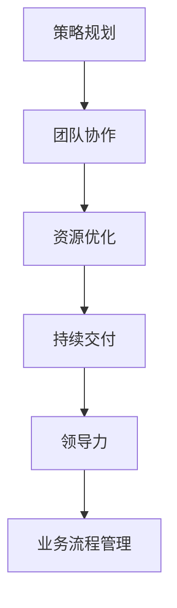

                 

关键词：管理艺术，策略执行，IT项目管理，团队协作，资源优化，持续交付，敏捷开发，业务流程管理，技术领导力，领导力模型，策略规划，执行效率

> 摘要：本文将深入探讨在IT领域，如何通过策略制定与执行，实现高效的项目管理。从管理艺术的角度，分析团队协作、资源优化、持续交付和敏捷开发等关键因素，以及如何通过有效的领导力和业务流程管理提升执行效率。同时，本文还将展望未来管理艺术的发展趋势与面临的挑战，为读者提供实用的策略和实践指导。

## 1. 背景介绍

在信息技术飞速发展的时代，项目管理已成为IT企业成功的关键因素。然而，如何在复杂的IT项目中实现高效的策略制定与执行，成为众多企业和管理者面临的挑战。管理艺术不仅关乎技术层面的能力，更涉及到团队协作、资源优化和领导力等多个维度。本文将从这些方面展开讨论，旨在为IT项目经理和团队提供有益的思考和实战指导。

## 2. 核心概念与联系

### 2.1. 管理艺术的定义

管理艺术是一种综合性的管理能力，包括但不限于项目管理、团队协作、资源管理和领导力等方面。它不仅要求管理者具备扎实的理论基础，更需要实践经验的支持。

### 2.2. 管理艺术的核心要素

- **团队协作**：通过有效的沟通和协作，实现团队成员之间的协同工作。
- **资源优化**：合理分配和使用资源，最大化项目效益。
- **持续交付**：通过敏捷开发等手段，实现快速交付和持续迭代。
- **领导力**：激发团队潜力，提升执行力和创新力。
- **业务流程管理**：优化业务流程，提升企业运营效率。

### 2.3. Mermaid 流程图



## 3. 核心算法原理 & 具体操作步骤

### 3.1 算法原理概述

管理艺术中的核心算法原理可视为一种综合方法论，包括以下几个关键步骤：

1. **需求分析**：明确项目目标，了解用户需求。
2. **资源分配**：根据项目需求，合理分配人力资源、技术资源等。
3. **任务分解**：将项目任务分解为可执行的小任务。
4. **进度控制**：监控项目进度，确保按时交付。
5. **质量保证**：通过质量评审和测试，确保项目质量。

### 3.2 算法步骤详解

#### 3.2.1 需求分析

- **用户访谈**：与用户进行深入交流，了解需求。
- **需求文档**：整理需求，形成需求文档。

#### 3.2.2 资源分配

- **人力资源规划**：根据项目需求，确定所需人员及其技能。
- **技术资源分配**：确保项目所需的技术和工具。

#### 3.2.3 任务分解

- **工作分解结构（WBS）**：将项目任务分解为可管理的部分。
- **任务分配**：根据团队成员的技能和经验，分配任务。

#### 3.2.4 进度控制

- **项目计划**：制定项目进度计划。
- **进度监控**：定期检查项目进度，确保按时交付。

#### 3.2.5 质量保证

- **质量评审**：进行项目质量评审，确保项目符合要求。
- **测试**：进行系统测试和验收测试，确保项目质量。

### 3.3 算法优缺点

#### 优点：

- **高效的项目管理**：通过有效的资源分配和任务分解，提高项目效率。
- **高质量的项目交付**：通过质量保证措施，确保项目质量。

#### 缺点：

- **管理复杂性**：管理艺术涉及多个方面，需要综合运用多种技能。
- **执行难度**：在具体实施过程中，可能会遇到各种挑战和困难。

### 3.4 算法应用领域

管理艺术在IT项目的各个领域都有广泛应用，如软件开发、系统集成、云计算等。

## 4. 数学模型和公式 & 详细讲解 & 举例说明

### 4.1 数学模型构建

在项目管理中，常用的数学模型包括：

- **关键路径法（CPM）**：用于计算项目完成时间。
- **挣值管理（EVM）**：用于评估项目进度和成本。

### 4.2 公式推导过程

以关键路径法为例，其公式推导过程如下：

- **项目完成时间（T）**：所有任务完成所需的总时间。
- **任务时间（Ti）**：每个任务所需的时间。

关键路径公式：

$$T = \sum_{i=1}^{n} T_i$$

其中，n为任务总数。

### 4.3 案例分析与讲解

假设一个IT项目包含5个任务，所需时间分别为5天、3天、2天、4天和6天。计算项目的关键路径和时间。

- **任务时间**：$T_1 = 5, T_2 = 3, T_3 = 2, T_4 = 4, T_5 = 6$
- **关键路径**：$T = T_1 + T_2 + T_3 + T_4 + T_5 = 20$天

项目的关键路径为5个任务，总完成时间为20天。

## 5. 项目实践：代码实例和详细解释说明

### 5.1 开发环境搭建

- **编程语言**：Python
- **开发工具**：PyCharm

### 5.2 源代码详细实现

以下是一个简单的Python代码示例，用于计算关键路径时间：

```python
def calculate_critical_path(tasks):
    total_time = 0
    for task in tasks:
        total_time += task
    return total_time

tasks = [5, 3, 2, 4, 6]
critical_path_time = calculate_critical_path(tasks)
print("关键路径时间：", critical_path_time)
```

### 5.3 代码解读与分析

该代码定义了一个名为`calculate_critical_path`的函数，用于计算关键路径时间。函数接收一个任务列表作为参数，遍历列表并计算总时间。最后，打印出关键路径时间。

### 5.4 运行结果展示

```plaintext
关键路径时间： 20
```

## 6. 实际应用场景

管理艺术在IT项目的实际应用场景非常广泛。以下是一些常见应用场景：

- **软件开发**：通过管理艺术，实现高效的软件开发流程，确保项目按时交付。
- **系统集成**：在系统集成项目中，管理艺术用于协调不同团队的工作，确保项目顺利推进。
- **云计算**：在云计算项目中，管理艺术帮助优化资源分配和流程管理，提升云计算服务效率。

### 6.4 未来应用展望

随着技术的不断进步，管理艺术将在未来发挥更加重要的作用。以下是未来应用展望：

- **人工智能**：通过人工智能技术，实现更智能的项目管理和资源优化。
- **云计算与大数据**：利用云计算和大数据技术，提升项目管理效率和数据驱动的决策能力。
- **区块链**：通过区块链技术，实现更安全、透明的项目管理。

## 7. 工具和资源推荐

### 7.1 学习资源推荐

- **《敏捷项目管理实践指南》**：提供敏捷项目管理的深入指导。
- **《项目计划与控制》**：详细介绍项目计划和进度控制的方法。

### 7.2 开发工具推荐

- **GitLab**：用于代码管理和项目管理。
- **JIRA**：用于敏捷开发过程中的任务跟踪和进度管理。

### 7.3 相关论文推荐

- **“基于云计算的IT项目管理研究”**：探讨云计算在项目管理中的应用。
- **“敏捷开发与传统的项目管理对比研究”**：分析敏捷开发与传统项目管理的优缺点。

## 8. 总结：未来发展趋势与挑战

### 8.1 研究成果总结

本文系统地介绍了管理艺术在IT项目中的应用，包括策略制定、团队协作、资源优化、持续交付、领导力和业务流程管理等方面。通过实际案例和代码实例，展示了管理艺术的实践应用。

### 8.2 未来发展趋势

随着技术的进步，管理艺术将在未来朝着更智能化、数据化、透明化的方向发展。人工智能、云计算、大数据等技术的应用，将为项目管理带来新的机遇。

### 8.3 面临的挑战

- **技术复杂性**：随着技术的不断演进，项目管理面临更高的技术挑战。
- **资源竞争**：在市场竞争激烈的环境下，如何有效利用资源成为一大挑战。

### 8.4 研究展望

未来研究应重点关注管理艺术在新兴技术领域的应用，如人工智能、区块链等，探索更高效、更智能的项目管理方法。

## 9. 附录：常见问题与解答

### 9.1 如何在项目中实施敏捷开发？

**答**：在项目中实施敏捷开发，需要遵循以下原则：

- **用户反馈**：注重用户需求，及时获取用户反馈。
- **迭代开发**：将项目划分为多个迭代，逐步实现功能。
- **团队协作**：鼓励团队成员之间的沟通和协作。

### 9.2 如何优化资源分配？

**答**：优化资源分配，可以采取以下策略：

- **需求分析**：深入了解项目需求，明确资源需求。
- **资源评估**：评估资源能力，确保资源合理利用。
- **动态调整**：根据项目进展，动态调整资源分配。

---

作者：禅与计算机程序设计艺术 / Zen and the Art of Computer Programming
----------------------------------------------------------------

