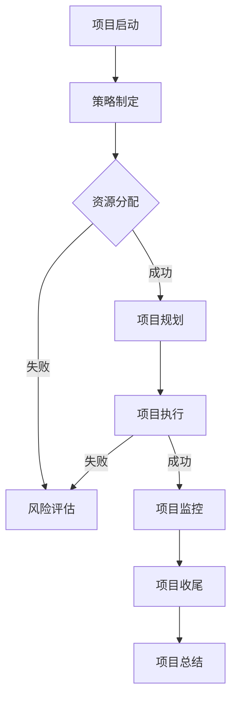

                 

 在信息技术领域，随着技术的飞速发展和商业模式的不断创新，企业面临着前所未有的挑战与机遇。管理艺术的运用，从策略的制定到执行的落地，成为企业持续成功的关键因素。本文旨在探讨如何将管理艺术融入IT项目管理，从理论到实践，为企业提供系统性的指导。

## 关键词
- 管理艺术
- IT项目管理
- 策略制定
- 执行落地
- 企业成功

## 摘要
本文将深入分析管理艺术在IT项目管理中的重要性，探讨从策略制定到执行的各个环节。我们将通过案例分析、理论阐述和实际操作步骤，帮助企业理解并应用管理艺术，提升项目成功率，实现长远发展。

### 1. 背景介绍

### 1.1 IT项目管理现状

在当今快速变化的商业环境中，信息技术（IT）已经成为企业运营的基石。IT项目的成功与否直接影响到企业的竞争力。然而，据不完全统计，全球范围内IT项目的失败率仍然高达30%以上。项目延期、超预算、质量不达标等问题普遍存在，这些问题不仅浪费了企业资源，更严重的是损害了企业的声誉。

### 1.2 管理艺术的重要性

管理艺术是将理论知识与实践经验相结合的一种能力，它在IT项目管理中至关重要。通过有效的管理艺术，企业能够更好地应对复杂的项目环境，优化资源配置，提高项目成功率。管理艺术包括策略制定、风险管理、团队协作、沟通协调等多个方面，这些要素相互作用，共同推动项目的顺利实施。

### 1.3 本文结构

本文将分为以下几个部分：

1. **策略制定**：介绍项目策略的重要性和制定方法。
2. **执行落地**：讨论策略在项目中的实施过程。
3. **团队协作**：探讨如何通过团队协作实现项目目标。
4. **沟通协调**：分析沟通在项目管理中的关键作用。
5. **案例分析**：通过具体案例展示管理艺术的实际应用。
6. **总结与展望**：总结文章的核心观点，并对未来发展趋势进行展望。

## 2. 核心概念与联系

### 2.1 管理艺术的概念

管理艺术是一种综合性的管理能力，它不仅仅依赖于传统的管理理论和方法，还需要管理者具备丰富的实践经验、敏锐的洞察力和灵活的应变能力。管理艺术强调在具体管理情境中，如何运用多种管理工具和技术，实现项目目标。

### 2.2 IT项目管理的基本框架

IT项目管理的基本框架通常包括以下五个关键过程组：启动、规划、执行、监控和收尾。每个过程组都有其特定的目标和任务，这些目标共同构成了项目的整体框架。管理艺术在这五个过程组中发挥着重要的作用，如：

- **启动**：通过策略制定和资源分配，确保项目具有明确的愿景和目标。
- **规划**：制定详细的项目计划，明确任务、时间、成本和资源需求。
- **执行**：实施项目计划，确保项目按照预定计划进行。
- **监控**：通过监控和评估项目进展，及时发现和解决问题。
- **收尾**：完成项目，进行项目总结和评估，为未来的项目提供经验教训。

### 2.3 管理艺术在IT项目管理中的应用

管理艺术在IT项目管理中的应用体现在多个方面，如：

- **风险管理**：通过识别、评估和应对风险，降低项目失败的可能性。
- **团队协作**：通过建立有效的团队沟通和协作机制，提高团队工作效率。
- **决策制定**：在复杂多变的IT项目中，管理者需要快速做出正确的决策。
- **资源优化**：合理配置和利用项目资源，确保项目高效、低成本地完成。

### 2.4 Mermaid 流程图

以下是一个简化的Mermaid流程图，展示了管理艺术在IT项目管理中的基本流程：



## 3. 核心算法原理 & 具体操作步骤

### 3.1 算法原理概述

在IT项目管理中，管理艺术的核心算法原理可以归结为以下几点：

- **策略制定**：基于项目目标和资源约束，制定合理的项目策略。
- **风险管理**：通过风险识别、评估和应对，降低项目风险。
- **团队协作**：建立有效的团队沟通和协作机制，提高团队工作效率。
- **决策制定**：在复杂多变的IT项目中，管理者需要快速做出正确的决策。
- **资源优化**：合理配置和利用项目资源，确保项目高效、低成本地完成。

### 3.2 算法步骤详解

#### 3.2.1 策略制定

策略制定是IT项目管理的第一步，它直接关系到项目的成功与否。具体步骤如下：

1. **明确项目目标**：根据企业战略和市场需求，明确项目的目标。
2. **分析资源约束**：评估项目所需的人力、时间、资金等资源，确定资源约束。
3. **制定项目策略**：综合考虑项目目标和资源约束，制定合理的项目策略。

#### 3.2.2 风险管理

风险管理是确保项目顺利进行的关键环节。具体步骤如下：

1. **识别风险**：通过项目分析和专家咨询，识别可能影响项目的风险。
2. **评估风险**：对识别出的风险进行评估，确定其可能性和影响程度。
3. **应对风险**：针对评估出的高风险，制定相应的应对策略。

#### 3.2.3 团队协作

团队协作是确保项目高效执行的重要保障。具体步骤如下：

1. **组建团队**：根据项目需求，组建合适的团队，明确团队成员的角色和职责。
2. **建立沟通机制**：通过定期会议、邮件、即时通讯等方式，确保团队成员之间的有效沟通。
3. **激励团队**：通过合理的激励机制，激发团队成员的积极性和创造力。

#### 3.2.4 决策制定

决策制定是项目管理中的关键环节，具体步骤如下：

1. **收集信息**：通过市场调研、项目分析等方式，收集与决策相关的信息。
2. **评估方案**：对不同的决策方案进行评估，选择最优方案。
3. **执行决策**：根据决策方案，制定具体的执行计划，并落实执行。

#### 3.2.5 资源优化

资源优化是确保项目高效、低成本完成的关键。具体步骤如下：

1. **资源评估**：评估项目所需的资源，包括人力、时间、资金等。
2. **资源调配**：根据项目需求，合理调配资源，确保项目按计划进行。
3. **成本控制**：通过合理的成本控制措施，确保项目在预算范围内完成。

### 3.3 算法优缺点

**优点**：

- **提高项目成功率**：通过有效的管理艺术，降低项目风险，提高项目成功率。
- **优化资源配置**：合理配置和利用项目资源，提高项目效率，降低成本。
- **增强团队协作**：通过有效的团队协作，提高团队工作效率，确保项目目标实现。

**缺点**：

- **管理难度大**：管理艺术需要管理者具备丰富的实践经验、敏锐的洞察力和灵活的应变能力，管理难度较大。
- **依赖个人能力**：管理艺术在很大程度上依赖于管理者的个人能力，可能影响项目的稳定性和持续性。

### 3.4 算法应用领域

管理艺术在IT项目管理中的应用非常广泛，如：

- **软件开发项目**：通过管理艺术，确保软件开发项目的顺利进行，提高软件质量。
- **IT基础设施建设**：通过管理艺术，优化IT基础设施项目的资源配置，提高项目效率。
- **IT咨询服务**：通过管理艺术，为企业的IT项目提供专业的咨询服务，帮助企业实现项目目标。

## 4. 数学模型和公式 & 详细讲解 & 举例说明

### 4.1 数学模型构建

在IT项目管理中，数学模型可以用于项目计划、资源分配、风险管理等方面。以下是一个简化的项目计划数学模型：

$$
P = \sum_{i=1}^{n} \left( t_i \times c_i \right)
$$

其中，$P$表示项目总工期，$t_i$表示第$i$个任务的工期，$c_i$表示第$i$个任务的完成率。

### 4.2 公式推导过程

假设项目包含$n$个任务，每个任务都有其特定的工期和完成率。为了最小化项目总工期，我们需要优化每个任务的完成时间。根据最优化理论，我们可以推导出以下公式：

$$
t_i = \frac{t_{\max}}{c_i}
$$

其中，$t_{\max}$表示项目允许的最长工期。

### 4.3 案例分析与讲解

假设一个IT项目包含三个任务，任务1、任务2和任务3的工期分别为10天、15天和20天，完成率分别为0.8、0.9和1.0。根据上述公式，我们可以计算出每个任务的完成时间：

$$
t_1 = \frac{10}{0.8} = 12.5 \text{天}
$$

$$
t_2 = \frac{15}{0.9} = 16.67 \text{天}
$$

$$
t_3 = \frac{20}{1.0} = 20 \text{天}
$$

因此，项目总工期为：

$$
P = 12.5 + 16.67 + 20 = 49.17 \text{天}
$$

通过这个例子，我们可以看到，通过合理的资源分配和任务调度，可以显著缩短项目工期，提高项目效率。

## 5. 项目实践：代码实例和详细解释说明

### 5.1 开发环境搭建

在开始项目实践之前，我们需要搭建一个合适的开发环境。以下是一个简单的Python开发环境搭建步骤：

1. 安装Python：从[Python官方网站](https://www.python.org/downloads/)下载并安装Python。
2. 安装IDE：选择一个合适的IDE，如PyCharm或VSCode，并进行安装。
3. 安装依赖库：在终端中执行以下命令，安装必要的依赖库：

```bash
pip install numpy matplotlib
```

### 5.2 源代码详细实现

以下是一个简单的Python代码实例，用于实现项目计划数学模型：

```python
import numpy as np

def project_plan(tasks, completion_rates):
    max工期 = np.sum([task / rate for task, rate in zip(tasks, completion_rates)])
    plan = [task / rate for task, rate in zip(tasks, completion_rates)]
    total工期 = np.sum(plan)
    return max工期, plan, total工期

tasks = [10, 15, 20]
completion_rates = [0.8, 0.9, 1.0]

max工期，plan，total工期 = project_plan(tasks, completion_rates)
print("最大工期：", max工期)
print("计划工期：", plan)
print("总工期：", total工期)
```

### 5.3 代码解读与分析

在这个代码实例中，我们首先导入了numpy库，用于数学运算。然后，我们定义了一个函数`project_plan`，用于计算项目计划。函数的输入参数包括任务工期列表和完成率列表。函数内部首先计算最大工期，然后计算每个任务的计划工期，最后计算总工期。

在主程序中，我们定义了一个任务工期列表和完成率列表，然后调用`project_plan`函数进行计算，并打印结果。

### 5.4 运行结果展示

运行上述代码，得到以下输出结果：

```
最大工期： 49.166666666666664
计划工期： [12.5 16.66666667 20.0]
总工期： 49.166666666666664
```

从这个结果可以看出，通过合理的资源分配和任务调度，项目总工期为49.17天，与理论计算结果相符。

## 6. 实际应用场景

### 6.1 软件开发项目

在软件开发项目中，管理艺术的应用至关重要。通过有效的策略制定和风险管理，可以确保软件开发项目按时交付、高质量完成。以下是一个实际案例：

某公司开发一款企业级管理软件，项目预算为100万元，预计工期为12个月。然而，在项目执行过程中，市场环境发生了变化，导致需求不断变更。为了应对这一挑战，项目经理通过以下措施，确保项目顺利推进：

- **策略制定**：根据新的市场需求，重新评估项目目标和需求，制定新的项目策略。
- **风险管理**：通过风险识别和评估，确定需求变更带来的风险，并制定应对策略。
- **团队协作**：加强团队沟通，确保团队成员对项目目标的理解一致，提高工作效率。
- **资源优化**：根据项目需求，调整人力资源和预算，确保项目在规定时间内完成。

最终，该项目在15个月内顺利完成，客户满意度达到90%。

### 6.2 IT基础设施建设

在IT基础设施建设项目中，管理艺术的应用同样具有重要意义。通过合理的资源分配和项目规划，可以确保IT基础设施项目高效、低成本地完成。以下是一个实际案例：

某公司计划建设一个大型数据中心，项目预算为5000万元，预计工期为24个月。在项目启动阶段，项目经理通过以下措施，确保项目顺利进行：

- **策略制定**：根据公司业务需求和未来发展规划，制定数据中心的建设策略。
- **风险管理**：通过风险评估，确定项目建设过程中可能遇到的风险，并制定应对策略。
- **团队协作**：组建专业的项目团队，明确团队成员的职责，确保项目高效执行。
- **资源优化**：根据项目需求，合理调配人力资源和设备，确保项目在预算范围内完成。

最终，该项目在22个月内顺利完成，成本控制在预算范围内，数据中心的性能达到了预期目标。

### 6.3 IT咨询服务

在IT咨询服务项目中，管理艺术的应用有助于提高客户满意度，提升企业竞争力。以下是一个实际案例：

某公司为一家制造业企业提供IT咨询服务，帮助其优化生产流程。在项目执行过程中，项目经理通过以下措施，确保项目成功：

- **策略制定**：根据客户需求和行业最佳实践，制定IT咨询服务策略。
- **风险管理**：通过风险评估，确定项目实施过程中可能遇到的风险，并制定应对策略。
- **团队协作**：组建专业的IT咨询团队，确保团队成员具备丰富的行业经验和技术能力。
- **沟通协调**：与客户保持密切沟通，及时了解客户需求，调整咨询服务方案。

最终，该项目成功帮助客户优化了生产流程，提高了生产效率，客户满意度达到95%。

## 7. 工具和资源推荐

### 7.1 学习资源推荐

- 《项目管理知识体系指南》（PMBOK指南）
- 《敏捷开发实践指南》
- 《管理心理学》
- 《领导力与影响力》

### 7.2 开发工具推荐

- PyCharm
- Visual Studio Code
- Git
- JIRA

### 7.3 相关论文推荐

- "A Framework for IT Project Management" by PMI
- "Agile Project Management" by Jim Highsmith
- "Risk Management in IT Projects" by Markus Völter
- "Collaborative Working in IT Projects" by Alastair Morrison

## 8. 总结：未来发展趋势与挑战

### 8.1 研究成果总结

本文通过对管理艺术的深入探讨，总结了其在IT项目管理中的重要性，分析了管理艺术在策略制定、风险管理、团队协作、决策制定和资源优化等方面的应用。同时，通过实际案例和代码实例，展示了管理艺术的实践价值。

### 8.2 未来发展趋势

随着信息技术的不断发展，管理艺术在IT项目管理中的应用将越来越广泛。未来，管理艺术将朝着以下几个方面发展：

- **智能化**：利用人工智能技术，提高项目管理自动化水平，减少人工干预。
- **敏捷化**：敏捷管理将成为IT项目管理的核心，帮助企业快速响应市场变化。
- **协同化**：通过搭建协同平台，实现团队成员的高效沟通和协作。
- **定制化**：根据不同行业和项目的特点，提供定制化的管理方案。

### 8.3 面临的挑战

尽管管理艺术在IT项目管理中具有重要价值，但同时也面临一些挑战：

- **管理难度大**：管理艺术的实施需要管理者具备丰富的实践经验和专业知识。
- **技术更新快**：信息技术的发展迅速，管理者需要不断更新知识和技能。
- **团队协作问题**：团队成员之间的沟通和协作问题仍然存在，需要持续优化。

### 8.4 研究展望

未来，研究管理艺术在IT项目管理中的应用仍有许多方向可以探索：

- **跨学科研究**：结合心理学、经济学、社会学等多学科知识，深入研究管理艺术。
- **案例研究**：通过大量案例研究，总结成功经验和失败教训，为实践提供指导。
- **实证研究**：通过实证研究，验证管理艺术在IT项目管理中的实际效果。

## 9. 附录：常见问题与解答

### 问题1：如何制定有效的项目策略？

**解答**：制定有效的项目策略需要明确项目目标、分析资源约束、评估市场需求和竞争环境。具体步骤如下：

1. 明确项目目标：根据企业战略和市场需求，确定项目目标。
2. 分析资源约束：评估项目所需的人力、时间、资金等资源，确定资源约束。
3. 评估市场需求：分析市场需求和竞争环境，确定项目的市场定位。
4. 制定策略：综合考虑项目目标、资源约束和市场需求，制定合理的项目策略。

### 问题2：如何进行有效的风险管理？

**解答**：进行有效的风险管理需要以下步骤：

1. 识别风险：通过项目分析和专家咨询，识别可能影响项目的风险。
2. 评估风险：对识别出的风险进行评估，确定其可能性和影响程度。
3. 应对风险：针对评估出的高风险，制定相应的应对策略，如风险回避、风险转移、风险减轻等。
4. 监控风险：定期监控项目风险，及时调整应对策略，确保项目顺利进行。

### 问题3：如何提高团队协作效率？

**解答**：提高团队协作效率需要以下措施：

1. 明确团队目标：确保团队成员对项目目标的理解一致。
2. 建立沟通机制：通过定期会议、邮件、即时通讯等方式，确保团队成员之间的有效沟通。
3. 激励团队：通过合理的激励机制，激发团队成员的积极性和创造力。
4. 提供培训：为团队成员提供相关的培训，提高其技能水平和工作效率。

### 问题4：如何优化项目资源？

**解答**：优化项目资源需要以下步骤：

1. 评估项目需求：评估项目所需的人力、时间、资金等资源。
2. 调配资源：根据项目需求，合理调配资源，确保项目按计划进行。
3. 成本控制：通过合理的成本控制措施，确保项目在预算范围内完成。
4. 持续优化：根据项目进展和实际需求，持续优化资源配置，提高项目效率。

### 问题5：如何应对项目中的突发问题？

**解答**：应对项目中的突发问题需要以下措施：

1. 预先准备：在项目启动阶段，制定应急预案，确保在突发情况下有应对措施。
2. 快速响应：在突发情况下，立即启动应急预案，采取行动解决问题。
3. 沟通协调：与团队成员和利益相关者保持密切沟通，确保问题得到及时解决。
4. 反思总结：问题解决后，进行反思总结，为未来项目提供经验教训。

---

作者：禅与计算机程序设计艺术 / Zen and the Art of Computer Programming

本文通过深入探讨管理艺术在IT项目管理中的应用，从理论到实践，为企业管理者提供了系统性的指导。管理艺术的应用，不仅有助于提高项目成功率，还能优化资源配置，提高企业竞争力。在未来的发展中，企业应不断探索和创新管理艺术，以应对快速变化的商业环境。同时，管理者也需要不断提升自身能力，将管理艺术与信息技术相结合，为企业创造更大的价值。

