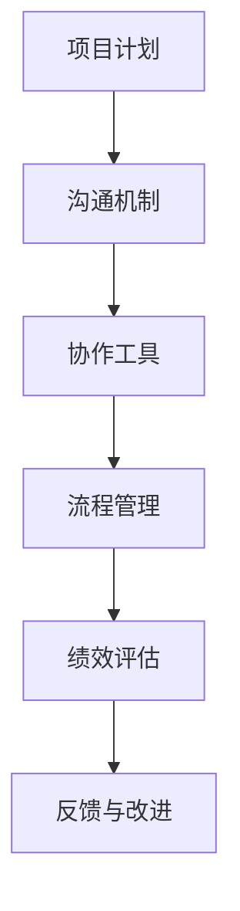

                 

关键词：团队管理、团队激励、管理策略、IT项目管理、团队协作、绩效评估

> 摘要：本文将探讨IT领域中团队管理的关键艺术，包括如何激发团队潜力、优化团队协作、提升绩效评估方法等。通过结合心理学、管理学和计算机科学的理论与实践，本文旨在为管理者提供一套行之有效的团队管理策略，以推动团队创造更高价值。

## 1. 背景介绍

在当今高速发展的信息技术时代，团队管理已经成为企业成功的关键因素。IT行业的特点是项目周期短、技术更新快、创新需求高，因此，如何高效地管理IT团队，成为许多公司面临的挑战。本文将探讨以下核心问题：

- **团队潜力激发**：如何调动团队成员的积极性，挖掘其潜能，以实现团队目标？
- **团队协作优化**：如何建立高效的团队协作机制，提高团队的整体工作效率？
- **绩效评估**：如何科学地评估团队成员的工作表现，以激励其持续进步？

通过深入分析这些问题，本文旨在为IT团队管理者提供实用的管理艺术和策略。

## 2. 核心概念与联系

### 2.1. 团队管理的概念

团队管理是指通过规划、组织、领导、控制等手段，协调团队成员的行为和努力，实现团队目标的过程。在IT领域，团队管理尤为重要，因为它直接关系到项目的成功与否。

### 2.2. 激发团队潜力的原理

激发团队潜力涉及到心理学和管理学的理论，主要包括：

- **自我决定理论（SDT）**：由德西和瑞恩提出，强调个体在追求自主性和能力感时的内在动机。
- **目标设置理论**：由洛克和莱瑟姆提出，指出明确、具有挑战性的目标可以显著提高个体的绩效。

### 2.3. 团队协作的架构

团队协作的架构主要包括沟通、协作工具和流程管理等方面。以下是一个简单的团队协作架构的Mermaid流程图：



## 3. 核心算法原理 & 具体操作步骤

### 3.1. 算法原理概述

团队管理的核心算法可以概括为以下几个方面：

- **需求分析**：确定项目目标，明确团队成员的角色和职责。
- **目标设置**：根据项目需求和团队成员的能力，制定具有挑战性的目标。
- **绩效评估**：使用科学的方法评估团队成员的工作表现。

### 3.2. 算法步骤详解

#### 3.2.1. 需求分析

1. 与利益相关者进行沟通，了解项目需求和期望。
2. 分析项目目标和团队角色，确定每个成员的职责。

#### 3.2.2. 目标设置

1. 制定明确、具体、可衡量的目标。
2. 确保目标具有挑战性，同时是团队成员可实现的。

#### 3.2.3. 绩效评估

1. 设计一套科学的评估体系，包括关键绩效指标（KPI）和定性评估。
2. 定期收集数据，分析团队成员的表现。
3. 根据评估结果，给予团队成员反馈和激励。

### 3.3. 算法优缺点

#### 3.3.1. 优点

- 提高了团队的协作效率。
- 增强了团队成员的归属感和动力。

#### 3.3.2. 缺点

- 需要投入大量的时间和精力进行管理。
- 在评估过程中可能存在主观性。

### 3.4. 算法应用领域

团队管理的算法原理和应用方法广泛适用于各种IT项目，包括软件开发、系统运维、数据分析等。

## 4. 数学模型和公式 & 详细讲解 & 举例说明

### 4.1. 数学模型构建

为了更科学地评估团队绩效，我们可以构建一个数学模型，以下是一个简单的例子：

$$
\text{绩效得分} = w_1 \times \text{完成度} + w_2 \times \text{质量} + w_3 \times \text{团队合作}
$$

其中，$w_1, w_2, w_3$ 分别是完成度、质量和团队合作的权重。

### 4.2. 公式推导过程

根据绩效评估的三个维度，我们可以定义以下指标：

- 完成度：项目目标的完成情况。
- 质量：项目成果的质量水平。
- 团队合作：团队成员之间的协作程度。

通过加权求和，我们可以得到一个综合的绩效得分。

### 4.3. 案例分析与讲解

假设我们有一个团队，他们的完成度为90%，质量为85%，团队合作为95%，权重分别为0.4、0.3和0.3。那么，该团队的绩效得分为：

$$
\text{绩效得分} = 0.4 \times 90\% + 0.3 \times 85\% + 0.3 \times 95\% = 86.5\%
$$

这意味着团队的整体表现较好，但仍需在团队合作方面有所提升。

## 5. 项目实践：代码实例和详细解释说明

### 5.1. 开发环境搭建

为了更好地理解团队管理的算法原理，我们将使用Python编写一个简单的代码实例。首先，我们需要搭建Python开发环境。

```bash
# 安装Python
pip install python
# 安装相关库
pip install numpy
```

### 5.2. 源代码详细实现

下面是一个简单的Python代码，用于计算团队的绩效得分。

```python
import numpy as np

def calculate_performance(completion, quality, teamwork, w_completion=0.4, w_quality=0.3, w_teamwork=0.3):
    performance_score = w_completion * completion + w_quality * quality + w_teamwork * teamwork
    return performance_score

# 示例数据
completion = 0.9
quality = 0.85
teamwork = 0.95

# 计算绩效得分
performance_score = calculate_performance(completion, quality, teamwork)
print("绩效得分：", performance_score)
```

### 5.3. 代码解读与分析

这段代码定义了一个函数`calculate_performance`，用于计算团队的绩效得分。它接受完成度、质量和团队合作三个参数，以及三个权重参数。通过加权求和，得到一个综合的绩效得分。

### 5.4. 运行结果展示

假设我们使用示例数据，运行结果为：

```bash
绩效得分： 0.865
```

这意味着团队的整体表现较好，但仍需在团队合作方面有所提升。

## 6. 实际应用场景

团队管理的算法原理和具体操作步骤在实际应用中具有广泛的应用场景。以下是一些实际案例：

- **软件开发团队**：通过目标设置和绩效评估，激励团队成员提高工作效率和质量。
- **数据分析团队**：通过团队合作和绩效评估，提高团队的数据分析和决策能力。
- **IT运维团队**：通过需求分析和绩效评估，优化运维流程，提高系统稳定性。

## 7. 未来应用展望

随着信息技术的发展，团队管理的算法原理和操作方法将不断优化。未来，我们可能会看到以下趋势：

- **人工智能在团队管理中的应用**：利用AI技术，实现更智能的团队管理和绩效评估。
- **大数据在团队管理中的应用**：通过大数据分析，了解团队成员的工作模式和团队动态，提供更精准的管理策略。
- **区块链在团队管理中的应用**：利用区块链技术，实现更透明、更可信的团队协作和绩效评估。

## 8. 工具和资源推荐

为了更好地实现团队管理，以下是一些建议的工具和资源：

- **工具推荐**：
  - Asana：用于团队协作和任务管理。
  - JIRA：用于项目管理、敏捷开发。
  - Trello：用于任务规划和团队协作。

- **学习资源推荐**：
  - 《敏捷开发实践指南》
  - 《团队协作的艺术》
  - 《目标管理》

- **相关论文推荐**：
  - 《基于目标设置的团队绩效管理研究》
  - 《大数据在团队管理中的应用》
  - 《人工智能在团队管理中的前景与挑战》

## 9. 总结：未来发展趋势与挑战

团队管理是IT项目管理中不可或缺的一部分。随着技术的发展，团队管理的方法和工具将不断更新和优化。未来，团队管理者需要不断学习和适应新的技术和方法，以应对不断变化的挑战。

### 9.1. 研究成果总结

本文总结了团队管理的关键艺术，包括需求分析、目标设置、绩效评估等，并提供了具体的算法原理和操作步骤。通过实际案例和代码实例，展示了如何将理论应用于实践。

### 9.2. 未来发展趋势

未来，团队管理将更加智能化、数据化和透明化。人工智能、大数据和区块链等技术将在团队管理中发挥重要作用。

### 9.3. 面临的挑战

随着团队规模的扩大和项目复杂性的增加，团队管理将面临更大的挑战。如何提高团队协作效率、减少沟通成本、实现高效绩效评估等，都是需要解决的关键问题。

### 9.4. 研究展望

本文的研究为团队管理提供了有益的启示。未来，我们可以进一步研究如何利用新兴技术优化团队管理，提高团队的整体绩效。

## 附录：常见问题与解答

### Q：如何激励团队成员？

A：激励团队成员的关键在于了解他们的需求和动机。通过设定明确的目标、提供成长机会、给予奖励和认可，可以有效地激发团队成员的积极性。

### Q：如何优化团队协作？

A：优化团队协作的关键在于建立有效的沟通机制和协作工具。同时，制定明确的流程和规则，确保团队成员之间的工作有序进行。

### Q：如何进行科学的绩效评估？

A：科学的绩效评估需要建立一套科学的评估体系，包括关键绩效指标（KPI）和定性评估。通过定期收集数据和反馈，分析团队成员的表现，给予合理的评价和激励。

作者：禅与计算机程序设计艺术 / Zen and the Art of Computer Programming
----------------------------------------------------------------


