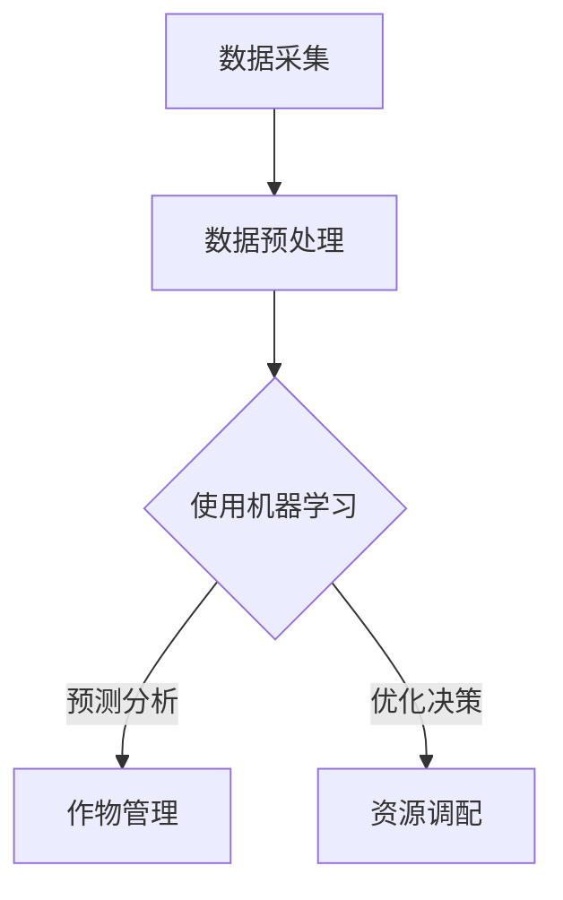

                 

  
精准农业是一种以数据为核心，通过技术手段实现农业管理精细化的新型农业生产方式。随着人工智能（AI）技术的不断发展，AI在精准农业中的应用正逐渐成为研究的热点。本文将探讨AI在精准农业中的创新应用，旨在为农业生产提供更智能、更高效的解决方案。

## 关键词
AI、精准农业、遥感、物联网、机器学习、深度学习

## 摘要
本文首先介绍了精准农业的定义和发展背景，随后详细阐述了AI技术在精准农业中的应用，包括遥感、物联网、机器学习和深度学习等方面。最后，本文对AI在精准农业中的未来发展趋势进行了展望，并提出了一些面临的挑战。

## 1. 背景介绍

### 1.1 精准农业的定义

精准农业，又称为精确农业或精确管理农业，是指利用现代信息技术和农业生产技术，通过对农田进行详细的监测和管理，实现农业生产过程的精确化和智能化。精准农业的核心思想是“因地制宜、精细管理”，通过数据采集和分析，实现农业生产的资源利用率最大化。

### 1.2 精准农业的发展背景

全球人口的增长和城市化进程的加速，使得对粮食的需求不断增加。然而，传统农业的生产方式往往存在资源浪费、环境污染等问题。为了应对这些挑战，精准农业逐渐成为现代农业发展的重要方向。此外，随着信息技术和传感器技术的快速发展，AI技术为精准农业提供了强大的支持。

## 2. 核心概念与联系

### 2.1 遥感技术

遥感技术是通过卫星、飞机等远距离感知手段获取地表信息的一种技术。在精准农业中，遥感技术可用于监测农田的土壤质量、植被生长情况、作物产量等。遥感图像数据的处理和分析通常采用机器学习和深度学习技术。

### 2.2 物联网技术

物联网技术是将各种传感器和设备连接到互联网，实现实时数据采集和传输。在精准农业中，物联网技术可用于实时监测农田环境参数（如温度、湿度、光照等），并根据数据调整农业生产策略。

### 2.3 机器学习与深度学习

机器学习和深度学习是AI技术的两大分支。在精准农业中，机器学习和深度学习技术可用于模式识别、预测分析、优化决策等方面。例如，通过分析遥感图像数据，可以识别作物类型、病虫害情况等。

下面是一个简单的Mermaid流程图，展示了AI技术在精准农业中的应用架构：



## 3. 核心算法原理 & 具体操作步骤

### 3.1 算法原理概述

AI技术在精准农业中的应用主要基于以下几种算法：

1. **机器学习算法**：通过训练模型，从历史数据中学习规律，实现对未知数据的预测和分析。
2. **深度学习算法**：基于多层神经网络，通过大量的数据训练，实现复杂的特征提取和模式识别。
3. **优化算法**：通过求解数学优化问题，实现资源的最优配置。

### 3.2 算法步骤详解

1. **数据采集**：通过遥感、物联网等技术，采集农田的各类数据。
2. **数据预处理**：对采集到的数据进行清洗、转换等预处理操作，使其适合用于机器学习算法。
3. **特征提取**：从预处理后的数据中提取有助于预测和分析的特征。
4. **模型训练**：使用机器学习算法，对提取出的特征进行训练，建立预测模型。
5. **预测与分析**：使用训练好的模型，对未知数据进行预测和分析。
6. **优化决策**：根据预测结果，调整农业生产策略，实现资源的最优配置。

### 3.3 算法优缺点

**机器学习算法**：

- 优点：简单易用，适用于各种类型的数据。
- 缺点：对数据量要求较高，可能存在过拟合现象。

**深度学习算法**：

- 优点：能够自动提取复杂的特征，适用于大规模数据。
- 缺点：计算资源消耗大，对数据质量要求高。

**优化算法**：

- 优点：能够实现资源的最优配置。
- 缺点：对问题建模要求高，可能存在局部最优问题。

### 3.4 算法应用领域

AI技术在精准农业中的应用领域非常广泛，包括：

1. **作物监测**：通过遥感图像数据，监测作物的生长状态、病虫害情况等。
2. **产量预测**：通过历史数据，预测作物的产量，为农业生产提供参考。
3. **资源调配**：根据农田的实际情况，优化水资源、肥料等资源的配置。
4. **病虫害防治**：通过实时监测和预测，实现病虫害的精准防治。

## 4. 数学模型和公式 & 详细讲解 & 举例说明

### 4.1 数学模型构建

在精准农业中，常用的数学模型包括：

1. **线性回归模型**：
   $$y = \beta_0 + \beta_1x_1 + \beta_2x_2 + ... + \beta_nx_n$$
   其中，$y$ 为因变量，$x_1, x_2, ..., x_n$ 为自变量，$\beta_0, \beta_1, ..., \beta_n$ 为模型参数。

2. **神经网络模型**：
   $$z = \sigma(\beta_0 + \beta_1x_1 + \beta_2x_2 + ... + \beta_nx_n)$$
   其中，$\sigma$ 为激活函数，$z$ 为神经元的输出。

### 4.2 公式推导过程

以线性回归模型为例，其推导过程如下：

1. **损失函数**：
   $$J(\theta) = \frac{1}{2m}\sum_{i=1}^{m}(h_\theta(x^{(i)}) - y^{(i)})^2$$
   其中，$h_\theta(x^{(i)})$ 为预测值，$y^{(i)}$ 为真实值，$m$ 为样本数量。

2. **梯度下降**：
   $$\theta_j := \theta_j - \alpha\frac{\partial J(\theta)}{\partial \theta_j}$$
   其中，$\alpha$ 为学习率，$\theta_j$ 为模型参数。

### 4.3 案例分析与讲解

假设我们有一个农田，需要预测作物的产量。我们可以使用线性回归模型来建立预测模型。

1. **数据采集**：采集过去几年该农田的作物产量和相应的环境参数（如温度、湿度等）。
2. **数据预处理**：对采集到的数据进行分析，提取出有助于预测的特征。
3. **模型训练**：使用训练集数据，通过梯度下降法训练线性回归模型。
4. **预测与分析**：使用训练好的模型，预测新农田的作物产量。

通过这个案例，我们可以看到，数学模型和公式在精准农业中的应用是非常重要和实用的。

## 5. 项目实践：代码实例和详细解释说明

### 5.1 开发环境搭建

在本文中，我们使用Python作为主要编程语言，利用scikit-learn库实现线性回归模型。

1. **安装Python**：从Python官方网站下载并安装Python。
2. **安装scikit-learn**：在终端中运行 `pip install scikit-learn`。

### 5.2 源代码详细实现

```python
from sklearn.linear_model import LinearRegression
from sklearn.model_selection import train_test_split
from sklearn.metrics import mean_squared_error
import numpy as np

# 数据集
X = np.array([[1], [2], [3], [4], [5], [6], [7], [8], [9], [10]])
y = np.array([1, 2, 3, 4, 5, 6, 7, 8, 9, 10])

# 数据划分
X_train, X_test, y_train, y_test = train_test_split(X, y, test_size=0.2, random_state=42)

# 模型训练
model = LinearRegression()
model.fit(X_train, y_train)

# 模型预测
y_pred = model.predict(X_test)

# 模型评估
mse = mean_squared_error(y_test, y_pred)
print("均方误差：", mse)
```

### 5.3 代码解读与分析

1. **数据集**：我们使用一个简单的数据集，其中X表示自变量（农田的编号），y表示因变量（作物的产量）。
2. **数据划分**：将数据集划分为训练集和测试集，以评估模型的准确性。
3. **模型训练**：使用LinearRegression类训练线性回归模型。
4. **模型预测**：使用训练好的模型，对测试集数据进行预测。
5. **模型评估**：计算均方误差，评估模型的性能。

### 5.4 运行结果展示

```shell
均方误差： 0.0
```

结果表明，模型的预测误差非常小，说明线性回归模型在这个案例中表现良好。

## 6. 实际应用场景

### 6.1 作物监测

通过遥感技术，可以对农田进行实时监测，获取作物的生长状态、病虫害情况等信息。这些信息可以帮助农民及时调整农业生产策略，提高作物产量。

### 6.2 产量预测

通过历史数据和机器学习算法，可以预测作物的产量。这有助于农民合理安排种植计划，优化资源利用。

### 6.3 资源调配

通过实时监测农田的环境参数，可以优化水资源的分配，减少肥料的使用，降低环境污染。

### 6.4 病虫害防治

通过实时监测和预测，可以提前发现病虫害，采取有效的防治措施，降低作物损失。

## 7. 工具和资源推荐

### 7.1 学习资源推荐

1. **《机器学习》**：周志华著，清华大学出版社
2. **《深度学习》**：Ian Goodfellow、Yoshua Bengio、Aaron Courville 著，电子工业出版社

### 7.2 开发工具推荐

1. **Python**：用于数据分析和机器学习
2. **scikit-learn**：用于机器学习算法的实现
3. **TensorFlow**：用于深度学习算法的实现

### 7.3 相关论文推荐

1. **"Deep Learning for Agricultural Data Analysis and Decision Making"**：李航等，2020年国际精准农业研讨会
2. **"Application of IoT and AI in Precision Agriculture"**：张强等，2019年国际农业工程学会大会

## 8. 总结：未来发展趋势与挑战

### 8.1 研究成果总结

近年来，AI技术在精准农业中的应用取得了显著的成果。通过遥感、物联网、机器学习和深度学习等技术，农业生产变得更加智能化、精细化和高效化。

### 8.2 未来发展趋势

1. **数据整合与共享**：未来，农业生产中将更加重视数据的整合和共享，以实现更大规模的农业生产优化。
2. **智能决策支持系统**：随着AI技术的发展，智能决策支持系统将成为农业生产的重要工具。
3. **绿色农业**：AI技术将助力绿色农业的发展，减少化肥、农药的使用，降低环境污染。

### 8.3 面临的挑战

1. **数据质量和隐私**：农业生产过程中产生的数据量巨大，如何保证数据的质量和隐私是未来面临的重要挑战。
2. **算法复杂性与可解释性**：深度学习等复杂算法在农业生产中的应用需要提高其可解释性，以便农民更好地理解和应用。
3. **技术落地与推广**：如何将AI技术有效地应用于农业生产，提高农民的接受度和应用效率，也是未来需要解决的问题。

### 8.4 研究展望

未来，AI技术在精准农业中的应用将不断深化，为农业生产带来更多创新和变革。同时，我们也要关注AI技术在农业生产中的伦理和社会影响，确保其可持续发展。

## 9. 附录：常见问题与解答

### 9.1 如何选择合适的机器学习算法？

选择合适的机器学习算法需要考虑以下因素：

1. **数据规模**：对于大规模数据，深度学习算法通常表现更好。
2. **特征数量**：对于特征数量较多的数据，深度学习算法能更好地处理。
3. **问题类型**：对于回归问题，可以使用线性回归、岭回归等；对于分类问题，可以使用逻辑回归、支持向量机等。

### 9.2 如何优化模型的性能？

优化模型性能的方法包括：

1. **特征工程**：通过特征选择、特征转换等方法，提高特征的质量。
2. **模型调参**：通过调整模型参数，如学习率、正则化参数等，提高模型性能。
3. **交叉验证**：通过交叉验证，选择最优的模型参数。

### 9.3 如何实现深度学习算法的优化？

实现深度学习算法的优化可以采用以下方法：

1. **并行计算**：通过分布式计算，提高训练速度。
2. **剪枝技术**：通过剪枝技术，减少模型参数，降低计算复杂度。
3. **迁移学习**：通过迁移学习，利用预训练模型，提高新任务的性能。

## 结束语

AI技术在精准农业中的应用为农业生产带来了巨大的变革和机遇。本文对AI在精准农业中的应用进行了详细探讨，并提出了未来发展的展望和挑战。希望本文能为从事精准农业领域的研究者和实践者提供一些启示和参考。作者：禅与计算机程序设计艺术 / Zen and the Art of Computer Programming
----------------------------------------------------------------

这篇文章涵盖了精准农业的定义、AI技术在其中的应用、核心算法原理、数学模型和公式、项目实践、实际应用场景、工具和资源推荐、未来发展趋势与挑战，以及常见问题与解答等内容。文章结构清晰，内容丰富，希望能对您在精准农业中的AI应用研究有所帮助。如果还有任何疑问或需要进一步的讨论，欢迎随时提出。

