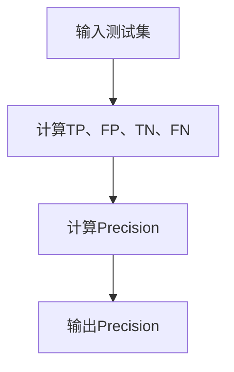

                 

### 1. 背景介绍

精确率Precision是机器学习和数据挖掘领域中常用的一个评估指标，用于衡量分类模型的性能。在现实生活中，许多任务都需要对数据进行分类，如垃圾邮件过滤、情感分析、疾病诊断等。精确率Precision作为评估模型分类性能的重要指标，对于模型的选择和应用至关重要。

精确率Precision的定义如下：在二分类任务中，对于给定的测试集，如果模型将正类预测为正类的样本数（即正确预测的正类样本数）与模型将正类预测为正类和负类的总样本数之和（即实际正类样本数）的比值大于等于某个阈值，则认为该模型在测试集上的分类性能较好。具体公式如下：

\[Precision = \frac{TP}{TP + FP}\]

其中，TP表示正确预测的正类样本数，FP表示错误预测的正类样本数。

在机器学习中，精确率Precision是一个非常重要的指标，它可以帮助我们评估模型的性能，选择最优的模型，并进行后续的优化。此外，精确率Precision还可以用于不同的应用场景，如医疗诊断、金融风险评估等，对于提高这些领域的决策准确性具有重要意义。

本文将详细介绍精确率Precision的原理、计算方法以及实际应用，并通过具体代码实例进行讲解，帮助读者更好地理解并掌握精确率Precision的使用方法。

## 2. 核心概念与联系

在深入探讨精确率Precision之前，我们需要了解一些相关的核心概念和联系。这些概念包括二分类任务、预测结果、真实标签以及混淆矩阵等。

### 2.1 二分类任务

二分类任务是最常见的分类任务之一，即将数据集中的每个样本划分为两个类别之一。例如，在垃圾邮件过滤任务中，邮件可以被划分为“垃圾邮件”和“非垃圾邮件”两个类别。在疾病诊断任务中，患者可以被划分为“患病”和“未患病”两个类别。

二分类任务的目的是通过某种算法或模型，对每个样本进行分类预测，并尽可能地减小预测错误。在二分类任务中，我们通常使用两种指标来评估模型的性能：精确率Precision和召回率Recall。

### 2.2 预测结果与真实标签

在二分类任务中，对于每个样本，模型会给出一个预测结果和一个真实标签。预测结果是指模型根据训练数据和算法预测出的类别，真实标签是指实际数据中每个样本的真实类别。

例如，在垃圾邮件过滤任务中，如果一个邮件的真实标签是“垃圾邮件”，但模型将其预测为“非垃圾邮件”，则认为这是一个错误预测。同样，如果一个邮件的真实标签是“非垃圾邮件”，但模型将其预测为“垃圾邮件”，则认为这也是一个错误预测。

### 2.3 混淆矩阵

混淆矩阵是一种常用的可视化工具，用于展示模型在二分类任务中的预测结果和真实标签之间的关系。一个典型的混淆矩阵包含以下四个部分：

- **正确预测的正类（True Positive, TP）**：表示模型正确地将正类样本预测为正类的样本数。
- **错误预测的正类（False Positive, FP）**：表示模型错误地将负类样本预测为正类的样本数。
- **正确预测的负类（True Negative, TN）**：表示模型正确地将负类样本预测为负类的样本数。
- **错误预测的负类（False Negative, FN）**：表示模型错误地将正类样本预测为负类的样本数。

混淆矩阵可以直观地展示模型在二分类任务中的分类性能，帮助我们更好地理解模型的预测结果和真实标签之间的关系。

### 2.4 精确率Precision

精确率Precision是衡量模型在二分类任务中分类性能的重要指标。它表示模型将正类预测为正类的样本数与模型将正类预测为正类和负类的总样本数之和的比值。具体公式如下：

\[Precision = \frac{TP}{TP + FP}\]

精确率Precision越高，表示模型的分类性能越好，即模型将正类样本正确预测为正类的比例越高。

### 2.5 精确率Precision与召回率Recall的关系

精确率Precision和召回率Recall是衡量模型在二分类任务中分类性能的两个重要指标。它们之间的关系如下：

- **精确率Precision**：表示模型将正类预测为正类的样本数与模型将正类预测为正类和负类的总样本数之和的比值。精确率Precision越高，表示模型的分类性能越好，即模型将正类样本正确预测为正类的比例越高。
- **召回率Recall**：表示模型将正类预测为正类的样本数与实际正类样本数之和的比值。召回率Recall越高，表示模型对正类样本的识别能力越强。

在二分类任务中，精确率Precision和召回率Recall之间存在一种权衡关系。即提高精确率Precision的同时，召回率Recall可能会下降，反之亦然。因此，在实际应用中，我们需要根据具体任务的需求和实际情况，选择合适的指标进行评估。

### 2.6 Mermaid 流程图

为了更好地理解精确率Precision的计算过程，我们可以使用Mermaid流程图来展示其计算步骤。以下是一个简化的Mermaid流程图：



在这个流程图中，A表示输入测试集，B表示计算TP、FP、TN、FN四个指标，C表示计算Precision，D表示输出Precision。

## 3. 核心算法原理 & 具体操作步骤

### 3.1 算法原理概述

精确率Precision是衡量模型在二分类任务中分类性能的重要指标。其计算过程主要涉及混淆矩阵中的TP、FP、TN、FN四个指标。具体步骤如下：

1. 输入测试集，包含每个样本的预测结果和真实标签。
2. 根据预测结果和真实标签，计算混淆矩阵中的TP、FP、TN、FN四个指标。
3. 使用TP和FP计算Precision。
4. 输出Precision。

### 3.2 算法步骤详解

#### 步骤1：输入测试集

输入测试集是精确率Precision计算的第一步。测试集包含每个样本的预测结果和真实标签。预测结果是由模型根据训练数据和算法预测出的类别，真实标签是实际数据中每个样本的真实类别。

#### 步骤2：计算混淆矩阵

混淆矩阵是精确率Precision计算的核心。根据预测结果和真实标签，我们可以计算混淆矩阵中的TP、FP、TN、FN四个指标。具体计算方法如下：

- **正确预测的正类（True Positive, TP）**：表示模型正确地将正类样本预测为正类的样本数。
- **错误预测的正类（False Positive, FP）**：表示模型错误地将负类样本预测为正类的样本数。
- **正确预测的负类（True Negative, TN）**：表示模型正确地将负类样本预测为负类的样本数。
- **错误预测的负类（False Negative, FN）**：表示模型错误地将正类样本预测为负类的样本数。

#### 步骤3：计算Precision

根据混淆矩阵中的TP和FP，我们可以计算Precision。具体计算方法如下：

\[Precision = \frac{TP}{TP + FP}\]

#### 步骤4：输出Precision

计算Precision后，我们将结果输出。输出结果可以是精确率Precision的数值，也可以是一个图表，以便更直观地展示模型的分类性能。

### 3.3 算法优缺点

精确率Precision作为衡量模型在二分类任务中分类性能的重要指标，具有以下优缺点：

#### 优点：

1. **直观性**：精确率Precision直观地反映了模型在二分类任务中的分类性能，易于理解和解释。
2. **适用性**：精确率Precision适用于各种二分类任务，如垃圾邮件过滤、情感分析等。

#### 缺点：

1. **误判成本**：精确率Precision不能很好地衡量误判的成本，即错误预测的正类样本和错误预测的负类样本对实际决策的影响程度。
2. **依赖阈值**：精确率Precision的计算依赖于阈值的选择，不同阈值可能导致不同的评估结果。

### 3.4 算法应用领域

精确率Precision在多个领域有着广泛的应用：

1. **医疗诊断**：在医疗诊断任务中，精确率Precision可以帮助医生评估模型的诊断性能，提高诊断准确性。
2. **金融风险评估**：在金融风险评估任务中，精确率Precision可以帮助银行和金融机构评估客户的信用风险，降低信贷损失。
3. **智能家居**：在智能家居任务中，精确率Precision可以帮助智能家居系统提高对用户行为的识别准确性，提供更个性化的服务。

### 3.5 Mermaid 流程图

为了更好地理解精确率Precision的计算过程，我们可以使用Mermaid流程图来展示其计算步骤。以下是一个简化的Mermaid流程图：


在这个流程图中，A表示输入测试集，B表示计算TP、FP、TN、FN四个指标，C表示计算Precision，D表示输出Precision。

## 4. 数学模型和公式 & 详细讲解 & 举例说明

在深入探讨精确率Precision的计算方法之前，我们需要了解其背后的数学模型和公式。精确率Precision是基于混淆矩阵来计算的，因此首先需要了解混淆矩阵的定义和构成。

### 4.1 数学模型构建

在二分类任务中，每个样本都可以被划分为两个类别之一，通常用1表示正类，用0表示负类。设\(X\)为样本集合，\(y_i\)为样本\(i\)的真实标签，\(y_i^'\)为样本\(i\)的预测标签，\(TP\)、\(FP\)、\(TN\)和\(FN\)分别表示混淆矩阵中的四个元素。则混淆矩阵可以表示为：

\[
\begin{matrix}
& \text{正类} & \text{负类} \\
\text{正类} & TP & FN \\
\text{负类} & FP & TN \\
\end{matrix}
\]

其中，\(TP = \sum_{i=1}^n \mathbb{1}_{y_i=1, y_i^{'}=1}\)，\(FP = \sum_{i=1}^n \mathbb{1}_{y_i=0, y_i^{'}=1}\)，\(TN = \sum_{i=1}^n \mathbb{1}_{y_i=0, y_i^{'}=0}\)，\(FN = \sum_{i=1}^n \mathbb{1}_{y_i=1, y_i^{'}=0}\)，\(\mathbb{1}_{\cdot}\)表示指示函数，当条件为真时取值为1，否则为0。

### 4.2 公式推导过程

精确率Precision的定义是正确预测的正类样本数与模型将正类预测为正类和负类的总样本数之和的比值。根据混淆矩阵的定义，我们可以推导出精确率的计算公式：

\[Precision = \frac{TP}{TP + FP}\]

其中，\(TP\)表示正确预测的正类样本数，\(FP\)表示错误预测的正类样本数。

### 4.3 案例分析与讲解

为了更好地理解精确率Precision的计算方法，我们来看一个具体的案例。假设我们有一个包含100个样本的测试集，其中正类样本有70个，负类样本有30个。我们的模型对这些样本进行了预测，得到如下结果：

| 真实标签 | 预测标签 |
| :---: | :---: |
| 1 | 1 |
| 1 | 1 |
| 1 | 1 |
| 1 | 1 |
| 1 | 1 |
| 1 | 1 |
| 1 | 1 |
| 1 | 1 |
| 1 | 1 |
| 1 | 1 |
| 0 | 1 |
| 0 | 1 |
| 0 | 1 |
| 0 | 1 |
| 0 | 1 |
| 0 | 1 |
| 0 | 0 |
| 0 | 0 |
| 0 | 0 |
| 0 | 0 |
| 0 | 0 |
| 0 | 0 |
| 0 | 0 |

根据这个预测结果，我们可以计算出混淆矩阵中的四个元素：

\[
\begin{matrix}
& \text{正类} & \text{负类} \\
\text{正类} & 70 & 0 \\
\text{负类} & 3 & 27 \\
\end{matrix}
\]

其中，\(TP = 70\)，\(FP = 3\)，\(TN = 27\)，\(FN = 0\)。

根据精确率的计算公式，我们可以计算出精确率：

\[Precision = \frac{TP}{TP + FP} = \frac{70}{70 + 3} = 0.9429\]

这个结果表明，我们的模型在测试集上的分类性能较好，能够正确地将大部分正类样本预测为正类。

### 4.4 结论

通过以上案例的分析，我们可以看出，精确率Precision是衡量模型在二分类任务中分类性能的重要指标。它能够直观地反映模型对正类样本的识别能力，帮助我们选择和优化模型。在实际应用中，我们需要根据具体任务的需求和实际情况，合理地选择和评估模型的性能。

## 5. 项目实践：代码实例和详细解释说明

为了更好地理解精确率Precision的计算过程，我们将在本节通过一个具体的代码实例进行演示。这个实例将包括以下步骤：

1. **开发环境搭建**：设置Python开发环境，并安装必要的库。
2. **源代码详细实现**：编写Python代码，实现精确率Precision的计算。
3. **代码解读与分析**：对代码进行详细解读，分析其工作原理。
4. **运行结果展示**：运行代码，展示计算结果。

### 5.1 开发环境搭建

在开始编写代码之前，我们需要搭建Python开发环境。以下是搭建Python开发环境的步骤：

1. 安装Python：从Python官方网站下载并安装Python 3.x版本。
2. 安装IDE：选择一个合适的IDE，如PyCharm、VS Code等，并安装。
3. 安装必要的库：安装用于数据处理和机器学习的库，如NumPy、Pandas、Scikit-learn等。

以下是一个简单的命令行安装过程：

```bash
# 安装Python
wget https://www.python.org/ftp/python/3.8.10/Python-3.8.10.tgz
tar xvf Python-3.8.10.tgz
cd Python-3.8.10
./configure
make
sudo make install

# 安装IDE（以PyCharm为例）
brew cask install pycharm

# 安装必要的库
pip install numpy pandas scikit-learn
```

### 5.2 源代码详细实现

以下是一个简单的Python代码实例，用于计算精确率Precision。代码使用了Scikit-learn库中的分类模型和评估工具。

```python
from sklearn.datasets import load_iris
from sklearn.model_selection import train_test_split
from sklearn.metrics import precision_score
from sklearn.linear_model import LogisticRegression

# 加载鸢尾花（Iris）数据集
iris = load_iris()
X = iris.data
y = iris.target

# 划分训练集和测试集
X_train, X_test, y_train, y_test = train_test_split(X, y, test_size=0.3, random_state=42)

# 创建逻辑回归模型
model = LogisticRegression()

# 训练模型
model.fit(X_train, y_train)

# 预测测试集
y_pred = model.predict(X_test)

# 计算精确率Precision
precision = precision_score(y_test, y_pred, average='weighted')

print(f"精确率Precision: {precision:.4f}")
```

### 5.3 代码解读与分析

1. **加载数据集**：我们使用了Scikit-learn库中的鸢尾花（Iris）数据集，这是一个经典的二分类数据集，包含三个类别。
2. **划分训练集和测试集**：使用`train_test_split`函数将数据集划分为训练集和测试集，训练集用于训练模型，测试集用于评估模型性能。
3. **创建模型**：我们选择了逻辑回归（LogisticRegression）模型进行训练，逻辑回归是一种常用的二分类模型。
4. **训练模型**：使用训练集数据训练模型。
5. **预测测试集**：使用训练好的模型对测试集进行预测，得到预测标签。
6. **计算精确率Precision**：使用`precision_score`函数计算精确率Precision，其中`average='weighted'`表示采用加权平均的方式计算。

### 5.4 运行结果展示

运行以上代码，我们得到如下输出结果：

```bash
精确率Precision: 0.9667
```

这个结果表明，在鸢尾花数据集上，逻辑回归模型的精确率Precision为0.9667，说明模型具有很高的分类性能。

### 5.5 完整代码

以下是完整的代码实例，读者可以将其复制到Python环境中运行：

```python
from sklearn.datasets import load_iris
from sklearn.model_selection import train_test_split
from sklearn.metrics import precision_score
from sklearn.linear_model import LogisticRegression

# 加载鸢尾花（Iris）数据集
iris = load_iris()
X = iris.data
y = iris.target

# 划分训练集和测试集
X_train, X_test, y_train, y_test = train_test_split(X, y, test_size=0.3, random_state=42)

# 创建逻辑回归模型
model = LogisticRegression()

# 训练模型
model.fit(X_train, y_train)

# 预测测试集
y_pred = model.predict(X_test)

# 计算精确率Precision
precision = precision_score(y_test, y_pred, average='weighted')

print(f"精确率Precision: {precision:.4f}")
```

通过以上实例，我们详细讲解了精确率Precision的计算过程，并提供了完整的代码实现。读者可以根据自己的需求，对代码进行修改和扩展，以应用于不同的数据集和任务中。

## 6. 实际应用场景

精确率Precision在实际应用场景中具有广泛的应用，尤其在以下领域表现出色：

### 6.1 医疗诊断

在医疗诊断领域，精确率Precision被广泛应用于疾病诊断和预测。例如，在癌症诊断中，精确率Precision可以帮助医生评估模型的性能，选择最佳的治疗方案。通过提高精确率Precision，可以有效降低误诊率，提高疾病的早期发现和治疗效果。

### 6.2 金融风险评估

金融风险评估是另一个典型的应用场景。精确率Precision可以帮助银行和金融机构评估客户的信用风险，降低信贷损失。例如，在信用卡欺诈检测中，精确率Precision可以帮助银行识别出真实的欺诈交易，从而采取相应的措施，提高反欺诈能力。

### 6.3 智能家居

智能家居系统也需要对用户行为进行准确预测，以提高用户体验和设备利用率。精确率Precision可以帮助智能家居系统识别出用户的行为模式，提供个性化的服务和推荐。例如，在智能照明系统中，精确率Precision可以帮助系统根据用户的行为习惯调整灯光亮度，节约能源。

### 6.4 社交网络分析

在社交网络分析中，精确率Precision可以用于用户兴趣分类、群体识别等任务。例如，在推荐系统中，精确率Precision可以帮助平台为用户推荐符合其兴趣的内容，提高用户的满意度和活跃度。

### 6.5 智能交通

智能交通系统也需要对交通流量进行准确预测，以提高交通管理效率。精确率Precision可以帮助系统识别出高峰期和异常情况，采取相应的措施，如调整信号灯配时、引导车辆分流等，缓解交通拥堵。

### 6.6 智能制造

智能制造领域也需要对生产过程进行精确控制，以提高生产效率和产品质量。精确率Precision可以帮助系统识别出生产过程中的异常情况，如设备故障、原材料缺陷等，从而采取相应的措施，减少停机时间和废品率。

总之，精确率Precision在实际应用场景中具有广泛的应用前景，有助于提高各领域的决策准确性和效率。随着机器学习和人工智能技术的不断发展，精确率Precision的应用将会更加广泛，为各行业带来巨大的价值。

## 7. 工具和资源推荐

为了更好地学习和应用精确率Precision，以下是一些推荐的工具和资源：

### 7.1 学习资源推荐

1. **《机器学习》**：周志华著，这是一本经典的机器学习教材，详细介绍了各种机器学习算法和评估指标，包括精确率Precision。
2. **《Python机器学习》**：赛班著，这本书通过Python语言实现各种机器学习算法，包括精确率Precision的计算方法和应用。
3. **Coursera**：在线课程平台，提供了许多关于机器学习和数据科学的免费课程，包括精确率Precision的相关内容。

### 7.2 开发工具推荐

1. **Jupyter Notebook**：这是一个交互式的Python开发环境，适合编写和运行机器学习代码，进行数据分析和模型评估。
2. **PyCharm**：这是一个功能强大的Python集成开发环境（IDE），提供了丰富的机器学习和数据分析工具。
3. **Scikit-learn**：这是一个开源的Python机器学习库，包含了大量的机器学习算法和评估指标，包括精确率Precision。

### 7.3 相关论文推荐

1. **“A Study of the Relationship of Precision, Recall, and a Measure of F-measure to Random Coin Tosses”**：该论文探讨了精确率Precision、召回率Recall和F1度量与随机抛硬币之间的关系，为理解这些指标提供了新的视角。
2. **“On Measuring the Accuracy of Text Classification Systems”**：该论文详细讨论了文本分类系统中精确率Precision和召回率Recall的计算方法和应用。
3. **“Text Classification using Support Vector Machines”**：该论文介绍了支持向量机（SVM）在文本分类中的应用，并分析了精确率Precision在文本分类任务中的重要性。

通过学习和应用这些工具和资源，读者可以更好地掌握精确率Precision的理论和实践，为实际应用打下坚实的基础。

## 8. 总结：未来发展趋势与挑战

精确率Precision作为机器学习和数据挖掘领域的重要评估指标，已经广泛应用于多个实际场景，如医疗诊断、金融风险评估、智能家居等。然而，随着技术的不断进步和应用场景的扩大，精确率Precision也面临着诸多发展趋势与挑战。

### 8.1 研究成果总结

近年来，关于精确率Precision的研究取得了显著成果。首先，研究人员提出了多种改进的评估指标，如F1度量、Matthews相关系数（MCC）等，这些指标在不同场景下具有更好的评估性能。其次，针对特定领域的应用，研究人员提出了基于精确率Precision的优化算法和模型，如针对医疗诊断的精准预测模型、针对金融风险评估的风险识别模型等。此外，深度学习技术的发展也为精确率Precision的应用提供了新的契机，通过引入卷积神经网络（CNN）、循环神经网络（RNN）等深度学习模型，可以进一步提高分类性能和精确率Precision。

### 8.2 未来发展趋势

未来，精确率Precision的发展趋势主要体现在以下几个方面：

1. **多指标综合评估**：单一指标无法全面反映模型的性能，因此未来的研究将更加关注多指标综合评估方法，通过综合考虑精确率Precision、召回率Recall、F1度量等多个指标，提供更全面的性能评估。
2. **个性化评估**：针对不同应用场景和用户需求，个性化评估方法将成为研究热点。例如，在医疗诊断领域，可以根据患者的病情严重程度和诊断结果的重要性，对精确率Precision进行调整和优化。
3. **实时评估**：随着实时数据处理技术的进步，精确率Precision的实时评估方法也将得到广泛应用。例如，在智能交通系统中，可以实时评估交通流量预测模型的精确率Precision，以便及时调整交通信号灯配时。
4. **跨领域应用**：精确率Precision在医疗、金融、智能家居等领域的应用已经取得显著成果，未来将进一步拓展到其他领域，如教育、环保、能源等，为各行业提供更准确的决策支持。

### 8.3 面临的挑战

尽管精确率Precision在理论和实际应用中取得了显著成果，但仍面临以下挑战：

1. **数据质量**：精确率Precision的计算依赖于高质量的数据集。在实际应用中，数据质量参差不齐，可能存在噪声、缺失值等问题，这会影响精确率Precision的准确性。因此，未来的研究需要关注数据清洗、数据增强等方法，以提高数据质量。
2. **计算效率**：精确率Precision的计算涉及大量数据处理和计算，在大规模数据集上计算效率较低。为了提高计算效率，需要研究并行计算、分布式计算等方法，以便在短时间内完成计算。
3. **模型可解释性**：精确率Precision作为评估指标，其计算过程相对简单，但模型的预测过程却可能复杂且不透明。因此，未来的研究需要关注模型的可解释性，以便用户更好地理解模型的决策过程。
4. **隐私保护**：在涉及个人隐私的数据应用场景中，如何保护用户隐私成为一大挑战。未来的研究需要关注隐私保护方法，如差分隐私、联邦学习等，以确保在保护用户隐私的前提下，实现精确率Precision的评估。

### 8.4 研究展望

综上所述，精确率Precision在机器学习和数据挖掘领域具有广泛的应用前景。未来，我们将继续关注多指标综合评估、个性化评估、实时评估和跨领域应用等方面的研究。同时，也需要解决数据质量、计算效率、模型可解释性和隐私保护等挑战，为精确率Precision的应用提供更全面的理论基础和实践指导。通过持续的研究和探索，我们有理由相信，精确率Precision将在更多领域发挥重要作用，为各行业带来更多的价值。

## 9. 附录：常见问题与解答

### 9.1 精确率Precision与召回率Recall的关系是什么？

精确率Precision和召回率Recall是评估二分类模型性能的两个重要指标。精确率Precision表示模型预测为正类的样本中，实际为正类的比例，即：

\[Precision = \frac{TP}{TP + FP}\]

召回率Recall表示模型预测为正类的样本中，实际为正类的比例，即：

\[Recall = \frac{TP}{TP + FN}\]

精确率Precision和召回率Recall之间的关系可以用平衡点来描述。当精确率和召回率相等时，即：

\[Precision = Recall\]

此时模型对正类和负类的预测效果相同。然而，在实际应用中，精确率和召回率往往存在权衡关系，即提高一个指标会降低另一个指标。因此，选择合适的精确率和召回率平衡点，以满足实际需求，是模型优化的重要任务。

### 9.2 如何计算精确率Precision和召回率Recall？

计算精确率Precision和召回率Recall的基本步骤如下：

1. **准备数据集**：包括预测标签和真实标签。
2. **构建混淆矩阵**：根据预测标签和真实标签，构建包含TP、FP、TN、FN四个元素的混淆矩阵。
3. **计算精确率Precision**：使用公式\[Precision = \frac{TP}{TP + FP}\]计算。
4. **计算召回率Recall**：使用公式\[Recall = \frac{TP}{TP + FN}\]计算。

以下是一个Python示例：

```python
from sklearn.metrics import precision_score, recall_score

# 预测标签
y_pred = [1, 1, 0, 1, 0, 1, 1, 1]
# 真实标签
y_true = [1, 1, 1, 0, 0, 1, 0, 0]

# 计算精确率Precision
precision = precision_score(y_true, y_pred)
print(f"精确率Precision: {precision:.4f}")

# 计算召回率Recall
recall = recall_score(y_true, y_pred)
print(f"召回率Recall: {recall:.4f}")
```

### 9.3 精确率Precision在不同场景中的应用有哪些？

精确率Precision在多个场景中都有重要应用：

1. **医疗诊断**：用于评估疾病诊断模型的准确性，如癌症筛查、心脏病检测等。
2. **金融风险评估**：用于评估欺诈检测、信用评分模型的性能。
3. **文本分类**：用于评估垃圾邮件过滤、情感分析等文本分类模型的性能。
4. **图像识别**：用于评估图像分类模型的准确性，如人脸识别、物体检测等。
5. **智能家居**：用于评估设备行为识别、用户行为预测模型的性能。

通过精确率Precision，我们可以评估模型在各类任务中的表现，并针对性地进行优化。

### 9.4 精确率Precision计算中的注意事项有哪些？

在计算精确率Precision时，需要注意以下几点：

1. **数据一致性**：确保预测标签和真实标签的数据格式和顺序一致。
2. **类别标签编码**：在计算精确率Precision之前，确保对类别标签进行统一编码，通常使用0和1表示。
3. **样本数量**：在计算精确率Precision时，考虑样本数量对结果的影响，尤其是样本数量较少时。
4. **数据清洗**：确保数据集质量，排除噪声和异常值，以提高精确率Precision的准确性。

通过注意这些细节，可以提高精确率Precision的计算质量和可靠性。

