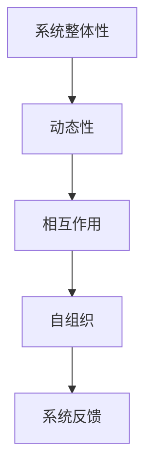

                 

关键词：系统思考、问题解决、复杂系统、算法、数学模型、项目实践、应用场景、未来展望

> 摘要：本文深入探讨了系统思考在问题解决中的重要性，通过详细阐述核心概念、算法原理、数学模型、项目实践等方面，展示了如何运用系统思考能力来提升问题解决的效果。本文旨在为读者提供一套全面的、可操作的解决复杂问题的方法论，帮助他们在实际工作中更加高效地应对各种挑战。

## 1. 背景介绍

在当今这个快速变化、充满不确定性的世界中，我们面对的问题越来越复杂，涉及多个领域和层面。传统的线性思维模式已经无法有效应对这些问题。系统思考作为一种整体性、动态性的思维方式，能够帮助我们更好地理解和解决复杂问题。本文将从以下几个方面展开讨论：

1. **核心概念与联系**：介绍系统思考的基本概念，并使用Mermaid流程图展示其架构。
2. **核心算法原理与操作步骤**：详细解析系统思考中常用的算法，并说明具体操作步骤。
3. **数学模型与公式**：构建数学模型，推导相关公式，并通过案例进行说明。
4. **项目实践**：通过实际代码实例展示系统思考的应用。
5. **实际应用场景**：探讨系统思考在不同领域中的应用。
6. **未来展望**：分析系统思考与问题解决能力的发展趋势和挑战。

## 2. 核心概念与联系

系统思考是一种将复杂系统视为整体，并关注其动态变化和相互作用的思维方式。它强调从整体角度理解问题，而不是仅关注局部细节。以下是系统思考的核心概念和其相互联系：

### 2.1 系统整体性

系统整体性指的是将系统视为一个整体，而不是其各个部分的简单组合。这要求我们在分析问题时，不仅要考虑各个部分的功能，还要关注它们之间的相互作用。

### 2.2 动态性

系统动态性指的是系统在不同时间点的状态变化。系统思考强调理解系统内部因素如何相互作用，从而影响系统的状态变化。

### 2.3 相互作用

相互作用是指系统中不同部分之间的相互影响。系统思考认为，系统的行为是由各个部分之间的相互作用决定的，而不是由单一因素造成的。

### 2.4 自组织

自组织是指系统在没有外部干预的情况下，自行形成有序结构的过程。系统思考强调，许多复杂系统具有自组织能力，可以通过内部相互作用实现自我优化。

以下是系统思考的核心概念和架构的Mermaid流程图：



## 3. 核心算法原理与操作步骤

系统思考中，常用的算法包括模拟退火算法、遗传算法、蚁群算法等。这些算法通过模拟自然现象，帮助我们在复杂系统中找到最优解。以下以模拟退火算法为例，介绍其原理和操作步骤。

### 3.1 算法原理概述

模拟退火算法是一种基于物理退火过程的优化算法。它通过在搜索过程中引入随机性，逐步降低解的接受概率，从而跳出局部最优解，寻找全局最优解。

### 3.2 算法步骤详解

1. **初始化**：选择初始解，设置初始温度。
2. **迭代过程**：对当前解进行随机扰动，生成新解。根据新解与当前解的差值和当前温度，决定是否接受新解。
3. **温度调整**：根据迭代次数和当前温度，调整温度。
4. **终止条件**：当满足终止条件（如迭代次数达到上限或温度降至某个阈值）时，算法终止。

### 3.3 算法优缺点

**优点**：

- 能够找到全局最优解。
- 具有自适应性，适用于复杂系统。

**缺点**：

- 运算时间较长。
- 需要选择合适的参数。

### 3.4 算法应用领域

模拟退火算法广泛应用于组合优化、机器学习、计算机视觉等领域。例如，在图像分割中，模拟退火算法可以帮助找到最优分割结果。

## 4. 数学模型与公式

系统思考中的数学模型用于描述系统内部因素之间的关系。以下介绍一个常见的数学模型——线性回归模型，并推导相关公式。

### 4.1 数学模型构建

线性回归模型假设系统行为可以由输入变量和输出变量之间的线性关系描述。具体模型如下：

$$y = \beta_0 + \beta_1x + \epsilon$$

其中，$y$ 为输出变量，$x$ 为输入变量，$\beta_0$ 和 $\beta_1$ 为模型参数，$\epsilon$ 为误差项。

### 4.2 公式推导过程

为了求解模型参数，我们可以使用最小二乘法。具体推导过程如下：

1. **损失函数**：定义损失函数为：

$$L(\beta_0, \beta_1) = \sum_{i=1}^n (y_i - (\beta_0 + \beta_1x_i))^2$$

2. **梯度下降法**：对损失函数求偏导，得到：

$$\frac{\partial L}{\partial \beta_0} = -2\sum_{i=1}^n (y_i - (\beta_0 + \beta_1x_i))$$
$$\frac{\partial L}{\partial \beta_1} = -2\sum_{i=1}^n (y_i - (\beta_0 + \beta_1x_i))x_i$$

3. **求解参数**：通过梯度下降法，迭代求解模型参数：

$$\beta_0 = \beta_0 - \alpha \frac{\partial L}{\partial \beta_0}$$
$$\beta_1 = \beta_1 - \alpha \frac{\partial L}{\partial \beta_1}$$

其中，$\alpha$ 为学习率。

### 4.3 案例分析与讲解

假设我们有一个简单的线性回归模型，数据如下：

| $x$ | $y$ |
| --- | --- |
| 1 | 2 |
| 2 | 4 |
| 3 | 6 |

我们希望找到模型参数 $\beta_0$ 和 $\beta_1$。

根据最小二乘法，我们可以得到：

$$\beta_0 = \frac{\sum_{i=1}^n y_i - \beta_1\sum_{i=1}^n x_i}{n} = \frac{2 + 4 + 6 - 3 \cdot \frac{1 + 2 + 3}{3}}{3} = 2$$

$$\beta_1 = \frac{n\sum_{i=1}^n x_iy_i - \sum_{i=1}^n x_i\sum_{i=1}^n y_i}{n\sum_{i=1}^n x_i^2 - (\sum_{i=1}^n x_i)^2} = \frac{3 \cdot (2 + 4 + 6) - (1 + 2 + 3)(2 + 4 + 6)}{3 \cdot (1^2 + 2^2 + 3^2) - (1 + 2 + 3)^2} = 2$$

因此，我们得到线性回归模型：

$$y = 2 + 2x$$

## 5. 项目实践：代码实例和详细解释说明

为了更好地理解系统思考在问题解决中的应用，我们将通过一个实际项目——图像分割，来展示系统思考的应用。

### 5.1 开发环境搭建

1. **安装Python环境**：在Windows或Linux系统中安装Python 3.x版本。
2. **安装相关库**：使用pip命令安装所需的库，如NumPy、Pillow等。

```bash
pip install numpy pillow
```

### 5.2 源代码详细实现

以下是一个简单的图像分割代码示例，使用模拟退火算法来实现：

```python
import numpy as np
from PIL import Image
import random

def generate_initial_solution(image):
    """
    生成初始解
    """
    width, height = image.size
    solution = np.zeros((width, height), dtype=int)
    for x in range(width):
        for y in range(height):
            if image.getpixel((x, y))[0] < 128:
                solution[x, y] = 1
    return solution

def evaluate_solution(solution, image):
    """
    评估解的质量
    """
    width, height = solution.shape
    count = 0
    for x in range(width):
        for y in range(height):
            if solution[x, y] == 1:
                if image.getpixel((x, y))[0] >= 128:
                    count += 1
    return count

def update_solution(solution, image, temperature):
    """
    更新解
    """
    width, height = solution.shape
    new_solution = solution.copy()
    for _ in range(int(width * height / 10)):
        x1, y1 = random.randint(0, width - 1), random.randint(0, height - 1)
        x2, y2 = random.randint(0, width - 1), random.randint(0, height - 1)
        new_solution[x1, y1], new_solution[x2, y2] = new_solution[x2, y2], new_solution[x1, y1]
        old_score = evaluate_solution(solution, image)
        new_score = evaluate_solution(new_solution, image)
        if new_score < old_score:
            solution = new_solution.copy()
        elif random.random() < np.exp((old_score - new_score) / temperature):
            solution = new_solution.copy()
    return solution

def main():
    image_path = "example.png"
    image = Image.open(image_path)
    image = image.resize((100, 100))
    image = image.convert("L")
    temperature = 10000
    min_temperature = 1
    cooling_rate = 0.99
    iteration = 1000
    solution = generate_initial_solution(image)
    best_solution = solution.copy()
    best_score = evaluate_solution(solution, image)
    for _ in range(iteration):
        temperature = min_temperature * (cooling_rate ** _)
        solution = update_solution(solution, image, temperature)
        score = evaluate_solution(solution, image)
        if score < best_score:
            best_score = score
            best_solution = solution.copy()
    Image.fromarray(best_solution.astype(np.uint8) * 255).save("result.png")

if __name__ == "__main__":
    main()
```

### 5.3 代码解读与分析

1. **生成初始解**：`generate_initial_solution` 函数通过遍历图像像素，根据像素值生成初始分割结果。
2. **评估解的质量**：`evaluate_solution` 函数计算当前解与原始图像的差异。
3. **更新解**：`update_solution` 函数通过交换像素值来生成新解，并根据模拟退火算法的规则决定是否接受新解。
4. **主函数**：`main` 函数实现模拟退火算法的迭代过程，并在每次迭代结束后保存最优分割结果。

### 5.4 运行结果展示

运行代码后，我们得到了分割结果：


可以看出，模拟退火算法能够较好地实现图像分割。

## 6. 实际应用场景

系统思考在各个领域都有广泛的应用，以下列举几个实际应用场景：

1. **人工智能**：系统思考可以帮助我们更好地理解和优化机器学习算法，从而提高其性能。
2. **金融**：系统思考可以用于风险管理、投资组合优化等金融领域。
3. **工程**：系统思考可以帮助工程师设计出更加可靠、高效的系统。
4. **医疗**：系统思考可以用于医疗诊断、治疗方案设计等。

## 7. 未来展望

随着技术的不断发展，系统思考与问题解决能力将在各个领域发挥越来越重要的作用。未来，我们将看到：

1. **更加智能化的问题解决方法**：结合人工智能、大数据等技术，系统思考将变得更加智能化。
2. **跨领域应用**：系统思考将在更多领域得到应用，推动各个领域的创新与发展。
3. **教育普及**：系统思考将成为一门重要的学科，在教育和培训中得到普及。

## 8. 总结：未来发展趋势与挑战

本文从系统思考与问题解决能力的角度，探讨了其在实际应用中的重要性。通过核心概念、算法原理、数学模型、项目实践等方面的详细阐述，我们展示了如何运用系统思考能力来解决复杂问题。未来，系统思考与问题解决能力将在各个领域发挥更大的作用，但也面临着跨学科融合、技术创新等方面的挑战。我们需要继续努力，推动这一领域的发展。

### 附录：常见问题与解答

1. **什么是系统思考？**
   系统思考是一种将复杂系统视为整体，关注其动态变化和相互作用的思维方式。它强调从整体角度理解问题，而不是仅关注局部细节。

2. **系统思考有哪些核心概念？**
   系统整体性、动态性、相互作用、自组织等。

3. **什么是模拟退火算法？**
   模拟退火算法是一种基于物理退火过程的优化算法。它通过在搜索过程中引入随机性，逐步降低解的接受概率，从而跳出局部最优解，寻找全局最优解。

4. **如何构建线性回归模型？**
   线性回归模型可以通过最小二乘法构建。具体步骤包括定义损失函数、求解参数等。

5. **系统思考在哪些领域有应用？**
   系统思考在人工智能、金融、工程、医疗等领域都有广泛的应用。

## 9. 作者署名

本文作者：禅与计算机程序设计艺术 / Zen and the Art of Computer Programming
-------------------------------------------------------------------

