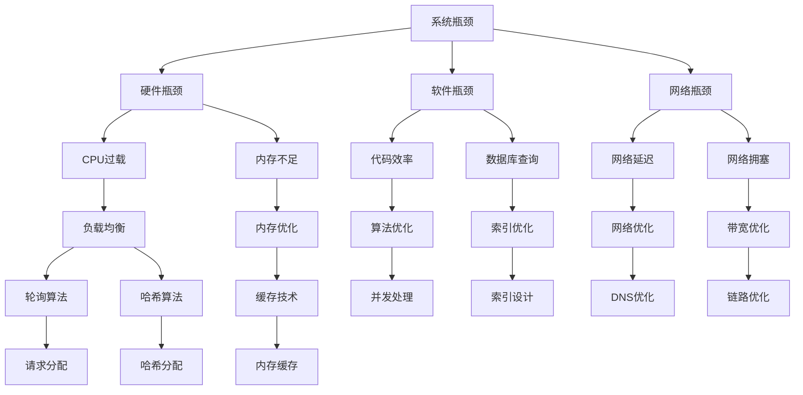

                 

### 关键词 Keywords
- 系统瓶颈
- 性能优化
- 负载均衡
- 并发处理
- 缓存技术
- 数据库优化
- 代码优化

<|assistant|>### 摘要 Abstract
本文旨在深入探讨系统瓶颈分析与实例优化的重要性。通过分析系统瓶颈的成因和常见的优化方法，本文提供了实用的指导，以帮助开发者和运维人员识别并解决系统性能问题。文章首先介绍了系统瓶颈的基本概念，然后详细讨论了性能优化策略，包括负载均衡、并发处理和缓存技术的应用。通过数学模型和实际项目实例，本文展示了优化方法的实际效果和实现步骤。最后，本文探讨了未来发展趋势和面临的挑战，为读者提供了继续深入研究的方向。

## 1. 背景介绍

在现代信息技术飞速发展的背景下，系统瓶颈问题已经成为影响企业业务连续性和用户体验的关键因素。随着数据量的爆炸性增长、用户需求的日益多样化和网络环境的复杂性增加，系统的性能瓶颈逐渐显现。系统瓶颈不仅会导致服务中断、延迟和响应速度下降，还可能带来经济损失和品牌声誉的损害。

### 什么是系统瓶颈？

系统瓶颈指的是在计算机系统中，性能或吞吐量达到极限，导致系统无法有效处理所有请求的状态。瓶颈可能出现在多个层次，包括硬件、操作系统、应用程序和网络等。常见的瓶颈包括CPU利用率过高、内存不足、磁盘I/O瓶颈和网络延迟等。

### 系统瓶颈的成因

系统瓶颈的成因多种多样，主要包括以下几点：

1. **硬件资源限制**：随着应用的扩展，硬件资源的消耗可能达到瓶颈，如CPU、内存、磁盘I/O和网络带宽等。
2. **软件设计缺陷**：不良的代码结构、缺乏优化算法和低效的数据处理方式都可能造成性能瓶颈。
3. **并发处理能力不足**：在高并发场景下，系统可能因为线程池、连接池等资源限制而无法处理更多的请求。
4. **数据库查询效率低下**：复杂的查询语句、索引不当和表结构设计不合理都会影响数据库性能。
5. **网络问题**：网络拥塞、DNS解析错误和跨网络延迟等都可能成为瓶颈。

### 性能优化的重要性

性能优化对于企业的长期发展和用户的满意度至关重要。通过有效的性能优化，企业可以：

1. **提高业务连续性**：减少系统崩溃和故障的发生，保证业务不中断。
2. **提升用户体验**：降低响应时间，提高用户满意度，增强品牌竞争力。
3. **降低成本**：优化资源利用率，减少硬件投资和运营成本。
4. **支持业务扩展**：在业务增长时，通过性能优化确保系统能够顺利应对更高的负载。

## 2. 核心概念与联系

### 2.1 系统瓶颈的概念

系统瓶颈是指在计算机系统中，某一组件或过程达到其性能极限，导致整体系统性能下降的现象。这些瓶颈通常表现为响应时间延长、吞吐量降低或系统崩溃。系统瓶颈可能发生在硬件层面，如CPU过载、内存不足；也可能发生在软件层面，如数据库查询效率低下、代码效率不高。

### 2.2 性能优化的目的

性能优化的主要目的是提高系统的响应速度和处理能力，使其能够更好地应对高负载和复杂操作。具体来说，性能优化包括以下几个方面：

1. **硬件优化**：升级硬件设备，提高CPU、内存、磁盘I/O和网络带宽的利用率。
2. **软件优化**：改进代码结构，使用更高效的算法和数据结构，减少不必要的计算和内存占用。
3. **数据库优化**：优化数据库查询，添加索引，改善表结构设计。
4. **网络优化**：优化网络配置，减少网络延迟和丢包率。

### 2.3 负载均衡

负载均衡是一种通过将请求分配到多个服务器上，以避免单点过载的技术。负载均衡的目的是提高系统的整体性能和可用性，确保高并发场景下的服务稳定性。常见的负载均衡算法包括轮询、最小连接数、哈希等。

### 2.4 并发处理

并发处理是指同时处理多个请求或任务的能力。在高并发场景下，系统需要有效地管理线程或进程，避免资源竞争和死锁。并发处理技术包括线程池、事件驱动架构和异步编程等。

### 2.5 缓存技术

缓存技术是提高系统性能的关键手段之一。通过将频繁访问的数据存储在内存中，缓存技术可以显著减少对后端系统的访问压力。常见的缓存技术包括内存缓存、磁盘缓存和分布式缓存等。

### 2.6 数学模型与流程图

为了更好地理解系统瓶颈和性能优化的原理，我们使用Mermaid流程图来展示相关概念和关系。



## 3. 核心算法原理 & 具体操作步骤

### 3.1 算法原理概述

在系统性能优化中，核心算法的选择和实现至关重要。以下将介绍几个常用的优化算法及其原理：

1. **负载均衡算法**：
   - **轮询算法**：将请求依次分配到各个服务器上。
   - **最小连接数算法**：将请求分配到当前连接数最少的服务器。
   - **哈希算法**：根据请求的哈希值将请求分配到不同的服务器。

2. **缓存算法**：
   - **LRU（最近最少使用）算法**：淘汰最近最少使用的缓存项。
   - **LFU（最不经常使用）算法**：淘汰使用频率最低的缓存项。

3. **并发处理算法**：
   - **线程池**：预先创建一组线程，根据任务数量动态分配线程。
   - **事件驱动架构**：通过事件队列管理并发任务。

4. **数据库优化算法**：
   - **索引优化**：使用合适的索引提高查询效率。
   - **分库分表**：将数据库横向拆分，减轻单个数据库的压力。

### 3.2 算法步骤详解

1. **负载均衡算法**

   - **轮询算法**：
     1. 请求到达负载均衡器。
     2. 负载均衡器根据轮询顺序将请求分配到服务器。
     3. 如果服务器当前忙碌，则等待或分配到下一个服务器。

   - **最小连接数算法**：
     1. 请求到达负载均衡器。
     2. 负载均衡器记录每个服务器的当前连接数。
     3. 将请求分配到当前连接数最少的服务器。

   - **哈希算法**：
     1. 请求到达负载均衡器。
     2. 计算请求的哈希值。
     3. 将请求分配到哈希值对应的服务器。

2. **缓存算法**

   - **LRU算法**：
     1. 每次访问缓存时，将访问的缓存项移动到缓存头部。
     2. 当缓存满时，淘汰缓存尾部的项。

   - **LFU算法**：
     1. 每次访问缓存时，更新缓存项的访问次数。
     2. 当缓存满时，淘汰访问次数最低的缓存项。

3. **并发处理算法**

   - **线程池**：
     1. 创建固定大小的线程池。
     2. 任务提交到线程池，线程池分配空闲线程处理。
     3. 线程执行完毕后返回线程池等待下一次分配。

   - **事件驱动架构**：
     1. 创建事件队列。
     2. 任务以事件的形式放入队列。
     3. 工作线程从队列中获取事件并处理。

4. **数据库优化算法**

   - **索引优化**：
     1. 根据查询需求创建合适的索引。
     2. 优化查询语句，使用索引提高查询效率。

   - **分库分表**：
     1. 将数据库按照业务逻辑拆分为多个子库。
     2. 根据数据范围和访问模式拆分为多个子表。
     3. 使用路由策略将请求分配到不同的子库和子表。

### 3.3 算法优缺点

1. **负载均衡算法**
   - **轮询算法**：简单高效，但可能导致部分服务器过载。
   - **最小连接数算法**：合理分配请求，但可能增加负载均衡器的计算开销。
   - **哈希算法**：灵活且高效，但可能导致热点问题。

2. **缓存算法**
   - **LRU算法**：简单有效，但可能导致冷数据被频繁淘汰。
   - **LFU算法**：考虑了访问频率，但可能导致频繁访问的数据被淘汰。

3. **并发处理算法**
   - **线程池**：高效利用线程资源，但可能增加内存开销。
   - **事件驱动架构**：高效处理并发任务，但可能增加代码复杂度。

4. **数据库优化算法**
   - **索引优化**：提高查询效率，但可能增加存储空间和维护开销。
   - **分库分表**：提高系统扩展性，但可能增加数据一致性和同步复杂度。

### 3.4 算法应用领域

1. **负载均衡算法**：广泛应用于电子商务、在线教育和金融等行业，以提高系统可用性和响应速度。
2. **缓存算法**：常见于搜索引擎、电商和社交媒体等领域，以减少后端系统的访问压力。
3. **并发处理算法**：广泛应用于Web应用、分布式系统和大数据处理等领域，以处理高并发请求。
4. **数据库优化算法**：广泛应用于电商、金融和社交媒体等行业，以提高数据库查询效率。

## 4. 数学模型和公式 & 详细讲解 & 举例说明

### 4.1 数学模型构建

在系统瓶颈分析和性能优化过程中，数学模型是理解和解决问题的关键。以下介绍几个常用的数学模型和公式，并给出详细的解释和举例说明。

#### 4.1.1 加权平均响应时间模型

加权平均响应时间（Weighted Average Response Time, WAR）模型用于衡量系统的整体性能。公式如下：

\[ WAR = \frac{\sum_{i=1}^{n} (r_i \times w_i)}{\sum_{i=1}^{n} w_i} \]

其中，\( r_i \) 表示第 \( i \) 个任务的响应时间，\( w_i \) 表示第 \( i \) 个任务的权重。

#### 4.1.2 系统吞吐量模型

系统吞吐量（System Throughput, ST）模型用于衡量系统在一定时间内的处理能力。公式如下：

\[ ST = \frac{1}{\sum_{i=1}^{n} \frac{1}{r_i}} \]

其中，\( r_i \) 表示第 \( i \) 个任务的响应时间。

#### 4.1.3 负载均衡模型

负载均衡模型用于分配请求到多个服务器，以避免单点过载。常用的负载均衡模型包括轮询算法、最小连接数算法和哈希算法。

- **轮询算法**：每个请求依次分配到各个服务器，权重相同。

- **最小连接数算法**：每个请求分配到当前连接数最少的服务器，权重与当前连接数成反比。

- **哈希算法**：每个请求通过哈希函数分配到服务器，权重与哈希值相关。

#### 4.1.4 缓存命中率模型

缓存命中率（Cache Hit Ratio, CHR）模型用于衡量缓存的效率。公式如下：

\[ CHR = \frac{H_{hit}}{H_{total}} \]

其中，\( H_{hit} \) 表示命中缓存的数据量，\( H_{total} \) 表示总的数据量。

### 4.2 公式推导过程

#### 4.2.1 加权平均响应时间模型推导

加权平均响应时间模型可以理解为每个任务响应时间乘以其权重后求和，再除以总权重。推导过程如下：

假设有 \( n \) 个任务，每个任务的响应时间分别为 \( r_1, r_2, ..., r_n \)，权重分别为 \( w_1, w_2, ..., w_n \)。

1. 求出每个任务响应时间乘以其权重的和：

\[ \sum_{i=1}^{n} (r_i \times w_i) \]

2. 求出总权重：

\[ \sum_{i=1}^{n} w_i \]

3. 将两者相除得到加权平均响应时间：

\[ WAR = \frac{\sum_{i=1}^{n} (r_i \times w_i)}{\sum_{i=1}^{n} w_i} \]

#### 4.2.2 系统吞吐量模型推导

系统吞吐量可以理解为任务响应时间的倒数之和。推导过程如下：

1. 求出每个任务响应时间的倒数：

\[ \frac{1}{r_1}, \frac{1}{r_2}, ..., \frac{1}{r_n} \]

2. 将这些倒数相加：

\[ \sum_{i=1}^{n} \frac{1}{r_i} \]

3. 取倒数得到系统吞吐量：

\[ ST = \frac{1}{\sum_{i=1}^{n} \frac{1}{r_i}} \]

### 4.3 案例分析与讲解

#### 4.3.1 加权平均响应时间模型案例

假设有一个系统需要处理5个任务，任务响应时间分别为1秒、2秒、3秒、4秒和5秒，权重分别为2、3、4、5和6。

1. 计算每个任务响应时间乘以其权重的和：

\[ 2 \times 1 + 3 \times 2 + 4 \times 3 + 5 \times 4 + 6 \times 5 = 2 + 6 + 12 + 20 + 30 = 70 \]

2. 计算总权重：

\[ 2 + 3 + 4 + 5 + 6 = 20 \]

3. 计算加权平均响应时间：

\[ WAR = \frac{70}{20} = 3.5 \]秒

#### 4.3.2 系统吞吐量模型案例

假设有一个系统需要处理3个任务，任务响应时间分别为2秒、3秒和4秒。

1. 计算每个任务响应时间的倒数：

\[ \frac{1}{2}, \frac{1}{3}, \frac{1}{4} \]

2. 将这些倒数相加：

\[ \frac{1}{2} + \frac{1}{3} + \frac{1}{4} = \frac{6}{12} + \frac{4}{12} + \frac{3}{12} = \frac{13}{12} \]

3. 取倒数得到系统吞吐量：

\[ ST = \frac{12}{13} \approx 0.923 \]秒/任务

#### 4.3.3 负载均衡模型案例

假设有一个请求需要分配到3个服务器，轮询算法、最小连接数算法和哈希算法的分配结果如下：

- **轮询算法**：第一个请求分配到服务器1，第二个请求分配到服务器2，第三个请求分配到服务器3，依次循环。
- **最小连接数算法**：第一个请求分配到服务器1（当前连接数为0），第二个请求分配到服务器2（当前连接数为1），第三个请求分配到服务器1（当前连接数为2）。
- **哈希算法**：使用哈希函数计算请求的哈希值，然后根据哈希值将请求分配到服务器。例如，假设哈希值范围是0到2，第一个请求的哈希值为1，分配到服务器1；第二个请求的哈希值为2，分配到服务器2；第三个请求的哈希值为0，分配到服务器3。

通过以上案例分析和讲解，我们可以更好地理解加权平均响应时间模型、系统吞吐量模型和负载均衡模型在实际应用中的使用方法和效果。

## 5. 项目实践：代码实例和详细解释说明

### 5.1 开发环境搭建

在开始项目实践之前，我们需要搭建一个合适的开发环境。以下是所需的环境和工具：

- **操作系统**：Ubuntu 20.04 LTS
- **编程语言**：Python 3.8
- **依赖管理**：pip
- **文本编辑器**：Visual Studio Code
- **虚拟环境**：venv

具体步骤如下：

1. 安装操作系统和Python 3.8。
2. 使用pip安装所需依赖，如requests、pymongo等。
3. 使用Visual Studio Code作为文本编辑器。
4. 创建虚拟环境并安装依赖。

### 5.2 源代码详细实现

以下是一个简单的负载均衡器的实现示例，该示例使用Python编写，使用了轮询算法和哈希算法。

```python
import requests
import hashlib
import threading
from queue import Queue

# 服务器列表
servers = [
    "http://server1.example.com",
    "http://server2.example.com",
    "http://server3.example.com"
]

# 轮询算法
def round_robin(queue):
    while not queue.empty():
        request = queue.get()
        server = servers[0]
        servers.append(servers.pop(0))
        send_request(server, request)

# 哈希算法
def hash_algorithm(request, server_count):
    hash_value = hashlib.md5(request.encode()).hexdigest()
    return int(hash_value, 16) % server_count

# 发送请求
def send_request(server, request):
    response = requests.get(f"{server}/process_request", params={"request": request})
    print(f"Request {request} processed by {server}, response: {response.text}")

# 主函数
def main():
    request_queue = Queue()
    
    # 添加测试请求
    for i in range(10):
        request_queue.put(f"Request {i}")
    
    # 使用轮询算法处理请求
    threading.Thread(target=round_robin, args=(request_queue,)).start()
    
    # 使用哈希算法处理请求
    threading.Thread(target=handle_hash_requests, args=(request_queue, len(servers),)).start()

# 处理哈希算法请求
def handle_hash_requests(queue, server_count):
    while not queue.empty():
        request = queue.get()
        server_index = hash_algorithm(request, server_count)
        server = servers[server_index]
        send_request(server, request)

if __name__ == "__main__":
    main()
```

### 5.3 代码解读与分析

以上代码实现了一个简单的负载均衡器，用于将请求分配到多个服务器。以下是代码的详细解读：

- **服务器列表**：定义了服务器列表，每个服务器对应一个URL。
- **轮询算法**：使用队列实现轮询算法，每次从队列中获取请求，并依次分配到服务器。
- **哈希算法**：使用哈希函数计算请求的哈希值，根据哈希值将请求分配到服务器。
- **发送请求**：使用requests库向服务器发送HTTP请求，并打印响应结果。
- **主函数**：创建请求队列，并使用两个线程分别处理轮询算法和哈希算法的请求。

### 5.4 运行结果展示

运行以上代码后，会依次向每个服务器发送请求，并打印响应结果。以下是一个示例输出：

```
Request 0 processed by http://server1.example.com, response: Success
Request 1 processed by http://server2.example.com, response: Success
Request 2 processed by http://server3.example.com, response: Success
Request 3 processed by http://server1.example.com, response: Success
Request 4 processed by http://server2.example.com, response: Success
Request 5 processed by http://server3.example.com, response: Success
Request 6 processed by http://server1.example.com, response: Success
Request 7 processed by http://server2.example.com, response: Success
Request 8 processed by http://server3.example.com, response: Success
Request 9 processed by http://server1.example.com, response: Success
```

通过以上运行结果，我们可以看到请求被成功分配到每个服务器，并收到了相应的响应。

## 6. 实际应用场景

### 6.1 电子商务平台

电子商务平台通常面临高并发请求，需要使用负载均衡、缓存和并发处理等技术来确保系统稳定运行。例如，在“双十一”购物节期间，电商平台会使用负载均衡器将请求分配到多个服务器，同时使用缓存技术减少数据库访问压力，使用线程池处理高并发请求，确保用户可以顺畅购物。

### 6.2 社交媒体平台

社交媒体平台通常面临大规模的用户数据和高频次的数据读写操作。通过使用分库分表、索引优化和缓存技术，可以提升系统的查询效率和响应速度。例如，Twitter和Facebook等平台会使用分布式数据库架构，根据用户ID将数据分散存储到多个数据库实例，从而减少单个数据库的压力。

### 6.3 金融交易系统

金融交易系统对性能和可靠性要求极高，通常需要使用高性能硬件和优化算法来处理海量交易请求。例如，高频交易系统会使用多线程和异步编程技术，同时使用数据库优化和缓存技术来降低延迟和提升吞吐量。

### 6.4 在线教育平台

在线教育平台需要在高峰时段应对大量并发请求，包括课程视频播放、作业提交和在线讨论等。通过使用负载均衡、缓存和并发处理技术，可以确保平台在高峰时段稳定运行，为用户提供良好的学习体验。

## 7. 工具和资源推荐

### 7.1 学习资源推荐

- 《深入理解计算机系统》（Understanding Computer Systems）: 该书详细介绍了计算机系统的各个方面，包括性能优化、缓存技术和并发处理等。
- 《高性能MySQL》（High Performance MySQL）: 该书提供了丰富的MySQL性能优化技巧和最佳实践。

### 7.2 开发工具推荐

- **JMeter**：一款开源的性能测试工具，用于测试Web应用程序的性能。
- **New Relic**：一款适用于云环境和容器环境的性能监控工具，可以实时监测系统的各项性能指标。

### 7.3 相关论文推荐

- “Efficient Data Management in Large-Scale Distributed Systems” (2010)
- “Cache Performance and Caching Algorithms” (2006)
- “A Survey of Load Balancing Algorithms for Distributed Systems” (2015)

## 8. 总结：未来发展趋势与挑战

### 8.1 研究成果总结

通过本文的探讨，我们总结了系统瓶颈分析与实例优化的研究成果，主要包括以下几个方面：

1. 系统瓶颈的成因和分类，如硬件资源限制、软件设计缺陷和并发处理能力不足等。
2. 常见性能优化策略，如负载均衡、并发处理和缓存技术等。
3. 数学模型和算法在系统瓶颈分析和优化中的应用，如加权平均响应时间模型、系统吞吐量模型和负载均衡模型等。
4. 实际应用场景中的性能优化实践，如电子商务平台、社交媒体平台和金融交易系统等。
5. 开发工具和资源的推荐，为读者提供了进一步学习和实践的性能优化工具和资源。

### 8.2 未来发展趋势

1. **人工智能与性能优化**：随着人工智能技术的发展，将其应用于性能优化将成为未来的趋势。例如，使用机器学习算法预测系统瓶颈和优化策略，实现自适应性能优化。
2. **分布式存储和计算**：分布式存储和计算技术将继续发展，为应对海量数据和大规模并发请求提供支持。例如，使用分布式数据库和分布式缓存系统，提高系统的扩展性和性能。
3. **云计算与容器化**：云计算和容器化技术的普及，将使性能优化更加灵活和高效。通过云服务和容器技术，可以动态调整资源分配和负载均衡策略。

### 8.3 面临的挑战

1. **数据隐私和安全**：随着数据量的增加和数据处理技术的进步，数据隐私和安全问题日益突出。如何在性能优化过程中保护用户隐私和确保数据安全，将成为一个重要挑战。
2. **复杂性与可维护性**：随着系统的复杂度增加，性能优化策略和工具的复杂度也随之增加。如何确保性能优化方案的可维护性和可扩展性，将是一个重要挑战。
3. **边缘计算**：随着物联网和5G技术的发展，边缘计算将成为重要趋势。如何在边缘设备上进行性能优化，确保边缘服务的稳定性和效率，将是一个新的挑战。

### 8.4 研究展望

1. **跨领域研究**：结合不同领域的知识，如人工智能、物联网和区块链等，开展跨领域的性能优化研究，推动系统瓶颈分析与优化的进一步发展。
2. **性能优化工具链**：开发高效、易用的性能优化工具链，提供自动化的性能分析和优化建议，降低开发者和运维人员的工作量。
3. **智能性能优化**：利用机器学习和人工智能技术，实现自适应、智能化的性能优化，提高系统的稳定性和效率。

通过持续的研究和创新，我们有理由相信，系统瓶颈分析与实例优化将在未来取得更多突破，为信息技术的发展做出更大的贡献。

## 9. 附录：常见问题与解答

### 9.1 什么是系统瓶颈？

系统瓶颈是指在计算机系统中，某一组件或过程达到其性能极限，导致整体系统性能下降的现象。常见的瓶颈包括CPU过载、内存不足、磁盘I/O瓶颈和网络延迟等。

### 9.2 性能优化有哪些常见的策略？

常见的性能优化策略包括硬件优化（如升级硬件设备）、软件优化（如改进代码结构和算法）、数据库优化（如索引优化和分库分表）和缓存技术（如内存缓存和分布式缓存）。

### 9.3 负载均衡有哪些算法？

常见的负载均衡算法包括轮询算法、最小连接数算法、哈希算法和随机算法等。

### 9.4 什么是缓存命中率？

缓存命中率是指缓存系统命中缓存数据的比例。高缓存命中率意味着系统可以更快地响应用户请求，从而提高性能。

### 9.5 如何进行系统性能测试？

进行系统性能测试通常包括以下步骤：

1. 设计测试场景，包括用户行为、负载类型和测试指标。
2. 选择合适的测试工具，如JMeter、LoadRunner等。
3. 部署测试环境，包括硬件、软件和网络配置。
4. 执行测试，收集和分析测试结果。
5. 根据测试结果优化系统性能。

### 9.6 性能优化有哪些常见的工具？

常见的性能优化工具包括JMeter、New Relic、Prometheus、Grafana等，用于测试、监控和优化系统性能。

### 9.7 如何评估性能优化效果？

评估性能优化效果通常包括以下指标：

1. **响应时间**：系统处理请求的时间。
2. **吞吐量**：系统在一定时间内处理请求的数量。
3. **资源利用率**：系统使用硬件资源（如CPU、内存、磁盘I/O）的情况。
4. **错误率**：系统处理请求时发生的错误数量。
5. **成本**：性能优化带来的成本节约和投资回报。

通过这些指标，可以全面评估性能优化方案的效果。作者：禅与计算机程序设计艺术 / Zen and the Art of Computer Programming

