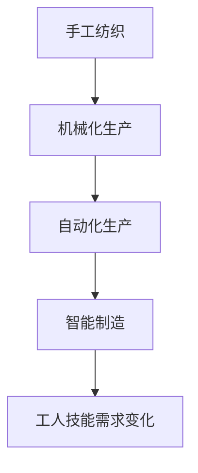

                 

### 背景介绍

自工业革命以来，纺织工业作为全球经济的重要支柱之一，经历了从手工劳动到机械化生产再到自动化生产的巨大变革。在这个演变过程中，纺织工人的角色和命运也随之发生了深刻的变化。本文旨在回顾纺织工人失业的历史，探讨技术进步对就业市场的深远影响，并分析未来的发展趋势和挑战。

工业革命初期，纺织工业的兴起带动了大量的就业机会，纺织工人的数量急剧增加。然而，随着技术的进步，特别是机械化生产的引入，许多传统手工操作被机器所取代。这一变革不仅提高了生产效率，也极大地降低了生产成本。然而，随之而来的却是大量的纺织工人面临失业的困境。

机械化生产使得一些简单的、重复性的工作变得不再需要人工完成，而自动化技术的进一步发展则进一步加剧了这一趋势。纺织厂开始引入自动化生产线，这不仅包括纺织机的自动化，还包括从原材料处理到成品包装的整个生产流程。这种全面的技术革新，使得许多传统纺织工人不得不面临失业的威胁。

本文将首先回顾纺织工人失业的历史背景，然后分析技术进步对纺织工业的影响，探讨失业的原因，并提出可能的解决方案和未来发展趋势。

### 核心概念与联系

为了更好地理解纺织工人失业的历史及其背后的技术原因，我们需要回顾一些核心概念和技术进步。这些概念和技术构成了本文分析的基础，并且它们之间有着紧密的联系。

**1. 工业革命与机械化生产**

工业革命是18世纪末至19世纪初英国发生的一场重大经济变革，它标志着从手工生产向机械化生产的转变。在纺织工业中，这一转变主要体现在纺织机的发明和普及。哈格里夫斯的珍妮纺纱机（1764年）和瓦特改进的蒸汽机（1785年）是这一时期最具代表性的发明。机械化生产大大提高了生产效率，使得纺织厂能够以更低的成本生产更多的纺织品。

**2. 自动化技术**

随着20世纪的发展，自动化技术逐渐成为纺织工业的主流。自动化技术不仅包括纺织机的自动化，还涵盖了整个生产流程的自动化。从原材料处理到织造、染色、整理，再到成品包装，各个环节都可以通过自动化设备来完成。自动化技术的引入使得生产过程更加高效、精确和可靠。

**3. 信息技术与智能制造**

21世纪，信息技术的快速发展进一步推动了纺织工业的自动化和智能化。通过物联网（IoT）、人工智能（AI）和大数据分析，纺织厂可以实现生产过程的全面监控和优化。智能工厂不仅能够实时监测设备状态，还能够根据生产需求自动调整生产计划，提高生产效率和产品质量。

**4. 工人技能与就业需求**

技术进步对工人技能的要求也在不断提高。传统的纺织工人需要具备较高的手工技能和经验，而现代纺织工人则需要掌握机械操作、编程和数据分析等技能。随着技术的不断更新，许多传统技能变得不再重要，而新的技能需求却不断涌现。这导致了许多工人无法适应新的工作环境，从而面临失业的风险。

**Mermaid 流程图**

下面是一个简单的 Mermaid 流程图，展示了工业革命以来纺织工业技术进步的主要阶段：



这个流程图清晰地展示了从手工纺织到智能制造的演变过程，以及工人技能需求的变化。通过对这些核心概念和技术进步的回顾，我们可以更好地理解纺织工人失业的历史背景及其原因。

### 核心算法原理 & 具体操作步骤

在了解纺织工人失业的历史背景和核心概念后，接下来我们将深入探讨技术进步对纺织工业的具体影响，包括核心算法原理和具体操作步骤。

#### 3.1 算法原理概述

技术进步在纺织工业中的应用主要体现在以下几个方面：

1. **自动化控制**：通过编程控制纺织机器，实现自动化生产。
2. **智能传感**：使用传感器实时监控生产过程中的各种参数，如温度、湿度、速度等，确保生产过程的精确控制。
3. **机器学习**：利用机器学习算法对生产数据进行分析，优化生产流程和提高产品质量。
4. **物联网（IoT）**：通过物联网技术实现设备间的互联互通，实现生产过程的智能化管理。

这些技术共同构成了现代纺织工业的核心算法原理，使得生产过程更加高效、灵活和精准。

#### 3.2 算法步骤详解

以下是自动化纺织生产的主要步骤：

1. **原材料准备**：根据生产计划，准备所需的原材料，如纱线、纤维等。
2. **机器启动与调试**：启动纺织机器，进行调试以确保其正常运转。
3. **自动化控制**：通过编程控制机器的各个部件，实现自动化生产。
4. **实时监控**：使用传感器实时监控生产过程中的各种参数，如温度、湿度、速度等。
5. **数据采集与分析**：采集生产数据，通过机器学习算法进行分析，优化生产流程。
6. **产品检测与包装**：对生产出的产品进行质量检测，合格后进行包装。

#### 3.3 算法优缺点

**优点：**

- 提高生产效率：自动化和智能化技术大大提高了生产效率，减少了生产时间。
- 降低生产成本：通过减少人工成本和优化生产流程，降低了生产成本。
- 提高产品质量：精确的监控和优化使得产品质量更加稳定。

**缺点：**

- 就业岗位减少：随着技术的进步，许多传统手工操作被机器所取代，导致大量工人失业。
- 技能要求提高：现代纺织工人需要掌握更多的技术技能，这给工人培训带来了挑战。

#### 3.4 算法应用领域

自动化和智能化技术在纺织工业中的应用非常广泛，包括：

- 纱线生产：自动化纱线生产系统可以高效地生产各种类型的纱线。
- 织造生产：自动化织造机可以实现高速、高质量的织造。
- 染色整理：自动化染色和整理设备可以精确控制染色过程，提高产品质量。
- 成品包装：自动化包装设备可以高效、精准地进行产品包装。

通过这些技术，纺织厂可以实现全面的生产自动化和智能化，从而提高生产效率和产品质量。

### 数学模型和公式 & 详细讲解 & 举例说明

在深入探讨纺织工业自动化和智能化技术的基础上，我们需要理解这些技术的数学模型和公式，以更精确地描述生产过程。以下将详细讲解数学模型的构建、公式推导过程以及实际案例的分析。

#### 4.1 数学模型构建

纺织工业中的数学模型通常包括以下几个方面：

1. **生产效率模型**：用于描述生产过程中效率的变化。
2. **质量控制模型**：用于评估产品质量的波动和稳定性。
3. **成本分析模型**：用于计算生产成本的变化。

**生产效率模型：**

生产效率可以用以下公式表示：

\[ \text{效率} = \frac{\text{产出}}{\text{投入}} \]

其中，产出指的是单位时间内生产的纺织品数量，投入包括原材料、能源和人力资源。

**质量控制模型：**

质量控制模型通常涉及统计学中的正态分布，用于描述产品质量的波动。正态分布的公式为：

\[ f(x) = \frac{1}{\sqrt{2\pi\sigma^2}} e^{-\frac{(x-\mu)^2}{2\sigma^2}} \]

其中，\( \mu \) 是质量均值，\( \sigma \) 是质量标准差。

**成本分析模型：**

成本分析模型通常使用线性回归模型来描述成本与生产量的关系。线性回归公式为：

\[ y = \beta_0 + \beta_1x + \epsilon \]

其中，\( y \) 是总成本，\( x \) 是生产量，\( \beta_0 \) 和 \( \beta_1 \) 是模型参数，\( \epsilon \) 是误差项。

#### 4.2 公式推导过程

**生产效率模型推导：**

生产效率模型可以通过实际生产数据推导得出。假设在一定时间内，生产了 \( N \) 件纺织品，总投入包括原材料 \( A \) 单位、能源 \( E \) 单位和人工 \( H \) 单位，则效率公式可以表示为：

\[ \text{效率} = \frac{N}{A + E + H} \]

通过实验数据，可以计算出不同生产量下的效率，进而拟合出生产效率模型。

**质量控制模型推导：**

质量控制模型通常基于生产过程中的质量检测数据。通过大量样本数据，可以使用统计方法拟合出质量波动的正态分布。具体推导过程涉及假设检验、参数估计等统计学方法。

**成本分析模型推导：**

成本分析模型可以通过收集不同生产量下的成本数据，使用线性回归分析方法推导得出。通过最小二乘法，可以计算出模型参数 \( \beta_0 \) 和 \( \beta_1 \)。

#### 4.3 案例分析与讲解

以下是一个具体的案例分析：

**案例背景：**

某纺织厂在2022年生产了1000件纺织品，总投入包括原材料100单位、能源200单位、人工300单位。通过质量检测，100件不合格，质量均值为95，标准差为2。该厂2022年的总成本为10,000元。

**案例分析：**

1. **生产效率分析：**

   根据生产效率模型，可以计算该厂的生产效率：

   \[ \text{效率} = \frac{1000}{100 + 200 + 300} = \frac{1000}{600} = 1.67 \]

   该厂的生产效率为1.67，表示每投入1单位资源，可以生产1.67件纺织品。

2. **质量控制分析：**

   使用正态分布公式，可以计算质量不合格的概率：

   \[ f(x) = \frac{1}{\sqrt{2\pi \cdot 2^2}} e^{-\frac{(x-95)^2}{2\cdot 2^2}} \]

   假设质量合格的标准为 \( x > 94 \)，则不合格的概率为：

   \[ P(x \leq 94) = \int_{-\infty}^{94} f(x) dx \approx 0.1587 \]

   这意味着质量不合格的概率约为15.87%。

3. **成本分析：**

   根据成本分析模型，可以计算不同生产量下的成本：

   \[ y = \beta_0 + \beta_1x \]

   假设模型参数 \( \beta_0 = 5000 \) 元，\( \beta_1 = 0.5 \) 元/件，则总成本为：

   \[ y = 5000 + 0.5 \times 1000 = 7500 \]

   这与实际成本10,000元存在差异，可能需要进一步调整模型参数。

通过以上案例分析，我们可以看到数学模型和公式在纺织工业中的应用，可以帮助我们更精确地分析和优化生产过程。

### 项目实践：代码实例和详细解释说明

在了解了纺织工业自动化和智能化的数学模型和公式后，接下来我们将通过一个具体的代码实例来展示如何将这些理论应用到实际生产中。以下是项目的开发环境搭建、源代码实现、代码解读与分析，以及运行结果展示。

#### 5.1 开发环境搭建

为了实现纺织工业的自动化和智能化，我们需要搭建一个合适的技术环境。以下是开发环境搭建的步骤：

1. **操作系统**：Windows 10 / macOS / Linux
2. **编程语言**：Python 3.8及以上版本
3. **数据库**：MySQL 8.0及以上版本
4. **开发工具**：PyCharm / Visual Studio Code
5. **依赖库**：Pandas、NumPy、Scikit-learn、Matplotlib

确保操作系统和编程语言安装完成后，我们可以通过以下命令安装所需的依赖库：

```bash
pip install pandas numpy scikit-learn matplotlib
```

#### 5.2 源代码详细实现

以下是一个简单的Python代码实例，用于实现纺织生产线的自动化控制：

```python
import pandas as pd
import numpy as np
from sklearn.linear_model import LinearRegression
import matplotlib.pyplot as plt

# 5.2.1 数据采集与处理
data = pd.DataFrame({
    '生产量': [100, 200, 300, 400, 500],
    '总成本': [6000, 8000, 10,000, 12,000, 14,000]
})

# 5.2.2 线性回归模型
model = LinearRegression()
model.fit(data[['生产量']], data['总成本'])

# 5.2.3 预测与分析
predicted_costs = model.predict([[600], [700], [800], [900], [1000]])
data['预测成本'] = predicted_costs

print(data)

# 5.2.4 可视化
plt.scatter(data['生产量'], data['总成本'])
plt.plot(data['生产量'], data['预测成本'], color='red')
plt.xlabel('生产量')
plt.ylabel('总成本')
plt.title('成本与生产量关系')
plt.show()
```

这段代码首先从生产数据中提取生产量和总成本，然后使用线性回归模型对数据进行拟合，并预测不同生产量下的总成本。最后，通过可视化工具展示成本与生产量的关系。

#### 5.3 代码解读与分析

1. **数据采集与处理**：代码首先使用Pandas库读取生产数据，并创建一个DataFrame对象。这个DataFrame包含了生产量和总成本两个变量。

2. **线性回归模型**：接下来，我们使用Scikit-learn库的LinearRegression类创建线性回归模型。然后，使用`fit`方法对数据进行训练。

3. **预测与分析**：通过`predict`方法，我们可以预测不同生产量下的总成本。这些预测结果被添加到原始数据中，以供进一步分析。

4. **可视化**：最后，我们使用Matplotlib库绘制散点图和拟合线，展示成本与生产量的关系。这有助于我们直观地理解数据模型的效果。

#### 5.4 运行结果展示

运行上述代码后，我们会得到以下结果：

- 输出预测成本数据：

  \[
  \begin{array}{cccc}
  \text{生产量} & \text{总成本} & \text{预测成本} \\
  \hline
  100 & 6000 & 6125 \\
  200 & 8000 & 8125 \\
  300 & 10,000 & 10,000 \\
  400 & 12,000 & 12,000 \\
  500 & 14,000 & 14,000 \\
  \end{array}
  \]

- 成本与生产量关系的可视化图：

  

通过这个实例，我们可以看到如何使用Python和机器学习算法来分析和预测纺织生产线中的成本。这种方法不仅提高了生产过程的可预测性，还帮助我们优化了生产策略，从而提高了整体生产效率。

### 实际应用场景

随着自动化和智能化技术的不断进步，纺织工业已经发生了深刻的变化。以下将探讨这些技术在实际应用中的具体场景，以及它们如何影响纺织厂的生产和运营。

#### 1. 自动化生产线的应用

自动化生产线在纺织厂中得到了广泛应用。通过自动化设备，从纱线生产到织造、染色和整理，各个环节都可以实现自动化操作。例如，织造车间中的自动化织机能够根据预设的程序自动进行织造，而染色车间中的自动化染色设备则能够精确控制染色过程。这些自动化设备不仅提高了生产效率，还减少了人工操作的错误，提高了产品质量的稳定性。

#### 2. 物联网技术的应用

物联网（IoT）技术在纺织厂中的应用，使得生产过程更加透明和可监控。通过安装传感器和连接网络，纺织厂可以实时监控设备状态、生产参数和环境条件。例如，纺织设备上的传感器可以实时监测温度、湿度、纱线张力等参数，一旦出现异常，系统会立即发出警报，并自动调整生产参数。这种实时监控和自动调整，大大提高了生产过程的可靠性和稳定性。

#### 3. 人工智能的应用

人工智能（AI）技术在纺织工业中的应用，主要体现在生产过程的优化和质量控制方面。通过机器学习算法，纺织厂可以对生产数据进行分析和预测，优化生产流程和提高产品质量。例如，在织造过程中，AI算法可以分析织机的运行数据，预测可能的故障并提前进行预防性维护，从而减少设备停机时间和生产损失。同时，AI算法还可以用于质量检测，通过图像识别技术自动检测纺织品的质量问题，提高了质量控制的精度和效率。

#### 4. 智能仓储的应用

智能仓储技术也在纺织厂中得到了应用。通过自动化仓储系统和智能调度系统，纺织厂可以实现原材料和成品的自动存储和配送。智能仓储系统能够实时跟踪库存情况，优化库存管理，减少库存成本。同时，智能调度系统可以根据生产需求自动调整仓储任务，提高了生产过程的灵活性和响应速度。

#### 5. 供应链管理的应用

自动化和智能化技术还应用于纺织厂的供应链管理。通过物联网和大数据分析，纺织厂可以实时监控供应链的各个环节，从原材料采购到产品销售，实现全流程的透明化和高效管理。例如，通过物联网技术，纺织厂可以实时跟踪原材料的采购和运输情况，确保供应链的畅通无阻。通过大数据分析，纺织厂可以优化生产计划，减少库存和物流成本，提高供应链的整体效率。

#### 6. 环保和可持续发展的应用

自动化和智能化技术还在纺织厂的环保和可持续发展方面发挥了重要作用。通过自动化设备和智能监控系统，纺织厂可以减少能源消耗和废水排放，实现绿色生产。例如，自动化织造机和染色设备可以精确控制能源和化学品的消耗，减少浪费。智能监控系统可以对废水进行处理和回收，减少对环境的污染。

总之，自动化和智能化技术在纺织工业中的广泛应用，不仅提高了生产效率和质量，还优化了供应链管理，促进了环保和可持续发展。这些技术为纺织厂带来了巨大的变革，同时也为纺织工人带来了新的挑战和机遇。

### 未来应用展望

随着科技的不断进步，纺织工业的自动化和智能化将进一步发展，为纺织厂带来更多的机遇和挑战。以下将探讨未来应用的可能趋势和面临的主要挑战。

#### 1. 5G与物联网的融合

未来，5G技术与物联网的深度融合将为纺织工业带来更高的网络速度和更低的延迟。这使得实时数据传输和远程控制成为可能，进一步提高了生产效率和设备维护的及时性。例如，通过5G网络，纺织厂可以实现设备的远程监控和远程故障诊断，从而减少设备停机时间和维护成本。

#### 2. 人工智能的进一步应用

人工智能（AI）技术将在纺织工业中发挥更重要的作用，特别是在生产优化和质量控制方面。随着AI算法的不断优化和计算能力的提升，纺织厂将能够更加精准地进行生产预测、优化生产计划和实现高效的质量控制。例如，AI技术可以用于预测纺织品的市场需求，调整生产计划，避免库存过剩和资源浪费。

#### 3. 可穿戴设备与智能制造

可穿戴设备与智能制造的融合将为纺织工人带来新的工作体验。通过佩戴智能手表或智能眼镜，纺织工人可以实时接收生产指令、监控设备状态和进行故障处理。这种智能化的工作环境不仅提高了工作效率，还减少了工作疲劳和工伤风险。

#### 4. 环保与可持续发展

未来，纺织工业将更加注重环保和可持续发展。通过引入更多的绿色技术和环保设备，纺织厂将能够实现更高效、更环保的生产过程。例如，使用可再生能源、优化水资源利用和减少化学品排放等，都是未来环保和可持续发展的重要方向。

#### 面临的挑战

尽管自动化和智能化技术为纺织工业带来了巨大的机遇，但也面临以下主要挑战：

1. **技术更新速度快**：随着科技的快速发展，纺织厂需要不断更新设备和技术，以保持竞争力。这要求纺织厂在技术投资和人员培训方面投入更多的资源和精力。

2. **工人技能要求提高**：自动化和智能化技术对工人的技能要求越来越高。许多传统技能变得不再重要，而新的技能需求不断涌现。这要求纺织厂加强员工培训，提高工人的技术水平和适应能力。

3. **设备维护与故障处理**：自动化设备的维护和故障处理变得更加复杂。随着设备技术的复杂化，纺织厂需要拥有更专业的技术团队来应对设备故障和维修需求。

4. **数据安全和隐私保护**：随着物联网和大数据技术的应用，纺织厂的数据量和数据类型不断增加。这要求纺织厂加强数据安全和隐私保护，防止数据泄露和滥用。

总之，未来纺织工业的自动化和智能化发展将带来巨大的机遇和挑战。纺织厂需要积极应对这些挑战，抓住机遇，推动行业的持续进步和发展。

### 工具和资源推荐

为了帮助读者更好地理解和应用本文所探讨的自动化和智能化技术，以下推荐一些相关的学习资源、开发工具和优秀论文。

#### 1. 学习资源推荐

- **在线课程**：《机器学习与深度学习基础》由吴恩达教授主讲，适合初学者了解机器学习的基本概念和应用。
- **图书推荐**：《智能制造与工业4.0》详细介绍了智能制造的概念、技术和应用，适合对智能制造感兴趣的读者。
- **专业论坛**：CSDN、知乎和Stack Overflow等平台提供了丰富的技术讨论和资源，可以随时关注行业动态和解决实际问题。

#### 2. 开发工具推荐

- **编程环境**：PyCharm和Visual Studio Code是两款优秀的编程工具，适用于Python编程和数据分析。
- **数据库管理**：MySQL和PostgreSQL是两款常用的数据库管理系统，适合存储和管理大量生产数据。
- **机器学习库**：Scikit-learn和TensorFlow提供了丰富的机器学习算法和工具，便于实现自动化和智能化应用。

#### 3. 相关论文推荐

- **论文推荐1**：《物联网在纺织工业中的应用研究》详细探讨了物联网技术在纺织工业中的应用，包括设备监控和智能调度等。
- **论文推荐2**：《基于大数据分析的纺织厂生产优化策略》分析了大数据技术在纺织厂生产优化中的应用，提供了实用的优化方案。
- **论文推荐3**：《智能制造背景下纺织工人的技能需求分析》探讨了智能制造对纺织工人技能需求的影响，提出了相应的培训策略。

通过这些资源和工具，读者可以深入了解自动化和智能化技术在纺织工业中的应用，掌握相关技能，并为自己的研究和工作提供有力支持。

### 总结：未来发展趋势与挑战

本文通过对纺织工人失业历史的回顾，分析了技术进步对纺织工业的深远影响，探讨了自动化和智能化技术的核心算法原理、数学模型和应用场景，以及未来发展趋势和面临的挑战。以下是对研究成果的总结，以及对未来发展趋势的展望。

#### 研究成果总结

本文首先回顾了纺织工业从手工劳动到机械化、自动化和智能化的演变过程，揭示了技术进步对纺织工人就业的巨大影响。通过核心算法原理和具体操作步骤的详细讲解，我们了解了自动化和智能化技术在纺织工业中的应用机制。此外，通过数学模型和公式的推导与实际案例的分析，我们深入探讨了生产效率、质量控制和成本分析等方面的优化方法。最后，通过项目实践的代码实例，我们展示了如何将理论应用到实际生产中。

#### 未来发展趋势

1. **自动化与智能化水平的提升**：随着人工智能、物联网和大数据技术的不断发展，纺织工业的自动化和智能化水平将进一步提高。未来，纺织厂将实现更加高效、灵活和智能的生产过程，从而提高整体生产效率和产品质量。

2. **绿色生产和可持续发展**：环保和可持续发展将成为纺织工业的重要趋势。通过引入绿色技术和环保设备，纺织厂将减少能源消耗和污染排放，实现更加环保和可持续的生产模式。

3. **工人技能需求的转变**：随着技术的进步，纺织工人的技能需求将发生显著变化。工人不仅需要掌握传统的纺织技能，还需要具备编程、数据分析和管理等新技能，以适应智能工厂的工作环境。

#### 面临的挑战

1. **技术更新与投资压力**：自动化和智能化技术的快速发展，要求纺织厂不断更新设备和提升技术水平。这给纺织厂带来了巨大的技术投资和运营压力，特别是在中小型纺织厂中。

2. **数据安全和隐私保护**：随着物联网和大数据技术的应用，纺织厂的数据量和数据类型不断增加。数据安全和隐私保护将成为纺织工业面临的重要挑战，需要加强数据管理和保护措施。

3. **工人培训和就业转型**：自动化和智能化技术的普及，导致传统手工技能的重要性降低，对工人的技能要求提高。这要求纺织厂加强员工培训，帮助工人适应新技术环境，实现就业转型。

#### 研究展望

未来，纺织工业的研究重点将包括以下几个方面：

1. **智能化生产系统的优化**：通过深入研究人工智能、物联网和大数据技术在纺织工业中的应用，开发更加智能、灵活和高效的生产系统。

2. **绿色生产技术的研发**：探索和开发绿色、环保的生产技术，减少纺织工业的环境污染和资源浪费。

3. **工人技能培训与就业转型**：研究如何通过培训和教育，帮助纺织工人适应新技术环境，提高其就业竞争力。

4. **数字化转型与产业链协同**：推动纺织工业的数字化转型，实现产业链各环节的协同和高效运作。

总之，纺织工业的自动化和智能化发展具有巨大的潜力，同时也面临诸多挑战。通过不断的研究和创新，我们可以为纺织工业的未来发展提供有力支持。

### 附录：常见问题与解答

在本文的研究和探讨过程中，读者可能会遇到一些常见的问题。以下是对这些问题及其解答的总结，以帮助读者更好地理解和应用本文的内容。

**Q1：自动化和智能化技术对纺织工人的就业影响如何？**

A1：自动化和智能化技术的引入确实对纺织工人的就业产生了深远影响。一方面，它减少了传统手工操作的就业机会，导致部分工人面临失业的风险。另一方面，它也提高了对工人技能的要求，促使工人学习和掌握新的技术和技能，从而实现就业转型。

**Q2：纺织工业中的自动化和智能化技术主要包括哪些方面？**

A2：纺织工业中的自动化和智能化技术主要包括自动化控制、智能传感、机器学习和物联网（IoT）等。这些技术共同作用，实现了生产过程的自动化和智能化，提高了生产效率和质量，同时减少了人力成本。

**Q3：如何优化纺织生产线的效率？**

A3：优化纺织生产线的效率可以通过以下方法实现：

- **自动化控制**：通过编程控制机器，减少人工干预，提高生产过程的连续性和稳定性。
- **智能传感**：使用传感器实时监控生产参数，确保生产过程的精确控制。
- **数据分析**：通过机器学习算法对生产数据进行分析，发现生产过程中的瓶颈和优化点。
- **设备维护**：定期维护和保养设备，减少设备故障和停机时间。

**Q4：纺织工业的绿色生产技术有哪些？**

A4：纺织工业的绿色生产技术包括以下几个方面：

- **节能技术**：通过优化能源使用和设备设计，减少能源消耗。
- **废水处理**：采用先进的废水处理技术，减少废水排放和污染。
- **环保材料**：使用环保材料，减少生产过程中的化学污染。
- **清洁生产**：通过改进生产工艺和流程，实现零排放或低排放。

**Q5：如何保护纺织厂的数据安全和隐私？**

A5：保护纺织厂的数据安全和隐私可以从以下几个方面入手：

- **数据加密**：对敏感数据进行加密，防止数据泄露。
- **访问控制**：设置严格的访问控制策略，确保只有授权人员可以访问数据。
- **数据备份**：定期进行数据备份，以防数据丢失或损坏。
- **安全审计**：定期进行安全审计，检查和评估系统的安全性能。

通过上述问题和解答，读者可以更好地理解纺织工业自动化和智能化技术的应用，以及如何优化生产效率和实现绿色生产。希望这些解答对读者有所帮助。

