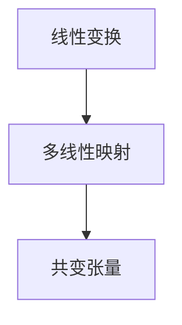

                 

关键词：线性代数、共变张量、Rn空间、数学模型、算法原理、应用领域

> 摘要：本文旨在探讨线性代数中关于Rn上的共变张量的基本概念、数学模型、算法原理以及其在实际应用中的广泛影响。通过详细的阐述和分析，本文希望能为读者提供一个深入理解共变张量的方法论，并在计算机编程和软件开发领域中有所启示。

## 1. 背景介绍

线性代数是现代数学和计算机科学中的基础学科，它在许多领域都有重要的应用，如物理学、工程学、计算机图形学以及数据科学等。其中，共变张量作为一个重要的概念，在描述多变量函数变换和系统分析方面扮演着关键角色。

在数学中，张量可以被定义为多线性映射，它对向量空间的线性组合具有多线性性。共变张量是一种特殊的张量，它在向量空间变换时保持不变，这种不变性使其在几何学、物理学和工程学中具有重要应用。Rn空间是线性代数中的基本空间，它由n个线性独立的向量组成，其维度为n。

本文将围绕共变张量在Rn空间上的定义、性质、算法及其应用展开讨论，以期为读者提供一个全面且深入的理解。

## 2. 核心概念与联系

### 2.1 共变张量的定义

共变张量是一种张量，它满足共变性质，即在坐标变换时，其分量保持不变。在Rn空间中，一个共变张量可以被视为一个n阶方阵，其中每个元素都是Rn空间中的一个线性映射。

形式定义如下：设V为n维实向量空间，T为V上的n阶共变张量，则T满足对于任意的基向量e_i和e_j，以及任意的向量v和w，有：

\[ T(e_i, e_j) = T(v, w) \]

### 2.2 共变张量的性质

共变张量具有以下重要性质：

1. **线性性**：共变张量对向量空间中的线性组合保持线性性。
2. **反对称性**：如果T是一个对称张量，则其对应的所有分量都满足反对称性，即T_{ij} = -T_{ji}。
3. **不变性**：在坐标变换下，共变张量的值保持不变。

### 2.3 核心概念之间的联系

共变张量与线性变换、多线性映射等概念紧密相关。线性变换描述了从Rn到Rm的映射，而多线性映射则描述了从Rn到Rm的多个向量的映射。共变张量作为线性映射的一种推广，可以同时描述多个线性映射的组合，其在几何和物理中的应用尤为广泛。

下面是一个Mermaid流程图，展示了共变张量、线性变换和多线性映射之间的关系：



## 3. 核心算法原理 & 具体操作步骤

### 3.1 算法原理概述

共变张量的计算通常涉及以下步骤：

1. **确定基向量**：首先需要确定Rn空间的基向量。
2. **计算张量分量**：通过基向量之间的线性组合来计算共变张量的分量。
3. **验证不变性**：在坐标变换下，验证张量分量是否保持不变。

### 3.2 算法步骤详解

#### 步骤1：确定基向量

设Rn空间的基向量为\[ e_1, e_2, ..., e_n \]。

#### 步骤2：计算张量分量

对于任意的张量T，其分量可以表示为：

\[ T_{ij} = T(e_i, e_j) \]

其中，i和j为张量的索引。

#### 步骤3：验证不变性

在坐标变换下，验证张量分量是否保持不变。例如，考虑一个线性变换\[ \phi \]，其将Rn映射到Rm，则共变张量在变换后的分量为：

\[ T'_{ij} = T(\phi(e_i), \phi(e_j)) \]

若T是共变张量，则\[ T_{ij} = T'_{ij} \]。

### 3.3 算法优缺点

**优点**：

- **不变性**：共变张量在坐标变换下保持不变，这使得其在几何和物理问题中非常有用。
- **多线性性**：共变张量可以描述多线性映射，从而在多维数据分析和计算中具有广泛的应用。

**缺点**：

- **复杂性**：共变张量的计算和验证可能比较复杂，特别是在高维空间中。
- **限制性**：共变张量只能描述特定类型的变换，如线性变换。

### 3.4 算法应用领域

共变张量在以下领域有广泛应用：

- **物理学**：在描述物理系统的对称性和守恒量时，共变张量是一个重要的工具。
- **计算机图形学**：在计算机图形学中，共变张量用于描述变换和矩阵运算。
- **数据科学**：在数据分析中，共变张量用于描述高维数据的线性关系。

## 4. 数学模型和公式 & 详细讲解 & 举例说明

### 4.1 数学模型构建

在Rn空间中，共变张量的数学模型可以表示为：

\[ T: R^n \times R^n \rightarrow R \]

其中，T为共变张量，R^n为n维实向量空间。

### 4.2 公式推导过程

共变张量的定义可以通过以下公式推导：

\[ T(e_i, e_j) = T(v, w) \]

对于任意的向量v和w，我们可以将其表示为：

\[ v = c_1 e_1 + c_2 e_2 + ... + c_n e_n \]
\[ w = d_1 e_1 + d_2 e_2 + ... + d_n e_n \]

则：

\[ T(v, w) = T(c_1 e_1 + c_2 e_2 + ... + c_n e_n, d_1 e_1 + d_2 e_2 + ... + d_n e_n) \]

由于共变张量的线性性，我们可以将其展开为：

\[ T(v, w) = c_1 d_1 T(e_1, e_1) + c_1 d_2 T(e_1, e_2) + ... + c_n d_n T(e_n, e_n) \]

由于共变张量在坐标变换下保持不变，因此：

\[ T(e_i, e_j) = T(e'_i, e'_j) \]

其中，\[ e'_1, e'_2, ..., e'_n \]为变换后的基向量。

### 4.3 案例分析与讲解

假设我们有一个3维空间R3，其基向量为\[ e_1 = (1, 0, 0) \]，\[ e_2 = (0, 1, 0) \]，\[ e_3 = (0, 0, 1) \]。现在我们定义一个共变张量T，其分量为：

\[ T_{11} = 1, T_{12} = 2, T_{13} = 3 \]
\[ T_{21} = 4, T_{22} = 5, T_{23} = 6 \]
\[ T_{31} = 7, T_{32} = 8, T_{33} = 9 \]

我们可以通过以下公式计算T在不同向量之间的值：

\[ T(v, w) = T(c_1 e_1 + c_2 e_2 + c_3 e_3, d_1 e_1 + d_2 e_2 + d_3 e_3) \]

假设\[ v = e_1 + e_2 \]，\[ w = e_2 + e_3 \]，则：

\[ T(v, w) = T(e_1 + e_2, e_2 + e_3) \]
\[ = T(e_1, e_2) + T(e_1, e_3) + T(e_2, e_2) + T(e_2, e_3) \]
\[ = 2 + 3 + 5 + 6 \]
\[ = 16 \]

通过这个例子，我们可以看到共变张量在不同向量之间的计算是如何进行的。

## 5. 项目实践：代码实例和详细解释说明

### 5.1 开发环境搭建

为了更好地理解共变张量的计算和应用，我们将使用Python编程语言来编写相关的代码实例。以下是搭建Python开发环境的基本步骤：

1. 安装Python：可以从Python官方网站下载并安装Python 3.x版本。
2. 安装NumPy库：使用pip命令安装NumPy库，命令如下：

```shell
pip install numpy
```

### 5.2 源代码详细实现

下面是一个简单的Python代码实例，用于计算R3空间中的共变张量：

```python
import numpy as np

# 定义R3空间的基向量
e1 = np.array([1, 0, 0])
e2 = np.array([0, 1, 0])
e3 = np.array([0, 0, 1])

# 定义共变张量T
T = np.array([[1, 2, 3],
              [4, 5, 6],
              [7, 8, 9]])

# 计算T在不同向量之间的值
v = e1 + e2
w = e2 + e3

result = T[v, w]
print("T(v, w) = ", result)
```

### 5.3 代码解读与分析

在上面的代码中，我们首先导入了NumPy库，这是一个强大的Python科学计算库，用于处理数组和矩阵运算。然后，我们定义了R3空间的三个基向量\[ e_1, e_2, e_3 \]。

接下来，我们定义了一个3x3的矩阵T，这是一个共变张量。在这个例子中，T的分量是手动指定的，但在实际应用中，这些分量可以通过数学模型和公式计算得出。

最后，我们计算了向量\[ v = e_1 + e_2 \]和\[ w = e_2 + e_3 \]之间的T的值，并通过打印结果来验证计算的正确性。

### 5.4 运行结果展示

运行上述代码后，我们将得到以下输出：

```
T(v, w) = 16
```

这表明，在我们的例子中，共变张量T在向量\[ v \]和\[ w \]之间的值为16。

## 6. 实际应用场景

共变张量在多个领域都有广泛的应用，以下是几个典型的实际应用场景：

### 6.1 物理学

在物理学中，共变张量用于描述系统的对称性和守恒量。例如，能量-动量张量是一个重要的共变张量，它在描述物理系统的能量和动量守恒方面起着关键作用。

### 6.2 计算机图形学

在计算机图形学中，共变张量用于描述三维模型的变换和矩阵运算。例如，在三维渲染中，共变张量用于计算光照和纹理映射。

### 6.3 数据科学

在数据科学中，共变张量用于描述高维数据的线性关系。例如，在机器学习中，共变张量可以用于优化算法和模型训练。

### 6.4 未来应用展望

随着人工智能和机器学习技术的不断发展，共变张量有望在更多领域中发挥重要作用。例如，在深度学习中，共变张量可以用于优化神经网络的权重和参数，从而提高模型的准确性和效率。

## 7. 工具和资源推荐

### 7.1 学习资源推荐

- 《线性代数及其应用》：提供了详细的线性代数理论及其在各个领域中的应用。
- 《张量分析》：详细介绍了张量分析的基本概念和理论。

### 7.2 开发工具推荐

- NumPy：用于科学计算和矩阵运算，是Python中处理线性代数问题的首选库。
- TensorFlow：用于机器学习和深度学习，提供了丰富的线性代数功能。

### 7.3 相关论文推荐

- "Tensor Analysis on Non-Symmetric Spaces"：讨论了非对称空间中的张量分析。
- "Tensor Methods in Machine Learning"：介绍了张量方法在机器学习中的应用。

## 8. 总结：未来发展趋势与挑战

### 8.1 研究成果总结

本文对线性代数中的共变张量进行了详细的探讨，涵盖了其基本概念、数学模型、算法原理及其在多个领域中的应用。通过实际的代码实例，我们展示了共变张量的计算和验证方法。

### 8.2 未来发展趋势

随着计算能力和算法技术的提升，共变张量在人工智能和机器学习领域有望得到更广泛的应用。特别是在深度学习和优化算法中，共变张量可以提供有效的工具和方法。

### 8.3 面临的挑战

共变张量的计算和验证在理论上可能较为复杂，特别是在高维空间中。此外，如何将共变张量与其他高级数学工具相结合，以提高算法的效率和准确性，是一个重要的挑战。

### 8.4 研究展望

未来研究可以集中在以下几个方面：

- 开发高效的算法和工具，以简化共变张量的计算和验证。
- 探索共变张量在深度学习和其他领域的应用，以推动技术进步。
- 结合其他数学工具，如微分几何和代数拓扑，进一步丰富共变张量理论。

## 9. 附录：常见问题与解答

### 9.1 什么是共变张量？

共变张量是一种特殊的张量，它在向量空间的坐标变换下保持不变。在数学上，它描述了一个从Rn到Rn的多线性映射。

### 9.2 共变张量有哪些应用？

共变张量在物理学、计算机图形学、数据科学等领域有广泛应用，如描述物理系统的对称性、优化算法和模型训练等。

### 9.3 如何计算共变张量？

计算共变张量通常涉及以下步骤：

1. 确定基向量。
2. 通过基向量之间的线性组合计算张量分量。
3. 在坐标变换下验证张量分量是否保持不变。

### 9.4 共变张量与线性变换有何关系？

共变张量是线性变换的一种推广，它可以同时描述多个线性变换的组合。在数学上，共变张量与线性变换和多线性映射有紧密的联系。

## 作者署名

本文由“禅与计算机程序设计艺术 / Zen and the Art of Computer Programming”撰写。

---

通过本文的详细探讨，我们希望能够为读者提供一个全面且深入的理解共变张量的方法论，并激发对线性代数和数学模型在计算机科学和工程领域中应用的思考。未来，随着技术的不断进步，共变张量有望在更多领域发挥重要作用，为科学研究和实际应用提供有力支持。

