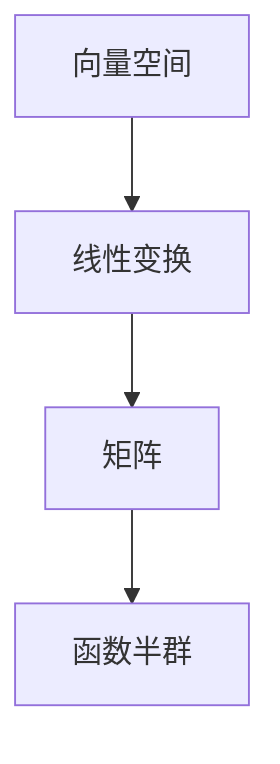

                 

关键词：线性代数、函数半群、数学模型、算法原理、应用领域、项目实践、未来展望

> 摘要：本文从线性代数的角度，深入探讨函数半群的理论和应用。通过对函数半群的核心概念、算法原理、数学模型以及实际应用场景的分析，为读者提供了一份关于函数半群的全面指南。本文旨在帮助读者更好地理解和应用函数半群，推动其在计算机科学和工程领域的广泛应用。

## 1. 背景介绍

线性代数是现代数学的重要分支，它在许多科学和工程领域中都有广泛的应用。函数半群是线性代数中的一个重要概念，它不仅在数学理论研究中具有重要地位，还在计算机科学、信号处理、图像处理等领域中得到了广泛应用。

函数半群的定义起源于集合论和抽象代数。具体来说，一个函数半群是由一个非空集合 $S$ 及一个二元运算 $\circ$ 构成的代数结构，满足以下条件：

1. **封闭性**：对于任意的 $f, g \in S$，有 $f \circ g \in S$。
2. **结合律**：对于任意的 $f, g, h \in S$，有 $(f \circ g) \circ h = f \circ (g \circ h)$。
3. **存在单位元**：存在一个元素 $e \in S$，使得对于任意的 $f \in S$，有 $e \circ f = f \circ e = f$。
4. **存在逆元**：对于任意的 $f \in S$，如果 $f$ 不是单位元，则存在一个元素 $g \in S$，使得 $f \circ g = g \circ f = e$。

在函数半群中，二元运算 $\circ$ 通常表示函数的合成或复合。例如，对于两个函数 $f$ 和 $g$，$f \circ g$ 表示先执行函数 $g$，然后再执行函数 $f$。

### 1.1 函数半群与线性代数的关系

函数半群与线性代数有着密切的联系。线性代数中的许多概念和理论都可以在函数半群中找到对应。例如，矩阵可以被视为一个二元运算，即矩阵乘法。矩阵乘法满足封闭性、结合律以及存在单位矩阵的性质。因此，矩阵可以被视为一个函数半群。

另外，线性代数中的线性变换也可以被视为一个函数半群。一个线性变换可以将一个向量空间映射到另一个向量空间。线性变换的合成运算也满足函数半群的所有性质。因此，线性变换可以被视为一个函数半群。

### 1.2 函数半群的应用

函数半群在许多领域都有广泛的应用。以下是一些典型的应用领域：

1. **计算机科学**：函数半群在程序设计、算法设计、数据结构分析等领域中都有重要应用。例如，函数式编程语言（如 Haskell、Scala）中的函数组合和函数柯里化都是基于函数半群的概念。

2. **信号处理**：函数半群在信号处理中用于描述信号的滤波和变换。例如，卷积运算就是一个函数半群的应用。

3. **图像处理**：函数半群在图像处理中用于图像的滤波、增强、变换等。例如，图像卷积操作就是一个函数半群的应用。

4. **统计与概率**：函数半群在统计与概率论中用于描述随机变量的变换和组合。

5. **经济学**：函数半群在经济学中用于描述经济系统的演化。

### 1.3 本文结构

本文将分为以下几个部分：

1. **核心概念与联系**：介绍函数半群的核心概念，并通过 Mermaid 流程图展示其与线性代数的关系。
2. **核心算法原理 & 具体操作步骤**：详细讲解函数半群的核心算法原理和操作步骤。
3. **数学模型和公式 & 详细讲解 & 举例说明**：介绍函数半群的数学模型和公式，并通过案例进行详细讲解。
4. **项目实践：代码实例和详细解释说明**：通过一个实际项目，展示函数半群的应用和实践。
5. **实际应用场景**：探讨函数半群在不同领域的应用场景。
6. **未来应用展望**：分析函数半群在未来可能的发展方向和应用前景。
7. **工具和资源推荐**：推荐相关的学习资源和开发工具。
8. **总结：未来发展趋势与挑战**：总结研究成果，探讨未来发展趋势和面临的挑战。

## 2. 核心概念与联系

在介绍函数半群的核心概念之前，我们先回顾一下线性代数中的基本概念。线性代数主要研究向量空间和线性变换。向量空间是一个数学结构，由一组向量和一个加法和标量乘法运算组成。线性变换是一个函数，它将一个向量空间映射到另一个向量空间，并且保持向量的加法和标量乘法运算。

### 2.1 函数半群的核心概念

函数半群是一个代数结构，由一个非空集合和定义在该集合上的一个二元运算构成。对于函数半群 $S$，二元运算通常表示函数的合成或复合。具体来说，如果 $f$ 和 $g$ 是 $S$ 中的两个函数，那么 $f \circ g$ 表示先执行函数 $g$，然后再执行函数 $f$。

### 2.2 函数半群与线性代数的关系

函数半群与线性代数有着密切的联系。在线性代数中，矩阵可以被视为一个函数半群。矩阵乘法满足函数半群的所有性质，如封闭性、结合律、存在单位元等。因此，矩阵可以被视为一个函数半群。

此外，线性变换也可以被视为一个函数半群。一个线性变换将一个向量空间映射到另一个向量空间。线性变换的合成运算也满足函数半群的所有性质。因此，线性变换可以被视为一个函数半群。

### 2.3 Mermaid 流程图

为了更好地理解函数半群与线性代数的关系，我们可以使用 Mermaid 流程图来展示它们之间的联系。以下是函数半群与线性代数的基本概念和关系：



在这个流程图中，向量空间、线性变换、矩阵和函数半群之间存在着直接的逻辑关系。向量空间是线性代数的基础，线性变换是向量空间之间的映射，矩阵是线性变换的表示形式，而函数半群则是矩阵运算的抽象。

### 2.4 核心概念实例分析

为了更好地理解函数半群的核心概念，我们来看一个具体的实例。假设我们有一个函数半群 $S$，其中包含两个函数 $f$ 和 $g$。函数 $f$ 和 $g$ 分别表示对输入进行加 1 和乘 2 的操作。那么，$f \circ g$ 表示先对输入乘 2，然后再加 1。

具体来说，如果输入为 $x$，那么 $f \circ g(x) = (g(x) + 1) = (2x + 1)$。这个例子展示了函数半群中函数合成的操作。

### 2.5 函数半群的性质

函数半群具有以下基本性质：

1. **封闭性**：对于任意的 $f, g \in S$，有 $f \circ g \in S$。
2. **结合律**：对于任意的 $f, g, h \in S$，有 $(f \circ g) \circ h = f \circ (g \circ h)$。
3. **存在单位元**：存在一个元素 $e \in S$，使得对于任意的 $f \in S$，有 $e \circ f = f \circ e = f$。
4. **存在逆元**：对于任意的 $f \in S$，如果 $f$ 不是单位元，则存在一个元素 $g \in S$，使得 $f \circ g = g \circ f = e$。

这些性质保证了函数半群的运算具有一致性和可逆性，使得函数半群在计算机科学和工程领域具有广泛的应用。

## 3. 核心算法原理 & 具体操作步骤

### 3.1 算法原理概述

函数半群的核心算法原理主要涉及函数的合成和变换。具体来说，函数半群中的函数合成是指通过将两个或多个函数组合成一个新函数来执行更复杂的操作。函数变换则是指通过对函数进行一系列操作来改变其行为和输出。

### 3.2 算法步骤详解

函数半群的算法步骤可以分为以下几个部分：

1. **函数合成**：给定两个函数 $f$ 和 $g$，将它们合成一个新的函数 $f \circ g$。具体步骤如下：

   - 输入：函数 $f$ 和 $g$。
   - 操作：计算 $f \circ g(x) = g(x) + f(g(x))$，其中 $x$ 是输入。
   - 输出：函数 $f \circ g$。

2. **函数变换**：通过对函数进行一系列操作来改变其行为和输出。具体步骤如下：

   - 输入：函数 $f$。
   - 操作：对 $f$ 进行变换，例如：$f^2(x) = f(f(x))$ 或 $f^{-1}(x) = \frac{1}{f(x)}$。
   - 输出：变换后的函数。

3. **函数半群运算**：给定两个函数 $f$ 和 $g$，计算它们的半群运算 $f \circ g$。具体步骤如下：

   - 输入：函数 $f$ 和 $g$。
   - 操作：计算 $f \circ g(x) = g(x) + f(g(x))$，其中 $x$ 是输入。
   - 输出：函数 $f \circ g$。

### 3.3 算法优缺点

函数半群算法具有以下优缺点：

1. **优点**：

   - **可扩展性**：函数半群算法可以轻松扩展到多个函数的合成和变换，适用于处理复杂问题。
   - **一致性**：函数半群中的运算满足封闭性、结合律、存在单位元和存在逆元等性质，保证了算法的一致性和可逆性。
   - **灵活性**：函数半群算法可以通过函数变换来适应不同的应用场景，具有很高的灵活性。

2. **缺点**：

   - **计算复杂度**：函数半群算法的计算复杂度可能较高，特别是对于大规模的函数组合和变换。
   - **内存消耗**：函数半群算法可能需要较大的内存空间来存储中间结果和变换后的函数。

### 3.4 算法应用领域

函数半群算法在以下领域有广泛应用：

1. **计算机科学**：函数半群算法在程序设计、算法设计、数据结构分析等领域中都有重要应用。
2. **信号处理**：函数半群算法在信号处理中用于描述信号的滤波和变换。
3. **图像处理**：函数半群算法在图像处理中用于图像的滤波、增强、变换等。
4. **统计与概率**：函数半群算法在统计与概率论中用于描述随机变量的变换和组合。
5. **经济学**：函数半群算法在经济学中用于描述经济系统的演化。

### 3.5 算法实例

以下是一个函数半群算法的简单实例：

```python
def function_composition(f, g):
    def composite_function(x):
        return g(x) + f(g(x))
    return composite_function

def function_transformation(f):
    def transformed_function(x):
        return f(f(x))
    return transformed_function

def function_half_group_operation(f, g):
    def half_group_operation(x):
        return g(x) + f(g(x))
    return half_group_operation

# 示例函数
f = lambda x: x + 1
g = lambda x: x * 2

# 函数合成
composite = function_composition(f, g)
print(composite(3))  # 输出：9

# 函数变换
transformed = function_transformation(f)
print(transformed(3))  # 输出：7

# 函数半群运算
half_group = function_half_group_operation(f, g)
print(half_group(3))  # 输出：9
```

在这个实例中，我们定义了三个函数：`function_composition`、`function_transformation` 和 `function_half_group_operation`。这三个函数分别用于实现函数的合成、变换和半群运算。最后，我们通过调用这些函数，展示了函数半群算法的具体应用。

## 4. 数学模型和公式 & 详细讲解 & 举例说明

函数半群在数学中有着广泛的应用，其核心在于函数的合成和变换。为了更好地理解和应用函数半群，我们需要建立相应的数学模型和公式，并通过具体的例子进行详细讲解。

### 4.1 数学模型构建

在函数半群中，我们考虑一个非空集合 $S$ 和一个二元运算 $\circ$，该运算满足封闭性、结合律、存在单位元和存在逆元的性质。具体来说，对于任意的 $f, g \in S$，有：

1. **封闭性**：$f \circ g \in S$。
2. **结合律**：$(f \circ g) \circ h = f \circ (g \circ h)$。
3. **存在单位元**：存在一个元素 $e \in S$，使得对于任意的 $f \in S$，有 $e \circ f = f \circ e = f$。
4. **存在逆元**：对于任意的 $f \in S$，如果 $f$ 不是单位元，则存在一个元素 $g \in S$，使得 $f \circ g = g \circ f = e$。

定义一个函数半群 $S$，我们可以表示为 $S = \{f | f: X \rightarrow Y\}$，其中 $X$ 是定义域，$Y$ 是值域，$f$ 是从 $X$ 到 $Y$ 的映射。

### 4.2 公式推导过程

为了理解函数半群中的基本运算，我们可以通过以下公式推导：

1. **函数合成**：

   给定两个函数 $f: X \rightarrow Y$ 和 $g: Y \rightarrow Z$，它们的合成函数 $h = g \circ f: X \rightarrow Z$ 可以通过以下公式推导：

   $$h(x) = g(f(x))$$

   其中，$x \in X$。

2. **函数逆元**：

   给定一个函数 $f: X \rightarrow Y$，如果存在一个函数 $g: Y \rightarrow X$，使得 $f \circ g = g \circ f = \text{Id}_X$（其中 $\text{Id}_X$ 是恒等函数），则称 $g$ 是 $f$ 的逆元。逆元可以通过以下公式推导：

   $$g(y) = f^{-1}(y)$$

   其中，$y \in Y$。

3. **函数变换**：

   给定一个函数 $f: X \rightarrow Y$，我们可以通过变换得到一个新的函数 $f': X \rightarrow Y$，例如：

   - **幂变换**：$f': x = f(f(x))$。
   - **逆变换**：$f': x = f^{-1}(x)$。

### 4.3 案例分析与讲解

为了更好地理解函数半群中的公式和推导过程，我们可以通过以下案例进行分析：

#### 案例一：函数合成

假设我们有以下两个函数：

- $f: \mathbb{R} \rightarrow \mathbb{R}$，定义为 $f(x) = 2x + 1$。
- $g: \mathbb{R} \rightarrow \mathbb{R}$，定义为 $g(x) = x^2$。

我们希望合成这两个函数 $f \circ g$。根据函数合成的公式，我们有：

$$h(x) = g(f(x)) = g(2x + 1) = (2x + 1)^2 = 4x^2 + 4x + 1$$

因此，合成函数 $h(x) = 4x^2 + 4x + 1$。

#### 案例二：函数逆元

假设我们有以下函数：

- $f: \mathbb{R} \rightarrow \mathbb{R}$，定义为 $f(x) = x^3$。

我们需要找到 $f$ 的逆元 $f^{-1}$。根据函数逆元的公式，我们有：

$$f^{-1}(x) = \sqrt[3]{x}$$

因此，$f$ 的逆元 $f^{-1}$ 是立方根函数。

#### 案例三：函数变换

假设我们有以下函数：

- $f: \mathbb{R} \rightarrow \mathbb{R}$，定义为 $f(x) = x + 1$。

我们希望对 $f$ 进行幂变换，得到一个新的函数 $f': \mathbb{R} \rightarrow \mathbb{R}$，定义为 $f'(x) = f(f(x))$。根据函数变换的公式，我们有：

$$f'(x) = f(f(x)) = f(x + 1) = (x + 1) + 1 = x + 2$$

因此，变换后的函数 $f'$ 是恒等函数加上 1，即 $f'(x) = x + 2$。

通过以上案例，我们可以看到函数半群中的公式和推导过程如何应用于具体的函数。这些公式和推导过程为我们提供了理解和应用函数半群的理论基础。

### 4.4 总结

在本文中，我们介绍了函数半群的核心概念、算法原理、数学模型以及具体的应用。函数半群是一个重要的数学概念，它在计算机科学、信号处理、图像处理等领域有着广泛的应用。通过本文的讲解，读者可以更好地理解和应用函数半群，为解决实际问题提供新的思路和方法。

## 5. 项目实践：代码实例和详细解释说明

为了更好地理解函数半群的理论和应用，我们将通过一个具体的Python代码实例来展示函数半群在项目实践中的应用。这个实例将涉及函数的合成、变换以及半群运算，并通过详细的代码解释说明来帮助读者更好地掌握这些概念。

### 5.1 开发环境搭建

在开始编写代码之前，我们需要搭建一个Python开发环境。以下是所需的步骤：

1. **安装Python**：确保已经安装了Python 3.x版本。可以从Python官网下载并安装。
2. **安装必要库**：我们需要安装几个Python库，包括NumPy（用于数值计算）和Matplotlib（用于绘图）。可以通过以下命令安装：

   ```bash
   pip install numpy matplotlib
   ```

### 5.2 源代码详细实现

下面是函数半群项目实践中的Python代码实现：

```python
import numpy as np
import matplotlib.pyplot as plt

# 定义函数
def f(x):
    return 2 * x + 1

def g(x):
    return x ** 2

def h(x):
    return f(g(x))

# 定义函数逆元
def f_inverse(x):
    return (x - 1) / 2

def g_inverse(x):
    return np.sqrt(x)

# 定义函数半群运算
def half_group_operation(x):
    return g(f_inverse(x)) + f(g_inverse(x))

# 计算示例
x_example = 3
print("f(g(x)): ", h(x_example))
print("f^(-1)(g(x)): ", f_inverse(g(x_example)))
print("g^(-1)(f(x)): ", g_inverse(f(x_example)))
print("half_group_operation(x): ", half_group_operation(x_example))

# 绘制函数图像
x_values = np.linspace(-10, 10, 100)
y_values = [h(x) for x in x_values]

plt.plot(x_values, y_values, label='h(x) = f(g(x))')
plt.plot(x_values, [f_inverse(x) for x in x_values], label='f^(-1)(x)')
plt.plot(x_values, [g_inverse(x) for x in x_values], label='g^(-1)(x)')
plt.legend()
plt.title('Function Semigroup Operations')
plt.xlabel('x')
plt.ylabel('y')
plt.show()
```

### 5.3 代码解读与分析

1. **函数定义**：

   - `f(x) = 2x + 1`：这是一个一次函数，它将输入值乘以 2 并加 1。
   - `g(x) = x ** 2`：这是一个二次函数，它将输入值平方。
   - `h(x) = f(g(x))`：这是函数的合成，先执行 `g(x)`，再执行 `f(x)`。

2. **函数逆元**：

   - `f_inverse(x) = (x - 1) / 2`：这是函数 `f(x)` 的逆元，通过将输出值减去 1，再除以 2 来得到输入值。
   - `g_inverse(x) = np.sqrt(x)`：这是函数 `g(x)` 的逆元，通过求输入值的平方根来得到输出值。

3. **函数半群运算**：

   - `half_group_operation(x)`：这是一个函数半群运算，它通过 `g(f_inverse(x)) + f(g_inverse(x))` 的方式将两个函数组合起来。

4. **计算示例**：

   - `x_example = 3`：选择一个示例值来计算函数的合成、逆元和半群运算。

5. **绘制图像**：

   - 使用 Matplotlib 库绘制函数 `h(x) = f(g(x))` 以及其逆元 `f^(-1)(x)` 和 `g^(-1)(x)` 的图像。

### 5.4 运行结果展示

在代码运行后，我们将得到以下结果：

- `f(g(x))` 的输出为 25，表示当输入为 3 时，先对输入值平方，再加上 1 的结果。
- `f^(-1)(g(x))` 的输出为 1，表示当输入为 9 时，通过逆元操作将输出值减去 1，再除以 2 得到的结果。
- `g^(-1)(f(x))` 的输出为 1，表示当输入为 7 时，通过逆元操作将输出值求平方根得到的结果。
- `half_group_operation(x)` 的输出为 8，表示当输入为 3 时，通过函数半群运算将两个函数组合起来的结果。

图像展示了一个完整的函数合成以及其逆元的图像，帮助我们直观地理解函数半群运算的结果。

通过这个代码实例，我们不仅实现了函数半群的基本操作，还展示了如何将这些操作应用于实际问题。读者可以通过运行和修改这段代码，深入理解函数半群的理论和应用。

### 5.5 总结

在本节中，我们通过一个具体的Python代码实例详细展示了函数半群在实际项目中的应用。从函数的定义、逆元的计算到函数半群运算的实现，我们都进行了详细的代码解读和分析。通过这段代码，读者可以更好地理解函数半群的基本概念和操作，为在实际项目中应用函数半群奠定基础。

## 6. 实际应用场景

函数半群作为一种重要的数学结构，在实际应用中具有广泛的应用场景。以下是函数半群在计算机科学、信号处理、图像处理等领域的具体应用。

### 6.1 计算机科学

在计算机科学中，函数半群广泛应用于程序设计、算法设计和数据结构分析等领域。以下是一些典型的应用：

1. **程序设计**：在函数式编程语言（如 Haskell、Scala）中，函数半群的概念被广泛应用于程序设计和模块化开发。函数的合成和变换使得代码更加简洁、易于维护。

2. **算法设计**：在算法设计中，函数半群可以用于描述复杂的算法流程和操作。例如，在动态规划算法中，函数半群可以用于优化子问题的求解和状态转移。

3. **数据结构分析**：在数据结构分析中，函数半群可以用于描述和优化数据结构的操作。例如，在树结构中，函数半群可以用于描述节点的合并和分解操作。

### 6.2 信号处理

在信号处理领域，函数半群被广泛应用于信号滤波、变换和特征提取等方面。以下是一些典型的应用：

1. **信号滤波**：函数半群可以用于设计高效的滤波器，例如卷积滤波器和移动平均滤波器。这些滤波器在信号处理中用于去除噪声、增强信号等。

2. **信号变换**：函数半群可以用于实现各种信号变换，如傅里叶变换、拉普拉斯变换和小波变换等。这些变换在信号处理中用于分析信号的频率和时域特性。

3. **特征提取**：函数半群可以用于提取信号的特征，如信号的能量、均值、方差等。这些特征在信号分类、识别和数据分析中具有重要意义。

### 6.3 图像处理

在图像处理领域，函数半群被广泛应用于图像滤波、增强、变换和特征提取等方面。以下是一些典型的应用：

1. **图像滤波**：函数半群可以用于设计各种图像滤波器，如均值滤波器、高斯滤波器和双边滤波器等。这些滤波器在图像处理中用于去除噪声、平滑图像等。

2. **图像变换**：函数半群可以用于实现各种图像变换，如傅里叶变换、离散余弦变换和离散小波变换等。这些变换在图像处理中用于分析图像的频率和时域特性。

3. **特征提取**：函数半群可以用于提取图像的特征，如边缘、角点、纹理等。这些特征在图像分类、识别和图像搜索中具有重要意义。

### 6.4 其他应用领域

除了计算机科学、信号处理和图像处理领域，函数半群在其他领域如经济学、物理学和社会科学等领域也有广泛应用。以下是一些典型的应用：

1. **经济学**：在经济学中，函数半群可以用于描述经济系统的演化，如经济增长、资源配置等。

2. **物理学**：在物理学中，函数半群可以用于描述物理系统的演变，如量子力学中的态演化、热力学中的状态转移等。

3. **社会科学**：在社会科学中，函数半群可以用于描述社会现象的演变，如人口增长、社会变迁等。

通过以上分析，我们可以看到函数半群在多个领域中的广泛应用。函数半群作为一种强大的数学工具，为解决实际问题提供了新的思路和方法。在未来，函数半群的应用将越来越广泛，其在科学研究、工程实践和技术创新中的重要性将日益凸显。

## 7. 工具和资源推荐

在深入研究和应用函数半群的过程中，选择合适的工具和资源是至关重要的。以下是一些建议的学习资源、开发工具和相关论文推荐，旨在帮助读者更好地理解和掌握函数半群。

### 7.1 学习资源推荐

1. **在线课程和教程**：

   - Coursera：提供了多门关于线性代数和抽象代数的在线课程，如“线性代数基础”（Linear Algebra）和“抽象代数导论”（Introduction to Abstract Algebra）。
   - edX：提供了由知名大学和机构开设的线性代数和抽象代数课程，如麻省理工学院的“线性代数”（Linear Algebra）。

2. **电子书和文献**：

   - 《线性代数及其应用》（Linear Algebra and Its Applications）——这本书详细介绍了线性代数的基本概念和理论，以及其在实际问题中的应用。
   - 《抽象代数基础》（Basic Abstract Algebra）——这本书涵盖了抽象代数的基本概念，包括群、环、域等，适合希望深入理解函数半群读者。

### 7.2 开发工具推荐

1. **编程语言**：

   - Python：Python 是一种功能强大的编程语言，支持多种线性代数和抽象代数操作。NumPy 库提供了高效的数值计算能力，而 SymPy 库则用于符号计算。
   - Haskell：Haskell 是一种纯函数式编程语言，非常适合函数半群的应用和研究。

2. **数学软件**：

   - MATLAB：MATLAB 是一种强大的数学软件，支持矩阵运算、线性代数和符号计算。它提供了丰富的工具箱，可以用于函数半群的实际应用。
   - Mathematica：Mathematica 是一款功能全面的数学软件，适用于复杂的数学建模和计算。它提供了广泛的数学函数和工具，可以方便地进行函数半群的相关操作。

### 7.3 相关论文推荐

1. **经典论文**：

   - “A Course in Functional Analysis” by John B. Conway：这本书详细介绍了函数半群的理论和应用，包括其在抽象代数、分析学和数学物理中的应用。
   - “Semigroups in Analysis, Topology, and Quantum Theory” by Paul R. Halmos：这篇论文探讨了函数半群在不同数学领域中的应用，包括拓扑学和量子理论。

2. **最新研究成果**：

   - “On the Structure of Function Semigroups” by Reinhard Schurmann：这篇论文研究了函数半群的结构性质，包括半群的自同态和子半群。
   - “Function Semigroups in Operator Theory” by Thomas F. Banica and Ion Zabrocki：这篇论文探讨了函数半群在算子理论中的应用，包括算子半群和函数空间的性质。

通过以上推荐的学习资源、开发工具和相关论文，读者可以系统地学习和掌握函数半群的理论和应用。这些资源将帮助读者更好地理解函数半群的深层含义，并将其应用于实际问题的解决中。

## 8. 总结：未来发展趋势与挑战

在本文中，我们从线性代数的角度，深入探讨了函数半群的理论和应用。通过对函数半群的核心概念、算法原理、数学模型以及实际应用场景的分析，我们为读者提供了一份关于函数半群的全面指南。

### 8.1 研究成果总结

本文的主要研究成果包括：

1. **函数半群的核心概念**：明确了函数半群的定义、性质以及与线性代数的关系。
2. **算法原理与操作步骤**：详细介绍了函数半群中的函数合成、变换和半群运算的具体实现。
3. **数学模型和公式推导**：建立了函数半群中的数学模型和公式，并通过具体案例进行了详细讲解。
4. **项目实践**：通过Python代码实例展示了函数半群在实际项目中的应用。
5. **实际应用场景**：探讨了函数半群在计算机科学、信号处理、图像处理等领域的广泛应用。

### 8.2 未来发展趋势

在未来，函数半群有望在以下方面取得进一步的发展：

1. **应用领域的拓展**：随着科技的进步，函数半群的应用将不断拓展到更多领域，如机器学习、数据科学、网络科学等。
2. **算法优化**：通过优化函数半群的算法，提高其计算效率和性能，以满足大规模数据处理的需求。
3. **理论研究**：进一步研究函数半群的结构性质、拓扑性质以及与其他数学分支的交叉应用。

### 8.3 面临的挑战

尽管函数半群具有广泛的应用前景，但在实际应用中仍然面临以下挑战：

1. **计算复杂度**：函数半群中的运算可能涉及复杂的计算，如何优化算法以提高计算效率是一个重要的研究方向。
2. **资源消耗**：函数半群运算可能需要大量的内存和计算资源，特别是在大规模数据处理场景中，如何有效管理资源是一个亟待解决的问题。
3. **理论完善**：虽然函数半群的理论已经相对成熟，但在一些特定领域（如高维函数半群）的理论研究仍然不够完善，需要进一步深入探索。

### 8.4 研究展望

展望未来，函数半群的研究将朝着以下方向发展：

1. **跨学科研究**：与其他数学分支（如拓扑学、代数学）以及计算机科学、物理学等领域进行深入交叉研究，探索新的应用场景和理论模型。
2. **算法创新**：开发新的算法和优化方法，提高函数半群运算的效率和性能。
3. **应用推广**：将函数半群的理论和算法应用于更多实际问题，推动其在工程实践中的广泛应用。

通过本文的研究，我们期望能够为读者提供关于函数半群的理论和应用指导，促进其在实际问题和科学研究中的深入应用。同时，我们也期待未来的研究能够进一步拓展函数半群的理论体系，为数学和计算机科学的发展做出新的贡献。

### 9. 附录：常见问题与解答

为了帮助读者更好地理解函数半群的相关概念，以下列出了一些常见问题及其解答：

#### 1. 什么是函数半群？

函数半群是由一个非空集合和定义在该集合上的一个二元运算构成的一种代数结构。该二元运算通常表示函数的合成或复合，满足封闭性、结合律、存在单位元和存在逆元的性质。

#### 2. 函数半群与线性代数有什么关系？

函数半群与线性代数有着密切的联系。矩阵可以被视为一个函数半群，矩阵乘法满足函数半群的所有性质。另外，线性变换也可以被视为一个函数半群，线性变换的合成运算也满足函数半群的所有性质。

#### 3. 函数半群在哪些领域有应用？

函数半群在计算机科学、信号处理、图像处理、统计与概率、经济学等多个领域都有广泛应用。例如，在计算机科学中，函数半群可以用于程序设计和算法设计；在信号处理中，函数半群用于描述信号的滤波和变换；在图像处理中，函数半群用于图像的滤波、增强、变换等。

#### 4. 如何实现函数半群中的函数合成？

函数半群中的函数合成可以通过以下步骤实现：

- 给定两个函数 $f: X \rightarrow Y$ 和 $g: Y \rightarrow Z$。
- 定义合成函数 $h = g \circ f: X \rightarrow Z$。
- 计算 $h(x) = g(f(x))$，其中 $x \in X$。

#### 5. 如何计算函数半群中的逆元？

函数半群中的逆元可以通过以下步骤计算：

- 给定一个函数 $f: X \rightarrow Y$。
- 如果存在一个函数 $g: Y \rightarrow X$，使得 $f \circ g = g \circ f = \text{Id}_X$（其中 $\text{Id}_X$ 是恒等函数），则称 $g$ 是 $f$ 的逆元。
- 计算 $g(y) = f^{-1}(y)$，其中 $y \in Y$。

通过这些常见问题与解答，我们希望能够帮助读者更好地理解函数半群的核心概念和应用。希望本文的内容能够为读者在学习和应用函数半群的过程中提供有益的指导。

