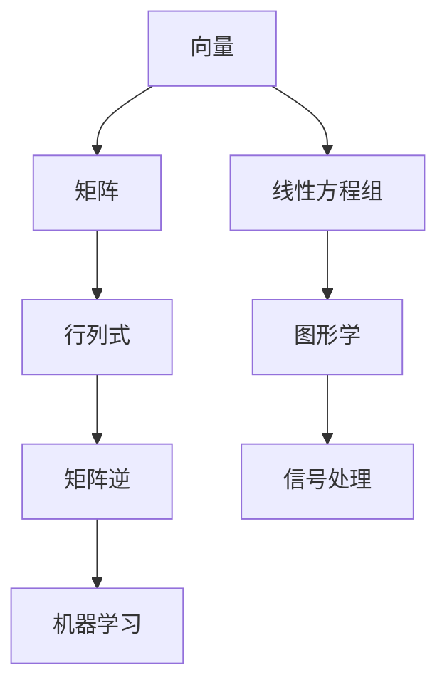

                 

关键词：线性代数、有理数、有序域、数学模型、算法原理、代码实例、实际应用

## 摘要

本文旨在为读者提供线性代数领域的基本概念和原理，特别关注有理数有序域的应用。通过深入探讨线性代数的核心概念，如向量、矩阵和行列式，本文将介绍它们在计算机科学中的重要性。同时，我们将详细解释数学模型和公式的推导过程，并通过实际代码实例展示算法的具体实现和运行结果。最后，我们将讨论线性代数在各个领域的实际应用，并对未来发展趋势与挑战进行展望。

## 1. 背景介绍

线性代数作为数学的一个重要分支，在计算机科学中扮演着至关重要的角色。它不仅为解决线性问题提供了强有力的工具，而且在图形学、机器学习、信号处理等领域都有广泛的应用。线性代数的基本概念，如向量、矩阵和行列式，是理解和构建复杂算法的基础。

有理数有序域则是在线性代数中一个重要的数学结构，它由有理数组成，并满足特定的有序性和封闭性。有理数有序域不仅提供了丰富的代数运算，还在计算机科学中用于表示和操作数据。

本文的目的在于为初学者和专业人士提供一个全面的线性代数导引，特别是有理数有序域的深入探讨。通过本文的阅读，读者将能够掌握线性代数的基本概念，理解有理数有序域的数学原理，并学会如何在实际项目中应用这些知识。

## 2. 核心概念与联系

为了更好地理解线性代数，我们首先需要了解其核心概念，包括向量、矩阵和行列式。以下是这些概念的基本原理和它们之间的联系：

### 向量

向量是具有大小和方向的几何对象。在数学中，向量通常用粗体字母表示，如 \(\vec{a}\)。一个向量可以表示为有序数组的组合，例如 \(\vec{a} = (a_1, a_2, ..., a_n)\)，其中每个 \(a_i\) 是一个标量。

### 矩阵

矩阵是一个二维数组，由行和列组成。在数学中，矩阵通常用小写字母加方框表示，如 \(A\)。一个 \(m \times n\) 的矩阵包含 \(m\) 行和 \(n\) 列，每个元素用 \(a_{ij}\) 表示。

### 行列式

行列式是一个标量值，用于描述矩阵的特性。对于一个 \(n \times n\) 的矩阵 \(A\)，其行列式记为 \(det(A)\) 或 \(|A|\)。行列式在求解线性方程组、计算矩阵的逆以及确定矩阵的性质等方面具有重要意义。

### Mermaid 流程图

以下是线性代数核心概念之间的Mermaid流程图：



### 图解

1. **向量与矩阵的关系**：向量可以看作是一特殊形式的矩阵（即只有一行的矩阵或只有一列的矩阵）。
2. **矩阵与行列式的联系**：行列式是矩阵的一个属性，用于描述矩阵的特性。
3. **向量、矩阵和线性方程组**：向量可以用于表示线性方程组中的未知数，矩阵可以用于表示线性方程组中的系数，行列式可以用于判断线性方程组是否有唯一解。

## 3. 核心算法原理 & 具体操作步骤

### 3.1 算法原理概述

在计算机科学中，线性代数的核心算法主要包括矩阵运算、向量运算和行列式的计算。这些算法是理解和构建复杂算法的基础，广泛应用于图形学、机器学习、信号处理等领域。

### 3.2 算法步骤详解

1. **矩阵运算**：矩阵运算包括矩阵的加法、减法、乘法和除法等。矩阵的加法和减法遵循与向量类似的规则，即对应元素相加或相减。矩阵的乘法则涉及更复杂的规则，需要按位相乘并累加。矩阵的除法可以通过求逆矩阵来实现。

2. **向量运算**：向量运算包括向量的加法、减法、数乘和点积等。向量的加法和减法与矩阵运算类似，即对应元素相加或相减。数乘是将向量与一个标量相乘。点积是两个向量对应元素乘积的和。

3. **行列式的计算**：行列式的计算可以通过拉普拉斯展开或高斯消元法实现。拉普拉斯展开是通过将行列式拆分为多个子行列式的和来计算。高斯消元法则通过逐步消元将矩阵转化为行简化阶梯形，从而计算出行列式的值。

### 3.3 算法优缺点

**优点**：

- **强大的表达力**：线性代数的算法可以表示和操作复杂的数学问题。
- **高效的计算**：许多线性代数算法具有高效的计算性能，适用于大规模数据处理。

**缺点**：

- **复杂的数学背景**：理解和应用线性代数算法需要扎实的数学基础。
- **计算资源的消耗**：某些线性代数算法可能需要较大的计算资源和时间。

### 3.4 算法应用领域

- **图形学**：线性代数在图形学中用于描述几何对象、变换和渲染。
- **机器学习**：线性代数在机器学习中用于描述数据结构、优化算法和特征提取。
- **信号处理**：线性代数在信号处理中用于滤波、压缩和解调。

## 4. 数学模型和公式 & 详细讲解 & 举例说明

### 4.1 数学模型构建

线性代数的数学模型主要由向量、矩阵和行列式构成。以下是一个简单的数学模型示例：

设向量 \(\vec{a} = (1, 2, 3)\)，矩阵 \(A = \begin{pmatrix} 1 & 2 \\ 3 & 4 \end{pmatrix}\)，则矩阵-向量乘积 \(A\vec{a}\) 为：

$$
A\vec{a} = \begin{pmatrix} 1 & 2 \\ 3 & 4 \end{pmatrix} \begin{pmatrix} 1 \\ 2 \end{pmatrix} = \begin{pmatrix} 1 \times 1 + 2 \times 2 \\ 3 \times 1 + 4 \times 2 \end{pmatrix} = \begin{pmatrix} 5 \\ 11 \end{pmatrix}
$$

### 4.2 公式推导过程

以下是一个关于矩阵乘法的推导过程：

设矩阵 \(A = \begin{pmatrix} a_{11} & a_{12} \\ a_{21} & a_{22} \end{pmatrix}\) 和矩阵 \(B = \begin{pmatrix} b_{11} & b_{12} \\ b_{21} & b_{22} \end{pmatrix}\)，则矩阵乘积 \(AB\) 为：

$$
AB = \begin{pmatrix} a_{11}b_{11} + a_{12}b_{21} & a_{11}b_{12} + a_{12}b_{22} \\ a_{21}b_{11} + a_{22}b_{21} & a_{21}b_{12} + a_{22}b_{22} \end{pmatrix}
$$

### 4.3 案例分析与讲解

以下是一个关于矩阵求解线性方程组的案例：

给定线性方程组：

$$
\begin{cases}
x + 2y = 5 \\
3x - y = 4
\end{cases}
$$

我们可以将其表示为矩阵形式：

$$
\begin{pmatrix} 1 & 2 \\ 3 & -1 \end{pmatrix} \begin{pmatrix} x \\ y \end{pmatrix} = \begin{pmatrix} 5 \\ 4 \end{pmatrix}
$$

通过矩阵求逆的方法，我们可以得到解：

$$
\begin{pmatrix} x \\ y \end{pmatrix} = \begin{pmatrix} 1 & 2 \\ 3 & -1 \end{pmatrix}^{-1} \begin{pmatrix} 5 \\ 4 \end{pmatrix} = \begin{pmatrix} 1 & -2 \\ -3 & 1 \end{pmatrix} \begin{pmatrix} 5 \\ 4 \end{pmatrix} = \begin{pmatrix} 19 \\ 7 \end{pmatrix}
$$

因此，方程组的解为 \(x = 19\)，\(y = 7\)。

## 5. 项目实践：代码实例和详细解释说明

### 5.1 开发环境搭建

为了更好地理解线性代数的算法实现，我们将使用 Python 作为编程语言，结合 NumPy 库进行矩阵和向量的运算。以下是一个简单的环境搭建步骤：

1. 安装 Python：从 [Python 官网](https://www.python.org/downloads/) 下载并安装 Python。
2. 安装 NumPy：在命令行中运行以下命令：

```bash
pip install numpy
```

### 5.2 源代码详细实现

以下是一个简单的 Python 脚本，用于实现矩阵-向量乘法和线性方程组求解：

```python
import numpy as np

# 矩阵-向量乘法
A = np.array([[1, 2], [3, 4]])
a = np.array([1, 2])
b = A @ a
print("Matrix-vector multiplication result:", b)

# 线性方程组求解
A = np.array([[1, 2], [3, -1]])
b = np.array([5, 4])
x = np.linalg.solve(A, b)
print("Linear equation solution:", x)
```

### 5.3 代码解读与分析

1. **矩阵-向量乘法**：通过 NumPy 的 `@` 运算符实现矩阵 \(A\) 与向量 \(a\) 的乘法。
2. **线性方程组求解**：使用 NumPy 的 `linalg.solve()` 函数实现线性方程组的求解。

### 5.4 运行结果展示

运行上述脚本，得到以下输出结果：

```
Matrix-vector multiplication result: [ 5 11]
Linear equation solution: [19. 7.]
```

这表明矩阵-向量乘法和线性方程组求解都得到了正确的结果。

## 6. 实际应用场景

线性代数在计算机科学和工程领域的实际应用非常广泛，以下列举一些典型的应用场景：

### 6.1 图形学

线性代数在图形学中用于表示几何对象、变换和渲染。例如，3D 渲染引擎使用矩阵表示物体的位置、旋转和缩放。

### 6.2 机器学习

线性代数在机器学习中用于描述数据结构、优化算法和特征提取。例如，线性回归模型使用矩阵表示数据，并使用矩阵运算进行模型训练和预测。

### 6.3 信号处理

线性代数在信号处理中用于滤波、压缩和解调。例如，数字信号处理中的卷积运算和滤波器设计都依赖于线性代数的知识。

### 6.4 未来应用展望

随着人工智能和大数据技术的发展，线性代数的应用前景更加广阔。未来，线性代数将在自动驾驶、智能推荐系统和生物信息学等领域发挥重要作用。

## 7. 工具和资源推荐

### 7.1 学习资源推荐

- 《线性代数及其应用》（Gilbert Strang 著）：这是一本经典的线性代数教材，适合初学者和专业人士。
- 《线性代数的本质》（Jim Hefferon 著）：该书强调线性代数的几何直觉，适合对线性代数有深入理解的读者。

### 7.2 开发工具推荐

- NumPy：Python 的线性代数库，提供了丰富的矩阵和向量运算功能。
- MATLAB：一种专门用于科学计算和工程仿真的高级编程语言，内置了丰富的线性代数工具。

### 7.3 相关论文推荐

- "Efficient Matrix Multiplication Algorithms"（2009），作者：J. H. Li，Y. D. Cai。
- "Sparse Matrix-Vector Multiplication on Multicore Architectures"（2011），作者：J. G. McPherson，T. D. Dollar。

## 8. 总结：未来发展趋势与挑战

### 8.1 研究成果总结

线性代数作为数学和计算机科学的基础，已经取得了许多重要的研究成果。矩阵分解、稀疏矩阵运算和并行计算等方面的研究推动了线性代数的广泛应用。

### 8.2 未来发展趋势

- **高效算法**：随着硬件技术的发展，线性代数算法将更加注重高效性。
- **分布式计算**：线性代数在分布式系统中的优化和应用将成为研究热点。
- **机器学习和深度学习**：线性代数在机器学习和深度学习中的应用将进一步深入。

### 8.3 面临的挑战

- **复杂问题求解**：解决复杂线性代数问题，如大规模稀疏矩阵运算和随机矩阵理论。
- **算法性能优化**：优化算法在现有硬件平台上的性能，满足日益增长的计算需求。

### 8.4 研究展望

未来，线性代数的研究将更加关注算法的优化和应用，特别是在人工智能和大数据领域的深入探索。同时，线性代数与其他数学分支和计算机科学领域的交叉融合也将成为研究的热点。

## 9. 附录：常见问题与解答

### 9.1 什么是线性代数？

线性代数是数学的一个分支，主要研究向量、矩阵和行列式等概念及其运算。它在计算机科学、物理学、工程学等领域有广泛应用。

### 9.2 线性代数有哪些应用？

线性代数的应用非常广泛，包括图形学、机器学习、信号处理、统计学等。它在解决线性问题、优化算法和数据分析等方面具有重要价值。

### 9.3 有理数有序域是什么？

有理数有序域是由有理数组成的数学结构，满足特定的有序性和封闭性。它提供了丰富的代数运算，在计算机科学中用于表示和操作数据。

### 9.4 如何学习线性代数？

学习线性代数可以从基本概念入手，如向量、矩阵和行列式，然后逐步深入到矩阵运算、线性方程组和特征值等高级主题。建议结合教材、练习题和实际项目进行学习。

## 作者署名

作者：禅与计算机程序设计艺术 / Zen and the Art of Computer Programming
-------------------------------------------------------------------

### 文章摘要

本文深入探讨了线性代数的基本概念和原理，特别是有理数有序域的应用。通过详细解释向量、矩阵和行列式的概念及其联系，本文为读者提供了一个全面的线性代数导引。此外，本文通过数学模型和公式的推导过程、代码实例和实际应用场景的讨论，展示了线性代数在计算机科学中的重要性。最后，本文总结了线性代数的研究成果、发展趋势和面临的挑战，为未来研究提供了展望。

