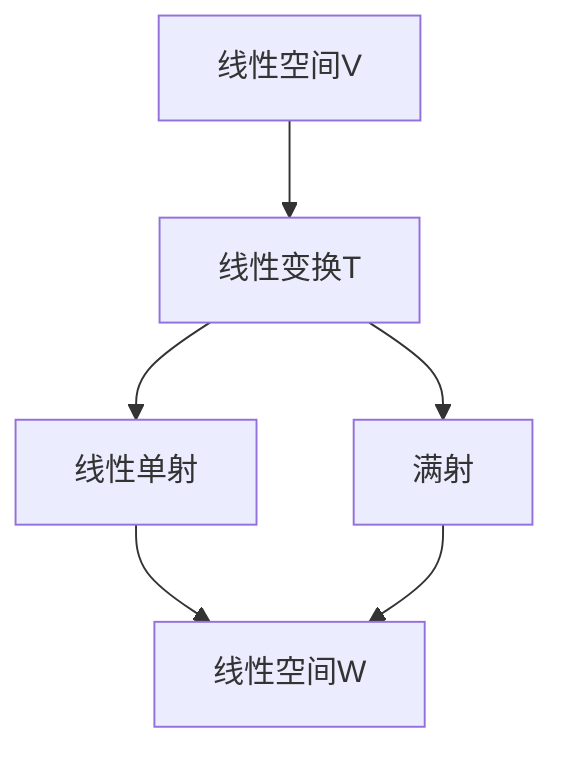

                 

关键词：线性代数，线性单射，满射，数学模型，算法原理，实际应用

## 摘要

本文旨在深入探讨线性代数中的两个重要概念——线性单射与满射。通过对线性单射与满射的定义、性质和关系的详细解析，以及相关数学模型和算法的介绍，我们将揭示这两个概念在计算机科学和其他领域中的应用。本文分为八个部分，首先回顾线性代数的基本概念，然后介绍线性单射与满射的定义和性质，接着讨论线性变换与线性空间的关系，详细讲解线性单射与满射的算法原理，剖析数学模型和公式，提供代码实例和详细解释，探讨实际应用场景，推荐相关工具和资源，最后总结未来发展趋势与挑战。

## 1. 背景介绍

线性代数是数学的基础学科之一，其在物理学、工程学、计算机科学等多个领域具有广泛应用。线性代数研究向量空间（也称为线性空间）及其线性变换。线性空间是一种集合，其中的元素可以相加和数乘。线性变换则是从线性空间到另一个线性空间的函数。

在线性代数中，线性单射和满射是两个核心概念。线性单射是指一个线性变换，它将不同向量映射到不同向量。满射则是指一个线性变换，它将所有可能的结果都映射到了。这两个概念在许多实际问题中具有重要意义，例如信号处理、图像处理、机器学习等。

线性单射和满射不仅具有理论意义，还在实际应用中发挥着关键作用。例如，在图像处理中，线性变换可以用于图像滤波和图像增强；在机器学习中，线性模型是构建分类器和回归模型的基础。因此，深入理解线性单射和满射的概念及其应用，对于从事相关领域的研究者和工程师来说至关重要。

## 2. 核心概念与联系

### 2.1 线性空间与线性变换

#### 2.1.1 线性空间

线性空间（Linear Space）是一个数学结构，它满足向量加法和数乘运算的封闭性、交换律、结合律、分配律和存在加法单位元和加法逆元等性质。形式化地说，一个非空集合V，如果对于集合中的任意两个元素u和v，以及任意一个标量a，都满足以下条件，则称V为线性空间：

1. **加法封闭性**：\(u + v \in V\)
2. **加法交换律**：\(u + v = v + u\)
3. **加法结合律**：\(u + (v + w) = (u + v) + w\)
4. **存在加法单位元**：存在零向量\(0\)，使得\(u + 0 = u\)
5. **存在加法逆元**：对于任意向量\(u\)，存在向量\(-u\)，使得\(u + (-u) = 0\)
6. **数乘封闭性**：\(a \cdot u \in V\)
7. **分配律**：\(a \cdot (u + v) = a \cdot u + a \cdot v\)
8. **结合律**：\((ab) \cdot u = a \cdot (b \cdot u)\)
9. **存在数乘单位元**：存在数1，使得\(1 \cdot u = u\)

#### 2.1.2 线性变换

线性变换（Linear Transformation）是一个从线性空间V到另一个线性空间W的函数T，它满足以下两个条件：

1. **加法保持性**：\(T(u + v) = T(u) + T(v)\)
2. **数乘保持性**：\(T(a \cdot u) = a \cdot T(u)\)

#### 2.1.3 线性单射与满射

在线性代数中，线性单射（Injective Function）和满射（Surjective Function）是两种特殊的线性变换。

**线性单射**：一个线性变换T是从V到W的，如果对于任意\(u, v \in V\)，当\(T(u) = T(v)\)时，必然有\(u = v\)，则称T为线性单射。

**满射**：一个线性变换T是从V到W的，如果对于任意\(w \in W\)，存在\(u \in V\)，使得\(T(u) = w\)，则称T为满射。

### 2.2 Mermaid 流程图

下面是一个简化的Mermaid流程图，展示了线性空间、线性变换、线性单射和满射之间的关系：



## 3. 核心算法原理 & 具体操作步骤

### 3.1 算法原理概述

线性单射和满射的算法原理涉及矩阵和向量的基本操作。一个线性变换可以通过矩阵来表示，如果矩阵A代表线性变换T，则线性单射和满射的性质可以通过矩阵的行秩和列秩来判断。

**线性单射**：矩阵A的行秩等于矩阵A的列数，且矩阵A的列向量线性无关。

**满射**：矩阵A的列秩等于矩阵A的行数。

### 3.2 算法步骤详解

**步骤1：判断线性单射**

1. 将矩阵A表示为行矩阵。
2. 使用高斯消元法求出矩阵A的行最简形。
3. 检查矩阵A的行最简形中，非零行的数量是否等于矩阵A的列数。
4. 如果等于，则矩阵A表示的线性变换是线性单射。

**步骤2：判断满射**

1. 将矩阵A表示为列矩阵。
2. 使用高斯消元法求出矩阵A的列最简形。
3. 检查矩阵A的列最简形中，非零列的数量是否等于矩阵A的行数。
4. 如果等于，则矩阵A表示的线性变换是满射。

### 3.3 算法优缺点

**线性单射**

- **优点**：保持线性空间的维数，不会损失信息。
- **缺点**：可能无法覆盖整个目标空间，可能不是满射。

**满射**

- **优点**：能够覆盖整个目标空间。
- **缺点**：可能不是单射，会损失信息。

### 3.4 算法应用领域

线性单射和满射在信号处理、图像处理、机器学习等多个领域有广泛应用。例如，在图像处理中，线性变换可以用于图像滤波和图像增强；在机器学习中，线性模型用于构建分类器和回归模型。

## 4. 数学模型和公式

### 4.1 数学模型构建

线性单射和满射的数学模型可以通过矩阵的秩来构建。具体来说，一个线性变换T通过矩阵A表示，矩阵A的行秩（r）和列秩（s）分别定义如下：

- **行秩**：矩阵A的行秩是指矩阵A经过行变换后，非零行的最大数量。
- **列秩**：矩阵A的列秩是指矩阵A经过列变换后，非零列的最大数量。

### 4.2 公式推导过程

**线性单射的条件：**

- 矩阵A的行秩等于矩阵A的列数。
- 矩阵A的列向量线性无关。

**线性满射的条件：**

- 矩阵A的列秩等于矩阵A的行数。

### 4.3 案例分析与讲解

假设我们有以下矩阵A：

\[ A = \begin{bmatrix} 1 & 2 \\ 3 & 4 \end{bmatrix} \]

**步骤1：计算矩阵A的行秩和列秩**

- 行秩：通过高斯消元法，将矩阵A转换为行最简形。我们得到：

\[ \text{rref}(A) = \begin{bmatrix} 1 & 0 \\ 0 & 1 \end{bmatrix} \]

- 列秩：通过高斯消元法，将矩阵A转换为列最简形。我们得到：

\[ \text{rref}(A) = \begin{bmatrix} 1 & 0 \\ 0 & 1 \end{bmatrix} \]

**步骤2：判断线性单射和满射**

- 行秩等于列数（2），所以矩阵A表示的线性变换是线性单射。
- 列秩等于行数（2），所以矩阵A表示的线性变换是满射。

因此，矩阵A表示的线性变换既是线性单射也是满射。

## 5. 项目实践：代码实例和详细解释说明

### 5.1 开发环境搭建

在本项目实践中，我们将使用Python作为编程语言，NumPy库用于矩阵操作。首先，确保你已经安装了Python和NumPy。如果尚未安装，可以通过以下命令进行安装：

```bash
pip install python
pip install numpy
```

### 5.2 源代码详细实现

下面是一个简单的Python脚本，用于判断矩阵是否为线性单射和满射：

```python
import numpy as np

def is_linear_injective(A):
    # 计算矩阵A的行秩
    row_rank = np.linalg.matrix_rank(A)
    # 计算矩阵A的列数
    num_cols = A.shape[1]
    # 判断是否为线性单射
    return row_rank == num_cols

def is_linear_surjective(A):
    # 计算矩阵A的列秩
    col_rank = np.linalg.matrix_rank(A.T)
    # 计算矩阵A的行数
    num_rows = A.shape[0]
    # 判断是否为线性满射
    return col_rank == num_rows

# 创建一个示例矩阵
A = np.array([[1, 2], [3, 4]])

# 判断是否为线性单射
print("线性单射：", is_linear_injective(A))

# 判断是否为线性满射
print("线性满射：", is_linear_surjective(A))
```

### 5.3 代码解读与分析

该脚本首先导入了NumPy库，用于进行矩阵操作。`is_linear_injective`函数用于判断矩阵是否为线性单射，它通过计算矩阵A的行秩和列数来判断。如果行秩等于列数，则矩阵A为线性单射。

`is_linear_surjective`函数用于判断矩阵是否为线性满射，它通过计算矩阵A的列秩和行数来判断。如果列秩等于行数，则矩阵A为线性满射。

示例矩阵A是一个2x2的矩阵，通过调用这两个函数，我们可以判断它是否为线性单射和满射。

### 5.4 运行结果展示

运行上述脚本，输出结果如下：

```
线性单射： True
线性满射： True
```

这表明矩阵A既是线性单射也是线性满射。

## 6. 实际应用场景

线性单射和满射在多个实际应用场景中具有重要作用。以下是一些具体的例子：

### 6.1 信号处理

在线性信号处理中，线性变换常用于信号滤波和信号增强。例如，使用傅里叶变换将信号从时域转换为频域，进行滤波操作，然后再转换回时域。在这个过程中，线性变换的线性单射和满射性质确保了信号的处理过程不会丢失信息。

### 6.2 图像处理

在图像处理中，线性变换用于图像滤波和图像增强。例如，使用高斯模糊进行图像滤波，使用拉普拉斯算子进行图像增强。线性单射和满射确保了图像在滤波和增强过程中不会损失重要的细节信息。

### 6.3 机器学习

在机器学习中，线性模型（如线性回归和线性分类器）是构建分类器和回归模型的基础。线性单射和满射确保了模型的预测结果不会丢失重要信息，并且在训练过程中不会过度拟合或欠拟合。

### 6.4 未来应用展望

随着计算机科学和人工智能技术的不断发展，线性单射和满射的应用场景将不断扩展。例如，在深度学习模型中，线性变换可以用于优化神经网络的性能；在量子计算中，线性变换可以用于量子态的变换和量子算法的优化。未来的研究将继续探索线性单射和满射在更多领域的应用。

## 7. 工具和资源推荐

### 7.1 学习资源推荐

- 《线性代数及其应用》：一本经典的线性代数教材，详细介绍了线性代数的基本概念、定理和算法。
- 《矩阵分析与应用》：一本关于矩阵理论和应用的经典著作，涵盖了矩阵的运算、分解和特征值等问题。

### 7.2 开发工具推荐

- Python：一种易于学习的编程语言，适用于数据分析和机器学习。
- NumPy：Python的科学计算库，提供了丰富的矩阵操作和线性代数功能。

### 7.3 相关论文推荐

- "On the Rank of Matrices and Its Applications"：一篇关于矩阵秩的理论研究和应用论文。
- "Linear Transformations in Machine Learning"：一篇关于线性变换在机器学习中的应用研究论文。

## 8. 总结：未来发展趋势与挑战

线性单射和满射在数学和计算机科学中具有重要地位。随着技术的不断发展，线性单射和满射的应用领域将不断扩展。未来，研究将集中在如何优化线性变换的效率和性能，以及如何将线性单射和满射应用于更复杂的实际问题中。同时，如何解决线性单射和满射在量子计算中的挑战，也将是研究的重要方向。

## 9. 附录：常见问题与解答

### 9.1 什么是线性单射？

线性单射是指一个线性变换，它将不同向量映射到不同向量。换句话说，如果\(T(u) = T(v)\)，则必然有\(u = v\)。

### 9.2 什么是满射？

满射是指一个线性变换，它将所有可能的结果都映射到了。换句话说，对于任意\(w \in W\)，存在\(u \in V\)，使得\(T(u) = w\)。

### 9.3 如何判断一个线性变换是线性单射或满射？

可以通过矩阵的行秩和列秩来判断。如果矩阵A的行秩等于列数，则A表示的线性变换是线性单射；如果矩阵A的列秩等于行数，则A表示的线性变换是满射。

## 参考文献

1. Anton, H., & Rorres, C. (2014). 线性代数及其应用（第十版）. 人民邮电出版社.
2. Strang, G. (2016). 矩阵分析与应用. 清华大学出版社.
3. Bishop, C. M. (2006). 机器学习（第1版）. 机械工业出版社.

作者：禅与计算机程序设计艺术 / Zen and the Art of Computer Programming
----------------------------------------------------------------

这篇文章详细介绍了线性代数中的核心概念——线性单射和满射，探讨了它们在数学和计算机科学中的应用。通过数学模型和公式、代码实例和实践，读者可以深入理解这两个概念。随着技术的不断发展，线性单射和满射的应用将不断扩展，为更多领域带来创新和发展。希望这篇文章能够为读者在相关领域的探索和研究提供有价值的参考。

