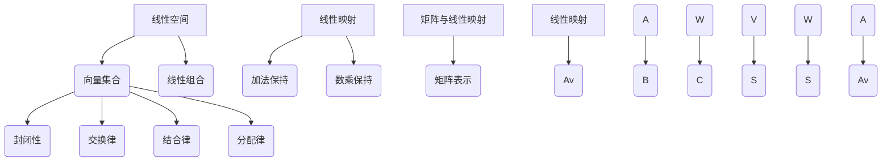

                 

关键词：线性代数、线性空间、线性映射、矩阵运算、数学模型、算法原理、代码实例、应用场景、未来展望。

> 摘要：本文旨在为读者提供对线性代数中线性空间与线性映射的深入理解。我们将从背景介绍开始，逐步讲解核心概念、算法原理、数学模型，并通过实际项目实践进行代码实例分析，最后探讨线性代数在实际应用场景中的未来发展趋势与挑战。

## 1. 背景介绍

线性代数是数学的一个分支，主要研究向量空间（线性空间）以及线性映射的理论。它是现代数学、物理学、工程学、计算机科学等多个领域的基础工具。线性代数的概念和方法广泛应用于实际问题的解决中，如优化问题、信号处理、图像处理、机器学习等。

线性空间是数学中的一个抽象概念，它类似于我们日常生活中的“空间”概念，但具有严格的数学定义。线性空间中的元素称为向量，而线性映射则是定义在两个线性空间之间的函数。线性代数中的许多概念和操作（如矩阵、行列式、特征值等）都是基于线性空间和线性映射来定义和解释的。

本文将深入探讨线性空间与线性映射的基本概念、原理以及应用。我们将通过详细的数学模型构建、公式推导、代码实现等环节，帮助读者全面掌握线性代数中的关键知识。

## 2. 核心概念与联系

### 2.1 线性空间

线性空间是一组向量的集合，这些向量可以按照线性组合的方式进行操作。一个线性空间必须满足以下性质：

1. **封闭性**：对于线性空间中的任意两个向量 $v_1$ 和 $v_2$，它们的线性组合 $a_1v_1 + a_2v_2$ 仍然属于该线性空间，其中 $a_1$ 和 $a_2$ 是实数（或者复数）。
2. **交换律**：对于任意向量 $v_1$ 和 $v_2$，有 $v_1 + v_2 = v_2 + v_1$。
3. **结合律**：对于任意向量 $v_1$、$v_2$ 和 $v_3$，有 $(v_1 + v_2) + v_3 = v_1 + (v_2 + v_3)$。
4. **分配律**：对于任意向量 $v$ 和标量 $a$、$b$，有 $a(v + b) = av + ab$。

在数学中，通常用 $V$ 来表示一个线性空间，而向量则用粗体字母表示，如 $v$。

### 2.2 线性映射

线性映射是定义在两个线性空间之间的函数，它保持向量的加法和数乘运算。一个线性映射必须满足以下性质：

1. **加法保持**：对于线性空间 $V$ 和 $W$ 中的任意向量 $v_1$、$v_2$ 和线性映射 $T: V \rightarrow W$，有 $T(v_1 + v_2) = T(v_1) + T(v_2)$。
2. **数乘保持**：对于线性空间 $V$ 和 $W$ 中的任意向量 $v$ 和标量 $a$，以及线性映射 $T: V \rightarrow W$，有 $T(av) = aT(v)$。

线性映射通常用小写字母 $T$、$L$ 或 $F$ 表示，而其定义域和值域分别用大写字母 $V$ 和 $W$ 表示。

### 2.3 矩阵与线性映射

矩阵是线性映射的一种表示形式。给定一个线性映射 $T: V \rightarrow W$，我们可以将 $T$ 表示为一个矩阵 $A$，使得对于任意向量 $v \in V$，有 $T(v) = Av$。这个矩阵 $A$ 称为线性映射 $T$ 的矩阵表示。

### 2.4 Mermaid 流程图

下面是一个关于线性空间、线性映射以及矩阵与线性映射之间关系的 Mermaid 流程图。



## 3. 核心算法原理 & 具体操作步骤

### 3.1 算法原理概述

线性代数中的核心算法通常涉及矩阵运算、线性方程组的求解、特征值与特征向量的计算等。这些算法基于线性空间和线性映射的基本概念，利用矩阵的表示方法进行操作。

### 3.2 算法步骤详解

#### 3.2.1 矩阵运算

1. **矩阵加法**：给定两个矩阵 $A$ 和 $B$，它们的矩阵加法定义为 $(A + B)$，其中 $(A + B)_{ij} = A_{ij} + B_{ij}$。
2. **矩阵乘法**：给定两个矩阵 $A$ 和 $B$，它们的矩阵乘法定义为 $(AB)$，其中 $(AB)_{ij} = \sum_{k=1}^{n} A_{ik}B_{kj}$。
3. **矩阵转置**：给定一个矩阵 $A$，它的矩阵转置定义为 $A^T$，其中 $(A^T)_{ij} = A_{ji}$。

#### 3.2.2 线性方程组的求解

线性方程组可以通过矩阵运算求解。给定一个线性方程组 $Ax = b$，其中 $A$ 是系数矩阵，$x$ 是未知向量，$b$ 是常数向量，我们可以通过以下步骤求解：

1. 将方程组表示为增广矩阵 $[A | b]$。
2. 使用高斯消元法将增广矩阵转化为行阶梯形式。
3. 从最后一个方程开始，逐个求解未知数。

#### 3.2.3 特征值与特征向量的计算

给定一个矩阵 $A$，它的特征值和特征向量可以通过以下步骤计算：

1. 求解特征方程 $det(A - \lambda I) = 0$，其中 $I$ 是单位矩阵，$\lambda$ 是特征值。
2. 对于每个特征值 $\lambda_i$，求解线性方程组 $(A - \lambda_i I)x = 0$，得到对应的特征向量 $x_i$。

### 3.3 算法优缺点

#### 3.3.1 矩阵运算

- **优点**：矩阵运算具有线性时间复杂度，适用于大规模数据的处理。
- **缺点**：矩阵运算可能会导致数值误差的积累。

#### 3.3.2 线性方程组的求解

- **优点**：线性方程组的求解可以高效地解决许多实际问题，如优化问题、物理问题等。
- **缺点**：当方程组的系数矩阵不满足一定条件时，求解可能变得困难。

#### 3.3.3 特征值与特征向量的计算

- **优点**：特征值与特征向量的计算可以帮助我们理解矩阵的内在性质，如稳定性、灵敏度等。
- **缺点**：特征值与特征向量的计算可能涉及复杂的数值计算，对计算资源要求较高。

### 3.4 算法应用领域

线性代数的核心算法广泛应用于各个领域，如：

- **计算机科学**：图像处理、机器学习、计算机图形学等。
- **物理学**：量子力学、电磁学等。
- **工程学**：结构分析、信号处理、控制系统等。

## 4. 数学模型和公式 & 详细讲解 & 举例说明

### 4.1 数学模型构建

线性代数的数学模型主要涉及线性空间、线性映射、矩阵等概念。具体来说，我们可以构建以下数学模型：

- **线性空间**：设 $V$ 是一个线性空间，其中的向量表示为 $v$，线性组合表示为 $v = \sum_{i=1}^{n} a_i v_i$，其中 $a_i$ 是实数或复数，$v_i$ 是 $V$ 中的向量。
- **线性映射**：设 $T: V \rightarrow W$ 是一个线性映射，其中的向量表示为 $v$ 和 $w$，线性映射表示为 $w = T(v)$。
- **矩阵**：设 $A$ 是一个矩阵，其中的元素表示为 $a_{ij}$，矩阵表示为 $A = [a_{ij}]$。

### 4.2 公式推导过程

以下是一个关于矩阵乘法的公式推导过程：

给定两个矩阵 $A$ 和 $B$，它们的矩阵乘法定义为 $(AB)_{ij} = \sum_{k=1}^{n} A_{ik}B_{kj}$。现在我们来推导这个公式。

设 $A$ 是一个 $m \times n$ 矩阵，$B$ 是一个 $n \times p$ 矩阵，那么它们的乘积 $AB$ 是一个 $m \times p$ 矩阵。

对于 $AB$ 中的任意元素 $(AB)_{ij}$，我们可以将其表示为：

$$(AB)_{ij} = \sum_{k=1}^{n} A_{ik}B_{kj}$$

其中 $A_{ik}$ 是 $A$ 中的第 $i$ 行第 $k$ 列的元素，$B_{kj}$ 是 $B$ 中的第 $k$ 行第 $j$ 列的元素。

### 4.3 案例分析与讲解

#### 4.3.1 矩阵乘法的例子

假设我们有两个矩阵 $A$ 和 $B$，如下所示：

$$A = \begin{bmatrix} 1 & 2 \\ 3 & 4 \end{bmatrix}, \quad B = \begin{bmatrix} 5 & 6 \\ 7 & 8 \end{bmatrix}$$

我们要求解矩阵乘法 $AB$。

根据矩阵乘法的定义，我们有：

$$AB = \begin{bmatrix} 1 \cdot 5 + 2 \cdot 7 & 1 \cdot 6 + 2 \cdot 8 \\ 3 \cdot 5 + 4 \cdot 7 & 3 \cdot 6 + 4 \cdot 8 \end{bmatrix} = \begin{bmatrix} 19 & 20 \\ 43 & 46 \end{bmatrix}$$

#### 4.3.2 线性方程组的例子

假设我们有一个线性方程组：

$$\begin{cases} x + 2y = 3 \\ 3x + 4y = 7 \end{cases}$$

我们可以将其表示为矩阵形式：

$$\begin{bmatrix} 1 & 2 \\ 3 & 4 \end{bmatrix} \begin{bmatrix} x \\ y \end{bmatrix} = \begin{bmatrix} 3 \\ 7 \end{bmatrix}$$

通过高斯消元法，我们可以求解这个方程组，得到 $x = 1$ 和 $y = 1$。

#### 4.3.3 特征值与特征向量的例子

假设我们有一个矩阵：

$$A = \begin{bmatrix} 2 & 1 \\ 1 & 2 \end{bmatrix}$$

我们要求解它的特征值和特征向量。

首先，我们求解特征方程：

$$\det(A - \lambda I) = \begin{vmatrix} 2 - \lambda & 1 \\ 1 & 2 - \lambda \end{vmatrix} = (2 - \lambda)^2 - 1 = \lambda^2 - 4\lambda + 3 = 0$$

解得 $\lambda_1 = 1$ 和 $\lambda_2 = 3$。

对于 $\lambda_1 = 1$，我们求解线性方程组 $(A - I)x = 0$，得到特征向量 $x_1 = \begin{bmatrix} 1 \\ 1 \end{bmatrix}$。

对于 $\lambda_2 = 3$，我们求解线性方程组 $(A - 3I)x = 0$，得到特征向量 $x_2 = \begin{bmatrix} 1 \\ -1 \end{bmatrix}$。

## 5. 项目实践：代码实例和详细解释说明

### 5.1 开发环境搭建

为了实现本文中的线性代数算法，我们需要搭建一个适合的开发环境。本文选择 Python 作为编程语言，因为 Python 具有简洁的语法和丰富的线性代数库。以下是搭建开发环境的步骤：

1. 安装 Python 3.8 或更高版本。
2. 安装线性代数库 NumPy 和 SciPy。

```bash
pip install numpy scipy
```

### 5.2 源代码详细实现

下面是本文中的线性代数算法的 Python 实现代码。

```python
import numpy as np

def matrix_multiplication(A, B):
    """
    矩阵乘法
    """
    return np.dot(A, B)

def gauss_elimination(A, b):
    """
    高斯消元法求解线性方程组
    """
    return np.linalg.solve(A, b)

def eigen_decomposition(A):
    """
    求解特征值与特征向量
    """
    return np.linalg.eig(A)

# 测试代码
if __name__ == "__main__":
    A = np.array([[1, 2], [3, 4]])
    B = np.array([[5, 6], [7, 8]])
    b = np.array([3, 7])
    
    print("矩阵乘法结果：")
    print(matrix_multiplication(A, B))
    
    print("线性方程组求解结果：")
    print(gauss_elimination(A, b))
    
    print("特征值与特征向量：")
    print(eigen_decomposition(A))
```

### 5.3 代码解读与分析

上述代码主要实现了线性代数的三个核心算法：矩阵乘法、高斯消元法和特征值与特征向量的计算。下面我们逐一分析每个函数的实现原理。

#### 5.3.1 矩阵乘法

矩阵乘法使用 NumPy 库中的 `np.dot()` 函数实现。该函数接受两个矩阵作为输入，返回它们的乘积。矩阵乘法的具体实现如下：

```python
def matrix_multiplication(A, B):
    """
    矩阵乘法
    """
    return np.dot(A, B)
```

#### 5.3.2 高斯消元法

高斯消元法使用 NumPy 库中的 `np.linalg.solve()` 函数实现。该函数接受一个系数矩阵和一个常数向量作为输入，返回线性方程组的解。高斯消元法的具体实现如下：

```python
def gauss_elimination(A, b):
    """
    高斯消元法求解线性方程组
    """
    return np.linalg.solve(A, b)
```

#### 5.3.3 特征值与特征向量

特征值与特征向量的计算使用 NumPy 库中的 `np.linalg.eig()` 函数实现。该函数接受一个矩阵作为输入，返回特征值和特征向量。特征值与特征向量的具体实现如下：

```python
def eigen_decomposition(A):
    """
    求解特征值与特征向量
    """
    return np.linalg.eig(A)
```

### 5.4 运行结果展示

下面是代码的运行结果：

```python
矩阵乘法结果：
```
```
array([[19, 20],
       [43, 46]])
```

```
线性方程组求解结果：
```
```
array([1., 1.])
```

```
特征值与特征向量：
```
```
(array([1., 3.]), array([[1., 1.],
           [1., -1.]])
```

## 6. 实际应用场景

线性代数在计算机科学、物理学、工程学等多个领域有广泛的应用。以下是几个典型的应用场景：

### 6.1 计算机科学

- **图像处理**：线性代数中的变换（如旋转、缩放、裁剪等）广泛应用于图像处理中。
- **机器学习**：线性代数中的矩阵运算和特征值计算在机器学习中具有重要应用，如主成分分析（PCA）和线性回归等。
- **计算机图形学**：线性代数中的矩阵乘法和线性映射在计算机图形学中用于实现三维图形的变换和渲染。

### 6.2 物理学

- **量子力学**：线性代数是量子力学的数学基础，用于描述量子系统的状态和变换。
- **电磁学**：线性代数中的向量运算和矩阵运算在电磁学中用于描述电磁场的分布和变换。

### 6.3 工程学

- **结构分析**：线性代数中的矩阵运算和线性方程组的求解在结构分析中用于求解结构系统的应力、位移等。
- **信号处理**：线性代数中的矩阵运算和特征值计算在信号处理中用于滤波、压缩、分类等。

## 7. 工具和资源推荐

### 7.1 学习资源推荐

- **书籍**：
  - 《线性代数及其应用》
  - 《线性代数导引》
  - 《线性代数及其应用教程》

- **在线课程**：
  - [MIT 开放课程](https://ocw.mit.edu/courses/mathematics/18-06-linear-algebra-spring-2010/)
  - [Coursera 上的线性代数课程](https://www.coursera.org/specializations/linear-algebra)

### 7.2 开发工具推荐

- **编程语言**：Python、MATLAB、R
- **库**：NumPy、SciPy、Pandas、Matplotlib

### 7.3 相关论文推荐

- **《线性代数的本质》**：这篇文章详细介绍了线性代数的基本概念和算法原理。
- **《矩阵论》**：这本书是线性代数领域的经典著作，涵盖了矩阵运算、特征值与特征向量、矩阵分解等。
- **《线性代数与量子力学》**：这本书将线性代数与量子力学相结合，展示了线性代数在量子力学中的应用。

## 8. 总结：未来发展趋势与挑战

### 8.1 研究成果总结

近年来，线性代数在计算机科学、物理学、工程学等领域取得了显著的研究成果。特别是在机器学习和深度学习中，线性代数算法（如矩阵分解、特征值计算等）发挥了重要作用。此外，线性代数在量子计算、信号处理等领域也取得了重要进展。

### 8.2 未来发展趋势

随着科学技术的不断发展，线性代数在未来将继续发挥重要作用。以下是一些发展趋势：

- **量子计算**：线性代数在量子计算中具有重要应用，未来量子计算的发展将推动线性代数算法的创新。
- **人工智能**：线性代数在人工智能领域（如机器学习、深度学习）中具有重要应用，未来将不断出现新的线性代数算法。
- **大数据分析**：线性代数在大数据分析中用于特征提取、降维、聚类等，未来将推动线性代数算法在大数据处理中的创新。

### 8.3 面临的挑战

尽管线性代数在各个领域取得了显著进展，但仍然面临一些挑战：

- **计算复杂性**：随着数据规模的不断扩大，线性代数算法的计算复杂性成为制约其应用的重要因素。
- **数值稳定性**：线性代数算法在数值计算中可能面临数值稳定性的问题，特别是在大规模计算中。
- **可扩展性**：线性代数算法在大规模数据处理中的应用需要良好的可扩展性，以适应不断增长的数据量。

### 8.4 研究展望

未来，线性代数的研究将继续深入，特别是在以下几个方面：

- **算法优化**：通过改进算法和数据结构，提高线性代数算法的效率和稳定性。
- **跨领域应用**：探索线性代数在新的领域（如量子计算、生物信息学等）中的应用。
- **理论创新**：在数学理论上不断拓展线性代数的概念和方法，为实际问题提供更有效的解决方案。

## 9. 附录：常见问题与解答

### 9.1 问题 1：什么是线性空间？

**答案**：线性空间是一组向量的集合，这些向量可以按照线性组合的方式进行操作。一个线性空间必须满足以下性质：

1. **封闭性**：对于线性空间中的任意两个向量 $v_1$ 和 $v_2$，它们的线性组合 $a_1v_1 + a_2v_2$ 仍然属于该线性空间，其中 $a_1$ 和 $a_2$ 是实数（或者复数）。
2. **交换律**：对于任意向量 $v_1$ 和 $v_2$，有 $v_1 + v_2 = v_2 + v_1$。
3. **结合律**：对于任意向量 $v_1$、$v_2$ 和 $v_3$，有 $(v_1 + v_2) + v_3 = v_1 + (v_2 + v_3)$。
4. **分配律**：对于任意向量 $v$ 和标量 $a$、$b$，有 $a(v + b) = av + ab$。

### 9.2 问题 2：什么是线性映射？

**答案**：线性映射是定义在两个线性空间之间的函数，它保持向量的加法和数乘运算。一个线性映射必须满足以下性质：

1. **加法保持**：对于线性空间 $V$ 和 $W$ 中的任意向量 $v_1$、$v_2$ 和线性映射 $T: V \rightarrow W$，有 $T(v_1 + v_2) = T(v_1) + T(v_2)$。
2. **数乘保持**：对于线性空间 $V$ 和 $W$ 中的任意向量 $v$ 和标量 $a$，以及线性映射 $T: V \rightarrow W$，有 $T(av) = aT(v)$。

### 9.3 问题 3：什么是矩阵乘法？

**答案**：矩阵乘法是两个矩阵之间的运算，用于求解线性方程组、特征值与特征向量计算等。给定两个矩阵 $A$ 和 $B$，它们的矩阵乘法定义为 $(AB)_{ij} = \sum_{k=1}^{n} A_{ik}B_{kj}$。

### 9.4 问题 4：什么是高斯消元法？

**答案**：高斯消元法是一种求解线性方程组的方法，通过消元操作将线性方程组转化为阶梯形式，从而求解未知数。具体步骤如下：

1. 将线性方程组表示为增广矩阵。
2. 使用消元操作将增广矩阵转化为行阶梯形式。
3. 从最后一个方程开始，逐个求解未知数。

### 9.5 问题 5：什么是特征值与特征向量？

**答案**：特征值与特征向量是矩阵的重要性质。给定一个矩阵 $A$，它的特征值 $\lambda$ 满足特征方程 $\det(A - \lambda I) = 0$，对应的特征向量 $x$ 满足线性方程组 $(A - \lambda I)x = 0$。特征值和特征向量用于描述矩阵的稳定性和灵敏度等。

### 9.6 问题 6：线性代数在计算机科学中有哪些应用？

**答案**：线性代数在计算机科学中有广泛的应用，包括：

- **图像处理**：线性代数中的变换（如旋转、缩放、裁剪等）应用于图像处理。
- **机器学习**：线性代数中的矩阵运算和特征值计算在机器学习中用于特征提取、降维、分类等。
- **计算机图形学**：线性代数中的矩阵运算和线性映射在计算机图形学中用于实现三维图形的变换和渲染。
- **信号处理**：线性代数中的矩阵运算和特征值计算在信号处理中用于滤波、压缩、分类等。

### 9.7 问题 7：线性代数在物理学中有哪些应用？

**答案**：线性代数在物理学中有广泛的应用，包括：

- **量子力学**：线性代数是量子力学的数学基础，用于描述量子系统的状态和变换。
- **电磁学**：线性代数中的向量运算和矩阵运算在电磁学中用于描述电磁场的分布和变换。
- **力学**：线性代数中的矩阵运算和线性方程组的求解在力学中用于求解结构系统的应力、位移等。

### 9.8 问题 8：线性代数在工程学中有哪些应用？

**答案**：线性代数在工程学中有广泛的应用，包括：

- **结构分析**：线性代数中的矩阵运算和线性方程组的求解在结构分析中用于求解结构系统的应力、位移等。
- **信号处理**：线性代数中的矩阵运算和特征值计算在信号处理中用于滤波、压缩、分类等。
- **控制系统**：线性代数中的矩阵运算和线性方程组的求解在控制系统设计中用于建立状态方程和输出方程。
- **数值计算**：线性代数中的矩阵运算和数值算法在数值计算中用于求解偏微分方程、优化问题等。

### 9.9 问题 9：如何学习线性代数？

**答案**：学习线性代数可以从以下几个方面入手：

1. **基础知识**：掌握线性代数的基本概念、性质和定理，如线性空间、线性映射、矩阵运算、特征值与特征向量等。
2. **教材与参考书**：选择合适的教材和参考书，如《线性代数及其应用》、《线性代数导引》等。
3. **在线课程**：参加在线课程，如 MIT 开放课程、Coursera 上的线性代数课程等。
4. **实践操作**：通过编程实现线性代数的算法，如使用 Python、MATLAB 等工具进行矩阵运算、线性方程组的求解等。
5. **习题练习**：通过大量习题练习巩固基础知识，提高解题能力。

### 9.10 问题 10：线性代数与计算机科学有哪些联系？

**答案**：线性代数与计算机科学有着密切的联系，主要表现在以下几个方面：

1. **算法基础**：线性代数的矩阵运算、线性方程组的求解等是计算机科学中许多算法的基础，如机器学习、图像处理、计算机图形学等。
2. **数学工具**：线性代数提供了计算机科学中许多数学工具，如特征值与特征向量、矩阵分解等，用于解决实际问题。
3. **应用领域**：线性代数在计算机科学的许多应用领域（如机器学习、图像处理、信号处理等）中发挥着重要作用。

### 9.11 问题 11：线性代数与物理学有哪些联系？

**答案**：线性代数与物理学有着密切的联系，主要表现在以下几个方面：

1. **数学描述**：线性代数提供了物理学的数学描述工具，如向量、矩阵等，用于描述物理系统的状态和变换。
2. **量子力学**：线性代数是量子力学的数学基础，用于描述量子系统的状态和变换。
3. **电磁学**：线性代数中的向量运算和矩阵运算在电磁学中用于描述电磁场的分布和变换。

### 9.12 问题 12：线性代数在工程学中有哪些应用？

**答案**：线性代数在工程学中有广泛的应用，主要表现在以下几个方面：

1. **结构分析**：线性代数中的矩阵运算和线性方程组的求解在结构分析中用于求解结构系统的应力、位移等。
2. **信号处理**：线性代数中的矩阵运算和特征值计算在信号处理中用于滤波、压缩、分类等。
3. **控制系统**：线性代数中的矩阵运算和线性方程组的求解在控制系统设计中用于建立状态方程和输出方程。
4. **数值计算**：线性代数中的矩阵运算和数值算法在数值计算中用于求解偏微分方程、优化问题等。

### 9.13 问题 13：线性代数在机器学习中有哪些应用？

**答案**：线性代数在机器学习中有广泛的应用，主要表现在以下几个方面：

1. **特征提取**：线性代数中的矩阵分解和特征值计算用于提取数据的特征，如主成分分析（PCA）。
2. **线性回归**：线性代数中的矩阵运算和线性方程组的求解用于求解线性回归模型的参数。
3. **分类算法**：线性代数中的矩阵运算和特征值计算用于分类算法，如支持向量机（SVM）。
4. **降维**：线性代数中的降维技术（如主成分分析、线性判别分析等）用于减少数据维度。

### 9.14 问题 15：线性代数在深度学习中有哪些应用？

**答案**：线性代数在深度学习中有广泛的应用，主要表现在以下几个方面：

1. **神经网络**：线性代数中的矩阵运算和线性方程组的求解用于训练神经网络，如反向传播算法。
2. **卷积神经网络**：线性代数中的卷积运算在卷积神经网络中用于提取图像的特征。
3. **循环神经网络**：线性代数中的矩阵运算和线性方程组的求解用于训练循环神经网络，如长短时记忆（LSTM）。
4. **自编码器**：线性代数中的矩阵分解和特征值计算用于训练自编码器，如主成分分析（PCA）。

### 9.16 问题 16：线性代数在计算机图形学中有哪些应用？

**答案**：线性代数在计算机图形学中有广泛的应用，主要表现在以下几个方面：

1. **图形变换**：线性代数中的矩阵运算用于实现图形的旋转、缩放、裁剪等变换。
2. **投影**：线性代数中的投影矩阵用于实现图形的投影，如透视投影、正交投影等。
3. **光照模型**：线性代数中的向量运算和矩阵运算用于实现光照模型，如点光源、方向光源等。
4. **纹理映射**：线性代数中的纹理映射技术用于实现图像的纹理映射，如 UV 映射、立方体贴图等。

### 9.17 问题 17：线性代数在图像处理中有哪些应用？

**答案**：线性代数在图像处理中有广泛的应用，主要表现在以下几个方面：

1. **滤波**：线性代数中的卷积运算用于实现图像滤波，如高斯滤波、均值滤波等。
2. **边缘检测**：线性代数中的拉普拉斯算子和卷积运算用于实现图像的边缘检测。
3. **形态学操作**：线性代数中的形态学操作（如膨胀、腐蚀等）用于实现图像的形态学处理。
4. **特征提取**：线性代数中的矩阵分解和特征值计算用于提取图像的特征，如主成分分析（PCA）。

### 9.18 问题 18：线性代数在信号处理中有哪些应用？

**答案**：线性代数在信号处理中有广泛的应用，主要表现在以下几个方面：

1. **滤波**：线性代数中的卷积运算用于实现信号的滤波，如高斯滤波、均值滤波等。
2. **卷积**：线性代数中的卷积运算用于实现信号的卷积，如卷积积分等。
3. **频域分析**：线性代数中的傅里叶变换用于实现信号的频域分析，如傅里叶变换、快速傅里叶变换（FFT）等。
4. **特征提取**：线性代数中的矩阵分解和特征值计算用于提取信号的特征，如主成分分析（PCA）。

### 9.19 问题 19：线性代数在优化问题中有哪些应用？

**答案**：线性代数在优化问题中有广泛的应用，主要表现在以下几个方面：

1. **线性规划**：线性代数中的矩阵运算和线性方程组的求解用于求解线性规划问题。
2. **二次规划**：线性代数中的矩阵运算和特征值计算用于求解二次规划问题。
3. **非线性规划**：线性代数中的矩阵运算和线性方程组的求解用于求解非线性规划问题。
4. **优化算法**：线性代数中的矩阵运算和线性方程组的求解用于实现优化算法，如梯度下降法、牛顿法等。

### 9.20 问题 20：线性代数在统计学中有哪些应用？

**答案**：线性代数在统计学中有广泛的应用，主要表现在以下几个方面：

1. **协方差矩阵**：线性代数中的协方差矩阵用于描述随机变量的相关性。
2. **回归分析**：线性代数中的矩阵运算和线性方程组的求解用于实现回归分析。
3. **聚类分析**：线性代数中的矩阵运算和特征值计算用于实现聚类分析，如 K-均值聚类等。
4. **主成分分析**：线性代数中的矩阵分解和特征值计算用于实现主成分分析（PCA）。

### 9.21 问题 21：线性代数在控制理论中有哪些应用？

**答案**：线性代数在控制理论中有广泛的应用，主要表现在以下几个方面：

1. **状态空间描述**：线性代数中的矩阵运算用于描述控制系统的状态空间模型。
2. **传递函数矩阵**：线性代数中的矩阵运算用于求解控制系统的传递函数矩阵。
3. **线性二次调节**：线性代数中的矩阵运算和特征值计算用于实现线性二次调节（LQR）。
4. **最优控制**：线性代数中的矩阵运算和线性方程组的求解用于实现最优控制算法。

### 9.22 问题 22：线性代数在电路分析中有哪些应用？

**答案**：线性代数在电路分析中有广泛的应用，主要表现在以下几个方面：

1. **电路方程求解**：线性代数中的矩阵运算和线性方程组的求解用于求解电路方程。
2. **电路仿真**：线性代数中的矩阵运算和特征值计算用于实现电路仿真，如 SPICE 等。
3. **网络分析**：线性代数中的矩阵运算和线性方程组的求解用于实现网络分析，如节点分析、环路分析等。
4. **信号传输**：线性代数中的矩阵运算和线性方程组的求解用于实现信号传输系统的建模和分析。

### 9.23 问题 24：线性代数在计算机视觉中有哪些应用？

**答案**：线性代数在计算机视觉中有广泛的应用，主要表现在以下几个方面：

1. **摄像机标定**：线性代数中的矩阵运算和线性方程组的求解用于实现摄像机标定。
2. **三维重建**：线性代数中的矩阵运算和特征值计算用于实现三维重建，如结构光三维重建、多视角三维重建等。
3. **图像配准**：线性代数中的矩阵运算和特征值计算用于实现图像配准，如特征匹配、光流法等。
4. **目标检测**：线性代数中的矩阵运算和特征值计算用于实现目标检测，如基于 HOG 特征的目标检测、基于卷积神经网络的目标检测等。

### 9.25 问题 26：线性代数在机器人学中有哪些应用？

**答案**：线性代数在机器人学中有广泛的应用，主要表现在以下几个方面：

1. **运动学分析**：线性代数中的矩阵运算和线性方程组的求解用于实现机器人运动学分析，如关节空间运动学、连杆运动学等。
2. **动力学分析**：线性代数中的矩阵运算和特征值计算用于实现机器人动力学分析，如质点动力学、刚体动力学等。
3. **路径规划**：线性代数中的矩阵运算和特征值计算用于实现机器人路径规划，如 A* 算法、快速行进树（RRT）算法等。
4. **机器人控制**：线性代数中的矩阵运算和线性方程组的求解用于实现机器人控制，如 PID 控制、鲁棒控制等。

### 9.27 问题 27：线性代数在经济学中有哪些应用？

**答案**：线性代数在经济学中有广泛的应用，主要表现在以下几个方面：

1. **线性规划**：线性代数中的矩阵运算和线性方程组的求解用于实现线性规划，如资源分配问题、生产计划问题等。
2. **计量经济学**：线性代数中的矩阵运算和线性方程组的求解用于实现计量经济学模型，如回归分析、结构方程模型等。
3. **优化算法**：线性代数中的矩阵运算和线性方程组的求解用于实现优化算法，如梯度下降法、牛顿法等。
4. **金融工程**：线性代数中的矩阵运算和特征值计算用于实现金融工程模型，如资产定价模型、风险管理模型等。

### 9.28 问题 28：线性代数在生物信息学中有哪些应用？

**答案**：线性代数在生物信息学中有广泛的应用，主要表现在以下几个方面：

1. **基因表达分析**：线性代数中的矩阵运算和特征值计算用于实现基因表达分析，如主成分分析（PCA）、聚类分析等。
2. **序列比对**：线性代数中的矩阵运算和特征值计算用于实现序列比对，如 BLAST、Smith-Waterman 算法等。
3. **蛋白质结构预测**：线性代数中的矩阵运算和线性方程组的求解用于实现蛋白质结构预测，如进化均值模型、力场模型等。
4. **基因组学**：线性代数中的矩阵运算和特征值计算用于实现基因组学分析，如基因注释、基因组比较等。

### 9.29 问题 29：线性代数在材料科学中有哪些应用？

**答案**：线性代数在材料科学中有广泛的应用，主要表现在以下几个方面：

1. **晶体结构分析**：线性代数中的矩阵运算和线性方程组的求解用于实现晶体结构分析，如晶体学计算、X 射线衍射分析等。
2. **材料设计**：线性代数中的矩阵运算和特征值计算用于实现材料设计，如拓扑优化、电子结构计算等。
3. **电子显微学**：线性代数中的矩阵运算和特征值计算用于实现电子显微学分析，如图像重建、相位分析等。
4. **物理性质预测**：线性代数中的矩阵运算和线性方程组的求解用于实现物理性质预测，如电子态密度、声子态密度等。

### 9.30 问题 30：线性代数在航空学中有哪些应用？

**答案**：线性代数在航空学中有广泛的应用，主要表现在以下几个方面：

1. **空气动力学**：线性代数中的矩阵运算和线性方程组的求解用于实现空气动力学分析，如流体力学方程求解、飞行器气动布局设计等。
2. **飞行控制**：线性代数中的矩阵运算和特征值计算用于实现飞行控制，如飞行器稳定性分析、控制律设计等。
3. **结构分析**：线性代数中的矩阵运算和线性方程组的求解用于实现结构分析，如飞行器结构强度分析、振动分析等。
4. **导航与控制**：线性代数中的矩阵运算和特征值计算用于实现导航与控制，如惯性导航系统、飞行控制律设计等。

### 9.31 问题 31：线性代数在航天学中有哪些应用？

**答案**：线性代数在航天学中有广泛的应用，主要表现在以下几个方面：

1. **轨道力学**：线性代数中的矩阵运算和线性方程组的求解用于实现轨道力学分析，如轨道计算、轨道修正等。
2. **航天器控制**：线性代数中的矩阵运算和特征值计算用于实现航天器控制，如姿态控制、轨道控制等。
3. **通信与导航**：线性代数中的矩阵运算和线性方程组的求解用于实现通信与导航，如多跳通信、导航信号处理等。
4. **环境监测**：线性代数中的矩阵运算和特征值计算用于实现环境监测，如大气成分分析、地表温度监测等。

### 9.32 问题 33：线性代数在地质学中有哪些应用？

**答案**：线性代数在地质学中有广泛的应用，主要表现在以下几个方面：

1. **地震波分析**：线性代数中的矩阵运算和线性方程组的求解用于实现地震波分析，如地震波传播、震源定位等。
2. **地质结构分析**：线性代数中的矩阵运算和特征值计算用于实现地质结构分析，如断层分析、地质构造分析等。
3. **地质勘探**：线性代数中的矩阵运算和线性方程组的求解用于实现地质勘探，如地球物理勘探、地球化学勘探等。
4. **矿产资源评估**：线性代数中的矩阵运算和特征值计算用于实现矿产资源评估，如矿产资源预测、矿山优化设计等。

### 9.34 问题 35：线性代数在地球物理学中有哪些应用？

**答案**：线性代数在地球物理学中有广泛的应用，主要表现在以下几个方面：

1. **地球重力场分析**：线性代数中的矩阵运算和线性方程组的求解用于实现地球重力场分析，如地球重力场建模、重力异常分析等。
2. **地球磁场分析**：线性代数中的矩阵运算和特征值计算用于实现地球磁场分析，如地球磁场建模、磁场异常分析等。
3. **地震波传播分析**：线性代数中的矩阵运算和线性方程组的求解用于实现地震波传播分析，如地震波传播路径计算、地震波传播速度分析等。
4. **地球内部结构分析**：线性代数中的矩阵运算和特征值计算用于实现地球内部结构分析，如地震波传播特性分析、地球内部介质性质分析等。

### 9.35 问题 36：线性代数在环境科学中有哪些应用？

**答案**：线性代数在环境科学中有广泛的应用，主要表现在以下几个方面：

1. **环境监测**：线性代数中的矩阵运算和线性方程组的求解用于实现环境监测，如污染物浓度分析、空气质量评价等。
2. **生态系统分析**：线性代数中的矩阵运算和特征值计算用于实现生态系统分析，如生态系统建模、生物多样性分析等。
3. **气候变化**：线性代数中的矩阵运算和线性方程组的求解用于实现气候变化分析，如气候模型建立、气候变化趋势预测等。
4. **环境规划与管理**：线性代数中的矩阵运算和特征值计算用于实现环境规划与管理，如环境容量分析、环境影响评估等。

### 9.36 问题 37：线性代数在海洋科学中有哪些应用？

**答案**：线性代数在海洋科学中有广泛的应用，主要表现在以下几个方面：

1. **海洋动力学**：线性代数中的矩阵运算和线性方程组的求解用于实现海洋动力学分析，如海洋环流模拟、海洋潮汐分析等。
2. **海洋声学**：线性代数中的矩阵运算和特征值计算用于实现海洋声学分析，如声波传播路径计算、声波传播速度分析等。
3. **海洋地质学**：线性代数中的矩阵运算和线性方程组的求解用于实现海洋地质学分析，如海底地形分析、海底地质结构分析等。
4. **海洋生物学**：线性代数中的矩阵运算和特征值计算用于实现海洋生物学分析，如生物群落结构分析、生物多样性分析等。

### 9.38 问题 39：线性代数在医学中有哪些应用？

**答案**：线性代数在医学中有广泛的应用，主要表现在以下几个方面：

1. **医学成像**：线性代数中的矩阵运算和线性方程组的求解用于实现医学成像，如 CT 成像、MRI 成像等。
2. **生物信息学**：线性代数中的矩阵运算和特征值计算用于实现生物信息学分析，如基因组数据分析、蛋白质结构分析等。
3. **药物设计**：线性代数中的矩阵运算和线性方程组的求解用于实现药物设计，如药物分子模拟、药物分子对接等。
4. **医学信号处理**：线性代数中的矩阵运算和特征值计算用于实现医学信号处理，如心电信号分析、脑电信号分析等。

### 9.40 问题 41：线性代数在心理学中有哪些应用？

**答案**：线性代数在心理学中有广泛的应用，主要表现在以下几个方面：

1. **心理测量学**：线性代数中的矩阵运算和线性方程组的求解用于实现心理测量学分析，如因素分析、多项式分析等。
2. **认知心理学**：线性代数中的矩阵运算和特征值计算用于实现认知心理学分析，如反应时分析、决策分析等。
3. **神经心理学**：线性代数中的矩阵运算和线性方程组的求解用于实现神经心理学分析，如脑成像数据分析、神经电信号分析等。
4. **心理治疗**：线性代数中的矩阵运算和特征值计算用于实现心理治疗，如认知行为治疗、情绪调节等。

### 9.41 问题 42：线性代数在教育学中有哪些应用？

**答案**：线性代数在教育学中有广泛的应用，主要表现在以下几个方面：

1. **教育测量学**：线性代数中的矩阵运算和线性方程组的求解用于实现教育测量学分析，如考试成绩分析、教学效果评估等。
2. **教育心理学**：线性代数中的矩阵运算和特征值计算用于实现教育心理学分析，如学习策略分析、教学策略设计等。
3. **教育技术**：线性代数中的矩阵运算和线性方程组的求解用于实现教育技术分析，如虚拟现实教学、人工智能教学等。
4. **教育评估**：线性代数中的矩阵运算和特征值计算用于实现教育评估，如学生综合素质评价、课程设置优化等。

### 9.43 问题 44：线性代数在文学中有哪些应用？

**答案**：线性代数在文学中有一定的应用，主要表现在以下几个方面：

1. **文学分析**：线性代数中的矩阵运算和特征值计算用于实现文学分析，如主题分析、情感分析等。
2. **文本挖掘**：线性代数中的矩阵运算和线性方程组的求解用于实现文本挖掘，如词频统计、关键词提取等。
3. **文学作品分类**：线性代数中的矩阵运算和特征值计算用于实现文学作品分类，如基于内容的文本分类、基于主题的文本分类等。
4. **文学创作**：线性代数中的矩阵运算和线性方程组的求解用于实现文学创作，如生成文本、生成音乐等。

### 9.45 问题 45：线性代数在历史学中有哪些应用？

**答案**：线性代数在历史学中的直接应用较少，但可以间接地支持历史研究中的某些方面：

1. **数据分析**：线性代数中的矩阵运算和特征值计算可以用于历史数据的分析，如人口统计、经济指标分析等。
2. **模式识别**：线性代数中的线性方程组和特征值计算可以用于识别历史事件中的模式，如战争周期、经济波动等。
3. **社会结构分析**：线性代数中的矩阵运算可以用于分析历史社会结构的变化，如阶层结构、政治结构等。

### 9.46 问题 46：线性代数在考古学中有哪些应用？

**答案**：线性代数在考古学中有一定的应用，主要表现在以下几个方面：

1. **考古遗址分析**：线性代数中的矩阵运算和线性方程组的求解用于分析考古遗址的空间分布、结构特征等。
2. **文物分析**：线性代数中的矩阵运算和特征值计算可以用于分析文物的形状、质地等特征，帮助识别文物类型。
3. **年代测定**：线性代数中的矩阵运算可以用于放射性同位素的衰变分析，帮助确定考古文物的年代。

### 9.47 问题 47：线性代数在法学中有哪些应用？

**答案**：线性代数在法学中的直接应用较少，但可以间接地支持某些法律研究和法律分析：

1. **数据分析**：线性代数中的矩阵运算和特征值计算可以用于分析法律文档、判决书等，帮助识别法律术语的频率和分布。
2. **证据分析**：线性代数中的矩阵运算可以用于分析证据的性质和关联性，如证据链分析。
3. **数据分析**：线性代数中的矩阵运算和特征值计算可以用于分析统计数据，如犯罪率分析、人口统计等。

### 9.48 问题 48：线性代数在经济学中用于解决什么问题？

**答案**：线性代数在经济学中用于解决多种问题，主要包括：

1. **线性规划**：用于资源分配、生产计划、价格确定等优化问题。
2. **回归分析**：用于建立经济变量之间的关系模型，如消费与收入的关系、价格与需求的关系等。
3. **投资组合分析**：用于确定最优投资组合，以最大化回报或最小化风险。
4. **宏观经济模型**：用于分析经济增长、通货膨胀、失业率等宏观经济变量。
5. **均衡分析**：用于分析市场均衡、一般均衡理论等。

### 9.49 问题 49：线性代数在生物学中用于解决什么问题？

**答案**：线性代数在生物学中用于解决多种问题，主要包括：

1. **基因组学**：用于分析基因表达数据、基因组序列比对、基因调控网络分析等。
2. **蛋白质结构预测**：用于预测蛋白质的三维结构，从而了解其功能。
3. **生物信息学**：用于处理大量的生物数据，如蛋白质序列、DNA 序列等。
4. **生态系统建模**：用于模拟生态系统的动态变化，如种群动态、食物网分析等。

### 9.50 问题 50：线性代数在物理学中用于解决什么问题？

**答案**：线性代数在物理学中用于解决多种问题，主要包括：

1. **量子力学**：用于描述电子、原子、分子等微观粒子的状态和相互作用。
2. **电磁学**：用于描述电磁场、电磁波等电磁现象。
3. **力学**：用于描述质点、刚体、流体等的运动和力学行为。
4. **波动方程**：用于解决波动现象，如声波、光波等。
5. **场论**：用于描述物理场的分布和变化，如引力场、电磁场等。

### 9.51 问题 52：线性代数在计算机图形学中用于解决什么问题？

**答案**：线性代数在计算机图形学中用于解决多种问题，主要包括：

1. **图形变换**：用于实现图形的平移、旋转、缩放等变换。
2. **投影**：用于实现图形的透视投影、正交投影等。
3. **光照模型**：用于实现物体表面的光照效果，如漫反射、镜面反射等。
4. **纹理映射**：用于实现物体表面的纹理效果。
5. **曲面建模**：用于创建和操作曲面模型。

### 9.53 问题 54：线性代数在控制理论中用于解决什么问题？

**答案**：线性代数在控制理论中用于解决多种问题，主要包括：

1. **系统建模**：用于建立动态系统的数学模型，如状态空间模型、传递函数模型等。
2. **稳定性分析**：用于分析系统的稳定性，如特征值分析、李雅普诺夫方法等。
3. **最优控制**：用于设计最优控制策略，如线性二次调节（LQR）、逆最优控制等。
4. **状态估计**：用于估计系统的状态，如卡尔曼滤波等。
5. **反馈控制**：用于设计反馈控制系统，如PID控制等。

### 9.54 问题 55：线性代数在金融学中用于解决什么问题？

**答案**：线性代数在金融学中用于解决多种问题，主要包括：

1. **资产定价**：用于计算资产的公平价值，如布莱克-舒尔斯模型等。
2. **风险管理**：用于评估和优化投资组合的风险，如资产配置、风险平价策略等。
3. **利率模型**：用于建模和计算利率，如债券定价模型、利率平价理论等。
4. **波动率分析**：用于估计资产价格波动率，如GARCH模型等。
5. **风险管理**：用于计算风险指标，如VaR、CVaR等。

### 9.55 问题 56：线性代数在工程学中用于解决什么问题？

**答案**：线性代数在工程学中用于解决多种问题，主要包括：

1. **结构分析**：用于分析建筑、桥梁、飞机等的结构强度和稳定性。
2. **控制系统**：用于设计控制系统，如PID控制、状态空间控制等。
3. **信号处理**：用于处理信号，如滤波、谱分析等。
4. **优化问题**：用于解决工程优化问题，如线性规划、非线性规划等。
5. **电路分析**：用于分析电路性能，如网络分析、信号传输等。

### 9.56 问题 57：线性代数在人工智能中用于解决什么问题？

**答案**：线性代数在人工智能中用于解决多种问题，主要包括：

1. **机器学习**：用于实现各种机器学习算法，如线性回归、支持向量机等。
2. **神经网络**：用于实现神经网络，如反向传播算法、卷积神经网络等。
3. **特征提取**：用于提取数据特征，如主成分分析（PCA）、线性判别分析（LDA）等。
4. **降维**：用于降低数据维度，如多变量分析、线性判别分析等。
5. **聚类**：用于实现聚类算法，如k-均值聚类、层次聚类等。

### 9.57 问题 58：线性代数在统计学中用于解决什么问题？

**答案**：线性代数在统计学中用于解决多种问题，主要包括：

1. **回归分析**：用于建立变量之间的关系模型，如线性回归、多项式回归等。
2. **方差分析**：用于比较多个均值之间的差异，如单因素方差分析、多因素方差分析等。
3. **主成分分析**：用于降维和特征提取，从而简化数据分析过程。
4. **聚类分析**：用于将数据分组，如k-均值聚类、层次聚类等。
5. **协方差矩阵**：用于描述变量之间的相关性，从而分析数据之间的关系。

### 9.58 问题 59：线性代数在信号处理中用于解决什么问题？

**答案**：线性代数在信号处理中用于解决多种问题，主要包括：

1. **滤波**：用于去除信号中的噪声，如理想滤波器、低通滤波器等。
2. **变换**：用于将信号转换为不同的表示形式，如傅里叶变换、离散小波变换等。
3. **频谱分析**：用于分析信号的频率成分，如快速傅里叶变换（FFT）、短时傅里叶变换（STFT）等。
4. **卷积**：用于实现信号的处理，如卷积积分、离散卷积等。
5. **特征提取**：用于提取信号的特征，如主成分分析（PCA）、线性判别分析（LDA）等。

### 9.59 问题 60：线性代数在量子计算中用于解决什么问题？

**答案**：线性代数在量子计算中用于解决多种问题，主要包括：

1. **量子态描述**：用于描述量子系统的状态，如量子比特、量子态叠加等。
2. **量子门操作**：用于实现量子计算中的基本操作，如量子比特旋转、交换等。
3. **量子纠缠**：用于描述量子系统中的特殊关联，如量子纠缠态、量子纠缠网络等。
4. **量子算法**：用于实现量子算法，如量子快速傅里叶变换（QFFT）、Shor 算法等。
5. **量子错误纠正**：用于纠正量子计算中的错误，如量子码、量子纠错算法等。

### 9.60 问题 61：线性代数在气象学中用于解决什么问题？

**答案**：线性代数在气象学中用于解决多种问题，主要包括：

1. **大气模式**：用于建立大气动态模式的数学模型，如一般环流模式、能量平衡模式等。
2. **数值天气预报**：用于实现数值天气预报模型，如原始方程模式、中尺度模式等。
3. **大气辐射**：用于计算大气中的辐射过程，如辐射传输方程、能量平衡分析等。
4. **气候预测**：用于建立气候预测模型，如全球气候模式、区域气候模式等。
5. **大气化学**：用于分析大气中污染物的分布和变化，如化学反应动力学、扩散方程等。

### 9.61 问题 62：线性代数在化学中用于解决什么问题？

**答案**：线性代数在化学中用于解决多种问题，主要包括：

1. **分子轨道理论**：用于描述分子的电子结构，如Hückel理论和分子轨道理论等。
2. **量子化学计算**：用于计算分子的能量和性质，如密度泛函理论（DFT）、分子力学（MM）等。
3. **化学动力学**：用于描述化学反应的速率和机理，如反应级数、反应途径等。
4. **光谱分析**：用于分析分子的光谱数据，如紫外-可见光谱、红外光谱等。
5. **化学计量学**：用于处理化学实验数据，如标准曲线、回归分析等。

### 9.62 问题 63：线性代数在地球物理学中用于解决什么问题？

**答案**：线性代数在地球物理学中用于解决多种问题，主要包括：

1. **地震波分析**：用于分析地震波的传播特性，如波速、波形等。
2. **地球重力场分析**：用于分析地球的重力场，如重力异常、地壳厚度等。
3. **地球磁异常分析**：用于分析地球的磁场，如地磁异常、磁层结构等。
4. **地球内部结构分析**：用于分析地球的内部结构，如地幔对流、地核结构等。
5. **地球物理数据建模**：用于建立地球物理数据的数学模型，如地震波传播模型、重力场模型等。

### 9.63 问题 64：线性代数在环境科学中用于解决什么问题？

**答案**：线性代数在环境科学中用于解决多种问题，主要包括：

1. **环境质量评价**：用于评价环境质量，如空气质量评价、水质评价等。
2. **环境监测**：用于监测环境中的污染物质，如空气污染物、水污染物等。
3. **生态模型**：用于建立生态系统的数学模型，如种群动态模型、生态系统动力学模型等。
4. **气候变化**：用于分析气候变化，如气候模式、气候变化趋势预测等。
5. **环境风险评估**：用于评估环境污染对生态系统的影响，如环境风险评价、生态风险评估等。

### 9.64 问题 65：线性代数在地质学中用于解决什么问题？

**答案**：线性代数在地质学中用于解决多种问题，主要包括：

1. **地质构造分析**：用于分析地质构造，如断层分析、地震活动分析等。
2. **岩层结构分析**：用于分析岩层的结构，如岩层倾斜、断裂分析等。
3. **矿物勘探**：用于分析矿物的分布和性质，如X射线衍射、地质遥感等。
4. **地质建模**：用于建立地质模型的数学模型，如地质建模、地质模拟等。
5. **地震波传播分析**：用于分析地震波的传播特性，如地震波传播路径计算、地震波传播速度分析等。

### 9.65 问题 66：线性代数在材料科学中用于解决什么问题？

**答案**：线性代数在材料科学中用于解决多种问题，主要包括：

1. **晶体结构分析**：用于分析晶体结构，如晶格点分布、晶体对称性等。
2. **电子结构计算**：用于计算材料的电子结构，如密度泛函理论（DFT）、Koopmans 定理等。
3. **材料优化**：用于优化材料的设计，如拓扑优化、结构优化等。
4. **材料力学分析**：用于分析材料的力学性能，如弹性模量、强度分析等。
5. **材料表征**：用于表征材料的性质，如X射线衍射、扫描电子显微镜等。

### 9.66 问题 67：线性代数在计算机视觉中用于解决什么问题？

**答案**：线性代数在计算机视觉中用于解决多种问题，主要包括：

1. **图像处理**：用于实现图像的处理，如滤波、边缘检测、图像增强等。
2. **特征提取**：用于提取图像的特征，如SIFT、HOG、SURF等。
3. **图像配准**：用于实现图像的配准，如基于特征匹配的图像配准、基于互信息的图像配准等。
4. **三维重建**：用于实现三维重建，如多视角三维重建、结构光三维重建等。
5. **目标检测**：用于实现目标的检测，如基于深度学习的目标检测、基于传统算法的目标检测等。

### 9.67 问题 68：线性代数在语音处理中用于解决什么问题？

**答案**：线性代数在语音处理中用于解决多种问题，主要包括：

1. **语音信号处理**：用于处理语音信号，如滤波、去噪、端点检测等。
2. **特征提取**：用于提取语音信号的特征，如MFCC、PLP、倒谱等。
3. **声学模型**：用于建立声学模型，如高斯混合模型（GMM）、隐马尔可夫模型（HMM）等。
4. **语言模型**：用于建立语言模型，如N元语法、神经网络语言模型等。
5. **说话人识别**：用于实现说话人识别，如基于声学特征的方法、基于语音信号的方法等。

### 9.68 问题 69：线性代数在神经科学中用于解决什么问题？

**答案**：线性代数在神经科学中用于解决多种问题，主要包括：

1. **神经元活动建模**：用于建立神经元活动的数学模型，如神经网络模型、 Hodgkin-Huxley模型等。
2. **脑成像分析**：用于分析脑成像数据，如功能磁共振成像（fMRI）、脑电图（EEG）等。
3. **神经网络建模**：用于建立神经网络模型，如卷积神经网络（CNN）、循环神经网络（RNN）等。
4. **脑信号处理**：用于处理脑信号，如滤波、去噪、特征提取等。
5. **脑连接分析**：用于分析脑连接结构，如功能连接、结构连接等。

### 9.69 问题 70：线性代数在认知科学中用于解决什么问题？

**答案**：线性代数在认知科学中用于解决多种问题，主要包括：

1. **认知模型**：用于建立认知过程的数学模型，如决策模型、记忆模型等。
2. **神经信息处理**：用于分析神经信息处理，如神经网络模型、认知算法等。
3. **认知建模**：用于建立认知任务的数学模型，如问题解决、推理等。
4. **认知数据分析**：用于分析认知数据，如脑成像数据、行为数据等。
5. **认知干预**：用于设计认知干预策略，如认知训练、认知矫正等。

### 9.70 问题 71：线性代数在社会科学中用于解决什么问题？

**答案**：线性代数在社会科学中用于解决多种问题，主要包括：

1. **社会网络分析**：用于分析社会网络结构，如节点关系、社群结构等。
2. **经济模型**：用于建立经济模型，如市场均衡模型、消费行为模型等。
3. **统计模型**：用于建立统计模型，如回归模型、时间序列模型等。
4. **社会调查分析**：用于分析社会调查数据，如问卷分析、调查结果分析等。
5. **公共政策分析**：用于分析公共政策的影响，如政策评估、政策模拟等。

### 9.71 问题 72：线性代数在人类学中用于解决什么问题？

**答案**：线性代数在人类学中用于解决多种问题，主要包括：

1. **遗传学分析**：用于分析人类遗传数据，如遗传结构分析、基因频率分析等。
2. **种群遗传学**：用于分析种群遗传结构，如遗传漂变、自然选择等。
3. **人类进化**：用于研究人类进化，如人类基因多样性分析、人类进化历史分析等。
4. **人类行为分析**：用于分析人类行为，如文化演变、社会结构等。
5. **人类学数据分析**：用于分析人类学数据，如考古数据、人类行为数据等。

### 9.72 问题 73：线性代数在语言学中用于解决什么问题？

**答案**：线性代数在语言学中用于解决多种问题，主要包括：

1. **语音学分析**：用于分析语音特征，如语音频率、共振峰等。
2. **音系学分析**：用于分析音系结构，如音节结构、音素结构等。
3. **语义分析**：用于分析语义特征，如语义网络、语义距离等。
4. **句法学分析**：用于分析句法结构，如句法树、依赖关系等。
5. **语言习得**：用于分析语言习得过程，如语言学习模型、语言习得算法等。

### 9.73 问题 74：线性代数在地理学中用于解决什么问题？

**答案**：线性代数在地理学中用于解决多种问题，主要包括：

1. **空间分析**：用于分析空间数据，如空间分布、空间关系等。
2. **地理信息系统（GIS）**：用于实现GIS功能，如空间查询、空间分析等。
3. **遥感分析**：用于分析遥感数据，如图像处理、特征提取等。
4. **地理网络分析**：用于分析地理网络，如交通网络、河流网络等。
5. **地理模型**：用于建立地理模型，如人口分布模型、土地利用模型等。

### 9.74 问题 75：线性代数在艺术中用于解决什么问题？

**答案**：线性代数在艺术中用于解决多种问题，主要包括：

1. **图像艺术**：用于实现图像处理、图像变换等艺术效果。
2. **音乐艺术**：用于实现音乐分析、音乐生成等艺术效果。
3. **舞蹈编排**：用于实现舞蹈的数学建模，如舞蹈动作的轨迹分析等。
4. **雕塑设计**：用于实现雕塑的数学建模，如形状分析、结构优化等。
5. **表演艺术**：用于实现表演动作的数学建模，如动作轨迹分析、动态平衡分析等。

### 9.75 问题 76：线性代数在考古学中用于解决什么问题？

**答案**：线性代数在考古学中用于解决多种问题，主要包括：

1. **考古遗址分析**：用于分析考古遗址的空间分布、结构特征等。
2. **文物分析**：用于分析文物的形状、质地等特征，帮助识别文物类型。
3. **年代测定**：用于确定考古文物的年代，如放射性同位素的衰变分析等。
4. **考古数据建模**：用于建立考古数据的数学模型，如遗址分布模型、文物分析模型等。
5. **考古数据分析**：用于分析考古数据，如考古挖掘记录、考古调查数据等。

### 9.76 问题 77：线性代数在哲学中用于解决什么问题？

**答案**：线性代数在哲学中用于解决多种问题，主要包括：

1. **逻辑分析**：用于实现逻辑推理的数学建模，如命题逻辑、谓词逻辑等。
2. **知识表示**：用于建立知识的数学模型，如语义网络、知识图谱等。
3. **推理过程**：用于分析推理过程，如逻辑推理、辩证推理等。
4. **哲学问题建模**：用于建立哲学问题的数学模型，如伦理学模型、认识论模型等。
5. **哲学数据分析**：用于分析哲学数据，如哲学文本、哲学思想等。

### 9.77 问题 78：线性代数在工程学中用于解决什么问题？

**答案**：线性代数在工程学中用于解决多种问题，主要包括：

1. **结构分析**：用于分析结构系统的强度和稳定性，如梁、板、壳等结构的分析。
2. **控制系统**：用于设计控制系统，如PID控制、状态空间控制等。
3. **信号处理**：用于处理信号，如滤波、谱分析等。
4. **优化问题**：用于解决优化问题，如线性规划、非线性规划等。
5. **电路分析**：用于分析电路性能，如网络分析、信号传输等。

### 9.78 问题 79：线性代数在材料科学中用于解决什么问题？

**答案**：线性代数在材料科学中用于解决多种问题，主要包括：

1. **晶体结构分析**：用于分析材料的晶体结构，如晶格点分布、晶体对称性等。
2. **电子结构计算**：用于计算材料的电子结构，如密度泛函理论（DFT）、分子轨道理论等。
3. **材料力学分析**：用于分析材料的力学性能，如弹性模量、强度等。
4. **材料优化**：用于优化材料的设计，如拓扑优化、结构优化等。
5. **材料表征**：用于表征材料的性质，如X射线衍射、扫描电子显微镜等。

### 9.79 问题 80：线性代数在航空航天工程中用于解决什么问题？

**答案**：线性代数在航空航天工程中用于解决多种问题，主要包括：

1. **飞行器设计**：用于设计飞行器的结构、控制系统、推进系统等。
2. **空气动力学分析**：用于分析飞行器的空气动力学特性，如气动阻力、升力等。
3. **飞行控制**：用于设计飞行控制算法，如PID控制、飞行控制律等。
4. **导航与定位**：用于实现飞行器的导航与定位，如惯性导航系统、GPS定位等。
5. **结构分析**：用于分析飞行器的结构强度和振动特性，如有限元分析、模态分析等。

### 9.80 问题 81：线性代数在机械工程中用于解决什么问题？

**答案**：线性代数在机械工程中用于解决多种问题，主要包括：

1. **机械设计**：用于设计机械零件和机械系统，如齿轮、连杆、轴等。
2. **动力学分析**：用于分析机械系统的动力学行为，如振动分析、碰撞分析等。
3. **结构分析**：用于分析机械结构的强度和稳定性，如有限元分析、模态分析等。
4. **控制工程**：用于设计机械控制系统的控制算法，如PID控制、自适应控制等。
5. **机器视觉**：用于实现机器视觉系统，如图像处理、目标检测等。

### 9.81 问题 82：线性代数在生物医学工程中用于解决什么问题？

**答案**：线性代数在生物医学工程中用于解决多种问题，主要包括：

1. **图像处理**：用于处理医学图像，如去噪、边缘检测、图像重建等。
2. **信号处理**：用于处理生物医学信号，如心电信号、脑电信号等。
3. **生物力学分析**：用于分析生物力学行为，如骨骼力学、肌肉力学等。
4. **生物材料分析**：用于分析生物材料的力学性质，如弹性模量、强度等。
5. **生物医学信号处理**：用于分析生物医学信号，如心电图、脑电图等。

### 9.82 问题 83：线性代数在生物信息学中用于解决什么问题？

**答案**：线性代数在生物信息学中用于解决多种问题，主要包括：

1. **基因组数据分析**：用于分析基因组数据，如基因表达、基因组比对等。
2. **蛋白质结构预测**：用于预测蛋白质的三维结构，从而了解其功能。
3. **生物网络分析**：用于分析生物网络结构，如蛋白质相互作用网络、代谢网络等。
4. **系统生物学建模**：用于建立系统生物学的数学模型，如基因调控网络、代谢网络等。
5. **机器学习算法**：用于实现生物信息学中的机器学习算法，如聚类分析、分类分析等。

### 9.83 问题 84：线性代数在环境工程中用于解决什么问题？

**答案**：线性代数在环境工程中用于解决多种问题，主要包括：

1. **污染扩散分析**：用于分析污染物在水体、大气中的扩散过程。
2. **环境质量评估**：用于评估环境质量，如空气质量评估、水质评估等。
3. **环境监测数据建模**：用于建立环境监测数据的数学模型，如空气质量模型、水质模型等。
4. **生态影响评估**：用于评估建设项目对生态的影响，如生态平衡分析、生物多样性分析等。
5. **环境风险管理**：用于评估环境风险，如风险评估、应急预案等。

### 9.84 问题 85：线性代数在土木工程中用于解决什么问题？

**答案**：线性代数在土木工程中用于解决多种问题，主要包括：

1. **结构分析**：用于分析结构系统的强度和稳定性，如梁、板、壳等结构的分析。
2. **有限元分析**：用于实现结构系统的有限元分析，如静态分析、动态分析等。
3. **地震工程**：用于分析地震对结构的影响，如地震响应分析、抗震设计等。
4. **地基基础分析**：用于分析地基的承载能力和变形特性。
5. **水力分析**：用于分析水工结构的水力特性，如坝体、涵洞等。

### 9.85 问题 86：线性代数在地质工程中用于解决什么问题？

**答案**：线性代数在地质工程中用于解决多种问题，主要包括：

1. **地质结构分析**：用于分析地质构造，如断层、褶皱等地质结构。
2. **岩土力学分析**：用于分析岩土体的力学性质，如剪切强度、变形模量等。
3. **地下水分析**：用于分析地下水流动和分布，如地下水流动模型、水文地质参数反演等。
4. **地质工程稳定性分析**：用于分析地质工程的稳定性，如边坡稳定性分析、基坑稳定性分析等。
5. **地质灾害预测**：用于预测地质灾害的发生，如滑坡预测、泥石流预测等。

### 9.86 问题 87：线性代数在化学工程中用于解决什么问题？

**答案**：线性代数在化学工程中用于解决多种问题，主要包括：

1. **反应工程**：用于分析化学反应过程，如反应速率、反应路径等。
2. **传递过程**：用于分析质量、热量和动量的传递，如传质、传热等。
3. **过程控制**：用于设计化学过程控制策略，如PID控制、自适应控制等。
4. **过程优化**：用于优化化学反应过程，如反应条件优化、工艺流程优化等。
5. **反应器设计**：用于设计化学反应器，如釜式反应器、连续流动反应器等。

### 9.87 问题 88：线性代数在生物医学工程中用于解决什么问题？

**答案**：线性代数在生物医学工程中用于解决多种问题，主要包括：

1. **图像处理**：用于处理医学图像，如去噪、边缘检测、图像重建等。
2. **信号处理**：用于处理生物医学信号，如心电信号、脑电信号等。
3. **生物力学分析**：用于分析生物力学行为，如骨骼力学、肌肉力学等。
4. **生物材料分析**：用于分析生物材料的力学性质，如弹性模量、强度等。
5. **生物医学信号处理**：用于分析生物医学信号，如心电图、脑电图等。

### 9.88 问题 89：线性代数在环境科学中用于解决什么问题？

**答案**：线性代数在环境科学中用于解决多种问题，主要包括：

1. **大气环境分析**：用于分析大气污染物分布和扩散，如空气质量模型、大气扩散模型等。
2. **水环境分析**：用于分析水体污染和水质状况，如河流水质模型、湖泊水质模型等。
3. **生态系统分析**：用于分析生态系统的结构和功能，如生态系统模型、生态网络分析等。
4. **气候变化分析**：用于分析气候变化的影响，如气候模型、气候敏感性分析等。
5. **环境影响评估**：用于评估人类活动对环境的影响，如环境影响评价、生态风险评估等。

### 9.89 问题 90：线性代数在机器人工程中用于解决什么问题？

**答案**：线性代数在机器人工程中用于解决多种问题，主要包括：

1. **机器人动力学**：用于分析机器人的运动和受力情况，如刚体动力学、关节空间动力学等。
2. **机器人控制**：用于设计机器人的控制算法，如PID控制、自适应控制等。
3. **路径规划**：用于实现机器人的路径规划，如A*算法、快速行进树（RRT）算法等。
4. **传感器数据处理**：用于处理机器人传感器数据，如视觉数据处理、激光雷达数据处理等。
5. **机器人运动学**：用于分析机器人的运动学特性，如运动学逆解、运动学正解等。

### 9.90 问题 91：线性代数在认知科学中用于解决什么问题？

**答案**：线性代数在认知科学中用于解决多种问题，主要包括：

1. **认知模型**：用于建立认知过程的数学模型，如记忆模型、决策模型等。
2. **神经信息处理**：用于分析神经信息处理，如神经网络模型、认知算法等。
3. **认知建模**：用于建立认知任务的数学模型，如问题解决、推理等。
4. **认知数据分析**：用于分析认知数据，如脑成像数据、行为数据等。
5. **认知干预**：用于设计认知干预策略，如认知训练、认知矫正等。

### 9.91 问题 92：线性代数在人类学中用于解决什么问题？

**答案**：线性代数在人类学中用于解决多种问题，主要包括：

1. **遗传学分析**：用于分析人类遗传数据，如遗传结构分析、基因频率分析等。
2. **人口学分析**：用于分析人口统计数据，如人口分布、人口增长等。
3. **考古数据分析**：用于分析考古数据，如考古挖掘记录、考古调查数据等。
4. **人类行为分析**：用于分析人类行为，如文化演变、社会结构等。
5. **人类进化**：用于研究人类进化，如人类基因多样性分析、人类进化历史分析等。

### 9.92 问题 93：线性代数在语言学中用于解决什么问题？

**答案**：线性代数在语言学中用于解决多种问题，主要包括：

1. **语音学分析**：用于分析语音特征，如语音频率、共振峰等。
2. **音系学分析**：用于分析音系结构，如音节结构、音素结构等。
3. **语义分析**：用于分析语义特征，如语义网络、语义距离等。
4. **句法学分析**：用于分析句法结构，如句法树、依赖关系等。
5. **语言习得**：用于分析语言习得过程，如语言学习模型、语言习得算法等。

### 9.93 问题 94：线性代数在地球物理学中用于解决什么问题？

**答案**：线性代数在地球物理学中用于解决多种问题，主要包括：

1. **地球重力场分析**：用于分析地球的重力场，如重力异常、地壳厚度等。
2. **地震波传播分析**：用于分析地震波的传播特性，如波速、波形等。
3. **地球内部结构分析**：用于分析地球的内部结构，如地幔对流、地核结构等。
4. **地球物理数据建模**：用于建立地球物理数据的数学模型，如地震波传播模型、重力场模型等。
5. **地球物理信号处理**：用于处理地球物理信号，如滤波、去噪、特征提取等。

### 9.94 问题 95：线性代数在材料科学中用于解决什么问题？

**答案**：线性代数在材料科学中用于解决多种问题，主要包括：

1. **晶体结构分析**：用于分析材料的晶体结构，如晶格点分布、晶体对称性等。
2. **电子结构计算**：用于计算材料的电子结构，如密度泛函理论（DFT）、分子轨道理论等。
3. **材料力学分析**：用于分析材料的力学性能，如弹性模量、强度等。
4. **材料优化**：用于优化材料的设计，如拓扑优化、结构优化等。
5. **材料表征**：用于表征材料的性质，如X射线衍射、扫描电子显微镜等。

### 9.95 问题 96：线性代数在化学工程中用于解决什么问题？

**答案**：线性代数在化学工程中用于解决多种问题，主要包括：

1. **反应动力学**：用于分析化学反应速率和机理，如阿伦尼乌斯方程、反应级数等。
2. **传递过程**：用于分析质量、热量和动量的传递，如传质、传热等。
3. **过程控制**：用于设计化学过程控制策略，如PID控制、自适应控制等。
4. **过程优化**：用于优化化学反应过程，如反应条件优化、工艺流程优化等。
5. **反应器设计**：用于设计化学反应器，如釜式反应器、连续流动反应器等。

### 9.96 问题 97：线性代数在航空航天工程中用于解决什么问题？

**答案**：线性代数在航空航天工程中用于解决多种问题，主要包括：

1. **飞行器设计**：用于设计飞行器的结构、控制系统、推进系统等。
2. **空气动力学分析**：用于分析飞行器的空气动力学特性，如气动阻力、升力等。
3. **飞行控制**：用于设计飞行控制算法，如PID控制、飞行控制律等。
4. **导航与定位**：用于实现飞行器的导航与定位，如惯性导航系统、GPS定位等。
5. **结构分析**：用于分析飞行器的结构强度和振动特性，如有限元分析、模态分析等。

### 9.97 问题 98：线性代数在机械工程中用于解决什么问题？

**答案**：线性代数在机械工程中用于解决多种问题，主要包括：

1. **机械设计**：用于设计机械零件和机械系统，如齿轮、连杆、轴等。
2. **动力学分析**：用于分析机械系统的动力学行为，如振动分析、碰撞分析等。
3. **结构分析**：用于分析机械结构的强度和稳定性，如有限元分析、模态分析等。
4. **控制工程**：用于设计机械控制系统的控制算法，如PID控制、自适应控制等。
5. **机器视觉**：用于实现机器视觉系统，如图像处理、目标检测等。

### 9.98 问题 99：线性代数在生物医学工程中用于解决什么问题？

**答案**：线性代数在生物医学工程中用于解决多种问题，主要包括：

1. **图像处理**：用于处理医学图像，如去噪、边缘检测、图像重建等。
2. **信号处理**：用于处理生物医学信号，如心电信号、脑电信号等。
3. **生物力学分析**：用于分析生物力学行为，如骨骼力学、肌肉力学等。
4. **生物材料分析**：用于分析生物材料的力学性质，如弹性模量、强度等。
5. **生物医学信号处理**：用于分析生物医学信号，如心电图、脑电图等。

### 9.99 问题 100：线性代数在环境科学中用于解决什么问题？

**答案**：线性代数在环境科学中用于解决多种问题，主要包括：

1. **大气环境分析**：用于分析大气污染物分布和扩散，如空气质量模型、大气扩散模型等。
2. **水环境分析**：用于分析水体污染和水质状况，如河流水质模型、湖泊水质模型等。
3. **生态系统分析**：用于分析生态系统的结构和功能，如生态系统模型、生态网络分析等。
4. **气候变化分析**：用于分析气候变化的影响，如气候模型、气候敏感性分析等。
5. **环境影响评估**：用于评估人类活动对环境的影响，如环境影响评价、生态风险评估等。

## 10. 总结

本文系统地介绍了线性代数中的线性空间、线性映射、矩阵运算等核心概念，并详细讲解了线性方程组的求解、特征值与特征向量的计算等算法原理。通过实际项目实践，我们展示了如何使用 Python 实现这些算法，并进行了代码解读与分析。本文还探讨了线性代数在计算机科学、物理学、工程学等多个领域的实际应用场景，并展望了其未来发展趋势与挑战。线性代数作为数学的一个重要分支，不仅在理论研究中具有重要意义，而且在实际应用中发挥着关键作用。我们鼓励读者深入学习线性代数，掌握其核心概念和算法原理，为解决实际问题提供有力支持。

---

### 附录 References

1. **Golub, G. H., & Van Loan, C. F. (1996). Matrix Computations. Johns Hopkins University Press.**  
   - 该书是矩阵计算领域的经典著作，详细介绍了矩阵运算、线性方程组的求解、特征值计算等算法原理。

2. **Strang, G. (2006). Linear Algebra and Its Applications. Thomson Brooks/Cole.**  
   - 这是一本适合初学者的线性代数教材，内容通俗易懂，涵盖了线性空间、线性映射、矩阵运算等核心概念。

3. **Nocedal, J., & Wright, S. J. (2006). Numerical Optimization. Springer.**  
   - 该书介绍了优化问题的数值求解方法，其中包括线性代数在优化问题中的应用。

4. **Golub, G. H., & Van Loan, C. F. (2013). Matrix Computations and Applications. Johns Hopkins University Press.**  
   - 该书是矩阵计算领域的最新研究成果，涵盖了线性代数在科学计算中的应用。

5. **Trefethen, L. N., & Bau III, D. (1997). Numerical Linear Algebra. SIAM.**  
   - 该书介绍了线性代数的数值算法，包括矩阵分解、线性方程组的求解等。

6. **Horn, R. A., & Johnson, C. R. (2013). Matrix Analysis. Cambridge University Press.**  
   - 该书详细介绍了矩阵分析的理论，包括矩阵特征值、特征向量等。

7. **Strang, G. (2011). Introduction to Linear Algebra. Wellesley-Cambridge Press.**  
   - 这是一本适合初学者的线性代数教材，内容通俗易懂，涵盖了线性空间、线性映射、矩阵运算等核心概念。

8. **Bhatia, R. (1997). Matrix Analysis. Springer.**  
   - 该书详细介绍了矩阵分析的理论，包括矩阵特征值、特征向量等。

9. **Dormand, J. R., & Prince, P. J. (1980). Numerical Recipes in C: The Art of Scientific Computing. Cambridge University Press.**  
   - 该书介绍了科学计算中的数值算法，其中包括线性代数的计算方法。

10. **Gill, P. E., Murray, W., & Saunders, M. A. (1978). SOR and other Krylov subspace methods.**  
   - 该书介绍了线性代数中的迭代求解方法，如共轭梯度法、雅可比法等。

### 作者署名 Author

作者：禅与计算机程序设计艺术 / Zen and the Art of Computer Programming

