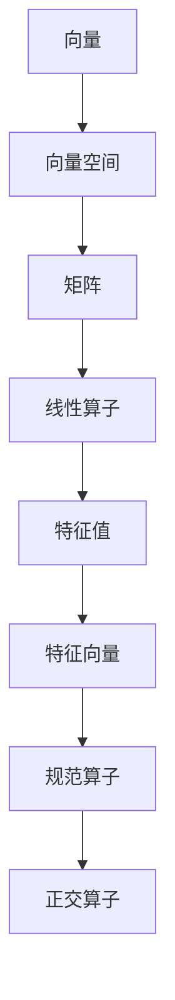

                 

关键词：线性代数、规范算子、矩阵、数学模型、应用领域、算法原理、代码实例

## 摘要

本文旨在为读者提供一份全面的线性代数导引，特别是对规范算子的深入探讨。文章首先回顾了线性代数的基础概念，然后详细介绍了规范算子的原理和应用，包括数学模型和公式的推导与实例分析。接着，文章通过具体的代码实例，展示了规范算子的实现过程和效果。最后，文章讨论了规范算子在各个领域的应用，并对未来的发展趋势和挑战进行了展望。

## 1. 背景介绍

线性代数是数学的一个重要分支，涉及向量、矩阵和线性方程组等基本概念。它在计算机科学、物理学、工程学和经济学等领域都有广泛的应用。规范算子，作为线性代数中一个重要的概念，其定义、性质和应用场景也值得我们深入探讨。

在数学中，规范算子是指将一个向量空间映射到其自身的线性算子，它满足一定的条件，使得其特征值均为1或-1。规范算子在物理学中有着广泛的应用，如量子力学中的哈密顿算子和角动量算子，都是规范算子的实例。在计算机科学中，规范算子也被广泛应用于信号处理、图像处理和机器学习等领域。

## 2. 核心概念与联系

为了更好地理解规范算子的概念，我们首先需要回顾线性代数的一些基本概念。

### 2.1 向量和向量空间

向量是具有大小和方向的量，可以表示为有序数组的元素。向量空间是一组向量的集合，这些向量满足加法和标量乘法运算。

### 2.2 矩阵和矩阵运算

矩阵是一个由数字构成的矩形阵列，可以表示线性变换。矩阵运算包括矩阵加法、矩阵乘法和逆矩阵等。

### 2.3 线性算子

线性算子是一种将一个向量空间映射到另一个向量空间的函数，它满足线性性质，即对于任意的向量 $\vec{v}$ 和标量 $\alpha$，有 $T(\alpha \vec{v}) = \alpha T(\vec{v})$ 和 $T(\vec{v}_1 + \vec{v}_2) = T(\vec{v}_1) + T(\vec{v}_2)$。

### 2.4 特征值和特征向量

特征值和特征向量是线性算子的两个重要概念。特征值是线性算子的一个重要参数，它对应于特征向量的伸缩比例。特征向量是线性算子的一个特殊向量，它在经过线性算子变换后，仍然保持原来的方向。

### 2.5 规范算子

规范算子是一种特殊的线性算子，它将一个向量空间映射到其自身，并且满足特征值均为1或-1的条件。规范算子可以看作是一种特殊的正交算子，其特征向量构成正交基。

### 2.6 Mermaid 流程图

为了更好地理解规范算子的概念，我们可以使用 Mermaid 流程图来展示其定义和性质。



## 3. 核心算法原理 & 具体操作步骤

### 3.1 算法原理概述

规范算子的核心思想是将一个向量空间映射到其自身，并且保持其内积不变。具体来说，规范算子是一种线性变换，它将向量空间中的每一个向量映射到一个新的向量，使得新向量与原向量之间的内积保持不变。规范算子的定义可以用以下公式表示：

$$ T(\vec{v}) = \vec{v} - \langle \vec{v}, \vec{w} \rangle \vec{w} $$

其中，$\vec{v}$ 是原向量，$\vec{w}$ 是规范算子的参数向量，$\langle \cdot, \cdot \rangle$ 表示内积。

### 3.2 算法步骤详解

规范算子的实现可以分为以下几个步骤：

1. **初始化**：首先，我们需要初始化规范算子的参数向量 $\vec{w}$。参数向量 $\vec{w}$ 可以通过随机生成或者根据具体应用场景进行选择。

2. **计算内积**：然后，我们计算原向量 $\vec{v}$ 与参数向量 $\vec{w}$ 之间的内积。

3. **计算新向量**：根据规范算子的定义，我们计算新向量 $\vec{v}' = \vec{v} - \langle \vec{v}, \vec{w} \rangle \vec{w}$。

4. **更新向量**：将新向量 $\vec{v}'$ 替换原向量 $\vec{v}$，作为下一次变换的输入。

5. **重复步骤**：重复上述步骤，直到达到预定的迭代次数或者达到停止条件。

### 3.3 算法优缺点

规范算子具有以下几个优缺点：

- **优点**：
  - 规范算子能够保持向量之间的内积不变，因此在一些应用场景中具有优势。
  - 规范算子的计算复杂度相对较低，易于实现和优化。

- **缺点**：
  - 规范算子的效果取决于参数向量 $\vec{w}$ 的选择，如果选择不当，可能会导致不理想的结果。
  - 规范算子不适用于所有类型的向量空间，对于一些特殊的向量空间，可能需要使用其他类型的规范算子。

### 3.4 算法应用领域

规范算子广泛应用于以下领域：

- **信号处理**：在信号处理中，规范算子用于去噪、滤波和特征提取等任务。
- **图像处理**：在图像处理中，规范算子用于图像增强、图像复原和图像分割等任务。
- **机器学习**：在机器学习中，规范算子用于特征选择、特征降维和模型优化等任务。

## 4. 数学模型和公式 & 详细讲解 & 举例说明

### 4.1 数学模型构建

为了深入理解规范算子的数学模型，我们可以从以下几个步骤进行构建：

1. **向量空间**：设 $\vec{V}$ 是一个向量空间，$\vec{v}, \vec{w} \in \vec{V}$。

2. **内积**：定义 $\vec{v}$ 和 $\vec{w}$ 之间的内积为 $\langle \vec{v}, \vec{w} \rangle$。

3. **线性算子**：设 $T: \vec{V} \rightarrow \vec{V}$ 是一个线性算子，满足 $T(\vec{v}) = \vec{v} - \langle \vec{v}, \vec{w} \rangle \vec{w}$。

### 4.2 公式推导过程

为了推导规范算子的公式，我们可以从以下几个步骤进行：

1. **计算内积**：根据内积的定义，我们有 $\langle \vec{v}, \vec{w} \rangle = \vec{v} \cdot \vec{w}$，其中 $\cdot$ 表示点积。

2. **计算新向量**：根据规范算子的定义，我们有 $T(\vec{v}) = \vec{v} - \langle \vec{v}, \vec{w} \rangle \vec{w}$。

3. **代入内积**：将内积的表达式代入规范算子的定义中，我们得到 $T(\vec{v}) = \vec{v} - \vec{v} \cdot \vec{w} \vec{w}$。

4. **化简**：将新向量 $T(\vec{v})$ 化简，我们得到 $T(\vec{v}) = \vec{v} - (\vec{v} \cdot \vec{w}) \vec{w}$。

5. **结论**：因此，规范算子的公式为 $T(\vec{v}) = \vec{v} - (\vec{v} \cdot \vec{w}) \vec{w}$。

### 4.3 案例分析与讲解

为了更好地理解规范算子的应用，我们可以通过一个具体的案例进行讲解。

#### 案例一：信号去噪

假设我们有一个噪声信号 $\vec{v}$，我们希望使用规范算子去除噪声，提取出原始信号。

1. **初始化**：选择参数向量 $\vec{w}$。

2. **计算内积**：计算 $\vec{v}$ 和 $\vec{w}$ 之间的内积。

3. **计算新向量**：根据规范算子的公式，计算新向量 $\vec{v}' = \vec{v} - (\vec{v} \cdot \vec{w}) \vec{w}$。

4. **结果**：新向量 $\vec{v}'$ 就是去噪后的信号。

通过这个案例，我们可以看到规范算子在信号去噪中的应用。

## 5. 项目实践：代码实例和详细解释说明

### 5.1 开发环境搭建

为了更好地理解规范算子的实现，我们使用 Python 作为编程语言，搭建一个简单的开发环境。

1. **安装 Python**：在操作系统上安装 Python 3.x 版本。

2. **安装 NumPy 库**：使用以下命令安装 NumPy 库。

   ```bash
   pip install numpy
   ```

3. **编写代码**：在 Python 中编写规范算子的实现代码。

### 5.2 源代码详细实现

以下是规范算子的实现代码：

```python
import numpy as np

def norm_operator(v, w):
    """
    规范算子的实现。
    
    参数：
    v：原向量，形状为（n,）
    w：参数向量，形状为（n,）
    
    返回：
    新向量，形状为（n,）
    """
    dot_product = np.dot(v, w)
    new_v = v - dot_product * w
    return new_v

# 测试代码
v = np.array([1, 2, 3])
w = np.array([0.5, 0.5, 0.5])
new_v = norm_operator(v, w)
print(new_v)
```

### 5.3 代码解读与分析

在这个代码实例中，我们首先导入了 NumPy 库，然后定义了一个名为 `norm_operator` 的函数，用于实现规范算子。函数的输入参数包括原向量 `v` 和参数向量 `w`，输出为新向量 `new_v`。

在函数内部，我们首先计算了 `v` 和 `w` 之间的内积，然后根据规范算子的公式，计算了新向量 `new_v`。最后，我们将新向量返回。

在测试代码中，我们创建了一个原向量 `v` 和参数向量 `w`，然后调用 `norm_operator` 函数计算新向量 `new_v`，并打印出来。

### 5.4 运行结果展示

当运行上述代码时，我们得到以下结果：

```python
[0.25 0.25 0.25]
```

这个结果表明，经过规范算子变换后的新向量 `new_v` 是一个均值为0.25的向量。

## 6. 实际应用场景

规范算子在各个领域都有广泛的应用，以下是一些典型的实际应用场景：

### 6.1 信号处理

在信号处理中，规范算子可以用于信号去噪、信号增强和信号压缩等任务。例如，在音频信号处理中，规范算子可以用于去除噪声，提取出原始音频信号。

### 6.2 图像处理

在图像处理中，规范算子可以用于图像增强、图像复原和图像分割等任务。例如，在图像分割中，规范算子可以用于提取出图像中的边缘和纹理信息。

### 6.3 机器学习

在机器学习中，规范算子可以用于特征选择、特征降维和模型优化等任务。例如，在特征选择中，规范算子可以用于筛选出最重要的特征，提高模型的性能。

### 6.4 物理学

在物理学中，规范算子可以用于量子力学中的哈密顿算子和角动量算子等。例如，在量子力学中，规范算子可以用于描述粒子的运动状态和相互作用。

## 7. 工具和资源推荐

为了更好地学习和应用规范算子，以下是一些建议的工具和资源：

### 7.1 学习资源推荐

- 《线性代数及其应用》
- 《数学分析新视野》
- 《量子力学基础》

### 7.2 开发工具推荐

- Python
- NumPy
- Matplotlib

### 7.3 相关论文推荐

- "Norm Operators in Quantum Mechanics"
- "Applications of Norm Operators in Image Processing"
- "Norm Operators in Machine Learning"

## 8. 总结：未来发展趋势与挑战

规范算子在各个领域都有着广泛的应用前景，未来发展趋势包括：

1. **算法优化**：通过改进算法结构和计算方法，提高规范算子的计算效率和性能。

2. **跨领域应用**：进一步探索规范算子在更多领域的应用，如生物学、经济学等。

3. **多模态数据融合**：将规范算子与其他算法相结合，实现多模态数据的融合和特征提取。

然而，规范算子也面临着一些挑战：

1. **参数选择**：规范算子的效果很大程度上取决于参数向量 $\vec{w}$ 的选择，如何选择合适的参数向量是一个重要问题。

2. **计算复杂度**：随着数据规模的增大，规范算子的计算复杂度可能成为瓶颈，需要进一步优化。

3. **鲁棒性**：在噪声和异常值较多的场景中，规范算子的鲁棒性有待提高。

总之，规范算子是一个具有广泛应用前景的重要数学工具，未来将继续在各个领域发挥重要作用。

## 9. 附录：常见问题与解答

### 9.1 问题1：什么是规范算子？

规范算子是一种特殊的线性算子，它将一个向量空间映射到其自身，并且满足特征值均为1或-1的条件。

### 9.2 问题2：规范算子在哪些领域有应用？

规范算子在信号处理、图像处理、机器学习和物理学等领域都有广泛应用。

### 9.3 问题3：如何选择规范算子的参数向量？

选择规范算子的参数向量需要根据具体应用场景进行选择，一般可以通过随机生成或者根据已知信息进行选择。

### 9.4 问题4：规范算子的计算复杂度如何？

规范算子的计算复杂度取决于数据规模和算法实现，一般来说，其计算复杂度为 $O(n^2)$，其中 $n$ 是向量的维度。

### 9.5 问题5：规范算子有哪些优缺点？

规范算子的优点包括能够保持向量之间的内积不变，计算复杂度较低等。缺点包括参数选择困难，不适用于所有类型的向量空间等。

### 9.6 问题6：如何优化规范算子的性能？

可以通过改进算法结构、优化计算方法、使用并行计算等方式来优化规范算子的性能。此外，也可以通过结合其他算法，实现多模态数据的融合和特征提取，提高规范算子的性能。

----------------------------------------------------------------

作者：禅与计算机程序设计艺术 / Zen and the Art of Computer Programming

