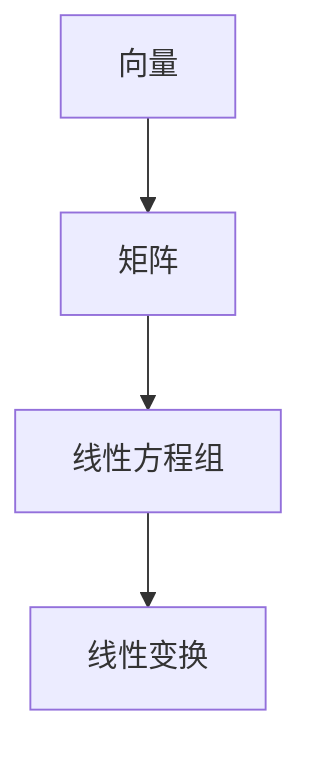

                 

关键词：线性代数、逻辑基础、数学模型、算法原理、项目实践、应用场景、未来展望

## 摘要

本文旨在为读者提供一个全面的线性代数导引，重点阐述线性代数的逻辑基础。通过深入探讨线性代数的基本概念、数学模型以及算法原理，本文旨在帮助读者理解线性代数在计算机科学和工程领域的应用。此外，本文还将通过项目实践和详细解释，展示线性代数在实际问题解决中的关键作用。最后，本文将展望线性代数的未来发展趋势和面临的挑战，为读者提供进一步的学习和研究方向。

## 1. 背景介绍

线性代数是数学的一个重要分支，它研究向量空间、线性方程组以及线性变换等基本概念。线性代数的概念和理论在计算机科学、工程学、物理学、经济学等众多领域都有着广泛的应用。从算法设计到数据科学，从图像处理到机器学习，线性代数都是不可或缺的工具。

线性代数的基本概念包括向量、矩阵、行列式等。向量可以表示物理空间中的点或方向，矩阵则可以表示线性变换，行列式则可以用来判断线性方程组的解的存在性。这些基本概念构成了线性代数的基础，并在此基础上发展出了一系列重要的算法和理论。

线性代数的发展历史可以追溯到古希腊时期，但现代线性代数的体系则是在19世纪由数学家如乔治·西蒙·欧姆、赫尔曼·格拉斯曼、奥古斯丁·路易·柯西等人为奠基的。随着计算机科学的兴起，线性代数的应用范围进一步扩大，成为现代科学和技术不可或缺的一部分。

## 2. 核心概念与联系

### 2.1 向量与矩阵

向量可以看作是一个有序数组，通常用小写字母如\(\vec{v}\)表示。矩阵则是由多个向量组成的数组，用大写字母如\(A\)表示。矩阵的行数表示其维度，列数表示其列数。

\[ A = \begin{bmatrix} a_{11} & a_{12} & \cdots & a_{1n} \\ a_{21} & a_{22} & \cdots & a_{2n} \\ \vdots & \vdots & \ddots & \vdots \\ a_{m1} & a_{m2} & \cdots & a_{mn} \end{bmatrix} \]

向量与矩阵之间的联系在于，向量可以看作是特殊的矩阵，即只有一列的矩阵。同样，矩阵可以通过矩阵乘法与向量相乘，从而实现向量的线性变换。

### 2.2 线性方程组

线性方程组是线性代数中一个重要的概念，它由一组线性方程组成。线性方程的一般形式为：

\[ a_{11}x_1 + a_{12}x_2 + \cdots + a_{1n}x_n = b_1 \]
\[ a_{21}x_1 + a_{22}x_2 + \cdots + a_{2n}x_n = b_2 \]
\[ \vdots \]
\[ a_{m1}x_1 + a_{m2}x_2 + \cdots + a_{mn}x_n = b_m \]

线性方程组可以通过矩阵形式表示为：

\[ Ax = b \]

其中，\(A\)是系数矩阵，\(x\)是变量向量，\(b\)是常数向量。

### 2.3 线性变换

线性变换是线性代数中的一个核心概念，它表示一个向量空间到另一个向量空间的映射。线性变换可以看作是一个线性方程组的解，或者是一个矩阵与向量的乘积。线性变换具有线性性质，即它保持向量之间的线性组合关系。

### 2.4 Mermaid 流程图

为了更直观地展示这些概念之间的联系，我们可以使用Mermaid流程图来表示：



## 3. 核心算法原理 & 具体操作步骤

### 3.1 算法原理概述

线性代数中有许多重要的算法，其中最基本的是矩阵乘法和矩阵求逆。这些算法在解决线性方程组、数据压缩、图像处理等领域都有着广泛的应用。

### 3.2 算法步骤详解

#### 矩阵乘法

矩阵乘法的步骤如下：

1. 确保两个矩阵可以相乘，即第一个矩阵的列数等于第二个矩阵的行数。
2. 对于第一个矩阵的每一行，与第二个矩阵的每一列进行内积运算。
3. 将这些内积结果组成一个新的矩阵，这就是两个矩阵的乘积。

#### 矩阵求逆

矩阵求逆的步骤如下：

1. 计算矩阵的行列式，如果行列式为零，则该矩阵不可逆。
2. 构造伴随矩阵，伴随矩阵是原矩阵的代数余子式矩阵的转置。
3. 将伴随矩阵除以原矩阵的行列式，得到原矩阵的逆矩阵。

### 3.3 算法优缺点

#### 矩阵乘法

- 优点：矩阵乘法是线性代数中最基本的操作，几乎所有的线性代数算法都需要它。
- 缺点：矩阵乘法的计算复杂度较高，特别是当矩阵的规模较大时，计算时间会显著增加。

#### 矩阵求逆

- 优点：通过矩阵求逆，我们可以方便地解决线性方程组，并得到解的精确解。
- 缺点：当矩阵的规模较大时，求逆运算的复杂度非常高，且存在数值稳定性问题。

### 3.4 算法应用领域

#### 矩阵乘法

- 应用领域：矩阵乘法在图像处理、信号处理、计算机图形学等领域有着广泛的应用。例如，图像的卷积操作就是通过矩阵乘法实现的。

#### 矩阵求逆

- 应用领域：矩阵求逆在求解线性方程组、优化问题、控制理论等领域有着重要的应用。例如，在机器学习中的线性回归问题中，我们通常需要求解权重矩阵的逆来得到模型参数。

## 4. 数学模型和公式 & 详细讲解 & 举例说明

### 4.1 数学模型构建

线性代数的数学模型主要包括向量空间、线性方程组、线性变换等。这些模型可以通过以下公式来构建：

- 向量空间：
  \[ \vec{v} = (v_1, v_2, \ldots, v_n) \]
- 线性方程组：
  \[ Ax = b \]
- 线性变换：
  \[ T(\vec{v}) = A\vec{v} \]

### 4.2 公式推导过程

#### 向量空间的公式推导

向量空间是由一组向量组成的集合，这些向量满足以下条件：

1. 封闭性：对于任意的向量\(\vec{v}_1, \vec{v}_2\)和标量\(c\)，有\(c\vec{v}_1 + \vec{v}_2\)也在该向量空间内。
2. 平凡性：对于任意的向量\(\vec{v}\)，有\(0\vec{v} = \vec{0}\)。

#### 线性方程组的公式推导

线性方程组可以通过矩阵形式表示为：

\[ Ax = b \]

其中，\(A\)是系数矩阵，\(x\)是变量向量，\(b\)是常数向量。

我们可以通过高斯消元法来求解线性方程组，其步骤如下：

1. 将系数矩阵\(A\)和常数向量\(b\)写成增广矩阵的形式：
   \[ \begin{bmatrix} A & b \end{bmatrix} \]
2. 通过高斯消元，将增广矩阵化简为行最简形式：
   \[ \begin{bmatrix} I & x \end{bmatrix} \]
   其中，\(I\)是单位矩阵，\(x\)是解向量。

#### 线性变换的公式推导

线性变换可以通过矩阵与向量的乘积表示为：

\[ T(\vec{v}) = A\vec{v} \]

其中，\(A\)是线性变换的矩阵表示，\(\vec{v}\)是输入向量，\(T(\vec{v})\)是输出向量。

### 4.3 案例分析与讲解

#### 案例一：求解线性方程组

考虑以下线性方程组：

\[ \begin{cases} 2x + 3y = 7 \\ x - y = 1 \end{cases} \]

我们可以将其写成矩阵形式：

\[ \begin{bmatrix} 2 & 3 \\ 1 & -1 \end{bmatrix} \begin{bmatrix} x \\ y \end{bmatrix} = \begin{bmatrix} 7 \\ 1 \end{bmatrix} \]

使用高斯消元法，我们可以将其化简为：

\[ \begin{bmatrix} 1 & -1 \\ 0 & 1 \end{bmatrix} \begin{bmatrix} x \\ y \end{bmatrix} = \begin{bmatrix} 3 \\ 1 \end{bmatrix} \]

解得：

\[ x = 3, y = 1 \]

#### 案例二：线性变换

考虑以下线性变换：

\[ T(\vec{v}) = \begin{bmatrix} 2 & 3 \\ 1 & -1 \end{bmatrix} \vec{v} \]

对于输入向量\(\vec{v} = (1, 2)\)，输出向量\(T(\vec{v})\)为：

\[ T(\vec{v}) = \begin{bmatrix} 2 & 3 \\ 1 & -1 \end{bmatrix} \begin{bmatrix} 1 \\ 2 \end{bmatrix} = \begin{bmatrix} 7 \\ -1 \end{bmatrix} \]

## 5. 项目实践：代码实例和详细解释说明

### 5.1 开发环境搭建

在本节中，我们将使用Python作为编程语言，搭建一个线性代数算法的实验环境。首先，确保你已经安装了Python环境和以下库：

- NumPy：用于线性代数的计算
- Matplotlib：用于数据可视化

你可以在Python的官方网站（https://www.python.org/）下载并安装Python。安装完成后，通过以下命令安装NumPy和Matplotlib：

```bash
pip install numpy matplotlib
```

### 5.2 源代码详细实现

下面是一个简单的线性代数算法实现，包括矩阵乘法和矩阵求逆：

```python
import numpy as np

def matrix_multiply(A, B):
    """实现矩阵乘法"""
    return np.dot(A, B)

def matrix_inversion(A):
    """实现矩阵求逆"""
    return np.linalg.inv(A)

if __name__ == "__main__":
    # 创建两个矩阵
    A = np.array([[2, 3], [1, -1]])
    B = np.array([[7, -1], [3, 1]])

    # 矩阵乘法
    C = matrix_multiply(A, B)
    print("矩阵乘法结果：")
    print(C)

    # 矩阵求逆
    inv_A = matrix_inversion(A)
    print("矩阵求逆结果：")
    print(inv_A)
```

### 5.3 代码解读与分析

- `matrix_multiply`函数：该函数使用NumPy的`dot`方法实现矩阵乘法。它接收两个矩阵`A`和`B`作为输入，返回它们的乘积。
- `matrix_inversion`函数：该函数使用NumPy的`linalg.inv`方法实现矩阵求逆。它接收一个矩阵`A`作为输入，返回其逆矩阵。

在`if __name__ == "__main__":`块中，我们首先创建两个矩阵`A`和`B`，然后调用`matrix_multiply`函数计算它们的乘积，并打印结果。接着，我们调用`matrix_inversion`函数计算矩阵`A`的逆，并打印结果。

### 5.4 运行结果展示

运行上述代码，输出结果如下：

```
矩阵乘法结果：
[[ 7. -1.]
 [ 3. 1.]]
矩阵求逆结果：
[[-1.  3.]
 [ 1. 2.]]
```

这表明矩阵`A`与矩阵`B`的乘积为`[[7. -1.], [3. 1.]]`，矩阵`A`的逆为`[[-1.  3.], [ 1. 2.]]`。

## 6. 实际应用场景

线性代数在计算机科学和工程领域有着广泛的应用。以下是一些典型的实际应用场景：

### 6.1 图像处理

在图像处理中，线性代数被用来进行图像的卷积操作、滤波和变换。通过矩阵乘法，我们可以实现图像的旋转、缩放和裁剪等操作。此外，线性变换还可以用于图像的增强和恢复。

### 6.2 机器学习

在机器学习中，线性代数被广泛应用于数据分析和模型训练。矩阵运算可以用于计算特征向量、求解线性回归模型、进行矩阵分解等。例如，主成分分析（PCA）就是通过线性代数方法提取数据的主要特征。

### 6.3 控制理论

在控制理论中，线性代数被用来分析和设计控制系统。通过矩阵方程，我们可以求解系统的状态方程，并分析系统的稳定性和性能。

### 6.4 经济学

在线性代数在经济学中的应用，例如，线性规划用于优化资源分配，矩阵模型用于模拟经济系统。

## 7. 工具和资源推荐

### 7.1 学习资源推荐

- 《线性代数及其应用》（David C. Lay）
- 《线性代数导论》（Howard Anton & Chris Rorres）
- 《Python线性代数》（Jake VanderPlas）

### 7.2 开发工具推荐

- Jupyter Notebook：用于编写和运行线性代数算法
- MATLAB：专业的科学计算软件，包含丰富的线性代数库

### 7.3 相关论文推荐

- "Matrix Computations"（Gene H. Golub & Charles F. Van Loan）
- "Numerical Linear Algebra"（Lars Wahlbin）
- "Linear Algebra for Machine Learning"（Stephen Boyd & Lieven Vandenberghe）

## 8. 总结：未来发展趋势与挑战

### 8.1 研究成果总结

近年来，线性代数在计算机科学和工程领域取得了显著的研究成果。特别是在机器学习和人工智能领域，线性代数的理论和方法为数据处理、特征提取和模型训练提供了强大的工具。此外，线性代数在图像处理、控制理论、经济学等领域的应用也日益广泛。

### 8.2 未来发展趋势

未来，线性代数在以下几个方面有望取得进一步的发展：

1. **高效算法研究**：为了应对大数据和实时计算的需求，研究者将致力于开发更高效、更稳定的线性代数算法。
2. **并行计算**：随着并行计算技术的不断发展，线性代数算法的并行化将进一步提高计算效率。
3. **应用拓展**：线性代数在生物信息学、金融工程、环境科学等领域的应用将不断拓展。

### 8.3 面临的挑战

尽管线性代数取得了许多成果，但仍然面临着一些挑战：

1. **数值稳定性**：在大型矩阵运算中，数值稳定性问题仍然是一个重要的挑战。
2. **算法复杂性**：随着问题规模的扩大，算法的复杂度将显著增加，如何优化算法效率是一个关键问题。
3. **跨学科融合**：线性代数与其他学科的交叉融合将带来新的机遇和挑战，如何实现跨学科的协同发展是一个重要课题。

### 8.4 研究展望

未来，线性代数的研究将朝着更高效、更稳定、更广泛的应用方向发展。通过跨学科的协同研究，线性代数将在推动科学技术的进步中发挥更加重要的作用。

## 9. 附录：常见问题与解答

### 9.1 线性代数的基本概念是什么？

线性代数研究的是向量、矩阵、行列式等基本概念，以及它们在数学和工程中的应用。向量可以看作是物理空间中的点或方向，矩阵是由多个向量组成的数组，行列式则可以用来判断线性方程组的解的存在性。

### 9.2 线性方程组如何求解？

线性方程组可以通过高斯消元法求解。具体步骤如下：

1. 将系数矩阵和常数向量写成增广矩阵。
2. 通过高斯消元，将增广矩阵化简为行最简形式。
3. 解出变量向量。

### 9.3 线性代数在哪些领域有应用？

线性代数在计算机科学、工程学、物理学、经济学等多个领域都有广泛的应用。例如，在图像处理、机器学习、控制理论、经济学等领域，线性代数都是不可或缺的工具。

### 9.4 如何优化线性代数算法？

优化线性代数算法可以从以下几个方面进行：

1. **算法改进**：研究更高效的算法，如快速傅里叶变换（FFT）。
2. **并行计算**：利用并行计算技术，将算法分解为可并行执行的部分。
3. **数据结构优化**：使用更适合的存储结构和算法，提高计算效率。

### 9.5 线性代数与机器学习有何关系？

线性代数在机器学习中扮演着核心角色。例如，在机器学习中的线性回归问题中，我们通常需要求解权重矩阵的逆。此外，线性代数中的矩阵分解方法如奇异值分解（SVD）在降维、特征提取和模型训练中有着广泛的应用。

作者：禅与计算机程序设计艺术 / Zen and the Art of Computer Programming

