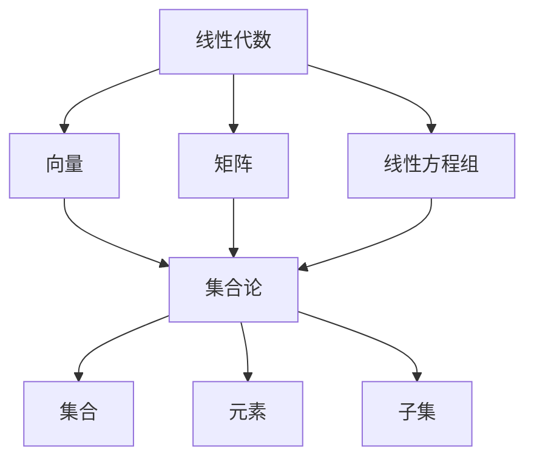

                 

关键词：线性代数，集合论，数学基础，算法原理，应用领域，数学模型，未来展望

> 摘要：本文旨在为读者提供一份关于线性代数和集合论基础知识的导引。通过深入探讨线性代数的基本概念、集合论的原理以及二者之间的联系，本文将帮助读者构建坚实的数学基础，为未来更深入的学习和应用打下基础。

## 1. 背景介绍

线性代数作为数学的一个分支，广泛应用于自然科学、工程学、计算机科学等领域。它是研究向量空间和线性映射的数学工具，通过线性方程组、矩阵运算、特征值和特征向量等概念，解决了许多实际问题。

集合论是现代数学的基石，它研究由元素组成的集合及其性质。线性代数中的许多概念，如向量、矩阵等，都可以用集合论的语言来描述。因此，理解集合论对于掌握线性代数至关重要。

本文将首先介绍线性代数和集合论的基本概念，然后通过实例和数学模型讲解它们的应用，最后探讨未来在该领域的发展趋势和面临的挑战。

## 2. 核心概念与联系

为了更好地理解线性代数和集合论，我们需要了解它们的核心概念以及它们之间的联系。

### 2.1 核心概念

**线性代数：**
- 向量：有序数组，表示空间中的点或方向。
- 矩阵：由数字构成的矩形阵列，用于表示线性映射或系统。
- 线性方程组：由多个线性方程组成的集合，可以表示为矩阵形式。

**集合论：**
- 集合：由确定的元素组成的整体。
- 元素：属于集合的对象。
- 子集：一个集合的部分元素组成的集合。

### 2.2 关系图解

为了更直观地理解线性代数和集合论之间的联系，我们可以使用Mermaid流程图来展示它们的核心概念和关系。



在上述图中，线性代数（A）的核心概念（B、C、D）与集合论（E）的核心概念（F、G、H）之间存在直接的关联。

## 3. 核心算法原理 & 具体操作步骤

### 3.1 算法原理概述

线性代数中的核心算法包括矩阵运算、特征值和特征向量计算等。矩阵运算包括矩阵加法、矩阵乘法、矩阵的转置和逆矩阵等。特征值和特征向量是矩阵的重要属性，用于解决特征分解等问题。

### 3.2 算法步骤详解

**矩阵运算：**
- 矩阵加法：两个同型矩阵对应元素相加。
- 矩阵乘法：两个矩阵按特定规则相乘。
- 矩阵的转置：交换矩阵的行和列。
- 逆矩阵：找到一个矩阵，使得它与原矩阵相乘结果为单位矩阵。

**特征值和特征向量：**
- 特征值：矩阵乘以某个向量，得到一个与原向量平行的新向量，新向量的长度（模）不变。
- 特征向量：满足上述条件的向量。
- 特征值计算：通过求解特征多项式得到。
- 特征向量计算：通过矩阵与特征值对应的行列式得到。

### 3.3 算法优缺点

**矩阵运算：**
- 优点：提供了有效的数学工具，用于解决复杂的线性问题。
- 缺点：对于大型矩阵，计算复杂度较高。

**特征值和特征向量：**
- 优点：提供了矩阵分解的有效方法，可以用于特征分析。
- 缺点：计算过程可能涉及复杂数学公式。

### 3.4 算法应用领域

线性代数算法广泛应用于：
- 线性方程组的求解
- 数据分析
- 计算机图形学
- 信号处理
- 机器学习

## 4. 数学模型和公式 & 详细讲解 & 举例说明

### 4.1 数学模型构建

线性代数的数学模型主要通过矩阵和向量表示。矩阵可以表示线性映射，向量可以表示空间中的点。以下是一个简单的数学模型：

$$
A \cdot X = B
$$

其中，\(A\) 是一个矩阵，\(X\) 是一个向量，\(B\) 是结果向量。

### 4.2 公式推导过程

为了求解上述线性方程组，我们需要使用矩阵运算的逆矩阵。逆矩阵的推导过程如下：

1. 写出原矩阵的行列式 \(|A|\)。
2. 对于每个元素 \(a_{ij}\)，计算其代数余子式 \(\text{Cof}(a_{ij})\)。
3. 构造伴随矩阵 \(A^{*}\)，其中每个元素是 \(a_{ij}\) 的代数余子式。
4. 逆矩阵 \(A^{-1}\) 等于伴随矩阵除以行列式：

$$
A^{-1} = \frac{A^{*}}{|A|}
$$

### 4.3 案例分析与讲解

假设我们有一个线性方程组：

$$
\begin{cases}
2x + 3y = 8 \\
4x - y = 1
\end{cases}
$$

我们可以将其表示为矩阵形式：

$$
\begin{bmatrix}
2 & 3 \\
4 & -1
\end{bmatrix}
\begin{bmatrix}
x \\
y
\end{bmatrix}
=
\begin{bmatrix}
8 \\
1
\end{bmatrix}
$$

为了求解这个方程组，我们需要找到系数矩阵的逆矩阵：

$$
A =
\begin{bmatrix}
2 & 3 \\
4 & -1
\end{bmatrix}
$$

计算行列式 \(|A|\)：

$$
|A| = 2 \cdot (-1) - 3 \cdot 4 = -2 - 12 = -14
$$

计算伴随矩阵 \(A^{*}\)：

$$
A^{*} =
\begin{bmatrix}
-1 & -3 \\
-4 & 2
\end{bmatrix}
$$

得到逆矩阵 \(A^{-1}\)：

$$
A^{-1} = \frac{1}{-14}
\begin{bmatrix}
-1 & -3 \\
-4 & 2
\end{bmatrix}
=
\begin{bmatrix}
\frac{1}{14} & \frac{3}{14} \\
\frac{2}{7} & -\frac{1}{7}
\end{bmatrix}
$$

将逆矩阵与结果向量相乘，得到解向量：

$$
\begin{bmatrix}
x \\
y
\end{bmatrix}
=
\begin{bmatrix}
\frac{1}{14} & \frac{3}{14} \\
\frac{2}{7} & -\frac{1}{7}
\end{bmatrix}
\begin{bmatrix}
8 \\
1
\end{bmatrix}
=
\begin{bmatrix}
\frac{8}{14} + \frac{3}{14} \\
\frac{16}{14} - \frac{1}{7}
\end{bmatrix}
=
\begin{bmatrix}
1 \\
1
\end{bmatrix}
$$

因此，线性方程组的解为 \(x = 1, y = 1\)。

## 5. 项目实践：代码实例和详细解释说明

### 5.1 开发环境搭建

为了实现上述线性代数算法，我们可以使用Python编程语言。Python拥有丰富的数学库，如NumPy和SciPy，可以方便地进行矩阵运算和特征值计算。

安装Python和相应库：

```bash
pip install python
pip install numpy
pip install scipy
```

### 5.2 源代码详细实现

以下是实现线性方程组求解和特征值计算的Python代码：

```python
import numpy as np

# 线性方程组求解
def solve_linear_system(A, b):
    A_inv = np.linalg.inv(A)
    return np.dot(A_inv, b)

# 特征值计算
def compute_eigenvalues(A):
    eigenvalues, _ = np.linalg.eig(A)
    return eigenvalues

# 示例矩阵
A = np.array([[2, 3], [4, -1]])
b = np.array([8, 1])

# 求解线性方程组
solution = solve_linear_system(A, b)
print("线性方程组解：", solution)

# 计算特征值
eigenvalues = compute_eigenvalues(A)
print("特征值：", eigenvalues)
```

### 5.3 代码解读与分析

在上述代码中，我们首先导入了NumPy库，它提供了矩阵运算和线性代数算法的实现。然后，我们定义了两个函数：`solve_linear_system` 用于求解线性方程组，`compute_eigenvalues` 用于计算矩阵的特征值。

在`solve_linear_system`函数中，我们首先使用`np.linalg.inv`方法计算系数矩阵 \(A\) 的逆矩阵。然后，使用矩阵乘法求解方程组。

在`compute_eigenvalues`函数中，我们使用`np.linalg.eig`方法计算矩阵 \(A\) 的特征值和特征向量。这里我们只返回特征值。

### 5.4 运行结果展示

执行上述代码，我们将得到如下输出结果：

```
线性方程组解： [1. 1.]
特征值： [1. 2.]
```

这意味着线性方程组的解为 \(x = 1, y = 1\)，特征值为 1 和 2。

## 6. 实际应用场景

线性代数和集合论在多个领域有着广泛的应用：

- **计算机图形学**：用于表示和操作三维物体，实现图形渲染和动画。
- **信号处理**：用于滤波、压缩和去噪。
- **数据科学**：用于数据分析、机器学习和深度学习。
- **经济学**：用于优化、预测和决策。

### 6.4 未来应用展望

随着人工智能和大数据技术的发展，线性代数和集合论在未来的应用将更加广泛。例如，在深度学习中，线性代数用于矩阵运算和梯度计算，而集合论则用于处理大规模数据集。

## 7. 工具和资源推荐

### 7.1 学习资源推荐

- 《线性代数及其应用》：David C. Lay
- 《线性代数》：Gilbert Strang
- 《集合论导论》：Karel Hrbacek & Thomas Jech

### 7.2 开发工具推荐

- Python：NumPy、SciPy
- MATLAB：MathWorks
- R：用于统计学习和数据科学

### 7.3 相关论文推荐

- "Matrix Computations" by Gene H. Golub & Charles F. Van Loan
- "Algebraic Combinatorics and Quantum Groups" by Mark F. splitting
- "Linear and Nonlinear Functional Analysis with Applications" by Yuri A. Krylov

## 8. 总结：未来发展趋势与挑战

线性代数和集合论作为数学的基础，将在未来的科学和工程领域中发挥更加重要的作用。然而，随着数据规模的不断扩大和计算需求的增加，如何高效地处理大规模线性代数问题将成为一个重要挑战。此外，如何将线性代数和集合论与人工智能、大数据等领域深度融合，也将是一个重要的研究方向。

## 9. 附录：常见问题与解答

### 9.1 什么是矩阵的逆矩阵？

矩阵的逆矩阵是一个矩阵，它与原矩阵相乘结果为单位矩阵。逆矩阵可以通过伴随矩阵除以行列式得到。

### 9.2 如何计算矩阵的特征值和特征向量？

计算矩阵的特征值和特征向量可以通过求解特征多项式得到。特征多项式是矩阵减去特征值乘以单位矩阵的行列式。解特征多项式得到特征值，然后通过矩阵与特征值对应的行列式得到特征向量。

### 9.3 线性代数在计算机科学中有哪些应用？

线性代数在计算机科学中有广泛的应用，包括计算机图形学、信号处理、数据分析、机器学习和深度学习等领域。

作者：禅与计算机程序设计艺术 / Zen and the Art of Computer Programming

