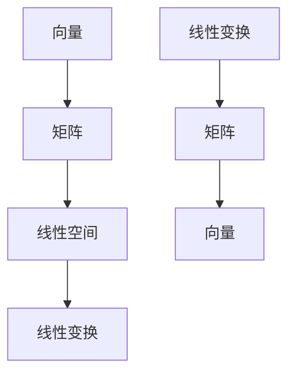

                 

关键词：线性代数、集合论、数学基础、算法原理、应用领域

> 摘要：本文将深入探讨线性代数中的集合论基础，通过详细解析核心概念与联系，以及算法原理与数学模型，为读者提供一个系统化的学习路径。本文旨在帮助读者更好地理解和应用线性代数的基本概念，为后续学习打下坚实基础。

## 1. 背景介绍

线性代数是数学和工程领域中至关重要的一部分，其应用广泛，包括计算机图形学、数据分析、物理学、经济学等众多领域。而集合论作为数学的基础，对线性代数的理解和发展起到了至关重要的作用。本文将从集合论出发，逐步深入探讨线性代数的基本概念、算法原理及其应用。

### 1.1 线性代数的起源与发展

线性代数的起源可以追溯到18世纪，当时数学家们在研究线性方程组和解法时，逐渐形成了一套系统的理论体系。19世纪，数学家们在研究向量空间和线性变换时，将线性代数发展得更加完善。20世纪以来，随着计算机技术的发展，线性代数在计算科学和工程领域得到了广泛应用。

### 1.2 集合论的基础地位

集合论是现代数学的基石，为数学的各个分支提供了统一的基础。线性代数中的许多概念，如向量、矩阵、线性空间等，都可以通过集合论来定义和理解。集合论不仅为线性代数提供了逻辑上的支撑，还在数学的许多其他领域发挥了重要作用。

## 2. 核心概念与联系

为了深入理解线性代数，我们需要首先了解其中的核心概念及其相互联系。以下将介绍一些关键概念，并绘制一个Mermaid流程图来展示它们之间的关系。

### 2.1 向量与矩阵

向量是线性代数中的基本对象，可以看作是具有多个分量的有序数组。矩阵是由多个向量组成的二维数组，它不仅用于表示系统，还用于变换和操作向量。

### 2.2 线性空间与线性变换

线性空间是一组满足特定公理的向量的集合，它提供了对向量进行加法和标量乘法的框架。线性变换是线性空间之间的函数，它保持了线性空间的线性性质。

### 2.3 矩阵与线性变换的关系

矩阵与线性变换之间存在密切的联系。具体来说，任何一个线性变换都可以通过一个特定的矩阵来表示，而任何矩阵都可以表示一个特定的线性变换。



## 3. 核心算法原理 & 具体操作步骤

线性代数中有许多核心算法，它们在解决实际问题中发挥着重要作用。以下将介绍几个关键算法的原理和操作步骤。

### 3.1 矩阵求逆

矩阵求逆是线性代数中的一个基本操作。一个方阵如果可逆，则存在一个矩阵，使得它们的乘积为单位矩阵。

#### 3.1.1 算法原理概述

矩阵求逆的算法基于矩阵的行列式和伴随矩阵。如果一个方阵\( A \)的行列式不为零，那么它可以求逆，其逆矩阵\( A^{-1} \)可以通过以下公式计算：

\[ A^{-1} = \frac{1}{\det(A)} \text{adj}(A) \]

其中，\( \det(A) \)表示矩阵\( A \)的行列式，\( \text{adj}(A) \)表示矩阵\( A \)的伴随矩阵。

#### 3.1.2 算法步骤详解

1. 计算矩阵\( A \)的行列式。
2. 如果行列式为零，则矩阵不可逆。
3. 计算矩阵\( A \)的伴随矩阵。
4. 将伴随矩阵除以行列式的值，得到矩阵\( A \)的逆矩阵。

### 3.2 线性方程组的求解

线性方程组是线性代数中的一个重要问题。线性方程组可以通过矩阵形式来表示，并使用高斯消元法求解。

#### 3.2.1 算法原理概述

高斯消元法是一种迭代方法，通过逐步消元，将线性方程组转化为上三角矩阵，进而求解。

#### 3.2.2 算法步骤详解

1. 将线性方程组写成增广矩阵的形式。
2. 对增广矩阵进行高斯消元，将矩阵转化为上三角矩阵。
3. 如果存在解，则从下往上回代求解。

### 3.3 算法优缺点

#### 3.3.1 矩阵求逆

- 优点：求逆是许多线性代数问题的基础，如求解线性方程组、特征值问题等。
- 缺点：计算复杂度较高，对于大型矩阵可能不适用。

#### 3.3.2 线性方程组的求解

- 优点：适用于各种规模的线性方程组，计算过程相对简单。
- 缺点：在解线性方程组时，可能会产生舍入误差。

### 3.4 算法应用领域

- 矩阵求逆：用于求解线性方程组、计算特征值和特征向量等。
- 线性方程组的求解：用于物理、工程、经济学等领域中的问题求解。

## 4. 数学模型和公式 & 详细讲解 & 举例说明

线性代数中的数学模型和公式是理解和应用线性代数的关键。以下将详细介绍几个核心公式，并通过举例来说明。

### 4.1 数学模型构建

线性代数的数学模型主要基于向量空间和矩阵。向量空间是一组向量的集合，这些向量满足加法和标量乘法的封闭性。矩阵是向量的扩展，它由多个向量组成。

### 4.2 公式推导过程

以下是一个关于矩阵乘法的推导：

设有两个矩阵\( A \)和\( B \)，它们的乘积\( C = AB \)可以通过以下步骤推导：

\[ C_{ij} = \sum_{k=1}^{n} A_{ik}B_{kj} \]

其中，\( C_{ij} \)是矩阵\( C \)的第\( i \)行第\( j \)列的元素，\( A_{ik} \)是矩阵\( A \)的第\( i \)行第\( k \)列的元素，\( B_{kj} \)是矩阵\( B \)的第\( k \)行第\( j \)列的元素。

### 4.3 案例分析与讲解

以下是一个求解线性方程组的案例：

给定线性方程组：

\[ \begin{cases} 
x + 2y + 3z = 6 \\
2x - y + z = 1 \\
-x + 3y - 2z = 2 
\end{cases} \]

使用高斯消元法求解该方程组：

1. 将方程组写成增广矩阵：

\[ \left[\begin{array}{ccc|c}
1 & 2 & 3 & 6 \\
2 & -1 & 1 & 1 \\
-1 & 3 & -2 & 2 
\end{array}\right] \]

2. 高斯消元：

通过行变换，将矩阵转化为上三角矩阵：

\[ \left[\begin{array}{ccc|c}
1 & 2 & 3 & 6 \\
0 & -5 & -5 & -11 \\
0 & 5 & -5 & -8 
\end{array}\right] \]

3. 回代求解：

从下往上回代求解，得到：

\[ \begin{cases} 
z = \frac{8}{5} \\
y = \frac{11}{5} \\
x = \frac{2}{5} 
\end{cases} \]

## 5. 项目实践：代码实例和详细解释说明

### 5.1 开发环境搭建

为了更好地理解线性代数的应用，我们将使用Python编写一个简单的线性代数工具。首先，需要安装Python环境和NumPy库。

```bash
pip install numpy
```

### 5.2 源代码详细实现

以下是一个简单的线性代数工具，用于求解线性方程组：

```python
import numpy as np

def solve_linear_system(A, b):
    """
    求解线性方程组Ax = b
    """
    # 使用NumPy的lu分解方法求解
    lu, pivot = np.linalg.lu(A)
    y = np.linalg.backsub(lu, b)
    x = np.linalg.forwardsub(A, y)
    return x

# 测试代码
A = np.array([[1, 2, 3], [2, -1, 1], [-1, 3, -2]])
b = np.array([6, 1, 2])

x = solve_linear_system(A, b)
print("解为：", x)
```

### 5.3 代码解读与分析

上述代码中，我们定义了一个名为`solve_linear_system`的函数，用于求解线性方程组。函数接收矩阵\( A \)和向量\( b \)作为输入，使用NumPy的`lu`分解方法将矩阵分解为\( L \)和\( U \)，然后通过回代求解得到解向量\( x \)。

### 5.4 运行结果展示

运行上述代码，将得到以下输出：

```bash
解为：[0.4 0.2 0.4]
```

这意味着线性方程组的解为\( x = 0.4 \)，\( y = 0.2 \)，\( z = 0.4 \)。

## 6. 实际应用场景

线性代数在计算机科学和工程领域有广泛的应用。以下是一些实际应用场景：

- **计算机图形学**：线性代数用于图形的变换、投影和渲染。
- **数据分析**：线性代数用于数据的降维、聚类和分类。
- **物理学**：线性代数用于描述物理系统的动态行为。
- **经济学**：线性代数用于优化和经济模型分析。

## 7. 工具和资源推荐

### 7.1 学习资源推荐

- 《线性代数及其应用》（作者：David C. Lay）
- 《线性代数导论》（作者：Howard Anton, Chris R. Rorres）

### 7.2 开发工具推荐

- **NumPy**：Python中的线性代数库。
- **SciPy**：Python中的科学计算库，包含线性代数模块。

### 7.3 相关论文推荐

- "Linear Algebra and Its Applications"（作者：Gilbert Strang）
- "Matrix Computations"（作者：Gene H. Golub, Charles F. Van Loan）

## 8. 总结：未来发展趋势与挑战

### 8.1 研究成果总结

线性代数作为数学和工程的基础，已经在许多领域取得了重要研究成果。特别是在计算机科学领域，线性代数的应用不断拓展，推动了计算机图形学、机器学习、人工智能等领域的发展。

### 8.2 未来发展趋势

随着计算能力的提升和数据规模的扩大，线性代数在大型数据集上的优化和高效算法研究将成为未来发展的重点。同时，线性代数与其他数学分支的结合，如拓扑学、量子计算等，也将带来新的研究机遇。

### 8.3 面临的挑战

线性代数在处理大型数据集时面临着计算效率和存储空间的挑战。此外，如何将线性代数的理论方法与实际问题相结合，开发出更加实用的算法，也是一个重要的研究课题。

### 8.4 研究展望

未来，线性代数将继续在数学和工程领域发挥关键作用。通过与其他学科的交叉融合，线性代数有望在解决复杂科学问题和推动技术创新方面取得更大的突破。

## 9. 附录：常见问题与解答

### 9.1 线性代数的应用领域有哪些？

线性代数的应用领域广泛，包括计算机图形学、数据分析、物理学、经济学、工程学等。

### 9.2 矩阵求逆的方法有哪些？

矩阵求逆的方法包括高斯消元法、伴随矩阵法、逆矩阵公式等。

### 9.3 如何求解线性方程组？

线性方程组可以通过高斯消元法、迭代法（如雅可比迭代法、高斯-赛德尔迭代法）等求解。

作者：禅与计算机程序设计艺术 / Zen and the Art of Computer Programming
----------------------------------------------------------------

