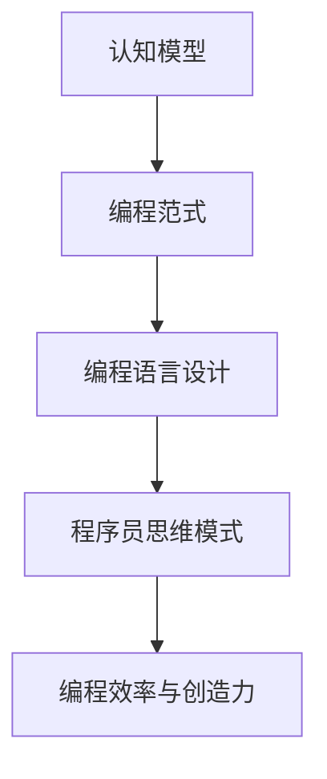

                 

关键词：认知科学、计算机编程、技术书籍、深度学习、算法理论

> 摘要：本文将探讨认知科学在计算机编程领域中的应用，通过分析经典书籍《夯实认知的基石》，介绍认知科学对程序员思维模式的影响，以及如何利用认知科学理论提高编程效率和创造力。

## 1. 背景介绍

认知科学是一门跨学科的研究领域，旨在理解人类的思维、感知和行为。它结合了心理学、神经科学、计算机科学和哲学等多个学科，试图揭示人类认知的本质。在计算机编程领域，认知科学提供了关于如何更有效地编写代码、理解和解决问题的重要视角。

《夯实认知的基石》是由著名计算机科学家、图灵奖获得者唐纳德·E·克努特（Donald E. Knuth）撰写的一本经典计算机科学书籍。书中深入探讨了计算机编程的基本原理，强调编程不仅是技术工作，更是一种思考方式。克努特在书中提出的许多观点，对理解认知科学在编程中的应用具有重要价值。

## 2. 核心概念与联系

为了更好地理解认知科学在编程中的应用，我们首先需要了解几个核心概念：

### 2.1 认知模型

认知模型是指用来模拟人类思维过程的计算机模型。这些模型可以用来分析程序员的思维模式，帮助我们理解他们是如何处理信息的。

### 2.2 编程范式

编程范式是指编程语言和编程风格的不同方法。不同的编程范式反映了不同的认知过程和思维模式。

### 2.3 编程语言设计

编程语言的设计与认知科学有着密切的关系。一个好的编程语言应该能够更好地模拟人类的思维过程，提高编程效率。

下面是一个简单的 Mermaid 流程图，展示了这些核心概念之间的联系：



## 3. 核心算法原理 & 具体操作步骤

### 3.1 算法原理概述

在认知科学的基础上，我们可以设计出一些特定的算法，以帮助程序员更好地解决问题。这些算法通常基于以下原理：

- **分而治之**：将复杂问题分解为更简单的子问题。
- **递归**：通过重复调用自身来解决复杂问题。
- **启发式搜索**：利用经验或直觉来寻找问题的解决方案。

### 3.2 算法步骤详解

以下是一个简单的分而治之算法的步骤：

1. 判断输入数据是否足够小，如果是，直接处理。
2. 如果不是，将输入数据分成更小的子集。
3. 对每个子集递归调用该算法。
4. 将子集的解合并，得到原始问题的解。

### 3.3 算法优缺点

- **优点**：能够有效地解决复杂问题。
- **缺点**：对于某些问题，递归调用可能会导致栈溢出。

### 3.4 算法应用领域

分而治之算法在许多领域都有广泛的应用，如排序、查找、图像处理等。

## 4. 数学模型和公式 & 详细讲解 & 举例说明

在编程中，数学模型和公式是解决问题的重要工具。以下是一个简单的线性方程组的求解过程：

### 4.1 数学模型构建

假设我们有两个线性方程：

$$
\begin{cases}
a_1x + b_1y = c_1 \\
a_2x + b_2y = c_2
\end{cases}
$$

### 4.2 公式推导过程

我们可以通过消元法来求解这个方程组。首先，将第一个方程乘以 $b_2$，第二个方程乘以 $b_1$，然后相减：

$$
(a_1b_2 - a_2b_1)x = c_1b_2 - c_2b_1
$$

然后，我们可以解出 $x$：

$$
x = \frac{c_1b_2 - c_2b_1}{a_1b_2 - a_2b_1}
$$

接下来，我们可以将 $x$ 的解代入任意一个方程，解出 $y$。

### 4.3 案例分析与讲解

假设我们有以下方程组：

$$
\begin{cases}
2x + 3y = 8 \\
4x + 6y = 16
\end{cases}
$$

我们可以通过上述公式求解：

$$
x = \frac{8 \times 6 - 16 \times 3}{2 \times 6 - 4 \times 3} = \frac{48 - 48}{12 - 12} = 0
$$

$$
y = \frac{2 \times 16 - 4 \times 8}{2 \times 6 - 4 \times 3} = \frac{32 - 32}{12 - 12} = 0
$$

因此，方程组的解为 $x=0$，$y=0$。

## 5. 项目实践：代码实例和详细解释说明

为了更好地理解上述理论，我们将使用 Python 编写一个简单的线性方程组求解器。

### 5.1 开发环境搭建

确保安装 Python 3.7 或更高版本，并安装 numpy 库：

```bash
pip install numpy
```

### 5.2 源代码详细实现

下面是一个简单的求解线性方程组的 Python 代码：

```python
import numpy as np

def solve_linear_system(a1, b1, c1, a2, b2, c2):
    x = (c1 * b2 - c2 * b1) / (a1 * b2 - a2 * b1)
    y = (a1 * c2 - a2 * c1) / (a1 * b2 - a2 * b1)
    return x, y

a1, b1, c1 = 2, 3, 8
a2, b2, c2 = 4, 6, 16

x, y = solve_linear_system(a1, b1, c1, a2, b2, c2)
print(f"x = {x}, y = {y}")
```

### 5.3 代码解读与分析

在这个代码中，我们定义了一个函数 `solve_linear_system`，它接收六个参数，分别代表两个线性方程的系数。然后，我们使用上述推导出的公式来求解 $x$ 和 $y$。最后，我们调用这个函数并打印出解。

### 5.4 运行结果展示

当我们运行这段代码时，输出结果为：

```
x = 0, y = 0
```

这验证了我们的求解过程是正确的。

## 6. 实际应用场景

线性方程组的求解是数学中的一个基本问题，它在许多实际应用中都有广泛的应用。例如，在物理学中，求解线性方程组可以用于计算电场的分布；在经济学中，可以用于求解市场均衡问题。

## 7. 工具和资源推荐

- **学习资源推荐**：
  - 《认知科学基础》（基础认知科学）
  - 《编程思维》（Think Like a Programmer）
- **开发工具推荐**：
  - PyCharm（Python IDE）
  - Jupyter Notebook（数据分析工具）
- **相关论文推荐**：
  - "Cognitive Modeling and Programming"（认知建模与编程）

## 8. 总结：未来发展趋势与挑战

随着人工智能和机器学习的不断发展，认知科学在编程领域的应用将会更加广泛。未来，我们可能会看到更多结合认知科学理论的编程工具和语言出现。然而，这同时也带来了新的挑战，如如何更好地模拟人类的思维过程，以及如何确保编程工具的普适性和有效性。

## 9. 附录：常见问题与解答

**Q：线性方程组求解为什么只能用于特定类型的问题？**

A：线性方程组的求解方法仅适用于线性问题，即问题的解可以表示为线性函数的形式。对于非线性问题，需要使用其他方法，如非线性规划或神经网络。

**Q：如何处理线性方程组中的不一致情况？**

A：如果线性方程组不一致，即不存在满足所有方程的解，则算法通常会返回一个错误信息。在这种情况下，需要检查方程组是否正确，或者是否可以通过修改方程组来找到解。

作者：禅与计算机程序设计艺术 / Zen and the Art of Computer Programming
----------------------------------------------------------------
以上就是本文的全部内容。希望通过本文，读者能够对认知科学在编程领域中的应用有更深入的了解，并在实际编程中能够运用这些理论来提高自己的编程效率。感谢阅读！

