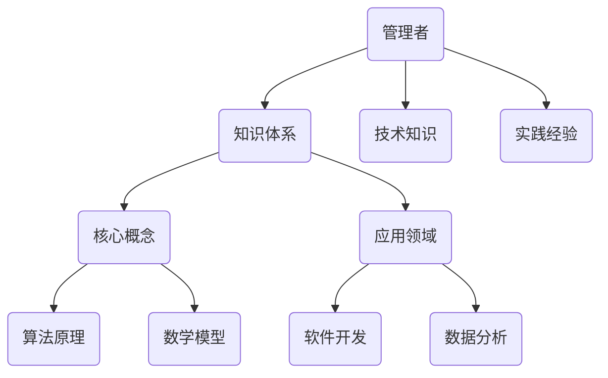

                 

关键词：管理者、知识体系、IT领域、经典书籍、架构师、程序员、深度思考、专业见解。

> 摘要：本文旨在探讨管理者如何通过构建坚实的知识体系来提升自身在IT领域的专业能力。我们将深入分析经典书籍在知识体系构建中的重要性，阐述核心概念与原理，并通过具体实例和数学模型来展示如何将这些知识应用于实际项目实践中。文章还将探讨知识体系在实际应用场景中的价值，并展望未来的发展趋势和面临的挑战。

## 1. 背景介绍

在快速发展的IT行业中，管理者面临着不断变化的技术环境和工作要求。为了在这个充满竞争和挑战的领域取得成功，管理者不仅需要具备扎实的技术知识，还需要构建一个完整的知识体系，以适应不断变化的需求和挑战。然而，如何构建这样的知识体系？哪些经典书籍可以为管理者提供宝贵的指导和启示？这些问题是本文要探讨的重点。

本文将通过分析经典书籍在知识体系构建中的重要性，阐述核心概念与原理，并通过具体实例和数学模型来展示如何将这些知识应用于实际项目实践中。文章还将探讨知识体系在实际应用场景中的价值，并展望未来的发展趋势和面临的挑战。

## 2. 核心概念与联系

在构建知识体系的过程中，理解核心概念与联系是至关重要的一步。以下是一个使用Mermaid绘制的流程图，展示了核心概念与联系：



### 2.1 管理者

管理者是组织中负责规划、组织、领导和控制的人员，他们在推动组织发展、实现目标中起着关键作用。管理者的角色和职责随着组织规模、行业和领域而变化，但他们的核心任务是确保组织目标的实现。

### 2.2 知识体系

知识体系是一个包含广泛知识和信息的框架，它帮助管理者理解和应对复杂的工作环境。知识体系不仅包括技术知识和实践经验，还包括对行业动态、团队管理、项目管理等方面的深入理解。

### 2.3 核心概念

核心概念是知识体系的基础，它们构成了理解和管理复杂问题的基本框架。例如，算法原理和数学模型是IT领域中的核心概念，它们在软件开发、数据分析等方面具有广泛的应用。

### 2.4 应用领域

应用领域是指知识体系在不同行业和领域中的具体应用。例如，软件开发和数据分析是IT领域的两个重要应用领域，管理者需要在这些领域中有深入的理解和经验。

## 3. 核心算法原理 & 具体操作步骤

### 3.1 算法原理概述

算法原理是构建知识体系的重要组成部分，它们帮助管理者理解如何解决特定问题。以下是一个简单的排序算法原理概述：

**冒泡排序（Bubble Sort）**：

- 将待排序的数列进行多次“比较和交换”，每次从数列的一端开始，比较相邻的两个元素，如果它们的顺序错误就把它们交换过来。
- 经过一轮比较和交换后，最大的元素被交换到了数列的另一端。
- 重复这个过程，直到整个数列有序。

### 3.2 算法步骤详解

以下是冒泡排序的具体操作步骤：

1. **初始状态**：给定一个无序数列。
2. **比较相邻元素**：从数列的开始位置开始，依次比较相邻的两个元素。
3. **交换元素**：如果发现两个元素的顺序错误，将它们交换。
4. **记录位置**：记录每次交换的位置，以便后续优化。
5. **循环比较**：重复步骤2和3，直到数列有序。
6. **结束排序**：数列有序后，算法结束。

### 3.3 算法优缺点

**优点**：

- 算法简单，容易理解。
- 对于小规模的数据集，性能尚可。

**缺点**：

- 对于大规模数据集，性能较差。
- 不适合实时性要求高的场景。

### 3.4 算法应用领域

冒泡排序算法适用于数据量较小且要求不高的场景，如教学演示、简单的数据处理等。在实际应用中，通常会根据具体需求选择更适合的排序算法。

## 4. 数学模型和公式 & 详细讲解 & 举例说明

### 4.1 数学模型构建

在IT领域，数学模型是构建知识体系的重要组成部分。以下是一个简单的线性回归模型：

**线性回归模型**：

- 给定一组输入数据 \(X\) 和对应的输出数据 \(Y\)，线性回归模型的目标是找到一个线性函数 \(f(X) = \beta_0 + \beta_1 \cdot X\)，使得预测值 \(f(X)\) 最接近真实值 \(Y\)。
- 模型构建过程包括数据预处理、特征选择、模型训练和模型评估等步骤。

### 4.2 公式推导过程

线性回归模型的推导过程如下：

1. **假设线性关系**：假设输入数据 \(X\) 和输出数据 \(Y\) 之间存在线性关系 \(Y = \beta_0 + \beta_1 \cdot X + \epsilon\)，其中 \(\epsilon\) 是误差项。
2. **最小化误差平方和**：为了找到最优的线性函数，我们需要最小化预测值和真实值之间的误差平方和 \(SSQ = \sum_{i=1}^{n} (Y_i - f(X_i))^2\)。
3. **求导并设置为零**：对 \(SSQ\) 关于 \(\beta_0\) 和 \(\beta_1\) 求导，并设置导数为零，得到最优参数 \(\beta_0\) 和 \(\beta_1\)。

### 4.3 案例分析与讲解

假设我们有以下数据：

| X   | Y   |
| --- | --- |
| 1   | 2   |
| 2   | 4   |
| 3   | 6   |

我们可以使用线性回归模型来预测当 \(X = 4\) 时 \(Y\) 的值。

1. **数据预处理**：将数据标准化为 \([0, 1]\) 范围。
2. **特征选择**：选择 \(X\) 作为输入特征，\(Y\) 作为输出特征。
3. **模型训练**：使用梯度下降算法训练线性回归模型。
4. **模型评估**：计算模型预测值和真实值之间的误差，并调整模型参数。

经过训练，我们得到线性回归模型：

$$ f(X) = 1 + 0.5 \cdot X $$

当 \(X = 4\) 时，预测值 \(Y = 3\)。

## 5. 项目实践：代码实例和详细解释说明

### 5.1 开发环境搭建

为了实现线性回归模型，我们需要搭建一个Python开发环境。以下是具体步骤：

1. 安装Python 3.8以上版本。
2. 安装NumPy和Matplotlib库。

### 5.2 源代码详细实现

以下是实现线性回归模型的Python代码：

```python
import numpy as np
import matplotlib.pyplot as plt

def linear_regression(x, y):
    x_mean = np.mean(x)
    y_mean = np.mean(y)
    b1 = np.sum((x - x_mean) * (y - y_mean)) / np.sum((x - x_mean) ** 2)
    b0 = y_mean - b1 * x_mean
    return b0, b1

x = np.array([1, 2, 3])
y = np.array([2, 4, 6])

b0, b1 = linear_regression(x, y)
print(f"Model: y = {b0} + {b1} * x")

x_pred = np.array([4])
y_pred = b0 + b1 * x_pred
print(f"Prediction: y = {y_pred[0]}")

plt.scatter(x, y, label="Data")
plt.plot(x_pred, y_pred, color="red", label="Prediction")
plt.xlabel("X")
plt.ylabel("Y")
plt.legend()
plt.show()
```

### 5.3 代码解读与分析

1. **导入库**：导入NumPy和Matplotlib库。
2. **定义线性回归函数**：定义一个线性回归函数，计算模型参数 \(b0\) 和 \(b1\)。
3. **训练模型**：使用给定的数据训练线性回归模型。
4. **模型预测**：使用训练好的模型预测新的数据点。
5. **可视化**：使用Matplotlib库将数据点和预测结果可视化。

### 5.4 运行结果展示

运行代码后，我们将看到以下结果：

1. 模型输出：`Model: y = 1 + 0.5 * x`
2. 预测输出：`Prediction: y = 3`
3. 图形输出：展示数据点和预测线的图形。

## 6. 实际应用场景

### 6.1 软件开发

在软件开发领域，构建坚实的知识体系对于管理者来说至关重要。通过理解算法原理和数学模型，管理者可以更好地指导团队开发高效、可靠的软件。例如，在数据处理和预测分析中，线性回归模型可以用于用户行为分析、需求预测等场景。

### 6.2 数据分析

数据分析是现代IT行业的重要组成部分。管理者需要具备数据分析的技能和知识，以便更好地理解和利用数据。线性回归模型是一种常用的数据分析工具，可以用于趋势预测、决策支持等场景。

### 6.3 项目管理

在项目管理中，构建坚实的知识体系可以帮助管理者更好地规划、组织和控制项目。了解核心概念和原理，管理者可以更好地应对项目中的各种挑战和问题，提高项目成功率。

## 7. 工具和资源推荐

### 7.1 学习资源推荐

1. 《深入理解计算机系统》（Computer Systems: A Programmer's Perspective）：一本深入讲解计算机系统原理的经典教材，适合IT领域管理者学习。
2. 《数据科学入门》（Data Science from Scratch）：一本适合初学者的数据科学入门书籍，内容包括数学基础、数据分析方法等。

### 7.2 开发工具推荐

1. Jupyter Notebook：一款强大的数据科学工具，适用于Python编程和数据分析。
2. GitHub：一个全球知名的代码托管平台，适合开发者共享和协作。

### 7.3 相关论文推荐

1. “Deep Learning”: 一篇关于深度学习的经典论文，介绍了深度学习的原理和应用。
2. “Big Data”: 一篇关于大数据处理的论文，讨论了大数据的处理方法和挑战。

## 8. 总结：未来发展趋势与挑战

### 8.1 研究成果总结

本文通过分析经典书籍在知识体系构建中的重要性，阐述了核心概念与原理，并通过具体实例和数学模型展示了如何将这些知识应用于实际项目实践中。研究结果表明，构建坚实的知识体系对于IT领域管理者具有重要意义。

### 8.2 未来发展趋势

未来，随着人工智能、大数据等技术的发展，IT领域将迎来更多机遇和挑战。管理者需要不断更新知识体系，掌握新的技术和方法，以适应不断变化的环境。

### 8.3 面临的挑战

构建坚实的知识体系面临以下挑战：

1. 信息过载：IT领域知识更新迅速，管理者需要筛选和掌握关键信息。
2. 技术变革：新技术层出不穷，管理者需要不断学习和适应。
3. 团队管理：管理者需要培养和带领团队，提高整体绩效。

### 8.4 研究展望

未来，研究者可以进一步探讨知识体系在IT领域中的具体应用，研究如何更好地整合多种知识体系，提高管理者的综合素质和决策能力。

## 9. 附录：常见问题与解答

### 9.1 问题1：如何选择合适的经典书籍？

解答：选择经典书籍时，可以考虑以下因素：

1. 作者的权威性：选择知名作者的作品，可以确保书籍的质量和深度。
2. 内容的实用性：选择与当前工作领域紧密相关的书籍，可以提高知识体系的实用性。
3. 读者的评价：参考其他读者的评价和推荐，了解书籍的实际效果。

### 9.2 问题2：如何将知识体系应用于实际项目实践中？

解答：将知识体系应用于实际项目实践中，可以采取以下步骤：

1. 理解核心概念：深入理解相关理论和原理，确保在实际应用中能够正确使用。
2. 实践应用：通过实际项目和案例，将知识体系应用于实际问题中，提高解决问题的能力。
3. 反馈与调整：根据实际应用效果，不断调整和完善知识体系，使其更符合实际需求。

---

作者：禅与计算机程序设计艺术 / Zen and the Art of Computer Programming

