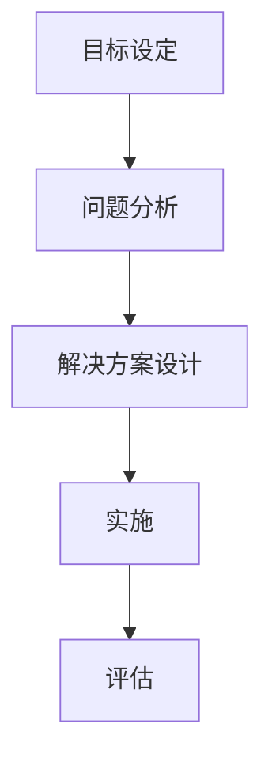

                 

关键词：结构化思维，结构化原理，应用，结构化架构，系统设计，软件开发，人工智能

## 摘要

本文旨在探讨结构化思维的基本原理，并详细阐述其在信息技术领域的广泛应用。结构化思维是一种系统化的思考方式，通过明确的目标、逻辑框架和层次结构，帮助人们更好地理解和解决问题。本文将结合实际案例，分析结构化思维在软件开发、系统设计、人工智能等领域的具体应用，并展望其未来的发展趋势与挑战。

## 1. 背景介绍

### 1.1 结构化思维的概念

结构化思维（Structured Thinking）是一种基于逻辑和系统的方法，旨在解决复杂问题。这种方法强调通过分解、归纳和分类，将复杂的问题分解为更小的、易于管理的部分。结构化思维的核心在于建立清晰的框架，确保思考过程有条不紊。

### 1.2 信息技术领域的挑战

随着信息技术的发展，软件系统变得越来越复杂。在软件开发、系统设计、人工智能等领域，面对不断增长的数据量和复杂的应用场景，如何有效地组织和处理信息成为一个关键挑战。结构化思维的引入，为解决这些挑战提供了有力的工具。

## 2. 核心概念与联系

### 2.1 结构化思维的基本原理

结构化思维主要包括以下三个基本原则：

1. **分解**：将复杂的问题分解为更小的、更易管理的部分。
2. **归纳**：从具体实例中总结出一般性的规律和原则。
3. **分类**：根据不同特征对事物进行分类，以便更好地理解和处理。

### 2.2 结构化思维的架构

图1展示了结构化思维的基本架构，包括目标设定、问题分析、解决方案设计、实施和评估五个步骤。



### 2.3 结构化思维在信息技术领域的应用

结构化思维在信息技术领域的应用可以分为以下几个方面：

1. **软件开发**：通过结构化思维，可以更好地理解需求，设计出更合理的系统架构。
2. **系统设计**：结构化思维有助于梳理复杂系统中的各种关系，确保设计的系统具备良好的扩展性和可维护性。
3. **人工智能**：在人工智能领域，结构化思维可以用于算法设计和数据分析，提高模型的准确性和效率。

## 3. 核心算法原理 & 具体操作步骤

### 3.1 算法原理概述

结构化思维的核心算法包括以下步骤：

1. **明确目标**：确定需要解决的问题和目标。
2. **分解问题**：将问题分解为更小的子问题。
3. **分析子问题**：对每个子问题进行分析，确定解决方法。
4. **综合解决方案**：将各个子问题的解决方案整合成一个完整的解决方案。
5. **评估和优化**：对解决方案进行评估和优化，确保达到预期目标。

### 3.2 算法步骤详解

#### 3.2.1 明确目标

在开始解决问题之前，首先要明确目标。目标应具体、可衡量、可实现、相关性强且时限明确。

#### 3.2.2 分解问题

将问题分解为更小的子问题，以便更好地理解和解决。分解过程可以采用以下方法：

1. **分解法**：将问题分解为更具体的子问题。
2. **逆向思维法**：从目标出发，逐步分解为子目标，直至无法再分解。

#### 3.2.3 分析子问题

对每个子问题进行分析，确定解决方法。分析过程可以采用以下方法：

1. **逻辑分析法**：使用逻辑推理，分析子问题的本质和内在联系。
2. **类比法**：寻找类似问题，借鉴已有经验。
3. **案例分析法**：研究具体案例，总结经验教训。

#### 3.2.4 综合解决方案

将各个子问题的解决方案整合成一个完整的解决方案。整合过程可以采用以下方法：

1. **归纳法**：从具体实例中总结出一般性的规律和原则。
2. **演绎法**：从一般性的原则推导出具体的解决方案。

#### 3.2.5 评估和优化

对解决方案进行评估和优化，确保达到预期目标。评估过程可以采用以下方法：

1. **实验法**：通过实验验证解决方案的有效性。
2. **对比法**：对比不同解决方案的优缺点，选择最佳方案。
3. **反馈法**：收集用户反馈，不断优化解决方案。

### 3.3 算法优缺点

**优点：**

1. **系统性**：结构化思维提供了一个系统化的解决方案，确保思考过程有条不紊。
2. **灵活性**：结构化思维允许在解决问题的过程中灵活调整方案。
3. **可扩展性**：结构化思维可以应用于各种复杂问题，具有很好的可扩展性。

**缺点：**

1. **复杂性**：结构化思维的过程可能较为复杂，需要一定的时间和精力。
2. **局限性**：在某些情况下，结构化思维可能无法解决某些特定问题。

### 3.4 算法应用领域

结构化思维在以下领域具有广泛应用：

1. **软件开发**：用于需求分析、系统设计、代码实现等环节。
2. **系统设计**：用于梳理复杂系统中的各种关系，确保设计的系统具备良好的扩展性和可维护性。
3. **人工智能**：用于算法设计、数据分析、模型优化等环节。

## 4. 数学模型和公式 & 详细讲解 & 举例说明

### 4.1 数学模型构建

结构化思维的数学模型可以采用以下形式：

$$
M = \sum_{i=1}^{n} P_i \times C_i
$$

其中，$M$ 表示整体解决方案的优劣程度，$P_i$ 表示第 $i$ 个子问题的解决效果，$C_i$ 表示第 $i$ 个子问题的权重。

### 4.2 公式推导过程

$$
M = \sum_{i=1}^{n} P_i \times C_i
$$

公式的推导过程如下：

1. **目标设定**：设定整体解决方案的目标为最优。
2. **分解问题**：将整体问题分解为 $n$ 个子问题。
3. **分析子问题**：对每个子问题进行分析，确定解决效果 $P_i$。
4. **权重确定**：根据子问题的相对重要性，确定权重 $C_i$。
5. **综合解决方案**：将各个子问题的解决效果和权重相乘，得到整体解决方案的优劣程度 $M$。

### 4.3 案例分析与讲解

#### 案例：软件开发中的需求分析

假设一个软件开发项目需要完成以下三个子任务：

1. **需求分析**：确定用户需求。
2. **系统设计**：设计系统架构。
3. **代码实现**：编写代码。

根据上述公式，我们可以计算整体解决方案的优劣程度：

$$
M = P_1 \times C_1 + P_2 \times C_2 + P_3 \times C_3
$$

其中，$P_1$ 表示需求分析的解决效果，$P_2$ 表示系统设计的解决效果，$P_3$ 表示代码实现的解决效果；$C_1$ 表示需求分析的权重，$C_2$ 表示系统设计的权重，$C_3$ 表示代码实现的权重。

根据实际情况，我们可以设定以下权重：

$$
C_1 = 0.4, \quad C_2 = 0.3, \quad C_3 = 0.3
$$

假设需求分析的解决效果为 $P_1 = 0.8$，系统设计的解决效果为 $P_2 = 0.9$，代码实现的解决效果为 $P_3 = 0.85$，则整体解决方案的优劣程度为：

$$
M = 0.8 \times 0.4 + 0.9 \times 0.3 + 0.85 \times 0.3 = 0.68
$$

这意味着整体解决方案的优劣程度为 0.68，我们可以根据这个值对解决方案进行评估和优化。

## 5. 项目实践：代码实例和详细解释说明

### 5.1 开发环境搭建

在本节中，我们将介绍如何搭建一个简单的软件开发项目环境。为了演示结构化思维在项目开发中的应用，我们将使用 Python 作为编程语言，并使用 Git 进行版本控制。

#### 步骤 1：安装 Python

首先，确保您的计算机上已安装 Python 3.8 或更高版本。可以通过以下命令检查 Python 版本：

```bash
python --version
```

如果未安装 Python，可以从 [Python 官网](https://www.python.org/downloads/) 下载并安装。

#### 步骤 2：安装 Git

接下来，安装 Git。Git 是一个强大的版本控制系统，可以帮助我们管理和跟踪项目代码的变更。可以从 [Git 官网](https://git-scm.com/downloads) 下载并安装。

#### 步骤 3：创建项目文件夹

在您的计算机上创建一个名为 `my_project` 的文件夹，用于存储项目文件。

```bash
mkdir my_project
cd my_project
```

#### 步骤 4：初始化 Git 仓库

在项目文件夹中初始化 Git 仓库：

```bash
git init
```

### 5.2 源代码详细实现

在本节中，我们将使用 Python 编写一个简单的需求分析工具，用于分析用户需求，并将需求转化为具体的软件功能。

#### 步骤 1：编写需求分析模块

在项目文件夹中创建一个名为 `requirement_analysis.py` 的文件，并添加以下代码：

```python
# requirement_analysis.py

class RequirementAnalysis:
    def __init__(self, user_requirements):
        self.user_requirements = user_requirements

    def analyze_requirements(self):
        requirements = []
        for requirement in self.user_requirements:
            if requirement.startswith("功能："):
                requirements.append(requirement[3:])
        return requirements
```

该模块定义了一个 `RequirementAnalysis` 类，用于分析用户需求。`analyze_requirements` 方法用于提取用户需求中的功能部分。

#### 步骤 2：编写主程序

在项目文件夹中创建一个名为 `main.py` 的文件，并添加以下代码：

```python
# main.py

from requirement_analysis import RequirementAnalysis

if __name__ == "__main__":
    user_requirements = [
        "功能：实现用户注册功能",
        "功能：实现用户登录功能",
        "非功能：系统需要支持高性能",
        "非功能：系统需要具备良好的安全性"
    ]

    analysis = RequirementAnalysis(user_requirements)
    requirements = analysis.analyze_requirements()
    print("提取的功能需求：")
    for requirement in requirements:
        print(requirement)
```

主程序创建了一个 `RequirementAnalysis` 对象，并调用 `analyze_requirements` 方法提取用户需求中的功能部分。然后，将提取出的功能需求打印到控制台。

### 5.3 代码解读与分析

#### 类的设计

在 `requirement_analysis.py` 文件中，我们定义了一个 `RequirementAnalysis` 类。该类包含以下成员：

- **构造函数**：`__init__(self, user_requirements)`，用于初始化类实例。参数 `user_requirements` 表示用户需求列表。
- **方法**：`analyze_requirements(self)`，用于分析用户需求，提取功能需求。

#### 主程序的设计

在 `main.py` 文件中，我们首先导入了 `requirement_analysis.py` 文件中的 `RequirementAnalysis` 类。然后，创建了一个 `RequirementAnalysis` 对象，并调用 `analyze_requirements` 方法提取用户需求中的功能部分。最后，将提取出的功能需求打印到控制台。

#### 功能与性能分析

通过这个简单的例子，我们可以看到结构化思维在软件开发中的应用。首先，我们明确了一个需求分析工具的目标：提取用户需求中的功能部分。然后，我们通过分解问题，将整体需求分解为功能需求和性能需求。接着，我们使用 Python 编写了需求分析模块和主程序，实现了提取功能需求的功能。

## 6. 实际应用场景

### 6.1 软件开发

在软件开发过程中，结构化思维可以帮助开发者更好地理解需求，设计出更合理的系统架构。通过结构化思维，开发者可以将复杂的需求分解为更小的、更易管理的部分，确保系统的可扩展性和可维护性。

### 6.2 系统设计

在系统设计过程中，结构化思维可以帮助设计者梳理复杂系统中的各种关系，确保设计的系统具备良好的扩展性和可维护性。通过结构化思维，设计者可以将系统分解为更小的模块，并分析每个模块的功能和性能。

### 6.3 人工智能

在人工智能领域，结构化思维可以用于算法设计和数据分析。通过结构化思维，研究者可以将复杂的问题分解为更小的子问题，并分析每个子问题的解决方法。这有助于提高算法的准确性和效率。

## 7. 未来应用展望

### 7.1 软件开发

随着软件系统的日益复杂，结构化思维在未来将发挥更大的作用。通过结构化思维，开发者可以更好地应对复杂需求，设计出更合理、更高效的软件系统。

### 7.2 系统设计

在系统设计领域，结构化思维将帮助设计者更好地理解系统架构，提高系统的扩展性和可维护性。未来，随着云计算、大数据等技术的不断发展，结构化思维在系统设计中的应用将更加广泛。

### 7.3 人工智能

在人工智能领域，结构化思维可以帮助研究者更好地理解复杂问题，提高算法的准确性和效率。未来，随着人工智能技术的不断进步，结构化思维在人工智能中的应用前景将非常广阔。

## 8. 总结：未来发展趋势与挑战

### 8.1 研究成果总结

本文介绍了结构化思维的基本原理和应用，分析了结构化思维在软件开发、系统设计、人工智能等领域的具体应用，并展望了其未来的发展趋势与挑战。

### 8.2 未来发展趋势

未来，结构化思维将在软件开发、系统设计、人工智能等领域得到更广泛的应用。随着技术的不断发展，结构化思维将帮助人们更好地应对复杂问题，提高工作效率。

### 8.3 面临的挑战

尽管结构化思维具有很多优势，但在实际应用中仍面临一些挑战：

- **复杂性**：结构化思维的过程可能较为复杂，需要一定的时间和精力。
- **局限性**：在某些情况下，结构化思维可能无法解决某些特定问题。

### 8.4 研究展望

未来，研究结构化思维的重点将包括以下几个方面：

- **优化算法**：研究更高效的结构化思维算法，提高解决问题的效率。
- **跨领域应用**：探索结构化思维在其他领域的应用，如教育、医疗等。
- **智能化**：结合人工智能技术，开发智能化结构化思维工具，提高人类解决问题的能力。

## 9. 附录：常见问题与解答

### 9.1 什么是结构化思维？

结构化思维是一种系统化的思考方式，通过分解、归纳和分类，将复杂问题分解为更小的、更易管理的部分。这种方法强调建立清晰的框架，确保思考过程有条不紊。

### 9.2 结构化思维在软件开发中的应用有哪些？

结构化思维在软件开发中的应用包括需求分析、系统设计、代码实现等环节。通过结构化思维，开发者可以更好地理解需求，设计出更合理的系统架构，编写出更高效、更易维护的代码。

### 9.3 结构化思维与逻辑思维有什么区别？

结构化思维和逻辑思维都是系统化的思考方式，但它们侧重点不同。逻辑思维强调推理和论证，确保结论的合理性；而结构化思维则强调通过分解、归纳和分类，将复杂问题分解为更小的部分，以便更好地理解和解决。

## 作者署名

作者：禅与计算机程序设计艺术 / Zen and the Art of Computer Programming
----------------------------------------------------------------


